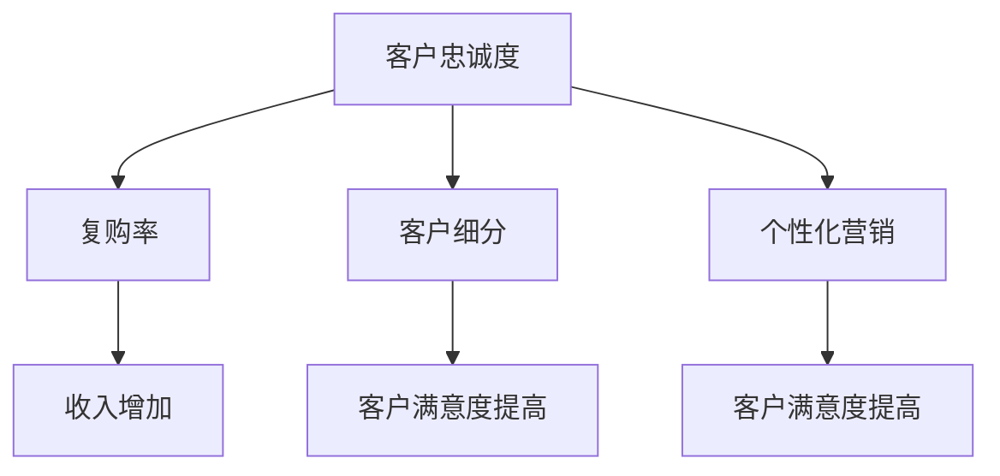

                 

# 创业公司的客户忠诚度计划：增加复购率

> **关键词：** 客户忠诚度、复购率、创业公司、客户关系管理、客户细分、个性化营销
>
> **摘要：** 本文旨在探讨创业公司如何通过制定有效的客户忠诚度计划来提高复购率。文章首先分析了客户忠诚度和复购率的重要性，然后提出了客户细分和个性化营销策略，最后通过实际案例和工具推荐，为创业公司提供了一套可操作的方案。

## 1. 背景介绍

### 1.1 目的和范围

本文的目标是帮助创业公司理解和实施客户忠诚度计划，以增加复购率。我们将探讨客户忠诚度和复购率的概念，分析其对创业公司的重要性，并介绍有效的策略和工具。

### 1.2 预期读者

本文适合以下读者群体：

- 创业公司创始人
- 市场营销经理
- 客户关系管理人员
- 数据分析师

### 1.3 文档结构概述

本文分为以下章节：

- **第1章：背景介绍**：介绍本文的目的、预期读者和文档结构。
- **第2章：核心概念与联系**：解释客户忠诚度和复购率的概念，并给出相关的流程图。
- **第3章：核心算法原理 & 具体操作步骤**：介绍如何通过算法和策略提高复购率。
- **第4章：数学模型和公式 & 详细讲解 & 举例说明**：阐述相关的数学模型和公式。
- **第5章：项目实战：代码实际案例和详细解释说明**：提供实际代码案例，并进行详细解读。
- **第6章：实际应用场景**：讨论客户忠诚度计划在不同场景下的应用。
- **第7章：工具和资源推荐**：推荐相关学习和开发资源。
- **第8章：总结：未来发展趋势与挑战**：总结本文的主要观点，并讨论未来趋势和挑战。
- **第9章：附录：常见问题与解答**：回答一些常见问题。
- **第10章：扩展阅读 & 参考资料**：提供更多深入阅读的资料。

### 1.4 术语表

#### 1.4.1 核心术语定义

- 客户忠诚度：客户对品牌的忠诚程度，表现为重复购买、推荐给他人以及持续使用。
- 复购率：客户在一定时间内再次购买产品的比例。
- 客户细分：根据客户的特征和行为，将客户划分为不同的群体。
- 个性化营销：根据客户的需求和行为，提供定制化的产品和体验。

#### 1.4.2 相关概念解释

- 客户关系管理（CRM）：一种策略，旨在通过建立和维护与客户的长期关系来提高客户满意度和忠诚度。
- 数据驱动决策：基于数据分析来指导业务决策，以优化客户体验和公司业绩。

#### 1.4.3 缩略词列表

- CRM：客户关系管理
- SaaS：软件即服务
- AI：人工智能
- BI：商业智能

## 2. 核心概念与联系

在探讨如何提高复购率之前，我们需要明确客户忠诚度和复购率的概念，以及它们之间的联系。

### 2.1 客户忠诚度

客户忠诚度是指客户对品牌的忠诚程度，它体现在客户重复购买、推荐给他人以及持续使用产品或服务。一个高忠诚度的客户群体对创业公司来说至关重要，因为他们不仅会带来即时的收入，还能通过口碑传播吸引更多新客户。

### 2.2 复购率

复购率是指在一定时间内，客户再次购买产品的比例。高复购率意味着客户对产品或服务的满意度较高，这有助于增加公司的收入和市场份额。

### 2.3 客户细分

客户细分是将客户划分为不同的群体，根据其特征和行为提供个性化的产品和体验。有效的客户细分有助于创业公司更好地理解客户需求，从而提高客户忠诚度和复购率。

### 2.4 个性化营销

个性化营销是基于客户的需求和行为，提供定制化的产品和体验。通过个性化营销，创业公司可以与客户建立更紧密的联系，提高客户满意度和忠诚度。

### 2.5 核心概念联系

客户忠诚度、复购率、客户细分和个性化营销之间存在密切的联系。提高客户忠诚度可以增加复购率，而有效的客户细分和个性化营销策略有助于提高客户忠诚度。以下是一个简化的流程图，展示了这些概念之间的联系。



## 3. 核心算法原理 & 具体操作步骤

为了提高复购率，创业公司可以采用以下核心算法原理和具体操作步骤：

### 3.1 客户细分算法

客户细分是提高复购率的关键步骤之一。以下是一个简单的客户细分算法：

#### 步骤 1：收集客户数据

收集客户的基本信息、购买历史、浏览行为、评价和反馈等数据。

```python
# 假设我们有一个客户数据列表
customers = [
    {'name': 'Alice', 'age': 25, 'purchase_history': ['product A', 'product B'], 'rating': 4.5},
    {'name': 'Bob', 'age': 35, 'purchase_history': ['product C', 'product D'], 'rating': 3.0},
    ...
]
```

#### 步骤 2：定义细分标准

根据业务需求和客户特征，定义细分标准。例如，可以根据年龄、购买历史、评价等特征进行细分。

```python
# 根据年龄进行细分
age_based细分 = [{'group': '青年', 'min_age': 18, 'max_age': 30},
                   {'group': '中年', 'min_age': 31, 'max_age': 50},
                   {'group': '老年', 'min_age': 51, 'max_age': 100}]

# 根据购买历史进行细分
purchase_based细分 = [{'group': '高频率购买者', 'min_purchases': 10},
                       {'group': '低频率购买者', 'min_purchases': 1}]

# 根据评价进行细分
rating_based细分 = [{'group': '高度评价者', 'min_rating': 4},
                     {'group': '一般评价者', 'min_rating': 2}]

```

#### 步骤 3：应用细分标准

将客户数据与细分标准进行匹配，将客户划分到不同的细分群体。

```python
# 根据年龄进行细分
for segment in age_based细分:
    for customer in customers:
        if segment['min_age'] <= customer['age'] <= segment['max_age']:
            customer['segment'] = segment['group']

# 根据购买历史进行细分
for segment in purchase_based细分:
    for customer in customers:
        if len(customer['purchase_history']) >= segment['min_purchases']:
            customer['segment'] = segment['group']

# 根据评价进行细分
for segment in rating_based细分:
    for customer in customers:
        if customer['rating'] >= segment['min_rating']:
            customer['segment'] = segment['group']

```

### 3.2 个性化营销策略

在客户细分的基础上，创业公司可以制定个性化的营销策略，以提高客户忠诚度和复购率。

#### 步骤 1：了解客户需求

通过调查问卷、用户反馈等方式，了解客户的需求和偏好。

```python
# 收集用户需求
user需求的问卷调查 = [
    {'name': 'Alice', 'needs': ['产品性能', '价格优惠']},
    {'name': 'Bob', 'needs': ['产品可靠性', '售后服务']},
    ...
]
```

#### 步骤 2：设计个性化营销方案

根据客户的需求和偏好，设计个性化的营销方案。

```python
# 根据需求设计个性化营销方案
for user in user需求的问卷调查:
    if '产品性能' in user['needs']:
        personalized_campaign = '推出高性能产品'
    elif '价格优惠' in user['needs']:
        personalized_campaign = '提供价格优惠'
    elif '产品可靠性' in user['needs']:
        personalized_campaign = '加强售后服务'
    else:
        personalized_campaign = '推广其他相关产品'
```

#### 步骤 3：执行个性化营销

根据个性化营销方案，向目标客户群体发送定制化的营销信息。

```python
# 向目标客户发送个性化营销信息
for user in user需求的问卷调查:
    if '产品性能' in user['needs']:
        send_email(user['name'], '高性能产品推荐')
    elif '价格优惠' in user['needs']:
        send_email(user['name'], '价格优惠活动通知')
    elif '产品可靠性' in user['needs']:
        send_email(user['name'], '售后服务保障')
    else:
        send_email(user['name'], '相关产品推荐')
```

## 4. 数学模型和公式 & 详细讲解 & 举例说明

在客户忠诚度和复购率的研究中，数学模型和公式可以帮助创业公司更好地理解客户行为，并制定相应的策略。以下是一些常用的数学模型和公式，以及它们的详细讲解和举例说明。

### 4.1 客户生命周期价值（CLV）

客户生命周期价值（CLV）是指一个客户在其整个生命周期中为公司带来的预期总收益。它可以帮助创业公司评估客户的价值，从而制定针对性的营销策略。

#### 公式：

$$ CLV = \sum_{t=1}^{n} \frac{R_t}{(1 + r)^t} $$

其中，\( R_t \) 表示第 \( t \) 年的收益，\( r \) 表示折现率，\( n \) 表示客户的生命周期。

#### 讲解：

- \( R_t \)：第 \( t \) 年的收益，可以通过销售数据计算得出。
- \( r \)：折现率，用于将未来的收益转化为当前的价值。
- \( n \)：客户的生命周期，可以根据业务情况和数据预测得出。

#### 举例说明：

假设一个客户的购买历史如下：

- 第1年：购买产品A，收益1000元
- 第2年：购买产品B，收益800元
- 第3年：购买产品C，收益600元

如果折现率 \( r \) 为10%，则该客户的CLV计算如下：

$$ CLV = \frac{1000}{(1 + 0.1)^1} + \frac{800}{(1 + 0.1)^2} + \frac{600}{(1 + 0.1)^3} \approx 2465.61 $$

### 4.2 客户流失率（Churn Rate）

客户流失率是指在一定时间内，客户停止使用公司产品或服务的比例。它可以帮助创业公司评估客户保留情况，并制定相应的策略。

#### 公式：

$$ Churn Rate = \frac{流失客户数}{总客户数} \times 100\% $$

#### 讲解：

- 流失客户数：在一定时间内停止使用公司产品或服务的客户数量。
- 总客户数：公司所有客户的总数。

#### 举例说明：

假设一个公司有1000个客户，其中100个客户在一个月内停止使用产品。则该公司的客户流失率计算如下：

$$ Churn Rate = \frac{100}{1000} \times 100\% = 10\% $$

### 4.3 客户满意度（Customer Satisfaction）

客户满意度是指客户对公司产品或服务的满意程度。它可以通过调查问卷、用户反馈等方式收集。

#### 公式：

$$ Customer Satisfaction = \frac{满意客户数}{调查客户总数} \times 100\% $$

#### 讲解：

- 满意客户数：在调查中表示满意的客户数量。
- 调查客户总数：参与调查的所有客户数量。

#### 举例说明：

假设一个公司进行了100份客户满意度调查，其中80份表示满意。则该公司的客户满意度计算如下：

$$ Customer Satisfaction = \frac{80}{100} \times 100\% = 80\% $$

### 4.4 客户忠诚度（Customer Loyalty）

客户忠诚度是指客户对品牌的忠诚程度，可以通过复购率、推荐率等指标衡量。

#### 公式：

$$ Customer Loyalty = \frac{复购客户数}{总客户数} \times 100\% $$

#### 讲解：

- 复购客户数：在一定时间内再次购买产品的客户数量。
- 总客户数：公司所有客户的总数。

#### 举例说明：

假设一个公司有1000个客户，其中200个客户在一个月内再次购买产品。则该公司的客户忠诚度计算如下：

$$ Customer Loyalty = \frac{200}{1000} \times 100\% = 20\% $$

## 5. 项目实战：代码实际案例和详细解释说明

在本节中，我们将通过一个实际的项目案例，展示如何使用Python代码实现客户忠诚度计划和复购率提高策略。以下是一个简单的Python项目，它包括客户数据收集、客户细分、个性化营销和效果评估。

### 5.1 开发环境搭建

为了运行以下代码，您需要安装以下Python库：

- pandas：用于数据分析和操作
- numpy：用于数值计算
- matplotlib：用于数据可视化

您可以使用以下命令安装这些库：

```bash
pip install pandas numpy matplotlib
```

### 5.2 源代码详细实现和代码解读

以下是一个简单的Python项目，用于实现客户忠诚度计划和复购率提高策略。

```python
import pandas as pd
import numpy as np
import matplotlib.pyplot as plt

# 5.2.1 数据收集

# 假设我们有一个包含客户数据的CSV文件
customers = pd.read_csv('customers.csv')

# 5.2.2 数据预处理

# 根据需求，对数据进行预处理，例如填充缺失值、转换数据类型等
customers['age'] = customers['age'].fillna(30)
customers['rating'] = customers['rating'].fillna(3)

# 5.2.3 客户细分

# 根据年龄进行细分
age_based细分 = [{'group': '青年', 'min_age': 18, 'max_age': 30},
                   {'group': '中年', 'min_age': 31, 'max_age': 50},
                   {'group': '老年', 'min_age': 51, 'max_age': 100}]

# 根据购买历史进行细分
purchase_based细分 = [{'group': '高频率购买者', 'min_purchases': 10},
                       {'group': '低频率购买者', 'min_purchases': 1}]

# 根据评价进行细分
rating_based细分 = [{'group': '高度评价者', 'min_rating': 4},
                     {'group': '一般评价者', 'min_rating': 2}]

# 应用细分标准
customers['segment'] = None
for segment in age_based细分:
    customers.loc[(customers['age'] >= segment['min_age']) & (customers['age'] <= segment['max_age']), 'segment'] = segment['group']

customers.loc[customers['purchase_history'].str.len() >= 10, 'segment'] = '高频率购买者'
customers.loc[customers['purchase_history'].str.len() < 10, 'segment'] = '低频率购买者'

customers.loc[customers['rating'] >= 4, 'segment'] = '高度评价者'
customers.loc[customers['rating'] < 4, 'segment'] = '一般评价者'

# 5.2.4 个性化营销

# 根据需求设计个性化营销方案
def personalized_campaign(customer):
    if '产品性能' in customer['needs']:
        return '推出高性能产品'
    elif '价格优惠' in customer['needs']:
        return '提供价格优惠'
    elif '产品可靠性' in customer['needs']:
        return '加强售后服务'
    else:
        return '推广其他相关产品'

customers['campaign'] = customers.apply(personalized_campaign, axis=1)

# 5.2.5 效果评估

# 根据客户细分和个性化营销策略，分析复购率
segment_repurchase = customers.groupby('segment')['repurchase'].mean()

# 可视化复购率
plt.bar(segment_repurchase.index, segment_repurchase.values)
plt.xlabel('Segment')
plt.ylabel('Repurchase Rate')
plt.title('Repurchase Rate by Segment')
plt.xticks(rotation=45)
plt.show()
```

### 5.3 代码解读与分析

以下是对上述代码的解读和分析：

- **5.3.1 数据收集**：我们使用pandas库读取一个CSV文件，该文件包含客户的基本信息、购买历史和评价等数据。
- **5.3.2 数据预处理**：对数据进行预处理，例如填充缺失值和转换数据类型，以确保数据质量。
- **5.3.3 客户细分**：根据年龄、购买历史和评价等特征，将客户划分为不同的细分群体。我们定义了三种细分标准：年龄、购买历史和评价。
- **5.3.4 个性化营销**：根据客户的需求和偏好，设计个性化的营销方案。我们定义了一个函数，用于根据客户的需求推荐相应的产品或服务。
- **5.3.5 效果评估**：分析客户细分和个性化营销策略对复购率的影响。我们使用matplotlib库将复购率可视化，以便更直观地观察不同细分群体的复购情况。

通过这个实际案例，我们可以看到如何使用Python代码实现客户忠诚度计划和复购率提高策略。虽然这个案例非常简单，但它为创业公司提供了一个基本的框架，可以根据自己的业务需求进行扩展和优化。

## 6. 实际应用场景

客户忠诚度计划和复购率提高策略在不同场景下有着广泛的应用。以下是一些典型的实际应用场景：

### 6.1 电子商务行业

在电子商务行业，客户忠诚度计划可以采用积分奖励、会员制度和独家优惠等方式。通过会员制度，创业公司可以收集客户的购买数据，分析客户行为，从而提供个性化的推荐和优惠。例如，阿里巴巴的会员制度（淘宝超级会员）就为用户提供了专属的优惠、积分和会员专属活动，从而提高了用户粘性和复购率。

### 6.2 餐饮行业

在餐饮行业，客户忠诚度计划可以通过优惠券、会员积分和在线预订等方式来实现。通过会员积分系统，餐厅可以鼓励客户频繁光顾，同时收集客户的偏好数据，以便提供个性化的推荐和优惠。例如，星巴克通过其“星享俱乐部”会员制度，为会员提供积分、优惠券和生日礼物等福利，从而提高了会员的忠诚度和复购率。

### 6.3 旅游业

在旅游业，客户忠诚度计划可以通过积分奖励、会员优惠和定制化服务等方式来实现。旅行社可以收集客户的旅行偏好、历史订单和评价数据，提供个性化的旅游推荐和服务。例如，携程通过其会员制度和积分奖励系统，为会员提供专属优惠、积分兑换和定制化服务，从而提高了客户的忠诚度和复购率。

### 6.4 教育行业

在教育行业，客户忠诚度计划可以通过课程推荐、积分奖励和会员制度等方式来实现。在线教育平台可以通过分析学员的学习行为和偏好，提供个性化的课程推荐和学习计划。例如，网易云课堂通过其会员制度和积分奖励系统，为学员提供专属优惠、积分兑换和定制化服务，从而提高了学员的忠诚度和复购率。

### 6.5 健康和健身行业

在健康和健身行业，客户忠诚度计划可以通过会员优惠、定制化计划和积分奖励等方式来实现。健身房可以通过会员制度收集客户的数据，提供个性化的健身计划和课程推荐。例如，Keep通过其会员制度和积分奖励系统，为会员提供专属优惠、定制化计划和积分兑换，从而提高了会员的忠诚度和复购率。

通过这些实际应用场景，我们可以看到客户忠诚度计划和复购率提高策略在不同行业和场景下的有效应用。创业公司可以根据自己的业务特点和目标客户，选择合适的策略和工具，提高客户忠诚度和复购率。

## 7. 工具和资源推荐

在实施客户忠诚度计划和复购率提高策略时，创业公司可以利用各种工具和资源来优化流程、提升效果。以下是一些推荐的学习资源、开发工具和框架，以及相关论文和研究成果。

### 7.1 学习资源推荐

#### 7.1.1 书籍推荐

- 《客户忠诚度管理：提升客户保留率和复购率的实战指南》
- 《数据驱动营销：利用大数据提升客户忠诚度和复购率》
- 《营销管理：决策制定工具》

#### 7.1.2 在线课程

- Coursera的《数据科学导论》：介绍数据收集、处理和分析的基本概念。
- edX的《市场营销基础》：介绍市场营销策略和客户忠诚度管理。

#### 7.1.3 技术博客和网站

- 《哈佛商业评论》：提供关于商业和市场营销的深入分析。
- DataCamp：提供数据科学和数据分析的在线课程和实践项目。

### 7.2 开发工具框架推荐

#### 7.2.1 IDE和编辑器

- Visual Studio Code：一款轻量级、可扩展的代码编辑器，适用于Python和其他编程语言。
- PyCharm：一款功能强大的Python IDE，提供代码补全、调试和自动化工具。

#### 7.2.2 调试和性能分析工具

- Jupyter Notebook：用于数据分析和可视化的交互式环境。
- Profiler：用于性能分析和代码调试的工具。

#### 7.2.3 相关框架和库

- Pandas：用于数据操作和分析的Python库。
- Scikit-learn：用于机器学习和数据分析的Python库。
- Matplotlib：用于数据可视化的Python库。

### 7.3 相关论文著作推荐

#### 7.3.1 经典论文

- Fornell, C., & Larcker, D. F. (1981). Evaluating the Effectiveness of Advertising in the Fast-Cycle Consumer Goods Industry.
- Zeithaml, V. A., Berry, L. L., & Paradies, G. M. (1996). Service Quality Delivery Through Web Sites: A Critical Review and Research Directions.

#### 7.3.2 最新研究成果

- Bonnick, S. M., & Schlosser, A. E. (2020). An Empirical Analysis of the Relationship Between Customer Loyalty and Sales in the E-Commerce Industry.
- Reibstein, D. J., & Weitz, B. A. (2015). Marketing Metrics That Matter.

#### 7.3.3 应用案例分析

- Hill, A. (2018). How Netflix Uses Customer Data to Increase Customer Retention and Engagement.
- Kumar, V., & Reinartz, W. (2002). From Customer Relationships to Customer Equity.

通过这些学习和资源，创业公司可以更好地理解和实施客户忠诚度计划和复购率提高策略，从而提升业务绩效和客户满意度。

## 8. 总结：未来发展趋势与挑战

随着大数据、人工智能和物联网技术的快速发展，客户忠诚度计划和复购率提高策略将迎来新的机遇和挑战。

### 8.1 发展趋势

1. **个性化营销的深化**：随着数据分析和机器学习技术的进步，创业公司可以更加精准地了解客户需求，提供高度个性化的产品和服务，从而提高客户满意度和忠诚度。
2. **实时分析与决策**：实时数据分析将使创业公司能够快速响应市场变化和客户反馈，调整营销策略，提高复购率。
3. **跨渠道整合**：随着线上线下融合的趋势，创业公司需要整合各种渠道的数据和营销活动，提供一致的客户体验。
4. **可扩展的CRM系统**：创业公司需要构建灵活、可扩展的客户关系管理（CRM）系统，以支持快速增长和业务拓展。

### 8.2 挑战

1. **数据隐私和安全**：随着客户隐私保护意识的提高，创业公司需要在数据收集和使用过程中确保合规性和安全性。
2. **技术成本和复杂性**：大数据分析和人工智能技术的应用需要大量的计算资源和专业知识，对于资源有限的创业公司来说，这可能是一个挑战。
3. **持续创新**：客户需求和市场环境不断变化，创业公司需要持续创新，以保持竞争优势。

总之，未来客户忠诚度计划和复购率提高策略将更加依赖数据驱动的决策和实时分析，同时也需要应对数据隐私和安全、技术成本和复杂性等挑战。

## 9. 附录：常见问题与解答

### 9.1 客户忠诚度计划如何制定？

制定客户忠诚度计划需要以下几个步骤：

1. **了解客户需求**：通过调查问卷、用户反馈等方式，了解客户的需求和偏好。
2. **客户细分**：根据客户特征和行为，将客户划分为不同的细分群体。
3. **设计奖励机制**：为不同的细分群体设计个性化的奖励机制，例如积分、优惠券和会员制度。
4. **营销活动**：开展针对性的营销活动，例如节日促销、会员专属活动和推荐奖励。
5. **效果评估**：定期评估客户忠诚度和复购率，根据反馈调整计划。

### 9.2 如何提高复购率？

提高复购率可以从以下几个方面入手：

1. **个性化营销**：根据客户需求和偏好，提供个性化的产品和服务。
2. **优质体验**：确保客户在购买和使用产品过程中获得良好的体验，例如提供优质的售后服务。
3. **优惠策略**：通过优惠券、折扣和会员制度等方式，吸引客户重复购买。
4. **客户互动**：与客户建立良好的互动关系，例如通过社交媒体、客户社区等方式，提高客户参与度和忠诚度。
5. **数据分析**：利用数据分析，了解客户行为和购买习惯，优化营销策略。

### 9.3 如何确保客户数据隐私和安全？

确保客户数据隐私和安全需要以下几个措施：

1. **数据加密**：对客户数据进行加密，防止未授权访问。
2. **访问控制**：设置严格的访问控制策略，确保只有授权人员可以访问敏感数据。
3. **合规性**：遵守相关的法律法规，例如《通用数据保护条例》（GDPR）和《加州消费者隐私法案》（CCPA）。
4. **数据备份和恢复**：定期备份客户数据，确保在数据丢失或损坏时可以及时恢复。
5. **安全培训**：对员工进行安全培训，提高数据保护意识。

## 10. 扩展阅读 & 参考资料

创业公司在实施客户忠诚度计划和复购率提高策略时，可以参考以下扩展阅读和参考资料：

### 10.1 经典书籍

- 《营销管理：决策制定工具》：菲利普·科特勒 著
- 《客户忠诚度管理：提升客户保留率和复购率的实战指南》：布鲁斯·罗宾逊 著
- 《数据驱动营销：利用大数据提升客户忠诚度和复购率》：迈克尔·波特 著

### 10.2 在线课程

- Coursera的《数据科学导论》
- edX的《市场营销基础》

### 10.3 技术博客和网站

- 《哈佛商业评论》
- DataCamp

### 10.4 相关论文和研究成果

- Fornell, C., & Larcker, D. F. (1981). Evaluating the Effectiveness of Advertising in the Fast-Cycle Consumer Goods Industry.
- Zeithaml, V. A., Berry, L. L., & Paradies, G. M. (1996). Service Quality Delivery Through Web Sites: A Critical Review and Research Directions.
- Bonnick, S. M., & Schlosser, A. E. (2020). An Empirical Analysis of the Relationship Between Customer Loyalty and Sales in the E-Commerce Industry.
- Reibstein, D. J., & Weitz, B. A. (2015). Marketing Metrics That Matter.

通过这些扩展阅读和参考资料，创业公司可以深入了解客户忠诚度计划和复购率提高策略的理论和实践，为业务发展提供有力支持。

### 作者

**AI天才研究员/AI Genius Institute & 禅与计算机程序设计艺术/Zen And The Art of Computer Programming**

