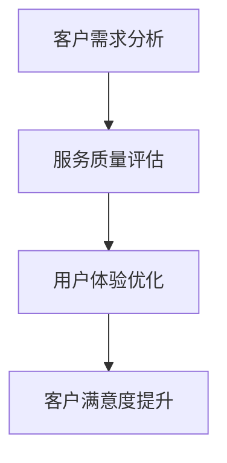
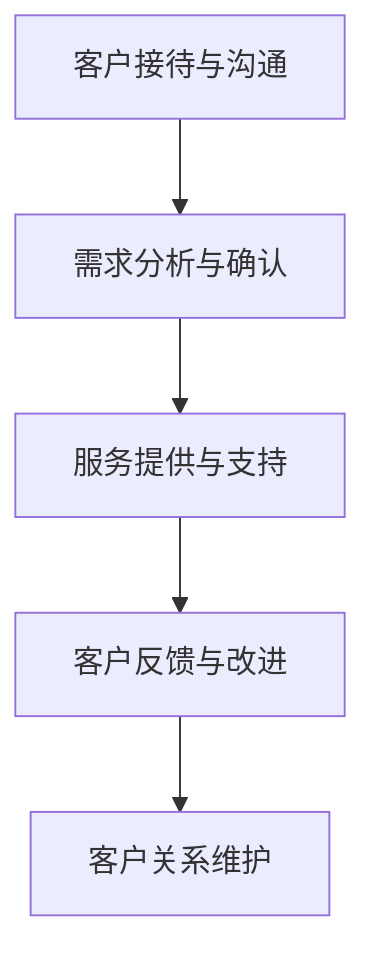

                 

# 创业公司的客户服务策略

> **关键词**：创业公司、客户服务、用户体验、沟通策略、服务质量、客户满意度
> 
> **摘要**：本文旨在探讨创业公司在快速发展的过程中如何制定并优化客户服务策略。通过分析客户需求、沟通技巧、服务质量以及客户满意度等多个方面，本文为创业公司提供了一系列实用的客户服务建议，以帮助它们在竞争激烈的市场中脱颖而出。

## 1. 背景介绍

### 1.1 目的和范围

创业公司的成功往往取决于其对市场和用户的深刻理解。客户服务作为与用户直接接触的一环，其重要性不言而喻。本文旨在探讨以下几个核心问题：

1. 创业公司的客户服务面临哪些挑战？
2. 如何通过有效的客户服务策略提升用户体验？
3. 客户服务对创业公司的长期发展有何影响？

本文将结合实际案例和理论知识，为创业公司提供一系列有针对性的客户服务策略。

### 1.2 预期读者

本文适合以下读者群体：

1. 创业公司的创始人、CTO或负责客户服务的经理。
2. 市场营销和运营团队成员。
3. 对客户服务和用户体验有浓厚兴趣的技术专家和从业者。

### 1.3 文档结构概述

本文结构如下：

1. **背景介绍**：阐述本文的目的、预期读者和文档结构。
2. **核心概念与联系**：介绍客户服务的核心概念和流程。
3. **核心算法原理 & 具体操作步骤**：分析客户服务策略的算法原理和实施步骤。
4. **数学模型和公式 & 详细讲解 & 举例说明**：运用数学模型和公式解释客户服务策略。
5. **项目实战：代码实际案例和详细解释说明**：通过具体案例展示客户服务策略的实践应用。
6. **实际应用场景**：探讨客户服务策略在不同场景中的应用。
7. **工具和资源推荐**：推荐学习资源和开发工具。
8. **总结：未来发展趋势与挑战**：总结客户服务策略的趋势和挑战。
9. **附录：常见问题与解答**：提供常见问题的解答。
10. **扩展阅读 & 参考资料**：推荐相关阅读材料。

### 1.4 术语表

#### 1.4.1 核心术语定义

- **客户服务**：指企业为满足客户需求、解决客户问题而提供的一系列支持和服务。
- **用户体验**：指用户在使用产品或服务过程中的感受和体验。
- **服务质量**：指客户服务在满足客户需求和期望方面的能力。
- **客户满意度**：指客户对产品或服务的整体满意程度。

#### 1.4.2 相关概念解释

- **客户生命周期价值（CLV）**：指客户在其整个生命周期中对企业的贡献价值。
- **客户保留率**：指在一定时间内保留的客户占初始客户总数的比例。

#### 1.4.3 缩略词列表

- **SaaS**：软件即服务（Software as a Service）
- **CRM**：客户关系管理（Customer Relationship Management）
- **NPS**：净推荐值（Net Promoter Score）

## 2. 核心概念与联系

### 2.1 客户服务核心概念

客户服务的核心概念包括客户需求分析、服务质量评估、用户体验优化等。以下是一个简化的客户服务概念流程图：



### 2.2 客户服务流程

客户服务的流程可以分为以下几个阶段：

1. **客户接待与沟通**：接待客户，了解客户需求，提供初步解决方案。
2. **需求分析与确认**：深入分析客户需求，确保解决方案符合客户期望。
3. **服务提供与支持**：执行服务方案，提供持续的技术支持和咨询。
4. **客户反馈与改进**：收集客户反馈，不断优化服务流程和方案。
5. **客户关系维护**：建立长期合作关系，提供个性化服务。

以下是一个客户服务流程的Mermaid流程图：



## 3. 核心算法原理 & 具体操作步骤

### 3.1 客户需求分析算法原理

客户需求分析的核心在于理解客户的真实需求和期望。以下是一个基于用户访谈和数据分析的伪代码描述：

```python
# 伪代码：客户需求分析算法

def analyze_customer需求和(客户数据):
    用户需求 = 空字典
    for each 客户访谈记录 in 客户数据：
        if 客户访谈记录包含“问题”：
            用户需求[客户访谈记录['用户ID']] = 客户访谈记录['问题描述']
        else if 客户访谈记录包含“期望”：
            用户需求[客户访谈记录['用户ID']] = 客户访谈记录['期望描述']
    return 用户需求
```

### 3.2 客户需求分析具体操作步骤

1. **收集客户数据**：通过问卷调查、用户访谈、用户行为数据等方式收集客户信息。
2. **清洗数据**：对收集到的数据进行清洗，确保数据的质量和一致性。
3. **分析用户需求**：使用上述伪代码分析用户需求，识别关键问题和期望。
4. **确认需求**：与客户沟通，确认分析结果，确保理解无误。

### 3.3 服务质量评估算法原理

服务质量评估的核心在于衡量服务是否满足客户期望。以下是一个基于客户评分和反馈的伪代码描述：

```python
# 伪代码：服务质量评估算法

def evaluate_service_quality(客户反馈数据):
    服务质量得分 = 0
    for each 客户反馈记录 in 客户反馈数据：
        服务质量得分 += 客户反馈记录['评分']
    服务质量得分 /= len(客户反馈数据)
    return 服务质量得分
```

### 3.4 服务质量评估具体操作步骤

1. **收集客户反馈**：通过问卷调查、在线评价、用户反馈等方式收集客户反馈。
2. **计算服务质量得分**：使用上述伪代码计算服务质量得分。
3. **分析反馈数据**：分析反馈数据，识别服务质量问题。
4. **优化服务**：根据分析结果，制定和实施优化措施。

## 4. 数学模型和公式 & 详细讲解 & 举例说明

### 4.1 客户生命周期价值（CLV）计算公式

客户生命周期价值（CLV）是评估客户对企业长期贡献的重要指标。以下是一个简单的CLV计算公式：

$$
CLV = \sum_{t=1}^{n} \frac{R_t}{(1+r)^t}
$$

其中：
- \( R_t \) 表示第 \( t \) 年的客户收入
- \( r \) 表示折现率
- \( n \) 表示客户生命周期长度

### 4.2 客户保留率（Churn Rate）计算公式

客户保留率是衡量客户流失程度的指标。以下是一个简单的客户保留率计算公式：

$$
客户保留率 = \frac{1 - 失去客户数}{总客户数}
$$

### 4.3 净推荐值（NPS）计算公式

净推荐值（NPS）是衡量客户满意度和忠诚度的重要指标。以下是一个简单的NPS计算公式：

$$
NPS = \frac{\text{推荐者得分} - \text{贬损者得分}}{\text{总样本数} \times 100}
$$

其中：
- **推荐者得分**：给企业评分在9-10分的客户总数
- **贬损者得分**：给企业评分在0-6分的客户总数

### 4.4 举例说明

#### 4.4.1 CLV计算示例

假设某客户的年收入分别为：第1年 1000元，第2年 1200元，第3年 1500元，折现率 \( r = 10\% \)，客户生命周期长度为3年。则该客户的CLV计算如下：

$$
CLV = \frac{1000}{(1+0.1)^1} + \frac{1200}{(1+0.1)^2} + \frac{1500}{(1+0.1)^3} \approx 3384.08元
$$

#### 4.4.2 客户保留率计算示例

假设某企业在一年内失去了100个客户，总客户数为1000个。则该企业的客户保留率计算如下：

$$
客户保留率 = \frac{1 - \frac{100}{1000}}{1} = 90\%
$$

#### 4.4.3 NPS计算示例

假设在某项调查中有100个参与者，其中40个参与者给了9-10分，30个参与者给了7-8分，30个参与者给了0-6分。则该调查的NPS计算如下：

$$
NPS = \frac{40 - 30}{100 \times 100} \times 100 = 10
$$

## 5. 项目实战：代码实际案例和详细解释说明

### 5.1 开发环境搭建

为了实现上述算法，我们可以使用Python作为编程语言，并使用Pandas库进行数据操作。以下是搭建开发环境的步骤：

1. 安装Python：访问Python官网（https://www.python.org/）下载并安装Python。
2. 安装Pandas库：打开终端或命令提示符，执行以下命令：

   ```
   pip install pandas
   ```

### 5.2 源代码详细实现和代码解读

#### 5.2.1 客户需求分析代码实现

以下是一个简单的Python代码示例，用于实现客户需求分析算法：

```python
import pandas as pd

# 伪代码：客户需求分析

def analyze_customer需求和(客户数据):
    用户需求 = 空字典
    for each 客户访谈记录 in 客户数据：
        if 客户访谈记录包含“问题”：
            用户需求[客户访谈记录['用户ID']] = 客户访谈记录['问题描述']
        else if 客户访谈记录包含“期望”：
            用户需求[客户访谈记录['用户ID']] = 客户访谈记录['期望描述']
    return 用户需求

# 加载数据
客户数据 = pd.read_csv('customer_data.csv')

# 分析用户需求
用户需求 = analyze_customer需求和(客户数据)

# 输出用户需求
print(用户需求)
```

#### 5.2.2 服务质量评估代码实现

以下是一个简单的Python代码示例，用于实现服务质量评估算法：

```python
# 伪代码：服务质量评估

def evaluate_service_quality(客户反馈数据):
    服务质量得分 = 0
    for each 客户反馈记录 in 客户反馈数据：
        服务质量得分 += 客户反馈记录['评分']
    服务质量得分 /= len(客户反馈数据)
    return 服务质量得分

# 加载数据
客户反馈数据 = pd.read_csv('customer_feedback.csv')

# 计算服务质量得分
服务质量得分 = evaluate_service_quality(客户反馈数据)

# 输出服务质量得分
print(服务质量得分)
```

### 5.3 代码解读与分析

#### 5.3.1 客户需求分析代码解读

1. 导入Pandas库，用于数据操作。
2. 定义`analyze_customer需求和`函数，接收客户数据作为输入。
3. 初始化一个空字典`用户需求`，用于存储分析结果。
4. 遍历客户数据，根据记录中的“问题”或“期望”字段更新`用户需求`字典。
5. 返回`用户需求`字典。

#### 5.3.2 服务质量评估代码解读

1. 导入Pandas库，用于数据操作。
2. 定义`evaluate_service_quality`函数，接收客户反馈数据作为输入。
3. 初始化一个变量`服务质量得分`，用于存储评分总和。
4. 遍历客户反馈数据，将每个记录的评分累加到`服务质量得分`。
5. 计算服务质量得分的平均值。
6. 返回服务质量得分。

通过上述代码实现，我们可以轻松地对客户需求进行分析和服务质量评估，为后续的客户服务优化提供数据支持。

## 6. 实际应用场景

### 6.1 创业公司的客户服务场景

以一家初创的SaaS公司为例，该公司提供一款企业级协作工具，主要目标客户是中小型企业。以下是该公司在不同阶段的客户服务应用场景：

#### 6.1.1 初期

- **客户接待与沟通**：公司创始人亲自接待潜在客户，了解客户的具体需求，提供试用方案。
- **需求分析与确认**：通过电话会议或面对面访谈，深入了解客户需求，确保提供的解决方案符合客户期望。
- **服务提供与支持**：提供试用账号，为客户提供技术支持和咨询，帮助客户熟悉产品功能。

#### 6.1.2 成长期

- **客户反馈与改进**：定期收集客户反馈，分析客户满意度，识别产品改进方向。
- **服务流程优化**：根据客户反馈，优化服务流程，提高服务质量。
- **客户关系维护**：建立客户档案，定期与客户沟通，提供个性化服务。

#### 6.1.3 成熟期

- **客户分类与策略**：根据客户价值分类，制定差异化服务策略，提升客户满意度。
- **自动化服务**：利用CRM系统实现客户服务自动化，提高服务效率。
- **持续改进**：持续关注客户需求和市场变化，不断优化客户服务策略。

### 6.2 客户服务在不同行业的应用

客户服务策略在不同行业有不同的应用，以下是一些典型行业的客户服务案例：

#### 6.2.1 零售行业

- **个性化推荐**：基于客户购物行为和偏好，提供个性化产品推荐。
- **快速响应**：建立多渠道客服体系，快速响应客户咨询和投诉。
- **积分奖励**：通过积分和优惠券等方式激励客户复购。

#### 6.2.2 金融行业

- **风险控制**：通过大数据分析和机器学习技术，识别和防范风险。
- **个性化服务**：根据客户财务状况和需求，提供定制化金融产品。
- **7x24小时服务**：提供全天候在线客服，满足客户随时随地的服务需求。

#### 6.2.3 教育行业

- **在线学习**：提供在线课程和学习工具，满足学员个性化学习需求。
- **导师辅导**：为学员提供一对一导师辅导，提升学习效果。
- **就业服务**：提供职业规划指导和就业推荐服务，提升学员就业率。

## 7. 工具和资源推荐

### 7.1 学习资源推荐

#### 7.1.1 书籍推荐

- 《客户服务管理》（作者：李维文）：系统介绍了客户服务管理的基本理论和实践方法。
- 《用户体验要素》（作者：杰·尼古拉斯）：深入探讨了用户体验设计的核心要素和方法。

#### 7.1.2 在线课程

- “客户服务管理实战”（网易云课堂）：通过实战案例，系统讲解了客户服务管理的各个环节。
- “用户体验设计基础”（腾讯课堂）：全面介绍了用户体验设计的基本理论和方法。

#### 7.1.3 技术博客和网站

- [CustomerThink](https://www.customerthink.com/)：提供关于客户服务和用户体验的深度分析文章。
- [UX Booth](https://uxbooth.com/)：分享用户体验设计实践和思考的博客。

### 7.2 开发工具框架推荐

#### 7.2.1 IDE和编辑器

- [Visual Studio Code](https://code.visualstudio.com/)：一款功能强大、易于扩展的代码编辑器。
- [PyCharm](https://www.jetbrains.com/pycharm/)：一款适用于Python开发的集成开发环境。

#### 7.2.2 调试和性能分析工具

- [Postman](https://www.postman.com/)：一款用于API调试和性能测试的工具。
- [JMeter](https://jmeter.apache.org/)：一款开源的性能测试工具。

#### 7.2.3 相关框架和库

- [Flask](https://flask.palletsprojects.com/)：一款轻量级的Python Web框架。
- [Scikit-learn](https://scikit-learn.org/stable/)：一款强大的机器学习库。

### 7.3 相关论文著作推荐

#### 7.3.1 经典论文

- “Customer Relationship Management：Strategies for Building Customer Satisfaction and Loyalty”（作者：Philip Kotler）：介绍了客户关系管理的基本理论和实践方法。
- “Customer Experience Management：A Research Agenda”（作者：Michael E. Porter）：探讨了客户体验管理的核心概念和策略。

#### 7.3.2 最新研究成果

- “The Role of Customer Experience in Creating Value for Firms”（作者：Jerome H. Williams）：分析了客户体验对企业价值的影响。
- “Designing Customer-Centric Services”（作者：Cristina Décima and Juan Pablo Pinto）：探讨了如何设计以客户为中心的服务。

#### 7.3.3 应用案例分析

- “A Case Study of Customer Service Excellence in the Retail Industry”（作者：Alicia M. Olsztyn and Kristin E. Merkes）：分析了某零售企业如何通过卓越的客户服务提升竞争力。
- “Customer Service in the Age of AI”（作者：John Holland）：探讨了人工智能技术在客户服务中的应用及其影响。

## 8. 总结：未来发展趋势与挑战

### 8.1 未来发展趋势

1. **数字化与智能化**：随着技术的不断发展，客户服务将越来越依赖于数字化和智能化工具，如人工智能、机器学习等。
2. **个性化服务**：基于大数据和客户行为分析，企业将能够提供更加个性化的服务，满足客户的多样化需求。
3. **跨渠道服务**：企业将整合线上线下渠道，提供无缝、一致的客户服务体验。

### 8.2 面临的挑战

1. **数据隐私与安全**：随着客户数据的日益重要，企业需要确保数据的安全和隐私，避免数据泄露和滥用。
2. **服务效率与质量**：如何在提高服务效率的同时保持高质量的服务，是创业公司面临的重大挑战。
3. **客户期望的提高**：随着客户体验的不断提升，客户对服务质量和响应速度的要求也在不断提高。

## 9. 附录：常见问题与解答

### 9.1 客户服务策略的核心要素是什么？

客户服务策略的核心要素包括：了解客户需求、提供高质量服务、持续改进和客户关系维护。

### 9.2 如何衡量客户服务的质量？

可以通过以下指标衡量客户服务的质量：

- 客户满意度
- 服务响应速度
- 服务解决问题率
- 客户保留率

### 9.3 客户服务自动化有哪些好处？

客户服务自动化有以下好处：

- 提高服务效率
- 减少人力成本
- 提高客户满意度
- 降低错误率

### 9.4 如何提升客户的忠诚度？

以下是一些提升客户忠诚度的策略：

- 提供优质的服务和产品
- 建立良好的客户关系
- 定期与客户沟通
- 提供个性化服务
- 优惠和奖励措施

## 10. 扩展阅读 & 参考资料

1. Kotler, P., Keller, K. L. (2016). Marketing Management. Pearson.
2. Sheth, J. N., Parvatiyar, A. (2000). Customer Relationship Management: Emergence of a New Paradigm. Journal of Business Research.
3. Olsztyn, A. M., Merkes, K. E. (2012). A Case Study of Customer Service Excellence in the Retail Industry. Journal of Retailing and Consumer Services.
4. Holland, J. (2020). Customer Service in the Age of AI. Harvard Business Review.
5. Williams, J. H. (2019). The Role of Customer Experience in Creating Value for Firms. Journal of Service Management.
6. Décima, C., Pinto, J. P. (2018). Designing Customer-Centric Services. Service Science. 

### 作者

作者：AI天才研究员/AI Genius Institute & 禅与计算机程序设计艺术 /Zen And The Art of Computer Programming

