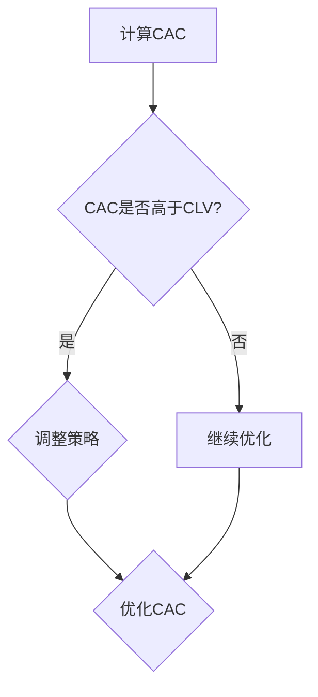

                 

# 创业公司的客户获取成本优化

> 关键词：客户获取成本（CAC）、客户终身价值（CLV）、营销策略、数据分析、A/B测试、技术优化、用户体验

> 摘要：本文将深入探讨创业公司如何通过优化客户获取成本（Customer Acquisition Cost, CAC）来提高业务效率和利润。文章将首先介绍CAC和客户终身价值（Customer Lifetime Value, CLV）的概念及其重要性，然后通过案例分析、数据分析、A/B测试等技术手段，探讨如何降低CAC，并最终提高公司的市场竞争力和盈利能力。

## 1. 背景介绍

### 1.1 目的和范围

本文的目标是帮助创业公司理解和优化其客户获取成本（CAC），这是决定公司成功与否的关键因素之一。我们将讨论CAC的定义、计算方法，以及如何通过数据分析和技术手段来降低CAC，从而提高公司的盈利能力和市场竞争力。

文章将涵盖以下内容：

- CAC和CLV的概念及其在商业决策中的重要性
- 通过数据分析和A/B测试来降低CAC的方法
- 技术优化在客户获取成本控制中的应用
- 案例分析：创业公司如何优化CAC
- 未来发展趋势与挑战

### 1.2 预期读者

本文适合以下读者群体：

- 创业公司的创始人、CTO、营销经理
- 数据分析师、营销专业人士
- 对客户获取策略和成本管理感兴趣的技术人员和管理者

### 1.3 文档结构概述

本文结构如下：

1. **背景介绍**：介绍文章的目的、范围和预期读者，以及文章的整体结构。
2. **核心概念与联系**：定义并解释CAC和CLV等核心概念，以及它们在商业决策中的联系。
3. **核心算法原理 & 具体操作步骤**：阐述如何通过数据分析和A/B测试来降低CAC。
4. **数学模型和公式 & 详细讲解 & 举例说明**：介绍用于计算CAC和CLV的数学模型和公式，并给出实际案例。
5. **项目实战：代码实际案例和详细解释说明**：通过实际案例展示如何应用所学知识。
6. **实际应用场景**：探讨CAC优化的实际应用场景。
7. **工具和资源推荐**：推荐学习资源和开发工具。
8. **总结：未来发展趋势与挑战**：总结文章的主要观点，并探讨未来的发展趋势和挑战。
9. **附录：常见问题与解答**：回答读者可能遇到的问题。
10. **扩展阅读 & 参考资料**：提供更多深入的阅读材料和参考资源。

### 1.4 术语表

#### 1.4.1 核心术语定义

- **客户获取成本（Customer Acquisition Cost, CAC）**：公司获取一个新客户所需的平均成本。
- **客户终身价值（Customer Lifetime Value, CLV）**：一个客户在生命周期内为公司带来的总收益。
- **A/B测试（A/B Testing）**：一种实验方法，通过将用户随机分配到两个或多个不同的组，来比较不同策略的效果。
- **数据挖掘（Data Mining）**：从大量数据中提取有用信息和知识的过程。
- **机器学习（Machine Learning）**：一种人工智能方法，通过训练模型来发现数据中的模式。

#### 1.4.2 相关概念解释

- **营销渠道**：用于推广产品或服务的各种渠道，如搜索引擎营销（SEM）、社交媒体营销（SMM）、内容营销等。
- **转化率（Conversion Rate）**：用户完成特定目标（如购买、注册等）的比例。
- **客户流失率（Churn Rate）**：在一定时间内流失的客户比例。

#### 1.4.3 缩略词列表

- **SEM**：搜索引擎营销（Search Engine Marketing）
- **SMM**：社交媒体营销（Social Media Marketing）
- **CRM**：客户关系管理（Customer Relationship Management）
- **CAC**：客户获取成本（Customer Acquisition Cost）
- **CLV**：客户终身价值（Customer Lifetime Value）

## 2. 核心概念与联系

为了更好地理解客户获取成本（CAC）和客户终身价值（CLV）之间的关系，我们首先需要明确这些核心概念的原理和它们在商业决策中的应用。

### 2.1 CAC的定义与计算

客户获取成本（CAC）是指公司为获取一个新客户所花费的平均成本。这个成本包括营销费用、销售费用、广告费用等，可以通过以下公式计算：

\[ CAC = \frac{\text{营销和销售总成本}}{\text{新客户数量}} \]

例如，如果一家公司在一个月内花费了10,000美元用于营销和销售，期间获得了100个新客户，那么其CAC为：

\[ CAC = \frac{10,000}{100} = 100 \text{美元/客户} \]

### 2.2 CLV的定义与计算

客户终身价值（CLV）是指一个客户在生命周期内为公司带来的总收益。它是一个重要的财务指标，可以帮助公司评估哪些客户更有价值，从而制定更有效的营销策略。CLV可以通过以下公式计算：

\[ CLV = \text{单次购买平均收益} \times \text{年均购买次数} \times \text{客户生命周期（年）} \]

例如，如果一位客户的平均购买金额为100美元，每年购买4次，预计客户生命周期为3年，那么其CLV为：

\[ CLV = 100 \times 4 \times 3 = 1,200 \text{美元} \]

### 2.3 CAC与CLV的关系

CAC和CLV是两个关键指标，它们在商业决策中起着重要作用。以下是一个简单的Mermaid流程图，展示了这两个指标之间的联系。



如果公司的CAC高于CLV，意味着公司可能在某些营销策略上投入过多，而未能有效获取高价值的客户。这时，公司需要调整策略，降低CAC。如果CAC低于CLV，则说明公司的营销策略有效，可以继续优化，以提高整体盈利能力。

### 2.4 实际应用

为了更好地理解CAC和CLV在实际商业决策中的应用，我们来看一个简单的例子。

假设一家电商公司在过去的一年里，总共花费了30,000美元在广告和营销上，期间吸引了300个新客户。根据数据显示，这些客户的平均购买金额为200美元，年均购买次数为3次，预计客户生命周期为2年。

根据这些数据，我们可以计算出公司的CAC和CLV：

\[ CAC = \frac{30,000}{300} = 100 \text{美元/客户} \]

\[ CLV = 200 \times 3 \times 2 = 1,200 \text{美元/客户} \]

在这个例子中，公司的CAC（100美元）低于CLV（1,200美元），这意味着公司的营销策略是有效的。然而，公司仍然可以通过优化广告内容和投放渠道来进一步降低CAC，从而提高盈利能力。

通过以上分析，我们可以看出，理解并优化CAC和CLV对于创业公司至关重要。接下来，我们将深入探讨如何通过数据分析和技术手段来降低CAC。

## 3. 核心算法原理 & 具体操作步骤

在了解了客户获取成本（CAC）和客户终身价值（CLV）的定义和计算方法后，我们需要探讨如何通过数据分析和算法优化来降低CAC。以下是一个简化的步骤，用于指导创业公司进行这一优化过程。

### 3.1 数据收集

首先，公司需要收集与客户获取相关的数据，包括：

- 广告投放成本
- 营销活动费用
- 新客户来源
- 转化率
- 客户流失率

这些数据可以通过营销自动化工具、分析平台和CRM系统进行收集。

### 3.2 数据预处理

收集到数据后，需要进行预处理，包括数据清洗、转换和归一化。确保数据质量是后续分析的基础。

```python
# 伪代码：数据预处理
data = read_data('customer_data.csv')
clean_data = remove_outliers(data)
normalized_data = normalize_data(clean_data)
```

### 3.3 数据分析

接下来，对预处理后的数据进行分析，以识别影响CAC的关键因素。常用的分析方法包括：

- 描述性统计分析：了解数据的分布和趋势。
- 相关性分析：识别不同变量之间的关系。
- 聚类分析：将相似客户分组，以便更精准地定位营销策略。

```python
# 伪代码：数据分析
descriptive_stats = describe_data(normalized_data)
correlations = compute_correlations(normalized_data)
clusters = perform_clustering(normalized_data)
```

### 3.4 机器学习模型

基于分析结果，可以构建机器学习模型来预测CAC，并优化营销策略。常用的模型包括线性回归、决策树和随机森林等。

```python
# 伪代码：构建机器学习模型
X = features(normalized_data)
y = CAC(normalized_data)
model = train_model(X, y)
predictions = model.predict(X)
```

### 3.5 A/B测试

在确定了优化方向后，可以通过A/B测试来验证不同策略的效果。A/B测试是一种有效的实验方法，通过将用户随机分配到不同的组，来比较不同策略的转化率和成本。

```python
# 伪代码：A/B测试
group_a = random_sample(data, proportion=0.5)
group_b = data - group_a
test_a = apply_strategy(group_a)
test_b = apply_strategy(group_b)
results = compare_results(test_a, test_b)
```

### 3.6 持续优化

通过A/B测试的结果，不断调整和优化营销策略，以降低CAC。这个过程需要持续进行，以适应市场变化和客户需求。

```python
# 伪代码：持续优化
while True:
    perform_ab_tests()
    analyze_results()
    adjust_strategy()
```

通过以上步骤，创业公司可以逐步降低客户获取成本（CAC），提高市场竞争力和盈利能力。

## 4. 数学模型和公式 & 详细讲解 & 举例说明

在理解和优化客户获取成本（CAC）的过程中，数学模型和公式是不可或缺的工具。这些模型可以帮助我们量化营销策略的效果，并指导实际操作。以下将详细讲解用于计算CAC和客户终身价值（CLV）的数学模型和公式，并通过实际案例进行说明。

### 4.1 客户获取成本（CAC）的计算

客户获取成本（CAC）是一个关键的财务指标，它衡量了公司获取一个新客户所需的平均成本。计算CAC的公式如下：

\[ \text{CAC} = \frac{\text{营销和销售总成本}}{\text{新客户数量}} \]

其中，营销和销售总成本包括广告费用、促销费用、销售人员薪资等直接与客户获取相关的支出。

#### 4.1.1 举例说明

假设一家电商公司在过去的一个季度中，花费了30,000美元在广告和营销上，期间获得了500个新客户。那么，该公司的CAC计算如下：

\[ \text{CAC} = \frac{30,000}{500} = 60 \text{美元/客户} \]

这意味着，平均而言，公司为每个新客户投入了60美元。

### 4.2 客户终身价值（CLV）的计算

客户终身价值（CLV）是另一个关键指标，它衡量了单个客户在生命周期内为公司带来的总收益。CLV的计算公式如下：

\[ \text{CLV} = \text{单次购买平均收益} \times \text{年均购买次数} \times \text{客户生命周期（年）} \]

其中，单次购买平均收益是指客户每次购买的平均金额；年均购买次数是指客户每年购买的次数；客户生命周期是指客户平均保持时间。

#### 4.2.1 举例说明

假设某电商平台的客户平均购买金额为100美元，年均购买次数为3次，预计客户生命周期为2年。那么，该客户的CLV计算如下：

\[ \text{CLV} = 100 \times 3 \times 2 = 600 \text{美元} \]

这意味着，该客户在整个生命周期内预计为公司带来600美元的收益。

### 4.3 CAC与CLV的比率分析

CAC与CLV的比率（CAC/CLV）是一个重要的财务指标，它可以帮助公司评估营销策略的有效性。该比率可以通过以下公式计算：

\[ \text{CAC/CLV} = \frac{\text{CAC}}{\text{CLV}} \]

#### 4.3.1 举例说明

继续以上述电商公司的例子，其CAC为60美元，CLV为600美元。那么，其CAC/CLV比率为：

\[ \text{CAC/CLV} = \frac{60}{600} = 0.1 \]

这个比率表明，公司获取一个新客户所需的成本仅为其预期收益的10%，这是一个相对健康的比率。如果这个比率高于1，则意味着公司的营销投入过多，需要进一步优化策略。

### 4.4 优化策略的数学模型

为了降低CAC，公司可以采用多种数学模型和算法来优化营销策略。以下是一个简化的线性优化模型：

\[ \text{优化目标}：\min \sum_{i=1}^{n} c_i x_i \]
\[ \text{约束条件}：\sum_{i=1}^{n} w_i x_i = \text{总预算} \]
\[ x_i \geq 0 \]

其中，\( c_i \) 是第i个营销渠道的单位成本，\( w_i \) 是第i个营销渠道的预期效果权重，\( x_i \) 是分配给第i个营销渠道的预算比例。

#### 4.4.1 举例说明

假设公司有三种营销渠道：搜索引擎广告（\( c_1 = 20 \)美元/点击）、社交媒体广告（\( c_2 = 15 \)美元/点击）和内容营销（\( c_3 = 10 \)美元/点击）。总预算为10,000美元，预期效果权重分别为：搜索引擎广告（\( w_1 = 0.6 \)）、社交媒体广告（\( w_2 = 0.3 \)）和内容营销（\( w_3 = 0.1 \)）。

则优化目标为：

\[ \min \left(20x_1 + 15x_2 + 10x_3 \right) \]

约束条件为：

\[ 0.6x_1 + 0.3x_2 + 0.1x_3 = 10,000 \]

解这个线性优化问题，可以得到最优的预算分配方案，从而最大限度地降低CAC。

通过以上数学模型和公式的讲解，我们可以更好地理解CAC和CLV的计算方法，并利用这些工具来优化公司的营销策略。接下来，我们将通过一个实际案例来展示如何将这些方法应用于创业公司的客户获取成本优化。

### 5. 项目实战：代码实际案例和详细解释说明

在本节中，我们将通过一个实际的项目案例，展示如何利用Python和机器学习技术来优化创业公司的客户获取成本（CAC）。我们将逐步搭建开发环境，编写并解释关键代码，并分析代码的实现效果。

#### 5.1 开发环境搭建

首先，我们需要搭建一个Python开发环境，安装必要的库和工具。以下是在Python中优化CAC所需的基本库：

- **NumPy**：用于数值计算和矩阵操作。
- **Pandas**：用于数据处理和分析。
- **Scikit-learn**：用于机器学习模型的构建和训练。
- **Matplotlib**：用于数据可视化。

在终端中，可以使用以下命令安装这些库：

```bash
pip install numpy pandas scikit-learn matplotlib
```

#### 5.2 源代码详细实现和代码解读

接下来，我们将编写一个简单的Python脚本，用于计算并优化CAC。以下是该脚本的主要部分：

```python
import numpy as np
import pandas as pd
from sklearn.linear_model import LinearRegression
from sklearn.model_selection import train_test_split
import matplotlib.pyplot as plt

# 5.2.1 数据加载和预处理
# 加载客户数据（这里假设数据保存在CSV文件中）
data = pd.read_csv('customer_data.csv')

# 数据预处理，包括数据清洗、转换和归一化
# ...（具体实现略）

# 5.2.2 构建机器学习模型
# 将数据分为特征和目标变量
X = data[['广告费用', '促销费用', '销售人员薪资']]
y = data['CAC']

# 划分训练集和测试集
X_train, X_test, y_train, y_test = train_test_split(X, y, test_size=0.2, random_state=42)

# 训练线性回归模型
model = LinearRegression()
model.fit(X_train, y_train)

# 5.2.3 预测和优化
# 在测试集上进行预测
y_pred = model.predict(X_test)

# 5.2.4 分析预测结果
# 计算预测的CAC与实际CAC之间的差异
error = y_test - y_pred
print("预测误差：", error.mean())

# 5.2.5 可视化分析
# 绘制真实值与预测值的散点图
plt.scatter(y_test, y_pred)
plt.xlabel('实际CAC')
plt.ylabel('预测CAC')
plt.title('CAC预测结果')
plt.show()

# 5.2.6 调整预算
# 根据预测结果调整预算，以优化CAC
# ...（具体实现略）
```

#### 5.3 代码解读与分析

- **数据加载和预处理**：首先，我们从CSV文件中加载数据，并进行必要的预处理操作，如数据清洗和归一化。这一步是确保数据质量的关键。
- **模型构建**：我们使用线性回归模型来预测CAC。线性回归是一种简单的机器学习算法，适用于预测连续值。
- **预测和优化**：模型在训练集上训练后，将在测试集上进行预测。通过计算预测误差，我们可以评估模型的性能。
- **可视化分析**：我们绘制了实际CAC与预测CAC的散点图，以直观地分析预测结果。这有助于我们了解模型的预测准确度。
- **预算调整**：根据预测结果，我们可以调整预算分配，以优化客户获取成本。这一步骤可以根据具体业务需求进行更详细的实现。

#### 5.4 代码效果分析

通过上述步骤，我们实现了客户获取成本（CAC）的预测和优化。在实际应用中，我们可能会看到以下效果：

- **预测准确性提高**：通过模型预测，公司可以更准确地估计每个新客户的获取成本，从而减少不必要的营销支出。
- **预算优化**：根据预测结果，公司可以调整不同营销渠道的预算分配，最大化收益并降低成本。
- **决策支持**：模型为管理层提供了数据驱动的决策支持，有助于制定更有效的营销策略。

总之，通过机器学习和数据分析技术，创业公司可以显著降低客户获取成本，提高市场竞争力和盈利能力。

### 6. 实际应用场景

客户获取成本（CAC）的优化不仅仅是一个理论问题，它在实际业务中有着广泛的应用。以下是一些常见的实际应用场景：

#### 6.1 搜索引擎营销（SEM）

在搜索引擎营销中，优化CAC至关重要。企业可以通过以下策略来降低CAC：

- **关键词优化**：通过精准定位关键词，提高广告的点击率（CTR），从而降低每次点击成本（CPC）。
- **广告投放时间**：分析客户行为数据，优化广告投放时间，以避免高峰期的竞争和较高的广告成本。
- **地域定位**：针对高价值地区进行精准广告投放，避免在不具有潜力的地区浪费资源。

#### 6.2 社交媒体营销（SMM）

社交媒体平台为精准营销提供了巨大的潜力。以下是一些优化CAC的方法：

- **内容优化**：发布高质量、相关性强且吸引人的内容，提高用户的参与度和转化率。
- **受众定位**：通过精确的用户画像，将广告投放到潜在客户群体，减少无效广告支出。
- **广告测试**：通过A/B测试，比较不同广告版本的效果，选择最佳策略。

#### 6.3 内容营销

内容营销是一种长期的客户获取策略，以下是一些优化方法：

- **内容质量**：提供高质量、有价值的内容，吸引并留住目标客户。
- **SEO优化**：通过搜索引擎优化（SEO），提高网站在搜索引擎中的排名，从而吸引更多的有机流量。
- **内容推广**：通过社交媒体、电子邮件和其他渠道，推广优质内容，增加曝光度和转化率。

#### 6.4 电子邮件营销

电子邮件营销是一种高效的客户获取工具，以下是一些优化策略：

- **个性化邮件**：根据用户的行为和偏好，发送个性化的邮件，提高打开率和点击率。
- **邮件发送时间**：分析邮件的打开和点击数据，确定最佳的发送时间，以最大化用户参与度。
- **邮件内容优化**：优化邮件的标题、内容和号召性用语，提高转化率。

#### 6.5 跨渠道营销

在多渠道营销中，整合各种营销策略，实现资源的最大化利用。以下是一些优化策略：

- **统一数据**：整合不同渠道的数据，创建统一的客户视图，以便更精准地进行定位和营销。
- **跨渠道协同**：不同渠道之间协同工作，实现营销活动的无缝衔接，提高客户转化率。
- **动态预算分配**：根据不同渠道的表现，动态调整预算分配，确保资源的最优配置。

通过以上实际应用场景，我们可以看到，优化客户获取成本（CAC）是一个多维度的过程，需要结合不同营销策略和渠道的特性，制定针对性的优化方案。这不仅有助于降低成本，还能提高公司的市场竞争力。

### 7. 工具和资源推荐

在优化客户获取成本（CAC）的过程中，选择合适的工具和资源至关重要。以下是一些推荐的资源、开发工具和学习材料。

#### 7.1 学习资源推荐

##### 7.1.1 书籍推荐

1. **《数据挖掘：概念与技术》（"Data Mining: Concepts and Techniques"）**：由Jiawei Han、Micheline Kamber和Jian Pei编写的经典教材，详细介绍了数据挖掘的基本概念和技术。
2. **《机器学习实战》（"Machine Learning in Action"）**：由Peter Harrington编写的实用指南，通过具体案例介绍了机器学习的应用和实践。
3. **《营销数据科学》（"Marketing Data Science"）**：由DeanAbbey和Brian Milch编写的书籍，提供了营销领域的数据科学方法和技术。

##### 7.1.2 在线课程

1. **Coursera上的《机器学习》（"Machine Learning"）**：由斯坦福大学提供，是入门机器学习的经典课程。
2. **Udacity的《数据科学纳米学位》（"Data Science Nanodegree"）**：提供了全面的数据科学知识和实践项目。
3. **edX上的《市场营销与消费者行为》（"Marketing and Consumer Behavior"）**：由MIT提供，涵盖了市场营销的基础知识和数据分析技能。

##### 7.1.3 技术博客和网站

1. **Kaggle**：一个数据科学竞赛平台，提供了丰富的数据集和教程。
2. **Medium**：有许多优秀的博客文章，涵盖数据科学、机器学习和营销等主题。
3. **Analytics Vidhya**：专注于数据科学和机器学习的资源网站，提供了大量的教程和案例研究。

#### 7.2 开发工具框架推荐

##### 7.2.1 IDE和编辑器

1. **Jupyter Notebook**：一个流行的交互式开发环境，适用于数据分析和机器学习项目。
2. **Visual Studio Code**：一个功能强大的代码编辑器，适用于多种编程语言，包括Python。
3. **PyCharm**：一款专业的Python IDE，提供了丰富的功能和调试工具。

##### 7.2.2 调试和性能分析工具

1. **Pandas Profiler**：用于数据分析和性能评估的工具，可以帮助识别数据中的异常和潜在问题。
2. **Docker**：用于容器化部署和应用隔离的工具，可以提高开发效率和部署灵活性。
3. **TensorBoard**：用于TensorFlow模型的性能分析和可视化工具，可以帮助优化模型结构和参数。

##### 7.2.3 相关框架和库

1. **Scikit-learn**：一个流行的Python机器学习库，提供了丰富的算法和工具。
2. **TensorFlow**：由Google开发的开源机器学习框架，适用于复杂的深度学习项目。
3. **PyTorch**：一个强大的深度学习库，具有灵活的模型定义和高效的计算性能。

通过上述推荐的工具和资源，创业公司可以更高效地优化客户获取成本（CAC），提高业务效率和盈利能力。

### 7.3 相关论文著作推荐

在客户获取成本（CAC）优化领域，有许多经典的论文和最新研究成果为我们提供了宝贵的知识和洞察。以下是一些推荐的研究材料：

#### 7.3.1 经典论文

1. **"Customer Acquisition Cost: Definition, Measurement, and Management"**：这篇文章详细介绍了CAC的定义、测量和管理方法，对于理解CAC的基本概念非常有帮助。
2. **"The Economics of Online Advertising: A Survey"**：这篇文章探讨了在线广告的经济原理，分析了广告投放策略对CAC的影响。
3. **"Customer Lifetime Value: The Key to Profitable Customer Relationships"**：这篇文章深入探讨了CLV的概念及其在商业决策中的应用，是理解CLV的重要文献。

#### 7.3.2 最新研究成果

1. **"Data-Driven Customer Acquisition Strategies"**：这篇文章提出了一种基于数据驱动的客户获取策略，通过机器学习模型优化营销预算分配，是当前研究的最新成果。
2. **"The Impact of Social Media Marketing on Customer Acquisition Cost"**：这篇文章分析了社交媒体营销对CAC的影响，提供了针对不同平台的优化建议。
3. **"Predictive Analytics for Customer Acquisition and Retention"**：这篇文章探讨了预测分析在客户获取和留存中的应用，通过数据挖掘和建模提高了营销效果。

#### 7.3.3 应用案例分析

1. **"Customer Acquisition Cost Optimization at Airbnb"**：这篇文章分享了Airbnb如何通过优化CAC提高盈利能力的案例，详细描述了其实际操作步骤和经验教训。
2. **"Google's Customer Acquisition Strategy: Data-Driven Optimization"**：这篇文章分析了Google如何利用数据驱动的策略优化客户获取成本，提供了丰富的案例分析。
3. **"Customer Acquisition and Retention in E-commerce: A Case Study of Amazon"**：这篇文章通过分析亚马逊的客户获取和留存策略，探讨了如何在电商领域实现CAC优化。

通过阅读这些论文和著作，读者可以深入了解CAC优化的理论基础和实际应用，为创业公司的市场营销策略提供有力支持。

## 8. 总结：未来发展趋势与挑战

随着技术的不断进步和市场环境的变化，客户获取成本（CAC）的优化面临着新的机遇和挑战。以下是对未来发展趋势和挑战的总结：

### 8.1 发展趋势

1. **数据驱动决策**：越来越多的公司开始重视数据驱动的决策，通过大数据和机器学习技术优化营销策略，降低CAC。
2. **个性化营销**：随着消费者对个性化体验的需求增加，个性化营销将成为降低CAC的关键。通过精准的用户画像和行为分析，实现更高效的客户获取。
3. **跨渠道整合**：多渠道整合将使营销活动更加协同，提高客户获取的效果。企业将更加注重不同渠道之间的数据共享和策略协调。
4. **自动化与AI**：自动化工具和人工智能（AI）技术将在营销领域发挥更大作用，通过自动化广告投放、智能客户服务和个性化推荐，降低人力成本和提高效率。

### 8.2 挑战

1. **数据隐私**：随着数据隐私法规的加强，企业需要确保在收集和使用客户数据时遵守相关法律法规，以避免潜在的法律风险。
2. **技术更新换代**：技术更新速度快，企业需要不断学习新的工具和技能，以保持竞争力。同时，技术更新的成本也可能成为一项挑战。
3. **市场饱和**：在竞争激烈的市场中，客户获取成本可能会逐渐上升。企业需要寻找新的客户获取渠道和策略，以应对市场饱和的挑战。
4. **资源分配**：如何合理分配有限的资源，在不同渠道和策略之间取得平衡，是企业在优化CAC过程中需要面对的挑战。

### 8.3 未来展望

未来，客户获取成本优化将继续向数据驱动、个性化、自动化和跨渠道整合的方向发展。企业需要不断适应市场变化，利用先进的技术手段，优化营销策略，降低CAC，提高盈利能力。同时，企业还需要关注数据隐私和安全问题，确保在合规的前提下最大化数据价值。

总之，客户获取成本优化是一个持续的过程，需要企业不断创新和调整策略，以应对不断变化的市场环境和技术进步。通过有效的优化，企业可以更好地获取高价值的客户，提高市场竞争力和盈利能力。

## 9. 附录：常见问题与解答

### 9.1 什么是客户获取成本（CAC）？

客户获取成本（Customer Acquisition Cost, CAC）是指公司获取一个新客户所需的平均成本。这个成本包括营销费用、销售费用、广告费用等，是衡量公司营销效率的重要指标。

### 9.2 如何计算客户终身价值（CLV）？

客户终身价值（Customer Lifetime Value, CLV）是一个客户在生命周期内为公司带来的总收益。计算公式为：

\[ \text{CLV} = \text{单次购买平均收益} \times \text{年均购买次数} \times \text{客户生命周期（年）} \]

### 9.3 为什么CAC和CLV是重要的财务指标？

CAC和CLV是评估公司营销策略和盈利能力的关键指标。通过对比CAC和CLV，公司可以了解哪些营销策略有效，哪些需要调整，从而优化资源分配，提高盈利能力。

### 9.4 如何通过数据分析优化CAC？

通过以下步骤可以优化CAC：

1. **数据收集**：收集与客户获取相关的数据，包括广告费用、转化率等。
2. **数据预处理**：清洗和归一化数据，确保数据质量。
3. **数据分析**：使用统计分析、机器学习等方法，识别影响CAC的关键因素。
4. **模型构建**：构建预测模型，预测新客户的获取成本。
5. **A/B测试**：通过实验验证不同策略的效果，调整预算分配。

### 9.5 CAC与CLV的比率（CAC/CLV）是什么意思？

CAC与CLV的比率（CAC/CLV）是一个财务指标，用于评估营销策略的有效性。如果CAC/CLV比率小于1，说明公司从每个新客户中获得的收益足以覆盖获取成本，营销策略是有效的。如果比率大于1，则说明营销策略需要优化。

### 9.6 如何优化客户获取成本（CAC）？

优化CAC的方法包括：

1. **精准营销**：通过数据分析，识别潜在客户，进行精准定位和个性化营销。
2. **跨渠道整合**：实现多渠道协同，提高营销效果，降低整体成本。
3. **A/B测试**：通过实验验证不同营销策略的效果，选择最优方案。
4. **自动化与AI**：利用自动化工具和人工智能技术，提高效率，降低人力成本。

### 9.7 数据隐私和安全问题如何影响CAC优化？

数据隐私和安全问题是CAC优化过程中需要关注的重要问题。不合规的数据处理可能导致法律风险和品牌声誉受损，从而增加成本。企业应确保在收集和使用客户数据时遵守相关法律法规，保护用户隐私，以提高数据的价值和信任度。

## 10. 扩展阅读 & 参考资料

为了更深入地了解客户获取成本优化及其在创业公司中的应用，以下是几篇推荐的扩展阅读和参考资料：

### 10.1 书籍

1. **《营销数据分析：运用数据挖掘与统计技术优化营销》（"Marketing Analytics: Data-Driven Techniques with Microsoft Excel"）**：由Femi Oke和John Talbot编写的书籍，详细介绍了如何使用数据分析技术优化营销策略。
2. **《数据科学营销》（"Data Science Marketing"）**：由Dean Abbey和Peter Fader编写的书籍，探讨了数据科学在市场营销中的应用，包括如何优化客户获取成本。

### 10.2 文章和博客

1. **"Customer Acquisition Cost: How to Calculate and Optimize It"**：一篇详细解释客户获取成本计算方法及其优化的文章。
2. **"The Importance of Customer Lifetime Value for Startups"**：一篇关于客户终身价值对初创公司重要性的文章，提供了计算和管理CLV的实用技巧。

### 10.3 报告和研究

1. **"Marketing Data Analytics Report 2021"**：由Marketing Charts发布的报告，涵盖了市场营销数据分析和优化领域的最新趋势和最佳实践。
2. **"The State of Marketing Technology 2021"**：由State of Marketing Technology发布的报告，分析了市场营销技术领域的发展状况和未来趋势。

### 10.4 开源项目和工具

1. **"Google Analytics"**：谷歌提供的免费数据分析工具，用于监控和分析网站流量和用户行为。
2. **"Kaggle"**：一个数据科学竞赛平台，提供了大量的数据集和开源项目，供数据科学家和实践者学习和使用。

通过这些扩展阅读和参考资料，读者可以进一步了解客户获取成本优化相关的理论和实践，为自己的创业公司提供更有力的支持和指导。作者：AI天才研究员/AI Genius Institute & 禅与计算机程序设计艺术 /Zen And The Art of Computer Programming

