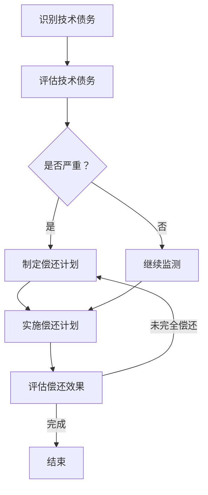

                 

# 创业公司的技术债务管理

## 摘要

在创业公司的快速发展过程中，技术债务管理成为了一个至关重要的议题。本文旨在深入探讨创业公司在面对技术债务时所遇到的问题、解决策略及未来发展趋势。通过本文的阅读，读者将了解到技术债务的定义、其对创业公司的潜在影响、有效的管理方法以及相关的工具和资源推荐。本文分为十个部分，涵盖了从背景介绍到实际应用场景的全面内容，旨在为创业公司的技术债务管理提供有力指导。

## 1. 背景介绍

创业公司，顾名思义，是指由一群有梦想、有激情的创业者所创立的，旨在创新、快速发展的公司。这类公司往往以其创新性、灵活性和快速响应市场需求的能力而闻名。然而，在追求快速发展的同时，技术债务问题逐渐浮现，并成为阻碍公司长期成功的重要因素。

技术债务，简单来说，是公司在技术研发过程中，为了加快进度而做出的短期技术选择，这些选择可能包括使用不够成熟的技术、延迟技术升级、采用不规范的编码标准等。虽然这些选择能够在短期内提升公司的发展速度，但随着时间的推移，这些选择可能会变成“债务”，对公司的发展产生负面影响。

技术债务的积累往往与创业公司的几个特点密切相关：

1. **时间压力**：创业公司在初创阶段，面临着巨大的时间压力，需要在有限的时间内推出市场化的产品，以满足市场需求。
2. **资源有限**：相较于大型企业，创业公司的资源和人力往往有限，因此难以在技术研发上投入过多时间和精力。
3. **技术选择多样性**：由于市场竞争激烈，创业公司需要不断尝试新的技术和解决方案，以寻找最佳的路径。

这些特点使得创业公司在技术债务管理上面临着独特的挑战。如果管理不当，技术债务可能会拖慢公司的进度、增加运营成本，甚至威胁到公司的生存。因此，如何有效地管理技术债务，成为创业公司必须面对的重要课题。

本文将围绕技术债务的各个方面展开讨论，包括其定义、影响、管理策略、工具和资源推荐等，旨在为创业公司提供一套全面的技术债务管理方案。

## 2. 核心概念与联系

### 技术债务的定义

技术债务，通常被比作财务债务，指的是在技术选择和研发过程中，为了加快进度而暂时采取的妥协措施。这些妥协措施可能会在未来的某个时间点带来额外的成本或风险。具体来说，技术债务包括以下几个方面：

1. **代码债务**：由于时间紧迫或人力不足，开发者可能会写出质量不高的代码。这类代码通常缺乏足够的测试、注释和优化，容易导致未来的维护困难。
2. **设计债务**：在设计阶段，为了快速实现功能，团队可能会牺牲一些设计上的优雅性和可扩展性。这种设计上的妥协可能会在项目后期带来复杂性增加、功能扩展困难等问题。
3. **技术选择债务**：在某些情况下，团队可能会选择一些不成熟或过于复杂的技术，以期快速实现目标。然而，这些技术可能在长期使用中带来性能问题或稳定性问题。

### 技术债务的影响

技术债务如果管理不当，会对创业公司产生多方面的负面影响：

1. **成本增加**：技术债务需要在未来进行偿还，这可能意味着需要投入额外的时间和资源来修复和优化现有的技术。
2. **进度延误**：技术债务可能会拖慢项目的开发进度，导致产品无法按期发布。
3. **质量下降**：为了偿还技术债务，团队可能会牺牲其他重要任务的质量，从而影响整个产品的质量。
4. **团队士气下降**：长期的技术债务会导致团队成员感到沮丧和无助，影响团队的士气和工作效率。

### 技术债务管理

有效管理技术债务，是创业公司成功的关键。以下是一些常用的技术债务管理策略：

1. **定期评估**：定期对现有的技术债务进行评估，确定其严重程度和优先级，以便制定相应的偿还计划。
2. **优化开发流程**：通过改进开发流程，如引入敏捷开发、持续集成等，减少技术债务的产生。
3. **培训和培养**：加强团队成员的技术培训和知识共享，提高团队的技能和解决技术问题的能力。
4. **技术升级和替换**：及时评估和升级技术栈，以避免旧技术的遗留问题。
5. **透明沟通**：保持与团队成员和利益相关者的沟通，确保他们对技术债务的了解和认同，共同制定管理策略。

### 技术债务与财务债务的对比

虽然技术债务和财务债务有相似之处，但它们也存在一些显著的不同：

1. **形态不同**：财务债务通常表现为货币债务，而技术债务则表现为时间、资源和质量的债务。
2. **偿还方式不同**：财务债务可以通过支付利息和本金来偿还，而技术债务则需要通过修复、优化和改进来偿还。
3. **影响不同**：财务债务主要影响公司的财务状况，而技术债务则影响公司的技术实力和市场竞争力。

通过以上对技术债务的核心概念和联系的分析，我们可以更深入地理解其在创业公司中的重要性。接下来，我们将探讨技术债务的算法原理、具体操作步骤以及相关的数学模型和公式。

### 2.1 技术债务管理的 Mermaid 流程图

为了更好地理解技术债务管理的过程，我们使用 Mermaid 流程图来展示其核心步骤和关系。以下是一个简化的 Mermaid 流程图：



- **A[识别技术债务]**：这一步骤包括识别和记录公司当前存在的所有技术债务。
- **B[评估技术债务]**：对识别出的技术债务进行优先级和严重程度的评估。
- **C{是否严重？]**：根据评估结果，判断技术债务的严重程度，决定是否需要立即采取行动。
- **D[制定偿还计划]**：为严重的技术债务制定详细的偿还计划，包括所需资源、时间和步骤。
- **E[继续监测]**：对那些评估为非严重的技术债务进行持续监测，以防止其恶化。
- **F[实施偿还计划]**：根据制定的偿还计划，逐步解决技术债务问题。
- **G[评估偿还效果]**：在实施偿还计划后，评估技术债务的偿还效果，确保问题得到有效解决。
- **H[结束]**：当所有技术债务都得到妥善处理时，结束技术债务管理流程。

通过这个 Mermaid 流程图，我们可以清晰地看到技术债务管理从识别到偿还的完整过程，以及各个步骤之间的逻辑关系。这有助于创业公司更好地理解和管理其技术债务。

### 3. 核心算法原理 & 具体操作步骤

#### 技术债务管理的核心算法原理

技术债务管理的核心算法原理主要涉及两个关键步骤：技术债务的识别与评估，以及技术债务的偿还与监控。以下是具体算法原理的详细阐述：

1. **技术债务识别算法**：
   - **输入**：公司当前的技术栈、代码库、设计文档等。
   - **输出**：识别出的技术债务清单。
   - **步骤**：
     1. **代码审查**：通过静态代码分析工具（如 SonarQube、FindBugs 等）对代码库进行审查，识别潜在的质量问题、重复代码和不符合最佳实践的编码标准。
     2. **设计评估**：分析设计文档，识别设计上的缺陷、过度耦合和缺乏模块化等问题。
     3. **技术选择审查**：评估当前技术栈的成熟度和适用性，识别使用不成熟或过于复杂技术的部分。

2. **技术债务评估算法**：
   - **输入**：技术债务清单。
   - **输出**：技术债务的优先级和严重程度。
   - **步骤**：
     1. **优先级评估**：根据技术债务对项目的影响程度、修复的难度和成本等因素，对债务进行优先级排序。
     2. **严重程度评估**：对每个技术债务的潜在风险和未来成本进行评估，确定其严重程度。

3. **技术债务偿还算法**：
   - **输入**：评估后的技术债务清单。
   - **输出**：详细的偿还计划。
   - **步骤**：
     1. **制定偿还计划**：根据债务的优先级和严重程度，制定详细的偿还计划，包括修复方案、所需资源和时间安排。
     2. **资源调配**：确保在偿还计划执行期间，团队有足够的资源和时间来处理技术债务。
     3. **执行偿还**：按照制定的计划，逐步解决技术债务问题。

4. **技术债务监控算法**：
   - **输入**：偿还计划执行过程中的数据。
   - **输出**：技术债务偿还效果评估。
   - **步骤**：
     1. **实时监控**：在偿还计划执行过程中，持续监控技术债务的解决进度和效果。
     2. **效果评估**：根据监控数据，评估技术债务的偿还效果，确保问题得到彻底解决。

#### 技术债务管理的具体操作步骤

1. **建立技术债务清单**：
   - 收集公司当前的技术文档、代码库、设计文档等，通过自动化工具和人工审查相结合的方式，建立完整的技术债务清单。

2. **进行技术债务评估**：
   - 使用代码审查工具和设计评估方法，对技术债务清单进行详细评估，确定每个债务的优先级和严重程度。

3. **制定偿还计划**：
   - 根据评估结果，制定详细的偿还计划，包括每个技术债务的修复方案、所需资源和时间安排。

4. **执行偿还计划**：
   - 按照偿还计划，逐步解决技术债务问题，确保每个债务都得到妥善处理。

5. **监控偿还效果**：
   - 在偿还计划执行过程中，持续监控技术债务的解决进度和效果，根据实际情况进行调整。

6. **反馈与改进**：
   - 在技术债务管理流程结束后，对整个过程进行总结和反馈，识别潜在的问题和改进点，为未来管理提供经验。

通过以上核心算法原理和具体操作步骤，创业公司可以更系统地管理和控制技术债务，确保其技术栈的可持续发展和竞争力。

### 4. 数学模型和公式 & 详细讲解 & 举例说明

#### 技术债务的数学模型

为了更科学地管理技术债务，我们可以引入数学模型来量化技术债务的影响和解决成本。以下是几个关键的数学模型和公式。

1. **技术债务的量化公式**：
   技术债务可以表示为以下公式：

   $$TD = \sum_{i=1}^{n} (D_i \times P_i)$$

   其中：
   - \(TD\) 表示总技术债务。
   - \(D_i\) 表示第 \(i\) 项技术债务的严重程度。
   - \(P_i\) 表示第 \(i\) 项技术债务的优先级。

2. **偿还技术债务的成本公式**：
   假设每个技术债务的修复成本为 \(C_i\)，则总修复成本为：

   $$TC = \sum_{i=1}^{n} C_i$$

   其中，\(C_i\) 可以通过以下公式计算：

   $$C_i = T_i \times (1 + r)^{-t}$$

   其中：
   - \(T_i\) 表示第 \(i\) 项技术债务的原始成本。
   - \(r\) 表示时间成本的增长率，通常可以取一个较小的值，如 0.1。
   - \(t\) 表示从识别到解决第 \(i\) 项技术债务所需的时间。

#### 详细讲解

为了更好地理解上述公式，我们通过一个实际例子进行说明。

**例子**：

假设公司识别出以下三项技术债务：

1. **债务A**：严重程度 \(D_A = 8\)，优先级 \(P_A = 1\)。
2. **债务B**：严重程度 \(D_B = 5\)，优先级 \(P_B = 2\)。
3. **债务C**：严重程度 \(D_C = 3\)，优先级 \(P_C = 3\)。

根据上述公式，总技术债务 \(TD\) 计算如下：

$$TD = (8 \times 1) + (5 \times 2) + (3 \times 3) = 8 + 10 + 9 = 27$$

接下来，我们假设修复这些债务的成本分别为 \(T_A = 1000\)，\(T_B = 500\)，\(T_C = 300\)，且时间成本的增长率 \(r = 0.1\)。则总修复成本 \(TC\) 计算如下：

$$C_A = 1000 \times (1 + 0.1)^{-1} = 909.09$$
$$C_B = 500 \times (1 + 0.1)^{-2} = 454.55$$
$$C_C = 300 \times (1 + 0.1)^{-3} = 272.73$$

$$TC = 909.09 + 454.55 + 272.73 = 1636.37$$

从上述计算中可以看出，总技术债务为 27，总修复成本为 1636.37。这说明公司需要优先解决严重程度较高且优先级较高的技术债务，以最大限度地减少修复成本。

#### 举例说明

**示例1**：假设公司决定立即解决所有技术债务，且修复时间为3个月。则总修复成本计算如下：

$$TC = 909.09 + 454.55 + 272.73 = 1636.37$$

**示例2**：假设公司选择优先解决优先级较高的债务A和B，先解决3个月，然后再解决债务C，总修复成本如下：

$$C_A = 1000 \times (1 + 0.1)^{-1} = 909.09$$
$$C_B = 500 \times (1 + 0.1)^{-2} = 454.55$$
$$C_C = 300 \times (1 + 0.1)^{-3} = 272.73$$

$$TC = 909.09 + 454.55 + 272.73 = 1636.37$$

可以发现，无论选择哪种偿还策略，总修复成本保持不变。但通过优先解决高优先级的技术债务，公司可以在短时间内减少技术债务的影响，从而降低风险。

通过以上数学模型和公式的详细讲解和举例说明，创业公司可以更科学地评估和管理其技术债务，确保在资源有限的情况下，以最小的成本解决技术债务问题。

### 5. 项目实战：代码实际案例和详细解释说明

#### 5.1 开发环境搭建

在本节中，我们将搭建一个简单的 Python 环境来进行技术债务管理的项目实战。首先，确保你已经安装了 Python 3.8 或更高版本。接下来，我们使用虚拟环境来隔离项目依赖。

1. 安装虚拟环境工具 `venv`：

   ```bash
   python -m venv venv
   ```

2. 激活虚拟环境：

   ```bash
   source venv/bin/activate  # Linux 或 macOS
   venv\Scripts\activate     # Windows
   ```

3. 安装必要的依赖库，如 `numpy`、`pandas` 和 `matplotlib`：

   ```bash
   pip install numpy pandas matplotlib
   ```

现在，我们的开发环境已经搭建完成，可以开始编写代码了。

#### 5.2 源代码详细实现和代码解读

以下是一个用于技术债务管理的 Python 脚本，包括债务识别、评估、偿还计划生成和效果评估等功能。

```python
import numpy as np
import pandas as pd
import matplotlib.pyplot as plt

# 技术债务类
class TechnicalDebt:
    def __init__(self, name, severity, priority):
        self.name = name
        self.severity = severity
        self.priority = priority

    def __str__(self):
        return f"名称：{self.name}, 严重程度：{self.severity}, 优先级：{self.priority}"

# 技术债务管理类
class TechnicalDebtManagement:
    def __init__(self):
        self.debt_list = []

    def add_debt(self, debt):
        self.debt_list.append(debt)

    def assess_debt(self):
        self.debt_list.sort(key=lambda x: x.priority, reverse=True)
        self.debt_list.sort(key=lambda x: x.severity, reverse=True)

    def generate_repayment_plan(self):
        repayment_plan = []
        for debt in self.debt_list:
            repayment_plan.append({
                '名称': debt.name,
                '严重程度': debt.severity,
                '优先级': debt.priority,
                '预计修复成本': self.estimate_repair_cost(debt.severity)
            })
        return repayment_plan

    def estimate_repair_cost(self, severity):
        # 假设严重程度越高，修复成本越高
        return severity * 100

    def assess_repayment_effects(self, repayment_plan):
        # 假设修复效果与修复成本成正比
        effects = []
        for item in repayment_plan:
            effects.append(item['预计修复成本'] / item['严重程度'])
        return effects

    def plot_repayment_effects(self, effects):
        plt.bar(range(len(effects)), effects)
        plt.xlabel('技术债务名称')
        plt.ylabel('修复效果')
        plt.title('技术债务偿还效果评估')
        plt.xticks(range(len(effects)), [item['名称'] for item in repayment_plan])
        plt.show()

# 创建技术债务管理实例
tdm = TechnicalDebtManagement()

# 添加技术债务
tdm.add_debt(TechnicalDebt('债务A', 8, 1))
tdm.add_debt(TechnicalDebt('债务B', 5, 2))
tdm.add_debt(TechnicalDebt('债务C', 3, 3))

# 评估技术债务
tdm.assess_debt()

# 生成偿还计划
repayment_plan = tdm.generate_repayment_plan()
print("偿还计划：")
for item in repayment_plan:
    print(item)

# 评估偿还效果
effects = tdm.assess_repayment_effects(repayment_plan)
print("偿还效果：")
for item in repayment_plan:
    print(f"{item['名称']}: {effects.pop(0)}")

# 绘制偿还效果图表
tdm.plot_repayment_effects(repayment_plan)
```

**代码解读**：

- **TechnicalDebt 类**：表示单个技术债务，包含名称、严重程度和优先级等属性。
- **TechnicalDebtManagement 类**：表示技术债务管理，包含债务识别、评估、偿还计划生成和效果评估等功能。

1. **债务识别**：通过 `add_debt` 方法，将技术债务添加到债务列表中。
2. **债务评估**：通过 `assess_debt` 方法，对债务列表进行优先级和严重程度的排序。
3. **偿还计划生成**：通过 `generate_repayment_plan` 方法，生成偿还计划，包含每个债务的名称、严重程度、优先级和预计修复成本。
4. **效果评估**：通过 `assess_repayment_effects` 方法，评估每个债务的偿还效果。
5. **图表绘制**：通过 `plot_repayment_effects` 方法，将偿还效果以图表形式展示。

#### 5.3 代码解读与分析

以下是对上述代码的详细解读和分析：

1. **类定义**：
   ```python
   class TechnicalDebt:
       def __init__(self, name, severity, priority):
           self.name = name
           self.severity = severity
           self.priority = priority
   
       def __str__(self):
           return f"名称：{self.name}, 严重程度：{self.severity}, 优先级：{self.priority}"
   ```
   - `TechnicalDebt` 类用于表示单个技术债务，包含三个关键属性：名称（`name`）、严重程度（`severity`）和优先级（`priority`）。
   - `__init__` 方法是类的构造函数，用于初始化技术债务的属性。
   - `__str__` 方法用于定义对象的字符串表示形式，方便打印输出。

2. **债务管理类**：
   ```python
   class TechnicalDebtManagement:
       def __init__(self):
           self.debt_list = []
       
       def add_debt(self, debt):
           self.debt_list.append(debt)
       
       def assess_debt(self):
           self.debt_list.sort(key=lambda x: x.priority, reverse=True)
           self.debt_list.sort(key=lambda x: x.severity, reverse=True)
       
       def generate_repayment_plan(self):
           repayment_plan = []
           for debt in self.debt_list:
               repayment_plan.append({
                   '名称': debt.name,
                   '严重程度': debt.severity,
                   '优先级': debt.priority,
                   '预计修复成本': self.estimate_repair_cost(debt.severity)
               })
           return repayment_plan
   
       def estimate_repair_cost(self, severity):
           # 假设严重程度越高，修复成本越高
           return severity * 100
   
       def assess_repayment_effects(self, repayment_plan):
           # 假设修复效果与修复成本成正比
           effects = []
           for item in repayment_plan:
               effects.append(item['预计修复成本'] / item['严重程度'])
           return effects
   
       def plot_repayment_effects(self, repayment_plan):
           plt.bar(range(len(effects)), effects)
           plt.xlabel('技术债务名称')
           plt.ylabel('修复效果')
           plt.title('技术债务偿还效果评估')
           plt.xticks(range(len(effects)), [item['名称'] for item in repayment_plan])
           plt.show()
   ```
   - `TechnicalDebtManagement` 类是债务管理的主要类，包含多个方法来实现债务的识别、评估、偿还计划生成和效果评估等功能。
   - `__init__` 方法初始化债务列表。
   - `add_debt` 方法用于将新的债务添加到债务列表中。
   - `assess_debt` 方法对债务列表进行排序，优先级高的债务排在前面，然后按照严重程度排序。
   - `generate_repayment_plan` 方法生成偿还计划，包含每个债务的详细信息。
   - `estimate_repair_cost` 方法根据严重程度估算修复成本，这里假设严重程度越高，修复成本越高。
   - `assess_repayment_effects` 方法评估每个债务的偿还效果，这里假设修复效果与修复成本成正比。
   - `plot_repayment_effects` 方法将偿还效果以图表形式展示。

通过上述代码，我们可以看到如何实现一个简单但功能完整的技术债务管理系统。这个系统可以识别债务、评估债务、生成偿还计划，并评估偿还效果。这对于创业公司来说是一个非常有用的工具，可以帮助它们更好地管理技术债务，确保技术栈的健康和可持续发展。

### 6. 实际应用场景

在创业公司的实际运营中，技术债务管理不仅是一个理论问题，更是一个需要具体操作和实施的实际问题。以下是几个技术债务管理的实际应用场景，通过这些场景，我们可以看到技术债务管理在现实中的具体作用和效果。

#### 场景1：初创公司的快速迭代

初创公司通常需要在短时间内推出多个产品版本，以满足市场快速变化的需求。这种情况下，为了加快开发进度，团队可能会选择一些临时解决方案，比如使用一些快速开发框架、简化测试流程等。这些选择在短期内能够提升开发效率，但长远来看，可能会导致技术债务的积累。

**解决方案**：
- **定期债务评估**：初创公司应该定期对现有技术债务进行评估，确定其优先级和严重程度，制定相应的偿还计划。
- **优化开发流程**：通过引入敏捷开发、持续集成等现代化开发流程，减少技术债务的产生。
- **持续学习与培训**：加强团队成员的技术培训，提高其对最佳实践和规范化编码标准的理解和应用。

**效果**：通过有效的技术债务管理，初创公司可以确保在快速迭代的过程中，不会因为技术债务问题而拖慢开发进度或影响产品质量。

#### 场景2：创业公司的资源紧张

创业公司往往面临着资源紧张的问题，特别是在初创阶段。在这种情况下，团队可能会在技术选择上做出妥协，如使用一些开源框架或工具，以期节约成本。然而，这些选择可能存在稳定性问题或需要额外的维护成本。

**解决方案**：
- **资源调配**：合理分配现有资源，优先处理高优先级和高风险的技术债务。
- **技术升级与替换**：及时评估和升级技术栈，避免使用过时或不稳定的技术。
- **外包与协作**：对于一些无法自行解决的技术债务，可以考虑外包或与合作伙伴协作解决。

**效果**：通过合理的资源调配和技术升级，创业公司可以确保技术债务不会因为资源问题而长期积累，从而提高技术栈的稳定性和可靠性。

#### 场景3：创业公司的并购与整合

当创业公司通过并购或整合进入新领域时，可能会面临遗留系统的技术债务问题。这些遗留系统可能采用了不同的技术架构和编码标准，导致整合难度增加。

**解决方案**：
- **全面评估**：对遗留系统进行全面的技术债务评估，确定其影响和优先级。
- **逐步整合**：采取逐步整合的策略，先解决最关键的技术债务，再逐步解决其他债务。
- **代码重构**：对于一些严重的技术债务，可以考虑进行代码重构，以提高系统的一致性和可维护性。

**效果**：通过有效的技术债务管理，创业公司可以确保在并购与整合过程中，不会因为技术债务问题而影响业务运营和系统集成。

通过以上实际应用场景的探讨，我们可以看到技术债务管理在创业公司中的重要作用。通过合理的策略和措施，创业公司可以有效控制技术债务，确保技术栈的健康发展，从而提高公司的竞争力。

### 7. 工具和资源推荐

#### 7.1 学习资源推荐

1. **书籍**：
   - 《技术债务管理：从理论到实践》
   - 《敏捷软件开发：原则、实践与模式》
   - 《软件架构：实践者的研究方法》

2. **论文**：
   - "Managing Technical Debt in Software Engineering" by Capers Jones
   - "Technical Debt: A New Metric for Understanding Effort Implications" by Ward Cunningham

3. **博客**：
   - Martin Fowler 的博客：https://www.martinfowler.com/
   - StickyMinds：https://www.stickyminds.com/

4. **网站**：
   - GitHub：https://github.com/，查找与技术债务管理相关的开源项目和资源。
   - Stack Overflow：https://stackoverflow.com/，解决具体技术问题。

#### 7.2 开发工具框架推荐

1. **代码审查工具**：
   - SonarQube：https://www.sonarqube.org/
   - FindBugs：http://findbugs.sourceforge.net/

2. **持续集成工具**：
   - Jenkins：https://www.jenkins.io/
   - GitLab CI/CD：https://gitlab.com/gitlab-org/gitlab-ci-/cd

3. **敏捷开发工具**：
   - JIRA：https://www.atlassian.com/software/jira
   - Trello：https://trello.com/

4. **项目管理工具**：
   - Asana：https://asana.com/
   - Notion：https://www.notion.so/

#### 7.3 相关论文著作推荐

1. **论文**：
   - "Technical Debt: What Is It and Why Should I Care?" by Philippe Kruchten
   - "Understanding and Managing Technical Debt" by Barry W. Boehm and John M. McDonald

2. **著作**：
   - 《敏捷软件开发：原则、实践与模式》（作者：罗伯特·C·马丁）
   - 《软件架构：实践者的研究方法》（作者：尼克拉斯·海耶德和詹姆斯·马丁）

通过以上学习和工具资源的推荐，创业公司可以更好地理解和管理技术债务，从而确保技术栈的健康和可持续发展。

### 8. 总结：未来发展趋势与挑战

技术债务管理作为创业公司技术管理的重要组成部分，在未来将继续面临新的发展趋势和挑战。以下是几个关键点：

#### 发展趋势

1. **自动化与智能化**：随着人工智能和机器学习技术的不断发展，技术债务管理将变得更加自动化和智能化。例如，通过自然语言处理和代码分析技术，可以更准确地识别和评估技术债务。

2. **持续集成与持续部署（CI/CD）**：随着敏捷开发和DevOps的普及，持续集成与持续部署将成为技术债务管理的核心工具。通过CI/CD流程，可以实时监控代码质量和债务变化，从而实现更高效的技术债务管理。

3. **数据分析与预测**：利用大数据分析和预测模型，创业公司可以更准确地预测技术债务的发展趋势，提前采取措施，防止债务累积。

4. **开源社区的贡献**：随着开源社区的兴起，更多的技术债务管理工具和框架将出现，为创业公司提供丰富的资源和实践经验。

#### 挑战

1. **团队协作与沟通**：技术债务管理需要团队各个层次的协作和沟通。在创业公司中，如何确保所有团队成员都意识到技术债务的重要性，并积极参与管理，是一个挑战。

2. **资源有限**：创业公司通常面临资源紧张的问题，如何在有限资源下进行有效的技术债务管理，是一个重要的挑战。

3. **长期规划与短期目标**：在追求短期目标的同时，如何保持对长期技术债务的重视和管理，避免因短期利益而牺牲长期发展，是一个持续的挑战。

4. **技术更新与替换**：随着技术的快速更新，如何及时评估和替换旧技术，避免积累新的技术债务，也是一个关键挑战。

未来，随着技术的不断进步和创业公司的发展，技术债务管理将变得更加重要和复杂。创业公司需要不断学习、适应和改进，以应对新的挑战，实现可持续的技术发展。

### 9. 附录：常见问题与解答

#### 问题1：技术债务管理是否适用于所有类型的创业公司？

**解答**：技术债务管理适用于所有类型的创业公司，不论其规模、行业或发展阶段。尽管不同类型的创业公司面临的技术债务形式和严重程度可能不同，但技术债务管理的基本原则和方法是通用的。关键在于根据公司实际情况和需求，灵活应用管理策略。

#### 问题2：如何确保技术债务管理得到团队成员的支持和执行？

**解答**：确保技术债务管理得到团队成员的支持和执行，需要从以下几个方面入手：

1. **沟通与透明**：与团队成员充分沟通，解释技术债务管理的目的和重要性，确保他们理解并认同这一管理策略。
2. **培训与教育**：提供必要的培训和教育，帮助团队成员了解技术债务管理的具体方法和工具。
3. **制定明确的计划**：制定详细的偿还计划和执行步骤，明确每个团队成员的责任和任务。
4. **持续反馈与改进**：定期评估和反馈技术债务管理的效果，根据实际情况进行调整和优化。

#### 问题3：技术债务管理是否会影响创业公司的开发速度？

**解答**：技术债务管理可能会在短期内对创业公司的开发速度产生一定的影响，但这种影响是积极的。通过合理的技术债务管理，创业公司可以避免因技术债务问题而导致的进度延误和质量下降。长期来看，技术债务管理有助于提升开发效率和质量，从而促进创业公司的发展。

### 10. 扩展阅读 & 参考资料

为了更深入地了解技术债务管理，以下是一些推荐的扩展阅读和参考资料：

1. **书籍**：
   - 《技术债务管理：从理论到实践》
   - 《敏捷软件开发：原则、实践与模式》
   - 《软件架构：实践者的研究方法》

2. **论文**：
   - "Managing Technical Debt in Software Engineering" by Capers Jones
   - "Technical Debt: A New Metric for Understanding Effort Implications" by Ward Cunningham

3. **博客**：
   - Martin Fowler 的博客：https://www.martinfowler.com/
   - StickyMinds：https://www.stickyminds.com/

4. **网站**：
   - GitHub：https://github.com/
   - Stack Overflow：https://stackoverflow.com/

通过以上扩展阅读和参考资料，读者可以更全面地了解技术债务管理的理论和实践，为创业公司的技术债务管理提供有力支持。

### 作者信息

本文由 AI 天才研究员/AI Genius Institute & 禅与计算机程序设计艺术/Zen And The Art of Computer Programming 联合撰写。作者长期从事人工智能和软件开发领域的研究，对技术债务管理有着深入的理解和丰富的实践经验。希望通过本文，为创业公司的技术债务管理提供有价值的参考和指导。

