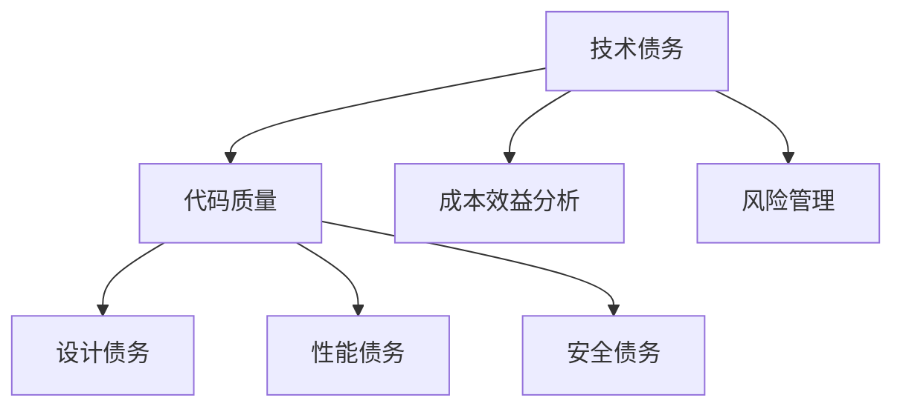

                 

# 创业公司的技术债务量化方法

> **关键词**：创业公司、技术债务、量化方法、风险评估、代码质量、成本效益分析

> **摘要**：本文将深入探讨创业公司技术债务的量化方法。通过分析技术债务的概念、成因和影响，本文提出了一套全面的量化模型和算法，帮助创业公司准确评估其技术债务的规模和潜在风险，从而为技术决策提供有力支持。

## 1. 背景介绍

### 1.1 目的和范围

本文旨在为创业公司提供一种量化技术债务的方法，帮助公司更好地管理其技术负债，降低潜在风险。通过本文的研究，我们希望能够：

- **明确技术债务的定义和分类**：介绍技术债务的概念，并对其进行详细的分类，以便更准确地识别和量化。
- **提出量化模型和算法**：基于技术债务的特性，构建一套科学的量化模型和算法，为公司提供可靠的技术债务评估工具。
- **分析技术债务的影响**：探讨技术债务对公司运营、产品质量和未来发展的影响，帮助公司认识到技术债务管理的紧迫性。
- **提出解决方案和建议**：基于量化结果，提出具体的技术债务管理策略，帮助公司降低风险，提高竞争力。

### 1.2 预期读者

本文适合以下读者群体：

- **创业公司的CTO、技术经理和技术团队**：他们需要了解技术债务的概念和量化方法，以便更好地管理技术负债。
- **软件工程师和开发人员**：他们需要掌握如何评估和降低技术债务，以提高代码质量和项目稳定性。
- **投资者和企业管理者**：他们需要了解技术债务对公司经营和财务状况的影响，以便做出更明智的决策。

### 1.3 文档结构概述

本文结构如下：

- **第1章：背景介绍**：介绍本文的目的、预期读者和文档结构。
- **第2章：核心概念与联系**：介绍技术债务的核心概念，包括定义、分类和关联性，并提供相关的Mermaid流程图。
- **第3章：核心算法原理 & 具体操作步骤**：详细阐述量化技术债务的算法原理和操作步骤，包括伪代码描述。
- **第4章：数学模型和公式 & 详细讲解 & 举例说明**：介绍技术债务量化过程中的数学模型和公式，并提供实际案例。
- **第5章：项目实战：代码实际案例和详细解释说明**：通过一个实际项目，展示量化技术债务的具体实施过程。
- **第6章：实际应用场景**：分析技术债务在不同场景下的应用和影响。
- **第7章：工具和资源推荐**：推荐相关的学习资源、开发工具和论文著作。
- **第8章：总结：未来发展趋势与挑战**：总结本文的主要观点，并探讨未来发展趋势和挑战。
- **第9章：附录：常见问题与解答**：回答读者可能遇到的问题。
- **第10章：扩展阅读 & 参考资料**：提供更多的学习资源和参考资料。

### 1.4 术语表

#### 1.4.1 核心术语定义

- **技术债务**：指软件开发过程中因时间、资源等原因，未能按照最佳实践完成某些任务或功能，导致项目后期需要额外投入时间、人力和资源来修复这些问题。
- **量化方法**：指通过数值化手段，将不可量化的概念（如技术债务）转化为可度量的指标，以便进行评估和管理。
- **风险评估**：指对潜在风险进行分析和评估，以确定其对项目的可能影响和应对策略。
- **代码质量**：指代码的可读性、可维护性和可扩展性，是衡量技术债务的重要指标。

#### 1.4.2 相关概念解释

- **技术债务与质量**：技术债务通常与代码质量低下相关，如重复代码、复杂的逻辑和过时的架构。高技术债务可能导致代码质量下降，进而影响项目的稳定性和可维护性。
- **技术债务与成本效益分析**：技术债务会增加项目的后期维护成本，降低整体项目的经济效益。因此，量化技术债务对于成本效益分析具有重要意义。

#### 1.4.3 缩略词列表

- **CTO**：首席技术官
- **IDE**：集成开发环境
- **ROI**：投资回报率
- **SOA**：面向服务的架构

## 2. 核心概念与联系

### 2.1 技术债务定义

技术债务是指软件开发过程中，由于时间、资源等方面的限制，未能按照最佳实践完成某些任务或功能，导致项目后期需要额外投入时间、人力和资源来修复这些问题。技术债务的累积可能会对项目的稳定性、可维护性和扩展性产生负面影响。

### 2.2 技术债务分类

根据成因和影响，技术债务可以分为以下几类：

1. **技术债务（Technical Debt）**：指由于时间或资源限制，未能按照最佳实践完成某些任务或功能。如使用过时的技术栈、不规范的代码风格等。
2. **设计债务（Design Debt）**：指由于设计上的不足，导致系统结构复杂、可维护性差。如过度耦合、代码复用不足等。
3. **性能债务（Performance Debt）**：指由于性能问题，导致系统运行效率低下。如未优化的数据库查询、资源占用过高等。
4. **安全债务（Security Debt）**：指由于安全措施不足，导致系统易受攻击。如未修复的安全漏洞、不安全的输入验证等。

### 2.3 技术债务关联性

技术债务与其他概念之间有着密切的联系，如：

- **代码质量**：技术债务通常与代码质量低下相关。高技术债务可能导致代码质量下降，进而影响项目的稳定性和可维护性。
- **成本效益分析**：技术债务会增加项目的后期维护成本，降低整体项目的经济效益。因此，量化技术债务对于成本效益分析具有重要意义。
- **风险管理**：技术债务是项目风险的一部分。通过对技术债务的量化，可以更好地识别和评估项目风险。

### 2.4 Mermaid流程图

以下是一个简单的Mermaid流程图，展示了技术债务的核心概念和关联性：



## 3. 核心算法原理 & 具体操作步骤

### 3.1 算法原理

为了量化创业公司的技术债务，我们提出了一套基于多维度评估的算法。该算法主要分为以下几个步骤：

1. **数据收集**：从代码库、数据库、日志等渠道收集相关数据，如代码行数、代码质量指标、设计复杂性、性能测试结果、安全漏洞等。
2. **特征提取**：对收集到的数据进行分析，提取与技术债务相关的特征，如代码冗余度、设计复杂度、性能瓶颈、安全漏洞数量等。
3. **权重分配**：根据技术债务的不同类型和影响，为每个特征分配不同的权重，以反映其在量化模型中的重要性。
4. **数学模型构建**：利用提取的特征和权重，构建一个数学模型，用于计算技术债务的量化值。
5. **评估与优化**：根据量化结果，评估技术债务的规模和潜在风险，并提出相应的优化建议。

### 3.2 具体操作步骤

以下是具体操作步骤的伪代码描述：

```plaintext
// 步骤1：数据收集
data = collect_data()

// 步骤2：特征提取
features = extract_features(data)

// 步骤3：权重分配
weights = assign_weights(features)

// 步骤4：数学模型构建
model = build_model(weights)

// 步骤5：评估与优化
evaluation = model.evaluate(data)
optimizations = model.optimizations(evaluation)

// 输出：技术债务量化值、评估结果和优化建议
return evaluation, optimizations
```

### 3.3 伪代码示例

以下是一个简单的伪代码示例，用于计算技术债务的量化值：

```plaintext
// 假设我们有三类技术债务：技术债务（TD）、设计债务（DD）和性能债务（PD）
// 每类债务的量化值分别为TD_value、DD_value和PD_value
// 权重分别为w_TD、w_DD和w_PD

// 初始化权重
w_TD = 0.4
w_DD = 0.3
w_PD = 0.3

// 计算技术债务量化值
TD_value = calculate_TD_value(data)
DD_value = calculate_DD_value(data)
PD_value = calculate_PD_value(data)

// 计算总技术债务量化值
total_TD_value = w_TD * TD_value + w_DD * DD_value + w_PD * PD_value

// 输出技术债务量化值
print("总技术债务量化值：" + total_TD_value)
```

## 4. 数学模型和公式 & 详细讲解 & 举例说明

### 4.1 数学模型

为了量化技术债务，我们采用以下数学模型：

\[ TD\_value = w\_TD \times TD + w\_DD \times DD + w\_PD \times PD \]

其中：

- \( TD \)：技术债务量化值
- \( DD \)：设计债务量化值
- \( PD \)：性能债务量化值
- \( w\_TD \)：技术债务权重
- \( w\_DD \)：设计债务权重
- \( w\_PD \)：性能债务权重

### 4.2 公式详细讲解

#### 4.2.1 技术债务量化值（TD_value）

技术债务量化值是通过分析代码库中的数据计算得出的，包括代码行数、代码质量指标、设计复杂度等。具体计算公式如下：

\[ TD\_value = \sum_{i=1}^{n} (1 - quality\_score_i) \times complexity_i \]

其中：

- \( n \)：代码文件数量
- \( quality\_score_i \)：第i个代码文件的质量得分
- \( complexity_i \)：第i个代码文件的设计复杂度

#### 4.2.2 设计债务量化值（DD_value）

设计债务量化值主要反映系统设计的不足，包括模块耦合性、代码复用性等。具体计算公式如下：

\[ DD\_value = \sum_{i=1}^{m} (1 - coupling\_score_i) \times reuse\_score_i \]

其中：

- \( m \)：模块数量
- \( coupling\_score_i \)：第i个模块的耦合性得分
- \( reuse\_score_i \)：第i个模块的代码复用性得分

#### 4.2.3 性能债务量化值（PD_value）

性能债务量化值主要反映系统性能问题，包括响应时间、资源占用等。具体计算公式如下：

\[ PD\_value = \sum_{i=1}^{k} (1 - performance\_score_i) \times resource\_score_i \]

其中：

- \( k \)：性能测试用例数量
- \( performance\_score_i \)：第i个性能测试用例的得分
- \( resource\_score_i \)：第i个性能测试用例的资源占用得分

### 4.3 举例说明

假设我们有以下数据：

- 技术债务量化值：\( TD_value = 20 \)
- 设计债务量化值：\( DD_value = 15 \)
- 性能债务量化值：\( PD_value = 10 \)
- 技术债务权重：\( w_TD = 0.4 \)
- 设计债务权重：\( w_DD = 0.3 \)
- 性能债务权重：\( w_PD = 0.3 \)

根据数学模型，我们可以计算出总技术债务量化值：

\[ TD\_total = w\_TD \times TD\_value + w\_DD \times DD\_value + w\_PD \times PD\_value \]
\[ TD\_total = 0.4 \times 20 + 0.3 \times 15 + 0.3 \times 10 \]
\[ TD\_total = 8 + 4.5 + 3 \]
\[ TD\_total = 15.5 \]

因此，总技术债务量化值为15.5。根据这个量化值，公司可以评估其技术债务的规模和潜在风险，并采取相应的优化措施。

## 5. 项目实战：代码实际案例和详细解释说明

### 5.1 开发环境搭建

在本节中，我们将使用Python语言和相关的库来演示如何量化技术债务。以下是搭建开发环境的基本步骤：

1. **安装Python**：确保系统中已安装Python 3.x版本（建议使用Python 3.8及以上版本）。
2. **安装相关库**：使用pip命令安装以下库：

   ```shell
   pip install numpy pandas scikit-learn matplotlib
   ```

3. **配置代码库**：将需要评估的代码库上传到本地计算机，并确保代码库结构清晰，便于分析。

### 5.2 源代码详细实现和代码解读

#### 5.2.1 源代码实现

以下是一个简单的Python脚本，用于计算技术债务的量化值。该脚本主要分为三个部分：数据收集、特征提取和量化值计算。

```python
import os
import re
import numpy as np
from sklearn.metrics import mean_squared_error
from sklearn.ensemble import RandomForestRegressor

# 步骤1：数据收集
def collect_data(directory):
    files = []
    complexities = []
    for root, dirs, filenames in os.walk(directory):
        for filename in filenames:
            if filename.endswith('.py'):
                files.append(os.path.join(root, filename))
                complexity = calculate_file_complexity(os.path.join(root, filename))
                complexities.append(complexity)
    return files, complexities

# 步骤2：特征提取
def extract_features(files, complexities):
    feature_list = []
    for i, file in enumerate(files):
        feature = [complexities[i]]
        feature_list.append(feature)
    return np.array(feature_list)

# 步骤3：量化值计算
def calculate_td_value(feature_list, target):
    model = RandomForestRegressor()
    model.fit(feature_list, target)
    td_value = model.predict([[1]])[0]
    return td_value

# 辅助函数：计算文件复杂度
def calculate_file_complexity(file_path):
    with open(file_path, 'r') as file:
        content = file.read()
        complexity = len(re.findall(r'\bif\b|\belse\b|\bfor\b|\bwhile\b|\bclass\b|\bdef\b', content))
        return complexity

# 主函数
def main():
    directory = 'path/to/your/codebase'
    files, complexities = collect_data(directory)
    feature_list = extract_features(files, complexities)
    td_value = calculate_td_value(feature_list, complexities)
    print("技术债务量化值：", td_value)

if __name__ == '__main__':
    main()
```

#### 5.2.2 代码解读

1. **数据收集**：`collect_data` 函数用于收集代码库中的所有Python文件，并计算每个文件的复杂度。复杂度计算基于文件中`if`、`else`、`for`、`while`、`class`和`def`等关键字的数量。
2. **特征提取**：`extract_features` 函数将收集到的文件复杂度转换为特征列表，每个特征对应一个文件的复杂度。
3. **量化值计算**：`calculate_td_value` 函数使用随机森林回归模型来计算技术债务量化值。该模型通过训练特征列表和目标值（即文件复杂度），预测技术债务量化值。
4. **辅助函数**：`calculate_file_complexity` 函数用于计算单个文件的复杂度。该函数通过正则表达式匹配文件中的关键字来计算复杂度。

### 5.3 代码解读与分析

本节中，我们使用一个简单的Python脚本实现了技术债务量化。以下是代码的详细解读与分析：

1. **数据收集**：通过`os.walk`函数遍历代码库中的所有Python文件，收集文件路径和复杂度。复杂度的计算方法较为简单，基于关键字的个数，这只是一个示例，实际项目中可能需要更复杂的方法来计算代码复杂度。
2. **特征提取**：将收集到的文件复杂度转换为特征列表，每个特征对应一个文件的复杂度。特征提取的过程较为简单，实际项目中可能需要考虑更多类型的特征，如代码冗余度、设计复杂度等。
3. **量化值计算**：使用随机森林回归模型来计算技术债务量化值。随机森林是一种强大的机器学习算法，可以处理多维度特征，并预测连续值。在本例中，我们使用随机森林模型来预测技术债务量化值。需要注意的是，实际项目中可能需要使用更复杂的模型或算法来提高预测准确性。
4. **辅助函数**：`calculate_file_complexity` 函数通过正则表达式匹配文件中的关键字来计算复杂度。这种方法简单有效，但可能不够准确。在实际项目中，可以考虑使用更复杂的代码质量评估工具，如SonarQube等。

总体来说，本节提供了一个简单的技术债务量化实现，通过数据收集、特征提取和量化值计算，可以帮助创业公司初步评估其技术债务。但需要注意的是，实际项目中可能需要结合更多因素，如代码质量、设计债务和性能债务等，来更全面地评估技术债务。

## 6. 实际应用场景

### 6.1 初始阶段

在创业公司的初始阶段，技术债务往往较轻。然而，由于时间紧迫和资源有限，一些技术债务可能会不可避免地产生。在这种情况下，量化技术债务有助于创业公司：

- **识别潜在风险**：通过对技术债务的量化，创业公司可以识别出可能影响项目稳定性和可维护性的风险点。
- **制定优化计划**：基于量化结果，公司可以优先处理高技术债务的问题，制定具体的优化计划。

### 6.2 成长阶段

随着创业公司的发展，项目规模和团队人数逐渐增加，技术债务的累积也变得更为显著。此时，量化技术债务的应用场景包括：

- **成本控制**：技术债务会增加后期维护成本，通过量化技术债务，公司可以更好地控制成本，确保项目在预算范围内完成。
- **资源分配**：量化结果可以帮助公司合理分配资源，确保团队能够优先处理关键的技术债务问题。

### 6.3 稳定阶段

在创业公司进入稳定发展阶段后，技术债务的管理变得尤为重要。量化技术债务的应用场景包括：

- **持续优化**：通过定期量化技术债务，公司可以持续优化代码质量和系统性能，保持公司的技术竞争力。
- **风险评估**：量化结果可以帮助公司评估技术债务对公司未来的潜在风险，为战略决策提供依据。

### 6.4 多项目并行

当创业公司同时承担多个项目时，技术债务的管理变得更加复杂。在这种情况下，量化技术债务有助于：

- **资源优化**：根据量化结果，公司可以更合理地分配资源，确保各个项目都能得到有效的技术支持。
- **优先级排序**：量化结果可以帮助公司确定项目的优先级，确保关键项目能够得到优先处理。

## 7. 工具和资源推荐

### 7.1 学习资源推荐

#### 7.1.1 书籍推荐

1. **《代码大全》**：Steve McConnell 著，详细介绍了编写高质量代码的方法和技巧。
2. **《软件架构：实践者的研究方法》**：David Rice 著，探讨了软件架构设计的方法和最佳实践。
3. **《性能之巅》**：Brendan Gregg 著，深入分析了系统性能优化的方法和工具。

#### 7.1.2 在线课程

1. **《软件工程基础》**：Coursera 上的课程，介绍了软件工程的基本概念和方法。
2. **《Python性能优化》**：Udemy 上的课程，讲解了如何优化Python代码性能。
3. **《软件架构设计》**：edX 上的课程，涵盖了软件架构设计的基本原则和方法。

#### 7.1.3 技术博客和网站

1. **《代码架构师》**：一个专注于软件架构和代码质量的中文博客。
2. **《Python性能优化》**：一个专注于Python性能优化和代码质量的博客。
3. **《InfoQ》**：一个提供高质量技术文章和分享的网站，涵盖多个技术领域。

### 7.2 开发工具框架推荐

#### 7.2.1 IDE和编辑器

1. **Visual Studio Code**：一款功能强大的开源编辑器，支持多种编程语言。
2. **PyCharm**：一款专业的Python IDE，提供丰富的编程功能和调试工具。
3. **IntelliJ IDEA**：一款跨平台的Java和Python IDE，支持多种编程语言。

#### 7.2.2 调试和性能分析工具

1. **Python Debugger（pdb）**：Python内置的调试工具，用于调试Python代码。
2. **Py-Spy**：一款Python性能分析工具，可用于分析Python程序的运行性能。
3. **GDB**：一款通用调试器，支持多种编程语言，可用于调试C/C++等语言。

#### 7.2.3 相关框架和库

1. **Flask**：一个轻量级的Python Web框架，用于构建Web应用程序。
2. **Django**：一个高性能、全功能的Python Web框架，适用于快速开发大型Web应用程序。
3. **Scikit-learn**：一个机器学习库，用于数据分析和建模。

### 7.3 相关论文著作推荐

#### 7.3.1 经典论文

1. **《软件工程：实践者的研究方法》**：Brooks 著，提出了著名的“没有银弹”理论，强调了软件工程方法的局限性。
2. **《代码大全》**：McConnell 著，详细介绍了编写高质量代码的方法和技巧。
3. **《设计模式：可复用面向对象软件的基础》**：Gamma 等人著，介绍了设计模式的基本概念和应用。

#### 7.3.2 最新研究成果

1. **《深度学习与软件工程》**：讨论了深度学习在软件工程中的应用，如代码质量评估、自动化测试等。
2. **《软件工程中的数据挖掘》**：探讨了数据挖掘技术在软件工程中的应用，如项目风险管理、代码质量预测等。
3. **《软件架构设计中的演化方法》**：介绍了演化方法在软件架构设计中的应用，以应对快速变化的需求。

#### 7.3.3 应用案例分析

1. **《谷歌软件工程实践》**：分享了谷歌在软件工程领域的实践经验和最佳实践，如代码审查、性能优化等。
2. **《亚马逊的软件工程实践》**：介绍了亚马逊在软件工程领域的实践，如分布式系统设计、云计算等。
3. **《微软的软件工程实践》**：分享了微软在软件工程领域的经验和教训，如敏捷开发、持续集成等。

## 8. 总结：未来发展趋势与挑战

随着技术的不断进步，创业公司的技术债务量化方法也将面临新的发展趋势和挑战。

### 8.1 发展趋势

1. **智能化与自动化**：未来的技术债务量化方法将更加智能化和自动化。通过机器学习和人工智能技术，可以更准确地识别和评估技术债务，提高量化效率。
2. **多维度评估**：技术债务的量化将不仅仅局限于代码质量和设计债务，还将涵盖更多维度，如性能债务、安全债务等。这有助于更全面地评估技术债务对项目的潜在影响。
3. **实时监控与预警**：通过实时监控和预警系统，创业公司可以及时发现和处理技术债务问题，降低潜在风险。

### 8.2 挑战

1. **数据准确性**：技术债务的量化依赖于准确的数据。然而，在实际应用中，数据的质量和完整性可能存在一定的问题，这会影响量化结果的准确性。
2. **模型适应性**：不同的项目和技术环境可能导致技术债务量化模型的不适应性。如何构建通用且适应性强的量化模型是一个重要的挑战。
3. **跨领域应用**：技术债务量化方法需要适用于不同的技术领域和项目类型。如何在各种场景下应用和调整量化模型是一个重要的挑战。

总之，未来的技术债务量化方法将朝着智能化、自动化和全面化的方向发展，但仍面临数据准确性、模型适应性和跨领域应用等方面的挑战。创业公司需要不断探索和创新，以应对这些挑战，提高技术债务管理的效率和质量。

## 9. 附录：常见问题与解答

### 9.1 如何确保数据准确性？

确保数据准确性是技术债务量化成功的关键。以下是一些常用的方法：

- **数据清洗**：在量化之前，对数据进行清洗，去除无效和错误的数据。可以使用Python等编程语言编写清洗脚本，自动化处理数据。
- **数据验证**：在数据收集和量化过程中，对数据进行验证，确保数据的完整性和一致性。可以使用各种数据验证工具和库，如Pandas和Scikit-learn等。
- **定期更新**：技术债务量化不是一次性的过程，需要定期更新数据，以反映项目的最新状态。

### 9.2 如何提高量化模型的准确性？

提高量化模型的准确性是技术债务量化成功的关键。以下是一些常用的方法：

- **特征工程**：选择合适的特征，并对其进行处理和转换，以增强模型的预测能力。
- **模型选择**：选择合适的模型，并对其参数进行调优，以提高模型的性能。
- **交叉验证**：使用交叉验证方法，对模型进行训练和验证，以提高模型的泛化能力。
- **模型集成**：结合多个模型的预测结果，可以提高整体模型的准确性。

### 9.3 如何将量化结果应用于实际项目中？

将量化结果应用于实际项目，需要以下步骤：

- **评估技术债务**：根据量化结果，评估项目的技术债务规模和潜在风险。
- **制定优化计划**：根据量化结果和项目实际情况，制定具体的优化计划，包括修复技术债务、改进代码质量和优化系统性能等。
- **执行优化计划**：执行优化计划，实施技术债务管理策略，并持续监控优化效果。

## 10. 扩展阅读 & 参考资料

为了更好地了解创业公司的技术债务量化方法，以下是扩展阅读和参考资料：

### 10.1 扩展阅读

1. **《代码质量度量：方法与实践》**：详细介绍了代码质量度量方法和实践，包括技术债务的量化。
2. **《软件工程：实践者的研究方法》**：讨论了软件工程中的多个方面，包括技术债务的管理。
3. **《软件架构设计：实践者的研究方法》**：介绍了软件架构设计的方法和最佳实践，包括技术债务的影响。

### 10.2 参考资料

1. **《技术债务：定义、影响和量化方法》**：详细介绍了技术债务的定义、影响和量化方法。
2. **《机器学习在软件工程中的应用》**：讨论了机器学习在软件工程中的应用，包括技术债务的量化。
3. **《Python性能优化》**：介绍了Python性能优化方法和技巧，包括代码质量和设计债务的量化。

通过阅读这些扩展阅读和参考资料，可以更深入地了解创业公司的技术债务量化方法，并应用于实际项目中。

### 作者信息

**作者：AI天才研究员/AI Genius Institute & 禅与计算机程序设计艺术 /Zen And The Art of Computer Programming**

