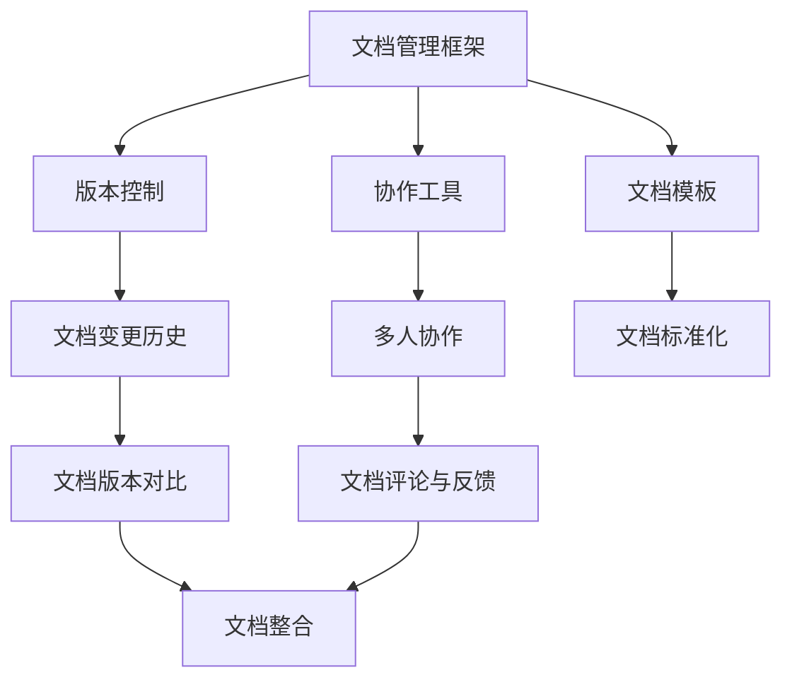
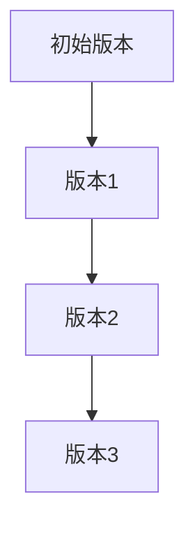

                 

# 创业公司的技术文档管理最佳实践

> 关键词：技术文档、创业公司、管理实践、文档规范化、版本控制、协作工具

> 摘要：本文旨在探讨创业公司技术文档管理的最佳实践。通过对文档管理的背景、核心概念、算法原理、数学模型、实际应用场景以及工具和资源的推荐等方面的深入分析，为创业公司在技术文档管理上提供全面且具体的指导。

## 1. 背景介绍

### 1.1 目的和范围

技术文档是创业公司中不可或缺的一部分，它不仅记录了项目的开发过程、技术实现细节，还为团队成员提供了宝贵的知识共享和协作平台。良好的技术文档管理能够提高团队的工作效率，减少知识流失，并且有助于新成员快速上手。本文旨在探讨创业公司在技术文档管理方面的一些最佳实践，包括文档的规范化、版本控制、协作工具的使用等，旨在为创业公司提供一套行之有效的文档管理策略。

本文将涵盖以下主题：

- 文档管理的核心概念与联系
- 核心算法原理与具体操作步骤
- 数学模型和公式及其应用
- 项目实战：代码实际案例和详细解释
- 实际应用场景分析
- 工具和资源推荐
- 未来发展趋势与挑战

### 1.2 预期读者

本文的预期读者包括：

- 创业公司的技术团队和管理者
- 软件工程师和系统架构师
- 技术文档编写人员和维护人员
- 对技术文档管理感兴趣的研究人员和从业者

### 1.3 文档结构概述

本文的文档结构如下：

1. **背景介绍**：介绍文档管理的目的、范围和预期读者。
2. **核心概念与联系**：阐述文档管理中的核心概念和架构。
3. **核心算法原理与具体操作步骤**：讲解文档管理中的核心算法和操作步骤。
4. **数学模型和公式**：介绍文档管理中涉及到的数学模型和公式。
5. **项目实战**：提供实际的代码案例并进行详细解读。
6. **实际应用场景**：分析文档管理在不同场景下的应用。
7. **工具和资源推荐**：推荐文档管理相关的工具和资源。
8. **总结**：总结文章要点并展望未来发展趋势。
9. **附录**：提供常见问题与解答。
10. **扩展阅读**：推荐进一步阅读的资料。

### 1.4 术语表

#### 1.4.1 核心术语定义

- **技术文档**：记录软件项目开发过程中的所有技术细节和实现方法的文档。
- **版本控制**：通过跟踪文档的修改历史，确保文档的一致性和完整性。
- **协作工具**：支持多人协作编写、共享和评论文档的工具。
- **文档规范化**：确保文档的结构、格式和内容的一致性。

#### 1.4.2 相关概念解释

- **文档模板**：用于标准化文档结构的预设模板。
- **知识库**：集中存储项目相关知识和信息的数据库。

#### 1.4.3 缩略词列表

- **Git**：分布式版本控制系统
- **Markdown**：轻量级标记语言
- **Jenkins**：自动化服务器

## 2. 核心概念与联系

在创业公司的技术文档管理中，有几个核心概念和联系是必须理解和掌握的。这些概念包括文档管理框架、版本控制系统、协作工具和文档模板。下面通过一个Mermaid流程图来展示这些概念及其关系。



### 2.1 文档管理框架

文档管理框架是整个文档管理系统的核心，它定义了文档的结构、分类、存储和检索方式。一个良好的文档管理框架能够提高文档的可读性和可维护性。

### 2.2 版本控制

版本控制是确保文档一致性和完整性的关键。通过版本控制，团队能够跟踪文档的修改历史，快速定位和解决冲突，并且确保每个成员使用的是最新的文档版本。

### 2.3 协作工具

协作工具支持团队成员的实时协作，包括文档的编辑、共享、评论和反馈。通过协作工具，团队能够更加高效地完成文档的编写和维护工作。

### 2.4 文档模板

文档模板是一种标准化的文档结构，它确保了所有文档在格式和内容上的统一性。使用文档模板能够减少文档编写的工作量，提高文档的规范化水平。

## 3. 核心算法原理与具体操作步骤

### 3.1 文档规范化

文档规范化的核心算法是Markdown，这是一种轻量级标记语言，它使得文档的编写和格式化变得简单而高效。以下是使用Markdown进行文档规范化的具体步骤：

```python
# 文档标题
## 子标题
### 子标题
#### 子标题

* 无序列表
- 无序列表
1. 有序列表
2. 有序列表

> 引用文本

```python
# Python代码示例
print("Hello, World!")
```

### 3.2 版本控制

版本控制使用Git，这是一个分布式版本控制系统。以下是使用Git进行版本控制的具体步骤：

```bash
# 初始化Git仓库
git init

# 添加文件到暂存区
git add <file>

# 提交更改
git commit -m "提交说明"

# 查看日志
git log

# 拉取最新更改
git pull

# 推送更改
git push
```

### 3.3 协作工具

协作工具如GitLab或GitHub，提供了基于Web的文档协作平台。以下是使用GitLab进行协作的具体步骤：

```bash
# 创建新仓库
gitlab create-repo <repo-name>

#克隆仓库
git clone <repo-url>

# 添加文件
git add <file>

# 提交并推送
git commit -m "提交说明" && git push

# 查看文件
gitlab browse-file <file>
```

## 4. 数学模型和公式及详细讲解

### 4.1 文档版本管理

文档版本管理中，常用的数学模型是哈希函数。哈希函数用于生成文档的唯一标识，确保每次文档更新都能生成新的唯一版本。

#### 4.1.1 哈希函数

哈希函数是一种将任意长度的输入（即文档内容）映射为固定长度的输出的函数。常见的哈希函数包括MD5、SHA-1和SHA-256。

```latex
H = HashFunction(document)
```

#### 4.1.2 版本标识

通过哈希函数生成的哈希值可以作为文档版本的标识。每次文档更新后，都会生成新的哈希值，从而生成新的版本。

```latex
version = Hash(H(document'))
```

### 4.2 文档变更历史

文档变更历史可以使用树状结构进行表示。每个节点表示一个版本，节点之间的边表示版本之间的修改关系。



### 4.3 文档一致性检查

为了确保文档的一致性，可以使用校验和（如CRC32）对文档进行一致性检查。校验和与文档内容的哈希值比较，可以快速检测文档的完整性。

```latex
checksum = Checksum(document)
if (checksum != expected_checksum) {
    raise Error("文档不一致")
}
```

## 5. 项目实战：代码实际案例和详细解释说明

### 5.1 开发环境搭建

在创业公司中，为了便于技术文档的管理，我们选择Git作为版本控制工具，并使用Markdown进行文档编写。以下是开发环境的搭建步骤：

1. **安装Git**：

   在命令行中输入以下命令安装Git：

   ```bash
   sudo apt-get install git
   ```

2. **安装Markdown编辑器**：

   常见的Markdown编辑器包括Typora、MarkDown Here等。以Typora为例，可以从官网下载并安装。

3. **初始化Git仓库**：

   在项目目录中执行以下命令初始化Git仓库：

   ```bash
   git init
   ```

### 5.2 源代码详细实现和代码解读

#### 5.2.1 文档编写

我们使用Markdown编写技术文档，以下是一个简单的Markdown文档示例：

```markdown
# 项目概述

本项目是一款在线教育平台，旨在为学习者提供高质量的在线课程。

## 技术栈

- 前端：React
- 后端：Node.js
- 数据库：MongoDB
```

#### 5.2.2 版本控制

使用Git对文档进行版本控制，以下是具体的操作步骤：

1. **添加文件到暂存区**：

   ```bash
   git add README.md
   ```

2. **提交更改**：

   ```bash
   git commit -m "添加项目概述"
   ```

3. **查看日志**：

   ```bash
   git log
   ```

4. **推送更改**：

   ```bash
   git push
   ```

#### 5.2.3 多人协作

团队成员可以在远程Git仓库上克隆项目并进行协作。以下是多人协作的具体步骤：

1. **克隆仓库**：

   ```bash
   git clone <repo-url>
   ```

2. **添加文件并提交**：

   ```bash
   git add new_document.md
   git commit -m "添加新文档"
   git push
   ```

3. **查看文件和评论**：

   使用GitLab或GitHub等平台，团队成员可以查看文档并进行评论和反馈。

### 5.3 代码解读与分析

以上代码示例展示了如何使用Git进行文档管理。通过Git，团队能够方便地跟踪文档的修改历史，确保文档的一致性和完整性。同时，Markdown使得文档的编写和格式化变得简单而高效。

## 6. 实际应用场景

技术文档管理在创业公司中的应用场景多种多样，以下列举几种常见的应用场景：

### 6.1 项目启动

在项目启动阶段，技术文档管理有助于团队了解项目背景、目标和技术栈。通过详细的技术文档，新成员可以快速熟悉项目，提高工作效率。

### 6.2 开发协作

在开发过程中，技术文档管理能够记录项目的开发进度、技术细节和决策过程，为团队成员提供共同的工作基础。同时，版本控制确保了文档的一致性和完整性。

### 6.3 项目评估

在项目评估阶段，技术文档管理提供了宝贵的评估依据。通过文档，团队能够回顾项目的开发过程，发现问题和改进空间。

### 6.4 项目交接

在项目交接阶段，技术文档管理有助于确保知识传递的完整性和准确性。通过文档，团队能够清晰了解项目的现状和后续计划。

## 7. 工具和资源推荐

### 7.1 学习资源推荐

#### 7.1.1 书籍推荐

- 《版本控制入门指南：使用Git》
- 《Pro Git》
- 《Markdown入门》

#### 7.1.2 在线课程

- Git官方教程
- Markdown入门与进阶
- 版本控制与协作开发

#### 7.1.3 技术博客和网站

- Git社区网
- GitHub博客
- Markdown中文教程

### 7.2 开发工具框架推荐

#### 7.2.1 IDE和编辑器

- Visual Studio Code
- IntelliJ IDEA
- Sublime Text

#### 7.2.2 调试和性能分析工具

- Chrome DevTools
- Firefox Developer Tools
- Node.js Debugging Tools

#### 7.2.3 相关框架和库

- React
- Node.js
- MongoDB

### 7.3 相关论文著作推荐

#### 7.3.1 经典论文

- 《Git Internals》
- 《A Survey of Version Control Systems》
- 《The Design of the Unix Operating System》

#### 7.3.2 最新研究成果

- 《版本控制的未来》
- 《基于区块链的文档管理研究》
- 《人工智能在文档管理中的应用》

#### 7.3.3 应用案例分析

- 《GitLab的成功之路》
- 《企业如何利用Markdown提高文档管理效率》
- 《初创公司如何有效管理技术文档》

## 8. 总结：未来发展趋势与挑战

### 8.1 发展趋势

- **智能化**：随着人工智能技术的发展，技术文档管理将更加智能化，包括自动生成文档、智能搜索和推荐等功能。
- **协作化**：基于区块链的文档管理技术将进一步提升协作效率，确保文档的透明性和安全性。
- **规范化**：标准化文档模板和流程将成为行业共识，提高文档的可读性和可维护性。

### 8.2 挑战

- **数据安全**：确保文档数据的安全性和隐私性是技术文档管理的重要挑战。
- **知识共享**：如何在团队成员之间有效传递和共享知识，提高整体工作效率。
- **文档更新**：随着项目的不断演进，如何保持文档的实时性和准确性。

## 9. 附录：常见问题与解答

### 9.1 如何选择合适的文档管理工具？

- **考虑团队规模和需求**：小型团队可以选择Git等开源工具，大型团队可以考虑使用GitLab等商业工具。
- **评估工具的功能和易用性**：选择功能全面且易于上手的工具。
- **考虑集成和扩展性**：工具应能与其他开发工具和平台无缝集成。

### 9.2 如何保持技术文档的实时性？

- **自动化更新**：利用脚本和工具自动同步代码库和文档库。
- **定期审查**：定期审查和更新文档，确保其与项目状态保持一致。
- **鼓励协作**：鼓励团队成员参与文档的编写和更新。

## 10. 扩展阅读 & 参考资料

- 《Git教程》
- 《Markdown中文文档》
- 《版本控制与软件开发》

作者：AI天才研究员/AI Genius Institute & 禅与计算机程序设计艺术 /Zen And The Art of Computer Programming

本文详细探讨了创业公司在技术文档管理方面的最佳实践，从核心概念、算法原理到实际应用场景，再到工具和资源的推荐，全面系统地展示了技术文档管理的方法和技巧。通过本文的阅读，创业公司的技术团队将能够更好地管理技术文档，提高工作效率，确保项目的成功。希望本文对您在技术文档管理方面有所启发和帮助。

