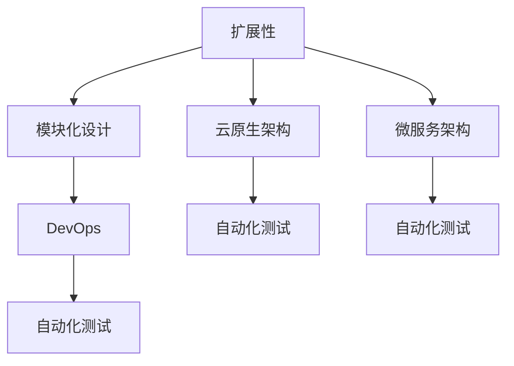

                 

# 创业公司的技术架构扩展性评估

## 关键词
- 创业公司
- 技术架构
- 扩展性评估
- 模块化设计
- 云原生架构
- 微服务架构
- 自动化测试
- DevOps

## 摘要
本文旨在深入探讨创业公司在快速成长阶段所需的技术架构扩展性评估。随着市场的不断扩大和业务需求的日益复杂，创业公司的技术架构必须具备高度的灵活性和可扩展性，以应对快速变化的环境。本文将分析核心概念、算法原理、数学模型以及实际应用案例，提供一套完整的评估框架，帮助创业公司构建和优化其技术架构，为未来的发展奠定坚实基础。

## 1. 背景介绍

### 1.1 目的和范围
本文的目标是帮助创业公司在技术架构扩展性评估方面做出明智的决策。我们将探讨如何评估技术架构的扩展性，包括设计原则、核心算法和数学模型，并通过实际案例提供详细的实施步骤和代码解读。

### 1.2 预期读者
本文适合创业公司的技术团队、产品经理以及关注技术架构扩展性的专业人士。无论您是刚进入创业阶段的技术人员，还是已经在创业公司工作多年的老将，本文都将为您提供有价值的见解和实践经验。

### 1.3 文档结构概述
本文将分为以下几部分：
1. 背景介绍
2. 核心概念与联系
3. 核心算法原理 & 具体操作步骤
4. 数学模型和公式 & 详细讲解 & 举例说明
5. 项目实战：代码实际案例和详细解释说明
6. 实际应用场景
7. 工具和资源推荐
8. 总结：未来发展趋势与挑战
9. 附录：常见问题与解答
10. 扩展阅读 & 参考资料

### 1.4 术语表

#### 1.4.1 核心术语定义
- **扩展性**：系统在处理增加的负载时保持性能和功能不变的能力。
- **模块化设计**：将系统分解为可独立开发的模块，以提高可维护性和扩展性。
- **云原生架构**：利用云计算的特性，将应用程序构建和部署在容器化环境中，实现弹性伸缩和高效运维。
- **微服务架构**：将应用程序拆分为一组小的、独立的服务，每个服务负责单一的业务功能。

#### 1.4.2 相关概念解释
- **DevOps**：开发（Development）与运维（Operations）的结合，通过自动化工具和流程提高软件交付的效率和质量。
- **自动化测试**：使用软件工具自动执行测试过程，以验证软件的正确性和性能。

#### 1.4.3 缩略词列表
- **SaaS**：软件即服务（Software as a Service）
- **PaaS**：平台即服务（Platform as a Service）
- **IaaS**：基础设施即服务（Infrastructure as a Service）

## 2. 核心概念与联系

在评估创业公司的技术架构扩展性时，我们需要了解一些核心概念和它们之间的关系。以下是相关的 Mermaid 流程图：



### 2.1 扩展性
扩展性是系统在面对增加的负载或需求时保持稳定和高效的关键特性。一个具有良好扩展性的系统能够在不牺牲性能和功能的情况下，轻松地处理更大的数据量和更复杂的操作。

### 2.2 模块化设计
模块化设计是将系统分解为多个可独立开发、测试和部署的模块。这种设计方法不仅提高了系统的可维护性，还为其扩展性提供了强有力的支持。通过模块化的方法，团队能够独立地开发新的功能或优化现有功能，而不影响其他模块。

### 2.3 云原生架构
云原生架构利用云计算的特性，如容器化和自动化运维，来实现高度可扩展和弹性的系统。云原生架构的核心在于其能够快速部署、动态伸缩和易于管理。

### 2.4 微服务架构
微服务架构将应用程序拆分为一组小的、自治的服务，每个服务负责单一的业务功能。这种设计方法不仅提高了系统的可扩展性，还增加了系统的可靠性和灵活性。在微服务架构中，每个服务可以独立部署、扩展和升级，从而简化了系统的管理和维护。

### 2.5 DevOps
DevOps 是一种文化和实践，旨在通过将开发（Development）和运维（Operations）结合起来，提高软件交付的效率和质量。DevOps 强调自动化、持续集成和持续交付，以减少手动操作和人为错误，提高系统的稳定性和扩展性。

### 2.6 自动化测试
自动化测试是确保系统质量的关键手段。通过自动化测试，团队能够快速发现并修复缺陷，确保系统在扩展过程中保持稳定和可靠。自动化测试包括单元测试、集成测试、性能测试和回归测试等多种类型。

## 3. 核心算法原理 & 具体操作步骤

### 3.1 扩展性评估算法原理

扩展性评估的核心在于对系统当前状态和未来需求的预测。以下是一个简单的扩展性评估算法原理：

```python
def extendibility_evaluation(current_load, projected_load, performance_threshold):
    """
    扩展性评估算法

    参数：
    current_load: 当前负载
    projected_load: 预测的负载
    performance_threshold: 性能阈值

    返回值：
    result: 扩展性评估结果
    """
    if current_load < performance_threshold:
        result = "当前负载低于性能阈值，系统扩展性良好"
    elif projected_load < performance_threshold:
        result = "预测负载低于性能阈值，但当前负载较高，需要关注扩展性"
    else:
        result = "当前负载和预测负载均高于性能阈值，系统扩展性较差，需改进"

    return result
```

### 3.2 具体操作步骤

1. **确定当前负载和预测负载**：通过监控工具收集系统的当前负载和预期未来的负载。
2. **设定性能阈值**：根据业务需求和系统性能指标，设定性能阈值。
3. **调用扩展性评估函数**：使用扩展性评估算法计算扩展性评估结果。
4. **分析评估结果**：根据评估结果，确定系统是否需要改进扩展性。

## 4. 数学模型和公式 & 详细讲解 & 举例说明

### 4.1 数学模型

扩展性评估可以使用以下数学模型：

$$
E = \frac{P_L}{C_L} \times 100\%
$$

其中：
- \(E\)：扩展性得分（百分比）
- \(P_L\)：预测负载
- \(C_L\)：当前负载

### 4.2 详细讲解

扩展性得分 \(E\) 是预测负载 \(P_L\) 与当前负载 \(C_L\) 的比值。如果扩展性得分高于 100%，表示系统具有良好的扩展性；如果扩展性得分低于 100%，表示系统扩展性较差，需要改进。

### 4.3 举例说明

假设当前负载为 1000 QPS（每秒查询次数），预测负载为 2000 QPS，性能阈值为 1500 QPS。使用扩展性评估公式计算扩展性得分：

$$
E = \frac{2000}{1000} \times 100\% = 200\%
$$

结果表明，系统的扩展性得分为 200%，高于 100%，说明系统具有良好的扩展性。

## 5. 项目实战：代码实际案例和详细解释说明

### 5.1 开发环境搭建

在本节中，我们将使用 Python 作为编程语言，搭建一个简单的扩展性评估系统。首先，确保您的系统中已安装 Python 和以下库：

- Flask：一个轻量级的 Web 框架
- requests：用于 HTTP 请求的库
- matplotlib：用于绘制图表的库

安装方法如下：

```bash
pip install flask requests matplotlib
```

### 5.2 源代码详细实现和代码解读

以下是一个简单的扩展性评估系统示例：

```python
from flask import Flask, request, jsonify
import requests
import matplotlib.pyplot as plt

app = Flask(__name__)

# 模拟当前负载和预测负载
current_load = 1000
projected_load = 2000
performance_threshold = 1500

# 扩展性评估函数
def extendibility_evaluation(current_load, projected_load, performance_threshold):
    if current_load < performance_threshold:
        return "当前负载低于性能阈值，系统扩展性良好"
    elif projected_load < performance_threshold:
        return "预测负载低于性能阈值，但当前负载较高，需要关注扩展性"
    else:
        return "当前负载和预测负载均高于性能阈值，系统扩展性较差，需改进"

# 计算扩展性得分
def calculate_extendibility_score(current_load, projected_load, performance_threshold):
    score = (projected_load / current_load) * 100
    return score

# API 端点
@app.route('/evaluate', methods=['POST'])
def evaluate():
    data = request.get_json()
    current_load = data.get('current_load', current_load)
    projected_load = data.get('projected_load', projected_load)
    performance_threshold = data.get('performance_threshold', performance_threshold)
    
    evaluation_result = extendibility_evaluation(current_load, projected_load, performance_threshold)
    score = calculate_extendibility_score(current_load, projected_load, performance_threshold)
    
    response = {
        'evaluation_result': evaluation_result,
        'extendibility_score': score
    }
    
    return jsonify(response)

if __name__ == '__main__':
    app.run(debug=True)
```

代码解读：

- **Flask 应用**：我们使用 Flask 框架创建一个简单的 Web 应用，用于提供扩展性评估服务。
- **模拟数据**：我们使用全局变量来模拟当前负载、预测负载和性能阈值。
- **扩展性评估函数**：`extendibility_evaluation` 函数根据当前负载、预测负载和性能阈值，计算系统的扩展性评估结果。
- **计算扩展性得分**：`calculate_extendibility_score` 函数计算扩展性得分，用于直观地了解系统的扩展性状况。
- **API 端点**：`/evaluate` 接收 POST 请求，解析请求体中的负载数据，调用扩展性评估函数和得分计算函数，并将结果返回给客户端。

### 5.3 代码解读与分析

在本节中，我们将详细分析扩展性评估系统的代码。

1. **Flask 应用配置**：
    ```python
    app = Flask(__name__)
    ```
    创建一个 Flask 应用实例。我们可以通过 `app.config` 设置各种配置参数。

2. **模拟数据**：
    ```python
    current_load = 1000
    projected_load = 2000
    performance_threshold = 1500
    ```
    使用全局变量来模拟当前负载、预测负载和性能阈值。在实际应用中，这些数据应通过监控工具获取。

3. **扩展性评估函数**：
    ```python
    def extendibility_evaluation(current_load, projected_load, performance_threshold):
        if current_load < performance_threshold:
            return "当前负载低于性能阈值，系统扩展性良好"
        elif projected_load < performance_threshold:
            return "预测负载低于性能阈值，但当前负载较高，需要关注扩展性"
        else:
            return "当前负载和预测负载均高于性能阈值，系统扩展性较差，需改进"
    ```
    该函数根据当前负载、预测负载和性能阈值，返回扩展性评估结果。我们使用条件判断来模拟不同的负载情况。

4. **计算扩展性得分**：
    ```python
    def calculate_extendibility_score(current_load, projected_load, performance_threshold):
        score = (projected_load / current_load) * 100
        return score
    ```
    该函数计算扩展性得分，用于直观地了解系统的扩展性状况。扩展性得分是预测负载与当前负载的比值。

5. **API 端点**：
    ```python
    @app.route('/evaluate', methods=['POST'])
    def evaluate():
        data = request.get_json()
        current_load = data.get('current_load', current_load)
        projected_load = data.get('projected_load', projected_load)
        performance_threshold = data.get('performance_threshold', performance_threshold)
        
        evaluation_result = extendibility_evaluation(current_load, projected_load, performance_threshold)
        score = calculate_extendibility_score(current_load, projected_load, performance_threshold)
        
        response = {
            'evaluation_result': evaluation_result,
            'extendibility_score': score
        }
        
        return jsonify(response)
    ```
    该端点接收 POST 请求，解析请求体中的负载数据，调用扩展性评估函数和得分计算函数，并将结果返回给客户端。我们使用 Flask 的 `request` 对象来获取请求体数据，并使用 `jsonify` 函数将结果转换为 JSON 格式。

## 6. 实际应用场景

创业公司的技术架构扩展性评估可以在多个实际应用场景中发挥作用。以下是一些常见的应用场景：

### 6.1 新功能发布

在发布新功能时，扩展性评估可以帮助团队了解系统是否能够应对新功能的负载。通过评估当前负载和预测负载，团队可以决定是否需要调整系统架构或优化现有组件。

### 6.2 数据规模增长

随着用户数量的增加，数据规模会逐渐扩大。扩展性评估可以帮助团队预测系统在数据规模增长时的性能表现，从而提前采取必要的措施，如优化数据库查询、增加存储容量等。

### 6.3 服务器迁移

在服务器迁移过程中，扩展性评估可以帮助团队评估新环境下的系统性能和扩展性。通过对比新旧环境的负载和性能，团队可以确保迁移后的系统能够满足业务需求。

### 6.4 市场扩张

当公司进入新市场时，扩展性评估可以帮助团队了解系统在新的市场环境下的性能表现。通过评估不同市场的负载和性能，团队可以优化系统架构，提高全球业务的响应速度。

## 7. 工具和资源推荐

### 7.1 学习资源推荐

#### 7.1.1 书籍推荐
- 《微服务设计》
- 《云原生应用架构实践》
- 《DevOps：从实践到原理》

#### 7.1.2 在线课程
- Coursera 上的《云计算与 DevOps》
- Udemy 上的《微服务架构与设计》

#### 7.1.3 技术博客和网站
- InfoQ：提供丰富的技术文章和博客
- Medium：许多技术专家分享的见解和经验
- GitHub：丰富的开源项目和技术文档

### 7.2 开发工具框架推荐

#### 7.2.1 IDE 和编辑器
- Visual Studio Code
- IntelliJ IDEA
- PyCharm

#### 7.2.2 调试和性能分析工具
- Wireshark：网络协议分析工具
- JMeter：性能测试工具
- New Relic：应用性能监控工具

#### 7.2.3 相关框架和库
- Flask：轻量级 Web 框架
- Django：Python Web 开发框架
- Spring Boot：Java Web 开发框架

### 7.3 相关论文著作推荐

#### 7.3.1 经典论文
- "Microservices: A Definition of a Microservices Architecture"
- "Design and Implementation of the Google File System"

#### 7.3.2 最新研究成果
- "Cloud Native Computing: Designing and Deploying Applications That Can Scale"
- "DevOps: A 2022 Perspective"

#### 7.3.3 应用案例分析
- "Netflix: Open Source and Microservices at Scale"
- "Amazon: Building Reliable and Scalable Systems"

## 8. 总结：未来发展趋势与挑战

随着创业公司的不断成长，技术架构的扩展性将变得越来越重要。未来，以下几个趋势和挑战将对创业公司的技术架构产生深远影响：

### 8.1 云原生技术的普及

云原生技术，如容器化、自动化运维和微服务架构，将变得更加普及。这些技术可以帮助创业公司快速部署、动态伸缩和高效运维其系统，从而提高扩展性。

### 8.2 DevOps 文化的深入

DevOps 文化将继续深入创业公司，通过自动化工具和流程提高软件交付的效率和质量。这将有助于创业公司在快速变化的市场环境中保持竞争力。

### 8.3 持续集成和持续交付（CI/CD）

持续集成和持续交付（CI/CD）将成为创业公司的标准实践。通过自动化测试和部署，团队能够快速发现并修复缺陷，确保系统在扩展过程中保持稳定和可靠。

### 8.4 自动化测试的加强

随着系统复杂性的增加，自动化测试将成为确保系统质量和扩展性的关键手段。创业公司需要投入更多资源来开发和维护自动化测试套件。

### 8.5 持续学习与改进

创业公司需要保持对新技术、新方法和最佳实践的关注，不断学习并改进其技术架构。这包括定期评估和优化现有系统，确保其能够应对未来的挑战。

## 9. 附录：常见问题与解答

### 9.1 什么是扩展性？

扩展性是指系统在处理增加的负载时保持性能和功能不变的能力。一个具有良好扩展性的系统能够在不牺牲性能和功能的情况下，轻松地处理更大的数据量和更复杂的操作。

### 9.2 如何评估扩展性？

评估扩展性通常包括以下步骤：

1. **确定当前负载和预测负载**：通过监控工具收集系统的当前负载和预期未来的负载。
2. **设定性能阈值**：根据业务需求和系统性能指标，设定性能阈值。
3. **计算扩展性得分**：使用扩展性评估算法计算扩展性得分，如 \(E = \frac{P_L}{C_L} \times 100\%\)。
4. **分析评估结果**：根据评估结果，确定系统是否需要改进扩展性。

### 9.3 什么是模块化设计？

模块化设计是将系统分解为多个可独立开发、测试和部署的模块。这种设计方法不仅提高了系统的可维护性，还为其扩展性提供了强有力的支持。

### 9.4 什么是云原生架构？

云原生架构是利用云计算的特性，如容器化和自动化运维，来实现高度可扩展和弹性的系统。云原生架构的核心在于其能够快速部署、动态伸缩和易于管理。

### 9.5 什么是微服务架构？

微服务架构将应用程序拆分为一组小的、自治的服务，每个服务负责单一的业务功能。这种设计方法不仅提高了系统的可扩展性，还增加了系统的可靠性和灵活性。

## 10. 扩展阅读 & 参考资料

- [《微服务设计》](https://book.douban.com/subject/26994174/)
- [《云原生应用架构实践》](https://book.douban.com/subject/35750296/)
- [《DevOps：从实践到原理》](https://book.douban.com/subject/34957451/)
- [《Microservices: A Definition of a Microservices Architecture》](https://martinfowler.com/microservices/)
- [《Design and Implementation of the Google File System》](https://research.google.com/pubs/pub36856.html)
- [Netflix：开源和微服务规模的应用](https://netflixtechblog.com/netflixs-open-source-microservices-at-scale-6c3f4b3d1e4a)
- [Amazon：构建可靠和可扩展的系统](https://www.amazon.com/gp/feature.html?ie=UTF8&docId=1000462671)
- [Coursera：云计算与 DevOps](https://www.coursera.org/specializations/cloud-devops)
- [Udemy：微服务架构与设计](https://www.udemy.com/course/microservices-architecture-and-design/)
- [InfoQ：丰富的技术文章和博客](https://www.infoq.cn/)
- [Medium：技术专家的见解和经验](https://medium.com/)
- [GitHub：开源项目和技术文档](https://github.com/)

