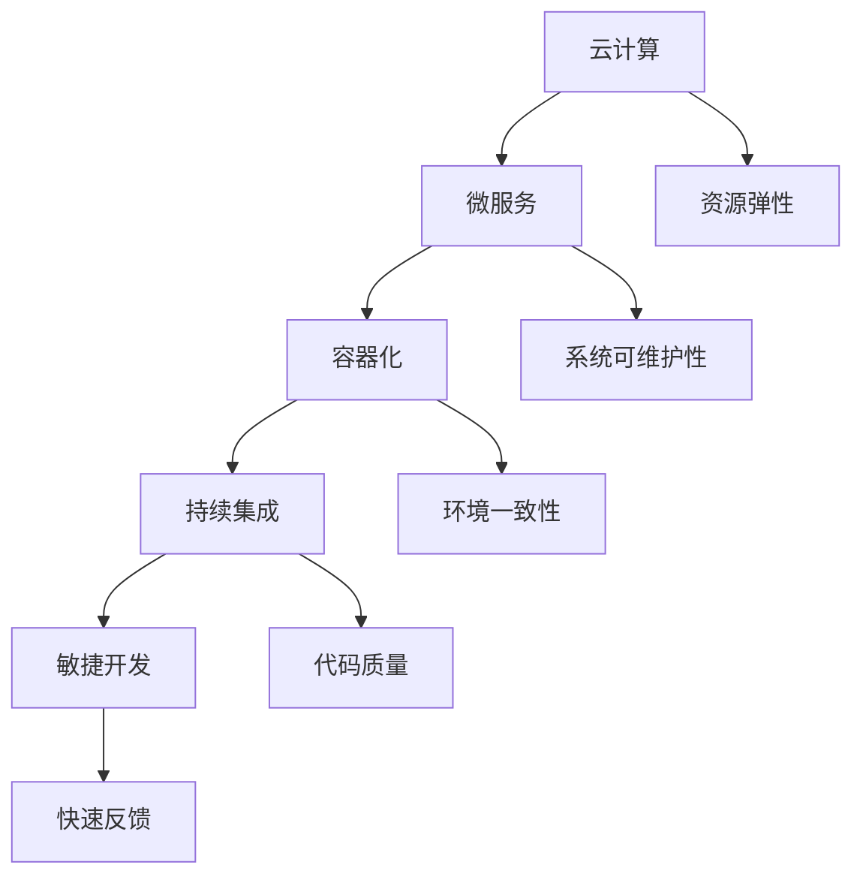

                 

# 创业公司的技术架构演进策略

> **关键词**：创业公司，技术架构，演进策略，云计算，微服务，容器化，持续集成，敏捷开发
>
> **摘要**：本文旨在探讨创业公司在成长过程中技术架构的演进策略。我们将从技术架构的演变历史、核心概念、算法原理、数学模型、实战案例、应用场景、工具资源推荐等多个角度出发，为创业公司提供一套清晰、实用的技术架构演进指南。

## 1. 背景介绍

### 1.1 目的和范围

本文主要目的是为创业公司提供一套清晰、实用的技术架构演进策略，帮助它们在快速发展过程中保持技术架构的灵活性和可扩展性。文章将涵盖技术架构的演变历史、核心概念、算法原理、数学模型、实战案例、应用场景以及工具资源推荐等多个方面。

### 1.2 预期读者

本文适合以下读者群体：

- 创业公司的创始人、CTO、技术总监等高层管理人员
- 技术团队负责人和开发人员
- 对创业公司技术架构演进感兴趣的技术爱好者

### 1.3 文档结构概述

本文将按照以下结构进行阐述：

1. 背景介绍
2. 核心概念与联系
3. 核心算法原理 & 具体操作步骤
4. 数学模型和公式 & 详细讲解 & 举例说明
5. 项目实战：代码实际案例和详细解释说明
6. 实际应用场景
7. 工具和资源推荐
8. 总结：未来发展趋势与挑战
9. 附录：常见问题与解答
10. 扩展阅读 & 参考资料

### 1.4 术语表

#### 1.4.1 核心术语定义

- **创业公司**：指刚刚创立，处于成长期的企业，通常面临较大的市场竞争压力。
- **技术架构**：指软件系统的整体结构，包括硬件、软件、数据等多个方面。
- **演进策略**：指在技术架构发展过程中，针对不同阶段的调整和优化方法。

#### 1.4.2 相关概念解释

- **云计算**：指通过互联网提供动态易扩展且经常是虚拟化的资源。
- **微服务**：指将应用程序作为一套小的服务去构建，每个服务运行在其独立的进程中，通过轻量级通信机制（通常是HTTP资源API）相互交换数据。
- **容器化**：指将应用程序及其依赖项打包到一个可移植的容器中，确保应用程序在不同环境之间的一致性。
- **持续集成**：指在软件开发过程中，自动将代码集成到共享仓库，通过自动化的构建和测试确保代码质量。
- **敏捷开发**：指一种以人为核心、迭代、循序渐进的开发方法。

#### 1.4.3 缩略词列表

- **CI**：持续集成
- **CD**：持续交付
- **Docker**：容器化技术
- **Kubernetes**：容器编排系统

## 2. 核心概念与联系

为了更好地理解创业公司技术架构的演进策略，我们需要首先了解一些核心概念和它们之间的联系。

### 2.1 云计算与微服务

云计算提供了弹性、可扩展的计算资源，使得创业公司能够根据需求动态调整资源。微服务架构则利用云计算的这些优势，将应用程序划分为一系列独立、可扩展的小服务，以提高系统的可维护性和可扩展性。

### 2.2 容器化与持续集成

容器化技术，如Docker，使得创业公司能够将应用程序及其依赖项打包到一个可移植的容器中，确保应用程序在不同环境之间的一致性。持续集成（CI）工具，如Jenkins，则可以帮助创业公司在开发过程中自动集成代码，进行构建和测试，确保代码质量。

### 2.3 持续集成与敏捷开发

敏捷开发强调迭代、循序渐进的开发方法，持续集成则是敏捷开发的重要组成部分。通过持续集成，创业公司可以快速反馈问题，及时调整开发方向，更好地适应市场需求。

下面是一个Mermaid流程图，展示了这些核心概念之间的联系：



## 3. 核心算法原理 & 具体操作步骤

在创业公司技术架构的演进过程中，核心算法原理和具体操作步骤对于实现系统的可扩展性和可靠性至关重要。

### 3.1 微服务架构

微服务架构将应用程序划分为多个独立的小服务，每个服务负责一个特定的业务功能。核心算法原理如下：

- **服务拆分**：根据业务需求，将应用程序拆分成多个独立的服务。
- **服务通信**：通过轻量级通信机制（通常是HTTP/HTTPS协议）进行服务间的通信。

具体操作步骤：

1. 分析业务需求，确定服务拆分策略。
2. 设计服务接口，确保服务间通信的稳定性。
3. 部署服务，确保服务的高可用性。

伪代码示例：

```python
def service_splitting(app):
    # 根据业务需求，拆分应用程序
    services = ["service_1", "service_2", "service_3"]
    for service in services:
        create_service(service)
    
def create_service(service):
    # 部署服务
    deploy_service(service)
    
def deploy_service(service):
    # 实现服务部署逻辑
    # ...
```

### 3.2 持续集成

持续集成（CI）的核心算法原理是自动化构建和测试，以确保代码质量。具体操作步骤如下：

1. 设置CI工具，如Jenkins，并配置代码仓库。
2. 编写测试用例，确保测试覆盖面全面。
3. 集成代码，执行构建和测试。

伪代码示例：

```python
def setup_ci_tool():
    # 配置Jenkins
    configure_jenkins()

def configure_jenkins():
    # 实现Jenkins配置逻辑
    # ...
    
def write_test_cases():
    # 编写测试用例
    test_cases = ["test_case_1", "test_case_2", "test_case_3"]
    for test_case in test_cases:
        create_test_case(test_case)

def create_test_case(test_case):
    # 实现测试用例创建逻辑
    # ...

def integrate_code():
    # 集成代码
    # ...
    
def run_build_and_test():
    # 执行构建和测试
    run_build()  
    run_test()
    
def run_build():
    # 执行构建逻辑
    # ...
    
def run_test():
    # 执行测试逻辑
    # ...
```

### 3.3 容器化

容器化的核心算法原理是将应用程序及其依赖项打包到一个可移植的容器中。具体操作步骤如下：

1. 编写Dockerfile，定义容器镜像。
2. 构建容器镜像。
3. 运行容器。

伪代码示例：

```python
def write_dockerfile():
    # 编写Dockerfile
    dockerfile_content = "..."
    write_file("Dockerfile", dockerfile_content)

def build_image():
    # 构建容器镜像
    run_command("docker build -t image_name .")

def run_container():
    # 运行容器
    run_command("docker run -d -p port:image_name")
    
def run_command(command):
    # 执行命令
    # ...
```

## 4. 数学模型和公式 & 详细讲解 & 举例说明

在创业公司技术架构的演进过程中，数学模型和公式可以帮助我们更好地理解系统的性能和可扩展性。以下是一些常用的数学模型和公式及其详细讲解。

### 4.1 负载均衡

负载均衡是指将多个请求分配到多个服务器，以确保系统的高可用性和可扩展性。常用的负载均衡算法包括：

1. **轮询算法（Round Robin）**：将请求依次分配给服务器，直到所有服务器都已被访问，然后重新开始循环。

   数学模型：假设有N个服务器，第i个服务器接收到的请求数量为$R_i$，则轮询算法的负载均衡公式为：
   $$R_i = \frac{Total\ Requests}{N}$$

2. **最小连接数算法（Least Connections）**：将请求分配到当前连接数最少的服务器。

   数学模型：假设有N个服务器，第i个服务器的当前连接数为$C_i$，则最小连接数算法的负载均衡公式为：
   $$R_i = \frac{Total\ Requests}{\sum_{j=1}^{N} C_j} C_i$$

举例说明：假设有3个服务器，当前连接数分别为2、3和4，总共有10个请求。则最小连接数算法的负载均衡结果为：第1个服务器分配2个请求，第2个服务器分配3个请求，第3个服务器分配5个请求。

### 4.2 缓存策略

缓存策略是指将频繁访问的数据存储在内存中，以减少数据库的访问次数，提高系统性能。常用的缓存策略包括：

1. **最近最少使用（Least Recently Used, LRU）算法**：将最近最少使用的数据替换出缓存。

   数学模型：假设缓存大小为C，当前缓存中的数据为$D_1, D_2, ..., D_C$，当需要替换数据时，找到最近最少使用的数据$D_k$，将其替换出去。LRU算法的替换公式为：
   $$D_k = \arg\min_{i} (i - \text{last\_access\_time}(D_i))$$

举例说明：假设缓存大小为3，当前缓存中的数据访问顺序为$D_1, D_2, D_3, D_1, D_2, D_4$。则LRU算法的替换过程为：首先访问$D_1, D_2, D_3$，然后访问$D_1, D_2$，最后访问$D_4$。根据LRU算法，需要将最近最少使用的数据$D_3$替换出去。

### 4.3 队列调度

队列调度是指将多个请求按照一定的顺序分配给服务器。常用的队列调度算法包括：

1. **先进先出（First In First Out, FIFO）算法**：按照请求到达的顺序进行调度。

   数学模型：假设有N个请求，分别为$R_1, R_2, ..., R_N$，按照它们到达的顺序进行调度。

2. **优先级调度（Priority Scheduling）算法**：根据请求的优先级进行调度。

   数学模型：假设有N个请求，分别为$R_1, R_2, ..., R_N$，每个请求都有一个优先级$P_i$，按照优先级从高到低进行调度。

举例说明：假设有3个请求，分别为$R_1, R_2, R_3$，优先级分别为2、3和1。则优先级调度算法的调度结果为：首先调度优先级最高的$R_2$，然后调度$R_3$，最后调度$R_1$。

## 5. 项目实战：代码实际案例和详细解释说明

在本节中，我们将通过一个实际的项目案例，展示创业公司在技术架构演进过程中如何应用上述核心算法原理和数学模型。以下是一个基于Python和Docker的简单博客系统，用于展示容器化、持续集成和负载均衡等技术的应用。

### 5.1 开发环境搭建

首先，我们需要搭建一个开发环境。以下是所需的软件和工具：

- Python 3.8及以上版本
- Docker 19.03及以上版本
- Jenkins 2.295及以上版本

安装步骤如下：

1. 安装Docker：

   ```shell
   sudo apt-get update
   sudo apt-get install docker-ce docker-ce-cli containerd.io
   sudo systemctl start docker
   sudo systemctl enable docker
   ```

2. 安装Jenkins：

   ```shell
   wget -O - https://pkg.jenkins.io/debian-stable/jenkins.io.key | sudo apt-key add -
   echo "deb https://pkg.jenkins.io/debian-stable binary/" | sudo tee /etc/apt/sources.list.d/jenkins.list
   sudo apt-get update
   sudo apt-get install jenkins
   sudo systemctl start jenkins
   sudo systemctl enable jenkins
   ```

### 5.2 源代码详细实现和代码解读

本项目主要包括三个部分：博客前端、博客后端和数据库。以下是各个部分的源代码和详细解释。

#### 5.2.1 博客前端

博客前端使用Flask框架实现，源代码如下：

```python
from flask import Flask, render_template, request, redirect, url_for
app = Flask(__name__)

@app.route('/')
def index():
    return render_template('index.html')

@app.route('/post', methods=['GET', 'POST'])
def post():
    if request.method == 'POST':
        title = request.form['title']
        content = request.form['content']
        # 存储到数据库
        # ...
        return redirect(url_for('index'))
    return render_template('post.html')

if __name__ == '__main__':
    app.run(debug=True)
```

博客前端主要包括两个页面：首页和发表文章页。首页展示已发布的文章列表，发表文章页用于用户输入文章标题和内容，然后提交到后端处理。

#### 5.2.2 博客后端

博客后端使用Flask框架和SQLite数据库实现，源代码如下：

```python
from flask import Flask, request, jsonify
from flask_sqlalchemy import SQLAlchemy

app = Flask(__name__)
app.config['SQLALCHEMY_DATABASE_URI'] = 'sqlite:///blog.db'
db = SQLAlchemy(app)

class Post(db.Model):
    id = db.Column(db.Integer, primary_key=True)
    title = db.Column(db.String(100))
    content = db.Column(db.Text)

@app.route('/posts', methods=['GET'])
def get_posts():
    posts = Post.query.all()
    return jsonify([{'id': post.id, 'title': post.title} for post in posts])

@app.route('/posts', methods=['POST'])
def create_post():
    data = request.get_json()
    new_post = Post(title=data['title'])
    db.session.add(new_post)
    db.session.commit()
    return jsonify({'id': new_post.id, 'title': new_post.title})

if __name__ == '__main__':
    db.create_all()
    app.run(debug=True)
```

博客后端主要负责处理前端发送的请求，包括获取文章列表和创建新文章。数据存储在SQLite数据库中。

#### 5.2.3 数据库

数据库使用SQLite实现，源代码如下：

```python
from flask_sqlalchemy import SQLAlchemy

app = Flask(__name__)
app.config['SQLALCHEMY_DATABASE_URI'] = 'sqlite:///blog.db'
db = SQLAlchemy(app)

class Post(db.Model):
    id = db.Column(db.Integer, primary_key=True)
    title = db.Column(db.String(100))
    content = db.Column(db.Text)

if __name__ == '__main__':
    db.create_all()
```

数据库模型定义了文章的标题和内容，用于存储和查询文章数据。

### 5.3 代码解读与分析

在本节中，我们将对上述代码进行解读和分析，重点介绍容器化、持续集成和负载均衡等技术的应用。

#### 5.3.1 容器化

为了实现容器化，我们需要编写Dockerfile和docker-compose.yml文件。

1. **Dockerfile**：

   ```dockerfile
   FROM python:3.8

   WORKDIR /app

   COPY requirements.txt ./
   RUN pip install -r requirements.txt

   COPY . .

   EXPOSE 5000

   CMD ["python", "app.py"]
   ```

   Dockerfile定义了一个基于Python 3.8的Docker镜像，将博客前端、后端和数据库的代码复制到容器中，并启动应用。

2. **docker-compose.yml**：

   ```yaml
   version: '3.8'

   services:
     web:
       build: .
       ports:
         - "5000:5000"
       depends_on:
         - db

     db:
       image: postgres:13
       environment:
         POSTGRES_DB: blog
         POSTGRES_USER: root
         POSTGRES_PASSWORD: root
       ports:
         - "5432:5432"
   ```

   docker-compose.yml文件定义了两个服务：web和db。web服务使用Dockerfile构建镜像，并映射端口；db服务使用PostgreSQL镜像，并设置环境变量和端口映射。

#### 5.3.2 持续集成

为了实现持续集成，我们需要在Jenkins中配置一个Pipeline项目。

1. **Jenkinsfile**：

   ```groovy
   pipeline {
       agent any
       stages {
           stage('Build') {
               steps {
                   sh 'docker build -t blog .'
               }
           }
           stage('Test') {
               steps {
                   sh 'docker run --rm -it blog pytest'
               }
           }
           stage('Deploy') {
               steps {
                   sh 'docker-compose up -d'
               }
           }
       }
       post {
           success {
               sh 'docker-compose logs'
           }
           failure {
               sh 'docker-compose logs'
               error {
                   sh 'docker-compose down'
               }
           }
       }
   }
   ```

   Jenkinsfile定义了一个包含构建、测试和部署三个阶段的Pipeline项目。在构建阶段，Jenkins执行Docker构建；在测试阶段，Jenkins执行pytest测试；在部署阶段，Jenkins启动容器并运行应用。

#### 5.3.3 负载均衡

为了实现负载均衡，我们可以使用Nginx作为反向代理。

1. **Nginx配置文件**：

   ```nginx
   http {
       upstream {
           server web1:5000;
           server web2:5000;
       }

       server {
           listen 80;

           location / {
               proxy_pass http://upstream;
           }
       }
   }
   ```

   Nginx配置文件定义了一个名为upstream的负载均衡池，其中包含两个web服务器的地址。通过Nginx代理，将请求分配给upstream池中的服务器。

## 6. 实际应用场景

创业公司在不同的发展阶段，面临着不同的技术挑战和业务需求。以下是一些实际应用场景，以及如何通过技术架构演进策略来应对这些挑战。

### 6.1 初创阶段

在初创阶段，创业公司通常注重产品的快速迭代和市场需求响应。此时，技术架构应以简单、灵活、可扩展为主。

- **应用场景**：快速开发一个MVP（最小可行产品），验证市场需求。
- **解决方案**：采用单体架构，使用Python、Node.js等简单的编程语言，结合Django、Express等流行的框架，快速搭建系统。

### 6.2 成长期

在成长期，创业公司需要应对越来越多的用户和业务需求，此时技术架构的稳定性和可扩展性变得至关重要。

- **应用场景**：业务模块逐渐增多，系统需要支持高并发和分布式部署。
- **解决方案**：采用微服务架构，将系统拆分为多个独立的服务，使用Docker和Kubernetes实现容器化和集群管理，提高系统的可扩展性和稳定性。

### 6.3 成熟期

在成熟期，创业公司已经形成稳定的业务模式，技术架构需要持续优化和提升，以支持业务的可持续发展。

- **应用场景**：业务复杂度增加，需要支持多种业务场景和跨平台部署。
- **解决方案**：采用混合架构，结合微服务和云计算的优势，使用Serverless架构实现业务逻辑的弹性扩展，降低运维成本。

### 6.4 衰退期

在衰退期，创业公司可能面临市场萎缩、业务缩减等问题。此时，技术架构的优化和成本控制变得尤为重要。

- **应用场景**：业务需求减少，系统需要降低成本、简化架构。
- **解决方案**：优化现有架构，减少冗余服务，采用云服务实现按需付费，降低运营成本。

## 7. 工具和资源推荐

为了帮助创业公司在技术架构演进过程中更好地应用相关技术，以下是一些学习资源、开发工具和框架的推荐。

### 7.1 学习资源推荐

#### 7.1.1 书籍推荐

- 《微服务架构设计》
- 《Docker实战》
- 《Jenkins实战》
- 《云原生应用架构》

#### 7.1.2 在线课程

- Udemy上的《Docker和Kubernetes基础教程》
- Coursera上的《云计算基础》
- 网易云课堂的《微服务架构实战》

#### 7.1.3 技术博客和网站

- https://www.docker.com/
- https://kubernetes.io/
- https://www.jenkins.io/
- https://cloud.google.com/

### 7.2 开发工具框架推荐

#### 7.2.1 IDE和编辑器

- PyCharm
- Visual Studio Code
- IntelliJ IDEA

#### 7.2.2 调试和性能分析工具

- GDB
- Wireshark
- New Relic

#### 7.2.3 相关框架和库

- Flask
- Django
- Express
- Spring Boot

### 7.3 相关论文著作推荐

#### 7.3.1 经典论文

- 《Microservices: A Definition of the Concept》
- 《Docker: Lightweight Containers for Convenient, Portable, and Fast Deployment of Applications》
- 《A Survey on Cloud-Native Application Architectures》

#### 7.3.2 最新研究成果

- 《Serverless Architectures: Design and Deployment of Event-Driven, Scalable Applications》
- 《Service Mesh: A Universal Interconnection Architecture for Microservices》
- 《Edge Computing: Vision and Challenges》

#### 7.3.3 应用案例分析

- 《Netflix的技术架构演进之路》
- 《阿里巴巴大规模分布式系统实践》
- 《谷歌云原生架构实践》

## 8. 总结：未来发展趋势与挑战

随着云计算、容器化、微服务、人工智能等技术的不断发展，创业公司的技术架构演进策略也在不断演变。未来，创业公司在技术架构方面将面临以下发展趋势和挑战：

### 8.1 发展趋势

1. **云原生应用**：越来越多的创业公司将采用云原生架构，实现应用的弹性扩展和自动化管理。
2. **服务网格**：服务网格技术将帮助创业公司更方便地管理和监控微服务架构。
3. **边缘计算**：随着物联网和5G技术的发展，边缘计算将成为创业公司解决实时数据处理和低延迟问题的关键。
4. **人工智能**：创业公司将利用人工智能技术优化业务流程、提升用户体验和降低成本。

### 8.2 挑战

1. **技术选型**：随着技术的发展，创业公司需要在多种技术之间进行选择和平衡。
2. **团队协作**：技术架构的复杂性要求团队成员具备更高的技术能力和协作精神。
3. **安全与合规**：随着数据的不断增加，创业公司需要确保系统的安全性和合规性。

总之，创业公司在技术架构演进过程中，需要紧跟行业发展趋势，应对技术选型和团队协作等方面的挑战，才能在激烈的市场竞争中立于不败之地。

## 9. 附录：常见问题与解答

### 9.1 什么是微服务架构？

微服务架构是一种将应用程序划分为一系列独立、可扩展的小服务的方法。每个服务负责一个特定的业务功能，可以独立部署、扩展和更新，以提高系统的可维护性和可扩展性。

### 9.2 什么是容器化？

容器化是一种将应用程序及其依赖项打包到一个可移植的容器中的技术。容器化确保了应用程序在不同环境之间的一致性，提高了部署和运维的效率。

### 9.3 什么是持续集成？

持续集成是一种在软件开发过程中，自动将代码集成到共享仓库，通过自动化的构建和测试确保代码质量的方法。持续集成可以提高开发效率，减少代码冲突和Bug。

### 9.4 什么是敏捷开发？

敏捷开发是一种以人为核心、迭代、循序渐进的开发方法。敏捷开发强调团队协作、快速反馈和持续改进，以更好地适应市场需求。

## 10. 扩展阅读 & 参考资料

- 《微服务架构设计》：https://book.douban.com/subject/27143894/
- 《Docker实战》：https://book.douban.com/subject/26372156/
- 《Jenkins实战》：https://book.douban.com/subject/26992246/
- 《云原生应用架构》：https://book.douban.com/subject/30227496/
- 《Netflix的技术架构演进之路》：https://www.netflix-techblog.com/netflix-tech-architecture/
- 《阿里巴巴大规模分布式系统实践》：https://www.alibaba.com/damVerdana-A/company-blogs/2017/distributed-system-alibaba-history.pdf
- 《谷歌云原生架构实践》：https://cloud.google.com/solutions/cloud-native-architecture
- 《Microservices: A Definition of the Concept》：https://martinfowler.com/articles/microservices/
- 《Docker: Lightweight Containers for Convenient, Portable, and Fast Deployment of Applications》：https://www.docker.com/resources/whitepapers/digital-container-platform
- 《A Survey on Cloud-Native Application Architectures》：https://ieeexplore.ieee.org/document/8594895
- 《Serverless Architectures: Design and Deployment of Event-Driven, Scalable Applications》：https://book.douban.com/subject/33457336/
- 《Service Mesh: A Universal Interconnection Architecture for Microservices》：https://istio.io/docs/what-is-istio/
- 《Edge Computing: Vision and Challenges》：https://ieeexplore.ieee.org/document/8090927/

## 作者

**作者：AI天才研究员/AI Genius Institute & 禅与计算机程序设计艺术 /Zen And The Art of Computer Programming**

