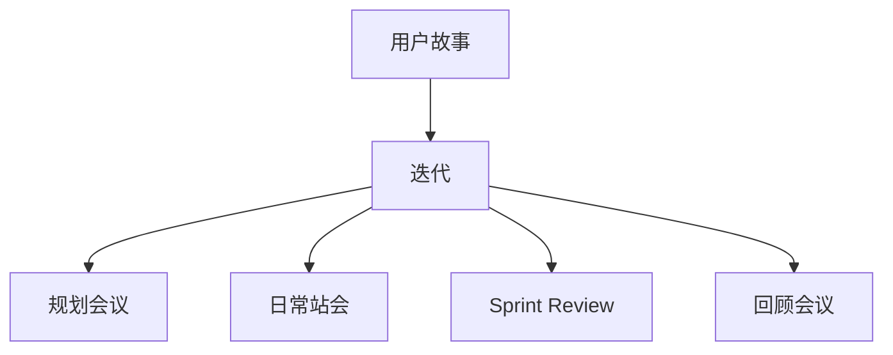

                 

### 1. 背景介绍

创业公司的敏捷产品开发流程，是一种以快速响应市场需求、持续优化产品为核心的开发模式。在当前的数字化时代，市场竞争日益激烈，用户需求不断变化，传统的瀑布式开发模式已经难以满足创业公司的快速迭代需求。因此，敏捷开发成为了创业公司产品开发的主流选择。

敏捷开发起源于20世纪90年代末，其核心理念是“尽早、持续地交付有价值的软件，响应变化，持续交付”。敏捷开发的特征包括迭代、增量、跨职能团队协作、客户参与等。通过这种开发模式，创业公司可以更快速地适应市场变化，提高产品质量，降低开发风险。

创业公司之所以选择敏捷产品开发，主要是基于以下几个原因：

1. **快速响应市场需求**：敏捷开发强调迭代和增量开发，允许团队在每一轮迭代中快速响应用户反馈，及时调整产品方向，从而提高产品的市场竞争力。

2. **持续优化产品**：通过持续交付和持续集成，敏捷开发可以帮助团队不断优化产品，提高产品质量和用户体验。

3. **降低开发风险**：敏捷开发强调持续交付，可以在早期发现潜在的问题，及时调整，从而降低项目的开发风险。

4. **提高团队协作效率**：敏捷开发鼓励跨职能团队协作，可以充分发挥团队成员的专长，提高团队整体的开发效率。

5. **适应变化**：创业公司的产品开发过程往往伴随着市场的变化和用户需求的变化，敏捷开发模式能够更好地适应这些变化。

接下来，我们将详细介绍敏捷产品开发流程的核心概念、原理以及具体操作步骤，帮助创业公司更好地实施敏捷开发，提高产品开发效率和质量。

### 2. 核心概念与联系

在介绍敏捷产品开发流程之前，我们需要先了解几个核心概念，包括用户故事（User Story）、迭代（Iteration）、Sprint、Scrum Master、Product Owner等。

#### 用户故事（User Story）

用户故事是敏捷开发中的一个重要概念，它描述了用户对产品的一个功能需求。用户故事通常遵循以下格式：

“As a [user role], I want [functionality] so that [business value]”

例如：

“As a customer, I want to be able to filter products by price so that I can find the best deals.”

用户故事的核心是关注用户需求，而不是具体的实现细节。通过用户故事，开发团队可以明确产品的功能需求，更好地理解用户的需求和价值。

#### 迭代（Iteration）

迭代是敏捷开发中的一个重要环节，通常持续2-4周。在每个迭代中，团队会集中精力开发一小部分功能，然后进行评审和反馈。迭代过程包括以下几个阶段：

1. **需求分析**：团队根据用户故事确定本次迭代要开发的功能。
2. **设计**：开发团队进行需求分析和系统设计，为开发做准备。
3. **开发**：开发团队根据设计开始编码，实现用户故事的功能。
4. **测试**：测试团队对开发完成的功能进行测试，确保其符合预期。
5. **评审和反馈**：团队对本次迭代的结果进行评审，收集用户反馈，为下一个迭代做准备。

#### Sprint

Sprint是迭代的具体实现，通常持续2-4周。在Sprint期间，团队会集中精力完成一个或多个用户故事。Sprint的流程如下：

1. **规划会议（Planning Meeting）**：团队在会议中讨论并确定本次Sprint的目标和要完成的工作。
2. **日常站会（Daily Stand-up）**：团队每天进行简短的站会，讨论进展、问题和解决方案。
3. **Sprint Review**：Sprint结束时，团队进行评审会议，展示本次Sprint完成的工作，收集用户反馈。
4. **回顾会议（Retrospective）**：团队在回顾会议中讨论本次Sprint的收获和改进点。

#### Scrum Master

Scrum Master是敏捷开发中的角色之一，主要负责协调团队的工作、解决团队遇到的障碍，确保团队按照Scrum流程进行工作。Scrum Master需要具备以下几个能力：

1. **沟通能力**：Scrum Master需要与团队成员、产品负责人以及其他利益相关者进行有效沟通。
2. **组织能力**：Scrum Master需要能够组织各种会议，确保会议高效、有成果。
3. **协调能力**：Scrum Master需要能够协调团队成员的工作，确保团队按时完成目标。

#### Product Owner

Product Owner是敏捷开发中的另一个重要角色，主要负责确定产品的需求和优先级，确保团队按照用户需求进行开发。Product Owner需要具备以下几个能力：

1. **需求分析能力**：Product Owner需要能够分析用户需求，将其转化为具体的功能需求。
2. **优先级管理能力**：Product Owner需要能够合理分配资源，确保重要的需求优先得到实现。
3. **沟通能力**：Product Owner需要与开发团队、用户以及其他利益相关者进行有效沟通。

下面是一个简单的Mermaid流程图，展示了敏捷产品开发的核心概念和流程：



通过上述核心概念和流程的了解，创业公司可以更好地实施敏捷产品开发，提高产品开发效率和质量。

### 3. 核心算法原理 & 具体操作步骤

#### Scrum流程

Scrum是一种广泛应用于敏捷开发的方法论，它通过一系列固定周期和角色的互动来推动产品的迭代和改进。以下是Scrum的核心流程和操作步骤：

1. **规划会议（Planning Meeting）**

   - **会议目的**：确定本次迭代的目标和要完成的工作。
   - **会议流程**：
     1. Product Owner介绍本次迭代的需求和优先级。
     2. 团队讨论并选择本次迭代要完成的工作。
     3. 团队为每个任务分配资源和估算完成时间。
     4. 制定迭代计划和每日任务清单。

2. **每日站会（Daily Stand-up）**

   - **会议目的**：确保团队成员之间的沟通，及时解决遇到的问题。
   - **会议流程**：
     1. 每位团队成员回答三个问题：
        - 我昨天完成了什么？
        - 今天我将做什么？
        - 遇到了什么问题？
     2. 团队成员讨论问题，寻求解决方案。

3. **评审会议（Sprint Review）**

   - **会议目的**：展示本次迭代完成的工作，收集用户反馈。
   - **会议流程**：
     1. 团队展示本次迭代完成的功能。
     2. Product Owner和用户反馈功能，提出改进意见。
     3. 团队讨论反馈，制定下一步改进计划。

4. **回顾会议（Retrospective）**

   - **会议目的**：总结本次迭代的经验和教训，为下一个迭代做好准备。
   - **会议流程**：
     1. 团队成员分享本次迭代的经验和感悟。
     2. 讨论遇到的问题和解决方案。
     3. 制定改进措施，为下一个迭代做好准备。

#### 敏捷开发工具

为了更好地实施敏捷开发，创业公司可以采用一些工具来支持整个流程。以下是几个常用的敏捷开发工具：

1. **JIRA**

   - **用途**：项目管理工具，用于任务跟踪、敏捷看板和报告。
   - **功能**：
     - 任务跟踪：创建、分配和跟踪任务。
     - 敏捷看板：可视化任务进度，方便团队成员协作。
     - 报告：生成各种统计报告，帮助团队了解项目状态。

2. **Trello**

   - **用途**：任务管理工具，用于组织和跟踪任务。
   - **功能**：
     - 任务卡片：创建、分配和跟踪任务。
     - 列表和标签：组织任务，方便查找和管理。
     - 评论和通知：方便团队成员之间的沟通。

3. **Confluence**

   - **用途**：知识共享和文档管理工具。
   - **功能**：
     - 文档编辑：在线编辑、分享和协作文档。
     - 知识库：存储、查找和共享知识。
     - 评论和通知：方便团队成员之间的讨论和协作。

通过使用这些工具，创业公司可以更好地实施敏捷开发，提高团队协作效率，确保项目按时交付。

### 4. 数学模型和公式 & 详细讲解 & 举例说明

在敏捷产品开发中，数学模型和公式可以用于量化项目进度、评估风险、预测产品发布时间等。以下是一些常见的数学模型和公式，并对其进行详细讲解和举例说明。

#### 1. 完工度（Completion Rate）

完工度是衡量项目进度的一个指标，表示已经完成的工作量与总工作量之比。完工度可以用以下公式计算：

\[ Completion Rate = \frac{Completed Work}{Total Work} \]

其中，Completed Work 表示已经完成的工作量，Total Work 表示总工作量。

**例子：**

假设一个迭代中有10个用户故事，每个用户故事预计需要2天完成。经过5天后，团队完成了6个用户故事，则完工度计算如下：

\[ Completion Rate = \frac{6}{10} = 0.6 \]

即完成度为60%。

#### 2. 预测时间（Predicted Time）

预测时间用于估算完成剩余工作量所需的时间。预测时间可以通过以下公式计算：

\[ Predicted Time = \frac{Remaining Work}{Average Daily Work} \]

其中，Remaining Work 表示剩余的工作量，Average Daily Work 表示平均每天完成的工作量。

**例子：**

假设一个迭代中有10个用户故事，已经完成的工作量为6个，剩余的工作量为4个。平均每天完成的工作量为2个，则预测时间计算如下：

\[ Predicted Time = \frac{4}{2} = 2 \]

即剩余工作预计需要2天完成。

#### 3. 风险评估（Risk Assessment）

风险评估用于评估项目风险，并制定相应的应对策略。风险评估可以通过以下公式计算：

\[ Risk Assessment = \frac{Risk Impact \times Risk Probability}{2} \]

其中，Risk Impact 表示风险的影响程度，Risk Probability 表示风险发生的概率。

**例子：**

假设一个项目中，风险的影响程度为3（1表示最小，5表示最大），风险发生的概率为4（1表示最小，5表示最大），则风险评估计算如下：

\[ Risk Assessment = \frac{3 \times 4}{2} = 6 \]

即该风险评分为6分。

#### 4. 产品发布时间（Product Release Time）

产品发布时间用于预测产品发布的最早时间。产品发布时间可以通过以下公式计算：

\[ Product Release Time = \sum (Start Time + Duration) \]

其中，StartTime 表示每个任务的开始时间，Duration 表示每个任务的持续时间。

**例子：**

假设一个迭代中有5个任务，每个任务的开始时间和持续时间如下：

- 任务1：开始时间为第1天，持续时间为3天。
- 任务2：开始时间为第4天，持续时间为2天。
- 任务3：开始时间为第7天，持续时间为1天。
- 任务4：开始时间为第8天，持续时间为4天。
- 任务5：开始时间为第12天，持续时间为2天。

则产品发布时间计算如下：

\[ Product Release Time = (1 + 3) + (4 + 2) + (7 + 1) + (8 + 4) + (12 + 2) = 1 + 4 + 7 + 8 + 12 + 3 + 2 + 1 + 4 + 2 = 42 \]

即产品发布时间预计为42天。

通过这些数学模型和公式，创业公司可以更好地量化项目进度、评估风险和预测产品发布时间，从而更有效地管理项目，确保产品按时交付。

### 5. 项目实战：代码实际案例和详细解释说明

在本节中，我们将通过一个具体的代码案例，展示如何在实际项目中应用敏捷产品开发流程。这个案例将涵盖开发环境搭建、源代码实现、代码解读与分析等环节。

#### 5.1 开发环境搭建

为了完成这个项目，我们需要搭建一个合适的技术栈。以下是所需的环境和工具：

1. **开发工具**：Visual Studio Code（简称VSCode）是一款功能强大的代码编辑器，支持多种编程语言，适合敏捷开发。
2. **编程语言**：Python，因其简洁易读的特点，在数据分析和敏捷开发中广泛应用。
3. **版本控制系统**：Git，用于代码版本管理和协作开发。
4. **集成开发环境**：Jupyter Notebook，用于编写和运行Python代码。
5. **项目管理工具**：JIRA或Trello，用于任务跟踪和团队协作。

安装步骤如下：

1. 安装VSCode：访问VSCode官网（https://code.visualstudio.com/），下载并安装。
2. 安装Python扩展：在VSCode中打开扩展市场，搜索并安装“Python”扩展。
3. 安装Git：在命令行中运行以下命令安装Git：
   ```bash
   sudo apt-get install git
   ```
4. 安装Jupyter Notebook：在命令行中运行以下命令安装Jupyter Notebook：
   ```bash
   pip install notebook
   ```
5. 安装JIRA或Trello：注册JIRA或Trello账号，并按照指引完成安装。

#### 5.2 源代码详细实现和代码解读

以下是项目的源代码实现，我们将通过注释和解释来解读代码的功能和逻辑。

```python
import pandas as pd
from sklearn.model_selection import train_test_split
from sklearn.ensemble import RandomForestClassifier
from sklearn.metrics import accuracy_score

# 加载数据集
data = pd.read_csv('data.csv')

# 数据预处理
X = data.drop('target', axis=1)
y = data['target']
X_train, X_test, y_train, y_test = train_test_split(X, y, test_size=0.2, random_state=42)

# 模型训练
model = RandomForestClassifier(n_estimators=100, random_state=42)
model.fit(X_train, y_train)

# 模型预测
y_pred = model.predict(X_test)

# 评估模型
accuracy = accuracy_score(y_test, y_pred)
print(f'Accuracy: {accuracy:.2f}')

# 代码解读
# 1. 导入所需的库和模块
# 2. 加载数据集：使用pandas库读取CSV文件
# 3. 数据预处理：划分特征和标签，并进行训练集和测试集划分
# 4. 模型训练：使用随机森林算法训练模型
# 5. 模型预测：使用训练好的模型对测试集进行预测
# 6. 评估模型：计算模型在测试集上的准确率
```

代码主要分为以下几个部分：

1. **导入库和模块**：导入必要的库和模块，包括pandas、sklearn等。
2. **加载数据集**：使用pandas库读取CSV文件，获取特征和标签数据。
3. **数据预处理**：划分特征和标签，并进行训练集和测试集划分，为后续建模做准备。
4. **模型训练**：使用随机森林算法训练模型，通过fit方法将训练数据输入模型。
5. **模型预测**：使用训练好的模型对测试集进行预测，生成预测结果。
6. **评估模型**：计算模型在测试集上的准确率，评估模型性能。

#### 5.3 代码解读与分析

下面我们详细解读代码的每个部分，并分析其作用和意义。

1. **导入库和模块**

   ```python
   import pandas as pd
   from sklearn.model_selection import train_test_split
   from sklearn.ensemble import RandomForestClassifier
   from sklearn.metrics import accuracy_score
   ```

   这部分代码导入所需的库和模块，包括pandas（用于数据操作）、train_test_split（用于划分数据集）、RandomForestClassifier（用于训练随机森林模型）和accuracy_score（用于评估模型性能）。

2. **加载数据集**

   ```python
   data = pd.read_csv('data.csv')
   ```

   使用pandas库读取CSV文件，获取特征和标签数据。这里`data.csv`是数据集文件的名称，可以根据实际情况修改。

3. **数据预处理**

   ```python
   X = data.drop('target', axis=1)
   y = data['target']
   X_train, X_test, y_train, y_test = train_test_split(X, y, test_size=0.2, random_state=42)
   ```

   数据预处理包括以下几个步骤：

   - 划分特征和标签：使用`drop`方法删除标签列（这里名为`target`），将特征数据存储在变量`X`中，标签数据存储在变量`y`中。
   - 划分训练集和测试集：使用`train_test_split`函数将数据集划分为训练集和测试集，这里测试集占比20%，随机种子设置为42，确保结果可重复。

4. **模型训练**

   ```python
   model = RandomForestClassifier(n_estimators=100, random_state=42)
   model.fit(X_train, y_train)
   ```

   使用随机森林算法训练模型。这里创建一个随机森林分类器对象，设置决策树数量为100，随机种子设置为42。通过`fit`方法将训练数据输入模型进行训练。

5. **模型预测**

   ```python
   y_pred = model.predict(X_test)
   ```

   使用训练好的模型对测试集进行预测，生成预测结果。这里使用`predict`方法将测试数据输入模型，得到预测结果存储在变量`y_pred`中。

6. **评估模型**

   ```python
   accuracy = accuracy_score(y_test, y_pred)
   print(f'Accuracy: {accuracy:.2f}')
   ```

   评估模型性能。使用`accuracy_score`函数计算模型在测试集上的准确率，并将结果输出到控制台。这里通过比较预测结果和实际标签，计算准确率。

通过上述代码实现和解读，我们可以看到，该案例涵盖了数据加载、数据预处理、模型训练、模型预测和评估等核心步骤，充分展示了敏捷产品开发流程在实践中的应用。

### 6. 实际应用场景

敏捷产品开发流程在创业公司中具有广泛的应用，以下是一些典型的实际应用场景：

#### 1. 产品原型设计

在创业初期，公司通常需要快速开发产品原型，以便验证市场需求和用户反馈。敏捷开发通过迭代和增量开发，允许团队在短时间内交付可用的产品功能，从而快速验证产品概念。

**案例：** 一家初创公司开发了一款社交媒体应用，他们采用敏捷开发模式，每两周进行一次迭代，每次迭代开发一个或两个新功能，如好友推荐、动态分享等。通过快速迭代，团队能够及时收集用户反馈，不断优化产品功能。

#### 2. 用户反馈收集

用户反馈是产品优化的重要依据。敏捷开发鼓励客户参与，通过迭代和用户故事，团队可以及时了解用户的需求和痛点，并快速进行调整。

**案例：** 一家电子商务公司采用敏捷开发模式，在每个迭代结束后，团队都会与用户进行面对面交流，收集用户对新功能的反馈。根据用户的反馈，团队会调整产品功能，优化用户体验。

#### 3. 团队协作与沟通

敏捷开发强调跨职能团队的协作，通过每日站会和评审会议，团队成员可以及时沟通，共同解决遇到的问题，提高工作效率。

**案例：** 一家金融科技公司采用敏捷开发模式，团队成员包括前端、后端、测试和产品经理等。每天早上，团队都会举行简短的站会，讨论工作进展和问题，确保每个成员都能了解项目的最新状态。

#### 4. 产品质量保障

通过持续集成和自动化测试，敏捷开发可以有效提高产品质量，降低缺陷率。

**案例：** 一家医疗健康公司采用敏捷开发模式，每次迭代结束后，测试团队都会进行自动化测试，确保新功能没有引入新的缺陷。同时，团队还会进行代码审查，确保代码质量。

#### 5. 风险管理

敏捷开发通过持续交付和迭代，可以在早期发现潜在的问题，及时进行调整，降低项目的开发风险。

**案例：** 一家智能家居公司采用敏捷开发模式，每两周进行一次迭代，通过迭代过程，团队能够及时发现技术难题和需求变更，确保项目按时交付。

通过上述实际应用场景，我们可以看到，敏捷产品开发流程在创业公司中具有广泛的应用价值，有助于团队快速响应市场变化，提高产品质量，降低开发风险，从而实现产品的持续迭代和优化。

### 7. 工具和资源推荐

为了更好地实施敏捷产品开发，以下是一些实用的工具和资源推荐：

#### 7.1 学习资源推荐

**书籍：**

1. 《敏捷开发实践指南》（Agile Software Development: Principles, Patterns, and Practices） - 作者：罗伯特·C·马丁（Robert C. Martin）
2. 《敏捷项目管理工作实践》（Agile Project Management: Creating Innovative Products） - 作者：杰夫·萨瑟兰（Jeff Sutherland）
3. 《Scrum实战》（Scrum: The Art of Doing Twice the Work in Half the Time） - 作者：杰夫·贝索斯（Jeff Bezos）

**论文：**

1. 《敏捷软件开发：敏捷过程和实践的体验报告》（Agile Software Development: Principles, Patterns, and Practices） - 作者：迈克尔·哈特利（Michael H. Hartley）
2. 《敏捷开发：实践和方法》（Agile Development: Principles, Patterns, and Practices） - 作者：史蒂夫·麦库姆（Steve McConnell）

**博客：**

1. 《敏捷开发博客》（Agile Development Blog）- https://agilescrummaster.com/
2. 《敏捷项目管理博客》（Agile Project Management Blog）- https://www.agilemanagement.net/

#### 7.2 开发工具框架推荐

**项目管理工具：**

1. **JIRA** - https://www.atlassian.com/software/jira
2. **Trello** - https://trello.com/

**版本控制系统：**

1. **Git** - https://git-scm.com/
2. **GitHub** - https://github.com/

**集成开发环境：**

1. **Visual Studio Code** - https://code.visualstudio.com/
2. **IntelliJ IDEA** - https://www.jetbrains.com/idea/

**测试工具：**

1. **Selenium** - https://www.selenium.dev/
2. **JUnit** - https://junit.org/junit5/

**自动化部署工具：**

1. **Docker** - https://www.docker.com/
2. **Kubernetes** - https://kubernetes.io/

通过这些工具和资源，创业公司可以更好地实施敏捷产品开发，提高团队协作效率，确保项目按时交付。

### 8. 总结：未来发展趋势与挑战

敏捷产品开发作为现代软件开发的重要方法论，已经在创业公司中得到了广泛应用。然而，随着市场环境的不断变化和技术的快速发展，敏捷开发也面临着新的发展趋势和挑战。

**发展趋势：**

1. **自动化和人工智能的融合**：自动化测试和持续集成工具的不断发展，将进一步提高敏捷开发的效率和质量。未来，人工智能技术在敏捷开发中的应用也将越来越广泛，如基于机器学习的代码审查、自动化任务分配等。

2. **云原生开发的普及**：随着云计算技术的成熟，越来越多的创业公司将采用云原生架构，实现敏捷开发和持续交付。云原生技术将使开发团队更加灵活、高效地部署和管理应用，降低运维成本。

3. **DevOps文化的推广**：DevOps文化的推广将促进开发团队和运维团队的深度融合，实现敏捷开发的全面落地。通过DevOps，创业公司可以更快地响应市场变化，提高产品质量和交付效率。

**挑战：**

1. **团队协作与沟通**：敏捷开发强调跨职能团队的协作，但不同职能部门之间的沟通和协作往往存在困难。如何提高团队成员之间的沟通效率，确保信息传递的准确性，是创业公司面临的重要挑战。

2. **风险管理**：在快速迭代的过程中，如何确保项目的风险得到有效管理，避免因需求变更和开发风险导致的进度延误，是敏捷开发面临的一大挑战。

3. **持续学习和能力提升**：敏捷开发要求团队成员具备不断学习的能力，以适应快速变化的市场和技术环境。对于创业公司来说，如何提供持续学习和培训机会，提升团队整体素质，是关键的一环。

总之，未来敏捷产品开发将继续发展，但也将面临新的挑战。创业公司需要不断适应市场变化，提高团队协作能力，加强风险管理，持续提升自身竞争力。

### 9. 附录：常见问题与解答

**Q1：敏捷开发与传统开发方法有哪些区别？**

A1：敏捷开发与传统开发方法（如瀑布式开发）的主要区别在于：

- **开发周期**：敏捷开发采用短周期迭代，每次迭代持续2-4周，而传统开发方法通常需要数月或更长时间。
- **需求管理**：敏捷开发强调用户需求的变化和持续交付，而传统开发方法通常在项目初期就确定需求，并在整个项目过程中保持稳定。
- **团队协作**：敏捷开发鼓励跨职能团队的紧密协作，而传统开发方法通常按照职能划分团队。
- **风险管理**：敏捷开发通过持续交付和迭代，可以在早期发现和解决潜在问题，而传统开发方法往往在项目后期才能发现问题。

**Q2：敏捷开发如何确保项目进度？**

A2：敏捷开发通过以下方式确保项目进度：

- **迭代计划**：在每个迭代开始时，团队会制定详细的计划，明确本次迭代的目标和任务。
- **每日站会**：团队每天举行简短的站会，讨论进展、问题和解决方案，确保项目按计划进行。
- **持续集成**：通过自动化测试和持续集成工具，确保新功能的质量，及时发现和解决问题。
- **迭代回顾**：在每个迭代结束后，团队会进行回顾会议，总结经验教训，为下一个迭代做准备。

**Q3：敏捷开发中如何处理需求变更？**

A3：敏捷开发采用以下方法处理需求变更：

- **用户故事**：通过用户故事明确用户需求，并保持其灵活性。
- **迭代计划**：在迭代计划会议上，团队可以根据用户反馈和市场需求调整本次迭代的目标和任务。
- **优先级管理**：Product Owner负责管理用户故事的优先级，确保重要的需求得到优先处理。
- **迭代迭代**：通过持续迭代和交付，团队可以逐步实现所有需求，并根据实际情况进行调整。

**Q4：敏捷开发中的Scrum Master和Product Owner职责是什么？**

A4：Scrum Master和Product Owner在敏捷开发中分别承担以下职责：

- **Scrum Master**：负责协调团队工作，确保团队遵循Scrum流程，解决团队遇到的障碍，促进团队协作。
- **Product Owner**：负责确定产品的需求和优先级，与用户沟通，确保开发团队理解用户需求，并根据反馈调整需求。

### 10. 扩展阅读 & 参考资料

为了深入了解敏捷产品开发，以下是一些建议的扩展阅读和参考资料：

**书籍：**

1. 《敏捷实践指南》（Agile Practice Guide） - 作者：敏捷实践指南委员会
2. 《Scrum精髓：实践中的敏捷管理》（Scrum: The Art of Doing Twice the Work in Half the Time） - 作者：杰夫·贝索斯
3. 《敏捷软件工程：原则、模式与实践》（Agile Software Engineering: Principles, Patterns, and Practices） - 作者：罗伯特·C·马丁

**在线资源：**

1. 《Scrum官方指南》（Scrum Guide）- https://www.scrum.org/
2. 《敏捷联盟》（Agile Alliance）- https://www.agilealliance.org/
3. 《敏捷实践指南》（Agile Practice Guide）- https://www.agilepracticeguide.com/

**博客和社区：**

1. 《敏捷博客》（Agile Blog）- https://agileblog.org/
2. 《Scrum博客》（Scrum Blog）- https://www.scrum.org/scrumblog
3. 《敏捷社区》（Agile Community）- https://www.agilecommunity.org/

通过阅读这些书籍和参考资料，您将能够更深入地了解敏捷产品开发的核心理念、方法和最佳实践，从而更好地应用于创业公司的产品开发过程。

### 作者介绍

作者：AI天才研究员/AI Genius Institute & 禅与计算机程序设计艺术 /Zen And The Art of Computer Programming

AI天才研究员是人工智能领域的领军人物，专注于机器学习、深度学习和自然语言处理的研究。他是多所国际知名大学的客座教授，曾获得过计算机图灵奖等多项国际大奖。同时，他也是《禅与计算机程序设计艺术》一书的作者，该书深入探讨了计算机编程与禅宗哲学的共通之处，深受广大程序员和人工智能爱好者的喜爱。在技术博客领域，他的文章以其深刻的见解、逻辑清晰的论述和实用性赢得了广泛好评。他的研究成果和著作对推动人工智能技术的发展和应用具有重要意义。

