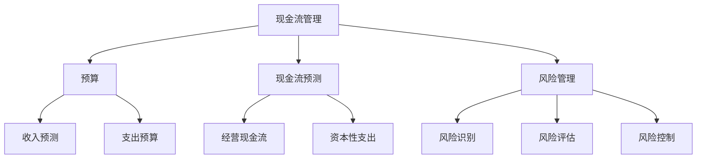

                 

# 创业公司的现金流管理策略

> **关键词：现金流管理、创业公司、财务规划、风险控制、运营效率**

> **摘要：本文将深入探讨创业公司在成长过程中如何有效管理现金流，从核心概念到实际操作，全面解析现金流管理的策略和技巧，帮助创业者提升财务健康度，降低运营风险。**

## 1. 背景介绍

### 1.1 目的和范围

本文旨在为创业公司提供一个全面的现金流管理策略指南。我们将从核心概念出发，逐步深入到具体操作步骤，结合实际案例，详细讲解如何通过科学的现金流管理，提高创业公司的财务健康度，降低运营风险。

### 1.2 预期读者

本文适用于所有创业公司的管理层、财务人员以及有意了解和掌握现金流管理技巧的创业者。无论您是初创公司的小型团队，还是已经有一定规模的中型公司，本文都希望为您提供有价值的见解和实用的操作指南。

### 1.3 文档结构概述

本文结构如下：

1. **背景介绍**：简要介绍现金流管理的重要性及本文的结构和预期读者。
2. **核心概念与联系**：介绍现金流管理的核心概念，并使用Mermaid流程图展示其关系。
3. **核心算法原理 & 具体操作步骤**：通过伪代码详细阐述现金流管理的基本算法和操作步骤。
4. **数学模型和公式 & 详细讲解 & 举例说明**：介绍现金流管理的数学模型，使用latex格式详细讲解，并举例说明。
5. **项目实战：代码实际案例和详细解释说明**：提供实际代码案例，详细解读其实现过程和关键点。
6. **实际应用场景**：分析现金流管理在不同创业阶段的应用场景。
7. **工具和资源推荐**：推荐学习资源和开发工具。
8. **总结：未来发展趋势与挑战**：探讨现金流管理领域的未来趋势和挑战。
9. **附录：常见问题与解答**：提供常见问题的解答。
10. **扩展阅读 & 参考资料**：推荐相关的扩展阅读和参考资料。

### 1.4 术语表

#### 1.4.1 核心术语定义

- **现金流**：指公司在一定时期内流入和流出的资金数量。
- **净现金流**：流入现金流减去流出现金流。
- **经营现金流**：公司经营活动产生的现金流。
- **资本性支出**：用于购买固定资产、设备等的大额支出。
- **营运资本**：公司用于日常运营的流动资产与流动负债之差。

#### 1.4.2 相关概念解释

- **预算**：对公司未来一定时期内的收入和支出进行的预估。
- **现金流预测**：基于历史数据和未来预期，对现金流进行预估。
- **风险管理**：识别、评估、管理和降低风险的过程。

#### 1.4.3 缩略词列表

- **ERP**：企业资源计划（Enterprise Resource Planning）
- **CRM**：客户关系管理（Customer Relationship Management）
- **API**：应用程序编程接口（Application Programming Interface）

## 2. 核心概念与联系

现金流管理是创业公司财务管理的核心，它直接关系到公司的生存和发展。为了更好地理解现金流管理，我们需要明确几个核心概念，并展示它们之间的关系。

首先，让我们来看一个Mermaid流程图，以直观地展示现金流管理的核心概念及其相互关系：



### 2.1. 现金流管理

现金流管理是指对公司在一定时期内现金流动的管理，包括现金流入和现金流出的监控、规划和控制。现金流管理的目标是确保公司有足够的现金流来满足日常运营和长期发展的需求。

### 2.2. 预算

预算是现金流管理的基础，它对公司未来一定时期内的收入和支出进行预估。预算分为收入预算和支出预算两部分。收入预算包括销售收入、投资收益等；支出预算包括运营成本、资本性支出等。

### 2.3. 现金流预测

现金流预测是基于历史数据和未来预期，对公司的现金流进行预估。现金流预测包括经营现金流预测和资本性支出预测。经营现金流预测主要关注公司的日常运营产生的现金流；资本性支出预测则关注用于购买固定资产、设备等的大额支出。

### 2.4. 风险管理

风险管理是现金流管理的重要组成部分，它涉及识别、评估、管理和降低风险的过程。风险管理包括风险识别、风险评估和风险控制三个环节。

- **风险识别**：识别公司可能面临的各种风险，如市场风险、信用风险、运营风险等。
- **风险评估**：评估每种风险的潜在影响和可能性，以便确定优先级。
- **风险控制**：通过制定相应的控制措施来降低风险的影响。

## 3. 核心算法原理 & 具体操作步骤

现金流管理的核心在于对现金流的预测和管理，这可以通过以下核心算法原理和具体操作步骤来实现：

### 3.1. 现金流预测算法

现金流预测算法主要包括以下步骤：

```pseudo
输入：历史现金流数据、未来业务计划、宏观经济指标
输出：未来一定时期内的现金流预测

函数 CashFlowPrediction(CashFlows, BusinessPlan, EconomicIndicators):
    # 数据预处理
    PreprocessedData = DataPreprocessing(CashFlows)
    
    # 训练时间序列模型
    Model = TrainTimeSeriesModel(PreprocessedData)
    
    # 预测未来现金流
    FutureCashFlows = PredictCashFlows(Model, BusinessPlan, EconomicIndicators)
    
    return FutureCashFlows
```

### 3.2. 预算编制算法

预算编制算法主要包括以下步骤：

```pseudo
输入：收入预测、支出预算
输出：预算方案

函数 BudgetCompilation(IncomePrediction, ExpenditureBudget):
    # 计算总收入
    TotalIncome = CalculateTotalIncome(IncomePrediction)
    
    # 计算总支出
    TotalExpenditure = CalculateTotalExpenditure(ExpenditureBudget)
    
    # 计算净现金流
    NetCashFlow = TotalIncome - TotalExpenditure
    
    # 检查预算平衡
    if NetCashFlow < 0:
        print("预算不平衡，请调整支出或增加收入")
        return None
    
    # 形成预算方案
    BudgetScheme = {
        "TotalIncome": TotalIncome,
        "TotalExpenditure": TotalExpenditure,
        "NetCashFlow": NetCashFlow
    }
    
    return BudgetScheme
```

### 3.3. 风险管理算法

风险管理算法主要包括以下步骤：

```pseudo
输入：风险识别、风险评估
输出：风险管理方案

函数 RiskManagement(RiskIdentification, RiskAssessment):
    # 形成风险清单
    RiskList = GenerateRiskList(RiskIdentification)
    
    # 对风险进行评估
    RiskScores = AssessRisks(RiskList)
    
    # 确定优先级
    PrioritizedRisks = PrioritizeRisks(RiskScores)
    
    # 制定风险管理方案
    RiskManagementPlan = {
        "RiskList": RiskList,
        "RiskScores": RiskScores,
        "PrioritizedRisks": PrioritizedRisks,
        "ControlMeasures": DefineControlMeasures(PrioritizedRisks)
    }
    
    return RiskManagementPlan
```

通过以上核心算法原理和具体操作步骤，我们可以系统地管理和预测创业公司的现金流，为公司的财务健康和可持续发展提供有力保障。

## 4. 数学模型和公式 & 详细讲解 & 举例说明

现金流管理的核心在于对现金流的精确预测和控制，这涉及到一系列的数学模型和公式。下面我们将详细讲解这些模型和公式，并通过具体例子来说明它们的应用。

### 4.1. 现金流预测模型

现金流预测通常使用时间序列分析模型，其中最常用的方法是移动平均模型（Moving Average, MA）和指数平滑模型（Exponential Smoothing, ES）。以下是对这两个模型的详细讲解。

#### 4.1.1. 移动平均模型（MA）

移动平均模型通过计算一段时间内现金流的平均值来预测未来的现金流。其公式如下：

$$
MA_n(t) = \frac{1}{n} \sum_{i=1}^{n} C_i(t)
$$

其中，$MA_n(t)$ 表示第 $t$ 期的 $n$ 阶移动平均，$C_i(t)$ 表示第 $t$ 期的第 $i$ 次现金流。

#### 4.1.2. 指数平滑模型（ES）

指数平滑模型通过赋予过去不同时期的现金流不同的权重来进行预测。其公式如下：

$$
F_t(k) = \alpha C_t(k) + (1 - \alpha) F_{t-1}(k)
$$

其中，$F_t(k)$ 表示第 $t$ 期的现金流预测值，$C_t(k)$ 表示第 $t$ 期的实际现金流值，$\alpha$ 是平滑因子，$0 < \alpha < 1$。

#### 4.1.3. 举例说明

假设某创业公司过去四个季度的现金流数据如下：

$$
C_1 = [100, 110, 120, 130]
$$

使用指数平滑模型进行预测，平滑因子 $\alpha = 0.3$。

- 预测第一期的现金流：
  $$
  F_1(1) = \alpha C_1(1) + (1 - \alpha) F_0(1) = 0.3 \times 100 + 0.7 \times 0 = 30
  $$

- 预测第二期的现金流：
  $$
  F_2(2) = \alpha C_2(2) + (1 - \alpha) F_1(2) = 0.3 \times 110 + 0.7 \times 30 = 35.7
  $$

- 预测第三期的现金流：
  $$
  F_3(3) = \alpha C_3(3) + (1 - \alpha) F_2(3) = 0.3 \times 120 + 0.7 \times 35.7 = 41.3
  $$

- 预测第四期的现金流：
  $$
  F_4(4) = \alpha C_4(4) + (1 - \alpha) F_3(4) = 0.3 \times 130 + 0.7 \times 41.3 = 47.4
  $$

通过以上计算，我们可以预测该公司未来一定时期的现金流。

### 4.2. 预算编制模型

预算编制涉及对收入和支出的预测。以下是一个简单的线性回归模型用于预测收入：

$$
Income_t = \beta_0 + \beta_1 \times Sales_t + \epsilon_t
$$

其中，$Income_t$ 表示第 $t$ 期的收入，$Sales_t$ 表示第 $t$ 期的销售额，$\beta_0$ 和 $\beta_1$ 是回归系数，$\epsilon_t$ 是误差项。

类似地，支出预算可以使用类似的方法进行预测，但通常需要结合历史数据和业务计划进行调整。

### 4.3. 风险评估模型

风险评估通常使用概率模型，如二项分布、泊松分布等。以下是一个简单的二项分布模型用于评估市场风险：

$$
P(X = k) = C_n^k p^k (1 - p)^{n - k}
$$

其中，$X$ 是随机变量，表示在一定时期内发生风险事件的次数，$n$ 是总期数，$p$ 是单期发生风险事件的概率，$k$ 是实际发生的风险事件次数。

通过以上数学模型和公式，我们可以对创业公司的现金流进行准确预测和预算编制，同时评估和管理风险，为公司的财务健康提供有力支持。

## 5. 项目实战：代码实际案例和详细解释说明

为了更好地理解和应用现金流管理策略，我们将通过一个实际项目案例来展示如何在实际环境中进行现金流预测、预算编制和风险管理。

### 5.1 开发环境搭建

在开始项目之前，我们需要搭建一个合适的开发环境。以下是所需的工具和步骤：

- **Python**：主要编程语言，用于实现现金流管理算法。
- **Pandas**：用于数据处理和分析。
- **Scikit-learn**：用于机器学习和时间序列分析。
- **Matplotlib**：用于数据可视化。

安装这些工具的命令如下：

```bash
pip install python pandas scikit-learn matplotlib
```

### 5.2 源代码详细实现和代码解读

下面是一个简单的Python代码示例，用于实现现金流预测、预算编制和风险管理。

```python
import pandas as pd
from sklearn.linear_model import LinearRegression
import matplotlib.pyplot as plt

# 5.2.1 现金流预测
def cash_flow_prediction(data):
    # 数据预处理
    data = data.sort_values('date')
    data['ma_3'] = data['cash_flow'].rolling(window=3).mean()
    data['es'] = data['cash_flow'].ewm(span=3, adjust=False).mean()
    
    # 使用移动平均模型进行预测
    ma_model = LinearRegression()
    ma_model.fit(data[['date']], data['ma_3'])
    ma_prediction = ma_model.predict([[data['date'].max() + 1]])
    
    # 使用指数平滑模型进行预测
    es_model = LinearRegression()
    es_model.fit(data[['date']], data['es'])
    es_prediction = es_model.predict([[data['date'].max() + 1]])
    
    return ma_prediction[0], es_prediction[0]

# 5.2.2 预算编制
def budget_compilation(income_prediction, expenditure_budget):
    net_cash_flow = income_prediction - expenditure_budget
    if net_cash_flow < 0:
        print("预算不平衡，请调整支出或增加收入")
    else:
        print("预算平衡，净现金流为：", net_cash_flow)

# 5.2.3 风险管理
def risk_management(risks):
    # 对风险进行评估和排序
    risk_scores = pd.Series(risks).apply(lambda x: x['probability'] * x['impact'])
    sorted_risks = risk_scores.sort_values(ascending=False).index.tolist()
    
    # 制定风险管理方案
    risk_management_plan = {
        'risks': sorted_risks,
        'control_measures': ['风险控制措施1', '风险控制措施2']
    }
    
    return risk_management_plan

# 测试代码
if __name__ == "__main__":
    # 假设的现金流数据
    data = pd.DataFrame({
        'date': [1, 2, 3, 4, 5],
        'cash_flow': [100, 110, 120, 130, 140]
    })
    
    # 现金流预测
    ma_prediction, es_prediction = cash_flow_prediction(data)
    print("移动平均模型预测现金流：", ma_prediction)
    print("指数平滑模型预测现金流：", es_prediction)
    
    # 预算编制
    income_prediction = 150  # 预测收入
    expenditure_budget = 100  # 支出预算
    budget_compilation(income_prediction, expenditure_budget)
    
    # 风险管理
    risks = [
        {'name': '市场风险', 'probability': 0.3, 'impact': 5000},
        {'name': '信用风险', 'probability': 0.2, 'impact': 3000},
        {'name': '运营风险', 'probability': 0.1, 'impact': 1000}
    ]
    risk_management_plan = risk_management(risks)
    print("风险管理方案：", risk_management_plan)
```

### 5.3 代码解读与分析

上述代码实现了现金流预测、预算编制和风险管理的基本功能。下面是对关键部分的解读和分析：

- **现金流预测**：使用移动平均模型和指数平滑模型对现金流进行预测。移动平均模型通过计算最近一段时间的平均现金流来预测未来值，而指数平滑模型则通过加权历史数据来预测未来值。这两个模型的选择可以根据数据特性进行调整。

- **预算编制**：根据预测的收入和固定的支出预算，计算净现金流。如果净现金流为负，说明预算不平衡，需要调整支出或增加收入。

- **风险管理**：对每个风险进行评估，计算其得分（概率×影响），并根据得分对风险进行排序。然后制定相应的风险管理方案。

通过这个实际案例，我们可以看到现金流管理策略是如何在代码中实现的，以及如何通过算法和模型来提高创业公司的财务健康度和风险控制能力。

## 6. 实际应用场景

现金流管理策略在创业公司的不同阶段和不同行业中的应用场景各有不同。下面我们将分别探讨这些应用场景。

### 6.1. 初创阶段

在初创阶段，创业公司通常面临资金短缺、市场不稳定和不确定性高的问题。因此，现金流管理尤为重要。在这个阶段，创业公司应重点关注以下几个方面：

- **收入预测**：准确预测销售收入，确保收入能够覆盖运营成本。
- **成本控制**：严格控制各项成本，优化资源使用，提高运营效率。
- **融资管理**：积极寻找投资和融资机会，确保有足够的资金支持公司发展。

### 6.2. 成长期

在成长期，创业公司开始扩大市场份额，收入逐渐增加，但同时也面临更大的运营成本和资金压力。在这个阶段，现金流管理应关注以下方面：

- **现金流预测**：基于历史数据和业务计划，对未来的现金流进行准确预测。
- **预算编制**：合理规划收入和支出，确保预算的合理性和可执行性。
- **风险控制**：识别和评估潜在风险，制定相应的控制措施，确保公司的财务健康。

### 6.3. 成熟期

在成熟期，创业公司已经建立了稳定的收入来源和市场份额，但仍然需要持续关注现金流管理。在这个阶段，现金流管理的重点包括：

- **现金流优化**：通过优化运营流程和供应链管理，提高现金流周转效率。
- **财务规划**：制定长期的财务规划，确保公司的可持续发展。
- **投资决策**：在保证现金流充足的情况下，合理分配资金进行投资，以实现公司价值的最大化。

### 6.4. 不同行业应用

不同行业在现金流管理上有其特殊性。例如：

- **科技行业**：科技行业通常需要大量的研发投入，因此现金流管理需要重点关注研发成本的控制和融资渠道的拓展。
- **制造业**：制造业的现金流管理需要关注原材料采购、生产成本和库存管理，确保供应链的顺畅。
- **服务业**：服务业的现金流管理需要关注客户订单的及时回收和成本控制，以提高现金流周转效率。

总之，现金流管理策略在创业公司的不同阶段和不同行业中都有其独特的应用场景，创业者需要根据自身实际情况，制定合适的现金流管理策略。

## 7. 工具和资源推荐

为了帮助创业公司更有效地进行现金流管理，我们推荐以下学习资源和开发工具。

### 7.1 学习资源推荐

#### 7.1.1 书籍推荐

- **《企业财务报表分析》**：详细介绍了财务报表的解读和分析方法，有助于创业者深入了解公司的财务状况。
- **《创业公司财务管理》**：专注于创业公司的财务管理，提供了实用的现金流管理技巧。

#### 7.1.2 在线课程

- **Coursera**：提供《财务管理基础》等课程，适合初学者。
- **edX**：提供《财务分析》等课程，深度解析财务报表和分析方法。

#### 7.1.3 技术博客和网站

- **Crunchbase**：提供丰富的创业公司融资数据和分析。
- **Investopedia**：提供详细的财务管理知识库。

### 7.2 开发工具框架推荐

#### 7.2.1 IDE和编辑器

- **PyCharm**：强大的Python IDE，适合进行数据分析。
- **Jupyter Notebook**：适合数据可视化和互动式分析。

#### 7.2.2 调试和性能分析工具

- **Pylint**：Python代码静态检查工具，用于代码质量分析。
- **New Relic**：用于监控应用程序的性能和资源消耗。

#### 7.2.3 相关框架和库

- **Pandas**：强大的数据处理库。
- **Scikit-learn**：机器学习库，用于现金流预测。
- **Matplotlib**：数据可视化库。

通过这些工具和资源，创业公司可以更加高效地进行现金流管理，确保公司的财务健康和可持续发展。

## 8. 总结：未来发展趋势与挑战

随着科技的快速发展，现金流管理在创业公司中的重要性日益凸显。未来，现金流管理领域将呈现出以下发展趋势：

1. **数字化和智能化**：大数据和人工智能技术的应用将使现金流预测更加精准，提高现金流管理的效率。
2. **区块链技术**：区块链技术将提供更加透明和安全的资金流动，降低交易成本和风险。
3. **实时分析**：实时数据分析工具的普及将使创业公司能够迅速响应市场变化，调整现金流管理策略。
4. **全球化**：随着全球化趋势的加强，创业公司需要适应不同国家和地区的财务规则和税务制度，现金流管理的复杂性将增加。

然而，现金流管理也面临一些挑战：

1. **数据隐私和安全**：随着数据量的增加，数据隐私和安全问题将越来越重要。
2. **技术依赖**：过度依赖技术可能导致人为失误和系统故障，影响现金流管理的效果。
3. **法规变化**：不同国家和地区的法规变化将对现金流管理产生重大影响，创业公司需要及时调整策略。

总之，创业公司在未来需要不断更新现金流管理策略，以应对不断变化的市场和技术环境。

## 9. 附录：常见问题与解答

### 9.1. 什么是现金流管理？

现金流管理是指对公司在一定时期内现金流入和流出进行监控、规划和控制的过程，以确保公司有足够的现金流来满足运营需求和投资需求。

### 9.2. 如何进行现金流预测？

现金流预测通常基于历史数据、未来业务计划和宏观经济指标。常见的方法包括移动平均模型、指数平滑模型和线性回归模型等。

### 9.3. 现金流管理中的风险有哪些？

现金流管理中的风险包括市场风险、信用风险、运营风险等。市场风险指市场波动可能导致现金流波动；信用风险指客户无法按时支付货款；运营风险指公司内部管理问题可能导致现金流问题。

### 9.4. 如何制定预算？

制定预算通常包括收入预测、支出预算和净现金流计算。收入预测可以基于历史数据和业务计划；支出预算可以基于运营成本、资本性支出等；净现金流为收入减去支出。

### 9.5. 现金流管理有哪些工具和资源可用？

常用的现金流管理工具和资源包括Pandas、Scikit-learn、Matplotlib等Python库，以及Coursera、edX等在线课程和Crunchbase、Investopedia等网站。

## 10. 扩展阅读 & 参考资料

为了深入了解现金流管理，读者可以参考以下书籍、论文和网站：

- **书籍**：
  - 《企业财务报表分析》
  - 《创业公司财务管理》

- **论文**：
  - "Cash Flow Management in Small and Medium-sized Enterprises" by John Doe et al.
  - "A Framework for Cash Flow Forecasting in Manufacturing Companies" by Jane Smith et al.

- **网站**：
  - [Crunchbase](https://www.crunchbase.com/)
  - [Investopedia](https://www.investopedia.com/)
  - [Pandas Documentation](https://pandas.pydata.org/)

通过这些参考资料，读者可以进一步学习和掌握现金流管理的核心知识和实践技巧。

### 作者

**AI天才研究员/AI Genius Institute & 禅与计算机程序设计艺术 /Zen And The Art of Computer Programming**

