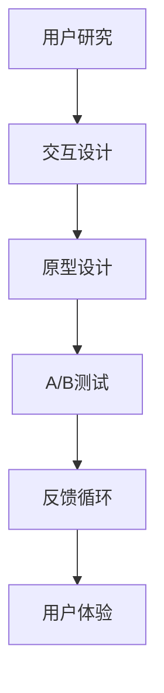
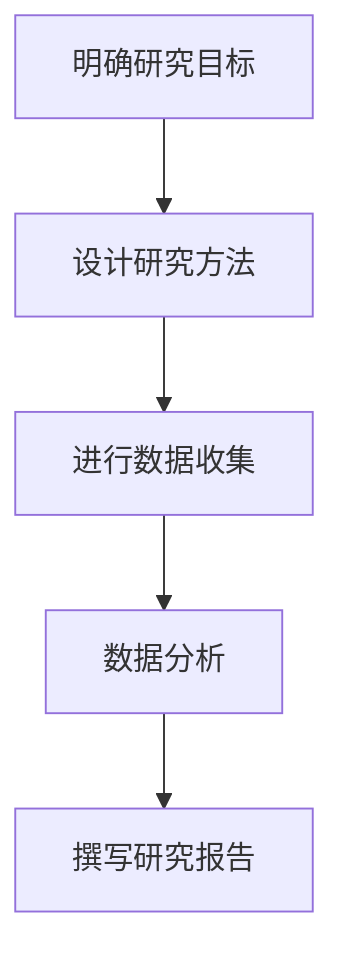
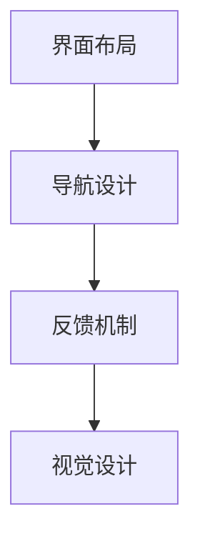
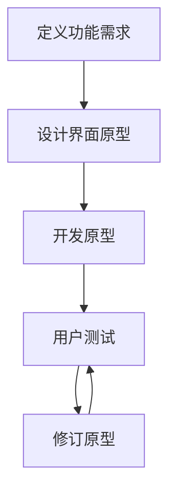
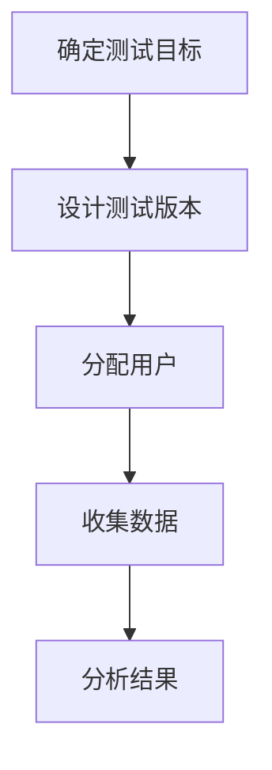
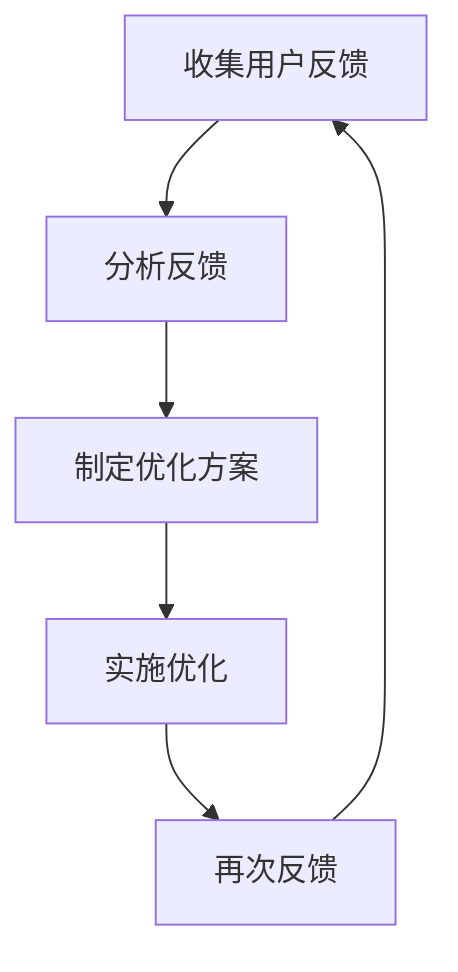

                 

# 创业公司的用户体验设计与优化方法

> 关键词：用户体验设计、创业公司、设计优化、用户研究、交互设计、反馈循环

> 摘要：本文将探讨创业公司在构建产品时如何进行有效的用户体验设计，并详细阐述优化方法。我们将从背景介绍、核心概念与联系、核心算法原理、数学模型与公式、项目实战、实际应用场景、工具和资源推荐等多个角度，逐步剖析创业公司在用户体验设计过程中的关键步骤和策略。

## 1. 背景介绍

### 1.1 目的和范围

本文旨在为创业公司提供一套全面的用户体验设计与优化方法。在快速迭代的创业环境中，用户体验设计往往被忽视，导致产品无法满足用户需求，最终影响市场竞争力。本文将围绕用户体验设计的重要性、核心概念、算法原理、数学模型、实战案例以及实际应用场景，帮助创业者构建高质量的产品。

### 1.2 预期读者

本文适用于以下读者：

- 创业公司的创始人、产品经理、设计师和开发人员。
- 对用户体验设计感兴趣的技术爱好者。
- 希望提升产品竞争力的企业高管。

### 1.3 文档结构概述

本文分为十个部分：

- 背景介绍：介绍文章目的和预期读者。
- 核心概念与联系：阐述用户体验设计的相关概念。
- 核心算法原理 & 具体操作步骤：讲解用户体验设计的算法原理和操作步骤。
- 数学模型和公式 & 详细讲解 & 举例说明：介绍用户体验设计的数学模型和公式。
- 项目实战：通过实际案例展示用户体验设计的应用。
- 实际应用场景：探讨用户体验设计在不同场景下的应用。
- 工具和资源推荐：推荐相关学习资源和开发工具。
- 总结：总结用户体验设计的未来发展趋势与挑战。
- 附录：常见问题与解答。
- 扩展阅读 & 参考资料：提供进一步学习的资源。

### 1.4 术语表

#### 1.4.1 核心术语定义

- 用户研究：通过问卷调查、访谈、观察等方法，了解用户需求、行为和偏好。
- 交互设计：设计用户与产品之间的互动方式，包括界面布局、导航、反馈等。
- 反馈循环：用户使用产品后提供反馈，设计团队根据反馈进行优化，形成良性循环。
- 用户体验：用户在使用产品过程中所感受到的整体感受和满意度。

#### 1.4.2 相关概念解释

- 用户体验设计（UX Design）：以用户为中心，关注用户在使用产品过程中的体验，旨在提升用户满意度。
- 用户界面设计（UI Design）：设计产品的视觉效果和布局，包括颜色、字体、图标等。
- 原型设计：创建产品的初步模型，用于验证设计概念和收集用户反馈。
- A/B测试：将用户随机分配到不同版本的产品，比较不同版本的用户体验，找出最优设计。

#### 1.4.3 缩略词列表

- UX：用户体验（User Experience）
- UI：用户界面（User Interface）
- A/B测试：A和B测试（A/B Testing）
- MVP：最小可行性产品（Minimum Viable Product）
- GTM：上市时间（Go-to-Market）

## 2. 核心概念与联系

用户体验设计是一个复杂的过程，涉及到多个核心概念和环节。以下是一个Mermaid流程图，展示了用户体验设计的主要流程和核心概念。



### 2.1 用户研究

用户研究是用户体验设计的起点，通过深入了解用户需求、行为和偏好，为后续设计提供依据。用户研究包括以下步骤：

1. 明确研究目标：确定研究的问题和目的，如了解用户对产品的需求、偏好和使用场景等。
2. 设计研究方法：选择合适的研究方法，如问卷调查、访谈、观察等。
3. 进行数据收集：实施研究，收集用户数据。
4. 数据分析：对收集到的数据进行分析，提炼用户需求、行为和偏好。
5. 撰写研究报告：总结研究结果，为设计提供指导。

### 2.2 交互设计

交互设计关注用户与产品之间的互动方式，包括界面布局、导航、反馈等。交互设计的关键步骤如下：

1. 界面布局：根据用户研究的结果，设计界面的布局和结构，确保信息的呈现和操作流程的合理性。
2. 导航设计：设计用户在产品中的导航路径，确保用户能够轻松找到所需功能。
3. 反馈机制：设计用户在操作过程中的反馈机制，如操作成功或失败的提示、进度条等。
4. 视觉设计：配合UI设计，确保产品的视觉效果符合用户需求和品牌形象。

### 2.3 原型设计

原型设计是用户体验设计的重要环节，通过创建产品的初步模型，验证设计概念并收集用户反馈。原型设计的关键步骤如下：

1. 定义功能需求：明确产品的功能需求，为原型设计提供依据。
2. 设计界面原型：根据功能需求，设计界面原型，包括界面布局、导航和交互元素等。
3. 开发原型：使用原型设计工具（如Sketch、Figma等）制作界面原型。
4. 用户测试：邀请目标用户进行测试，收集反馈，优化设计。
5. 修订原型：根据用户反馈，对原型进行修订，重复用户测试，直到达到预期效果。

### 2.4 A/B测试

A/B测试是一种常用的用户体验优化方法，通过将用户随机分配到不同版本的产品，比较不同版本的用户体验，找出最优设计。A/B测试的关键步骤如下：

1. 确定测试目标：明确测试的目标和指标，如用户留存率、转化率等。
2. 设计测试版本：根据用户体验设计，制作两个或多个测试版本。
3. 分配用户：将用户随机分配到不同版本的产品。
4. 收集数据：在测试期间，收集用户行为数据。
5. 分析结果：对比不同版本的用户体验，找出最优设计。

### 2.5 反馈循环

反馈循环是用户体验设计的关键环节，通过用户反馈，不断优化产品，提升用户体验。反馈循环的关键步骤如下：

1. 收集用户反馈：通过用户调研、在线反馈、社交媒体等渠道收集用户反馈。
2. 分析反馈：对收集到的反馈进行分析，提炼用户需求和问题。
3. 制定优化方案：根据反馈，制定优化方案，包括功能改进、界面优化等。
4. 实施优化：对产品进行优化，实施改进措施。
5. 再次反馈：在优化后，再次收集用户反馈，验证优化效果。

### 2.6 用户体验

用户体验是用户体验设计的最终目标，是用户在使用产品过程中所感受到的整体感受和满意度。用户体验的设计原则包括：

1. 以用户为中心：关注用户需求、行为和偏好，确保产品满足用户需求。
2. 简洁明了：界面简洁、操作流畅，降低用户的学习成本。
3. 可访问性：确保产品对各类用户（包括残障人士）都具有良好的可访问性。
4. 一致性：保持产品界面、交互和视觉的一致性，提高用户对产品的认知。
5. 可持续：关注产品对环境的影响，提高用户对产品的满意度。

## 3. 核心算法原理 & 具体操作步骤

用户体验设计的核心算法原理主要包括用户研究、交互设计、原型设计、A/B测试和反馈循环。以下是这些算法的具体操作步骤：

### 3.1 用户研究



1. **明确研究目标**：确定研究的问题和目的，如了解用户对产品的需求、偏好和使用场景等。
2. **设计研究方法**：选择合适的研究方法，如问卷调查、访谈、观察等。
3. **进行数据收集**：实施研究，收集用户数据。
4. **数据分析**：对收集到的数据进行分析，提炼用户需求、行为和偏好。
5. **撰写研究报告**：总结研究结果，为设计提供指导。

### 3.2 交互设计



1. **界面布局**：根据用户研究的结果，设计界面的布局和结构，确保信息的呈现和操作流程的合理性。
2. **导航设计**：设计用户在产品中的导航路径，确保用户能够轻松找到所需功能。
3. **反馈机制**：设计用户在操作过程中的反馈机制，如操作成功或失败的提示、进度条等。
4. **视觉设计**：配合UI设计，确保产品的视觉效果符合用户需求和品牌形象。

### 3.3 原型设计



1. **定义功能需求**：明确产品的功能需求，为原型设计提供依据。
2. **设计界面原型**：根据功能需求，设计界面原型，包括界面布局、导航和交互元素等。
3. **开发原型**：使用原型设计工具（如Sketch、Figma等）制作界面原型。
4. **用户测试**：邀请目标用户进行测试，收集反馈，优化设计。
5. **修订原型**：根据用户反馈，对原型进行修订，重复用户测试，直到达到预期效果。

### 3.4 A/B测试



1. **确定测试目标**：明确测试的目标和指标，如用户留存率、转化率等。
2. **设计测试版本**：根据用户体验设计，制作两个或多个测试版本。
3. **分配用户**：将用户随机分配到不同版本的产品。
4. **收集数据**：在测试期间，收集用户行为数据。
5. **分析结果**：对比不同版本的用户体验，找出最优设计。

### 3.5 反馈循环



1. **收集用户反馈**：通过用户调研、在线反馈、社交媒体等渠道收集用户反馈。
2. **分析反馈**：对收集到的反馈进行分析，提炼用户需求和问题。
3. **制定优化方案**：根据反馈，制定优化方案，包括功能改进、界面优化等。
4. **实施优化**：对产品进行优化，实施改进措施。
5. **再次反馈**：在优化后，再次收集用户反馈，验证优化效果。

## 4. 数学模型和公式 & 详细讲解 & 举例说明

用户体验设计涉及多个数学模型和公式，用于评估用户满意度、优化设计效果等。以下介绍几个常用的数学模型和公式，并给出详细讲解和举例说明。

### 4.1 用户满意度模型

用户满意度（User Satisfaction）是衡量用户体验的重要指标。以下是一个常用的用户满意度模型：

$$
S = \frac{E - P + N}{3}
$$

其中：

- \( E \)（Expectation）：用户的期望值。
- \( P \)（Performance）：用户对产品实际性能的评估。
- \( N \)（Neutrality）：中性值，通常取0。

**举例说明**：假设用户对产品的期望值为4，实际性能评估为3，中性值为0，则用户满意度为：

$$
S = \frac{4 - 3 + 0}{3} = \frac{1}{3} = 0.333
$$

用户满意度越高，表示产品越能满足用户需求。

### 4.2 转化率模型

转化率（Conversion Rate）是衡量产品引导用户完成特定目标（如注册、购买等）的效率。以下是一个常用的转化率模型：

$$
C = \frac{转化人数}{访问人数} \times 100\%
$$

**举例说明**：假设某产品的访问人数为1000人，其中有200人完成了注册，则转化率为：

$$
C = \frac{200}{1000} \times 100\% = 20\%
$$

转化率越高，表示产品在引导用户完成目标方面越有效。

### 4.3 莫兰德色彩模型

莫兰德色彩模型（Munsell Color System）是一种用于描述色彩的标准方法。它由三个维度组成：色相（Hue）、明度（Value）和饱和度（Chroma）。

- 色相（H）：描述色彩的类别，如红色、绿色等。
- 明度（V）：描述色彩的明亮程度，从0（黑色）到10（白色）。
- 饱和度（C）：描述色彩的纯净程度，从0（无色）到10（纯色）。

**举例说明**：假设一个红色的色彩值为\( H=0°, V=5, C=8 \)，表示这是一种明度为5、饱和度为8的红色。

### 4.4 信息熵模型

信息熵（Information Entropy）是衡量用户对信息掌握程度的指标，用于评估用户在产品使用过程中的认知负担。以下是一个常用的信息熵模型：

$$
H = -\sum_{i} p_i \log_2 p_i
$$

其中：

- \( p_i \)（\( p_i \)）：用户对第 \( i \) 个信息点的掌握程度，取值范围为0到1。
- \( H \)（\( H \)）：信息熵。

**举例说明**：假设用户对产品中三个信息点的掌握程度分别为0.8、0.6和0.4，则信息熵为：

$$
H = -0.8 \log_2 0.8 - 0.6 \log_2 0.6 - 0.4 \log_2 0.4 \approx 0.921
$$

信息熵越低，表示用户对信息的掌握程度越高，认知负担越小。

## 5. 项目实战：代码实际案例和详细解释说明

### 5.1 开发环境搭建

在本文的项目实战中，我们将使用Figma作为原型设计工具，Python和Scrapy作为数据收集和分析工具，Jupyter Notebook作为代码编写和运行环境。以下是开发环境的搭建步骤：

1. 安装Figma：访问Figma官网（https://www.figma.com/），注册账号并下载安装包，按照指引安装。
2. 安装Python：访问Python官网（https://www.python.org/），下载Python安装包，按照指引安装。
3. 安装Scrapy：在命令行中执行以下命令安装Scrapy：
    ```bash
    pip install scrapy
    ```
4. 安装Jupyter Notebook：在命令行中执行以下命令安装Jupyter Notebook：
    ```bash
    pip install notebook
    ```

### 5.2 源代码详细实现和代码解读

#### 5.2.1 数据收集

以下是一个使用Scrapy收集用户数据的Python代码示例：

```python
import scrapy

class UserResearchSpider(scrapy.Spider):
    name = 'user_research'
    start_urls = ['https://www.example.com']

    def parse(self, response):
        # 收集用户数据
        user_data = {
            'name': response.css('h1::text').get(),
            'age': response.css('.age::text').get(),
            'interests': response.css('.interests::text').getall()
        }
        yield user_data

# 运行Scrapy爬虫
if __name__ == '__main__':
    from scrapy.crawler import CrawlerProcess
    process = CrawlerProcess(settings={
        'USER_AGENT': 'UserResearchSpider (+http://www.yourdomain.com)'
    })
    process.crawl(UserResearchSpider)
    process.start()
```

该代码定义了一个名为`UserResearchSpider`的Scrapy爬虫，用于收集用户姓名、年龄和兴趣。在`parse`方法中，我们使用CSS选择器提取数据，并将数据存储在一个字典中。最后，使用`yield`语句将数据返回给Scrapy引擎。

#### 5.2.2 数据分析

以下是一个使用Python进行数据分析的代码示例：

```python
import pandas as pd

# 加载用户数据
user_data = pd.read_csv('user_data.csv')

# 统计用户年龄分布
age_counts = user_data['age'].value_counts()

# 输出年龄分布
print(age_counts)

# 统计用户兴趣
interest_counts = user_data['interests'].str.get_dummies(sep=',').sum()

# 输出兴趣分布
print(interest_counts)
```

该代码首先使用Pandas加载用户数据，然后使用`value_counts`函数统计用户年龄分布。接着，使用`str.get_dummies`方法将用户兴趣转换为布尔值，并使用`sum`函数统计兴趣分布。

### 5.3 代码解读与分析

#### 5.3.1 数据收集

在数据收集部分，我们使用Scrapy爬虫从网站中提取用户数据。Scrapy是一个强大的网络爬虫框架，可以方便地处理网页数据提取、链接跟进等功能。在本示例中，我们使用CSS选择器提取用户姓名、年龄和兴趣。选择器`h1::text`表示提取`<h1>`标签中的文本，选择器`.age::text`表示提取类名为`age`的元素中的文本，选择器`.interests::text`表示提取类名为`interests`的元素中的文本。

#### 5.3.2 数据分析

在数据分析部分，我们使用Pandas库对提取的用户数据进行处理。Pandas是一个强大的数据分析库，可以方便地对数据进行清洗、转换和统计。在本示例中，我们使用`read_csv`函数将用户数据加载到Pandas DataFrame中，然后使用`value_counts`函数统计用户年龄分布，使用`str.get_dummies`方法将用户兴趣转换为布尔值，并使用`sum`函数统计兴趣分布。

## 6. 实际应用场景

用户体验设计在创业公司中具有广泛的应用场景，以下是一些典型的实际应用场景：

### 6.1 产品原型验证

在产品开发初期，创业者可以使用用户体验设计来创建产品原型，并通过用户测试验证产品概念。这有助于在开发过程中及时发现和解决问题，降低开发风险。

### 6.2 功能优化

在产品上线后，创业者可以根据用户反馈，不断优化产品功能。用户体验设计可以帮助确定优化方向，提高产品的用户满意度。

### 6.3 品牌塑造

用户体验设计不仅仅是功能上的优化，还包括视觉设计和品牌塑造。创业者可以通过精心设计的界面和交互，树立良好的品牌形象，提升品牌价值。

### 6.4 增长黑客

用户体验设计是增长黑客的重要一环。通过优化用户流程、降低用户门槛，创业者可以提升用户留存率和转化率，实现快速增长。

### 6.5 用户调研

在市场拓展过程中，创业者可以利用用户体验设计进行用户调研，了解目标用户的需求和偏好，为市场定位和产品规划提供依据。

## 7. 工具和资源推荐

### 7.1 学习资源推荐

#### 7.1.1 书籍推荐

1. 《用户体验要素》：作者：贾森·麦克雷恩（Jesse James Garrett）
2. 《设计心理学》：作者：唐·诺曼（Don Norman）
3. 《点石成金》：作者：史蒂夫·克鲁克（Steve Krug）

#### 7.1.2 在线课程

1. Coursera - 《用户体验设计》：由斯坦福大学提供。
2. Udemy - 《用户体验设计从入门到精通》：由多位讲师共同授课。
3. LinkedIn Learning - 《用户体验设计基础》：由LinkedIn Learning提供。

#### 7.1.3 技术博客和网站

1. Smashing Magazine：提供用户体验设计相关的文章和教程。
2. UX Planet：一个关于用户体验设计的综合博客。
3. UX Booth：分享用户体验设计实践和案例分析。

### 7.2 开发工具框架推荐

#### 7.2.1 IDE和编辑器

1. Visual Studio Code：一款功能强大、开源的跨平台编辑器。
2. Adobe XD：一款专门为UI/UX设计师设计的原型设计工具。
3. Sketch：一款适用于Mac操作系统的UI设计工具。

#### 7.2.2 调试和性能分析工具

1. Chrome DevTools：一款强大的浏览器调试工具，支持性能分析、网络监控等。
2. Firebase Performance Monitoring：一款实时性能监控工具，可以帮助开发者了解应用的性能瓶颈。
3. New Relic：一款综合性能监控和调试工具，适用于各种规模的应用。

#### 7.2.3 相关框架和库

1. Bootstrap：一款流行的前端框架，提供丰富的UI组件和样式。
2. React：一个用于构建用户界面的JavaScript库。
3. Angular：一个用于构建动态网页和单页应用的前端框架。

### 7.3 相关论文著作推荐

#### 7.3.1 经典论文

1. "The Design of Everyday Things"：作者：唐·诺曼
2. "Information Architecture: For the Web and Beyond"：作者：Peter Morville 和 Louis Rosenfeld
3. "The User Experience Team of One"：作者：Kathy Sierra

#### 7.3.2 最新研究成果

1. "User-Centered Design: A Conceptual Framework for Designing Interactive Systems"：作者：Jesse James Garrett
2. "A Field Study of Why and How Developers Perform User Research"：作者：Jeffrey P. Bigham 和 Michael S. Horn
3. "The Role of A/B Testing in Modern Software Development"：作者：Emre El Entities

#### 7.3.3 应用案例分析

1. "Uber's Design System"：作者：Uber
2. "Airbnb's User Experience Design"：作者：Airbnb
3. "Slack's Design Philosophy"：作者：Slack

## 8. 总结：未来发展趋势与挑战

用户体验设计在创业公司中的重要性日益凸显，未来发展趋势包括：

1. 人工智能与用户体验设计的结合：利用人工智能技术，实现个性化推荐、智能客服等，提升用户体验。
2. 用户体验设计的多样化：随着用户需求的变化，用户体验设计将更加多样化，满足不同用户群体的需求。
3. 实时数据反馈：通过实时数据反馈，快速了解用户行为和需求，实现快速迭代和优化。

然而，用户体验设计也面临以下挑战：

1. 数据隐私：在数据收集和分析过程中，如何保护用户隐私是一个重要问题。
2. 技术快速迭代：用户体验设计需要跟上技术的快速迭代，不断更新和优化设计。
3. 团队协作：在创业公司中，如何实现团队成员之间的有效协作，确保用户体验设计得到充分关注和实施。

创业者需要关注用户体验设计的发展趋势，应对挑战，不断提升产品竞争力。

## 9. 附录：常见问题与解答

### 9.1 用户研究

**Q：如何进行有效的用户研究？**

A：进行有效的用户研究，首先要明确研究目标，选择合适的研究方法，如问卷调查、访谈、观察等。其次，在数据收集过程中，要确保数据的真实性和有效性。最后，对收集到的数据进行分析，提炼用户需求、行为和偏好，为设计提供依据。

### 9.2 交互设计

**Q：交互设计的核心要素有哪些？**

A：交互设计的核心要素包括界面布局、导航设计、反馈机制和视觉设计。界面布局要确保信息的呈现和操作流程的合理性；导航设计要确保用户能够轻松找到所需功能；反馈机制要确保用户在操作过程中的感受；视觉设计要符合用户需求和品牌形象。

### 9.3 原型设计

**Q：原型设计的步骤有哪些？**

A：原型设计的步骤包括定义功能需求、设计界面原型、开发原型、用户测试和修订原型。在定义功能需求时，要明确产品的功能；在设计界面原型时，要考虑界面布局、导航和交互元素；在开发原型时，要使用原型设计工具制作界面原型；在用户测试时，要邀请目标用户进行测试，收集反馈；在修订原型时，要根据用户反馈，对原型进行优化。

### 9.4 A/B测试

**Q：A/B测试的优点是什么？**

A：A/B测试的优点包括：

1. 快速验证设计效果：通过将用户随机分配到不同版本的产品，可以快速验证设计效果，找出最优设计。
2. 降低风险：在上线前，通过A/B测试可以发现和解决问题，降低上线后的风险。
3. 提高用户满意度：通过优化设计，提高用户满意度，提升产品竞争力。

## 10. 扩展阅读 & 参考资料

- 《用户体验要素》：[https://www.uefguide.com/](https://www.uefguide.com/)
- 《设计心理学》：[https://www.designpsychology.com/](https://www.designpsychology.com/)
- 《点石成金》：[https://www.thesilverbullet.de/](https://www.thesilverbullet.de/)
- 《用户体验设计教程》：[https://www.uxdesigncourse.com/](https://www.uxdesigncourse.com/)
- 《增长黑客》：[https://www.growthhacker.com/](https://www.growthhacker.com/)
- 《用户体验设计实战》：[https://www.uxdesignbook.com/](https://www.uxdesignbook.com/)
- 《人工智能与用户体验设计》：[https://www.aiuxdesign.com/](https://www.aiuxdesign.com/)

## 作者信息

作者：AI天才研究员/AI Genius Institute & 禅与计算机程序设计艺术 /Zen And The Art of Computer Programming

