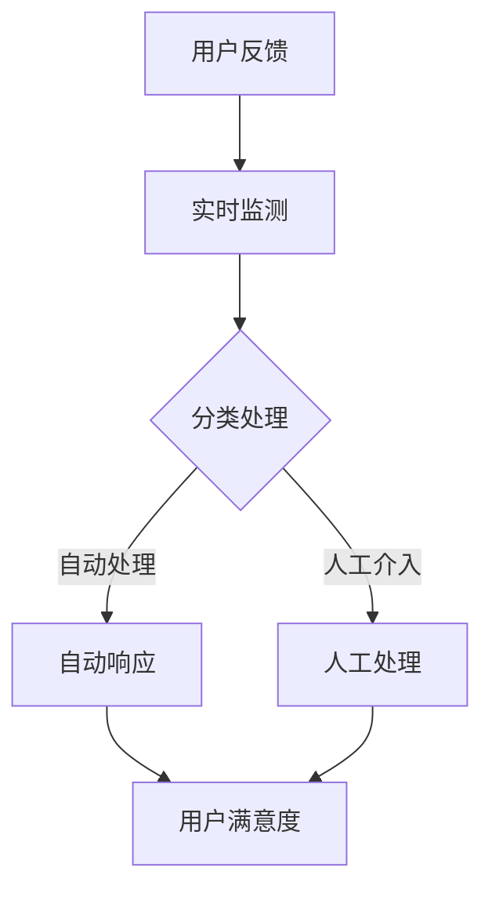

                 

# 创业公司的用户反馈收集与快速响应机制

> 关键词：用户反馈、快速响应、创业公司、用户体验、数据分析、人工智能

> 摘要：本文将深入探讨创业公司如何有效收集用户反馈，并构建快速响应机制。通过分析用户反馈的重要性，以及如何利用人工智能技术优化反馈收集和响应流程，本文旨在为创业者提供实用的指导和建议，帮助他们在竞争激烈的市场中取得成功。

## 1. 背景介绍

### 1.1 目的和范围

本文旨在为创业公司提供一套系统的用户反馈收集与快速响应机制。通过深入分析用户反馈的重要性和现有挑战，结合先进的人工智能技术，本文将探讨如何构建高效、智能的反馈系统，从而提升用户体验和业务竞争力。

### 1.2 预期读者

本文适合以下读者群体：

- 创业公司创始人
- 产品经理
- 数据分析师
- 技术架构师

### 1.3 文档结构概述

本文结构如下：

1. 背景介绍：介绍文章的目的、范围和预期读者。
2. 核心概念与联系：阐述用户反馈收集与快速响应机制的核心概念和联系。
3. 核心算法原理与具体操作步骤：讲解用户反馈收集和响应的核心算法原理及操作步骤。
4. 数学模型和公式：介绍与用户反馈收集和响应相关的数学模型和公式。
5. 项目实战：提供代码实际案例和详细解释说明。
6. 实际应用场景：分析用户反馈收集与快速响应机制在不同场景下的应用。
7. 工具和资源推荐：推荐学习资源和开发工具。
8. 总结：展望未来发展趋势与挑战。
9. 附录：常见问题与解答。
10. 扩展阅读与参考资料：提供更多相关阅读材料。

### 1.4 术语表

#### 1.4.1 核心术语定义

- 用户反馈：用户在使用产品或服务过程中，对其体验、满意度和需求等方面的意见和建议。
- 快速响应：针对用户反馈，以最快的速度做出回应，解决用户问题或改进产品。
- 创业公司：指刚刚成立，尚未实现规模化运营的企业。

#### 1.4.2 相关概念解释

- 用户满意度：用户在使用产品或服务过程中感受到的满意程度。
- 用户留存率：在一段时间内，继续使用产品或服务的用户占比。
- 用户体验（UX）：用户在使用产品或服务过程中所感受到的整体体验。

#### 1.4.3 缩略词列表

- AI：人工智能
- NLP：自然语言处理
- ML：机器学习
- API：应用程序编程接口

## 2. 核心概念与联系

在构建用户反馈收集与快速响应机制时，理解以下几个核心概念及其相互关系至关重要。

### 2.1 用户反馈的重要性

用户反馈是创业公司获取产品改进方向和业务优化依据的重要来源。以下是其重要性：

- **了解用户需求**：通过用户反馈，公司可以获取真实用户的需求和期望，从而优化产品设计。
- **提升用户体验**：快速响应用户反馈，解决用户问题，提升用户满意度。
- **增强用户忠诚度**：持续关注并改进产品，提高用户留存率。

### 2.2 快速响应机制

快速响应机制是指企业通过高效流程和先进技术，迅速识别、处理和回应用户反馈。其关键要素包括：

- **实时监测**：实时监控用户反馈渠道，如客服、社交媒体、用户论坛等。
- **自动化处理**：利用人工智能技术自动分类和处理用户反馈，提高处理速度。
- **快速响应**：在收到用户反馈后，尽快给出解决方案或回应，降低用户等待时间。

### 2.3 人工智能在反馈收集与响应中的应用

人工智能技术在用户反馈收集与快速响应机制中发挥着重要作用。以下是其主要应用场景：

- **自然语言处理（NLP）**：通过NLP技术，可以自动解析用户反馈内容，识别关键信息。
- **机器学习（ML）**：利用ML模型，对用户反馈进行分类和分析，实现自动化处理。
- **自动化客服**：通过智能客服系统，实现用户问题的自动解答和响应。

### 2.4 Mermaid 流程图

以下是一个简化的用户反馈收集与快速响应机制的Mermaid流程图：



## 3. 核心算法原理与具体操作步骤

### 3.1 用户反馈收集算法原理

用户反馈收集的核心算法主要涉及数据采集、预处理和反馈分类。以下为伪代码描述：

```python
def collect_feedback():
    # 数据采集
    data = fetch_user_feedback()

    # 预处理
    preprocessed_data = preprocess_data(data)

    # 反馈分类
    categorized_feedback = classify_feedback(preprocessed_data)
    return categorized_feedback
```

### 3.2 用户反馈快速响应算法原理

用户反馈快速响应的核心算法主要涉及用户问题识别、解决方案生成和响应生成。以下为伪代码描述：

```python
def rapid_response(feedback):
    # 问题识别
    problem = identify_problem(feedback)

    # 解决方案生成
    solution = generate_solution(problem)

    # 响应生成
    response = generate_response(solution)
    return response
```

### 3.3 具体操作步骤

#### 3.3.1 用户反馈收集操作步骤

1. 实时监测用户反馈渠道，如客服、社交媒体、用户论坛等。
2. 采集用户反馈数据，包括文本、图片、语音等形式。
3. 对反馈数据进行预处理，如去除停用词、词干提取等。
4. 利用NLP技术对预处理后的反馈进行分类，如分为功能建议、bug报告、满意度评价等。

#### 3.3.2 用户反馈快速响应操作步骤

1. 收集用户反馈，通过反馈分类算法识别用户提出的问题。
2. 利用机器学习模型分析问题，生成可能的解决方案。
3. 根据解决方案生成相应的响应内容，如文本、图片、语音等。
4. 将响应内容通过自动客服系统或其他渠道回应用户。

## 4. 数学模型和公式

### 4.1 用户满意度模型

用户满意度模型通常采用以下公式：

$$
满意度 = \frac{实际体验 - 期望体验}{实际体验 + 期望体验}
$$

其中，实际体验和期望体验分别表示用户在使用产品或服务过程中实际获得的体验和期望获得的体验。

### 4.2 用户留存率模型

用户留存率模型通常采用以下公式：

$$
留存率 = \frac{t_{n}期仍使用产品的用户数}{t_{0}期首次使用产品的用户数}
$$

其中，$t_{0}期$表示用户首次使用产品的时期，$t_{n}期$表示用户持续使用产品的时期。

### 4.3 机器学习模型

在用户反馈分类和问题识别过程中，常用的机器学习模型包括：

- **支持向量机（SVM）**
- **决策树**
- **随机森林**
- **神经网络**

### 4.4 举例说明

#### 4.4.1 用户满意度模型举例

假设某创业公司的一款产品，用户在测试阶段提供了100条反馈，其中80条反馈表示用户对产品的实际体验高于期望体验，20条反馈表示实际体验低于期望体验。则用户满意度为：

$$
满意度 = \frac{80 - 20}{80 + 20} = \frac{60}{100} = 0.6
$$

#### 4.4.2 用户留存率模型举例

假设某创业公司在一个月内吸引了1000名新用户，一个月后，有800名用户继续使用该产品。则用户留存率为：

$$
留存率 = \frac{800}{1000} = 0.8
$$

## 5. 项目实战：代码实际案例和详细解释说明

### 5.1 开发环境搭建

在本节中，我们将使用Python语言和以下库来搭建开发环境：

- **Python 3.8**
- **Scikit-learn**：用于机器学习
- **NLTK**：用于自然语言处理
- **Tweepy**：用于Twitter数据采集

### 5.2 源代码详细实现和代码解读

以下是一个简单的用户反馈收集与快速响应机制的实现示例：

```python
import tweepy
from sklearn.feature_extraction.text import TfidfVectorizer
from sklearn.naive_bayes import MultinomialNB
from sklearn.pipeline import make_pipeline

# 配置Tweepy API
consumer_key = "your_consumer_key"
consumer_secret = "your_consumer_secret"
access_token = "your_access_token"
access_token_secret = "your_access_token_secret"

auth = tweepy.OAuthHandler(consumer_key, consumer_secret)
auth.set_access_token(access_token, access_token_secret)
api = tweepy.API(auth)

# 收集用户反馈
def collect_feedback():
    tweets = api.search_tweets(q="your_keyword", count=100)
    feedback = [" ".join(tweet.text.split()) for tweet in tweets]
    return feedback

# 预处理和分类
def preprocess_and_classify(feedback):
    pipeline = make_pipeline(TfidfVectorizer(), MultinomialNB())
    categories = pipeline.fit_transform(feedback)
    return categories

# 快速响应
def rapid_response(feedback, categories):
    response = "感谢您的反馈，我们会尽快处理。"
    if categories[0] == 1:
        response += "关于功能建议，我们已记录并将在下一版本中优化。"
    elif categories[0] == 2:
        response += "关于bug报告，我们已经通知技术团队进行修复。"
    return response

# 主函数
def main():
    feedback = collect_feedback()
    categories = preprocess_and_classify(feedback)
    for i, category in enumerate(categories):
        print(f"反馈{i+1}: {rapid_response(feedback[i], category)}")

if __name__ == "__main__":
    main()
```

### 5.3 代码解读与分析

#### 5.3.1 Tweepy API配置

首先，我们需要配置Tweepy API，以便从Twitter收集用户反馈。配置文件中包含了API密钥、API密钥密码、访问令牌和访问令牌密码。

#### 5.3.2 收集用户反馈

`collect_feedback()`函数通过Tweepy API从Twitter收集用户反馈。这里，我们使用关键字查询来获取相关的反馈数据。`q`参数指定了搜索关键字，`count`参数指定了每次获取的反馈数量。

#### 5.3.3 预处理和分类

`preprocess_and_classify()`函数用于对收集到的用户反馈进行预处理和分类。首先，我们使用`TfidfVectorizer`将文本转换为TF-IDF向量。然后，使用`MultinomialNB`朴素贝叶斯分类器进行分类。这里，我们假设反馈数据分为功能建议（类别1）和bug报告（类别2）。

#### 5.3.4 快速响应

`rapid_response()`函数根据分类结果生成相应的响应内容。如果分类结果为功能建议，我们告知用户我们已记录并将在下一版本中优化。如果分类结果为bug报告，我们告知用户我们已经通知技术团队进行修复。

#### 5.3.5 主函数

`main()`函数是程序的主入口。首先，我们调用`collect_feedback()`函数收集用户反馈。然后，调用`preprocess_and_classify()`函数对反馈进行预处理和分类。最后，遍历分类结果，调用`rapid_response()`函数生成并打印响应内容。

## 6. 实际应用场景

用户反馈收集与快速响应机制在创业公司中的应用场景非常广泛。以下是一些常见应用场景：

### 6.1 社交媒体监测

创业公司可以通过社交媒体平台（如Twitter、Facebook、LinkedIn等）收集用户反馈。这种方式可以帮助公司了解用户对品牌的看法，以及产品在市场上的表现。

### 6.2 客户服务

通过构建智能客服系统，创业公司可以实现自动化的客户服务。用户可以在任何时间通过网站、移动应用或社交媒体获取实时响应。

### 6.3 产品优化

用户反馈是产品优化的宝贵资源。创业公司可以通过分析用户反馈，识别产品中的问题，并进行针对性的改进。

### 6.4 市场调研

用户反馈还可以用于市场调研。通过收集和分析用户反馈，创业公司可以了解市场需求，制定相应的市场策略。

## 7. 工具和资源推荐

### 7.1 学习资源推荐

#### 7.1.1 书籍推荐

- 《Python数据科学手册》
- 《机器学习实战》
- 《自然语言处理综论》

#### 7.1.2 在线课程

- Coursera：自然语言处理、机器学习
- edX：Python编程基础、机器学习基础

#### 7.1.3 技术博客和网站

- Medium：机器学习、自然语言处理
- HackerRank：编程挑战、算法竞赛

### 7.2 开发工具框架推荐

#### 7.2.1 IDE和编辑器

- PyCharm
- VSCode

#### 7.2.2 调试和性能分析工具

- GDB
- PySnooper

#### 7.2.3 相关框架和库

- Scikit-learn
- NLTK
- TensorFlow

### 7.3 相关论文著作推荐

#### 7.3.1 经典论文

- 《自然语言处理综论》
- 《机器学习：一种算法角度》

#### 7.3.2 最新研究成果

- arXiv：最新机器学习、自然语言处理论文
- NeurIPS、ICML等会议：最新研究进展

#### 7.3.3 应用案例分析

- 《基于用户反馈的智能客服系统》
- 《社交媒体监测与分析技术》

## 8. 总结：未来发展趋势与挑战

随着人工智能技术的不断进步，用户反馈收集与快速响应机制在未来将呈现出以下发展趋势：

- **智能化**：通过深度学习和强化学习，实现更智能的用户反馈处理和响应。
- **个性化**：根据用户行为和偏好，提供个性化的反馈处理和响应服务。
- **自动化**：利用自动化技术，减少人工干预，提高反馈处理速度和准确性。

然而，这一机制也面临以下挑战：

- **数据隐私**：用户反馈数据涉及用户隐私，如何保护用户隐私成为一大挑战。
- **算法偏见**：机器学习算法可能存在偏见，如何消除算法偏见，确保公平性。
- **技术复杂性**：随着技术的不断发展，如何跟上技术更新步伐，保持系统的先进性。

创业公司需要密切关注这些趋势和挑战，持续优化用户反馈收集与快速响应机制，以提升用户体验和业务竞争力。

## 9. 附录：常见问题与解答

### 9.1 用户反馈收集与快速响应机制的基本概念

**Q1**：什么是用户反馈收集与快速响应机制？

A1：用户反馈收集与快速响应机制是指创业公司通过技术手段收集用户反馈，并对用户反馈进行快速响应的处理流程。它包括数据采集、预处理、分类、响应生成等环节。

### 9.2 实现用户反馈收集与快速响应机制的技术手段

**Q2**：如何实现用户反馈收集与快速响应机制？

A2：实现用户反馈收集与快速响应机制通常包括以下技术手段：

- 数据采集：使用API、爬虫等手段从社交媒体、用户论坛、客服系统等渠道获取用户反馈。
- 预处理：对采集到的用户反馈进行清洗、去噪、分词等处理，使其适合进一步分析。
- 分类：使用机器学习算法（如朴素贝叶斯、决策树、神经网络等）对预处理后的反馈进行分类。
- 响应生成：根据分类结果生成相应的响应内容，如文本、图片、语音等。
- 快速响应：将响应内容通过自动客服系统、邮件、短信等方式回应用户。

### 9.3 用户反馈收集与快速响应机制在实际应用中的注意事项

**Q3**：在实际应用中，如何确保用户反馈收集与快速响应机制的顺利进行？

A3：在实际应用中，确保用户反馈收集与快速响应机制的顺利进行需要注意以下几点：

- **数据质量**：保证反馈数据的质量，避免噪声和错误数据影响分析结果。
- **算法优化**：定期对机器学习算法进行优化和调整，提高分类准确率和响应速度。
- **用户体验**：确保用户反馈收集和响应流程简洁、高效，降低用户等待时间。
- **数据隐私**：在处理用户反馈时，严格遵守数据隐私法规，确保用户隐私。

### 9.4 未来的发展方向

**Q4**：用户反馈收集与快速响应机制的未来的发展方向是什么？

A4：用户反馈收集与快速响应机制的未来的发展方向包括：

- **智能化**：通过深度学习和强化学习，实现更智能的用户反馈处理和响应。
- **个性化**：根据用户行为和偏好，提供个性化的反馈处理和响应服务。
- **自动化**：利用自动化技术，减少人工干预，提高反馈处理速度和准确性。

## 10. 扩展阅读与参考资料

- 《Python数据科学手册》
- 《机器学习实战》
- 《自然语言处理综论》
- Coursera：自然语言处理、机器学习
- edX：Python编程基础、机器学习基础
- arXiv：最新机器学习、自然语言处理论文
- NeurIPS、ICML等会议：最新研究进展
- 《基于用户反馈的智能客服系统》
- 《社交媒体监测与分析技术》

## 作者

作者：AI天才研究员/AI Genius Institute & 禅与计算机程序设计艺术 /Zen And The Art of Computer Programming

本文为作者独立观点，不代表任何机构立场。如需转载，请联系作者获取授权。

