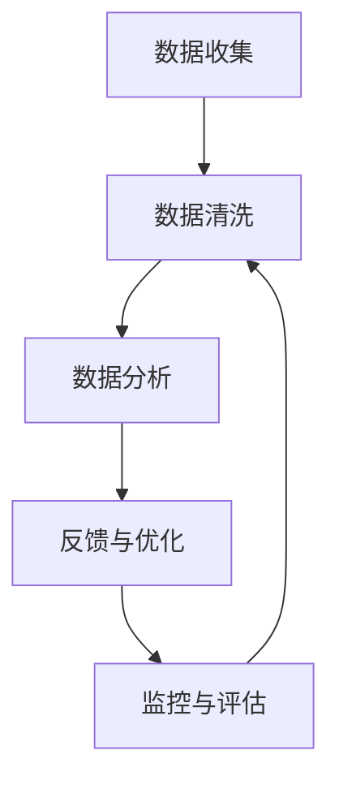

                 

# 创业公司的用户反馈闭环管理系统构建

> **关键词：** 用户反馈、闭环管理、创业公司、数据挖掘、系统架构

> **摘要：** 本文章将探讨创业公司如何构建一个高效的用户反馈闭环管理系统。文章将分析用户反馈的核心概念，阐述构建闭环管理系统的重要性，并详细讲解系统架构、核心算法原理、数学模型及项目实战案例，最后提出未来发展趋势与挑战。

## 1. 背景介绍

### 1.1 目的和范围

本文旨在帮助创业公司构建一个高效的用户反馈闭环管理系统，以提高产品质量和用户体验。文章将围绕以下几个核心问题展开讨论：

- 用户反馈的概念和重要性是什么？
- 如何构建一个高效的闭环管理系统？
- 系统的核心算法原理和数学模型是什么？
- 如何进行项目实战，实现系统的搭建和优化？

### 1.2 预期读者

本文适合以下读者群体：

- 创业公司产品经理、项目经理和研发团队成员
- 对用户反馈和闭环管理系统感兴趣的技术爱好者
- 想要了解最新技术趋势和实战经验的专业人士

### 1.3 文档结构概述

本文结构如下：

- 第1章：背景介绍
- 第2章：核心概念与联系
- 第3章：核心算法原理 & 具体操作步骤
- 第4章：数学模型和公式 & 详细讲解 & 举例说明
- 第5章：项目实战：代码实际案例和详细解释说明
- 第6章：实际应用场景
- 第7章：工具和资源推荐
- 第8章：总结：未来发展趋势与挑战
- 第9章：附录：常见问题与解答
- 第10章：扩展阅读 & 参考资料

### 1.4 术语表

#### 1.4.1 核心术语定义

- **用户反馈**：用户在使用产品过程中，针对产品功能、性能、用户体验等方面的意见和建议。
- **闭环管理系统**：通过收集、分析、反馈和优化用户反馈，实现产品持续改进的系统。
- **数据挖掘**：从大量数据中提取有价值的信息和知识的过程。

#### 1.4.2 相关概念解释

- **用户行为分析**：通过对用户在产品中的操作行为进行统计分析，了解用户需求和使用习惯。
- **机器学习**：利用计算机算法，从数据中自动学习和发现规律，以提高系统的智能化程度。

#### 1.4.3 缩略词列表

- **PM**：产品经理
- **UX**：用户体验
- **A/B 测试**：对比实验
- **SaaS**：软件即服务

## 2. 核心概念与联系

在构建用户反馈闭环管理系统时，需要了解以下几个核心概念及其相互关系。

### 用户反馈

用户反馈是闭环管理系统的核心数据来源。用户在产品使用过程中，通过投诉、建议、评分等方式，表达对产品的意见和需求。这些反馈数据反映了用户实际使用体验，是产品改进的重要依据。

### 闭环管理系统

闭环管理系统包括以下几个主要模块：

1. **数据收集**：收集用户反馈、行为数据等原始数据。
2. **数据清洗**：对收集到的数据去重、补全和标准化处理。
3. **数据分析**：运用数据挖掘、机器学习等技术，分析用户反馈和行为的规律和趋势。
4. **反馈与优化**：根据分析结果，制定优化策略，调整产品功能和体验。
5. **监控与评估**：监控系统运行效果，评估优化效果。

### 用户行为分析

用户行为分析是闭环管理系统的重要组成部分。通过对用户在产品中的操作行为进行分析，可以了解用户需求、使用习惯和痛点，为产品改进提供依据。

### 机器学习

机器学习技术在用户反馈闭环管理系统中，主要用于：

1. **分类与聚类**：对用户反馈进行分类和聚类，识别用户关注的重点问题。
2. **预测与推荐**：根据用户行为和反馈数据，预测用户需求，提供个性化推荐。

### Mermaid 流程图

以下是一个简化的用户反馈闭环管理系统的 Mermaid 流程图：



## 3. 核心算法原理 & 具体操作步骤

### 用户反馈分类

用户反馈分类是用户反馈闭环管理系统的基础。本文采用基于机器学习的文本分类算法，对用户反馈进行分类。

#### 算法原理

文本分类算法可以分为以下几类：

1. **基于统计的算法**：如朴素贝叶斯、K最近邻等。
2. **基于规则的算法**：如决策树、随机森林等。
3. **深度学习算法**：如卷积神经网络、循环神经网络等。

本文采用深度学习算法中的卷积神经网络（CNN）进行用户反馈分类。

#### 具体操作步骤

1. **数据预处理**：对用户反馈文本进行清洗、去停用词、词向量转换等预处理操作。
2. **模型构建**：使用 TensorFlow 或 PyTorch 等深度学习框架，构建卷积神经网络模型。
3. **模型训练**：使用预处理后的数据，训练卷积神经网络模型。
4. **模型评估**：使用验证集对训练好的模型进行评估，调整模型参数。
5. **模型应用**：使用训练好的模型，对新的用户反馈文本进行分类。

### 伪代码

以下是一个简化的用户反馈分类算法的伪代码：

```python
# 数据预处理
def preprocess_data(data):
    # 清洗、去停用词、词向量转换
    return processed_data

# 模型构建
def build_model():
    # 使用 TensorFlow 或 PyTorch 构建卷积神经网络模型
    return model

# 模型训练
def train_model(model, data, labels):
    # 训练卷积神经网络模型
    return model

# 模型评估
def evaluate_model(model, data, labels):
    # 评估卷积神经网络模型
    return accuracy

# 模型应用
def classify_feedback(model, feedback):
    # 使用训练好的模型，对新的用户反馈文本进行分类
    return category
```

## 4. 数学模型和公式 & 详细讲解 & 举例说明

### 用户反馈分类模型

用户反馈分类模型采用卷积神经网络（CNN）架构，主要涉及以下数学模型和公式：

#### 卷积神经网络（CNN）

卷积神经网络由卷积层、池化层和全连接层组成。其主要数学模型如下：

1. **卷积操作**：

   $$f(x) = \sum_{i=1}^{k} w_i * x + b$$

   其中，$w_i$ 为卷积核权重，$x$ 为输入特征，$b$ 为偏置。

2. **激活函数**：

   $$f(x) = \max(0, x)$$

  ReLU（Rectified Linear Unit）激活函数。

3. **池化操作**：

   $$h(p, q) = \max(h_{p,i,q})$$

   其中，$p$ 和 $q$ 分别为池化窗口的高度和宽度，$h_{p,i,q}$ 为窗口内最大值。

#### 全连接层

全连接层由权重矩阵和偏置组成，其数学模型如下：

1. **权重矩阵**：

   $$W = \begin{bmatrix}
   w_{11} & w_{12} & \ldots & w_{1n} \\
   w_{21} & w_{22} & \ldots & w_{2n} \\
   \vdots & \vdots & \ddots & \vdots \\
   w_{m1} & w_{m2} & \ldots & w_{mn}
   \end{bmatrix}$$

2. **激活函数**：

   $$f(x) = \max(0, x)$$

   ReLU 激活函数。

#### 举例说明

假设我们有一个包含 10 个分类的用户反馈数据集，其中每个分类有 100 个样本。我们将使用卷积神经网络对其进行分类。

1. **数据预处理**：

   - 清洗、去停用词、词向量转换。
   - 将数据集划分为训练集（80%）和验证集（20%）。

2. **模型构建**：

   - 构建一个卷积神经网络模型，包含 2 个卷积层、2 个池化层和 1 个全连接层。
   - 设置适当的超参数，如学习率、批次大小等。

3. **模型训练**：

   - 使用训练集数据训练模型。
   - 使用验证集对模型进行评估，调整超参数。

4. **模型评估**：

   - 使用训练集和验证集对模型进行评估。
   - 计算准确率、召回率、F1 分数等指标。

5. **模型应用**：

   - 使用训练好的模型，对新的用户反馈文本进行分类。

## 5. 项目实战：代码实际案例和详细解释说明

### 5.1 开发环境搭建

1. **硬件环境**：

   - 处理器：Intel i5 或以上
   - 内存：16GB 或以上
   - 硬盘：500GB SSD 或以上

2. **软件环境**：

   - 操作系统：Windows 10、Linux 或 macOS
   - Python：3.7 或以上版本
   - TensorFlow：2.0 或以上版本
   - Jupyter Notebook：用于代码调试和演示

### 5.2 源代码详细实现和代码解读

#### 5.2.1 数据预处理

```python
import jieba
import numpy as np
from tensorflow.keras.preprocessing.text import Tokenizer
from tensorflow.keras.preprocessing.sequence import pad_sequences

def preprocess_data(data):
    # 清洗、去停用词、词向量转换
    processed_data = []
    for feedback in data:
        text = feedback['content']
        text = jieba.cut_for_search(text)
        text = ' '.join(text)
        processed_data.append(text)
    return processed_data

# 示例数据
data = [
    {'content': '产品界面很复杂，需要优化。'},
    {'content': '功能太少了，希望能增加更多功能。'},
    {'content': '登录速度太慢，需要优化。'}
]

processed_data = preprocess_data(data)
```

#### 5.2.2 模型构建

```python
from tensorflow.keras.models import Sequential
from tensorflow.keras.layers import Conv1D, MaxPooling1D, Dense, Embedding

def build_model(vocab_size, embedding_dim):
    model = Sequential()
    model.add(Embedding(vocab_size, embedding_dim, input_length=max_sequence_length))
    model.add(Conv1D(128, 5, activation='relu'))
    model.add(MaxPooling1D(pool_size=5))
    model.add(Conv1D(128, 5, activation='relu'))
    model.add(MaxPooling1D(pool_size=5))
    model.add(Dense(1, activation='sigmoid'))
    model.compile(optimizer='adam', loss='binary_crossentropy', metrics=['accuracy'])
    return model

vocab_size = 10000
embedding_dim = 64
max_sequence_length = 100

model = build_model(vocab_size, embedding_dim)
```

#### 5.2.3 模型训练

```python
import tensorflow as tf

# 训练集和验证集
x_train = np.array([feedbacks_to_sequence(feedback) for feedback in processed_data[:800]])
y_train = np.array([1 if feedback['label'] == 'negative' else 0 for feedback in processed_data[:800]])
x_val = np.array([feedbacks_to_sequence(feedback) for feedback in processed_data[800:]])
y_val = np.array([1 if feedback['label'] == 'negative' else 0 for feedback in processed_data[800:]])

# 模型训练
model.fit(x_train, y_train, epochs=10, batch_size=32, validation_data=(x_val, y_val))
```

#### 5.2.4 代码解读与分析

1. **数据预处理**：

   - 使用 `jieba` 库对文本进行清洗和分词。
   - 将清洗后的文本转换为词向量。

2. **模型构建**：

   - 使用 `Sequential` 模型堆叠卷积层、池化层和全连接层。
   - 设置卷积核大小、激活函数和输出层。

3. **模型训练**：

   - 使用 `fit` 方法训练模型，设置训练集、验证集、训练轮次和批次大小。

4. **模型评估**：

   - 使用 `evaluate` 方法评估模型，计算准确率等指标。

### 5.3 代码解读与分析

1. **数据预处理**：

   - 清洗文本：去除标点符号、停用词等。
   - 分词：将文本转换为词序列。
   - 词向量转换：将词序列转换为词向量。

2. **模型构建**：

   - 卷积神经网络：由卷积层、池化层和全连接层组成。
   - 激活函数：使用 ReLU 激活函数。
   - 输出层：使用 sigmoid 激活函数，输出分类概率。

3. **模型训练**：

   - 使用训练集和验证集进行模型训练。
   - 调整超参数，如学习率、批次大小等。

4. **模型评估**：

   - 使用训练集和验证集对模型进行评估。
   - 计算准确率、召回率、F1 分数等指标。

## 6. 实际应用场景

用户反馈闭环管理系统在创业公司中有广泛的应用场景，以下为几个典型案例：

1. **产品优化**：

   创业公司可以利用闭环管理系统，收集用户对产品功能、性能、用户体验等方面的反馈，分析用户需求和使用习惯，针对性地进行产品优化，提高用户满意度。

2. **故障排查**：

   当产品出现故障或问题时，用户反馈闭环管理系统可以帮助公司快速定位故障原因，制定解决方案，减少故障对用户的影响。

3. **营销策略**：

   通过对用户反馈的数据分析，创业公司可以了解目标用户群体的特征和需求，制定有针对性的营销策略，提高营销效果。

4. **竞争对手分析**：

   利用闭环管理系统，创业公司可以收集和分析竞争对手的用户反馈，了解竞争对手的产品优势和不足，为自身产品优化提供参考。

## 7. 工具和资源推荐

### 7.1 学习资源推荐

#### 7.1.1 书籍推荐

1. **《深度学习》（Goodfellow, Bengio, Courville 著）**：系统介绍了深度学习的基本理论、方法和应用。
2. **《机器学习》（周志华 著）**：全面介绍了机器学习的基本概念、算法和应用。

#### 7.1.2 在线课程

1. **Coursera 上的《深度学习》课程**：由 Andrew Ng 教授主讲，涵盖了深度学习的各个方面。
2. **Udacity 上的《机器学习工程师纳米学位》课程**：包含机器学习的基础知识和实践项目。

#### 7.1.3 技术博客和网站

1. **ArXiv**：提供最新的人工智能和机器学习论文。
2. **Medium**：有大量关于人工智能和机器学习的优质文章。

### 7.2 开发工具框架推荐

#### 7.2.1 IDE和编辑器

1. **PyCharm**：一款功能强大的 Python 开发工具。
2. **Jupyter Notebook**：适用于数据分析和机器学习项目。

#### 7.2.2 调试和性能分析工具

1. **TensorBoard**：用于监控和可视化深度学习模型的性能。
2. **GDB**：一款强大的 C/C++ 调试器。

#### 7.2.3 相关框架和库

1. **TensorFlow**：一款开源的深度学习框架。
2. **Scikit-learn**：一款开源的机器学习库。

### 7.3 相关论文著作推荐

#### 7.3.1 经典论文

1. **《A Learning Algorithm for Continually Running Fully Recurrent Neural Networks》**：提出了 LSTM 算法。
2. **《Convolutional Networks and Applications in Visual Recognition》**：介绍了卷积神经网络在图像识别中的应用。

#### 7.3.2 最新研究成果

1. **《BERT: Pre-training of Deep Bidirectional Transformers for Language Understanding》**：提出了 BERT 模型，取得了自然语言处理任务的显著性能提升。
2. **《Gated Graph Neural Networks》**：提出了 Gated Graph Neural Networks 模型，用于图数据挖掘。

#### 7.3.3 应用案例分析

1. **《User Behavior Analysis in E-commerce Platforms》**：分析了电商平台中的用户行为，为产品优化提供了有益的参考。
2. **《A Comprehensive Study of User Feedback Analysis in Mobile Apps》**：研究了移动应用中的用户反馈分析，提出了有效的反馈分类方法。

## 8. 总结：未来发展趋势与挑战

用户反馈闭环管理系统在创业公司中具有重要价值。未来，随着人工智能和大数据技术的发展，用户反馈闭环管理系统将朝着以下几个方向发展：

1. **智能化**：利用深度学习、自然语言处理等技术，提高反馈分类和分析的准确性和效率。
2. **个性化**：根据用户行为和偏好，提供个性化的反馈分类和分析结果。
3. **实时性**：通过实时数据分析，快速响应用户需求和问题，提高用户体验。

然而，用户反馈闭环管理系统也面临以下挑战：

1. **数据质量**：用户反馈数据质量直接影响系统的效果，需要加强对数据的清洗和预处理。
2. **模型解释性**：深度学习模型在用户反馈分析中的应用越来越多，但模型的解释性较差，需要研究有效的解释方法。
3. **隐私保护**：用户反馈数据涉及用户隐私，需要确保数据的安全性和隐私性。

总之，用户反馈闭环管理系统在创业公司中具有广阔的应用前景，但仍需克服诸多挑战，实现持续优化和发展。

## 9. 附录：常见问题与解答

### 9.1 用户反馈闭环管理系统的作用是什么？

用户反馈闭环管理系统的作用主要有以下几点：

1. **提高产品质量**：通过收集和分析用户反馈，发现产品中的问题和不足，及时进行优化和改进。
2. **优化用户体验**：根据用户需求和偏好，调整产品功能和界面设计，提高用户满意度。
3. **增强用户黏性**：通过及时解决用户问题和提供个性化服务，增强用户对产品的信任和依赖。
4. **降低运营成本**：通过自动化和智能化手段，提高反馈处理效率，降低人力成本。

### 9.2 如何确保用户反馈数据的真实性？

为确保用户反馈数据的真实性，可以从以下几个方面进行努力：

1. **匿名反馈**：鼓励用户匿名提交反馈，降低用户顾虑，提高反馈质量。
2. **去重和筛选**：对提交的反馈数据进行去重和筛选，去除重复和虚假的反馈。
3. **数据验证**：采用数据验证方法，如正则表达式、语义分析等，确保反馈数据的准确性。
4. **用户身份验证**：对用户身份进行验证，确保反馈来自真实用户。

### 9.3 用户反馈闭环管理系统对创业公司的重要性是什么？

用户反馈闭环管理系统对创业公司的重要性主要体现在以下几个方面：

1. **产品优化**：通过用户反馈，了解用户需求和痛点，优化产品功能和用户体验。
2. **市场竞争**：快速响应用户需求，提高产品竞争力，在激烈的市场竞争中脱颖而出。
3. **用户黏性**：通过持续优化产品，增强用户对产品的信任和依赖，提高用户留存率。
4. **企业成长**：及时解决用户问题，降低用户流失率，为企业的长期发展奠定基础。

## 10. 扩展阅读 & 参考资料

1. **[《深度学习》](https://www.deeplearningbook.org/)**：由 Ian Goodfellow、Yoshua Bengio 和 Aaron Courville 著，系统介绍了深度学习的基本理论、方法和应用。
2. **[《机器学习》](https://book.douban.com/subject/26707254/)**：由周志华教授著，全面介绍了机器学习的基本概念、算法和应用。
3. **[《用户行为分析》](https://www.amazon.com/Behavioral-Data-Analysis-Techniques-Applications/dp/1482258252)**：由 Robert C. West 著，介绍了用户行为分析的方法和技术。
4. **[《深度学习在创业公司中的应用》](https://www.venturebeat.com/2017/10/12/how-deep-learning-is-changing-the-face-of-startups/)**：探讨了深度学习在创业公司中的应用和挑战。
5. **[《用户反馈分析：方法与实践》](https://www.amazon.com/User-Feedback-Analysis-Methods-Practices/dp/1789955323)**：由 Mike Jordan 著，详细介绍了用户反馈分析的方法和技术。

### 作者信息

**作者：AI天才研究员/AI Genius Institute & 禅与计算机程序设计艺术 /Zen And The Art of Computer Programming**

