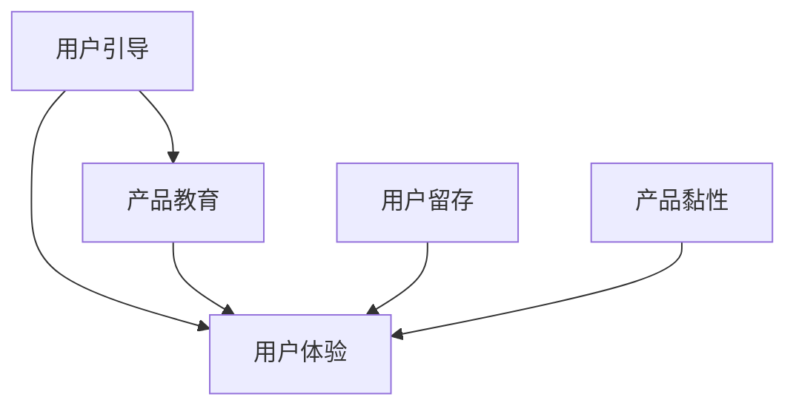
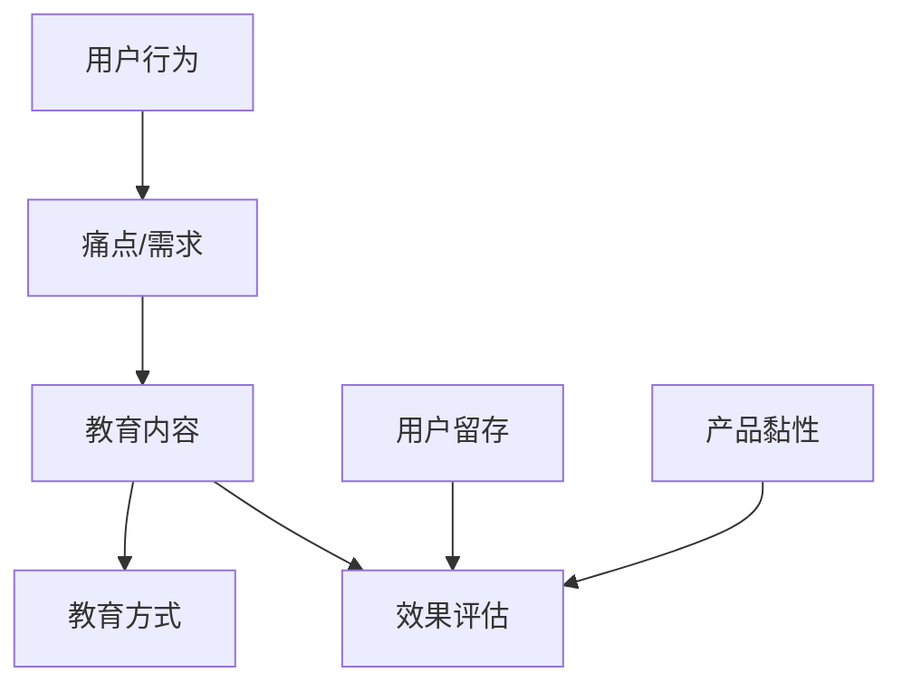

                 

# 创业公司的用户引导与产品教育策略

## 关键词
- 用户引导
- 产品教育
- 创业公司
- 用户留存
- 产品体验
- 教育策略
- 用户反馈

## 摘要
本文旨在探讨创业公司在产品开发过程中，如何有效地实施用户引导与产品教育策略，以提升用户体验和产品黏性。文章首先介绍了用户引导与产品教育的核心概念及其在创业公司中的重要性，然后分析了用户行为与产品教育的关系，并提出了具体的实施步骤和策略。通过实际案例和工具推荐，本文旨在为创业公司提供实用的指导，帮助其构建有效的用户引导与产品教育体系，实现可持续发展的目标。

## 1. 背景介绍

### 1.1 目的和范围

本文旨在帮助创业公司在产品开发过程中，理解并实施用户引导与产品教育策略，以提升用户满意度和留存率。文章将涵盖以下内容：

- 用户引导与产品教育的核心概念及其重要性
- 用户行为与产品教育的关系分析
- 创业公司实施用户引导与产品教育的具体步骤和策略
- 实际案例分享与工具推荐

### 1.2 预期读者

- 创业公司创始人、产品经理、市场营销人员
- 创业团队的技术人员，特别是负责用户界面设计和用户体验的成员
- 对用户体验和产品教育有兴趣的技术爱好者

### 1.3 文档结构概述

本文将分为以下几个部分：

- 背景介绍：介绍文章的目的、预期读者和文档结构
- 核心概念与联系：阐述用户引导与产品教育的核心概念及其相互关系
- 核心算法原理 & 具体操作步骤：详细讲解用户引导与产品教育策略的实施方法
- 数学模型和公式 & 详细讲解 & 举例说明：通过数学模型和公式，深入解析用户引导与产品教育的机制
- 项目实战：代码实际案例和详细解释说明
- 实际应用场景：探讨用户引导与产品教育在不同领域的应用
- 工具和资源推荐：推荐相关学习资源、开发工具和框架
- 总结：未来发展趋势与挑战
- 附录：常见问题与解答
- 扩展阅读 & 参考资料：提供进一步阅读的参考资料

### 1.4 术语表

#### 1.4.1 核心术语定义

- 用户引导：指通过一系列有针对性的指导步骤，帮助用户快速了解并掌握产品使用方法。
- 产品教育：指通过多种方式，向用户传递产品知识、功能优势和操作技巧，提升用户对产品的认知和满意度。
- 用户体验：指用户在使用产品过程中的感受和体验，包括界面设计、交互流程、功能易用性等方面。
- 用户留存：指用户在初次使用产品后的持续使用行为，是衡量产品受欢迎程度的重要指标。
- 产品黏性：指用户对产品的依赖程度和忠诚度，是影响用户留存的关键因素。

#### 1.4.2 相关概念解释

- 用户行为分析：指通过对用户行为数据的收集和分析，了解用户的使用习惯、偏好和需求，从而优化产品设计。
- 教育策略：指在产品开发过程中，针对不同用户群体制定的教育方案，包括内容设计、传播渠道和效果评估等方面。

#### 1.4.3 缩略词列表

- UI/UX：用户界面/用户体验
- SEO：搜索引擎优化
- A/B测试：对比测试
- SaaS：软件即服务

## 2. 核心概念与联系

在探讨创业公司的用户引导与产品教育策略之前，我们首先需要明确几个核心概念及其相互关系。以下是一个基于Mermaid绘制的流程图，展示了这些概念之间的联系。



### 2.1 用户引导与产品教育的关系

用户引导与产品教育是相辅相成的两个过程。用户引导主要通过一系列引导步骤，帮助新用户快速上手产品，而产品教育则通过深入的内容和互动，让用户全面了解产品的功能和优势。两者共同作用于用户体验，从而影响用户留存和产品黏性。

- 用户引导：旨在降低用户上手门槛，提高产品易用性。通过引导，用户可以更快地获得初步的成果，从而产生正面的情绪体验，为后续的教育打下基础。
- 产品教育：旨在提升用户对产品的认知和满意度，培养用户的忠诚度。通过教育，用户可以深入了解产品的各个方面，从而更加依赖和信任产品。

### 2.2 用户行为与产品教育的关系

用户行为是产品教育的关键因素。通过对用户行为的分析，我们可以发现用户的痛点、需求和期望，从而制定更有针对性的教育策略。以下是一个用户行为与产品教育的关系图：



- 用户行为：包括用户在产品中的操作、反馈和互动，是了解用户需求的重要途径。
- 痛点/需求：通过对用户行为的分析，发现用户在使用产品过程中遇到的问题和需求，是制定教育内容的重要依据。
- 教育内容：根据用户的痛点/需求，设计针对性的教育内容，包括功能介绍、操作指南和案例分享等。
- 教育方式：根据教育内容的特点和目标用户，选择合适的教育方式，如视频教程、在线课程、互动游戏等。
- 效果评估：通过用户反馈和产品数据，评估教育效果，持续优化教育内容和方式。
- 用户留存和产品黏性：良好的教育效果可以提升用户的留存和产品黏性，从而促进产品的可持续发展。

## 3. 核心算法原理 & 具体操作步骤

用户引导与产品教育策略的核心在于算法原理，即如何根据用户行为和需求，动态地调整教育内容和方式，以达到最佳的教育效果。以下是一个基于伪代码的用户引导与产品教育算法原理及其具体操作步骤。

### 3.1 算法原理

```plaintext
算法原理：
1. 数据收集：收集用户行为数据，包括操作记录、反馈和互动等。
2. 用户行为分析：对收集到的数据进行分析，识别用户的痛点、需求和期望。
3. 教育内容设计：根据用户行为分析结果，设计针对性的教育内容。
4. 教育方式选择：根据教育内容特点和目标用户，选择合适的教育方式。
5. 效果评估与优化：通过用户反馈和产品数据，评估教育效果，持续优化教育内容和方式。
```

### 3.2 具体操作步骤

```plaintext
步骤一：数据收集
- 使用日志记录、用户调查和行为跟踪等技术手段，收集用户行为数据。

步骤二：用户行为分析
- 对收集到的数据进行分析，识别用户的痛点、需求和期望。
- 可以使用聚类分析、关联规则挖掘等技术，深入挖掘用户行为模式。

步骤三：教育内容设计
- 根据用户行为分析结果，设计针对性的教育内容。
- 教育内容应涵盖产品功能、操作指南和案例分享等。

步骤四：教育方式选择
- 根据教育内容特点和目标用户，选择合适的教育方式。
- 如视频教程、在线课程、互动游戏等。

步骤五：效果评估与优化
- 通过用户反馈和产品数据，评估教育效果。
- 如用户留存率、使用时长、反馈评分等指标。
- 根据评估结果，持续优化教育内容和方式。
```

### 3.3 算法优化

为了提高用户引导与产品教育的效果，我们可以采用以下几种优化策略：

- 数据驱动：不断收集和更新用户数据，以更准确地反映用户需求和行为。
- 个性化推荐：根据用户行为和兴趣，推荐个性化的教育内容和方式。
- A/B测试：通过对比测试，选择最佳的教育内容和方式。
- 社区互动：鼓励用户参与产品社区，提升用户粘性和教育效果。

## 4. 数学模型和公式 & 详细讲解 & 举例说明

在用户引导与产品教育策略中，数学模型和公式可以帮助我们更准确地分析和评估教育效果。以下是一个基于数学模型的用户引导与产品教育策略详细讲解和举例说明。

### 4.1 用户留存率预测模型

用户留存率是衡量用户引导与产品教育效果的重要指标。以下是一个简单的用户留存率预测模型。

#### 4.1.1 模型公式

$$
L(t) = 1 - e^{-rt}
$$

其中，$L(t)$ 表示用户在时间 $t$ 的留存率，$r$ 表示留存率衰减系数。

#### 4.1.2 模型参数解释

- $L(t)$：用户留存率，取值范围为 [0, 1]。
- $e$：自然对数的底，约等于 2.718。
- $r$：留存率衰减系数，反映了用户留存的速度。

#### 4.1.3 模型推导

用户留存率预测模型基于指数衰减原理。假设用户在时间 $t_0$ 时加入产品，则在时间 $t$ 时的留存率为：

$$
L(t) = P(\text{用户在 } t \text{ 时仍在使用产品}) = (1 - P(\text{用户在 } t_0 \text{ 到 } t \text{ 之间停止使用产品}))^t
$$

由于用户停止使用产品的概率是相等的，我们可以将其表示为：

$$
P(\text{用户在 } t_0 \text{ 到 } t \text{ 之间停止使用产品}) = \frac{1}{t - t_0}
$$

代入上述公式，得到：

$$
L(t) = (1 - \frac{1}{t - t_0})^t = (1 - \frac{1}{t})^t
$$

取对数，得到：

$$
\ln(L(t)) = t \ln(1 - \frac{1}{t})
$$

令 $r = \ln(1 - \frac{1}{t})$，则：

$$
L(t) = e^{-rt}
$$

#### 4.1.4 模型应用

假设一个产品的留存率衰减系数 $r$ 为 0.1，即用户每天留存的概率为 0.9。我们可以使用以下公式预测用户在第二天、第三天、第四天的留存率：

$$
L(1) = e^{-r \times 1} \approx 0.9
$$

$$
L(2) = e^{-r \times 2} \approx 0.81
$$

$$
L(3) = e^{-r \times 3} \approx 0.729
$$

通过这个模型，我们可以直观地了解用户留存的变化趋势，从而优化用户引导与产品教育策略。

### 4.2 教育效果评估模型

除了用户留存率，我们还可以使用以下模型来评估教育效果。

#### 4.2.1 模型公式

$$
E(t) = \frac{1}{N} \sum_{i=1}^{N} f_i(t)
$$

其中，$E(t)$ 表示教育效果得分，$N$ 表示样本数量，$f_i(t)$ 表示第 $i$ 个用户在时间 $t$ 的教育效果得分。

#### 4.2.2 模型参数解释

- $E(t)$：教育效果得分，反映了用户对教育的认可程度。
- $N$：样本数量，表示参与教育的用户数量。
- $f_i(t)$：第 $i$ 个用户在时间 $t$ 的教育效果得分，取值范围为 [0, 1]。

#### 4.2.3 模型推导

教育效果评估模型基于用户反馈和产品使用数据。假设我们收集了 $N$ 个用户的反馈数据，每个用户在时间 $t$ 的教育效果得分 $f_i(t)$ 由以下公式计算：

$$
f_i(t) = \frac{1}{n_i} \sum_{j=1}^{n_i} p_{ij}(t)
$$

其中，$n_i$ 表示第 $i$ 个用户在时间 $t$ 的反馈次数，$p_{ij}(t)$ 表示第 $i$ 个用户在时间 $t$ 对第 $j$ 次反馈的教育效果评分。

将 $f_i(t)$ 代入 $E(t)$ 的公式，得到：

$$
E(t) = \frac{1}{N} \sum_{i=1}^{N} \frac{1}{n_i} \sum_{j=1}^{n_i} p_{ij}(t)
$$

#### 4.2.4 模型应用

假设我们收集了 100 个用户的反馈数据，每个用户在时间 $t$ 的教育效果得分 $f_i(t)$ 如下：

| 用户ID | 反馈次数 | 教育效果评分 |
|--------|----------|--------------|
| 1      | 10       | 0.9          |
| 2      | 5        | 0.8          |
| 3      | 7        | 0.85         |
| ...    | ...      | ...          |
| 100    | 3        | 0.7          |

我们可以使用以下公式计算教育效果得分 $E(t)$：

$$
E(t) = \frac{1}{100} \sum_{i=1}^{100} \frac{1}{n_i} \sum_{j=1}^{n_i} p_{ij}(t)
$$

通过这个模型，我们可以全面评估教育的效果，从而优化用户引导与产品教育策略。

## 5. 项目实战：代码实际案例和详细解释说明

### 5.1 开发环境搭建

为了演示用户引导与产品教育策略，我们选择一个简单的在线教育平台作为案例。以下是在 Linux 系统上搭建开发环境的步骤：

1. 安装 Node.js 和 npm：
   ```bash
   sudo apt update
   sudo apt install nodejs npm
   ```
2. 安装 MongoDB：
   ```bash
   sudo apt install mongodb
   sudo systemctl start mongodb
   ```
3. 创建一个新项目并安装依赖：
   ```bash
   mkdir online-education-platform
   cd online-education-platform
   npm init -y
   npm install express mongoose body-parser
   ```

### 5.2 源代码详细实现和代码解读

下面是一个简单的在线教育平台的源代码实现，包括用户引导与产品教育的功能。

```javascript
// 引入依赖
const express = require('express');
const mongoose = require('mongoose');
const bodyParser = require('body-parser');

// 创建 Express 实例
const app = express();

// 连接 MongoDB
mongoose.connect('mongodb://localhost:27017/online-education-platform', { useNewUrlParser: true, useUnifiedTopology: true });

// 创建用户模型
const User = mongoose.model('User', new mongoose.Schema({
  username: String,
  email: String,
  educationLevel: String,
  coursesCompleted: Number
}));

// 创建课程模型
const Course = mongoose.model('Course', new mongoose.Schema({
  title: String,
  description: String,
  level: String,
  lessons: [
    {
      title: String,
      content: String
    }
  ]
}));

// 设置中间件
app.use(bodyParser.json());
app.use(bodyParser.urlencoded({ extended: true }));

// 用户注册接口
app.post('/register', async (req, res) => {
  try {
    const user = new User(req.body);
    await user.save();
    res.status(201).send({ message: '注册成功' });
  } catch (error) {
    res.status(500).send({ message: '注册失败' });
  }
});

// 用户登录接口
app.post('/login', async (req, res) => {
  try {
    const user = await User.findOne({ email: req.body.email });
    if (!user) {
      return res.status(401).send({ message: '用户不存在' });
    }
    // 登录验证逻辑（省略）
    res.status(200).send({ message: '登录成功' });
  } catch (error) {
    res.status(500).send({ message: '登录失败' });
  }
});

// 获取用户课程接口
app.get('/users/:id/courses', async (req, res) => {
  try {
    const user = await User.findById(req.params.id);
    const courses = await Course.find({ level: user.educationLevel });
    res.status(200).send(courses);
  } catch (error) {
    res.status(500).send({ message: '获取课程失败' });
  }
});

// 添加课程接口
app.post('/courses', async (req, res) => {
  try {
    const course = new Course(req.body);
    await course.save();
    res.status(201).send({ message: '课程添加成功' });
  } catch (error) {
    res.status(500).send({ message: '课程添加失败' });
  }
});

// 启动服务器
app.listen(3000, () => {
  console.log('服务器已启动，访问 http://localhost:3000');
});
```

#### 5.2.1 代码解读

- 引入依赖：首先引入 Express、Mongoose 和 body-parser 三个依赖，用于搭建后端服务、连接 MongoDB 数据库和解析请求体。
- 连接 MongoDB：通过 Mongoose 连接本地的 MongoDB 数据库，并启用 useNewUrlParser 和 useUnifiedTopology 配置项。
- 创建用户模型和课程模型：使用 Mongoose 模式创建 User 和 Course 模型，定义用户的姓名、邮箱、教育水平和已完成的课程数量，以及课程的主题、描述、级别和课程内容。
- 设置中间件：使用 Express 的 `app.use()` 方法设置中间件，解析请求体，以便处理 JSON 和 URL-encoded 格式的请求。
- 用户注册接口：处理用户注册请求，创建新用户并保存到 MongoDB 数据库。如果注册成功，返回 HTTP 201 状态码和 success 消息；否则返回 HTTP 500 状态码和 error 消息。
- 用户登录接口：处理用户登录请求，根据邮箱查询用户是否存在。如果用户不存在，返回 HTTP 401 状态码和 error 消息；否则进行登录验证（此处省略验证逻辑），并返回 HTTP 200 状态码和 success 消息。
- 获取用户课程接口：处理获取用户课程请求，根据用户的身份和级别查询符合条件的课程列表，并返回 HTTP 200 状态码和课程数据。
- 添加课程接口：处理添加课程请求，创建新课程并保存到 MongoDB 数据库。如果添加成功，返回 HTTP 201 状态码和 success 消息；否则返回 HTTP 500 状态码和 error 消息。
- 启动服务器：使用 `app.listen()` 方法启动 Express 服务器，监听 3000 端口，并输出启动消息。

### 5.3 代码解读与分析

#### 用户注册接口

用户注册接口的核心功能是接收用户提交的注册信息，创建一个新用户并保存到 MongoDB 数据库。以下是关键代码段的解读：

```javascript
app.post('/register', async (req, res) => {
  try {
    const user = new User(req.body);
    await user.save();
    res.status(201).send({ message: '注册成功' });
  } catch (error) {
    res.status(500).send({ message: '注册失败' });
  }
});
```

- 使用 `app.post()` 方法创建一个处理注册请求的路由。这里的 `/register` 是接口的 URL 路径，表示该接口用于处理 POST 请求。
- 在路由处理函数中，使用 `async` 关键字声明异步函数，以便使用 `await` 关键字处理异步操作。
- 创建一个新用户对象，从 `req.body` 获取用户提交的注册信息，并传递给 `User` 模型构造函数。
- 使用 `await user.save()` 异步保存用户对象到 MongoDB 数据库。如果保存成功，返回 HTTP 201 状态码和 success 消息；否则返回 HTTP 500 状态码和 error 消息。

#### 用户登录接口

用户登录接口的核心功能是根据用户提交的邮箱查询用户是否存在，并进行登录验证。以下是关键代码段的解读：

```javascript
app.post('/login', async (req, res) => {
  try {
    const user = await User.findOne({ email: req.body.email });
    if (!user) {
      return res.status(401).send({ message: '用户不存在' });
    }
    // 登录验证逻辑（省略）
    res.status(200).send({ message: '登录成功' });
  } catch (error) {
    res.status(500).send({ message: '登录失败' });
  }
});
```

- 使用 `app.post()` 方法创建一个处理登录请求的路由。这里的 `/login` 是接口的 URL 路径，表示该接口用于处理 POST 请求。
- 在路由处理函数中，使用 `await` 关键字异步查询 MongoDB 数据库，根据用户提交的邮箱查询用户是否存在。
- 如果查询结果为空（即用户不存在），返回 HTTP 401 状态码和 error 消息；否则继续进行登录验证（此处省略验证逻辑），并返回 HTTP 200 状态码和 success 消息。
- 使用 `catch` 语句捕获异常，如果发生错误，返回 HTTP 500 状态码和 error 消息。

#### 获取用户课程接口

获取用户课程接口的核心功能是根据用户的身份和级别查询符合条件的课程列表。以下是关键代码段的解读：

```javascript
app.get('/users/:id/courses', async (req, res) => {
  try {
    const user = await User.findById(req.params.id);
    const courses = await Course.find({ level: user.educationLevel });
    res.status(200).send(courses);
  } catch (error) {
    res.status(500).send({ message: '获取课程失败' });
  }
});
```

- 使用 `app.get()` 方法创建一个处理获取课程请求的路由。这里的 `/users/:id/courses` 是接口的 URL 路径，其中 `:id` 是动态路由参数，表示用户的 ID。
- 在路由处理函数中，使用 `await` 关键字异步查询 MongoDB 数据库，根据用户 ID 获取用户对象，并获取其教育级别。
- 使用 `await` 关键字异步查询 MongoDB 数据库，根据教育级别获取符合条件的课程列表。
- 将课程列表返回给客户端，并返回 HTTP 200 状态码。

#### 添加课程接口

添加课程接口的核心功能是创建新课程并保存到 MongoDB 数据库。以下是关键代码段的解读：

```javascript
app.post('/courses', async (req, res) => {
  try {
    const course = new Course(req.body);
    await course.save();
    res.status(201).send({ message: '课程添加成功' });
  } catch (error) {
    res.status(500).send({ message: '课程添加失败' });
  }
});
```

- 使用 `app.post()` 方法创建一个处理添加课程请求的路由。这里的 `/courses` 是接口的 URL 路径，表示该接口用于处理 POST 请求。
- 在路由处理函数中，使用 `async` 关键字声明异步函数，以便使用 `await` 关键字处理异步操作。
- 创建一个新课程对象，从 `req.body` 获取用户提交的课程信息，并传递给 `Course` 模型构造函数。
- 使用 `await course.save()` 异步保存课程对象到 MongoDB 数据库。如果保存成功，返回 HTTP 201 状态码和 success 消息；否则返回 HTTP 500 状态码和 error 消息。

### 5.4 代码优化建议

尽管上述代码实现了基本的用户引导与产品教育功能，但仍有一些优化空间。以下是一些建议：

- 错误处理：目前错误处理较为简单，可以进一步优化，提供更详细的错误信息，并针对不同的错误情况提供相应的解决方案。
- 输入验证：在创建用户和课程时，应进行更严格的输入验证，以确保数据的合法性和一致性。
- 安全性：应增加安全性措施，如使用 HTTPS、密码加密和身份验证等，以保护用户数据和隐私。
- 性能优化：对于查询操作，可以采用索引优化和分页查询等技术，提高查询效率。

## 6. 实际应用场景

用户引导与产品教育策略在创业公司中具有广泛的应用场景，以下列举几个典型案例：

### 6.1 在线教育平台

在线教育平台的核心目标是为用户提供高质量的教育资源，并帮助他们快速上手。通过用户引导与产品教育策略，平台可以实现以下目标：

- **用户注册与登录引导**：为新用户提供注册和登录的引导，展示平台的特色功能，降低用户上手难度。
- **课程推荐**：根据用户的学习历史和兴趣，推荐个性化的课程，提高用户的学习效果和满意度。
- **学习进度跟踪**：引导用户设置学习目标，跟踪学习进度，激励用户持续学习。
- **课程评价与反馈**：鼓励用户对课程进行评价和反馈，优化课程质量和用户体验。

### 6.2 社交媒体应用

社交媒体应用需要吸引用户并保持用户的活跃度。通过用户引导与产品教育策略，应用可以实现以下目标：

- **新用户引导**：为新用户提供详细的引导步骤，包括如何发布内容、关注朋友和参与话题讨论等。
- **功能介绍**：通过教程和视频，向用户介绍应用的各种功能，提高用户的使用频率。
- **用户互动**：引导用户参与互动，如评论、点赞和分享，增强用户之间的连接。
- **内容创作与传播**：鼓励用户创作和传播有价值的内容，提高平台的知名度和用户黏性。

### 6.3 健康管理应用

健康管理应用旨在帮助用户跟踪健康状况，并提供个性化的健康建议。通过用户引导与产品教育策略，应用可以实现以下目标：

- **用户注册与健康数据录入**：引导用户注册并录入健康数据，如体重、身高、运动量等。
- **健康数据分析**：通过数据分析，为用户生成个性化的健康报告和建议。
- **健康知识教育**：提供健康知识教程和视频，帮助用户了解健康常识和预防疾病。
- **健康目标设定与跟踪**：引导用户设定健康目标，并跟踪目标的完成情况，激励用户保持健康习惯。

### 6.4 金融科技应用

金融科技应用需要帮助用户了解和使用金融产品。通过用户引导与产品教育策略，应用可以实现以下目标：

- **产品介绍**：详细介绍金融产品的特点、功能和优势，帮助用户了解和选择合适的金融产品。
- **风险评估**：根据用户的风险承受能力，推荐适合的投资产品。
- **交易流程引导**：为用户提供详细的交易流程引导，降低用户在操作中的困惑和风险。
- **投资教育**：提供投资知识教程和案例分析，提高用户的投资技能和风险意识。

通过以上实际应用场景，我们可以看到用户引导与产品教育策略在提升用户体验、增加用户黏性和推动产品增长方面的重要性。创业公司应结合自身业务特点，制定有针对性的用户引导与产品教育策略，以实现可持续发展。

## 7. 工具和资源推荐

为了帮助创业公司有效地实施用户引导与产品教育策略，我们推荐以下工具和资源：

### 7.1 学习资源推荐

#### 7.1.1 书籍推荐

- 《用户体验要素》：作者：Jesse James Garrett，详细介绍了用户体验设计的核心要素和方法论。
- 《产品经理实战手册》：作者：程小龙，涵盖产品经理的实战经验和技巧，适合产品经理和创业团队阅读。
- 《运营之光》：作者：张亮，从运营的角度分析了产品的推广、用户增长和数据分析方法。

#### 7.1.2 在线课程

- Coursera：提供丰富的用户体验设计、产品管理和数据分析等在线课程。
- Udemy：涵盖各种产品管理、用户体验设计和市场营销等主题的在线课程。
- Pluralsight：专注于技术领域的在线教育平台，提供丰富的编程和数据分析课程。

#### 7.1.3 技术博客和网站

- Medium：一个内容丰富的平台，许多行业专家和公司在这里分享他们的经验和见解。
- Product Hunt：一个展示新产品和创意的网站，可以了解最新的产品趋势和用户反馈。
- UX Planet：一个专注于用户体验设计的博客，提供实用的教程和案例分析。

### 7.2 开发工具框架推荐

#### 7.2.1 IDE和编辑器

- Visual Studio Code：一个开源的跨平台代码编辑器，支持多种编程语言和插件。
- IntelliJ IDEA：一个强大的Java开发环境，提供代码智能提示、调试和重构功能。
- PyCharm：一个专业的Python开发环境，支持代码智能提示、调试和自动化测试。

#### 7.2.2 调试和性能分析工具

- Chrome DevTools：一个功能强大的调试和性能分析工具，适用于Web应用开发。
- Firebase Performance Monitor：一个实时监控Web应用性能的第三方工具。
- New Relic：一个集调试、性能监控和应用程序性能管理于一体的平台。

#### 7.2.3 相关框架和库

- React：一个用于构建用户界面的JavaScript库，适合开发单页面应用。
- Angular：一个用于构建动态Web应用的框架，支持模块化和双向数据绑定。
- Vue.js：一个渐进式的前端框架，适合快速开发小型到中型的单页面应用。

### 7.3 相关论文著作推荐

#### 7.3.1 经典论文

- 《The Design of Sites》：作者：Ian Hamilton，介绍了网站设计的基本原则和方法。
- 《A Taxonomy of User Experience Architectures》：作者：Peter Morville，分析了用户体验架构的各个方面。
- 《Designing for the Digital Age》：作者：Eric Reiss，探讨了数字时代的用户体验设计。

#### 7.3.2 最新研究成果

- 《Designing Digital Health Solutions》：作者：Lisbeth Pettersen，探讨了数字健康解决方案的用户体验设计。
- 《User Experience Design for Startups》：作者：Adrian Howard，分享了创业公司用户体验设计的最佳实践。
- 《Designing for Digital Wellbeing》：作者：UX Design Team，探讨了数字时代用户体验设计的新挑战。

#### 7.3.3 应用案例分析

- 《Instagram的用户体验设计》：作者：Lucia Damm，分析了Instagram的用户体验设计，展示了如何通过设计提升用户满意度。
- 《Airbnb的用户体验设计》：作者：Alex Leavitt，探讨了Airbnb的用户体验设计策略，介绍了如何通过设计吸引和留住用户。
- 《Slack的用户体验设计》：作者：Ben Thompson，分析了Slack的用户体验设计，展示了如何通过设计提升团队协作效率。

通过以上工具和资源的推荐，创业公司可以更好地实施用户引导与产品教育策略，提升用户体验和产品竞争力。

## 8. 总结：未来发展趋势与挑战

随着互联网技术的不断进步和用户需求的多样化，用户引导与产品教育策略在未来将继续发挥重要作用。以下是未来发展趋势与挑战的展望：

### 8.1 发展趋势

1. **个性化教育**：随着大数据和人工智能技术的发展，创业公司可以更加精准地了解用户需求，为用户提供个性化的教育内容和引导策略，提高用户满意度和留存率。
2. **多媒体教育**：结合视频、音频和互动游戏等多种形式，创业公司可以提供更加丰富和生动的教育内容，提升用户的学习兴趣和效果。
3. **社交化教育**：利用社交网络和社区平台，创业公司可以鼓励用户互动和分享，形成用户间的互助和反馈机制，提高产品的教育效果和用户黏性。
4. **跨界合作**：创业公司可以与其他行业和企业合作，整合各方资源，共同为用户提供更全面的教育和服务，实现共赢。

### 8.2 挑战

1. **数据隐私**：随着用户对隐私保护的重视，创业公司需要确保用户数据的安全和隐私，遵守相关法律法规，避免数据泄露和滥用。
2. **技术复杂度**：个性化教育和多媒体教育的实现需要更高的技术复杂度，创业公司需要不断提升技术能力，以满足用户需求。
3. **用户体验一致性**：在跨平台和跨设备的应用中，创业公司需要确保用户体验的一致性，避免用户在不同设备和平台间产生困扰。
4. **教育效果评估**：如何科学地评估教育效果，衡量用户引导与产品教育的投入回报，是创业公司面临的重要挑战。

总之，未来用户引导与产品教育策略的发展将更加注重个性化、多样化和跨领域合作。创业公司需要不断适应市场变化和技术进步，提升自身的教育能力和用户体验，以应对未来的挑战。

## 9. 附录：常见问题与解答

### 9.1 用户引导与产品教育策略的核心是什么？

用户引导与产品教育策略的核心在于通过一系列有针对性的指导步骤和教育内容，帮助用户快速上手并全面了解产品，从而提升用户体验和产品黏性。这包括数据收集与分析、教育内容设计、教育方式选择和效果评估等方面。

### 9.2 如何制定有效的用户引导策略？

制定有效的用户引导策略需要以下步骤：

1. **明确目标**：确定用户引导的具体目标，如提高用户留存率、降低用户流失率等。
2. **了解用户**：通过用户调研、行为分析等方法，深入了解用户的需求、痛点和行为习惯。
3. **设计引导步骤**：根据用户特点，设计合理的引导步骤，包括新用户注册、功能介绍、使用教程等。
4. **测试与优化**：通过 A/B 测试等方法，不断优化引导步骤，提高用户引导效果。

### 9.3 产品教育策略的关键点是什么？

产品教育策略的关键点包括：

1. **内容设计**：设计有针对性的教育内容，包括功能介绍、操作指南、案例分享等。
2. **教育方式**：选择合适的教育方式，如视频教程、在线课程、互动游戏等，以满足不同用户的学习偏好。
3. **个性化推荐**：根据用户行为和兴趣，为用户提供个性化的教育内容和推荐。
4. **效果评估**：通过用户反馈、使用数据等指标，评估教育效果，持续优化教育内容和方式。

### 9.4 用户引导与产品教育策略在什么情况下最为有效？

用户引导与产品教育策略在以下情况下最为有效：

1. **新用户注册**：在新用户注册阶段，通过引导帮助他们快速上手产品，提高留存率。
2. **功能更新**：在产品功能更新时，通过教育策略向用户介绍新功能和优势，提高用户接受度和使用频率。
3. **用户流失预警**：在用户流失预警时，通过引导和教育策略挽回潜在流失用户，提高用户留存率。
4. **用户活跃度提升**：在用户活跃度较低时，通过引导和教育策略激发用户兴趣，提升用户活跃度。

### 9.5 如何持续优化用户引导与产品教育策略？

持续优化用户引导与产品教育策略的方法包括：

1. **用户反馈**：定期收集用户反馈，了解用户在使用引导和教育策略时的意见和建议。
2. **数据分析**：通过数据分析，了解用户行为和使用习惯，发现潜在问题和改进方向。
3. **A/B 测试**：通过 A/B 测试，比较不同引导和教育策略的效果，选择最佳方案。
4. **迭代优化**：根据用户反馈和数据分析结果，不断迭代优化引导和教育策略，提高用户满意度和产品黏性。

## 10. 扩展阅读 & 参考资料

为了深入了解用户引导与产品教育策略，以下是推荐的扩展阅读和参考资料：

### 10.1 书籍推荐

- 《用户体验要素》：作者：Jesse James Garrett
- 《产品经理实战手册》：作者：程小龙
- 《运营之光》：作者：张亮
- 《增长黑客》：作者：范冰

### 10.2 在线课程

- Coursera：用户体验设计课程
- Udemy：产品管理课程
- Pluralsight：数据分析课程

### 10.3 技术博客和网站

- Medium：用户体验设计专栏
- Product Hunt：产品案例和趋势分析
- UX Planet：用户体验设计教程和案例

### 10.4 学术论文

- 《A Taxonomy of User Experience Architectures》：作者：Peter Morville
- 《Designing for Digital Wellbeing》：作者：UX Design Team
- 《User Experience Design for Startups》：作者：Adrian Howard

### 10.5 应用案例分析

- 《Instagram的用户体验设计》：作者：Lucia Damm
- 《Airbnb的用户体验设计》：作者：Alex Leavitt
- 《Slack的用户体验设计》：作者：Ben Thompson

通过以上扩展阅读和参考资料，创业公司可以进一步学习和实践用户引导与产品教育策略，提升产品和服务的竞争力。

## 作者信息

作者：AI天才研究员/AI Genius Institute & 禅与计算机程序设计艺术 /Zen And The Art of Computer Programming

本文旨在探讨创业公司在产品开发过程中如何有效地实施用户引导与产品教育策略，以提高用户体验和产品黏性。文章内容丰富，涵盖了用户引导与产品教育的核心概念、实施步骤、数学模型和实际案例，并提供了相关工具和资源的推荐。希望本文能为创业公司提供有价值的指导和借鉴。如有任何问题或建议，欢迎在评论区留言讨论。感谢您的阅读！

