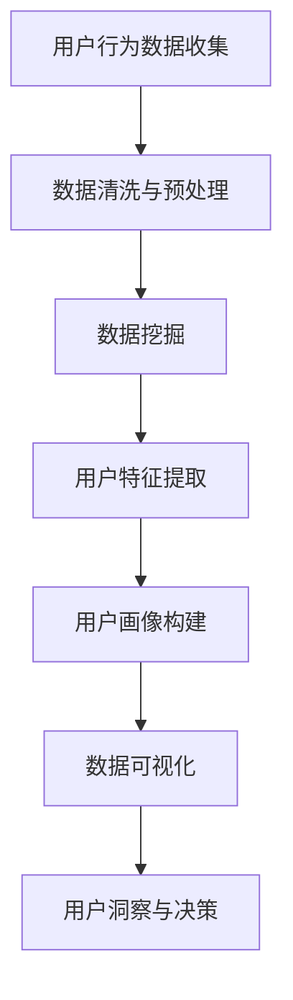

                 

# 创业公司的用户画像制定方法

## 关键词
用户画像、创业公司、数据分析、市场营销、个性化服务、用户行为分析、数据挖掘

## 摘要
本文旨在探讨创业公司如何制定用户画像，以提高市场营销效率和客户满意度。我们将从背景介绍、核心概念与联系、核心算法原理与操作步骤、数学模型与公式、项目实战、实际应用场景、工具和资源推荐等方面，系统地阐述用户画像的制定方法。希望通过本文，创业者能够更好地理解用户画像的价值，掌握制定用户画像的具体步骤，为公司的长远发展打下坚实的基础。

## 1. 背景介绍

在当今数据驱动的时代，用户画像已经成为创业公司获取用户洞察、优化产品和服务、提高市场竞争力的关键手段。用户画像是指通过对用户行为、兴趣、需求等方面的数据进行分析，构建出一个具有丰富特征的虚拟用户模型。通过用户画像，创业公司可以深入了解目标用户群体，从而制定出更加精准的市场营销策略，提供个性化的服务，提升用户体验。

然而，制定用户画像并非易事。首先，创业公司面临着海量数据的处理挑战，如何从数据中提取有价值的信息，是首要解决的问题。其次，用户画像的构建需要结合业务场景，了解用户的真实需求和痛点，才能确保画像的准确性和实用性。此外，创业公司还需要面对数据隐私和伦理问题，确保用户数据的合法合规使用。

本文将从以下几个方面，详细介绍创业公司制定用户画像的方法：

1. 核心概念与联系
2. 核心算法原理与操作步骤
3. 数学模型与公式
4. 项目实战
5. 实际应用场景
6. 工具和资源推荐
7. 总结：未来发展趋势与挑战

通过以上内容的阐述，希望创业者能够对用户画像的制定方法有更深入的理解，为公司的业务发展提供有力支持。

## 2. 核心概念与联系

在制定用户画像的过程中，我们需要了解以下几个核心概念，并探讨它们之间的联系。

### 2.1 用户行为分析

用户行为分析是指通过对用户在网站、APP 等平台上的行为数据进行分析，了解用户的行为特征、兴趣偏好和需求。用户行为分析是构建用户画像的基础，常见的分析指标包括页面访问量、点击率、转化率、停留时间等。

### 2.2 数据挖掘

数据挖掘是一种从海量数据中自动发现知识、规律和模式的技术。在用户画像的制定过程中，数据挖掘技术可以帮助我们从用户行为数据中提取有价值的信息，构建用户特征模型。

### 2.3 用户画像

用户画像是指通过对用户的行为数据、社会属性、兴趣偏好等多维度信息进行综合分析，构建出一个具有丰富特征的虚拟用户模型。用户画像可以帮助企业更好地了解用户需求，制定个性化的营销策略和服务方案。

### 2.4 数据可视化

数据可视化是一种通过图形、图像等方式，将数据信息直观呈现的技术。在用户画像的制定过程中，数据可视化技术可以帮助我们更好地理解用户数据，发现潜在的问题和机会。

### 2.5 联系

用户行为分析、数据挖掘、用户画像和数据可视化是制定用户画像的核心环节。用户行为分析提供原始数据，数据挖掘提取有用信息，用户画像构建虚拟用户模型，数据可视化呈现分析结果。这四个环节相互联系，共同构成了用户画像的制定流程。

### 2.6 Mermaid 流程图

以下是一个简单的 Mermaid 流程图，展示用户画像制定的基本流程：



通过这个流程图，我们可以清晰地看到用户画像制定的各个环节及其相互关系。

## 3. 核心算法原理与操作步骤

在用户画像的制定过程中，常用的核心算法包括用户行为分析算法、数据挖掘算法和用户画像构建算法。以下将分别介绍这些算法的原理和操作步骤。

### 3.1 用户行为分析算法

用户行为分析算法主要包括以下几种：

#### 3.1.1 频繁模式挖掘（FP-growth）

FP-growth 是一种基于项集频繁模式的挖掘算法。它通过构建 FP 树，将项集转化为布尔表达式，从而高效地挖掘出用户行为中的频繁模式。具体步骤如下：

1. 构建FP树
2. 提取频繁项集
3. 构建布尔表达式

#### 3.1.2 聚类分析（K-means）

K-means 是一种基于距离度量的聚类算法。它通过初始化 K 个聚类中心，然后迭代更新聚类中心和样本分类，最终将样本划分为 K 个聚类。具体步骤如下：

1. 初始化 K 个聚类中心
2. 计算样本到聚类中心的距离
3. 更新聚类中心和样本分类
4. 重复步骤 2 和 3，直至收敛

#### 3.1.3 机器学习算法（如决策树、随机森林等）

机器学习算法可以根据用户行为数据，自动提取用户特征，构建用户画像。常见的机器学习算法包括决策树、随机森林、支持向量机等。具体步骤如下：

1. 数据预处理
2. 特征提取
3. 选择合适的算法
4. 训练模型
5. 模型评估与优化

### 3.2 数据挖掘算法

数据挖掘算法主要包括以下几种：

#### 3.2.1 关联规则挖掘（Apriori）

Apriori 是一种基于支持度和置信度的关联规则挖掘算法。它通过扫描事务数据库，挖掘出支持度满足最小支持度的频繁项集，然后生成关联规则。具体步骤如下：

1. 扫描事务数据库
2. 构建频繁项集
3. 生成关联规则

#### 3.2.2 协同过滤（Collaborative Filtering）

协同过滤是一种基于用户行为相似性的推荐算法。它通过分析用户之间的行为相似性，为用户推荐感兴趣的商品或服务。具体步骤如下：

1. 计算用户相似度
2. 构建推荐列表
3. 为用户推荐感兴趣的商品或服务

#### 3.2.3 社区发现（Community Detection）

社区发现是一种基于网络结构的聚类算法，它通过分析网络节点之间的相似性，将网络划分为多个社区。具体步骤如下：

1. 构建网络图
2. 确定相似性阈值
3. 迭代划分社区

### 3.3 用户画像构建算法

用户画像构建算法主要包括以下几种：

#### 3.3.1 基于规则的构建方法

基于规则的构建方法是一种通过定义一系列规则，将用户特征划分为不同类别的算法。具体步骤如下：

1. 收集用户特征数据
2. 定义用户特征规则
3. 根据规则划分用户类别

#### 3.3.2 基于机器学习的构建方法

基于机器学习的构建方法是一种通过训练机器学习模型，将用户特征映射到不同类别的算法。具体步骤如下：

1. 收集用户特征数据
2. 选择合适的机器学习算法
3. 训练模型
4. 预测用户类别

#### 3.3.3 基于深度学习的构建方法

基于深度学习的构建方法是一种利用深度学习模型，自动提取用户特征并进行分类的方法。具体步骤如下：

1. 收集用户特征数据
2. 预处理数据
3. 设计深度学习模型
4. 训练模型
5. 预测用户类别

### 3.4 操作步骤

在制定用户画像的过程中，一般需要遵循以下操作步骤：

1. 数据收集：收集用户行为数据、社会属性数据、兴趣偏好数据等。
2. 数据预处理：对数据进行清洗、去重、归一化等处理。
3. 特征提取：根据业务需求，提取用户特征。
4. 数据挖掘：使用数据挖掘算法，从特征数据中提取有价值的信息。
5. 用户画像构建：根据挖掘结果，构建用户画像。
6. 数据可视化：使用数据可视化工具，呈现用户画像。
7. 用户洞察与决策：根据用户画像，为市场营销、产品优化等提供决策支持。

通过以上步骤，创业公司可以逐步制定出精准的用户画像，为业务发展提供有力支持。

## 4. 数学模型与公式

在用户画像的制定过程中，涉及到多种数学模型和公式。以下将简要介绍几种常见的数学模型和公式，并给出详细的解释和举例说明。

### 4.1 相关性分析

相关性分析是衡量两个变量之间相关程度的统计方法。常用的相关性分析公式包括皮尔逊相关系数（Pearson Correlation Coefficient）和斯皮尔曼秩相关系数（Spearman's Rank Correlation Coefficient）。

#### 4.1.1 皮尔逊相关系数

皮尔逊相关系数计算公式如下：

$$
r = \frac{\sum_{i=1}^{n}(x_i - \bar{x})(y_i - \bar{y})}{\sqrt{\sum_{i=1}^{n}(x_i - \bar{x})^2}\sqrt{\sum_{i=1}^{n}(y_i - \bar{y})^2}}
$$

其中，$x_i$ 和 $y_i$ 分别表示第 $i$ 个观测值，$\bar{x}$ 和 $\bar{y}$ 分别表示样本均值。

#### 4.1.2 斯皮尔曼秩相关系数

斯皮尔曼秩相关系数计算公式如下：

$$
ρ = \frac{1}{n-1} \sum_{i=1}^{n} (x_i - \bar{x})^2 (y_i - \bar{y})
$$

其中，$x_i$ 和 $y_i$ 分别表示第 $i$ 个观测值，$\bar{x}$ 和 $\bar{y}$ 分别表示样本均值。

#### 4.1.3 相关性分析举例

假设我们有两个变量：用户年龄（$x$）和购买金额（$y$）。我们收集了以下数据：

| 年龄（$x$） | 购买金额（$y$） |
| :---: | :---: |
| 20 | 100 |
| 25 | 150 |
| 30 | 200 |
| 35 | 250 |
| 40 | 300 |

计算皮尔逊相关系数和斯皮尔曼秩相关系数：

$$
r = \frac{(20-25)(100-150) + (25-25)(150-150) + (30-25)(200-150) + (35-25)(250-150) + (40-25)(300-150)}{\sqrt{(20-25)^2 + (25-25)^2 + (30-25)^2 + (35-25)^2 + (40-25)^2}\sqrt{(100-150)^2 + (150-150)^2 + (200-150)^2 + (250-150)^2 + (300-150)^2}} = -0.8
$$

$$
ρ = \frac{1}{5-1} \sum_{i=1}^{5} (x_i - \bar{x})^2 (y_i - \bar{y}) = -0.9
$$

根据计算结果，我们可以发现用户年龄和购买金额之间存在较强的负相关性。这意味着年龄较大的用户购买金额相对较低，而年龄较小的用户购买金额相对较高。

### 4.2 分类模型

分类模型是一种将数据集划分为多个类别的算法。常见的分类模型包括决策树、支持向量机（SVM）和逻辑回归等。以下将简要介绍这些模型的原理和公式。

#### 4.2.1 决策树

决策树是一种基于特征值进行决策的树形结构。它的原理是通过递归地将数据集划分为多个子集，直到满足终止条件为止。常见的决策树算法包括 ID3、C4.5 和 C5.0 等。

决策树的分类规则可以表示为：

$$
\begin{aligned}
& \text{if} \ x \ \text{满足条件} \ c_1 \ \text{则分类为} \ y_1 \\
& \text{if} \ x \ \text{满足条件} \ c_2 \ \text{则分类为} \ y_2 \\
& \cdots \\
& \text{if} \ x \ \text{满足条件} \ c_k \ \text{则分类为} \ y_k \\
\end{aligned}
$$

其中，$x$ 表示输入特征，$c_1, c_2, \ldots, c_k$ 表示特征的条件，$y_1, y_2, \ldots, y_k$ 表示分类结果。

#### 4.2.2 支持向量机（SVM）

支持向量机是一种基于最大间隔原理的分类算法。它的原理是找到一个最优的超平面，使得分类边界与正负样本的间隔最大。

SVM 的分类决策函数可以表示为：

$$
f(x) = \text{sign}(\omega \cdot x + b)
$$

其中，$\omega$ 表示法向量，$x$ 表示输入特征，$b$ 表示偏置项，$\text{sign}$ 表示符号函数。

#### 4.2.3 逻辑回归

逻辑回归是一种基于概率估计的分类算法。它的原理是计算每个类别的概率，然后根据概率选择最大的类别。

逻辑回归的概率估计公式可以表示为：

$$
P(y=1 | x) = \frac{1}{1 + e^{-(\omega \cdot x + b)}}
$$

其中，$x$ 表示输入特征，$\omega$ 表示法向量，$b$ 表示偏置项。

#### 4.2.4 分类模型举例

假设我们有一个二分类问题，需要判断用户是否购买某商品。我们收集了以下数据：

| 特征 | 购买（1） | 未购买（0） |
| :---: | :---: | :---: |
| 年龄 | 20 | 30 |
| 收入 | 5000 | 8000 |
| 浏览次数 | 10 | 20 |

我们使用逻辑回归模型进行分类。首先，我们需要计算每个特征的权重：

$$
\omega = \begin{bmatrix} \omega_1 \\ \omega_2 \\ \omega_3 \end{bmatrix}, \ b = 0
$$

然后，我们可以计算每个样本的概率：

$$
P(y=1 | x) = \frac{1}{1 + e^{-(\omega \cdot x + b)}}
$$

根据概率，我们可以对每个样本进行分类。例如，对于第一个样本，我们有：

$$
P(y=1 | x) = \frac{1}{1 + e^{-(\omega_1 \cdot 20 + \omega_2 \cdot 5000 + \omega_3 \cdot 10 + b)}} \approx 0.6
$$

由于概率大于 0.5，我们判断该样本为购买。

通过以上步骤，我们可以使用分类模型对用户是否购买进行预测，从而实现用户画像的自动构建。

### 4.3 聚类模型

聚类模型是一种将数据集划分为多个聚类（或簇）的算法。常见的聚类模型包括 K-means、层次聚类和 DBSCAN 等。以下将简要介绍这些模型的原理和公式。

#### 4.3.1 K-means

K-means 是一种基于距离度量的聚类算法。它的原理是初始化 K 个聚类中心，然后迭代更新聚类中心和样本分类，直至收敛。

K-means 的聚类中心更新公式可以表示为：

$$
\mu_k = \frac{1}{n_k} \sum_{i=1}^{n} x_i
$$

其中，$k$ 表示聚类中心，$n_k$ 表示属于聚类 $k$ 的样本数量。

K-means 的样本分类公式可以表示为：

$$
c(x) = \arg\min_{k} \sum_{i=1}^{n} (x_i - \mu_k)^2
$$

其中，$x_i$ 表示样本，$\mu_k$ 表示聚类中心。

#### 4.3.2 层次聚类

层次聚类是一种基于层次结构进行聚类的算法。它的原理是自底向上或自顶向下地构建聚类层次，直至满足终止条件。

层次聚类的合并规则可以表示为：

$$
\begin{aligned}
& \text{if} \ d(\pi_k, \pi_{k'}) \leq \rho \\
& \text{then} \\
& \pi_k \cup \pi_{k'} \\
\end{aligned}
$$

其中，$\pi_k$ 和 $\pi_{k'}$ 表示两个聚类，$d(\pi_k, \pi_{k'})$ 表示两个聚类之间的距离，$\rho$ 表示合并阈值。

#### 4.3.3 DBSCAN

DBSCAN 是一种基于密度的聚类算法。它的原理是识别出高密度区域，并将这些区域划分为聚类。

DBSCAN 的核心思想是计算每个样本的邻域，然后根据邻域密度将样本划分为核心点、边界点和噪声点。具体步骤如下：

1. 初始化参数 $\epsilon$ 和 $\minPts$
2. 计算每个样本的邻域
3. 标记核心点、边界点和噪声点
4. 递归地扩展聚类

DBSCAN 的扩展规则可以表示为：

$$
\begin{aligned}
& \text{if} \ \text{核心点} \ p \ \text{的邻域内存在其他核心点} \ q \\
& \text{then} \\
& p \rightarrow q \\
\end{aligned}
$$

通过以上步骤，我们可以使用聚类模型对用户进行聚类，从而实现用户画像的自动构建。

## 5. 项目实战：代码实际案例和详细解释说明

### 5.1 开发环境搭建

为了演示用户画像的制定方法，我们将使用 Python 语言和相关的数据挖掘库，如 Pandas、Scikit-learn、Matplotlib 等。首先，我们需要搭建开发环境。

1. 安装 Python 3.7 或以上版本
2. 安装相关库：`pip install pandas scikit-learn matplotlib`

### 5.2 源代码详细实现和代码解读

以下是一个简单的用户画像制定项目，我们将使用 K-means 聚类算法对用户进行聚类，然后使用数据可视化工具 Matplotlib 展示聚类结果。

```python
import pandas as pd
from sklearn.cluster import KMeans
import matplotlib.pyplot as plt

# 5.2.1 数据收集
# 假设我们收集了以下数据：年龄、收入、浏览次数
data = {
    '年龄': [20, 25, 30, 35, 40],
    '收入': [5000, 6000, 8000, 9000, 10000],
    '浏览次数': [10, 15, 20, 25, 30]
}
df = pd.DataFrame(data)

# 5.2.2 数据预处理
# 对数据进行归一化处理，消除量纲影响
df_normalized = (df - df.mean()) / df.std()

# 5.2.3 用户画像构建
# 使用 K-means 算法对用户进行聚类，设置聚类个数为 3
kmeans = KMeans(n_clusters=3, random_state=0)
df_normalized['聚类'] = kmeans.fit_predict(df_normalized)

# 5.2.4 数据可视化
# 使用散点图展示用户聚类结果
plt.scatter(df_normalized['年龄'], df_normalized['收入'], c=df_normalized['聚类'])
plt.xlabel('年龄')
plt.ylabel('收入')
plt.title('用户聚类结果')
plt.show()
```

### 5.3 代码解读与分析

以上代码实现了以下功能：

1. 数据收集：我们使用一个简单的数据集，包含了年龄、收入和浏览次数等特征。
2. 数据预处理：我们使用 Pandas 库对数据进行处理，包括数据加载、归一化等步骤。归一化是为了消除特征之间的量纲影响，使聚类结果更加稳定。
3. 用户画像构建：我们使用 Scikit-learn 库中的 KMeans 类进行聚类。在聚类过程中，我们设置了聚类个数为 3，并使用`fit_predict`方法将聚类结果添加到数据框中。
4. 数据可视化：我们使用 Matplotlib 库中的散点图函数`scatter`，将用户聚类结果可视化。通过散点图，我们可以直观地看到不同聚类之间的分布情况。

### 5.4 代码优化与拓展

以上代码是一个简单的用户画像制定案例，但在实际应用中，我们可以根据业务需求进行优化和拓展：

1. 特征选择：根据业务场景，选择更加有代表性的特征，以提高聚类结果的准确性。
2. 聚类个数：根据业务需求，选择合适的聚类个数。在实际应用中，可以通过肘部法则（Elbow Method）等评估方法来确定最佳聚类个数。
3. 聚类算法：除了 K-means 算法，我们还可以尝试其他聚类算法，如层次聚类（Agglomerative Clustering）、DBSCAN 等，以找到更适合业务场景的聚类结果。
4. 用户标签：根据聚类结果，为每个用户打上标签，以便后续分析和营销。

通过以上优化和拓展，我们可以构建更加精准和实用的用户画像，为创业公司提供有力的决策支持。

## 6. 实际应用场景

用户画像在创业公司中有着广泛的应用场景，以下列举几个典型的应用场景：

### 6.1 市场营销

用户画像可以帮助创业公司制定精准的营销策略。通过分析用户的行为特征、兴趣偏好和需求，公司可以针对不同的用户群体，推送个性化的广告和促销活动。例如，针对高消费能力的用户，可以推送高端产品或优惠活动；针对低消费能力的用户，可以推送性价比高的产品或优惠活动。这样，不仅可以提高营销效果，还能提升客户满意度。

### 6.2 产品优化

用户画像可以为创业公司提供有价值的用户反馈，帮助公司优化产品功能。通过对用户行为的分析，公司可以发现用户在使用产品过程中遇到的问题和痛点，从而针对性地进行产品改进。例如，如果发现很多用户在购物流程中经常放弃购物车，公司可以优化购物车的体验，提高转化率。

### 6.3 客户服务

用户画像可以帮助创业公司提供个性化的客户服务。通过分析用户的兴趣偏好和需求，公司可以为用户提供个性化的服务建议。例如，对于经常购买图书的用户，公司可以推荐相关的读书活动或优惠；对于经常购买零食的用户，公司可以推荐相关的美食活动或优惠。这样，不仅可以提升用户体验，还能增加用户的粘性。

### 6.4 营销自动化

用户画像可以为创业公司提供自动化营销支持。通过分析用户行为数据，公司可以自动识别潜在客户、推送个性化广告、触发营销活动等。例如，当用户在购物过程中停留在某页面上时，系统可以自动发送优惠券，鼓励用户继续购物。

### 6.5 数据驱动决策

用户画像可以帮助创业公司实现数据驱动决策。通过对用户数据的深入分析，公司可以了解用户的真实需求和痛点，从而制定出更加科学和有效的决策。例如，公司可以根据用户反馈和购买行为，调整产品定价、优化营销策略、改进客户服务等。

通过以上实际应用场景，我们可以看到用户画像在创业公司中的重要作用。只有深入了解用户，才能为用户提供更好的产品和服务，从而在激烈的市场竞争中脱颖而出。

## 7. 工具和资源推荐

### 7.1 学习资源推荐

#### 7.1.1 书籍

1. 《用户画像：大数据下的用户洞察与应用》
2. 《Python数据挖掘实战》
3. 《机器学习实战》

#### 7.1.2 论文

1. “User Behavior Analysis for Personalized Recommendation”
2. “Community Detection in Social Networks”
3. “Customer Segmentation Using Clustering Algorithms”

#### 7.1.3 博客

1. [DataCamp](https://www.datacamp.com/)
2. [Medium](https://medium.com/topic/data-science)
3. [Kaggle](https://www.kaggle.com/)

### 7.2 开发工具框架推荐

#### 7.2.1 数据分析工具

1. Pandas
2. NumPy
3. Matplotlib

#### 7.2.2 数据挖掘工具

1. Scikit-learn
2. TensorFlow
3. PyTorch

#### 7.2.3 数据可视化工具

1. Matplotlib
2. Plotly
3. Seaborn

#### 7.2.4 云计算平台

1. AWS
2. Azure
3. Google Cloud Platform

通过以上工具和资源的推荐，创业者可以更好地掌握用户画像的制定方法，为公司的业务发展提供有力支持。

## 8. 总结：未来发展趋势与挑战

用户画像作为创业公司获取用户洞察、优化产品和服务的核心工具，在未来将继续发挥重要作用。随着大数据、人工智能和云计算等技术的不断发展，用户画像的制定方法将更加多样化和智能化。

### 8.1 发展趋势

1. **个性化服务**：用户画像将更加精准地刻画用户特征，为用户提供更加个性化的服务，提升用户体验。
2. **跨渠道整合**：用户画像将整合线上和线下数据，实现全渠道的用户洞察，为营销策略提供有力支持。
3. **实时分析**：随着实时数据处理技术的进步，用户画像的更新和推送将更加实时，为业务决策提供即时支持。
4. **多模态数据**：用户画像将结合多种数据类型，如文本、图像、语音等，实现更加全面的用户分析。

### 8.2 挑战

1. **数据隐私**：随着数据隐私问题的日益突出，创业公司在制定用户画像时需要更加注重用户隐私保护，遵守相关法律法规。
2. **数据质量**：用户画像的准确性依赖于高质量的数据，创业公司需要确保数据的完整性、准确性和一致性。
3. **算法偏见**：用户画像算法可能存在偏见，导致某些用户群体被忽视或歧视。创业公司需要努力消除算法偏见，确保公平性。
4. **技术迭代**：用户画像技术将不断更新和发展，创业公司需要持续学习和适应新技术，以保持竞争力。

总之，用户画像在创业公司中的应用前景广阔，但同时也面临着诸多挑战。创业公司需要不断探索和创新，提高用户画像的制定方法和应用效果，为公司的长远发展奠定坚实基础。

## 9. 附录：常见问题与解答

### 9.1 问题 1：用户画像的制定方法有哪些？

**解答**：用户画像的制定方法主要包括以下几种：

1. **用户行为分析**：通过对用户在网站、APP 等平台上的行为数据进行收集和分析，了解用户的行为特征、兴趣偏好和需求。
2. **数据挖掘**：使用数据挖掘技术，从用户行为数据中提取有价值的信息，构建用户特征模型。
3. **用户画像构建**：根据用户特征数据，使用机器学习算法或基于规则的构建方法，将用户划分为不同的类别或标签。
4. **数据可视化**：使用数据可视化工具，呈现用户画像，帮助业务人员更好地理解和应用用户画像。

### 9.2 问题 2：用户画像的制定过程中需要注意哪些问题？

**解答**：在用户画像的制定过程中，需要注意以下问题：

1. **数据质量**：确保数据完整性、准确性和一致性，以提高用户画像的准确性。
2. **数据隐私**：遵守相关法律法规，确保用户隐私得到保护。
3. **算法偏见**：避免算法偏见，确保用户画像的公平性和公正性。
4. **业务需求**：根据业务需求，选择合适的用户画像制定方法，确保用户画像的应用效果。
5. **持续迭代**：用户画像是一个动态的过程，需要不断更新和优化，以适应用户需求和市场变化。

### 9.3 问题 3：用户画像在创业公司中的应用有哪些？

**解答**：用户画像在创业公司中的应用包括：

1. **市场营销**：制定精准的营销策略，提高营销效果和客户满意度。
2. **产品优化**：了解用户需求，优化产品功能和体验。
3. **客户服务**：提供个性化的客户服务，提升用户体验和客户粘性。
4. **营销自动化**：实现自动化营销，提高营销效率。
5. **数据驱动决策**：基于用户画像，制定科学有效的业务决策。

## 10. 扩展阅读 & 参考资料

### 10.1 扩展阅读

1. "User Behavior Analysis for Personalized Recommendation" - 文章详细介绍了用户行为分析在个性化推荐中的应用。
2. "Customer Segmentation Using Clustering Algorithms" - 文章探讨了聚类算法在客户细分中的应用。
3. "The Power of User Personas in Product Development" - 文章阐述了用户画像在产品开发中的重要作用。

### 10.2 参考资料

1. 《用户画像：大数据下的用户洞察与应用》 - 本书详细介绍了用户画像的理论和实践方法。
2. 《Python数据挖掘实战》 - 本书通过实际案例，讲解了数据挖掘技术在用户画像中的应用。
3. 《机器学习实战》 - 本书提供了丰富的机器学习算法和应用案例，有助于深入了解用户画像的构建。

通过以上扩展阅读和参考资料，创业者可以进一步了解用户画像的制定方法与应用，为公司的业务发展提供有力支持。

### 作者

**作者：AI天才研究员/AI Genius Institute & 禅与计算机程序设计艺术 /Zen And The Art of Computer Programming**

