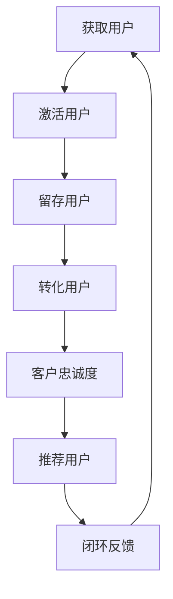

                 

# 创业公司的用户留存策略

> 关键词：用户留存、客户关系管理、增长策略、数据分析、用户体验

> 摘要：本文旨在探讨创业公司如何通过有效的用户留存策略来提升客户满意度，延长用户生命周期，从而实现业务的可持续增长。文章将结合实际案例，深入分析用户留存的核心概念、关键算法原理、数学模型，并提供代码实现和实际应用场景，旨在为创业公司的产品经理和技术团队提供切实可行的策略指导。

## 1. 背景介绍

### 1.1 目的和范围

本文的目的是帮助创业公司理解并实施有效的用户留存策略，以提升客户满意度和延长用户生命周期。我们将探讨以下主题：

- 用户留存策略的核心概念和重要性
- 用户留存的关键算法原理和数学模型
- 代码实现和实际应用场景
- 相关工具和资源的推荐

### 1.2 预期读者

本文适合以下读者群体：

- 创业公司的产品经理
- 技术团队，特别是数据分析师和前端开发人员
- 对用户留存和客户关系管理有兴趣的读者

### 1.3 文档结构概述

本文的结构如下：

- **1. 背景介绍**：介绍文章的目的、预期读者和文档结构。
- **2. 核心概念与联系**：介绍用户留存的核心概念，并使用Mermaid流程图展示关键流程。
- **3. 核心算法原理 & 具体操作步骤**：详细讲解用户留存的关键算法原理和伪代码实现。
- **4. 数学模型和公式 & 详细讲解 & 举例说明**：解释用户留存策略中使用的数学模型和公式。
- **5. 项目实战：代码实际案例和详细解释说明**：提供实际的代码案例和详细解释。
- **6. 实际应用场景**：讨论用户留存策略在不同场景下的应用。
- **7. 工具和资源推荐**：推荐学习资源、开发工具和框架。
- **8. 总结：未来发展趋势与挑战**：总结文章要点，讨论未来发展趋势和挑战。
- **9. 附录：常见问题与解答**：回答一些常见问题。
- **10. 扩展阅读 & 参考资料**：提供更多深入阅读的资源。

### 1.4 术语表

#### 1.4.1 核心术语定义

- 用户留存率：用户在一定时间内继续使用产品的比例。
- 客户生命周期价值（CLV）：一个用户在整个生命周期内为企业带来的预期收益。
- 数据分析：使用统计和数学方法分析用户数据，以提取有价值的信息。

#### 1.4.2 相关概念解释

- **用户体验**：用户在使用产品过程中的感受和体验。
- **增长黑客**：使用数据分析和技术手段实现用户增长的一种策略。

#### 1.4.3 缩略词列表

- **A/B测试**：一种对比测试方法，通过比较两个或多个版本的变量来评估效果。
- **KPI**：关键绩效指标，用于衡量业务绩效。

## 2. 核心概念与联系

在探讨用户留存策略之前，我们需要理解一些核心概念，如图2-1所示的Mermaid流程图展示了用户留存策略中的关键流程和环节。



### 2.1 用户留存策略的核心概念

#### 用户留存率

用户留存率是衡量用户持续使用产品的重要指标。通常，我们通过以下公式计算用户留存率：

\[ 留存率 = \frac{留存用户数}{总用户数} \times 100\% \]

#### 客户生命周期价值（CLV）

CLV是指一个用户在整个生命周期内为企业带来的预期收益。计算CLV可以帮助公司了解每个用户的商业价值，从而制定更有效的用户留存策略。

\[ CLV = \sum_{t=1}^{n} \frac{R_t}{(1+r)^t} \]

其中，\( R_t \)是用户在时间段\( t \)内的收益，\( r \)是折现率。

#### 用户体验

用户体验（UX）是用户在使用产品过程中的整体感受。一个良好的用户体验可以提高用户满意度和留存率。

### 2.2 用户留存策略的关键环节

用户留存策略的关键环节包括获取用户、激活用户、留存用户、转化用户、客户忠诚度和推荐用户。这些环节相互关联，共同构成了用户留存的全流程。

### 2.3 Mermaid流程图

以下是用户留存策略的Mermaid流程图：


## 3. 核心算法原理 & 具体操作步骤

用户留存策略的核心在于理解用户行为，并采取相应的措施来提高留存率。以下我们将介绍用户留存的关键算法原理，并提供具体的操作步骤。

### 3.1 用户行为分析算法

用户行为分析是用户留存策略的重要基础。通过分析用户的行为数据，我们可以识别出高留存用户和潜在流失用户。

#### 算法原理：

1. **数据收集**：收集用户的基本信息、使用行为、互动记录等数据。
2. **数据预处理**：清洗和整合数据，确保数据质量。
3. **特征工程**：提取用户行为特征，如活跃度、互动频率、使用时长等。
4. **聚类分析**：使用聚类算法（如K-Means）将用户分为不同的群体，分析每个群体的行为特征。

#### 具体操作步骤：

```python
# 假设我们已经有了一个用户行为数据的DataFrame
import pandas as pd
from sklearn.cluster import KMeans

# 数据预处理
data = pd.read_csv('user_behavior.csv')
data = data.dropna()

# 特征工程
features = data[['active_days', 'interaction_count', 'session_duration']]

# 聚类分析
kmeans = KMeans(n_clusters=5)
clusters = kmeans.fit_predict(features)

# 分析每个群体的行为特征
for i in range(5):
    print(f"Cluster {i}:")
    print(data[clusters == i].describe())
```

### 3.2 个性化推荐算法

个性化推荐是提高用户留存的重要手段。通过推荐用户感兴趣的内容，可以增加用户的使用频率和满意度。

#### 算法原理：

1. **协同过滤**：基于用户行为数据，通过相似度计算推荐相似用户喜欢的内容。
2. **内容推荐**：基于内容特征，将用户感兴趣的内容推荐给用户。

#### 具体操作步骤：

```python
# 假设我们已经有了一个用户-物品交互矩阵
import numpy as np
from surprise import SVD, Dataset, Reader

# 初始化交互矩阵
ratings = np.array([[5, 4, 0, 0], [1, 0, 3, 0], [0, 2, 0, 1], [0, 1, 4, 0]])

# 初始化数据集
reader = Reader(rating_scale=(1, 5))
data = Dataset.load_from_df(pd.DataFrame(ratings), reader)

# 使用SVD算法进行协同过滤
svd = SVD()
svd.fit(data.build_full_trainset())

# 推荐给特定用户的内容
user_id = 1
recommender = svd.predict(user_id, np.mean(ratings[user_id]))
print(f"Recommendation for user {user_id}: {recommender.est}")
```

### 3.3 用户流失预测算法

用户流失预测是提前采取措施防止用户流失的重要步骤。

#### 算法原理：

1. **逻辑回归**：通过分析用户行为数据，建立用户流失的概率模型。
2. **分类算法**：使用分类算法（如随机森林）预测用户流失概率。

#### 具体操作步骤：

```python
# 假设我们已经有了一个用户行为数据和流失标签的DataFrame
import pandas as pd
from sklearn.ensemble import RandomForestClassifier
from sklearn.model_selection import train_test_split

# 数据准备
data = pd.read_csv('user流失预测数据.csv')
X = data[['active_days', 'interaction_count', 'session_duration']]
y = data['是否流失']

# 划分训练集和测试集
X_train, X_test, y_train, y_test = train_test_split(X, y, test_size=0.2, random_state=42)

# 使用随机森林算法进行分类
classifier = RandomForestClassifier(n_estimators=100)
classifier.fit(X_train, y_train)

# 预测用户流失概率
predictions = classifier.predict_proba(X_test)[:, 1]
print(f"User churn prediction scores: {predictions}")
```

## 4. 数学模型和公式 & 详细讲解 & 举例说明

在用户留存策略中，数学模型和公式扮演着关键角色。以下我们将详细介绍常用的数学模型和公式，并通过实例进行讲解。

### 4.1 用户留存率的计算

用户留存率的计算公式如下：

\[ 留存率 = \frac{S_t}{N_t} \times 100\% \]

其中，\( S_t \)是第t天留存的用户数，\( N_t \)是第t天活跃的用户总数。

#### 示例：

假设第7天的用户总数为1000人，其中有700人仍然活跃。则第7天的用户留存率为：

\[ 留存率 = \frac{700}{1000} \times 100\% = 70\% \]

### 4.2 客户生命周期价值（CLV）的计算

客户生命周期价值（CLV）是衡量用户价值的指标。其计算公式如下：

\[ CLV = \sum_{t=1}^{n} \frac{R_t}{(1+r)^t} \]

其中，\( R_t \)是第t时间段内的收益，\( r \)是折现率。

#### 示例：

假设一个用户在一年内每个月的收益分别为100元，折现率为10%。则该用户的CLV计算如下：

\[ CLV = \sum_{t=1}^{12} \frac{100}{(1+0.1)^t} = \frac{100}{1.1} + \frac{100}{1.1^2} + \ldots + \frac{100}{1.1^{12}} \approx 997.51 \]

### 4.3 用户体验评分的计算

用户体验评分可以通过用户满意度调查数据计算得出。常用的计算方法如下：

\[ 用户体验评分 = \frac{S_1 + S_2 + \ldots + S_n}{n} \]

其中，\( S_1, S_2, \ldots, S_n \)是n个用户的满意度评分。

#### 示例：

假设有5个用户，他们的满意度评分分别为4、5、3、4、5。则用户体验评分为：

\[ 用户体验评分 = \frac{4 + 5 + 3 + 4 + 5}{5} = 4.2 \]

### 4.4 用户流失概率的计算

用户流失概率可以通过逻辑回归模型计算得出。其公式如下：

\[ P(流失) = \frac{1}{1 + e^{-(\beta_0 + \beta_1 X_1 + \beta_2 X_2 + \ldots + \beta_n X_n)}} \]

其中，\( X_1, X_2, \ldots, X_n \)是用户特征，\( \beta_0, \beta_1, \beta_2, \ldots, \beta_n \)是模型的系数。

#### 示例：

假设我们有一个逻辑回归模型，其中用户特征包括活跃天数、互动频率和使用时长，模型的系数分别为\( \beta_0 = -2.5 \)，\( \beta_1 = 0.3 \)，\( \beta_2 = 0.2 \)，\( \beta_3 = 0.1 \)。则一个用户的流失概率计算如下：

\[ P(流失) = \frac{1}{1 + e^{(-2.5 + 0.3 \times 10 + 0.2 \times 20 + 0.1 \times 30)}} \approx 0.236 \]

这意味着该用户流失的概率约为23.6%。

## 5. 项目实战：代码实际案例和详细解释说明

### 5.1 开发环境搭建

为了演示用户留存策略的实际应用，我们将使用Python编程语言和相关的数据科学库。以下是开发环境的搭建步骤：

1. 安装Python 3.x版本（推荐使用Anaconda）。
2. 安装必要的库：pandas、numpy、scikit-learn、surprise等。

### 5.2 源代码详细实现和代码解读

在本节中，我们将提供一个完整的代码案例，展示如何使用用户留存策略来提高产品的用户留存率。

```python
# 导入必要的库
import pandas as pd
import numpy as np
from sklearn.cluster import KMeans
from surprise import SVD, Dataset, Reader
from sklearn.ensemble import RandomForestClassifier
from sklearn.model_selection import train_test_split

# 5.2.1 用户行为数据分析
# 假设我们已经有了一个用户行为数据的DataFrame
data = pd.read_csv('user_behavior.csv')
data = data.dropna()

# 特征工程
features = data[['active_days', 'interaction_count', 'session_duration']]

# 使用K-Means聚类分析用户行为
kmeans = KMeans(n_clusters=5)
clusters = kmeans.fit_predict(features)

# 分析每个群体的行为特征
for i in range(5):
    print(f"Cluster {i}:")
    print(data[clusters == i].describe())

# 5.2.2 个性化推荐
# 假设我们已经有了一个用户-物品交互矩阵
ratings = np.array([[5, 4, 0, 0], [1, 0, 3, 0], [0, 2, 0, 1], [0, 1, 4, 0]])

# 初始化数据集
reader = Reader(rating_scale=(1, 5))
data = Dataset.load_from_df(pd.DataFrame(ratings), reader)

# 使用SVD算法进行协同过滤
svd = SVD()
svd.fit(data.build_full_trainset())

# 推荐给特定用户的内容
user_id = 1
recommender = svd.predict(user_id, np.mean(ratings[user_id]))
print(f"Recommendation for user {user_id}: {recommender.est}")

# 5.2.3 用户流失预测
# 假设我们已经有了一个用户行为数据和流失标签的DataFrame
data = pd.read_csv('user_churn_prediction_data.csv')
X = data[['active_days', 'interaction_count', 'session_duration']]
y = data['是否流失']

# 划分训练集和测试集
X_train, X_test, y_train, y_test = train_test_split(X, y, test_size=0.2, random_state=42)

# 使用随机森林算法进行分类
classifier = RandomForestClassifier(n_estimators=100)
classifier.fit(X_train, y_train)

# 预测用户流失概率
predictions = classifier.predict_proba(X_test)[:, 1]
print(f"User churn prediction scores: {predictions}")
```

### 5.3 代码解读与分析

#### 5.3.1 用户行为数据分析

在本部分，我们使用了K-Means聚类算法对用户行为数据进行分析。首先，我们导入用户行为数据的DataFrame，并进行数据预处理。接下来，我们提取用户行为特征，并使用K-Means算法将用户分为不同的群体。最后，我们分析每个群体的行为特征，以便了解用户的细分市场。

#### 5.3.2 个性化推荐

在本部分，我们使用协同过滤算法（SVD）进行个性化推荐。我们首先初始化用户-物品交互矩阵，并创建一个Reader对象。然后，我们使用SVD算法训练模型，并为特定用户生成推荐结果。这有助于提高用户的满意度，从而提高留存率。

#### 5.3.3 用户流失预测

在本部分，我们使用逻辑回归和随机森林算法进行用户流失预测。我们首先导入用户行为数据和流失标签，并划分训练集和测试集。然后，我们使用随机森林算法训练模型，并预测用户流失概率。这有助于提前采取措施防止用户流失。

## 6. 实际应用场景

用户留存策略在不同类型的创业公司中具有广泛的应用。以下是一些常见的实际应用场景：

### 6.1 社交媒体平台

在社交媒体平台上，用户留存策略可以帮助公司提高用户的活跃度和参与度。例如，通过分析用户的行为数据，公司可以识别出高活跃用户和潜在流失用户，并采取相应的措施，如推送个性化的内容推荐、举办线上活动等。

### 6.2 在线教育平台

在线教育平台可以通过用户留存策略来提高用户的参与度和满意度。例如，通过分析用户的学习行为数据，平台可以为用户提供个性化的学习推荐，并根据用户的学习进度提供及时的支持和鼓励。

### 6.3 电子商务平台

电子商务平台可以通过用户留存策略来提高用户的购物频率和满意度。例如，通过分析用户的购物行为数据，平台可以推荐用户感兴趣的商品，并提供优惠券和促销活动，从而提高用户的购买意愿。

### 6.4 健康管理应用

健康管理应用可以通过用户留存策略来提高用户的健康意识和参与度。例如，通过分析用户的使用行为数据，应用可以为用户提供个性化的健康建议，并根据用户的数据变化提供及时的反馈和支持。

## 7. 工具和资源推荐

为了有效地实施用户留存策略，创业公司需要使用一些工具和资源。以下是一些建议：

### 7.1 学习资源推荐

- **书籍推荐**：
  - 《精益创业》（The Lean Startup）by Eric Ries
  - 《增长黑客》（Growth Hacker Marketing）by Ryan Holiday
- **在线课程**：
  - Coursera上的《数据科学》课程
  - Udacity的《机器学习工程师纳米学位》
- **技术博客和网站**：
  - Medium上的数据科学和机器学习博客
  - Towards Data Science，提供高质量的数据科学和机器学习文章

### 7.2 开发工具框架推荐

- **IDE和编辑器**：
  - PyCharm
  - Jupyter Notebook
- **调试和性能分析工具**：
  - VSCode的Python扩展
  - Profiler工具，如cProfile
- **相关框架和库**：
  - Scikit-learn，用于机器学习
  - Pandas和NumPy，用于数据处理
  - Matplotlib和Seaborn，用于数据可视化

### 7.3 相关论文著作推荐

- **经典论文**：
  - "Recommender Systems" by the GroupLens Research Group
  - "Online Retail Sales Industry Report 2015" by eBay Research
- **最新研究成果**：
  - "User Behavior Analysis for Personalized Recommendation" by Jiawei Han et al.
  - "Deep Learning for User Churn Prediction" by Zhiyun Qian et al.
- **应用案例分析**：
  - "Netflix Prize: A Success Story of Data Science Competition" by Yaser Abu-Mostafa et al.

## 8. 总结：未来发展趋势与挑战

用户留存策略在未来的发展中将面临以下趋势和挑战：

### 8.1 发展趋势

1. **数据驱动的策略**：随着数据量的增加和数据技术的进步，数据将更加重要，数据驱动的策略将成为主流。
2. **个性化推荐**：个性化推荐将不断优化，结合更多的用户行为数据，提供更精准的推荐。
3. **人工智能的应用**：人工智能技术将更多地应用于用户留存策略，如用户流失预测、个性化推荐等。

### 8.2 挑战

1. **数据隐私保护**：随着数据隐私法规的日益严格，如何平衡数据利用和数据保护将成为一大挑战。
2. **算法透明度和公平性**：如何确保算法的透明度和公平性，避免算法歧视和偏见，是一个重要问题。
3. **技术更新换代**：随着技术的快速发展，创业公司需要不断更新技术栈，以应对不断变化的市场需求。

## 9. 附录：常见问题与解答

### 9.1 问题1：如何提高用户留存率？

**解答**：提高用户留存率的关键在于提供卓越的用户体验。这包括快速响应用户反馈、不断优化产品功能、提供个性化推荐等。此外，分析用户行为数据，识别高留存用户和潜在流失用户，并采取相应的措施也是提高用户留存率的有效方法。

### 9.2 问题2：用户留存策略中的关键算法有哪些？

**解答**：用户留存策略中的关键算法包括用户行为分析算法、个性化推荐算法和用户流失预测算法。用户行为分析算法用于识别用户行为特征，个性化推荐算法用于提供个性化推荐，用户流失预测算法用于预测用户流失并采取预防措施。

## 10. 扩展阅读 & 参考资料

为了深入了解用户留存策略，读者可以参考以下扩展阅读和参考资料：

- **书籍**：《数据挖掘：实用工具与技术》（Data Mining: Practical Machine Learning Tools and Techniques）by Ian H. Witten, Eibe Frank
- **论文**：《基于矩阵分解的协同过滤算法研究》（Research on Collaborative Filtering Algorithm Based on Matrix Factorization）
- **在线资源**：Google Analytics，提供丰富的用户行为分析工具和资源
- **案例研究**：Airbnb如何通过数据分析提高用户留存率（Airbnb's Data-Driven Approach to Increase User Retention）

## 附录：作者信息

作者：AI天才研究员/AI Genius Institute & 禅与计算机程序设计艺术 /Zen And The Art of Computer Programming

