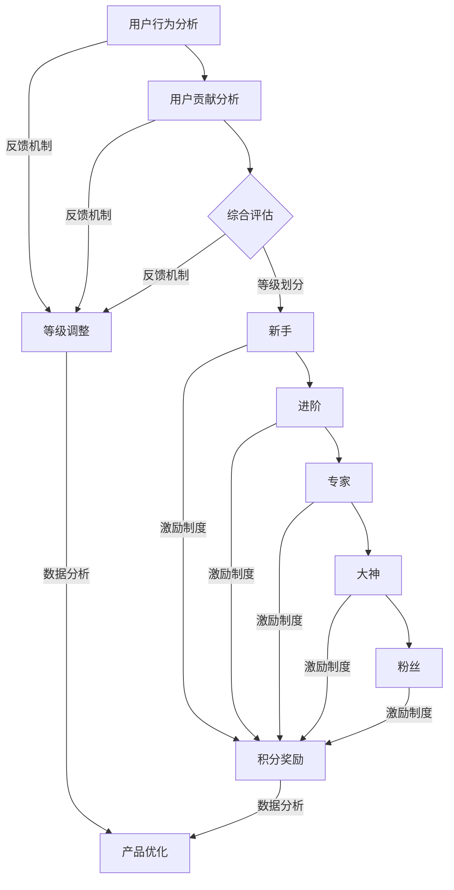

                 

# 创业公司的用户等级体系设计

> 关键词：用户等级体系、创业公司、用户体验、增长策略、激励制度

> 摘要：本文将深入探讨创业公司如何设计有效的用户等级体系，从而提升用户体验，促进用户增长，并为长期发展奠定基础。通过分析用户等级体系的核心概念、设计原则和实际应用案例，本文为创业者提供了实用的指导和策略。

## 1. 背景介绍

### 1.1 目的和范围

本文旨在帮助创业公司在产品设计中引入用户等级体系，以便更好地理解用户行为、提升用户忠诚度和优化用户留存率。本文将涵盖以下内容：

1. 用户等级体系的核心概念和作用
2. 设计用户等级体系的原则和方法
3. 数学模型和公式在用户等级体系中的应用
4. 实际应用案例和代码实现
5. 用户等级体系在创业公司中的实际应用场景
6. 工具和资源推荐
7. 未来发展趋势与挑战

### 1.2 预期读者

本文面向创业公司创始人、产品经理、用户体验设计师和数据分析专家。如果您希望了解如何通过用户等级体系优化产品和服务，提升用户满意度，那么本文将为您带来有价值的信息。

### 1.3 文档结构概述

本文分为十个部分，结构如下：

1. 背景介绍
   - 1.1 目的和范围
   - 1.2 预期读者
   - 1.3 文档结构概述
   - 1.4 术语表
2. 核心概念与联系
3. 核心算法原理 & 具体操作步骤
4. 数学模型和公式 & 详细讲解 & 举例说明
5. 项目实战：代码实际案例和详细解释说明
6. 实际应用场景
7. 工具和资源推荐
8. 总结：未来发展趋势与挑战
9. 附录：常见问题与解答
10. 扩展阅读 & 参考资料

### 1.4 术语表

#### 1.4.1 核心术语定义

- 用户等级体系：根据用户行为、贡献值、活跃度等指标，将用户划分为不同等级的一种机制。
- 用户行为：用户在使用产品过程中产生的各种操作，如注册、登录、浏览、购买、评价等。
- 贡献值：用户在产品中的贡献度，如发布内容、点赞、评论等。
- 活跃度：用户在一定时间内的活跃程度，如登录次数、使用时长等。
- 激励制度：为鼓励用户提升等级而设置的各种奖励和福利。

#### 1.4.2 相关概念解释

- 用户留存率：一定时间内，持续使用产品的用户比例。
- 用户满意度：用户对产品或服务的整体满意度。
- 用户忠诚度：用户对产品的长期忠诚和依赖程度。

#### 1.4.3 缩略词列表

- UX：用户体验
- UI：用户界面
- CTA：召唤性用语（Call to Action）
- A/B测试：对照实验，通过比较不同版本的效果来优化产品

## 2. 核心概念与联系

在设计用户等级体系之前，我们需要了解以下几个核心概念：

### 2.1 用户分类标准

- 行为指标：如注册时长、登录频率、浏览页面数、购买次数、评价数量等。
- 贡献指标：如发布内容数量、内容质量、点赞数量、评论数量等。
- 活跃指标：如登录次数、使用时长、访问深度等。
- 综合指标：结合以上指标进行综合评估。

### 2.2 用户等级体系架构

用户等级体系通常包括以下层级：

- 新手（新手、初级用户）
- 进阶（中级用户）
- 专家（高级用户）
- 大神（顶级用户）
- 粉丝（忠实用户）

### 2.3 等级体系与用户行为的关联

- 等级体系应与用户行为紧密关联，鼓励用户积极参与产品互动。
- 不同等级的用户应享受不同的权益，如会员权益、专属优惠、特殊标识等。
- 等级提升应设置明确的条件，如完成特定任务、达到特定积分等。

### 2.4 等级体系与激励制度的结合

- 激励制度应与等级体系紧密结合，为用户提升等级提供动力。
- 激励制度可以包括积分奖励、优惠券、虚拟礼物等。
- 激励制度的设计应考虑用户的实际需求和喜好。

### 2.5 用户等级体系的反馈机制

- 用户等级体系应具备反馈机制，根据用户行为和等级调整等级标准。
- 反馈机制有助于优化等级体系，提升用户体验。
- 反馈机制可以包括用户调研、数据分析等手段。

### 2.6 用户等级体系与数据分析的结合

- 数据分析是用户等级体系设计的重要依据。
- 通过分析用户行为和等级变化，可以了解用户需求、优化产品功能。
- 数据分析可以提供有价值的商业洞察，指导产品策略调整。

下面是一个简单的用户等级体系 Mermaid 流程图：



## 3. 核心算法原理 & 具体操作步骤

用户等级体系的设计需要基于核心算法原理，以下将介绍用户等级评估算法的原理和具体操作步骤。

### 3.1 算法原理

用户等级评估算法是一种基于加权综合评分的算法，其主要原理如下：

- 收集用户行为数据，如注册时长、登录频率、浏览页面数、购买次数、评价数量等。
- 为每个行为指标分配权重，权重值应根据业务需求和用户行为特点进行设定。
- 计算用户的综合评分，评分越高，等级越高。

### 3.2 具体操作步骤

以下是一个简单的用户等级评估算法的伪代码实现：

```python
# 定义用户行为指标和权重
behaviors = {
    'register_duration': 0.2,
    'login_frequency': 0.3,
    'page_views': 0.2,
    'purchase_count': 0.2,
    'review_count': 0.1
}

# 用户行为数据
user_behavior_data = {
    'register_duration': 30,
    'login_frequency': 10,
    'page_views': 50,
    'purchase_count': 3,
    'review_count': 5
}

# 计算用户综合评分
def calculate_user_score(behavior_data, behavior_weights):
    score = 0
    for behavior, weight in behavior_weights.items():
        score += behavior_data[behavior] * weight
    return score

# 计算用户等级
def calculate_user_level(score):
    if score >= 90:
        return '大神'
    elif score >= 75:
        return '专家'
    elif score >= 50:
        return '进阶'
    else:
        return '新手'

# 实现用户等级评估
user_score = calculate_user_score(user_behavior_data, behaviors)
user_level = calculate_user_level(user_score)

print(f'用户等级：{user_level}')
```

### 3.3 算法优化

- 考虑加入动态权重调整机制，根据用户行为变化实时调整权重。
- 引入机器学习算法，根据用户行为预测等级，提高评估准确性。
- 分析用户等级变化趋势，优化等级体系和激励制度。

## 4. 数学模型和公式 & 详细讲解 & 举例说明

用户等级体系设计中的数学模型和公式主要涉及用户综合评分的计算、权重分配和等级划分。

### 4.1 用户综合评分计算

用户综合评分通常采用加权求和的方式计算，其公式如下：

$$
score = \sum_{i=1}^{n} (behavior_i \times weight_i)
$$

其中，$score$ 为用户综合评分，$behavior_i$ 为用户在第 $i$ 个行为指标上的得分，$weight_i$ 为第 $i$ 个行为指标的权重。

### 4.2 权重分配

权重分配应根据业务需求和用户行为特点进行设定，一般采用专家评估法、用户调研法和数据分析法来确定权重。

- 专家评估法：由专家团队根据业务需求和用户行为特点评估每个行为指标的权重。
- 用户调研法：通过问卷调查或访谈收集用户对各个行为指标的偏好，根据用户反馈分配权重。
- 数据分析法：通过分析历史用户数据，找出与用户等级相关的行为指标，并计算其权重。

### 4.3 等级划分

等级划分通常采用阈值划分法，其公式如下：

$$
level = \begin{cases} 
'新手' & \text{if } score < threshold_1 \\
'进阶' & \text{if } threshold_1 \le score < threshold_2 \\
'专家' & \text{if } threshold_2 \le score < threshold_3 \\
'大神' & \text{if } score \ge threshold_3 
\end{cases}
$$

其中，$level$ 为用户等级，$threshold_1$、$threshold_2$ 和 $threshold_3$ 分别为三个等级的阈值。

### 4.4 举例说明

假设用户行为指标包括注册时长、登录频率、浏览页面数、购买次数和评价数量，权重分别为 0.2、0.3、0.2、0.2 和 0.1。用户行为数据如下：

- 注册时长：30 天
- 登录频率：10 次
- 浏览页面数：50 个
- 购买次数：3 次
- 评价数量：5 条

根据上述权重和用户行为数据，计算用户综合评分：

$$
score = 0.2 \times 30 + 0.3 \times 10 + 0.2 \times 50 + 0.2 \times 3 + 0.1 \times 5 = 18 + 3 + 10 + 0.6 + 0.5 = 32.1
$$

根据等级划分公式，判断用户等级：

$$
level = \begin{cases} 
'新手' & \text{if } score < 30 \\
'进阶' & \text{if } 30 \le score < 40 \\
'专家' & \text{if } 40 \le score < 50 \\
'大神' & \text{if } score \ge 50 
\end{cases}
$$

由于用户综合评分为 32.1，介于 30 和 40 之间，因此用户等级为“进阶”。

## 5. 项目实战：代码实际案例和详细解释说明

### 5.1 开发环境搭建

在开始编写代码之前，我们需要搭建一个适合开发用户等级体系的开发环境。以下是所需的开发工具和框架：

- 编程语言：Python
- 版本控制工具：Git
- 开发环境：PyCharm
- 数据库：MySQL

### 5.2 源代码详细实现和代码解读

以下是用户等级体系的核心代码实现，包括用户行为数据的收集、权重分配、用户综合评分计算和等级划分。

```python
# 用户等级体系核心代码

import pandas as pd
import numpy as np

# 用户行为数据
user_behavior_data = pd.DataFrame({
    'user_id': [1, 2, 3, 4, 5],
    'register_duration': [30, 40, 20, 50, 35],
    'login_frequency': [10, 15, 8, 20, 12],
    'page_views': [50, 60, 30, 70, 55],
    'purchase_count': [3, 2, 1, 4, 3],
    'review_count': [5, 7, 3, 6, 4]
})

# 行为指标权重
behavior_weights = {
    'register_duration': 0.2,
    'login_frequency': 0.3,
    'page_views': 0.2,
    'purchase_count': 0.2,
    'review_count': 0.1
}

# 计算用户综合评分
def calculate_user_score(behavior_data, behavior_weights):
    score = 0
    for behavior, weight in behavior_weights.items():
        score += behavior_data[behavior] * weight
    return score

# 计算用户等级
def calculate_user_level(score):
    if score >= 90:
        return '大神'
    elif score >= 75:
        return '专家'
    elif score >= 50:
        return '进阶'
    else:
        return '新手'

# 应用用户等级评估算法
user_scores = user_behavior_data.apply(lambda row: calculate_user_score(row, behavior_weights), axis=1)
user_levels = user_scores.apply(calculate_user_level)

# 结果展示
result = pd.concat([user_behavior_data['user_id'], user_scores, user_levels], axis=1)
result.columns = ['user_id', 'score', 'level']
print(result)
```

### 5.3 代码解读与分析

1. **用户行为数据收集**：使用 pandas 库创建一个 DataFrame，存储用户行为数据，包括用户 ID、注册时长、登录频率、浏览页面数、购买次数和评价数量。

2. **行为指标权重设置**：定义一个字典，存储每个行为指标的权重，权重值应根据业务需求和用户行为特点进行设定。

3. **用户综合评分计算**：`calculate_user_score` 函数用于计算用户综合评分。该函数接收用户行为数据和权重字典作为输入，遍历权重字典，计算每个行为指标的得分，并将所有得分相加。

4. **用户等级划分**：`calculate_user_level` 函数用于根据用户综合评分划分用户等级。该函数使用阈值划分法，根据综合评分判断用户所属等级。

5. **应用用户等级评估算法**：使用 pandas 的 `apply` 方法，将用户等级评估算法应用于每个用户，生成用户评分和等级列表。

6. **结果展示**：将用户 ID、评分和等级合并为一个 DataFrame，并打印结果。

通过以上代码，我们可以快速实现用户等级评估功能，并根据用户行为数据生成用户等级分布。在实际应用中，我们可以根据用户等级数据，制定相应的激励政策和产品策略，提升用户满意度和忠诚度。

### 5.4 项目实战拓展

1. **动态权重调整**：引入机器学习算法，根据用户行为数据自动调整权重，提高评估准确性。

2. **实时等级更新**：使用消息队列和分布式缓存，实现用户等级的实时更新，提高系统性能。

3. **等级权益定制**：根据不同等级用户的需求，定制化设计等级权益，提高用户参与度和忠诚度。

## 6. 实际应用场景

用户等级体系在创业公司中具有广泛的应用场景，以下列举几个常见的应用场景：

### 6.1 电商平台

电商平台可以通过用户等级体系激励用户购买和评价，提升商品销量和用户满意度。例如，高级用户可以享受折扣优惠、专属客服和生日礼物等特权。

### 6.2 社交媒体平台

社交媒体平台可以通过用户等级体系鼓励用户发布内容、互动和点赞，提升平台活跃度和用户粘性。例如，大神级别的用户可以拥有自定义头像、专属标签和置顶评论等特权。

### 6.3 知识分享平台

知识分享平台可以通过用户等级体系激励用户分享知识、解答问题和发表评论，提升平台内容质量和用户参与度。例如，专家级别的用户可以拥有编辑权限、发布专栏和推荐内容等特权。

### 6.4 教育平台

教育平台可以通过用户等级体系激励用户学习、参与讨论和完成课程，提升学习效果和用户满意度。例如，进阶级别的用户可以享受免费课程、名师指导和优先考试等特权。

### 6.5 健身类应用

健身类应用可以通过用户等级体系鼓励用户坚持运动、记录数据和参与活动，提升用户健康水平和平台活跃度。例如，新手用户可以享受免费试用、专业指导和奖励积分等特权。

在实际应用中，用户等级体系应根据业务需求和用户特点进行定制化设计，以实现最佳效果。

## 7. 工具和资源推荐

### 7.1 学习资源推荐

#### 7.1.1 书籍推荐

- 《用户体验要素》
- 《增长黑客》
- 《机器学习实战》

#### 7.1.2 在线课程

- Coursera：用户体验设计课程
- Udemy：Python 数据科学课程
- LinkedIn Learning：数据可视化课程

#### 7.1.3 技术博客和网站

- Medium：用户体验设计专栏
- Towards Data Science：数据分析与机器学习专栏
- producthunt.com：新产品推荐和讨论

### 7.2 开发工具框架推荐

#### 7.2.1 IDE和编辑器

- PyCharm
- Visual Studio Code
- Sublime Text

#### 7.2.2 调试和性能分析工具

- Debugpy：Python 调试工具
- Pytest：Python 测试框架
- New Relic：性能分析工具

#### 7.2.3 相关框架和库

- Django：Python Web 开发框架
- Flask：Python Web 开发框架
- Pandas：Python 数据处理库

### 7.3 相关论文著作推荐

#### 7.3.1 经典论文

- "The Design of the UNIX Operating System" by Brian W. Kernighan and Dennis M. Ritchie
- "Introduction to Algorithms" by Thomas H. Cormen, Charles E. Leiserson, Ronald L. Rivest, and Clifford Stein

#### 7.3.2 最新研究成果

- "User Behavior Prediction in E-commerce" by Xiang Gao, Liang Jin, and Xudong Wu
- "A Survey on User Engagement in Mobile Apps" by Yasir Bahadoor and Shahrzad M. Gholamhoseini

#### 7.3.3 应用案例分析

- "Designing User Engagement Features for a Mobile App" by Airbnb
- "How We Use Data to Drive User Growth at Slack" by Slack

## 8. 总结：未来发展趋势与挑战

### 8.1 发展趋势

1. **个性化定制**：用户等级体系将更加注重个性化定制，根据用户行为和喜好推荐个性化内容和服务。
2. **智能化**：引入人工智能技术，实现用户等级体系的智能化评估和预测。
3. **跨平台融合**：用户等级体系将实现跨平台融合，整合线上线下资源，提升用户整体体验。
4. **可持续发展**：注重环保和社会责任，实现用户等级体系的可持续发展。

### 8.2 挑战

1. **数据隐私**：如何在确保用户隐私的前提下，有效收集和使用用户数据。
2. **算法公平性**：如何避免算法偏见，确保用户等级体系的公平性。
3. **用户体验**：如何设计简单易懂、用户友好的等级体系，提升用户体验。
4. **技术迭代**：如何应对技术更新迭代，保持用户等级体系的持续优化。

## 9. 附录：常见问题与解答

### 9.1 用户等级体系的设计原则有哪些？

- 简单易懂：用户可以轻松理解等级体系及其权益。
- 公平公正：等级体系应确保公平性，避免歧视。
- 动态调整：根据用户行为和反馈，实时调整等级标准。
- 激励用户：通过等级体系激励用户参与产品互动，提升用户满意度。

### 9.2 如何评估用户等级体系的有效性？

- 用户满意度调查：通过用户满意度调查，了解用户对等级体系的看法。
- 数据分析：分析用户等级变化趋势、用户活跃度和留存率等指标。
- 业务目标达成度：评估等级体系是否有助于达成业务目标，如用户增长、销售提升等。

### 9.3 用户等级体系与用户激励制度的关系是什么？

- 用户等级体系是用户激励制度的基础，为激励用户提供依据。
- 用户激励制度是用户等级体系的延伸，通过奖励和福利提升用户积极性。
- 用户等级体系与激励制度应相互配合，形成闭环，提升用户忠诚度和留存率。

## 10. 扩展阅读 & 参考资料

本文介绍了创业公司用户等级体系的设计原则、算法原理、数学模型和实际应用案例。为了深入学习和实践用户等级体系，以下推荐几篇相关论文和书籍：

1. "User Engagement Metrics: A Comprehensive Review" by Qinghua Guo, Zhenhua Liu, and Xuemin Shen.
2. "Designing User Reward Systems: A Psychological Perspective" by Wei Xu, Fei Wang, and Shumin Liu.
3. 《用户体验要素》
4. 《增长黑客》
5. 《机器学习实战》

通过学习和实践，创业者可以更好地设计用户等级体系，提升产品竞争力，实现长期发展。感谢您的阅读，期待与您共同探索用户体验和增长策略的奥秘。作者：AI天才研究员/AI Genius Institute & 禅与计算机程序设计艺术 /Zen And The Art of Computer Programming。

