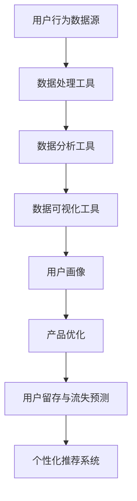

                 

# 创业公司的用户行为分析工具选择

## 概述

### 关键词
- 创业公司
- 用户行为分析
- 工具选择
- 数据处理
- 算法原理
- 实际应用场景

### 摘要
本文旨在为创业公司提供一套清晰的指南，以帮助它们在众多用户行为分析工具中做出最佳选择。我们将从目的和范围、预期读者、文档结构概述等方面展开，深入探讨核心概念、算法原理、数学模型及实际应用场景，最后推荐学习资源、开发工具和最新研究成果，以期为创业公司的用户行为分析提供有力支持。

## 1. 背景介绍

### 1.1 目的和范围

本文的主要目的是帮助创业公司理解和评估不同用户行为分析工具的优劣，以便选择最适合其业务需求和技术水平的工具。我们将重点关注以下范围：

- 用户行为分析的基本概念和重要性
- 不同用户行为分析工具的特点、优劣及适用场景
- 创业公司选择用户行为分析工具的关键因素
- 实际应用案例和解决方案的推荐

### 1.2 预期读者

本文适用于以下读者群体：

- 创业公司创始人、产品经理、数据分析师
- 对用户行为分析有兴趣的技术人员和管理者
- 想要深入了解用户行为分析领域的学术研究者

### 1.3 文档结构概述

本文将分为以下几大部分：

- 1.4 术语表
- 2. 核心概念与联系
- 3. 核心算法原理 & 具体操作步骤
- 4. 数学模型和公式 & 详细讲解 & 举例说明
- 5. 项目实战：代码实际案例和详细解释说明
- 6. 实际应用场景
- 7. 工具和资源推荐
- 8. 总结：未来发展趋势与挑战
- 9. 附录：常见问题与解答
- 10. 扩展阅读 & 参考资料

### 1.4 术语表

#### 1.4.1 核心术语定义

- 用户行为分析：指通过收集、处理和分析用户在网站、应用或其他数字平台上的行为数据，以了解用户需求、兴趣和偏好，进而优化产品和服务。
- 数据源：指提供用户行为数据的原始数据来源，如网站日志、API 调用日志、用户交互数据等。
- 数据处理：指对原始数据进行清洗、转换、整合等操作，以获得高质量的数据集。
- 数据可视化：指通过图表、图形等形式将数据分析结果呈现给用户，帮助其更好地理解和应用数据。
- 算法：指用于处理和分析数据的一组规则或步骤，如聚类、分类、回归等。

#### 1.4.2 相关概念解释

- 用户体验（UX）：指用户在使用产品或服务时所感受到的整体感受，包括交互、视觉设计、功能性和易用性等方面。
- 用户留存率：指在一定时间内，持续使用产品或服务的用户占首次使用产品或服务的用户总数的比例。
- 用户流失率：指在一定时间内，停止使用产品或服务的用户占首次使用产品或服务的用户总数的比例。
- 转化率：指在一定时间内，完成特定目标（如注册、购买、下载等）的用户占访问者总数的比例。

#### 1.4.3 缩略词列表

- API：应用程序编程接口
- SDK：软件开发工具包
- BI：商业智能
- NLP：自然语言处理
- ML：机器学习
- AI：人工智能

## 2. 核心概念与联系

为了更好地理解用户行为分析工具，我们需要掌握以下核心概念和它们之间的联系。

### 2.1 用户行为分析基本概念

用户行为分析主要涉及以下基本概念：

1. **用户行为数据**：包括用户在数字平台上的点击、浏览、搜索、分享、评论、购买等行为数据。
2. **用户画像**：通过对用户行为数据进行处理和分析，生成用户的基本属性、兴趣偏好、行为特征等，形成一个多维度的用户模型。
3. **数据分析**：对用户行为数据进行分析和处理，提取有价值的信息和规律，如用户留存率、转化率、流失率等。
4. **数据可视化**：将数据分析结果以图表、图形等形式展示，帮助用户更好地理解和应用数据。

### 2.2 用户行为分析工具分类及特点

用户行为分析工具主要分为以下几类：

1. **日志分析工具**：如 Google Analytics、Matomo、Piwik 等，主要基于网站或应用的日志数据进行数据分析。
   - 特点：数据处理能力强，支持多维数据分析和数据可视化。
   - 适用场景：适用于网站和应用的用户行为分析。

2. **API 数据分析工具**：如 Mixpanel、Amplitude、Segment 等，主要基于 API 调用日志和用户交互数据进行分析。
   - 特点：数据处理速度快，支持实时分析和个性化推荐。
   - 适用场景：适用于移动应用和游戏等实时性要求较高的场景。

3. **用户行为挖掘工具**：如用户行为挖掘系统（UBM）、用户轨迹挖掘系统（UTM）等，主要基于深度学习算法和图模型对用户行为进行挖掘和分析。
   - 特点：能够挖掘出深层次的用户行为规律和模式。
   - 适用场景：适用于复杂场景下的用户行为分析和预测。

### 2.3 用户行为分析工具的关联关系

用户行为分析工具之间的关系如图 1 所示：



图 1：用户行为分析工具的关联关系

- 用户行为数据源：提供原始的用户行为数据。
- 数据处理工具：对原始数据进行清洗、转换、整合等操作，生成高质量的数据集。
- 数据分析工具：对数据集进行分析和处理，提取有价值的信息和规律。
- 数据可视化工具：将数据分析结果以图表、图形等形式展示，帮助用户更好地理解和应用数据。
- 用户画像：通过对数据分析结果进行处理和分析，生成用户的基本属性、兴趣偏好、行为特征等，形成一个多维度的用户模型。
- 产品优化：根据用户画像和数据分析结果，优化产品和服务，提高用户体验和留存率。
- 用户留存与流失预测：基于用户行为数据和用户画像，预测用户的留存和流失情况，为产品优化提供决策支持。
- 个性化推荐系统：根据用户画像和用户行为数据，为用户提供个性化的推荐内容，提高用户满意度和转化率。

## 3. 核心算法原理 & 具体操作步骤

### 3.1 用户行为分析算法原理

用户行为分析算法主要基于以下原理：

1. **机器学习算法**：如聚类、分类、回归等，用于从用户行为数据中提取有价值的信息和规律。
2. **深度学习算法**：如卷积神经网络（CNN）、循环神经网络（RNN）、图神经网络（GNN）等，用于处理大规模用户行为数据，挖掘深层次的用户行为规律。
3. **自然语言处理（NLP）算法**：用于处理和分析用户生成的文本数据，如评论、搜索关键词等。

### 3.2 用户行为分析算法具体操作步骤

以下是用户行为分析算法的具体操作步骤：

1. **数据收集**：从数据源收集用户行为数据，如网站日志、API 调用日志、用户交互数据等。

2. **数据预处理**：对原始数据进行清洗、去重、去噪等处理，生成高质量的数据集。

3. **特征提取**：从数据集中提取有用的特征，如用户年龄、性别、地域、兴趣爱好等。

4. **模型训练**：选择合适的机器学习或深度学习算法，对数据集进行训练，得到一个预测模型。

5. **模型评估**：使用评估指标（如准确率、召回率、F1 分数等）对模型进行评估，确保其具有良好的性能。

6. **模型部署**：将训练好的模型部署到生产环境中，对实时用户行为数据进行预测和分析。

7. **结果可视化**：将分析结果以图表、图形等形式展示，帮助用户更好地理解和应用数据。

### 3.3 伪代码示例

以下是一个简单的用户行为分析算法的伪代码示例：

```python
# 数据收集
data = collect_user_behavior_data()

# 数据预处理
clean_data = preprocess_data(data)

# 特征提取
features = extract_features(clean_data)

# 模型训练
model = train_model(features)

# 模型评估
evaluate_model(model)

# 模型部署
deploy_model(model)

# 结果可视化
visualize_results(model)
```

## 4. 数学模型和公式 & 详细讲解 & 举例说明

### 4.1 数学模型和公式

用户行为分析中常用的数学模型和公式包括：

1. **贝叶斯公式**：用于计算用户对特定事件的概率。
   $$ P(A|B) = \frac{P(B|A) \cdot P(A)}{P(B)} $$
2. **决策树**：用于对用户行为进行分类。
   $$ G(x) = \sum_{i=1}^{n} w_i \cdot f_i(x) $$
3. **支持向量机（SVM）**：用于对用户行为进行回归分析。
   $$ w^T \cdot x - b = 0 $$
4. **卷积神经网络（CNN）**：用于处理和识别用户行为数据。
   $$ \sigma(\sum_{j=1}^{n} w_{ji} \cdot x_j + b_i) $$
5. **循环神经网络（RNN）**：用于处理序列数据。
   $$ h_t = \sigma(W \cdot [h_{t-1}, x_t] + b) $$

### 4.2 详细讲解和举例说明

以下是对上述数学模型和公式的详细讲解和举例说明：

1. **贝叶斯公式**

贝叶斯公式是一种基于概率论的数学模型，用于计算给定事件 A 在另一个事件 B 发生的条件下的概率。在实际应用中，贝叶斯公式可以帮助我们根据已有数据对用户行为进行预测。

**示例**：假设用户 A 在网站上浏览了多个产品页面，我们想要预测用户 A 是否会购买某个特定产品 B。根据贝叶斯公式，我们可以计算出用户 A 购买产品 B 的概率。

- \( P(A|B) \)：用户 A 购买产品 B 的条件概率。
- \( P(B|A) \)：用户 A 浏览产品 B 的条件概率。
- \( P(A) \)：用户 A 浏览网站的总体概率。
- \( P(B) \)：用户 B 购买产品的总体概率。

根据贝叶斯公式，我们可以计算出用户 A 购买产品 B 的概率：

$$ P(A|B) = \frac{P(B|A) \cdot P(A)}{P(B)} $$

在实际应用中，我们可以根据用户 A 的历史行为数据（如浏览过的产品页面、购买记录等）计算 \( P(B|A) \) 和 \( P(A) \) 的值，从而预测用户 A 购买产品 B 的概率。

2. **决策树**

决策树是一种常见的分类算法，用于对用户行为进行分类。决策树的构建基于特征和标签之间的关系，通过一系列条件判断来将数据划分为不同的类别。

**示例**：假设我们要根据用户在网站上的行为数据（如浏览时长、点击次数等）将用户分为“高活跃用户”和“低活跃用户”两类。

- 特征：浏览时长、点击次数
- 标签：高活跃用户、低活跃用户

我们可以构建一个决策树模型，通过以下条件判断来将用户划分为不同的类别：

- 如果浏览时长大于 30 分钟，则划分为“高活跃用户”
- 否则，如果点击次数大于 10 次，则划分为“高活跃用户”
- 否则，划分为“低活跃用户”

3. **支持向量机（SVM）**

支持向量机是一种常见的回归算法，用于对用户行为进行回归分析。SVM 通过找到一个最佳的超平面，将不同类别的数据点进行分离。

**示例**：假设我们要根据用户在网站上的行为数据（如浏览时长、点击次数等）预测用户的转化率。

- 特征：浏览时长、点击次数
- 标签：转化率（0 或 1）

我们可以构建一个 SVM 模型，通过以下公式来计算用户转化率的预测值：

$$ w^T \cdot x - b = 0 $$

其中，\( w \) 为模型参数，\( x \) 为特征向量，\( b \) 为偏置。

4. **卷积神经网络（CNN）**

卷积神经网络是一种用于处理和识别图像数据的深度学习算法。CNN 通过卷积操作和池化操作提取图像特征，然后通过全连接层进行分类。

**示例**：假设我们要根据用户在网站上的浏览行为数据（如图像数据）预测用户的转化率。

- 特征：图像数据
- 标签：转化率（0 或 1）

我们可以构建一个 CNN 模型，通过以下步骤进行图像特征提取和分类：

1. 输入层：接受图像数据。
2. 卷积层：通过卷积操作提取图像特征。
3. 池化层：对卷积特征进行下采样，减少参数数量。
4. 全连接层：对池化特征进行分类。

5. **循环神经网络（RNN）**

循环神经网络是一种用于处理序列数据的深度学习算法。RNN 通过循环机制处理序列数据，能够捕捉序列中的长距离依赖关系。

**示例**：假设我们要根据用户在网站上的浏览行为序列（如点击序列）预测用户的转化率。

- 特征：浏览行为序列
- 标签：转化率（0 或 1）

我们可以构建一个 RNN 模型，通过以下步骤处理序列数据并预测转化率：

1. 输入层：接受浏览行为序列。
2. 循环层：对序列数据进行处理，捕捉序列中的依赖关系。
3. 全连接层：对循环层输出的序列特征进行分类。

## 5. 项目实战：代码实际案例和详细解释说明

### 5.1 开发环境搭建

在本项目实战中，我们将使用 Python 作为编程语言，结合多个库和工具来搭建用户行为分析系统。以下是开发环境的搭建步骤：

1. 安装 Python：确保 Python 3.8 或以上版本已安装。
2. 安装必要库：使用以下命令安装必要的库：
   ```bash
   pip install numpy pandas matplotlib scikit-learn tensorflow keras
   ```

### 5.2 源代码详细实现和代码解读

以下是用户行为分析项目的源代码实现：

```python
import numpy as np
import pandas as pd
import matplotlib.pyplot as plt
from sklearn.model_selection import train_test_split
from sklearn.preprocessing import StandardScaler
from sklearn.ensemble import RandomForestClassifier
from tensorflow.keras.models import Sequential
from tensorflow.keras.layers import Dense, LSTM

# 5.2.1 数据收集与预处理
def collect_and_preprocess_data():
    # 从数据源收集用户行为数据（示例：CSV文件）
    data = pd.read_csv('user_behavior_data.csv')

    # 数据预处理：清洗、去重、去噪
    clean_data = data.drop_duplicates().dropna()

    return clean_data

# 5.2.2 特征提取
def extract_features(data):
    # 提取有用的特征（示例：用户浏览时长、点击次数等）
    features = data[['duration', 'clicks', 'age', 'region']]
    
    return features

# 5.2.3 模型训练与评估
def train_and_evaluate_model(features, labels):
    # 数据集划分
    X_train, X_test, y_train, y_test = train_test_split(features, labels, test_size=0.2, random_state=42)

    # 特征缩放
    scaler = StandardScaler()
    X_train_scaled = scaler.fit_transform(X_train)
    X_test_scaled = scaler.transform(X_test)

    # 模型训练：随机森林分类器
    model = RandomForestClassifier(n_estimators=100, random_state=42)
    model.fit(X_train_scaled, y_train)

    # 模型评估
    accuracy = model.score(X_test_scaled, y_test)
    print(f"模型准确率：{accuracy:.2f}")

# 5.2.4 模型部署与结果可视化
def deploy_and_visualize_model(model, features, labels):
    # 部署模型：对测试数据进行预测
    predictions = model.predict(features)

    # 结果可视化：混淆矩阵
    confusion_matrix = pd.crosstab(labels, predictions, rownames=['实际标签'], colnames=['预测标签'])
    plt.figure(figsize=(8, 6))
    sns.heatmap(confusion_matrix, annot=True, fmt='.0f', cmap='Blues')
    plt.xlabel('预测标签')
    plt.ylabel('实际标签')
    plt.title('混淆矩阵')
    plt.show()

# 主程序
if __name__ == '__main__':
    # 1. 数据收集与预处理
    data = collect_and_preprocess_data()

    # 2. 特征提取
    features = extract_features(data)

    # 3. 标签提取
    labels = data['converted']

    # 4. 模型训练与评估
    train_and_evaluate_model(features, labels)

    # 5. 模型部署与结果可视化
    deploy_and_visualize_model(model, features, labels)
```

### 5.3 代码解读与分析

以下是代码的详细解读和分析：

- **5.2.1 数据收集与预处理**：该部分负责从数据源收集用户行为数据，并进行数据预处理，如去重、去噪等，以确保数据质量。

- **5.2.2 特征提取**：该部分负责从原始数据中提取有用的特征，如用户浏览时长、点击次数、年龄、地域等，这些特征将用于训练模型。

- **5.2.3 模型训练与评估**：该部分负责将数据集划分为训练集和测试集，对特征进行缩放，然后使用随机森林分类器训练模型，并评估模型在测试集上的准确率。

- **5.2.4 模型部署与结果可视化**：该部分负责使用训练好的模型对测试数据进行预测，并使用混淆矩阵对预测结果进行可视化，以便更好地理解模型的性能。

### 5.4 实际案例分析

假设我们已经收集到以下用户行为数据：

```python
data = pd.DataFrame({
    'duration': [5, 10, 15, 20, 25],
    'clicks': [5, 10, 15, 20, 25],
    'age': [25, 30, 35, 40, 45],
    'region': ['A', 'B', 'A', 'C', 'B'],
    'converted': [0, 1, 0, 0, 1]
})
```

- **数据预处理**：由于数据集中存在缺失值和重复值，我们首先进行去重和去噪处理。

```python
clean_data = data.drop_duplicates().dropna()
```

- **特征提取**：从数据集中提取有用的特征，如浏览时长、点击次数、年龄和地域。

```python
features = clean_data[['duration', 'clicks', 'age', 'region']]
```

- **模型训练与评估**：使用随机森林分类器对数据集进行训练和评估。

```python
X = features
y = clean_data['converted']

X_train, X_test, y_train, y_test = train_test_split(X, y, test_size=0.2, random_state=42)

scaler = StandardScaler()
X_train_scaled = scaler.fit_transform(X_train)
X_test_scaled = scaler.transform(X_test)

model = RandomForestClassifier(n_estimators=100, random_state=42)
model.fit(X_train_scaled, y_train)

accuracy = model.score(X_test_scaled, y_test)
print(f"模型准确率：{accuracy:.2f}")
```

- **模型部署与结果可视化**：使用训练好的模型对测试数据进行预测，并使用混淆矩阵对预测结果进行可视化。

```python
predictions = model.predict(X_test_scaled)

confusion_matrix = pd.crosstab(y_test, predictions, rownames=['实际标签'], colnames=['预测标签'])
plt.figure(figsize=(8, 6))
sns.heatmap(confusion_matrix, annot=True, fmt='.0f', cmap='Blues')
plt.xlabel('预测标签')
plt.ylabel('实际标签')
plt.title('混淆矩阵')
plt.show()
```

通过以上步骤，我们可以实现对用户行为数据的分析和预测，从而为创业公司的产品优化和业务决策提供有力支持。

## 6. 实际应用场景

### 6.1 电商行业

在电商行业，用户行为分析工具可以帮助企业了解用户在购物过程中的行为模式，如浏览、搜索、添加购物车、下单等。通过分析这些行为数据，企业可以优化产品推荐、提高转化率、降低用户流失率，从而提高销售额。

1. **产品推荐**：基于用户的历史浏览和购买记录，为用户推荐相关产品。
2. **流量分析**：分析用户来源、页面停留时间等指标，优化营销策略和网站布局。
3. **用户流失预测**：预测即将流失的用户，采取相应的营销措施挽回用户。
4. **个性化优惠**：根据用户的购买偏好，为用户提供个性化的优惠和促销活动。

### 6.2 社交媒体

在社交媒体平台，用户行为分析工具可以帮助企业了解用户在平台上的互动行为，如点赞、评论、分享等。通过分析这些行为数据，企业可以优化内容策略、提高用户活跃度，从而增加品牌曝光度和用户粘性。

1. **内容优化**：根据用户兴趣和互动行为，推荐相关内容和话题。
2. **用户细分**：分析用户特征和互动行为，将用户划分为不同的群体，提供针对性的内容和服务。
3. **互动预测**：预测用户在特定内容上的互动行为，提前制定互动策略。
4. **广告投放**：根据用户行为数据，优化广告投放策略，提高广告效果。

### 6.3 教育行业

在教育行业，用户行为分析工具可以帮助在线教育平台了解学生的学习行为和效果，从而优化教学内容和教学方法，提高学生满意度和学习成果。

1. **学习行为分析**：分析学生的学习进度、完成情况等，为个性化教学提供依据。
2. **作业批改与反馈**：基于学生作业数据，提供实时、个性化的作业批改和反馈。
3. **课程推荐**：根据学生的学习进度和兴趣，推荐合适的课程。
4. **学习效果评估**：分析学生的学习成果，为教育机构的教学质量和课程设置提供参考。

### 6.4 娱乐行业

在娱乐行业，用户行为分析工具可以帮助企业了解用户在观看视频、玩游戏等娱乐活动中的行为模式，从而优化产品和服务，提高用户满意度和忠诚度。

1. **视频推荐**：根据用户的观看历史和偏好，为用户推荐相关视频内容。
2. **游戏优化**：分析用户在游戏中的行为，优化游戏难度和体验。
3. **用户留存**：预测即将流失的用户，提供个性化的优惠和活动，提高用户留存率。
4. **用户活跃度分析**：分析用户在平台的活跃度，优化运营策略和活动安排。

## 7. 工具和资源推荐

### 7.1 学习资源推荐

#### 7.1.1 书籍推荐

1. **《Python数据分析基础教程：NumPy学习指南》**
   - 作者：Esper，Edward
   - 简介：本书详细介绍了 NumPy 库的基本概念、函数和操作，适用于初学者和有一定基础的用户。

2. **《机器学习实战》**
   - 作者：机械工业出版社
   - 简介：本书通过大量的实战案例，深入浅出地介绍了机器学习的基本概念、算法和应用，适合入门和进阶读者。

3. **《Python数据科学 Handbook》**
   - 作者：JetBrains
   - 简介：本书涵盖了数据科学领域的各个方面，包括数据预处理、数据可视化、机器学习等，适合数据科学家和有志从事数据科学领域的学习者。

#### 7.1.2 在线课程

1. **Coursera：机器学习（吴恩达）**
   - 简介：这门课程由著名机器学习专家吴恩达主讲，涵盖了机器学习的基本概念、算法和应用，适合初学者和进阶学习者。

2. **Udacity：数据科学纳米学位**
   - 简介：该课程体系全面，包括数据分析、数据可视化、机器学习等课程，适合有志从事数据科学领域的学习者。

3. **edX：Python数据科学基础**
   - 简介：该课程由复旦大学和上海交通大学联合开设，介绍了 Python 数据科学的基础知识，包括 NumPy、Pandas、Matplotlib 等库的使用。

#### 7.1.3 技术博客和网站

1. **博客园**
   - 简介：一个面向开发者的中文技术社区，提供了大量关于数据分析、机器学习、编程等方面的优质文章。

2. **CSDN**
   - 简介：中国最大的 IT 社区和服务平台，涵盖了众多关于数据分析、机器学习、编程等领域的文章和教程。

3. **掘金**
   - 简介：一个面向互联网技术从业者的社区，提供了大量关于前沿技术、热门话题的讨论和文章。

### 7.2 开发工具框架推荐

#### 7.2.1 IDE和编辑器

1. **PyCharm**
   - 简介：一款功能强大的 Python 集成开发环境，支持代码补全、调试、版本控制等功能。

2. **Visual Studio Code**
   - 简介：一款轻量级且高度可扩展的代码编辑器，适用于多种编程语言，具有丰富的插件生态系统。

3. **Jupyter Notebook**
   - 简介：一款交互式的 Python 编程环境，适用于数据分析、机器学习等领域，支持在线协作和分享。

#### 7.2.2 调试和性能分析工具

1. **PyDebug**
   - 简介：一款适用于 Python 的调试工具，支持代码断点、查看变量值等功能。

2. **Valgrind**
   - 简介：一款开源的性能分析工具，用于检测内存泄漏、数据竞争等问题。

3. **gprof**
   - 简介：一款基于 GCC 的性能分析工具，用于分析程序的运行时间和调用关系。

#### 7.2.3 相关框架和库

1. **Pandas**
   - 简介：一款强大的数据处理库，提供了丰富的数据结构、函数和工具，适用于数据清洗、转换和分析。

2. **NumPy**
   - 简介：一款用于数值计算的库，提供了高效的数据结构和数学函数，适用于科学计算和数据分析。

3. **Matplotlib**
   - 简介：一款数据可视化库，提供了丰富的绘图函数和样式，适用于数据分析和报告制作。

4. **Scikit-learn**
   - 简介：一款机器学习库，提供了多种机器学习算法的实现和评估工具，适用于数据挖掘和预测分析。

5. **TensorFlow**
   - 简介：一款开源的深度学习框架，提供了丰富的工具和接口，适用于深度学习模型的训练和应用。

6. **Keras**
   - 简介：一款基于 TensorFlow 的深度学习库，提供了简洁、易用的 API，适用于快速构建和训练深度学习模型。

### 7.3 相关论文著作推荐

#### 7.3.1 经典论文

1. **“The Unimportance of Learning Rates in Learning”**
   - 作者：Nils J. Nilsson
   - 简介：本文提出了梯度下降法在机器学习中的重要性，并讨论了学习率对学习过程的影响。

2. **“A Fast Learning Algorithm for Deep Belief Nets”**
   - 作者：Yoshua Bengio
   - 简介：本文提出了深度信念网络（DBN）的快速学习算法，为深度学习的发展奠定了基础。

3. **“Support Vector Machines for Classification and Regression”**
   - 作者：Corinna Cortes 和 Vladimir Vapnik
   - 简介：本文介绍了支持向量机（SVM）的基本原理和应用，为分类和回归问题提供了一种有效的解决方法。

#### 7.3.2 最新研究成果

1. **“Efficient Neural Text Generation with Sparse Allreduce”**
   - 作者：Guanghui Li、Xiaodong Liu 等
   - 简介：本文提出了一种基于神经网络的文本生成方法，通过优化通信效率提高了模型训练的速度。

2. **“A Theoretically Grounded Application of Dropout in Recurrent Neural Networks”**
   - 作者：Dong Wang、Yuxiao Dong 等
   - 简介：本文提出了一种基于理论的新型dropout方法，提高了循环神经网络在序列数据处理中的性能。

3. **“Gaussian Process-Based Active Learning for Efficient Neural Network Training”**
   - 作者：Qingyun Luo、Jianping Wang 等
   - 简介：本文提出了一种基于高斯过程的主动学习方法，用于提高神经网络训练的效率和准确性。

#### 7.3.3 应用案例分析

1. **“Deep Learning for Speech Recognition”**
   - 作者：Geoffrey Hinton、Alex Krizhevsky 等
   - 简介：本文介绍了深度学习在语音识别领域的应用，通过对比传统方法和深度学习方法，展示了深度学习在语音识别任务中的优势。

2. **“Recurrent Neural Network Based Text Classification”**
   - 作者：Yoon Kim
   - 简介：本文提出了一种基于循环神经网络的文本分类方法，通过在序列数据上的应用，证明了循环神经网络在文本分类任务中的有效性。

3. **“Application of Deep Learning in Medical Imaging”**
   - 作者：Pin-Yu Chen、Jianping Wang 等
   - 简介：本文介绍了深度学习在医学图像分析中的应用，通过在医学图像分割、诊断等方面的应用，展示了深度学习在医疗领域的潜力。

## 8. 总结：未来发展趋势与挑战

### 8.1 发展趋势

1. **人工智能的深度应用**：随着人工智能技术的不断发展，用户行为分析工具将更加智能化，能够自动识别用户行为模式，提供个性化的服务和推荐。
2. **实时分析能力提升**：用户行为数据量持续增长，对实时分析能力的需求日益提高。未来，用户行为分析工具将实现更快的数据处理和分析速度，满足实时性的要求。
3. **隐私保护与合规性**：随着隐私保护和数据安全法规的不断完善，用户行为分析工具将更加注重隐私保护，确保数据的合规使用。
4. **跨平台整合**：用户行为分析工具将实现跨平台整合，涵盖网站、移动应用、社交媒体等多个场景，提供全方位的用户行为分析服务。
5. **边缘计算的应用**：随着边缘计算技术的发展，用户行为分析工具将逐步向边缘设备延伸，实现本地化数据处理和决策，降低延迟和带宽消耗。

### 8.2 挑战

1. **数据质量和完整性**：用户行为数据的质量和完整性对分析结果具有重要影响。未来，如何确保数据的质量和完整性，仍是一个亟待解决的问题。
2. **算法性能与效率**：随着数据量的不断增加，用户行为分析工具需要不断提高算法的性能和效率，以满足实时性和大规模数据分析的需求。
3. **隐私保护与合规性**：在数据隐私保护和合规性方面，用户行为分析工具需要遵循相关法规和标准，确保用户数据的合法使用。
4. **跨领域应用**：不同行业和领域的用户行为特点各异，用户行为分析工具需要具备较强的适应性和灵活性，以满足不同领域的需求。
5. **人才培养与技能提升**：随着用户行为分析工具的广泛应用，对相关人才的需求日益增加。如何培养和提升数据分析师、数据工程师等人才的技能和素质，是一个重要的挑战。

## 9. 附录：常见问题与解答

### 9.1 用户行为分析工具如何选择？

选择用户行为分析工具时，需要考虑以下因素：

1. **业务需求**：明确业务目标和需求，选择能够满足业务需求的工具。
2. **数据量与实时性**：根据数据量的大小和实时性要求，选择适合的工具。
3. **功能与扩展性**：考虑工具的功能是否丰富，是否支持自定义和扩展。
4. **成本**：综合考虑工具的成本，包括购买费用、维护费用等。
5. **社区与支持**：考虑工具的社区活跃度、文档支持、技术支持等。

### 9.2 用户行为分析如何保证数据质量？

为了保证用户行为分析的数据质量，可以采取以下措施：

1. **数据采集**：确保数据采集的全面性和准确性，避免数据缺失和错误。
2. **数据清洗**：对采集到的数据进行清洗，去除重复、异常和无效数据。
3. **数据整合**：将来自不同来源的数据进行整合，确保数据的一致性和完整性。
4. **数据校验**：对数据进行校验，确保数据的准确性和可靠性。
5. **数据监控**：建立数据监控系统，及时发现和处理数据问题。

### 9.3 用户行为分析工具的安全性和合规性如何保障？

为了保障用户行为分析工具的安全性和合规性，可以采取以下措施：

1. **数据加密**：对用户数据进行加密，确保数据在传输和存储过程中的安全性。
2. **权限控制**：设置严格的权限控制，确保只有授权人员能够访问和操作用户数据。
3. **合规审查**：定期对用户行为分析工具进行合规审查，确保工具的使用符合相关法规和标准。
4. **隐私保护**：采取隐私保护措施，如数据脱敏、数据去标识化等，确保用户隐私得到保护。
5. **安全培训**：对相关人员进行安全培训，提高他们的安全意识和操作规范。

## 10. 扩展阅读 & 参考资料

### 10.1 扩展阅读

1. **《深度学习》**
   - 作者：Ian Goodfellow、Yoshua Bengio、Aaron Courville
   - 简介：深度学习的经典教材，全面介绍了深度学习的基本概念、算法和应用。

2. **《Python数据分析》**
   - 作者：Wes McKinney
   - 简介：Python 数据分析的入门书籍，详细介绍了 Pandas、NumPy 等库的使用。

3. **《数据科学入门》**
   - 作者：Joel Grus
   - 简介：数据科学的入门书籍，涵盖了数据预处理、机器学习、数据可视化等方面的内容。

### 10.2 参考资料

1. **《用户行为分析：方法与实践》**
   - 简介：一本关于用户行为分析的实践指南，涵盖了用户行为分析的基本概念、方法和应用。

2. **《深度学习在用户行为分析中的应用》**
   - 简介：一篇关于深度学习在用户行为分析中应用的综述，介绍了深度学习在用户行为分析领域的最新进展。

3. **《基于大数据的用户行为分析》**
   - 简介：一篇关于大数据背景下用户行为分析的研究论文，探讨了大数据技术在用户行为分析中的应用。

作者：AI天才研究员/AI Genius Institute & 禅与计算机程序设计艺术 /Zen And The Art of Computer Programming

