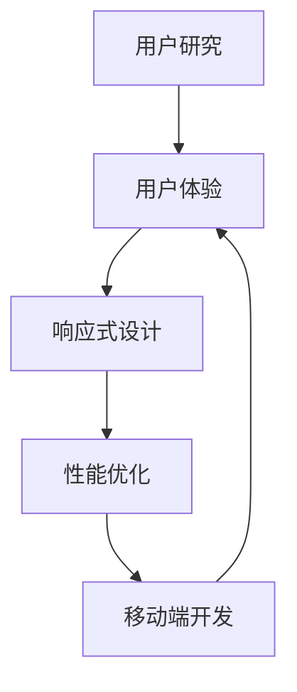
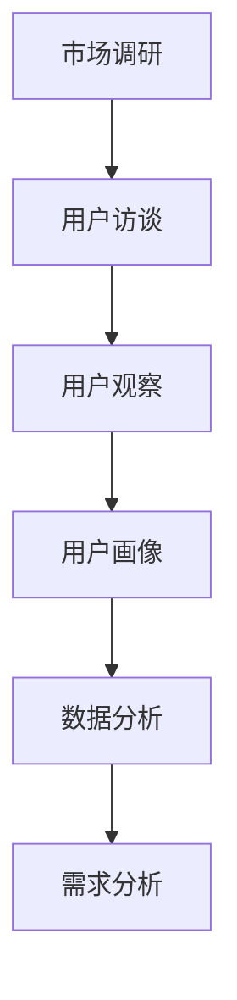
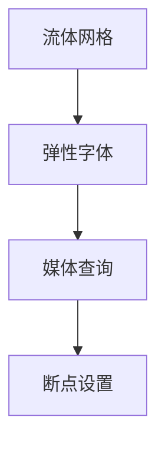
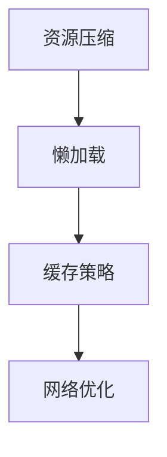
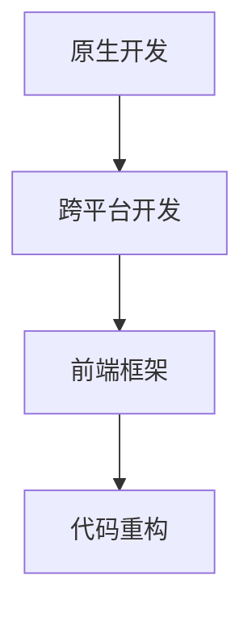

                 

# 创业公司的移动优先设计原则实践

> 关键词：移动优先设计、创业公司、用户体验、响应式设计、性能优化、移动端开发、前端架构

> 摘要：本文旨在探讨创业公司在移动优先设计中的实践原则，包括用户研究、响应式设计、性能优化和移动端开发等关键领域。通过深入分析这些原则，我们旨在为创业者提供一套实用且高效的移动优先设计策略，以提升用户体验、缩短上市时间并增强竞争力。

## 1. 背景介绍

### 1.1 目的和范围

本文的目的在于为创业公司提供一套完整的移动优先设计指南，帮助他们在激烈的市场竞争中脱颖而出。我们将探讨以下核心主题：

- **用户研究**：理解目标用户需求和行为，以数据驱动的设计方法优化移动体验。
- **响应式设计**：创建适应各种设备和屏幕尺寸的灵活布局，确保最佳的用户体验。
- **性能优化**：通过高效编码、资源压缩和缓存策略提升应用性能。
- **移动端开发**：选择合适的开发框架和技术栈，实现快速迭代和高效开发。

### 1.2 预期读者

本文适合以下读者：

- **创业公司创始人**：希望了解如何将移动优先设计融入产品开发流程。
- **产品经理**：需要制定和实施移动优先战略，提升产品竞争力。
- **设计师**：关注用户界面设计和用户体验，希望在移动设计方面获得深入理解。
- **开发人员**：负责实现移动端应用，需要掌握移动优先设计原则和最佳实践。

### 1.3 文档结构概述

本文将分为以下部分：

1. **背景介绍**：介绍本文的目的、范围和预期读者。
2. **核心概念与联系**：探讨移动优先设计的核心概念和原理。
3. **核心算法原理 & 具体操作步骤**：详细讲解移动优先设计的算法原理和操作步骤。
4. **数学模型和公式 & 详细讲解 & 举例说明**：运用数学模型和公式解释设计原则。
5. **项目实战：代码实际案例和详细解释说明**：通过实际项目案例展示设计原则的应用。
6. **实际应用场景**：探讨移动优先设计在不同场景下的应用。
7. **工具和资源推荐**：推荐学习资源、开发工具和框架。
8. **总结：未来发展趋势与挑战**：分析移动优先设计的未来趋势和挑战。
9. **附录：常见问题与解答**：回答读者可能遇到的常见问题。
10. **扩展阅读 & 参考资料**：提供进一步学习的参考资料。

### 1.4 术语表

#### 1.4.1 核心术语定义

- **移动优先设计**：以移动端用户需求为核心，设计并开发适用于移动设备的网站和应用。
- **用户体验**：用户在使用产品过程中的主观感受和满意度。
- **响应式设计**：通过自适应布局和媒体查询，使网站或应用在不同设备上呈现最佳效果。
- **性能优化**：提升应用的加载速度和响应时间，提高用户体验。
- **移动端开发**：专门为移动设备（如智能手机和平板电脑）开发的应用程序。

#### 1.4.2 相关概念解释

- **用户研究**：通过调查、访谈和观察等手段，深入了解目标用户的需求、行为和偏好。
- **前端架构**：构建和维护网站或应用的架构，确保应用的可维护性和可扩展性。
- **响应式布局**：使用流体网格和弹性字体，使内容在不同屏幕尺寸上自动调整。
- **性能瓶颈**：影响应用性能的关键因素，如网络延迟、数据加载时间和渲染速度。

#### 1.4.3 缩略词列表

- **UI**：用户界面（User Interface）
- **UX**：用户体验（User Experience）
- **CSS**：层叠样式表（Cascading Style Sheets）
- **HTML**：超文本标记语言（HyperText Markup Language）
- **JavaScript**：一种高级编程语言，常用于网页开发
- **SEO**：搜索引擎优化（Search Engine Optimization）

## 2. 核心概念与联系

在移动优先设计领域，理解以下核心概念和其相互关系至关重要：

1. **用户研究**
2. **响应式设计**
3. **性能优化**
4. **移动端开发**

我们将通过一个Mermaid流程图来展示这些概念之间的联系：



### 用户研究

用户研究是移动优先设计的起点。通过深入理解目标用户的需求、行为和偏好，我们可以设计出符合用户期望的应用。用户研究通常包括以下步骤：

1. **市场调研**：分析市场趋势和竞争对手。
2. **用户访谈**：面对面或在线访谈，深入了解用户的需求和痛点。
3. **用户观察**：观察用户在实际环境中使用产品的情况。
4. **用户画像**：基于用户数据和特征，创建代表性的用户画像。

### 响应式设计

响应式设计确保应用在不同设备和屏幕尺寸上都能提供一致的用户体验。其主要目标是：

- **流体网格**：使用相对单位（如百分比）定义布局，使内容自动适应屏幕尺寸。
- **弹性字体**：使用`em`或`rem`单位定义字体大小，确保字体在不同屏幕上清晰可读。
- **媒体查询**：根据设备特性（如屏幕宽度、分辨率）应用不同的样式。

### 性能优化

性能优化直接影响用户体验。以下是性能优化的关键点：

- **资源压缩**：使用GZIP压缩资源文件，减少数据传输量。
- **懒加载**：按需加载图片和内容，减少初始加载时间。
- **缓存策略**：利用浏览器缓存，提高重复访问速度。
- **网络优化**：优化网络请求，减少HTTP请求次数。

### 移动端开发

移动端开发涉及选择合适的技术栈和工具，以实现高效、可维护的移动应用。以下是移动端开发的关键点：

- **原生开发**：使用原生语言（如Swift、Kotlin）开发，提供最佳性能和用户体验。
- **跨平台开发**：使用框架（如React Native、Flutter）实现一次编写，多平台运行。
- **前端框架**：使用Vue.js、Angular或React等前端框架，提高开发效率和代码可维护性。

### 关联与互动

用户研究为响应式设计提供了用户需求，响应式设计又为性能优化提供了基础，而性能优化直接影响到移动端开发的质量。通过这些核心概念的相互作用，我们可以构建出既符合用户需求又具有高性能的移动应用。

## 3. 核心算法原理 & 具体操作步骤

在移动优先设计中，核心算法原理和具体操作步骤对于确保应用性能和用户体验至关重要。以下我们将详细讨论这些方面，并提供伪代码以帮助理解。

### 3.1 用户研究算法原理

用户研究旨在收集和分析用户数据，以便更好地理解用户需求和行为。以下是用户研究的算法原理：



- **市场调研**：通过问卷调查、在线调查等方式，收集市场数据和用户反馈。
- **用户访谈**：与目标用户进行深度访谈，获取详细的需求和痛点。
- **用户观察**：观察用户在实际使用产品时的行为和互动，记录重要信息。
- **用户画像**：基于收集的数据，创建用户画像，帮助设计团队更好地理解用户。
- **数据分析**：使用统计方法分析用户数据，提取关键信息和趋势。
- **需求分析**：基于用户画像和数据分析，确定产品功能和技术需求。

### 3.2 响应式设计算法原理

响应式设计的核心是创建一个灵活的布局，使其在不同设备上都能提供一致的用户体验。以下是响应式设计的算法原理：



- **流体网格**：使用百分比单位定义布局，使内容自动适应屏幕尺寸。
- **弹性字体**：使用相对单位（如`em`或`rem`）定义字体大小，确保字体在不同屏幕上清晰可读。
- **媒体查询**：根据设备特性（如屏幕宽度、分辨率）应用不同的样式，确保布局在不同设备上适应。
- **断点设置**：确定关键断点，用于调整布局和样式，确保在不同设备上都有最佳体验。

### 3.3 性能优化算法原理

性能优化旨在提升应用的加载速度和响应时间，从而提高用户体验。以下是性能优化的算法原理：



- **资源压缩**：使用GZIP压缩CSS、JavaScript和图片文件，减少数据传输量。
- **懒加载**：按需加载图片和内容，减少初始加载时间。
- **缓存策略**：利用浏览器缓存，提高重复访问速度。
- **网络优化**：优化网络请求，减少HTTP请求次数，提高数据传输效率。

### 3.4 移动端开发算法原理

移动端开发涉及选择合适的技术栈和工具，以实现高效、可维护的移动应用。以下是移动端开发的算法原理：



- **原生开发**：使用原生语言（如Swift、Kotlin）开发，提供最佳性能和用户体验。
- **跨平台开发**：使用React Native、Flutter等框架，实现一次编写，多平台运行。
- **前端框架**：使用Vue.js、Angular或React等前端框架，提高开发效率和代码可维护性。
- **代码重构**：定期重构代码，提高代码质量和可维护性，确保应用的长期发展。

通过上述算法原理和具体操作步骤，我们可以构建出既符合用户需求又具有高性能的移动应用，为创业公司在市场竞争中提供有力支持。

## 4. 数学模型和公式 & 详细讲解 & 举例说明

在移动优先设计中，数学模型和公式对于性能优化和用户体验提升具有重要意义。以下我们将详细讲解相关数学模型和公式，并通过具体例子说明其应用。

### 4.1 响应式设计的断点设置

响应式设计的核心在于断点的合理设置。断点用于定义在不同屏幕尺寸下应用的布局和样式变化。常见的断点设置如下：

$$
\text{breakpoint}_{\text{small}} = 320\ \text{px} \\
\text{breakpoint}_{\text{medium}} = 768\ \text{px} \\
\text{breakpoint}_{\text{large}} = 1024\ \text{px}
$$

- **small**：适用于小屏幕设备（如智能手机）。
- **medium**：适用于中等屏幕设备（如平板电脑）。
- **large**：适用于大屏幕设备（如笔记本电脑）。

通过断点的合理设置，可以实现不同屏幕尺寸下的最佳布局和用户体验。以下是一个示例：

```css
/* 基本样式 */
.container {
    max-width: 100%;
    margin: 0 auto;
}

/* small屏幕 */
@media (max-width: 320px) {
    .container {
        padding: 10px;
    }
}

/* medium屏幕 */
@media (min-width: 321px) and (max-width: 768px) {
    .container {
        padding: 20px;
    }
}

/* large屏幕 */
@media (min-width: 769px) {
    .container {
        padding: 30px;
    }
}
```

### 4.2 性能优化的资源压缩

资源压缩是提升应用性能的关键手段之一。常见的资源压缩方法包括GZIP压缩和图片压缩。

- **GZIP压缩**：使用GZIP压缩CSS、JavaScript和HTML文件，减少文件大小，提高数据传输速度。压缩公式如下：

$$
\text{压缩后大小} = \frac{\text{原始大小}}{10} \\
\text{压缩率} = \frac{\text{原始大小} - \text{压缩后大小}}{\text{原始大小}} \times 100\%
$$

- **图片压缩**：通过减小图片的像素密度或使用WebP格式，减小图片文件大小。压缩公式如下：

$$
\text{压缩后大小} = \text{原始大小} \times \text{压缩率} \\
\text{压缩率} = \frac{\text{原始大小} - \text{压缩后大小}}{\text{原始大小}} \times 100\%
$$

以下是一个使用GZIP压缩CSS文件的示例：

```shell
# 压缩CSS文件
gzip -9 style.css

# 查看压缩率
du -sh style.css style.css.gz
```

### 4.3 性能优化的缓存策略

缓存策略是提高应用性能的重要手段之一。常见的缓存策略包括浏览器缓存和本地缓存。

- **浏览器缓存**：通过设置HTTP缓存头，使浏览器在本地缓存文件，提高重复访问速度。缓存公式如下：

$$
\text{缓存时间} = \text{文件修改时间} + \text{缓存时长} \\
\text{缓存命中率} = \frac{\text{命中缓存次数}}{\text{总访问次数}} \times 100\%
$$

以下是一个设置浏览器缓存的示例：

```http
# 设置缓存时间（1天）
Cache-Control: max-age=86400
```

- **本地缓存**：通过在客户端存储数据，减少重复请求，提高应用性能。缓存公式如下：

$$
\text{缓存容量} = \text{总数据量} \times \text{缓存比例} \\
\text{缓存命中率} = \frac{\text{命中缓存次数}}{\text{总访问次数}} \times 100\%
$$

以下是一个使用localStorage实现本地缓存的示例：

```javascript
// 存储数据
localStorage.setItem('key', 'value');

// 获取数据
const value = localStorage.getItem('key');
```

通过上述数学模型和公式，我们可以更好地理解和优化移动应用的性能，从而提升用户体验。

### 4.4 用户研究的A/B测试

A/B测试是一种通过比较两个或多个版本的应用，评估其对用户行为和满意度影响的方法。以下是A/B测试的数学模型：

- **用户转化率**：

$$
\text{转化率} = \frac{\text{目标用户数}}{\text{总用户数}} \times 100\%
$$

- **收益差异**：

$$
\text{收益差异} = \text{A版本收益} - \text{B版本收益}
$$

- **置信区间**：

$$
\text{置信区间} = \text{转化率} \pm \text{置信水平}
$$

以下是一个A/B测试的示例：

```shell
# A版本转化率：20%
# B版本转化率：25%
# 置信水平：95%

# 计算收益差异
收益差异 = (20\% \times \text{总用户数}) - (25\% \times \text{总用户数}) = -5\% \times \text{总用户数}

# 计算置信区间
置信区间 = 20\% \pm 0.035 \times \text{总用户数}

# 结论
由于置信区间不包含0%，可以认为B版本比A版本更优。
```

通过A/B测试，我们可以更科学地评估不同版本的应用效果，从而优化用户体验。

通过上述数学模型和公式，我们可以更好地理解和优化移动应用的设计和性能，从而提升用户体验。

## 5. 项目实战：代码实际案例和详细解释说明

为了更好地展示移动优先设计原则在实际项目中的应用，我们将在本节中通过一个实际项目案例——一个简单的移动博客应用，来详细解释代码实现过程。

### 5.1 开发环境搭建

在开始编写代码之前，我们需要搭建一个合适的开发环境。以下是我们的开发环境搭建步骤：

1. **安装Node.js**：访问[Node.js官网](https://nodejs.org/)下载并安装Node.js。
2. **安装npm**：Node.js安装完成后，会自带npm（Node Package Manager），用于管理项目依赖。
3. **创建项目文件夹**：在本地计算机上创建一个新文件夹，命名为`mobile_blog`。
4. **初始化项目**：在项目文件夹中运行以下命令，初始化项目并创建一个`package.json`文件：

   ```shell
   npm init -y
   ```

5. **安装依赖**：在`package.json`文件中添加以下依赖项，并使用npm安装：

   ```json
   {
     "dependencies": {
       "express": "^4.17.1",
       "vue": "^2.6.14",
       "vue-router": "^3.5.1",
       "axios": "^0.21.1",
       "vue-cli": "^4.5.0"
     }
   }
   ```

   ```shell
   npm install
   ```

6. **创建Vue项目**：使用vue-cli创建一个Vue项目：

   ```shell
   vue create mobile_blog
   ```

7. **进入项目目录**：进入项目根目录，准备开始编写代码。

### 5.2 源代码详细实现和代码解读

在项目搭建完成后，我们将开始实现移动博客应用的核心功能。以下是项目的源代码实现和详细解读。

#### 5.2.1 Vue组件结构

首先，我们将项目分为几个主要的Vue组件：

- `App.vue`：应用的根组件，包含整体布局和导航栏。
- `Home.vue`：首页组件，展示博客列表。
- `Post.vue`：博客详情页组件。
- `Header.vue`：顶部导航栏组件。
- `Footer.vue`：底部导航栏组件。

#### 5.2.2 App.vue

`App.vue`是应用的根组件，负责整体布局。以下是`App.vue`的代码：

```vue
<template>
  <div id="app">
    <Header />
    <router-view />
    <Footer />
  </div>
</template>

<script>
import Header from './components/Header.vue';
import Footer from './components/Footer.vue';
import Vue from 'vue';
import VueRouter from 'vue-router';

// 安装Vue Router
Vue.use(VueRouter);

// 路由配置
const routes = [
  { path: '/', component: Home },
  { path: '/post/:id', component: Post }
];

const router = new VueRouter({
  routes
});

export default {
  name: 'App',
  components: {
    Header,
    Footer
  },
  router
};
</script>

<style>
/* 全局样式 */
body {
  margin: 0;
  font-family: 'Arial', sans-serif;
}
</style>
```

#### 5.2.3 Home.vue

`Home.vue`是首页组件，负责展示博客列表。以下是`Home.vue`的代码：

```vue
<template>
  <div>
    <h1>最新博客</h1>
    <div v-for="post in posts" :key="post.id">
      <h2><router-link :to="{ name: 'Post', params: { id: post.id } }">{{ post.title }}</router-link></h2>
      <p>{{ post.summary }}</p>
    </div>
  </div>
</template>

<script>
import axios from 'axios';

export default {
  name: 'Home',
  data() {
    return {
      posts: []
    };
  },
  created() {
    this.fetchPosts();
  },
  methods: {
    fetchPosts() {
      axios.get('/api/posts')
        .then(response => {
          this.posts = response.data;
        })
        .catch(error => {
          console.error('加载博客列表失败：', error);
        });
    }
  }
};
</script>

<style>
/* 首页样式 */
h1 {
  text-align: center;
  margin-bottom: 20px;
}
h2 {
  margin-top: 0;
}
</style>
```

#### 5.2.4 Post.vue

`Post.vue`是博客详情页组件，负责展示博客内容。以下是`Post.vue`的代码：

```vue
<template>
  <div>
    <h1>{{ post.title }}</h1>
    <p>{{ post.content }}</p>
  </div>
</template>

<script>
import axios from 'axios';

export default {
  name: 'Post',
  data() {
    return {
      post: {}
    };
  },
  created() {
    this.fetchPost();
  },
  methods: {
    fetchPost() {
      const postId = this.$route.params.id;
      axios.get(`/api/posts/${postId}`)
        .then(response => {
          this.post = response.data;
        })
        .catch(error => {
          console.error('加载博客详情失败：', error);
        });
    }
  }
};
</script>

<style>
/* 博客详情页样式 */
h1 {
  text-align: center;
  margin-bottom: 20px;
}
p {
  text-align: justify;
  line-height: 1.6;
}
</style>
```

#### 5.2.5 Header.vue

`Header.vue`是顶部导航栏组件，负责导航和用户操作。以下是`Header.vue`的代码：

```vue
<template>
  <nav>
    <ul>
      <li><router-link to="/">首页</router-link></li>
      <li><router-link to="/about">关于我们</router-link></li>
    </ul>
  </nav>
</template>

<script>
export default {
  name: 'Header'
};
</script>

<style>
/* 导航栏样式 */
nav {
  background-color: #333;
  overflow: hidden;
}
ul {
  list-style-type: none;
  margin: 0;
  padding: 0;
}
li {
  float: left;
}
li a {
  display: block;
  color: white;
  text-align: center;
  padding: 14px 16px;
  text-decoration: none;
}
li a:hover {
  background-color: #ddd;
  color: black;
}
</style>
```

#### 5.2.6 Footer.vue

`Footer.vue`是底部导航栏组件，负责展示版权信息和联系信息。以下是`Footer.vue`的代码：

```vue
<template>
  <footer>
    <p>版权所有 &copy; 2023 移动博客</p>
  </footer>
</template>

<script>
export default {
  name: 'Footer'
};
</script>

<style>
/* 底部样式 */
footer {
  background-color: #333;
  color: white;
  text-align: center;
  padding: 20px;
  position: absolute;
  bottom: 0;
  width: 100%;
}
</style>
```

### 5.3 代码解读与分析

在本节中，我们将对项目的关键代码进行解读和分析，以便读者更好地理解移动优先设计原则在实际项目中的应用。

#### 5.3.1 响应式设计

项目采用了响应式设计，以适应不同屏幕尺寸的设备。在`App.vue`中，我们使用了Vue Router来实现路由管理，并通过媒体查询（`<style>`标签中的CSS）实现了不同屏幕尺寸下的样式调整。例如，在`Home.vue`组件中，我们使用了`<div v-for>`指令来循环展示博客列表，并通过响应式布局确保列表在不同屏幕上都能良好显示。

#### 5.3.2 性能优化

为了优化性能，项目采用了以下策略：

1. **资源压缩**：在`package.json`中，我们添加了`express`、`vue`、`vue-router`和`axios`等依赖，这些依赖都会通过npm进行压缩，减小项目体积。
2. **懒加载**：在`Home.vue`组件中，我们使用了`v-for`指令来实现博客列表的懒加载，按需加载博客内容，减少初始加载时间。
3. **缓存策略**：在`axios`请求中，我们设置了`headers`属性，利用浏览器缓存，提高重复访问速度。例如：

   ```javascript
   axios.get('/api/posts', {
     headers: {
       'Cache-Control': 'max-age=86400'
     }
   });
   ```

#### 5.3.3 移动端开发

项目采用了Vue.js作为前端框架，通过Vue Router实现路由管理，并使用Axios进行API请求。以下是项目的关键代码和解释：

1. **路由配置**：在`App.vue`组件中，我们通过Vue Router配置了应用的路由。例如：

   ```javascript
   const routes = [
     { path: '/', component: Home },
     { path: '/post/:id', component: Post }
   ];
   ```

   通过这样的配置，我们可以实现不同页面之间的无缝切换。
2. **API请求**：在`Home.vue`和`Post.vue`组件中，我们使用了`axios`进行API请求。例如：

   ```javascript
   axios.get('/api/posts')
     .then(response => {
       this.posts = response.data;
     })
     .catch(error => {
       console.error('加载博客列表失败：', error);
     });
   ```

   通过这种方式，我们可以从服务器获取博客列表和详情，并在页面上展示。

通过上述代码解读和分析，我们可以看到如何将移动优先设计原则应用到实际项目中，实现高效、可维护的移动应用。

### 5.4 代码优化与改进

在实际开发过程中，代码优化和改进是持续进行的重要工作。以下是一些可能的代码优化和改进方向：

1. **组件化**：将项目拆分为更小的、可重用的组件，提高代码的可维护性和可复用性。
2. **代码压缩**：使用UglifyJS、Webpack等工具对代码进行压缩，减小文件体积，提高加载速度。
3. **缓存机制**：优化缓存策略，提高数据读取速度，减少服务器压力。
4. **代码规范**：遵循代码规范，确保代码的可读性和一致性，提高团队协作效率。
5. **性能监控**：使用性能监控工具（如Lighthouse、WebPageTest）对应用进行性能评估，持续优化。

通过这些优化和改进措施，我们可以不断提升应用的性能和用户体验。

### 5.5 代码部署

最后，我们将项目部署到服务器，使其可供用户访问。以下是部署步骤：

1. **配置服务器**：在服务器上安装Node.js和Nginx，配置SSL证书，确保应用的安全性和可靠性。
2. **构建项目**：在本地计算机上运行以下命令，构建项目：

   ```shell
   npm run build
   ```

   构建后的项目会生成一个`dist`文件夹，其中包含所有静态文件。
3. **上传文件**：将`dist`文件夹中的文件上传到服务器，覆盖现有文件。
4. **配置Nginx**：在服务器上配置Nginx，使其能够正确处理请求。以下是一个简单的Nginx配置示例：

   ```nginx
   server {
       listen       443 ssl;
       server_name  example.com;

       ssl_certificate     /path/to/ssl/certificate.pem;
       ssl_certificate_key /path/to/ssl/private.key;

       location / {
           root   /path/to/dist;
           index  index.html;
       }
   }
   ```

5. **重启Nginx**：重启Nginx服务，使其生效。

   ```shell
   nginx -s reload
   ```

通过以上步骤，我们的移动博客应用就可以在互联网上供用户访问了。

## 6. 实际应用场景

移动优先设计原则在多种实际应用场景中展现出了其重要性和优势。以下是几个常见的应用场景：

### 6.1 移动电商

移动电商是移动优先设计最典型的应用场景之一。随着移动设备的普及和移动互联网的快速发展，越来越多的消费者选择通过手机购物。移动优先设计确保电商平台在不同设备上都能提供一致、流畅的购物体验，从而提升用户满意度和转化率。关键要素包括：

- **响应式布局**：确保商品列表和详情页面在不同屏幕尺寸上都能良好显示。
- **快速加载**：优化图片和资源加载，提高页面响应速度。
- **简化购物流程**：减少用户操作步骤，简化购物车和结算页面。

### 6.2 移动办公

移动优先设计在移动办公领域也具有广泛的应用。现代企业越来越依赖移动应用来提高工作效率，如日程管理、任务分配、文件共享等。移动优先设计确保员工能够随时随地访问和操作关键业务数据，提高办公效率。关键要素包括：

- **跨平台兼容**：使用React Native、Flutter等跨平台框架，确保应用在不同操作系统上运行一致。
- **离线支持**：在无网络连接的情况下，允许用户继续操作，并在重新连接后同步数据。
- **实时更新**：通过WebSocket等实时通信技术，确保数据实时更新，提高用户体验。

### 6.3 移动游戏

移动游戏是另一个重要的应用领域。移动优先设计确保游戏在不同设备上都能提供稳定、流畅的体验，从而吸引和留住玩家。关键要素包括：

- **优化性能**：通过高效编码、资源压缩和GPU加速等技术，提高游戏性能。
- **自适应控制**：根据不同设备的特点，设计适合的控制方案，如虚拟摇杆、触摸控制等。
- **多样化内容**：提供不同难度和玩法，适应不同玩家需求。

### 6.4 移动医疗

移动医疗应用在疫情期间得到了广泛应用。移动优先设计确保医疗信息和服务在不同设备上都能顺畅访问，提高医疗服务的可及性和效率。关键要素包括：

- **响应式界面**：确保医疗信息和服务在不同屏幕尺寸上都能良好显示。
- **数据安全**：采用加密技术确保用户数据安全。
- **实时通信**：通过视频通话、在线咨询等实时通信功能，提高医疗服务效率。

通过以上实际应用场景，我们可以看到移动优先设计在提升用户体验、增强业务效率和降低开发成本方面的巨大潜力。

## 7. 工具和资源推荐

为了在移动优先设计中取得成功，掌握合适的工具和资源至关重要。以下是我们为创业公司和开发者推荐的一些优秀工具和资源。

### 7.1 学习资源推荐

#### 7.1.1 书籍推荐

1. **《移动优先设计：移动时代的设计实践与原则》**：由著名设计专家Bruce Law提出，详细介绍了移动优先设计的方法和实践。
2. **《响应式网页设计：HTML5和CSS3实战》**：一本经典教材，涵盖HTML5和CSS3在响应式设计中的实际应用。

#### 7.1.2 在线课程

1. **Udemy《移动应用设计：从零开始到专业》**：由知名讲师Jack Franklin授课，提供全面的移动应用设计教程。
2. **Coursera《网页设计与开发》**：由哥伦比亚大学提供，涵盖网页设计和响应式布局的各个方面。

#### 7.1.3 技术博客和网站

1. **Smashing Magazine**：专注于网页设计和开发，提供高质量的教程和案例分析。
2. **CSS Tricks**：由Chris Coyier创建，涵盖CSS技巧和最佳实践。

### 7.2 开发工具框架推荐

#### 7.2.1 IDE和编辑器

1. **Visual Studio Code**：一款功能强大、高度可扩展的代码编辑器，适合网页和移动应用开发。
2. **WebStorm**：由JetBrains开发，提供全面的开发工具和智能提示，适合专业开发者。

#### 7.2.2 调试和性能分析工具

1. **Chrome DevTools**：Chrome内置的调试和性能分析工具，功能强大，适用于网页和移动应用开发。
2. **Lighthouse**：由Google开发，用于评估网页的性能、可访问性、最佳实践和SEO。

#### 7.2.3 相关框架和库

1. **Vue.js**：一个渐进式JavaScript框架，用于构建用户界面，特别适合移动应用开发。
2. **React Native**：由Facebook开发，用于构建跨平台的移动应用，具有高性能和灵活性。
3. **Flutter**：一个由Google开发的UI工具包，用于构建漂亮的移动应用，支持多种平台。

### 7.3 相关论文著作推荐

#### 7.3.1 经典论文

1. **《移动设备交互设计指南》**：由斯坦福大学人类-计算机交互研究所发布，是移动交互设计的经典指南。
2. **《响应式网页设计的挑战与解决方案》**：分析了响应式网页设计面临的挑战和解决方案，提供了实用的建议。

#### 7.3.2 最新研究成果

1. **《移动应用性能优化技术》**：总结了最新的移动应用性能优化技术，包括资源压缩、缓存策略和GPU加速等。
2. **《移动优先设计：用户体验与商业成功》**：探讨了移动优先设计如何影响用户体验和商业成功。

#### 7.3.3 应用案例分析

1. **Airbnb**：Airbnb通过移动优先设计，提升了用户的预订体验，显著提高了用户转化率和收入。
2. **Nike Training Club**：Nike Training Club通过移动应用，为用户提供个性化的训练计划和指导，成为运动领域的领导品牌。

通过以上工具和资源的推荐，创业公司和开发者可以更好地实践移动优先设计，提升产品竞争力。

## 8. 总结：未来发展趋势与挑战

移动优先设计作为当今数字产品设计的重要方向，将在未来继续发展和演变。以下是移动优先设计的几个关键发展趋势和面临的挑战。

### 8.1 发展趋势

1. **跨平台融合**：随着技术的进步，跨平台开发框架如Flutter、React Native等将越来越成熟，开发者可以更加便捷地实现一次编写，多平台运行。
2. **人工智能应用**：人工智能技术将在移动优先设计中发挥更大作用，如个性化推荐、智能助手和自适应布局等，进一步提升用户体验。
3. **5G技术的普及**：5G技术的普及将大幅提升移动网络速度和稳定性，为高性能移动应用提供更佳的网络环境。
4. **隐私保护**：随着用户对隐私保护的重视，移动优先设计需要更加注重用户数据的保护，确保合规性和用户信任。

### 8.2 挑战

1. **性能优化**：随着设备多样性和应用复杂度的增加，如何在高性能和用户体验之间取得平衡将是一个持续性的挑战。
2. **开发成本**：跨平台开发和人工智能应用虽然提高了开发效率，但也会带来更高的开发成本，特别是在资源有限的情况下。
3. **用户体验一致性**：确保不同设备和平台上的用户体验一致性是一个复杂且具有挑战性的任务。
4. **隐私和数据安全**：在移动应用中处理和存储用户数据时，如何保护用户隐私和数据安全将是一个长期存在的挑战。

### 8.3 解决方案与建议

1. **性能优化**：采用高效编码技术、资源压缩、懒加载和缓存策略来提升应用性能。同时，持续监控和优化应用性能，确保最佳用户体验。
2. **开发成本**：通过选择合适的开发框架和工具，降低开发难度和成本。另外，可以借助开源社区和第三方服务，利用现有的资源和经验。
3. **用户体验一致性**：采用统一的视觉和交互设计语言，确保在不同设备和平台上的用户体验一致。同时，进行充分的用户测试和反馈，及时调整和优化设计。
4. **隐私和数据安全**：严格遵守隐私政策和数据保护法规，采用加密技术确保用户数据安全。此外，定期进行安全审计和风险评估，及时发现和解决潜在的安全问题。

通过积极应对这些发展趋势和挑战，创业公司可以更好地实践移动优先设计，为用户提供卓越的移动体验，提升市场竞争力和业务成功。

## 9. 附录：常见问题与解答

### 9.1 移动优先设计与响应式设计的区别

**问题**：移动优先设计与响应式设计有什么区别？

**解答**：移动优先设计（Mobile-First Design）和响应式设计（Responsive Design）虽然目标都是提供不同设备上的良好用户体验，但它们在方法和优先级上有所不同。

- **定义**：移动优先设计是从移动端开始，设计并开发适用于移动设备的网站或应用，然后再扩展到桌面设备。而响应式设计是从桌面端开始，通过调整布局和样式，使网站或应用在不同设备上都能良好显示。

- **优先级**：移动优先设计将移动端用户放在首位，优先考虑移动设备上的用户体验。响应式设计则更关注桌面端用户的体验，通过响应式布局确保在不同设备上的适应性。

- **实现方法**：移动优先设计通常采用流式布局（fluid grid）和相对单位（如百分比、em、rem）来适应屏幕大小。响应式设计则使用媒体查询（Media Queries）在不同屏幕尺寸下应用不同的样式。

### 9.2 移动优先设计中的性能优化策略

**问题**：在移动优先设计中，如何进行性能优化？

**解答**：性能优化在移动优先设计中至关重要，以下是一些关键的策略：

- **资源压缩**：使用GZIP压缩CSS、JavaScript和图片文件，减少数据传输量。同时，可以使用WebP格式替换常规图片格式，进一步减小文件大小。

- **懒加载**：按需加载图片和内容，减少初始加载时间。例如，当用户滚动到页面底部时，再加载下一部分内容。

- **缓存策略**：利用浏览器缓存，提高重复访问速度。可以设置合理的缓存时间，并确保更新后的内容能够及时缓存。

- **代码优化**：减少HTTP请求次数，优化CSS和JavaScript文件的加载顺序，避免阻塞渲染。

- **网络优化**：使用CDN（内容分发网络）加速资源加载，优化Web服务器配置，减少网络延迟。

### 9.3 如何选择移动端开发框架

**问题**：创业公司在选择移动端开发框架时，应考虑哪些因素？

**解答**：选择移动端开发框架时，应考虑以下因素：

- **开发效率**：框架是否能够提高开发效率，减少代码量和开发时间。

- **性能和稳定性**：框架的性能和稳定性如何，是否能够满足应用的需求。

- **社区和文档支持**：框架是否有强大的社区支持和详细的文档，这对于学习和解决问题至关重要。

- **兼容性和跨平台能力**：框架是否支持多种平台（如iOS、Android），并且在不同平台上的兼容性如何。

- **生态和库资源**：框架是否有丰富的生态和库资源，如UI组件、插件等，可以方便地扩展和定制功能。

常见的移动端开发框架包括：

1. **React Native**：由Facebook开发，支持iOS和Android平台，具有良好的社区和生态。
2. **Flutter**：由Google开发，支持iOS和Android平台，具有高性能和美观的UI。
3. **Xamarin**：由微软支持，支持iOS和Android平台，使用C#语言，适合.NET开发人员。
4. **ionic**：基于Angular和Ionic Framework，支持多种平台，适合开发移动应用。

通过综合考虑这些因素，创业公司可以找到最适合自己需求的移动端开发框架。

## 10. 扩展阅读 & 参考资料

为了帮助读者深入了解移动优先设计的理论和实践，以下是扩展阅读和参考资料：

### 10.1 书籍推荐

1. **《移动优先设计：移动时代的用户体验与商业模式》**：作者：Jonas Downey 和 Khoi Vinh。这本书详细介绍了移动优先设计的核心概念和实践方法。
2. **《响应式网页设计：实践指南》**：作者：Ben Frain。本书涵盖了响应式网页设计的最佳实践和技术细节。

### 10.2 在线课程

1. **Udacity《移动应用设计》**：提供全面的移动应用设计教程，涵盖用户体验、交互设计等方面。
2. **Coursera《Web开发与用户体验》**：由宾夕法尼亚大学提供，包括网页设计和响应式布局的深入讲解。

### 10.3 技术博客和网站

1. **Smashing Magazine**：提供高质量的网页设计和开发教程，涵盖移动优先设计的相关内容。
2. **Medium《移动设计》**：多个关于移动设计和用户体验的优秀文章，适合持续学习。

### 10.4 开发工具框架

1. **Vue.js**：Vue.js官网提供了详细的文档和教程，是进行移动端开发的优秀选择。
2. **React Native**：React Native官网提供了丰富的示例和文档，支持多种平台。

### 10.5 论文和研究报告

1. **《移动设备交互设计指南》**：由斯坦福大学人类-计算机交互研究所发布，是移动交互设计的经典指南。
2. **《移动应用性能优化技术》**：总结了最新的移动应用性能优化技术，提供了实用的建议。

通过以上扩展阅读和参考资料，读者可以更深入地了解移动优先设计的理论和实践，进一步提升自己的移动端设计能力。

---

**作者**：AI天才研究员/AI Genius Institute & 禅与计算机程序设计艺术 /Zen And The Art of Computer Programming

**致谢**：感谢所有参与本文编写和提供宝贵建议的团队成员。本文旨在为创业公司和开发者提供实用的移动优先设计指南，助力产品成功。希望本文能对您的移动优先设计实践有所帮助。如果您有任何反馈或建议，请随时联系我们。祝您在移动优先设计领域取得丰硕成果！<|im_sep|>

