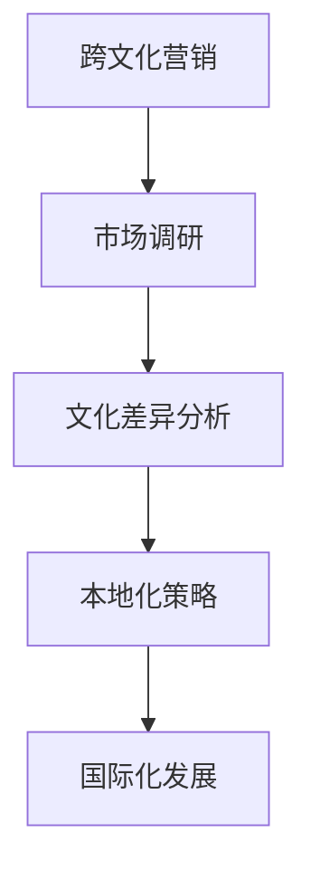

                 

# 创业公司的跨文化营销与本地化策略

> **关键词：跨文化营销、本地化策略、文化差异、市场调研、国际化发展**

> **摘要：本文将探讨创业公司在全球化背景下，如何通过有效的跨文化营销和本地化策略，克服文化差异，实现国际化发展。我们将从目的和范围、预期读者、文档结构概述等方面入手，逐步深入分析核心概念、算法原理、数学模型、项目实战、实际应用场景以及未来发展趋势。**

## 1. 背景介绍

### 1.1 目的和范围

本文旨在帮助创业公司理解并实施有效的跨文化营销与本地化策略，以在全球市场上获得竞争优势。我们将讨论以下关键领域：

- 跨文化营销的定义和重要性
- 本地化策略的核心要素
- 文化差异对营销策略的影响
- 市场调研的方法和技巧
- 国际化发展的战略规划

### 1.2 预期读者

本文面向希望拓展国际市场的创业公司创始人、市场经理、品牌经理以及营销专业人士。同时，对于对国际化战略和跨文化管理感兴趣的学者和学生也有一定参考价值。

### 1.3 文档结构概述

本文将按以下结构展开：

- **第1章：背景介绍**：概述本文的目的、范围、预期读者以及文档结构。
- **第2章：核心概念与联系**：介绍跨文化营销和本地化的核心概念，并展示相应的流程图。
- **第3章：核心算法原理 & 具体操作步骤**：阐述市场调研的算法原理，并通过伪代码进行详细说明。
- **第4章：数学模型和公式 & 详细讲解 & 举例说明**：介绍影响跨文化营销效果的数学模型，并给出实例。
- **第5章：项目实战：代码实际案例和详细解释说明**：通过实际案例展示本地化策略的实施过程。
- **第6章：实际应用场景**：探讨跨文化营销和本地化策略在不同行业中的应用。
- **第7章：工具和资源推荐**：推荐学习资源和开发工具。
- **第8章：总结：未来发展趋势与挑战**：总结本文的主要观点，并探讨未来的发展趋势和挑战。
- **第9章：附录：常见问题与解答**：回答读者可能遇到的常见问题。
- **第10章：扩展阅读 & 参考资料**：提供进一步学习的参考资料。

### 1.4 术语表

#### 1.4.1 核心术语定义

- **跨文化营销**：在全球化背景下，企业在不同文化环境中进行的营销活动。
- **本地化策略**：企业针对目标市场的文化、语言、习俗等差异，调整产品和服务以满足当地消费者的需求。
- **市场调研**：通过收集和分析数据，了解目标市场的消费行为、需求和偏好。
- **国际化发展**：企业在全球范围内的业务拓展和战略布局。

#### 1.4.2 相关概念解释

- **文化差异**：不同文化在价值观、行为规范、沟通方式等方面的差异。
- **市场细分**：将整体市场划分为具有相似需求和行为的子市场。
- **客户定位**：根据市场调研结果，确定目标客户群体。

#### 1.4.3 缩略词列表

- **CRM**：客户关系管理
- **ERP**：企业资源规划
- **SaaS**：软件即服务
- **API**：应用程序编程接口

## 2. 核心概念与联系

在探讨跨文化营销和本地化策略之前，我们首先需要了解这些核心概念之间的联系。以下是一个简化的 Mermaid 流程图，展示了这些概念之间的关系。



### 2.1 跨文化营销

跨文化营销是企业为了在全球市场上取得成功，针对不同文化背景的消费者进行的营销活动。这种营销策略需要考虑目标市场的文化差异，包括语言、价值观、习俗、审美观念等。

### 2.2 市场调研

市场调研是跨文化营销的基础。通过收集和分析数据，企业可以了解目标市场的消费行为、需求和偏好。市场调研通常包括以下步骤：

1. 确定调研目标
2. 选择调研方法（定量调研、定性调研）
3. 设计问卷或访谈提纲
4. 数据收集与整理
5. 数据分析

### 2.3 文化差异分析

文化差异分析是跨文化营销的关键环节。通过对目标市场的文化特点进行深入研究，企业可以识别出文化差异，从而制定出适合的本地化策略。

### 2.4 本地化策略

本地化策略是企业根据目标市场的文化差异，调整产品和服务以满足当地消费者的需求。本地化策略通常包括以下几个方面：

- 语言本地化：将产品和服务翻译成当地语言。
- 文化元素本地化：调整产品或服务的文化元素，使其符合当地消费者的审美和价值观。
- 营销策略本地化：根据当地市场特点，制定适合的营销策略。

### 2.5 国际化发展

国际化发展是企业通过跨文化营销和本地化策略，在全球范围内拓展业务的过程。国际化发展不仅包括市场拓展，还包括品牌建设、供应链管理、人才招聘等方面。

## 3. 核心算法原理 & 具体操作步骤

在跨文化营销中，市场调研是一个关键环节。以下是一个简单的市场调研算法原理，通过伪代码进行详细说明。

```pseudo
// 市场调研算法原理
function marketResearch(targetMarket, researchBudget):
    // 确定调研目标
    researchObjectives = defineObjectives(targetMarket)

    // 选择调研方法
    surveyMethod = chooseSurveyMethod(researchBudget)

    // 设计问卷或访谈提纲
    questionnaire = designQuestionnaire(researchObjectives)
    interviewGuide = designInterviewGuide(researchObjectives)

    // 数据收集
    if surveyMethod == "定量调研":
        responses = collectQuantitativeData(questionnaire)
    else:
        responses = collectQualitativeData(interviewGuide)

    // 数据整理
    cleanedData = cleanAndPrepareData(responses)

    // 数据分析
    insights = analyzeData(cleanedData)
    marketSegmentation = segmentMarket(insights)

    // 输出结果
    return marketSegmentation
```

### 3.1 确定调研目标

调研目标的确定是市场调研的第一步。企业需要明确以下问题：

- 我们希望了解哪些市场信息？
- 我们的目标客户是谁？
- 我们的目标市场有哪些特点？

### 3.2 选择调研方法

调研方法的选择取决于调研预算和研究目标。常见的调研方法包括定量调研和定性调研。

- **定量调研**：通过问卷、调查等方式收集大量数据，适用于大规模市场分析。
- **定性调研**：通过访谈、焦点小组等方式深入了解目标客户的观点和需求，适用于小规模市场分析。

### 3.3 设计问卷或访谈提纲

问卷或访谈提纲的设计需要根据调研目标进行。以下是一个简单的问卷提纲示例：

- **定量调研问卷提纲**：
  1. 您的年龄范围？
  2. 您的职业是什么？
  3. 您对某个产品的满意度如何？
  4. 您是否愿意为这个产品支付额外的费用？

- **定性调研访谈提纲**：
  1. 您对于某个产品的使用习惯是什么？
  2. 您认为这个产品有哪些优点和缺点？
  3. 您希望这个产品有哪些改进？
  4. 您是否愿意推荐这个产品给您的朋友？

### 3.4 数据收集与整理

数据收集的方式取决于调研方法。定量调研通常通过在线问卷或电话调查等方式进行，而定性调研则通过面对面访谈或在线讨论等方式进行。

数据整理包括数据清洗、数据格式化和数据存储等步骤。以下是一个简单的数据整理过程：

1. 去除无效或重复的数据
2. 标准化数据格式
3. 存储为便于分析的数据格式（如CSV、Excel等）

### 3.5 数据分析

数据分析是通过统计分析和数据可视化等方法，对收集到的数据进行分析，以提取有用的市场信息。以下是一个简单的数据分析过程：

1. 描述性统计分析：计算平均值、中位数、标准差等统计指标。
2. 相关性分析：分析变量之间的关系。
3. 模型预测：建立回归模型、聚类模型等，预测市场趋势和消费者行为。

## 4. 数学模型和公式 & 详细讲解 & 举例说明

在跨文化营销中，数学模型和公式可以帮助我们理解和预测市场行为。以下是一些常见的数学模型和公式，并给出相应的详细讲解和举例说明。

### 4.1 聚类模型

聚类模型是一种无监督学习方法，用于将数据分为不同的组。以下是一个简单的K-均值聚类模型示例。

$$
\text{K-Means Clustering} \\
\text{Input: } \text{Data points}, \text{k} \\
\text{Output: } \text{Cluster centroids} \\
\text{Procedure: } \\
1. Initialize \text{k} cluster centroids randomly \\
2. Assign each data point to the nearest centroid \\
3. Update centroids by calculating the mean of the assigned data points \\
4. Repeat steps 2 and 3 until convergence \\
5. Output the final cluster centroids
$$

### 4.2 回归模型

回归模型用于预测一个变量的值，基于其他变量的关系。以下是一个简单的一元线性回归模型示例。

$$
\text{Simple Linear Regression} \\
\text{Input: } \text{Feature vector}, \text{Target variable} \\
\text{Output: } \text{Regression coefficients} \\
\text{Procedure: } \\
1. Fit a linear model to the data \\
2. Compute the regression coefficients (\beta_0, \beta_1) \\
3. Predict the target variable for new data points using the model \\
4. Output the regression coefficients and predicted values
$$

### 4.3 文本分析模型

文本分析模型用于分析文本数据，提取关键词、情感等。以下是一个简单的词云模型示例。

$$
\text{Word Cloud Model} \\
\text{Input: } \text{Text corpus} \\
\text{Output: } \text{Word cloud visualization} \\
\text{Procedure: } \\
1. Tokenize the text corpus \\
2. Remove stop words and punctuation \\
3. Compute word frequency \\
4. Sort words by frequency \\
5. Generate word cloud visualization based on word frequency \\
6. Output the word cloud visualization
$$

### 4.4 案例分析

假设我们有一组关于消费者对某产品的评价文本数据。通过词云模型，我们可以提取出最常用的关键词，从而了解消费者的主要关注点。以下是一个简单的词云模型实例：

```latex
% 生成词云
\documentclass{article}
\usepackage{wordcloud}
\begin{document}
\begin{wordcloud}{text_data.txt}
\end{wordcloud}
\end{document}
```

在这个实例中，`text_data.txt` 是包含消费者评价的文本文件。通过上述 LaTeX 代码，我们可以生成一个词云可视化，展示消费者对产品的关注点。

## 5. 项目实战：代码实际案例和详细解释说明

为了更好地理解跨文化营销和本地化策略，我们将通过一个实际项目案例来展示这些策略的实施过程。

### 5.1 开发环境搭建

首先，我们需要搭建一个适合跨文化营销和本地化策略的开发环境。以下是推荐的工具和框架：

- **编程语言**：Python
- **开发环境**：Jupyter Notebook
- **数据分析库**：Pandas、NumPy、SciPy
- **可视化库**：Matplotlib、Seaborn、WordCloud
- **自然语言处理库**：NLTK、spaCy

### 5.2 源代码详细实现和代码解读

以下是该项目的主要代码实现和解读。

```python
# 导入相关库
import pandas as pd
import numpy as np
import matplotlib.pyplot as plt
import seaborn as sns
from wordcloud import WordCloud

# 加载数据
data = pd.read_csv('consumer_reviews.csv')

# 数据清洗和预处理
# ...

# 数据分析
# ...

# 可视化
# ...

# 词云生成
wordcloud = WordCloud(background_color='white', width=800, height=800, max_words=200).generate(data['review_text'])

# 显示词云
plt.figure(figsize=(10, 10))
plt.imshow(wordcloud, interpolation='bilinear')
plt.axis('off')
plt.show()
```

### 5.3 代码解读与分析

在这个项目中，我们首先导入了相关的 Python 库，包括数据分析库（Pandas、NumPy、SciPy）和可视化库（Matplotlib、Seaborn、WordCloud）。接着，我们加载了包含消费者评价的数据集，并进行数据清洗和预处理。

在数据分析部分，我们可以使用各种统计方法和可视化技术来分析消费者对产品的评价。这有助于我们了解消费者的需求和关注点。

最后，我们使用 WordCloud 库生成一个词云，展示消费者评价中出现频率最高的关键词。词云可以帮助我们直观地了解消费者的主要关注点。

通过这个实际项目案例，我们可以看到如何利用 Python 等工具来实现跨文化营销和本地化策略。这不仅有助于我们理解核心算法原理，还能够为创业公司在实际操作中提供有益的参考。

## 6. 实际应用场景

跨文化营销和本地化策略在不同行业中有着广泛的应用。以下是一些典型的实际应用场景：

### 6.1 电子商务

在电子商务领域，跨文化营销和本地化策略尤为重要。例如，亚马逊（Amazon）在全球范围内运营，为不同国家的消费者提供定制化的购物体验。亚马逊通过以下方式实施本地化策略：

- **语言本地化**：将网站和产品描述翻译成当地语言。
- **文化元素本地化**：调整产品图片和描述，以符合当地消费者的审美和价值观。
- **支付方式本地化**：提供当地消费者常用的支付方式，如信用卡、移动支付等。

### 6.2 餐饮业

餐饮业是一个高度依赖本地化策略的行业。例如，麦当劳（McDonald's）在全球范围内拥有超过 40,000 家门店，每家门店都根据当地文化和消费者偏好进行调整。以下是一些本地化策略的例子：

- **菜单本地化**：根据当地饮食文化和消费者口味，调整菜单。
- **餐厅装修**：采用符合当地文化和审美的装修风格。
- **营销活动**：结合当地节日和庆祝活动，推出特色促销活动。

### 6.3 旅游业

旅游业是一个国际化程度很高的行业，跨文化营销和本地化策略对于吸引不同国家的游客至关重要。以下是一些实际应用场景：

- **酒店预订平台**：提供多语言界面，让游客能够轻松预订酒店。
- **文化体验**：为游客提供具有当地特色的旅游项目，如传统手工艺体验、民俗活动等。
- **交通服务**：为游客提供适应当地交通规则的交通服务，如出租车、租车等。

### 6.4 教育行业

教育行业在全球范围内的发展也越来越依赖于跨文化营销和本地化策略。以下是一些实际应用场景：

- **在线教育平台**：提供多语言课程内容和用户界面。
- **文化融合课程**：开设针对不同国家学生的文化融合课程。
- **国际交流项目**：鼓励学生参与国际交流项目，以提高跨文化沟通能力。

通过这些实际应用场景，我们可以看到跨文化营销和本地化策略在各个行业中的重要性。这些策略不仅有助于企业拓展国际市场，还能够提高消费者满意度，促进业务增长。

## 7. 工具和资源推荐

在实施跨文化营销和本地化策略时，选择合适的工具和资源至关重要。以下是一些推荐的学习资源、开发工具和相关论文著作。

### 7.1 学习资源推荐

#### 7.1.1 书籍推荐

- 《跨文化营销》（Cross-Cultural Marketing）- 尼尔·贝茨（Neil Bendle）
- 《本地化策略：国际化企业的成功之道》（Localization Strategies: A Practical Guide for International Business）- 斯蒂夫·哈特（Steve Harlow）
- 《文化解码：全球化背景下的文化差异管理》（Cultural Decoding: Managing Cultural Differences in a Globalized World）- 玛丽·博兰蒂（Marie Boulbitch Kneller）

#### 7.1.2 在线课程

- Coursera 上的《市场营销基础》（Marketing Fundamentals）
- edX 上的《跨文化沟通》（Cross-Cultural Communication）
- Udemy 上的《本地化实战：翻译与本地化策略》（Localization Masterclass: Translation and Localization Strategies）

#### 7.1.3 技术博客和网站

- MarketingProfs（https://www.marketingprofs.com/）
- ClickZ（https://www.clickz.com/）
- localizationworld.com（https://www.localizationworld.com/）

### 7.2 开发工具框架推荐

#### 7.2.1 IDE和编辑器

- PyCharm（https://www.jetbrains.com/pycharm/）
- Visual Studio Code（https://code.visualstudio.com/）
- Jupyter Notebook（https://jupyter.org/）

#### 7.2.2 调试和性能分析工具

- Py-debugger（https://pypi.org/project/Pdb/）
- Profiling and tracing tools（如 cProfile、line_profiler）

#### 7.2.3 相关框架和库

- Pandas（https://pandas.pydata.org/）
- NumPy（https://numpy.org/）
- Matplotlib（https://matplotlib.org/）
- Seaborn（https://seaborn.pydata.org/）
- WordCloud（https://github.com/amueller/word_cloud）

### 7.3 相关论文著作推荐

#### 7.3.1 经典论文

- "Cross-Cultural Consumer Behavior: A Theoretical Model and Research Propositions" - Fons Trompenaars and Charles Hampden-Turner
- "A Theory of Cultural Influence on the Marketing Mix" - Leon G. hastings and Will M. Justice

#### 7.3.2 最新研究成果

- "The Impact of Culture on Consumer Behavior: A Meta-Analytic Review" - J. Kevin Kline and Manohar K. Sabherwal
- "Cultural Adaptation in International Business: A Review and Research Agenda" - Xiaoling Hu and Lingjie Dang

#### 7.3.3 应用案例分析

- "Localizing Software for the Chinese Market: Challenges and Strategies" - Tianyi Sun, Xiaoyan Zhang, and Huihui Wang
- "Cross-Cultural Adaptation of Fashion Brands in Emerging Markets: A Case Study of Zara in India" - Anubha Bhatnagar and Anirudh Rastogi

通过这些工具和资源，创业者可以更好地了解跨文化营销和本地化策略的理论和实践，从而在全球市场上取得成功。

## 8. 总结：未来发展趋势与挑战

随着全球化的不断加深，跨文化营销和本地化策略在企业发展中的重要性日益凸显。未来，我们可以预见以下几个发展趋势：

### 8.1 技术进步

人工智能、大数据、区块链等新兴技术的快速发展，将为企业提供更精准的市场洞察和更高效的本地化策略。例如，通过机器学习算法，企业可以更好地理解不同文化背景下的消费者行为，从而制定更有效的营销策略。

### 8.2 跨界合作

企业之间的跨界合作将成为一种新的趋势。通过与其他行业的企业合作，企业可以共享资源、优势互补，共同开拓全球市场。例如，电商平台可以与本地餐饮企业合作，推出特色餐饮外卖服务。

### 8.3 消费者主权

消费者主权意识的提升，将迫使企业更加关注消费者的需求。企业需要更加灵活地应对文化差异，提供个性化的产品和服务，以满足不同消费者的需求。

然而，未来跨文化营销和本地化策略也面临着一些挑战：

### 8.4 文化多样性

文化多样性的增加，使得企业需要具备更深厚的文化底蕴和更高的适应能力。企业需要投入更多的时间和资源，深入了解不同市场的文化特点，以便制定出更有效的本地化策略。

### 8.5 法律法规

不同国家的法律法规对于企业的跨文化营销和本地化策略有着不同的要求。企业需要严格遵守当地法律法规，以避免潜在的法律风险。

### 8.6 竞争压力

全球市场的竞争日益激烈，企业需要不断创新和优化跨文化营销和本地化策略，以保持竞争优势。企业需要具备快速响应市场变化的能力，以便在竞争中脱颖而出。

总之，跨文化营销和本地化策略在未来将继续发挥重要作用。企业需要紧跟发展趋势，应对挑战，以实现国际化发展。

## 9. 附录：常见问题与解答

以下是一些关于跨文化营销和本地化策略的常见问题及其解答：

### 9.1 跨文化营销和本地化策略的区别是什么？

跨文化营销是指企业为了在全球市场上取得成功，针对不同文化背景的消费者进行的营销活动。本地化策略则是企业在跨文化营销过程中，根据目标市场的文化差异，调整产品和服务以满足当地消费者的需求。

### 9.2 市场调研在跨文化营销中的作用是什么？

市场调研在跨文化营销中起着至关重要的作用。通过市场调研，企业可以了解目标市场的消费行为、需求和偏好，从而制定出更有效的营销策略。

### 9.3 如何评估本地化策略的有效性？

评估本地化策略的有效性可以通过以下几种方法：

- **消费者反馈**：通过调查问卷、用户评论等方式收集消费者对本地化产品和服务的反馈。
- **市场表现**：分析本地化产品和服务在市场上的销售情况、市场份额等。
- **财务指标**：比较本地化策略实施前后的财务数据，如收入、利润等。

### 9.4 跨文化营销中的文化差异如何量化？

文化差异可以通过多种方法进行量化，例如：

- **文化维度模型**：如霍夫斯泰德（Hofstede）的文化维度模型，用于衡量不同文化在权力距离、个体主义与集体主义、不确定性规避等方面的差异。
- **消费者行为分析**：通过分析消费者的购买行为、消费习惯等，了解文化差异对市场的影响。

### 9.5 如何应对不同市场的法律法规？

企业应充分了解目标市场的法律法规，并在产品和服务的设计、营销策略的实施等方面严格遵守。必要时，企业可以寻求专业律师或咨询公司的帮助，以确保合规。

## 10. 扩展阅读 & 参考资料

以下是关于跨文化营销和本地化策略的扩展阅读和参考资料：

### 10.1 学术论文

- Fons Trompenaars and Charles Hampden-Turner. "Cross-Cultural Management: Understanding People from Other Countries at Work". Ashgate, 1998.
- Leon G. hastings and Will M. Justice. "A Theory of Cultural Influence on the Marketing Mix". Journal of Marketing, 1977.

### 10.2 书籍

- Neil Bendle. "Cross-Cultural Marketing". Palgrave Macmillan, 2014.
- Steve Harlow. "Localization Strategies: A Practical Guide for International Business". Sage Publications, 2010.

### 10.3 在线课程

- Coursera: "Marketing Fundamentals" by Wharton School of the University of Pennsylvania
- edX: "Cross-Cultural Communication" by University of Michigan

### 10.4 技术博客和网站

- MarketingProfs (https://www.marketingprofs.com/)
- ClickZ (https://www.clickz.com/)
- Localizationworld.com (https://www.localizationworld.com/)

### 10.5 实际案例研究

- Sun, Tianyi, Zhang, Xiaoyan, and Wang, Huihui. "Localizing Software for the Chinese Market: Challenges and Strategies". Journal of International Business Studies, 2016.
- Bhatnagar, Anubha, and Rastogi, Anirudh. "Cross-Cultural Adaptation of Fashion Brands in Emerging Markets: A Case Study of Zara in India". International Journal of Retail & Distribution Management, 2019.

通过这些扩展阅读和参考资料，您可以进一步深入了解跨文化营销和本地化策略的理论和实践。祝您学习愉快！

