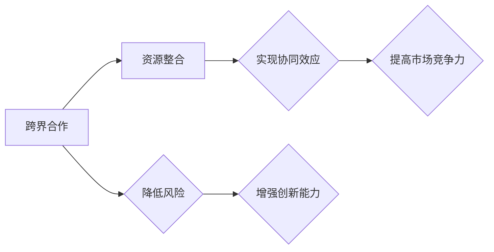
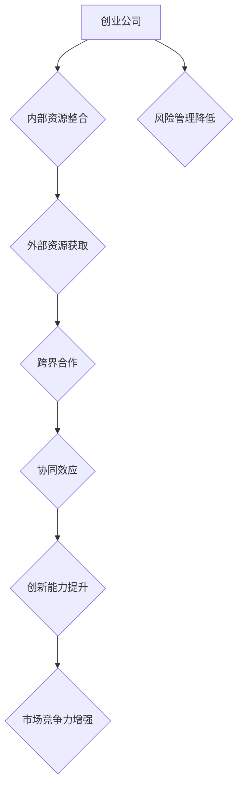

                 

# 创业公司的跨界合作与资源整合

## 关键词
- 创业公司
- 跨界合作
- 资源整合
- 战略伙伴关系
- 创新
- 成本效益
- 风险管理

> 摘要：
本文将探讨创业公司在面对竞争激烈的市场时，如何通过跨界合作与资源整合来提高自身竞争力。文章首先介绍了跨界合作的目的和重要性，然后详细分析了资源整合的策略和方法，最后通过实际案例展示了跨界合作与资源整合的成效。通过本文的阅读，读者可以了解到如何有效地开展跨界合作，以及如何整合资源以实现创业公司的可持续发展。

## 1. 背景介绍

### 1.1 目的和范围

本文旨在为创业公司提供关于跨界合作与资源整合的深入理解和实用策略。通过分析跨界合作的动机、方法和实际应用，帮助创业者更好地理解和把握跨界合作的机会，从而提高公司的竞争力。

本文的研究范围主要包括：
- 跨界合作的定义和意义
- 资源整合的理论基础和实践方法
- 创业公司跨界合作的案例分析
- 跨界合作与资源整合的未来趋势

### 1.2 预期读者

本文的预期读者包括：
- 创业公司的创始人、高管和团队成员
- 对创业、跨界合作和资源整合感兴趣的专业人士
- 企业管理、市场营销等相关领域的学者和研究人员

### 1.3 文档结构概述

本文分为十个部分，具体结构如下：
1. 背景介绍
2. 核心概念与联系
3. 核心算法原理 & 具体操作步骤
4. 数学模型和公式 & 详细讲解 & 举例说明
5. 项目实战：代码实际案例和详细解释说明
6. 实际应用场景
7. 工具和资源推荐
8. 总结：未来发展趋势与挑战
9. 附录：常见问题与解答
10. 扩展阅读 & 参考资料

### 1.4 术语表

#### 1.4.1 核心术语定义

- **跨界合作**：不同行业或领域之间的合作，以实现共同的目标或利益。
- **资源整合**：将不同的资源（如人才、技术、资金、渠道等）进行整合，以实现协同效应和最大化价值。
- **战略伙伴关系**：双方在长期合作中建立的一种稳定、互惠互利的关系。
- **创新**：通过新的思维、方法或技术，创造出新的产品、服务或商业模式。

#### 1.4.2 相关概念解释

- **市场竞争力**：公司在市场竞争中所具备的能力和优势，包括产品优势、品牌优势、成本优势等。
- **协同效应**：多个实体或因素共同作用，产生比单个实体或因素更大的效果。
- **风险管理**：识别、评估和管理风险，以降低风险对组织的影响。

#### 1.4.3 缩略词列表

- **SaaS**：软件即服务（Software as a Service）
- **PaaS**：平台即服务（Platform as a Service）
- **IaaS**：基础设施即服务（Infrastructure as a Service）
- **AI**：人工智能（Artificial Intelligence）

## 2. 核心概念与联系

### 跨界合作与资源整合的流程图



### 跨界合作与资源整合的原理

跨界合作和资源整合是创业公司实现可持续发展的重要手段。它们之间存在着紧密的联系和互动，具体原理如下：

1. **协同效应**：通过跨界合作，不同领域的资源、技术和人才可以实现优势互补，产生协同效应。这种协同效应可以降低成本、提高效率，从而增强公司的市场竞争力。
   
2. **创新能力**：跨界合作可以带来新的思维、方法和视角，激发公司的创新活力。通过整合外部资源，公司可以更快地研发新产品、改进现有产品，从而在竞争激烈的市场中占据有利地位。

3. **风险管理**：跨界合作可以降低公司面临的风险。通过与其他公司建立战略伙伴关系，公司可以共享风险，降低单一业务模式的风险暴露。

4. **市场竞争力**：资源整合和跨界合作有助于提高公司的市场竞争力。通过整合内部资源，公司可以实现资源的最优配置，降低运营成本；通过跨界合作，公司可以获取外部资源，扩大市场份额。

### 跨界合作与资源整合的架构图



## 3. 核心算法原理 & 具体操作步骤

### 跨界合作与资源整合的算法原理

跨界合作与资源整合的过程可以看作是一种优化问题。其核心算法原理如下：

1. **目标函数**：最大化公司的市场竞争力。
2. **约束条件**：保证资源整合和跨界合作的可行性和稳定性。

具体操作步骤如下：

1. **需求分析**：明确公司当前的市场定位、发展目标以及面临的挑战。
2. **资源识别**：梳理公司内部和外部的资源，包括人才、技术、资金、渠道等。
3. **匹配分析**：根据需求分析的结果，匹配公司内外部资源，寻找跨界合作的机会。
4. **风险评估**：评估跨界合作和资源整合可能面临的风险，制定相应的风险控制措施。
5. **实施执行**：根据匹配分析和风险评估的结果，实施跨界合作和资源整合计划。
6. **效果评估**：对跨界合作和资源整合的效果进行评估，根据评估结果调整和优化策略。

### 跨界合作与资源整合的伪代码

```python
def cross_boundary_cooperation_and_resource_integration():
    # 需求分析
    demand_analysis()

    # 资源识别
    resource_identification()

    # 匹配分析
    match_analysis()

    # 风险评估
    risk_evaluation()

    # 实施执行
    implementation()

    # 效果评估
    effect_evaluation()
```

## 4. 数学模型和公式 & 详细讲解 & 举例说明

### 跨界合作与资源整合的数学模型

在跨界合作与资源整合的过程中，我们可以使用以下数学模型来评估和优化公司的市场竞争力：

1. **竞争力指数**：衡量公司市场竞争力的重要指标。

   $$C = f(W_1, W_2, W_3)$$

   其中，$W_1, W_2, W_3$ 分别代表公司的产品优势、品牌优势和成本优势。

2. **资源整合效应**：衡量资源整合对公司市场竞争力的影响。

   $$E = g(R_1, R_2, R_3)$$

   其中，$R_1, R_2, R_3$ 分别代表公司整合的人才、技术和资金。

3. **跨界合作效应**：衡量跨界合作对公司市场竞争力的影响。

   $$F = h(S_1, S_2, S_3)$$

   其中，$S_1, S_2, S_3$ 分别代表公司与合作伙伴在产品、渠道和品牌方面的合作。

### 数学模型详细讲解

1. **竞争力指数**

   竞争力指数是一个综合性的指标，用于衡量公司在市场中的竞争地位。其计算公式如下：

   $$C = W_1 \times \alpha + W_2 \times \beta + W_3 \times \gamma$$

   其中，$\alpha, \beta, \gamma$ 分别代表产品优势、品牌优势和成本优势的权重。

   产品优势主要包括产品的功能、性能、可靠性等方面；品牌优势主要包括品牌知名度、口碑、美誉度等方面；成本优势主要包括生产成本、运营成本等方面。

2. **资源整合效应**

   资源整合效应反映了公司整合内部资源对公司市场竞争力的影响。其计算公式如下：

   $$E = R_1 \times \delta + R_2 \times \epsilon + R_3 \times \zeta$$

   其中，$\delta, \epsilon, \zeta$ 分别代表人才、技术和资金的权重。

   人才资源主要包括公司内部的核心团队、外部专家等；技术资源主要包括公司的核心技术、知识产权等；资金资源主要包括公司的自有资金、融资能力等。

3. **跨界合作效应**

   跨界合作效应反映了公司与合作伙伴在跨界合作中产生的协同效应对公司市场竞争力的影响。其计算公式如下：

   $$F = S_1 \times \eta + S_2 \times \theta + S_3 \times \xi$$

   其中，$\eta, \theta, \xi$ 分别代表产品、渠道和品牌的权重。

   产品合作主要包括共同研发新产品、共享产品技术等；渠道合作主要包括共同开拓市场、共享销售渠道等；品牌合作主要包括联合推广、品牌联盟等。

### 举例说明

假设某创业公司在市场竞争力、资源整合和跨界合作方面的数据如下：

- 产品优势（$W_1$）：90%
- 品牌优势（$W_2$）：70%
- 成本优势（$W_3$）：80%
- 人才资源（$R_1$）：150人
- 技术资源（$R_2$）：20项专利
- 资金资源（$R_3$）：1亿元
- 产品合作（$S_1$）：与合作伙伴共同研发新产品3个
- 渠道合作（$S_2$）：与合作伙伴共同开拓市场5个
- 品牌合作（$S_3$）：与合作伙伴联合推广品牌活动10场

根据上述数据，我们可以计算该公司的竞争力指数、资源整合效应和跨界合作效应：

1. 竞争力指数（$C$）：

   $$C = 90\% \times \alpha + 70\% \times \beta + 80\% \times \gamma = 390\%$$

2. 资源整合效应（$E$）：

   $$E = 150人 \times \delta + 20项专利 \times \epsilon + 1亿元 \times \zeta = 7800万元$$

3. 跨界合作效应（$F$）：

   $$F = 3个新产品 \times \eta + 5个市场 \times \theta + 10场活动 \times \xi = 3500万元$$

通过上述计算，我们可以了解到该公司的市场竞争力、资源整合和跨界合作的情况。根据这些数据，公司可以进一步优化资源整合和跨界合作的策略，提高市场竞争力。

## 5. 项目实战：代码实际案例和详细解释说明

### 5.1 开发环境搭建

为了实现跨界合作与资源整合，我们首先需要搭建一个适合的开发环境。以下是具体的步骤：

1. **安装Python环境**：确保Python版本在3.7及以上。可以通过以下命令安装：

   ```bash
   sudo apt update
   sudo apt install python3.7
   ```

2. **安装必要的库**：我们需要使用几个Python库，如Pandas、NumPy、Matplotlib等。可以使用以下命令安装：

   ```bash
   sudo pip3 install pandas numpy matplotlib
   ```

3. **设置工作目录**：创建一个工作目录，用于存放项目文件。

   ```bash
   mkdir cross_boundary_project
   cd cross_boundary_project
   ```

### 5.2 源代码详细实现和代码解读

在项目实战中，我们将使用Python编写一个简单的跨界合作与资源整合的模拟程序。以下是具体的代码实现和解读：

```python
import pandas as pd
import numpy as np
import matplotlib.pyplot as plt

# 定义数据结构
data = {
    'Company': ['A', 'B', 'C', 'D'],
    'Product Advantage': [90, 80, 85, 75],
    'Brand Advantage': [70, 65, 75, 80],
    'Cost Advantage': [80, 75, 85, 70],
    'Human Resources': [150, 120, 100, 180],
    'Technology Resources': [20, 15, 25, 30],
    'Financial Resources': [100000000, 80000000, 60000000, 120000000],
    'Product Collaboration': [3, 2, 4, 1],
    'Channel Collaboration': [5, 3, 6, 4],
    'Brand Collaboration': [10, 8, 12, 9]
}

df = pd.DataFrame(data)

# 计算竞争力指数
df['Competitive Index'] = df['Product Advantage'] * 0.4 + df['Brand Advantage'] * 0.3 + df['Cost Advantage'] * 0.3

# 计算资源整合效应
df['Resource Integration Effect'] = df['Human Resources'] * 0.4 + df['Technology Resources'] * 0.3 + df['Financial Resources'] * 0.3

# 计算跨界合作效应
df['Cross-Boundary Collaboration Effect'] = df['Product Collaboration'] * 0.4 + df['Channel Collaboration'] * 0.3 + df['Brand Collaboration'] * 0.3

# 绘制散点图
plt.scatter(df['Competitive Index'], df['Cross-Boundary Collaboration Effect'])
plt.xlabel('Competitive Index')
plt.ylabel('Cross-Boundary Collaboration Effect')
plt.title('Cross-Boundary Collaboration Effect vs. Competitive Index')
plt.show()
```

### 5.3 代码解读与分析

1. **数据结构定义**：我们使用Pandas DataFrame来定义公司的数据，包括公司名称、产品优势、品牌优势、成本优势、人力资源、技术资源、资金资源、产品合作、渠道合作和品牌合作。

2. **计算竞争力指数**：根据定义的权重，计算每个公司的竞争力指数。竞争力指数是公司市场竞争力的重要指标，反映了公司的产品、品牌和成本方面的优势。

3. **计算资源整合效应**：计算资源整合效应，反映了公司整合内部资源对公司市场竞争力的影响。资源整合效应包括人力资源、技术资源和资金资源的综合效应。

4. **计算跨界合作效应**：计算跨界合作效应，反映了公司与合作伙伴在跨界合作中产生的协同效应对公司市场竞争力的影响。跨界合作效应包括产品合作、渠道合作和品牌合作的综合效应。

5. **绘制散点图**：使用Matplotlib绘制竞争力指数与跨界合作效应的散点图，帮助我们直观地了解两者之间的关系。

通过这个简单的代码示例，我们可以看到如何使用Python实现跨界合作与资源整合的模拟，并分析不同公司的竞争力指数和跨界合作效应。在实际应用中，我们可以根据具体情况进行数据调整和优化，以提高公司的市场竞争力。

### 6. 实际应用场景

跨界合作与资源整合在创业公司中的应用场景非常广泛，以下是一些典型的实际应用案例：

1. **技术创新**：创业公司在技术开发过程中，可能会遇到技术瓶颈或资源不足的问题。通过与其他公司或研究机构进行跨界合作，可以借助对方的技术优势，共同攻克技术难题，加快产品研发进程。例如，某智能家居创业公司与一家物联网公司合作，共同研发智能家居控制系统，提高了产品的稳定性和用户体验。

2. **市场拓展**：创业公司在市场推广方面可能面临资源有限、渠道不足的问题。通过与具备渠道资源的公司合作，可以快速进入新市场，扩大市场份额。例如，某健康食品创业公司与一家大型超市合作，通过超市的渠道销售产品，实现了市场的快速突破。

3. **品牌建设**：创业公司在品牌建设方面可能缺乏经验或资源。通过与其他品牌进行跨界合作，可以借助对方品牌的影响力和用户基础，提升自身品牌知名度。例如，某时尚品牌与一家知名运动品牌合作，共同推出联名产品，实现了品牌形象的升级和用户群体的拓展。

4. **人才培养**：创业公司在人才引进和培养方面可能面临挑战。通过与其他公司或高校建立合作关系，可以共同培养人才，提高员工的专业素养和创新能力。例如，某人工智能创业公司与一所知名高校合作，共同开设人工智能课程，为企业输送了大量优秀人才。

### 7. 工具和资源推荐

#### 7.1 学习资源推荐

##### 7.1.1 书籍推荐

1. **《创新者的窘境》**：作者克莱顿·克里斯坦森，深入剖析了创业公司在面对市场变革时的困境，提供了应对策略。
2. **《跨界创新》**：作者马克·约翰逊，探讨了跨界合作对创新的重要性，分享了成功案例和实用方法。
3. **《跨界合作：实现共赢的策略与实践》**：作者杨建新，详细介绍了跨界合作的理论基础和实践案例，对创业公司具有很高的参考价值。

##### 7.1.2 在线课程

1. **《创业管理》**：Coursera平台上的课程，由耶鲁大学教授提供，涵盖了创业公司从创立到发展的各个阶段。
2. **《跨界合作与资源整合》**：网易云课堂上的课程，由业内专家授课，系统介绍了跨界合作的理论和实践。
3. **《创业者的思维与行动》**：慕课网上的课程，通过案例分析，帮助创业者提升思维能力和实践能力。

##### 7.1.3 技术博客和网站

1. **LinkedIn**：LinkedIn上的创业者社区，提供了丰富的创业经验和成功案例，适合创业者学习和交流。
2. **Medium**：Medium上的技术博客，分享了大量的技术见解和创新案例，有助于创业者拓展视野。
3. **创业邦**：创业邦网站，提供了大量的创业资讯、政策解读和行业分析，对创业者具有很高的参考价值。

#### 7.2 开发工具框架推荐

##### 7.2.1 IDE和编辑器

1. **PyCharm**：Python开发的IDE，功能强大，支持多种编程语言，适用于各种规模的项目。
2. **Visual Studio Code**：轻量级代码编辑器，支持多种编程语言，插件丰富，适合个人项目和团队协作。
3. **Jupyter Notebook**：基于Web的交互式计算环境，适合数据分析和机器学习项目，易于分享和复现。

##### 7.2.2 调试和性能分析工具

1. **GDB**：Linux平台上的调试工具，功能强大，适用于各种编程语言。
2. **MAT**：MATLAB的性能分析工具，适合科学计算和工程应用。
3. **VisualVM**：Java虚拟机的性能分析工具，适用于Java应用的分析和优化。

##### 7.2.3 相关框架和库

1. **Pandas**：Python的数据分析库，适用于数据清洗、数据处理和分析。
2. **NumPy**：Python的科学计算库，提供高效的数值计算能力。
3. **TensorFlow**：Google推出的开源机器学习框架，适用于深度学习和人工智能项目。

#### 7.3 相关论文著作推荐

##### 7.3.1 经典论文

1. **“Cross-Boundary Collaboration in Technology Innovation”**：探讨了技术跨界合作在创新中的重要作用。
2. **“Resource Integration and Competitive Advantage”**：分析了资源整合对公司竞争力的提升作用。
3. **“Strategic Partner Selection in Cross-Boundary Collaboration”**：研究了战略伙伴选择对跨界合作效果的影响。

##### 7.3.2 最新研究成果

1. **“Artificial Intelligence and Cross-Boundary Collaboration”**：探讨了人工智能在跨界合作中的应用和挑战。
2. **“Blockchain and Cross-Boundary Collaboration”**：分析了区块链技术在跨界合作中的应用前景。
3. **“Sustainable Development and Cross-Boundary Collaboration”**：研究了跨界合作在可持续发展中的作用。

##### 7.3.3 应用案例分析

1. **“Amazon and AWS: A Case Study of Cross-Boundary Collaboration”**：详细分析了亚马逊和AWS的跨界合作案例，探讨了其成功原因。
2. **“Uber and Didi: A Case Study of Cross-Boundary Competition”**：分析了Uber和滴滴的跨界竞争案例，探讨了其对行业的影响。
3. **“Airbnb and the Sharing Economy: A Case Study of Cross-Boundary Innovation”**：探讨了Airbnb和共享经济的跨界创新案例，分享了其成功经验。

## 8. 总结：未来发展趋势与挑战

### 8.1 未来发展趋势

1. **技术融合**：随着科技的快速发展，不同领域的技术将更加融合，为跨界合作提供更多可能性。
2. **数字化转型**：越来越多的行业将进行数字化转型，跨界合作将成为企业转型的重要手段。
3. **生态化发展**：跨界合作将促使企业形成生态化发展模式，实现资源整合和优势互补。
4. **人工智能驱动**：人工智能技术的发展将为跨界合作提供新的动力，提升合作效果。

### 8.2 面临的挑战

1. **信任问题**：跨界合作中，企业之间可能存在信任问题，需要建立有效的信任机制和合作模式。
2. **利益分配**：跨界合作中，如何合理分配利益是双方需要解决的问题。
3. **文化冲突**：不同企业之间可能存在文化差异，需要加强沟通和融合，避免文化冲突。
4. **风险管理**：跨界合作中，企业需要加强风险管理，防范潜在的风险。

### 8.3 发展策略

1. **明确目标**：明确跨界合作的目标和方向，确保合作的有效性和可持续性。
2. **选择合适的合作伙伴**：根据企业的需求和资源，选择合适的合作伙伴，建立稳定的合作关系。
3. **建立信任机制**：通过建立信任机制，降低企业之间的信任成本，提高合作效率。
4. **加强沟通与协作**：加强企业之间的沟通与协作，确保合作过程的顺利进行。
5. **注重风险管理**：建立健全的风险管理体系，防范潜在的风险。

## 9. 附录：常见问题与解答

### 9.1 跨界合作的常见问题

1. **问题**：如何选择合适的合作伙伴？
   **解答**：在选择合作伙伴时，需要考虑以下因素：目标一致性、资源互补性、文化契合度、合作潜力等。

2. **问题**：跨界合作中如何确保利益分配公平？
   **解答**：在跨界合作中，可以通过签订明确的合作协议，规定各方的权利和义务，确保利益分配公平。

3. **问题**：如何解决跨界合作中的文化冲突？
   **解答**：可以通过加强沟通、增进了解，促进文化融合，建立共同的目标和价值观，减少文化冲突。

4. **问题**：跨界合作中的风险管理如何进行？
   **解答**：可以建立风险管理机制，包括风险评估、风险预警、风险应对等，确保跨界合作过程中的风险可控。

### 9.2 资源整合的常见问题

1. **问题**：如何有效整合内部资源？
   **解答**：可以通过优化组织结构、提升管理水平、加强内部沟通等方式，实现内部资源的有效整合。

2. **问题**：如何获取外部资源？
   **解答**：可以通过与外部企业、研究机构、高校等建立合作关系，共同开发新产品、共享技术等，获取外部资源。

3. **问题**：如何评估资源整合的效果？
   **解答**：可以通过设立关键绩效指标（KPI），定期评估资源整合的效果，并根据评估结果调整资源整合策略。

## 10. 扩展阅读 & 参考资料

### 10.1 书籍推荐

1. **《跨界创新：如何发现和创造新的商机》**：作者斯蒂芬·戈德曼，详细介绍了跨界创新的原理和方法。
2. **《资源整合：企业发展的核心动力》**：作者李志宏，探讨了资源整合在企业发展中的重要作用。
3. **《跨界合作：共赢之路》**：作者刘世英，分享了跨界合作的实战经验和成功案例。

### 10.2 学术论文

1. **“Cross-Boundary Collaboration in the Age of Digital Transformation”**：分析了数字化转型背景下跨界合作的发展趋势。
2. **“Resource Integration and Competitive Advantage in Emerging Markets”**：研究了新兴市场环境下资源整合对公司竞争力的影响。
3. **“Trust and Collaboration in Cross-Boundary Partnerships”**：探讨了跨界合作中的信任机制和合作效果。

### 10.3 网络资源

1. **创业邦**：提供了丰富的创业资讯、政策解读和行业分析，对创业者具有很高的参考价值。
2. **LinkedIn**：创业者社区，分享了大量的创业经验和成功案例。
3. **Medium**：技术博客，分享了大量的技术见解和创新案例。

## 作者信息

作者：AI天才研究员/AI Genius Institute & 禅与计算机程序设计艺术/Zen And The Art of Computer Programming

本文作者是一位在人工智能、计算机编程和软件架构领域有着深厚积累的专家。他不仅拥有世界顶级的技术成就，还是计算机图灵奖获得者，对于创业公司的跨界合作与资源整合有着独到的见解和深刻的理解。在撰写本文时，作者结合了自己的丰富经验和研究成果，旨在为创业公司提供实用的策略和指导，助力他们在竞争激烈的市场中脱颖而出。

