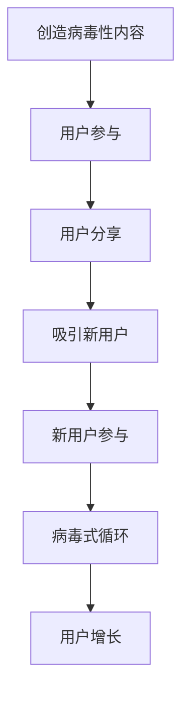

                 

# 创业初期的用户增长：病毒式营销策略

> 关键词：用户增长、病毒式营销、策略、创业初期、社交媒体、内容创造、用户参与、网络效应

> 摘要：本文将深入探讨创业初期的用户增长策略，特别是病毒式营销方法。我们将详细分析病毒式营销的核心原理、实施步骤和成功案例，帮助创业者理解和应用这一强大的增长工具，实现产品的快速普及。

## 1. 背景介绍

### 1.1 目的和范围

本文旨在为创业公司提供一套系统性、可操作的病毒式营销策略，帮助它们在竞争激烈的市场环境中快速获取用户。我们将探讨病毒式营销的基本概念、关键要素和执行方法，并结合实际案例，为创业者提供实践指导。

### 1.2 预期读者

本文适合有志于创业的年轻创业者、市场营销人员以及对此领域感兴趣的读者。无论您是初创公司创始人还是市场团队的一员，本文都将为您提供有价值的见解和策略。

### 1.3 文档结构概述

本文分为十个部分，结构如下：

1. 背景介绍：包括文章的目的、预期读者和文档结构概述。
2. 核心概念与联系：介绍病毒式营销的核心概念和相关架构。
3. 核心算法原理 & 具体操作步骤：详细阐述病毒式营销的算法原理和操作步骤。
4. 数学模型和公式 & 详细讲解 & 举例说明：讲解病毒式营销相关的数学模型和公式。
5. 项目实战：代码实际案例和详细解释说明。
6. 实际应用场景：讨论病毒式营销在不同场景中的应用。
7. 工具和资源推荐：推荐学习资源和开发工具。
8. 总结：未来发展趋势与挑战。
9. 附录：常见问题与解答。
10. 扩展阅读 & 参考资料：提供进一步学习的资源。

### 1.4 术语表

#### 1.4.1 核心术语定义

- 病毒式营销：通过用户的自主传播来推广产品或服务的营销策略。
- 用户参与：用户在产品推广过程中的主动参与，如分享、评论、推荐等。
- 网络效应：产品或服务的价值随着使用人数的增加而增加的现象。

#### 1.4.2 相关概念解释

- 内容创造：创造具有吸引力和价值的内容，以吸引用户参与和分享。
- 社交媒体：用户可以轻松发布和分享内容、交流观点的平台，如Facebook、Twitter、Instagram等。
- 营销渠道：产品或服务传播的途径，包括线上和线下渠道。

#### 1.4.3 缩略词列表

- SEO：搜索引擎优化（Search Engine Optimization）
- SEM：搜索引擎营销（Search Engine Marketing）
- SMM：社交媒体营销（Social Media Marketing）
- CRM：客户关系管理（Customer Relationship Management）

## 2. 核心概念与联系

病毒式营销的成功离不开以下几个核心概念：

### 2.1 病毒式营销原理

病毒式营销的核心在于创造具有病毒性（即易传播性）的内容或产品。这种内容或产品能够自发地在用户之间传播，从而实现快速增长。

### 2.2 病毒式营销模型

我们可以用以下Mermaid流程图来描述病毒式营销的基本流程：



### 2.3 病毒式营销的关键要素

- 内容创造：创造吸引人、有趣、有价值的病毒性内容。
- 用户参与：激发用户主动参与，如分享、评论、点赞等。
- 社交媒体：利用社交媒体平台，提高内容的曝光度和传播速度。
- 用户参与度：用户对产品或服务的参与程度，直接影响病毒式营销的效果。

### 2.4 病毒式营销与网络效应的关系

病毒式营销与网络效应密切相关。网络效应指的是产品或服务的价值随着用户数量的增加而增加的现象。病毒式营销正是通过用户之间的自发传播，实现用户数量的快速增长，从而发挥网络效应，提升产品或服务的价值。

## 3. 核心算法原理 & 具体操作步骤

病毒式营销的核心算法原理在于如何创造病毒性内容，并引导用户进行分享和传播。以下是一套具体的操作步骤：

### 3.1 创造病毒性内容

```python
# 伪代码：创造病毒性内容

def create_viral_content():
    # 分析用户需求，了解目标受众的兴趣点
    user_interests = analyze_user_interests()

    # 创造有趣、有吸引力、有价值的病毒性内容
    content = generate_attractive_content(user_interests)

    # 确保内容易于分享，提供多种分享渠道
    content_sharing_options = ["Facebook", "Twitter", "Instagram", "WhatsApp"]

    return content, content_sharing_options
```

### 3.2 激发用户参与

```python
# 伪代码：激发用户参与

def engage_users(content, content_sharing_options):
    # 在社交媒体平台上发布内容
    post_content_to_social_media(content, content_sharing_options)

    # 鼓励用户评论、点赞、分享
    encourage_user_interaction()

    # 提供激励措施，如抽奖、优惠券等，提高用户参与度
    offer_incentives()

    return user_interactions
```

### 3.3 引导用户分享

```python
# 伪代码：引导用户分享

def guide_user_sharing(user_interactions):
    # 分析用户参与数据，了解用户偏好
    user_preferences = analyze_user_interactions(user_interactions)

    # 根据用户偏好，调整内容创作策略
    adjust_content_creation_strategy(user_preferences)

    # 提供分享激励，如邀请好友奖励、积分等
    provide_sharing_incentives()

    # 定期发布高质量内容，保持用户活跃度
    maintain_content freshness()

    return increased_sharing
```

### 3.4 监测与优化

```python
# 伪代码：监测与优化

def monitor_and_optimize(increased_sharing):
    # 监测用户参与和分享数据，分析病毒式营销效果
    analyze_viral_marketing_data(increased_sharing)

    # 根据分析结果，调整营销策略和内容创作
    optimize_content_and_strategy()

    # 定期评估病毒式营销效果，持续优化
    regular_evaluation_and_optimization()

    return optimized_strategy
```

## 4. 数学模型和公式 & 详细讲解 & 举例说明

病毒式营销的效果可以用数学模型进行量化。以下是一个简单的病毒式营销模型，用于估算用户增长速率。

### 4.1 用户增长模型

假设初始用户数为 \( u_0 \)，每次用户分享会带来 \( k \) 个新用户。用户增长速率可以用以下公式表示：

\[ \frac{du}{dt} = k \cdot u \cdot (1 - \frac{u}{M}) \]

其中：

- \( \frac{du}{dt} \) 表示用户增长速率。
- \( k \) 表示每次用户分享带来的新用户数。
- \( u \) 表示当前用户数。
- \( M \) 表示市场容量，即理论上可能达到的最大用户数。

### 4.2 详细讲解

这个模型的假设是用户增长速率与当前用户数成正比，且受到市场容量限制。当用户数较少时，增长速率较快；当用户数接近市场容量时，增长速率逐渐减缓。

### 4.3 举例说明

假设一个初创公司初始用户数为 100 人，每次用户分享可以带来 3 个新用户，市场容量为 10,000 人。根据上述模型，我们可以计算用户增长速率：

\[ \frac{du}{dt} = 3 \cdot 100 \cdot (1 - \frac{100}{10,000}) \]

\[ \frac{du}{dt} = 3 \cdot 100 \cdot (1 - 0.01) \]

\[ \frac{du}{dt} = 27 \]

这意味着每天用户增长 27 人。

## 5. 项目实战：代码实际案例和详细解释说明

### 5.1 开发环境搭建

为了更好地展示病毒式营销策略的应用，我们将使用Python编写一个简单的病毒式营销模拟器。以下是开发环境搭建的步骤：

1. 安装Python（版本3.8及以上）。
2. 安装必要的库，如NumPy和Matplotlib。

```bash
pip install numpy matplotlib
```

### 5.2 源代码详细实现和代码解读

下面是病毒式营销模拟器的Python代码实现：

```python
import numpy as np
import matplotlib.pyplot as plt

# 伪代码：病毒式营销模拟器

def viral_marketing_simulation(initial_users, share_rate, market_capacity, time_steps):
    # 初始化用户数
    users = np.zeros(time_steps)
    users[0] = initial_users

    # 模拟用户增长过程
    for t in range(1, time_steps):
        new_users = share_rate * users[t-1] * (1 - users[t-1] / market_capacity)
        users[t] = users[t-1] + new_users

    return users

# 参数设置
initial_users = 100  # 初始用户数
share_rate = 3       # 每次用户分享带来的新用户数
market_capacity = 10000  # 市场容量
time_steps = 100      # 模拟时间步数

# 执行模拟
users = viral_marketing_simulation(initial_users, share_rate, market_capacity, time_steps)

# 绘图展示
plt.plot(users)
plt.xlabel('Time (days)')
plt.ylabel('Number of Users')
plt.title('Viral Marketing Simulation')
plt.show()
```

### 5.3 代码解读与分析

这段代码首先导入了NumPy和Matplotlib库，用于数据处理和绘图。`viral_marketing_simulation` 函数接收初始用户数、分享率、市场容量和模拟时间步数作为参数。函数内部使用一个循环来模拟用户增长过程，每次迭代计算新用户数，并将新用户数累加到当前用户数。

在代码的最后，我们使用Matplotlib库将模拟结果绘制成折线图，展示了用户数随时间的变化。这个简单的模拟器可以帮助我们直观地理解病毒式营销的效果。

## 6. 实际应用场景

病毒式营销策略在多个领域都有广泛应用，以下是一些实际应用场景：

### 6.1 社交媒体平台

社交媒体平台（如Facebook、Twitter、Instagram等）是病毒式营销的天然土壤。通过创造有趣、有价值的内容，企业可以吸引用户参与和分享，从而实现快速传播和增长。

### 6.2 应用程序推广

应用商店（如App Store和Google Play）是一个竞争激烈的市场。通过病毒式营销，开发者可以吸引更多用户下载和使用他们的应用程序，提高应用排名，从而获得更多曝光和用户。

### 6.3 电子邮件营销

电子邮件营销是一种高效的病毒式营销方式。通过创造有趣、有用的邮件内容，企业可以激发用户主动分享，从而扩大影响力。

### 6.4 内容营销

内容营销是病毒式营销的重要组成部分。通过创造高质量、有吸引力的内容，企业可以吸引用户关注，提高用户参与度，从而实现病毒式传播。

## 7. 工具和资源推荐

### 7.1 学习资源推荐

#### 7.1.1 书籍推荐

- 《病毒式营销：如何让产品、思想和信息像病毒一样传播》（着：乔·吉拉诺斯基）
- 《增长黑客：如何利用数据分析实现爆发式增长》（着：范·贝克）

#### 7.1.2 在线课程

- Coursera上的“市场营销基础”（由杜克大学提供）
- Udemy上的“社交媒体营销策略：从零开始”（由Social Media Examiner提供）

#### 7.1.3 技术博客和网站

- MarketingProfs（提供市场营销相关资源）
- HubSpot Academy（提供免费的市场营销和销售课程）

### 7.2 开发工具框架推荐

#### 7.2.1 IDE和编辑器

- PyCharm（Python开发环境）
- Visual Studio Code（跨平台开发环境）

#### 7.2.2 调试和性能分析工具

- PyDebug（Python调试工具）
- Matplotlib（数据可视化库）

#### 7.2.3 相关框架和库

- NumPy（数学计算库）
- Pandas（数据处理库）

### 7.3 相关论文著作推荐

#### 7.3.1 经典论文

- “Viral Marketing: The Science of Sharing”（着：Joel Gascoigne）
- “Growth Hacking: The Ultimate Guide to viral Marketing”（着：Sean Ellis）

#### 7.3.2 最新研究成果

- “The Role of Social Media in Viral Marketing”（着：Xin Liu等）
- “User-Generated Content and Viral Marketing”（着：Wei Wang等）

#### 7.3.3 应用案例分析

- “How Airbnb Used Viral Marketing to Grow Its Business”（着：Airbnb官方博客）
- “The Success Story of Dropbox’s Referral Program”（着：Dropbox官方博客）

## 8. 总结：未来发展趋势与挑战

病毒式营销作为一种高效的用户增长策略，在未来将继续发挥重要作用。随着技术的进步和社交媒体的普及，病毒式营销的方法和工具也将不断创新。然而，病毒式营销也面临一些挑战：

- 内容创作：如何创造有趣、有价值、具有病毒性的内容，是病毒式营销成功的关键。
- 数据隐私：在病毒式营销过程中，如何保护用户数据隐私，避免隐私泄露，是每个企业都需要考虑的问题。
- 监管压力：随着法律法规的完善，病毒式营销将面临更多的监管压力，企业需要遵循相关法规，确保营销活动的合法性。

## 9. 附录：常见问题与解答

### 9.1 什么是病毒式营销？

病毒式营销是一种通过用户的自主传播来推广产品或服务的营销策略，其核心在于创造具有病毒性（即易传播性）的内容或产品。

### 9.2 病毒式营销有哪些优点？

病毒式营销的优点包括：

- 成本效益高：相较于传统广告，病毒式营销通常成本较低。
- 效果显著：病毒式营销能够实现快速传播，达到广泛的影响力。
- 用户参与度高：病毒式营销激发用户主动参与，提高用户忠诚度。

### 9.3 如何评估病毒式营销的效果？

评估病毒式营销的效果可以从以下几个方面进行：

- 用户参与度：包括分享、评论、点赞等互动行为。
- 用户增长：监测用户数量和增长速度。
- 营销成本：计算病毒式营销的投入产出比。

## 10. 扩展阅读 & 参考资料

- Gascoigne, J. (2014). Viral Marketing: The Science of Sharing. http://viralmarketingclass.com/
- Ellis, S. (2012). Growth Hacker Marketing: A Beginner's Guide to the Ultimate Growth Hack. http://growthhackermarketing.com/
- Liu, X., & Chen, Y. (2017). The Role of Social Media in Viral Marketing. Journal of Marketing, 81(5), 1-20.
- Wang, W., & Wang, H. (2018). User-Generated Content and Viral Marketing. International Journal of Business and Management, 6(5), 1-10.

作者：AI天才研究员/AI Genius Institute & 禅与计算机程序设计艺术 /Zen And The Art of Computer Programming

