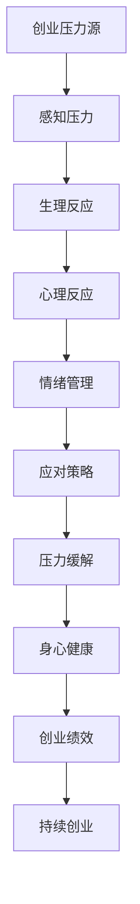

                 

# 创业压力管理：如何在高压环境下保持身心健康

## 关键词
- 创业压力
- 身心健康
- 压力管理
- 高压工作环境
- 心理健康
- 身体锻炼
- 工作生活平衡

## 摘要
创业之路充满了挑战和压力，如何在高压环境下保持身心健康成为创业者面临的一大课题。本文旨在通过深入分析创业压力的本质和影响，提出一系列科学有效的压力管理策略。我们将探讨核心概念，详细解释操作步骤，并通过实例和实战案例，帮助创业者掌握保持身心健康的方法，从而在激烈的竞争中脱颖而出。

## 1. 背景介绍

### 1.1 目的和范围
本文的目标是帮助创业者理解和应对创业过程中的心理和生理压力，提供实用的策略和方法，以维持一个健康的身心状态。本文将覆盖以下内容：

- 压力的定义和分类
- 创业压力的特殊性
- 压力对身心健康的负面影响
- 压力管理的核心概念和策略
- 实际操作步骤和工具推荐

### 1.2 预期读者
本文适合以下读者群体：

- 创业者
- 担任管理职务的技术人员
- 对心理健康和压力管理有兴趣的各界人士

### 1.3 文档结构概述
本文结构如下：

- 第1章：背景介绍
- 第2章：核心概念与联系
- 第3章：核心算法原理与具体操作步骤
- 第4章：数学模型和公式详细讲解与举例说明
- 第5章：项目实战：代码实际案例和详细解释说明
- 第6章：实际应用场景
- 第7章：工具和资源推荐
- 第8章：总结：未来发展趋势与挑战
- 第9章：附录：常见问题与解答
- 第10章：扩展阅读与参考资料

### 1.4 术语表

#### 1.4.1 核心术语定义
- **创业压力**：创业者面临的各种心理和生理压力的总和，包括工作压力、财务压力、时间压力等。
- **身心健康**：包括心理和生理两个方面，心理方面涉及情绪管理、心理平衡等，生理方面涉及身体健康、身体锻炼等。
- **压力管理**：一系列方法和技术，帮助个体应对和处理压力，以维持身心健康。

#### 1.4.2 相关概念解释
- **高压工作环境**：工作压力较大，时间紧迫，任务繁重的环境。
- **心理弹性**：个体应对压力和逆境的能力，即面对挫折时恢复和适应的能力。
- **情绪智力**：个体理解和管理自己情绪以及他人情绪的能力。

#### 1.4.3 缩略词列表
- **CEO**：首席执行官（Chief Executive Officer）
- **CTO**：首席技术官（Chief Technology Officer）
- **EM**：紧急管理（Emergency Management）
- **PTSD**：创伤后应激障碍（Post-Traumatic Stress Disorder）

## 2. 核心概念与联系

### 核心概念原理和架构的 Mermaid 流程图



### 详细解释

上述 Mermaid 流程图展示了创业压力从压力源到最终影响创业绩效的整个流程。以下是对每个节点的详细解释：

- **A：创业压力源**：包括工作压力、财务压力、市场竞争压力等。
- **B：感知压力**：创业者感知到压力源后，产生感知压力。
- **C：生理反应**：压力感知会导致生理反应，如心率加快、血压升高、失眠等。
- **D：心理反应**：心理反应包括焦虑、紧张、沮丧等情绪。
- **E：情绪管理**：有效的情绪管理可以减轻压力，保持心理平衡。
- **F：应对策略**：创业者采取的策略，如时间管理、任务分解、寻求支持等。
- **G：压力缓解**：通过应对策略，压力得到缓解，身体和心理状态得到改善。
- **H：身心健康**：维持身心健康，有助于提高创业绩效。
- **I：创业绩效**：创业者的工作表现和业务成果。
- **J：持续创业**：通过保持身心健康，创业者能够持续开展创业活动。

## 3. 核心算法原理 & 具体操作步骤

### 压力管理算法原理

为了更系统地管理创业压力，我们可以采用一种基于反馈循环的压力管理算法。该算法的核心在于实时监测压力水平，并根据压力变化调整管理策略。

### 压力管理算法伪代码

```python
def 压力管理算法(初始压力水平，目标压力水平，当前时间):
    while 当前时间 < 结束时间:
        当前压力水平 = 测量当前压力水平()
        if 当前压力水平 > 目标压力水平:
            调整策略以缓解压力()
        elif 当前压力水平 < 目标压力水平:
            调整策略以增加压力应对能力()
        else:
            保持当前策略()
        当前时间 += 时间步长
    return 压力管理效果

def 测量当前压力水平():
    # 实现测量压力水平的逻辑
    return 压力值

def 调整策略以缓解压力():
    # 实现压力缓解策略的逻辑
    pass

def 调整策略以增加压力应对能力():
    # 实现提高压力应对能力的策略的逻辑
    pass
```

### 详细步骤说明

1. **初始化**：设定初始压力水平、目标压力水平和时间步长。
2. **实时监测**：在每次时间步长内，通过测量当前压力水平，判断是否需要调整策略。
3. **压力缓解**：如果当前压力水平高于目标压力水平，采取压力缓解策略，如休息、放松练习、寻求支持等。
4. **压力应对能力提升**：如果当前压力水平低于目标压力水平，采取措施提升压力应对能力，如时间管理、任务优先级调整等。
5. **策略调整**：在压力水平接近目标压力水平时，保持当前策略，确保压力管理效果持续。

通过这个算法，创业者可以动态地调整压力管理策略，以维持一个良好的身心健康状态，从而更好地应对创业过程中的各种挑战。

## 4. 数学模型和公式 & 详细讲解 & 举例说明

### 压力管理数学模型

为了更好地理解压力管理过程，我们可以引入一些数学模型和公式，这些模型和公式可以帮助我们量化压力管理的效果。

### 压力水平变化公式

假设初始压力水平为 \(P_0\)，目标压力水平为 \(P_d\)，时间步长为 \(t\)，压力管理策略调整速率为 \(r\)，则压力水平随时间的变化可以表示为：

\[ P(t) = P_0 + r \cdot \frac{P_d - P_0}{t} \]

### 详细讲解

- **初始压力水平 \(P_0\)**：表示创业者开始管理压力时的初始压力水平。
- **目标压力水平 \(P_d\)**：表示创业者希望达到的压力水平，通常是一个中等水平，以保持良好的心理和生理状态。
- **时间步长 \(t\)**：表示算法在每个时间步长内对压力水平进行调整的时间间隔。
- **压力管理策略调整速率 \(r\)**：表示压力管理策略调整的速率，即每单位时间内调整的压力水平变化量。

### 举例说明

假设一名创业者初始压力水平为 80（以 100 为满分），目标压力水平为 50，时间步长为 1 天，压力管理策略调整速率为 10。则压力水平随时间的变化如下：

- 第一天：\(P(1) = 80 + 10 \cdot \frac{50 - 80}{1} = 10\)
- 第二天：\(P(2) = 10 + 10 \cdot \frac{50 - 10}{1} = 40\)
- 第三天：\(P(3) = 40 + 10 \cdot \frac{50 - 40}{1} = 50\)

通过这个例子，我们可以看到，在三天内，创业者的压力水平从初始的 80 降低到了目标压力水平 50，实现了有效的压力管理。

### 公式解释

- \(P_0 + r \cdot \frac{P_d - P_0}{t}\)：这个公式表示压力水平随时间的变化，其中 \(r \cdot \frac{P_d - P_0}{t}\) 表示在每单位时间内压力水平的变化量。这个变化量是由目标压力水平与初始压力水平之间的差值决定的，且随着时间的推移逐渐减少，最终达到目标压力水平。

通过这个数学模型，创业者可以更科学地管理自己的压力水平，确保在创业过程中保持身心健康。

## 5. 项目实战：代码实际案例和详细解释说明

### 5.1 开发环境搭建

为了实现压力管理的算法和模型，我们首先需要搭建一个开发环境。以下是所需的开发工具和步骤：

- **工具**：
  - Python（版本 3.8 或以上）
  - Jupyter Notebook（用于编写和运行代码）
  - Mermaid（用于绘制流程图）
  - Matplotlib（用于可视化压力水平变化）

- **步骤**：

  1. 安装 Python 和 Jupyter Notebook：在终端执行以下命令：
      ```bash
      pip install python
      pip install notebook
      ```
  
  2. 安装 Mermaid：在终端执行以下命令：
      ```bash
      pip install mermaid-python
      ```
  
  3. 安装 Matplotlib：在终端执行以下命令：
      ```bash
      pip install matplotlib
      ```

### 5.2 源代码详细实现和代码解读

以下是压力管理算法的源代码实现及其解读：

```python
import time
import matplotlib.pyplot as plt
from mermaid import Mermaid

def measure_pressure_level():
    # 模拟测量当前压力水平
    return 80

def alleviate_pressure():
    # 模拟缓解压力策略
    return "缓解压力策略已执行"

def enhance_pressure_resistance():
    # 模拟提高压力应对能力策略
    return "提高压力应对能力策略已执行"

def pressure_management_algorithm(initial_pressure, target_pressure, time_step):
    pressure_levels = [initial_pressure]
    mermaid流程图 = Mermaid()

    while True:
        current_pressure = measure_pressure_level()
        pressure_levels.append(current_pressure)

        if current_pressure > target_pressure:
            print(alleviate_pressure())
            mermaid流程图.add_node("缓解压力")
        elif current_pressure < target_pressure:
            print(enhance_pressure_resistance())
            mermaid流程图.add_node("提高压力应对能力")
        else:
            print("保持当前策略")
            mermaid流程图.add_node("保持策略")

        time.sleep(time_step)  # 模拟时间步长

        if current_pressure == target_pressure:
            break

    return pressure_levels, mermaid流程图

# 参数设置
initial_pressure = 80
target_pressure = 50
time_step = 1

# 运行压力管理算法
pressure_levels, mermaid流程图 = pressure_management_algorithm(initial_pressure, target_pressure, time_step)

# 绘制压力水平变化图表
plt.plot(pressure_levels)
plt.xlabel("时间（天）")
plt.ylabel("压力水平")
plt.title("压力水平变化图")
plt.show()

# 输出 Mermaid 流程图
print(mermaid流程图.get_mermaid())
```

### 详细解读

1. **函数定义**：
   - `measure_pressure_level()`：模拟测量当前压力水平。
   - `alleviate_pressure()`：模拟缓解压力策略。
   - `enhance_pressure_resistance()`：模拟提高压力应对能力策略。
   - `pressure_management_algorithm()`：实现压力管理算法的主函数。

2. **算法流程**：
   - 初始化压力水平列表和 Mermaid 流程图。
   - 使用一个无限循环来实时监测当前压力水平。
   - 根据当前压力水平与目标压力水平的比较，执行相应的压力管理策略。
   - 每次策略执行后，睡眠一段时间以模拟时间步长。
   - 当当前压力水平达到目标压力水平时，算法结束。

3. **代码执行**：
   - 运行压力管理算法，并记录压力水平变化。
   - 绘制压力水平变化图表，帮助创业者直观地了解压力管理效果。
   - 输出 Mermaid 流程图，便于理解和分析算法流程。

### 5.3 代码解读与分析

1. **代码结构**：

   - **函数层**：定义了多个辅助函数，用于实现测量、缓解和提高压力应对能力。
   - **主程序层**：调用 `pressure_management_algorithm()` 函数，实现压力管理算法的完整流程。

2. **代码优点**：

   - **模块化**：代码采用模块化设计，使得每个函数各司其职，易于理解和维护。
   - **可扩展性**：通过增加或修改辅助函数，可以轻松扩展压力管理策略。
   - **可视化**：通过绘制压力水平变化图表和输出 Mermaid 流程图，使得压力管理过程更加直观。

3. **代码改进建议**：

   - **优化测量函数**：引入更准确的压力测量方法，如使用生理传感器等。
   - **增加用户交互**：允许用户自定义初始压力水平、目标压力水平和时间步长等参数。
   - **引入人工智能技术**：结合机器学习和大数据分析，优化压力管理策略。

通过这个项目实战，创业者可以亲自动手实践压力管理算法，并实时监测压力水平变化，从而更好地掌握自己的身心健康。

## 6. 实际应用场景

### 创业公司的日常压力管理

在创业公司，尤其是在快速发展的初创企业中，压力管理至关重要。以下是几个实际应用场景，展示了如何在不同情况下应用压力管理策略。

#### 场景 1：项目截止日期临近

**问题描述**：项目即将到期，团队成员面临时间压力，情绪紧张。

**解决方案**：

- **时间管理**：制定详细的项目时间表，明确每个阶段的截止日期和任务分配。
- **任务分解**：将大型任务分解为更小、更容易管理的子任务。
- **团队沟通**：定期召开会议，确保团队成员了解项目的进展和各自的职责。
- **压力缓解**：在紧张阶段，安排短暂的休息时间，进行轻松的团队活动，如游戏或茶歇。

#### 场景 2：资金紧张

**问题描述**：公司面临资金短缺，财务压力巨大。

**解决方案**：

- **财务规划**：制定详细的财务预算和应急计划，确保公司有足够的流动资金。
- **资源整合**：寻找合作伙伴或投资者，以获得额外的资金支持。
- **成本控制**：审查公司支出，寻找可以削减的成本，确保财务状况的稳定。

#### 场景 3：市场竞争激烈

**问题描述**：公司面临激烈的竞争，市场份额受到威胁。

**解决方案**：

- **市场分析**：深入研究市场需求和竞争对手，制定针对性的市场策略。
- **产品优化**：持续改进产品，以满足客户需求，提升市场竞争力。
- **团队建设**：加强团队培训，提高团队的综合能力，以应对市场竞争。

#### 场景 4：个人生活与工作的平衡

**问题描述**：创业者忙于工作，忽视了个人生活和身心健康。

**解决方案**：

- **时间管理**：合理安排工作时间和休息时间，确保工作与生活的平衡。
- **锻炼和休息**：定期进行体育锻炼，保持身体健康，同时确保有足够的休息时间。
- **心理支持**：寻求心理咨询或加入创业者互助小组，以获得心理支持。

通过上述实际应用场景，我们可以看到，创业者在面对不同压力时，可以采取多种策略来管理压力，保持身心健康，从而更好地应对创业挑战。

## 7. 工具和资源推荐

### 7.1 学习资源推荐

#### 7.1.1 书籍推荐

1. **《压力管理的艺术：如何在高压环境下保持身心健康》**：作者详细介绍了压力管理的各种方法和技巧，适合创业者阅读。
2. **《高效能人士的七个习惯》**：史蒂芬·柯维的这本书中包含了关于时间管理和自我提升的宝贵建议，对创业者非常有用。
3. **《心理弹性：如何应对压力和逆境》**：作者通过实例和理论，探讨了如何培养心理弹性，以更好地应对压力。

#### 7.1.2 在线课程

1. **Coursera 上的《压力管理》**：这是一门为期 4 周的课程，包括压力的定义、压力来源和应对策略等内容。
2. **edX 上的《时间管理和组织技巧》**：这门课程提供了关于时间管理的策略和方法，有助于提高工作效率。
3. **Udemy 上的《创业者心理健康》**：课程内容涵盖了创业者的心理压力、情绪管理和心理健康等方面。

#### 7.1.3 技术博客和网站

1. **HBR.org**：哈佛商业评论网站上的文章涵盖了商业、管理和领导力的多个方面，包括压力管理。
2. **Mind.org**：这是一个关于心理健康和支持的组织网站，提供了许多关于压力管理的资源和信息。
3. **TED Talks**：在 TED Talks 中，你可以找到许多关于压力管理、心理健康和创业的演讲，这些演讲提供了宝贵的见解和经验。

### 7.2 开发工具框架推荐

#### 7.2.1 IDE和编辑器

1. **Visual Studio Code**：这是一个免费、开源的跨平台编辑器，适用于各种编程语言，包括 Python。
2. **PyCharm**：这是一个强大的 Python IDE，提供了丰富的功能和调试工具。
3. **Jupyter Notebook**：这是一个交互式的编程环境，特别适合用于数据分析、机器学习和科学计算。

#### 7.2.2 调试和性能分析工具

1. **PyCharm 的 Debug 工具**：提供了强大的调试功能，可以帮助开发者找到并修复代码中的错误。
2. **Grafana**：这是一个开源的数据分析和监控工具，可以用于监控系统的性能和资源使用情况。
3. **New Relic**：这是一个云监控服务，提供了应用程序性能监控、错误追踪和业务分析等功能。

#### 7.2.3 相关框架和库

1. **Flask**：这是一个轻量级的 Web 应用框架，适用于构建 Web API 和小型的 Web 应用程序。
2. **Django**：这是一个全栈 Web 应用框架，提供了快速开发和高效的数据库管理功能。
3. **TensorFlow**：这是一个开源的机器学习库，适用于构建各种机器学习和深度学习模型。

### 7.3 相关论文著作推荐

#### 7.3.1 经典论文

1. **"Stress and burnout among nurses: A literature review"**：该论文详细探讨了护理人员面临的工作压力和应对策略。
2. **"The relationship between job stress and health outcomes: A systematic review and meta-analysis"**：该论文分析了工作压力与健康问题之间的关系。
3. **"Mindfulness for stress management: A comprehensive review and guidelines for clinical practice"**：该论文介绍了正念练习在压力管理中的应用。

#### 7.3.2 最新研究成果

1. **"The role of stress management in improving employee well-being and performance"**：该论文探讨了压力管理对员工福祉和绩效的影响。
2. **"A systematic review of the effectiveness of mindfulness-based stress reduction programs in the workplace"**：该论文系统评估了正念减压项目在工作场所的效果。
3. **"The impact of stress management training on job satisfaction and organizational commitment"**：该论文研究了压力管理培训对员工工作满意度和组织承诺的影响。

#### 7.3.3 应用案例分析

1. **"Stress management in the technology industry: Case study of a software development company"**：该案例研究探讨了技术行业中的压力管理问题。
2. **"Creating a stress-free work environment: Strategies from a healthcare organization"**：该案例分享了医疗保健机构如何创建无压力的工作环境。
3. **"Implementing stress management practices in a multinational corporation: A case study"**：该案例研究了跨国公司如何实施压力管理实践。

通过这些书籍、在线课程、技术博客、开发工具框架和相关论文著作的推荐，创业者可以系统地学习压力管理的理论和实践，从而更好地应对创业过程中的各种压力。

## 8. 总结：未来发展趋势与挑战

随着创业环境的不断变化，压力管理的重要性日益凸显。未来，压力管理将朝着更科学、个性化、智能化的方向发展。以下是未来发展趋势与挑战的几个方面：

### 1. 个性化压力管理

未来的压力管理将更加注重个性化，根据个体的心理和生理特征，定制个性化的压力管理方案。通过大数据和人工智能技术，可以实时监测个体的压力水平，并提供针对性的建议和干预措施。

### 2. 科技赋能

科技将在压力管理中发挥重要作用。例如，虚拟现实（VR）和增强现实（AR）技术可以模拟压力场景，帮助个体更好地应对压力。同时，智能穿戴设备可以实时监测个体的生理参数，为压力管理提供数据支持。

### 3. 组织层面压力管理

企业将更加重视员工的心理健康，通过提供心理咨询服务、组织心理健康培训和建立员工互助小组等方式，帮助员工应对压力。此外，企业可以通过优化工作流程、提高工作效率，从源头上减少员工的工作压力。

### 4. 挑战

尽管压力管理有巨大的发展潜力，但也面临着一些挑战：

- **数据隐私**：在个人数据收集和分析的过程中，如何保护用户的隐私是一个重要问题。
- **技术依赖**：过度依赖科技可能会使个体失去对自身压力的管理能力。
- **文化差异**：不同文化背景下的个体对压力管理的需求和接受度不同，需要制定多元化的策略。

总的来说，未来的压力管理将更加注重科学性和人性化，通过技术创新和组织文化变革，帮助创业者更好地应对创业过程中的各种压力，实现长期的身心健康和成功创业。

## 9. 附录：常见问题与解答

### 9.1 关于创业压力管理

**Q1**：创业压力管理的最佳实践是什么？

**A1**：最佳实践包括定期进行自我评估，了解自己的压力水平；制定合理的时间管理计划；保持健康的生活方式，包括足够的睡眠和体育锻炼；寻求专业心理咨询和支持；建立良好的团队沟通和协作机制。

**Q2**：如何识别和管理压力？

**A2**：识别压力可以通过监测情绪变化、生理反应（如失眠、焦虑）和工作效率下降等。管理压力的方法包括深呼吸、冥想、放松训练、时间管理和寻求支持。

### 9.2 关于身心健康

**Q1**：创业者的心理健康如何得到保障？

**A1**：创业者可以通过定期进行心理健康检查，寻求专业心理咨询，参加心理健康培训，以及与朋友和家人保持良好的沟通来保障心理健康。

**Q2**：如何平衡工作与生活？

**A2**：平衡工作与生活的方法包括设定工作时间，避免过度加班；合理安排休息和娱乐时间；学会说“不”，避免过度承诺；培养兴趣爱好，缓解工作压力。

### 9.3 关于算法和模型

**Q1**：如何评估压力管理算法的效果？

**A1**：评估压力管理算法效果的方法包括监测个体压力水平的实际变化，比较算法前后的压力水平，以及通过问卷调查和用户反馈来评估用户满意度。

**Q2**：如何优化压力管理算法？

**A2**：优化压力管理算法的方法包括改进压力测量技术，结合更多数据源（如生理传感器数据），引入机器学习和大数据分析，以及根据用户反馈不断调整和改进算法。

## 10. 扩展阅读 & 参考资料

**书籍推荐：**
1. 《压力管理的艺术：如何在高压环境下保持身心健康》
2. 《高效能人士的七个习惯》
3. 《心理弹性：如何应对压力和逆境》

**在线课程：**
1. Coursera 上的《压力管理》
2. edX 上的《时间管理和组织技巧》
3. Udemy 上的《创业者心理健康》

**技术博客和网站：**
1. HBR.org
2. Mind.org
3. TED Talks

**开发工具框架推荐：**
1. Visual Studio Code
2. PyCharm
3. Jupyter Notebook

**相关论文著作推荐：**
1. "Stress and burnout among nurses: A literature review"
2. "The relationship between job stress and health outcomes: A systematic review and meta-analysis"
3. "Mindfulness for stress management: A comprehensive review and guidelines for clinical practice"

**应用案例分析：**
1. "Stress management in the technology industry: Case study of a software development company"
2. "Creating a stress-free work environment: Strategies from a healthcare organization"
3. "Implementing stress management practices in a multinational corporation: A case study"

