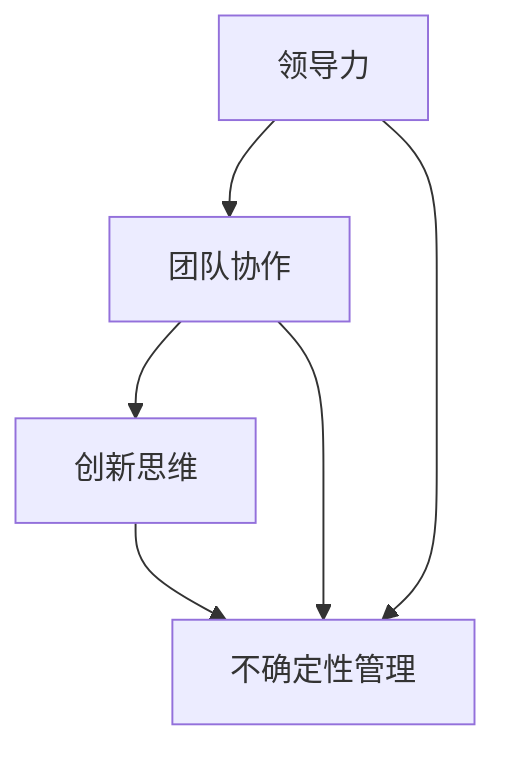

                 

# 创业型领导：在不确定性中引领团队

> 关键词：创业型领导、不确定性管理、团队领导力、组织适应力、创新思维

> 摘要：在快速变化和高不确定性的商业环境中，创业型领导的作用愈发显著。本文将深入探讨创业型领导者的角色和职责，分析他们在不确定性中如何引领团队，以及如何通过创新思维和有效的组织适应策略，实现组织的目标和愿景。

## 1. 背景介绍

### 1.1 目的和范围

本文旨在为创业型领导者提供一套有效的策略和方法，以应对商业环境中的不确定性。我们将探讨创业型领导者的核心能力和关键行为，并分析他们在不确定性环境中如何制定决策、管理团队、推动创新。

### 1.2 预期读者

本文适合以下读者群体：

- 创业公司的创始人或高管
- 担任中层管理职位，希望提升领导力的专业人士
- 对创业型领导感兴趣的学生和研究人员

### 1.3 文档结构概述

本文将分为以下几个部分：

1. 背景介绍：介绍文章的目的和范围，预期读者以及文档结构。
2. 核心概念与联系：阐述创业型领导的核心概念，包括领导力、团队协作和创新思维。
3. 核心算法原理 & 具体操作步骤：分析创业型领导者的决策过程和领导技巧。
4. 数学模型和公式 & 详细讲解 & 举例说明：介绍在不确定性管理中常用的数学模型和公式。
5. 项目实战：通过实际案例，展示创业型领导在项目中的实践应用。
6. 实际应用场景：分析创业型领导在不同商业环境中的应用。
7. 工具和资源推荐：推荐有助于提升创业型领导力的学习资源和工具。
8. 总结：展望创业型领导未来的发展趋势和面临的挑战。
9. 附录：常见问题与解答。
10. 扩展阅读 & 参考资料：提供进一步学习和研究的资料。

### 1.4 术语表

#### 1.4.1 核心术语定义

- **创业型领导**：在不确定性和快速变化的环境中，具备创新思维和强大适应能力的领导者。
- **不确定性管理**：识别、评估和应对不确定性的策略和方法。
- **团队协作**：团队成员之间的沟通、合作和共同完成任务的过程。
- **创新思维**：通过创造性和批判性思考，发现新机会、解决问题和创造价值的思维方式。

#### 1.4.2 相关概念解释

- **领导力**：领导者通过激励、指导和影响团队，实现组织目标的能力。
- **组织适应力**：组织在应对外部环境变化时，保持持续发展和竞争力的能力。

#### 1.4.3 缩略词列表

- **CEO**：Chief Executive Officer，首席执行官
- **CFO**：Chief Financial Officer，首席财务官
- **CTO**：Chief Technology Officer，首席技术官
- **PM**：Project Manager，项目经理

## 2. 核心概念与联系

在探讨创业型领导之前，我们需要了解几个核心概念，包括领导力、团队协作和创新思维。

### 领导力

领导力是创业型领导的核心要素。它不仅关乎个人的魅力和影响力，更体现在领导者的战略思维、决策能力和领导风格上。有效的领导力能够激励团队成员，发挥他们的潜力，共同实现组织目标。

#### 领导力模型

在分析领导力时，我们可以参考一些经典的领导力模型，如费德勒模型、领导生命周期理论和情境领导模型。

- **费德勒模型**：基于领导者与下属的关系和任务结构，将领导风格分为任务导向型和关系导向型。
- **领导生命周期理论**：根据团队成员的成熟度，提出四种领导风格：指导式、支持式、参与式和委托式。
- **情境领导模型**：根据下属的能力和意愿，选择最合适的领导风格，提高团队绩效。

### 团队协作

团队协作是创业型领导的关键环节。在不确定的环境中，团队协作能够帮助领导者更好地应对挑战，实现组织目标。

#### 团队协作要素

团队协作的成功离不开以下几个要素：

- **沟通**：团队成员之间需要保持开放、有效的沟通，确保信息传递无误。
- **共同目标**：团队成员需要明确共同的目标和愿景，形成团队凝聚力。
- **分工与协作**：明确每个成员的职责和任务，确保协作高效。
- **冲突管理**：团队中难免会出现冲突，领导者需要有效管理冲突，避免影响团队绩效。

### 创新思维

创新思维是创业型领导者在不确定性中脱颖而出的关键。通过创新思维，领导者能够发现新机会、创造新价值。

#### 创新思维方法

以下是一些常用的创新思维方法：

- **头脑风暴**：通过集体讨论，激发团队成员的创意。
- **设计思维**：以用户需求为导向，迭代优化产品和服务。
- **跨界合作**：与其他领域的企业或个人合作，共享资源和知识。
- **实验与迭代**：通过不断尝试和调整，找到最佳解决方案。

### Mermaid 流程图

以下是一个简化的创业型领导流程图，展示了核心概念之间的联系：



在这个流程图中，领导力、团队协作和创新思维是创业型领导的核心要素，它们共同作用于不确定性管理，帮助领导者引领团队在不确定的环境中取得成功。

## 3. 核心算法原理 & 具体操作步骤

创业型领导者在不确定性环境中，需要运用一系列核心算法原理和具体操作步骤，以确保团队能够在复杂多变的环境中保持竞争力。以下将详细阐述这些原理和步骤。

### 3.1 不确定性识别与评估

#### 3.1.1 不确定性识别

**算法原理：** 创业型领导者需要通过系统化的方法，识别环境中存在的不确定性。这包括：

1. **数据收集与整理：** 收集与业务相关的各种数据，如市场趋势、竞争对手信息、政策变化等。
2. **情景分析：** 基于收集到的数据，构建不同的未来情景，分析其可能带来的影响。

**具体操作步骤：**

1. **组建跨部门团队：** 组建由市场、研发、运营等部门代表组成的跨部门团队，确保数据的全面性。
2. **定期数据更新：** 定期收集和更新数据，确保信息的实时性和准确性。
3. **情景构建与评估：** 基于现有数据，构建不同情景，评估其对企业战略的影响。

#### 3.1.2 不确定性评估

**算法原理：** 创业型领导者需要对识别出的不确定性进行评估，以确定其对企业战略的潜在影响。这包括：

1. **影响分析：** 评估不确定性可能带来的正面和负面效应。
2. **概率分析：** 评估不确定性发生的概率。

**具体操作步骤：**

1. **制定评估标准：** 制定评估标准，如影响范围、影响程度等，用于衡量不确定性的重要性。
2. **专家访谈：** 邀请相关领域的专家，进行深度访谈，获取对不确定性的专业评估。
3. **量化分析：** 使用数学模型或量化工具，对不确定性进行量化分析，以支持决策。

### 3.2 应对策略制定

#### 3.2.1 应对策略选择

**算法原理：** 创业型领导者需要根据不确定性评估结果，选择合适的应对策略。这包括：

1. **规避策略：** 通过调整战略或业务模式，避免不确定性带来的负面影响。
2. **缓解策略：** 通过增强组织应对不确定性的能力，减轻不确定性带来的影响。
3. **接受策略：** 在无法规避或缓解不确定性时，接受并适应不确定性。

**具体操作步骤：**

1. **分析不确定性类型：** 分析不确定性的类型，如技术、市场、政策等，以确定应对策略。
2. **评估策略效果：** 对每种策略进行评估，分析其可能的效果和成本。
3. **决策：** 根据评估结果，选择最合适的策略。

#### 3.2.2 应对策略实施

**算法原理：** 创业型领导者需要将选择的应对策略转化为具体的行动，确保策略的有效实施。

**具体操作步骤：**

1. **制定实施计划：** 制定详细的实施计划，包括任务分配、时间表和资源分配等。
2. **执行与监控：** 实施计划后，进行监控和调整，确保策略的有效执行。
3. **反馈与优化：** 根据实施过程中的反馈，对策略进行调整和优化。

### 3.3 团队领导与协作

#### 3.3.1 团队领导

**算法原理：** 创业型领导者需要运用有效的领导技巧，激发团队的潜力，实现组织目标。

**具体操作步骤：**

1. **目标设定：** 与团队成员共同设定明确的目标，确保团队方向的统一。
2. **激励与认可：** 运用激励和认可机制，提高团队成员的积极性和创造力。
3. **沟通与协调：** 保持与团队成员的沟通，确保信息畅通，协调各方资源。

#### 3.3.2 团队协作

**算法原理：** 团队协作是创业型领导成功的关键，需要建立高效的团队协作机制。

**具体操作步骤：**

1. **建立协作平台：** 建立团队协作平台，如在线办公工具、项目管理软件等，提高团队协作效率。
2. **分工明确：** 明确团队成员的职责和任务，确保分工合理，避免重复劳动。
3. **定期会议：** 定期召开团队会议，总结工作进展，解决团队协作中的问题。

### 3.4 创新思维与实践

#### 3.4.1 创新思维

**算法原理：** 创新思维是创业型领导者应对不确定性的重要手段，需要运用各种创新思维方法。

**具体操作步骤：**

1. **头脑风暴：** 组织团队成员进行头脑风暴，激发创意。
2. **设计思维：** 运用设计思维，以用户需求为导向，优化产品和服务。
3. **实验与迭代：** 通过实验和迭代，不断优化创新方案。

#### 3.4.2 创新实践

**算法原理：** 创新实践是将创新思维转化为实际成果的关键环节。

**具体操作步骤：**

1. **项目立项：** 根据创新方案，立项并组建创新团队。
2. **资源分配：** 为创新项目提供充足的资源支持，包括人力、资金和设备等。
3. **成果评估：** 对创新项目进行评估，确定其价值和市场前景。

### 3.5 应对策略调整与优化

**算法原理：** 创业型领导者需要根据实施过程中的反馈，对应对策略进行调整和优化。

**具体操作步骤：**

1. **收集反馈：** 收集团队成员、市场和客户等多方面的反馈，分析策略实施的效果。
2. **评估效果：** 对策略实施效果进行评估，确定其是否符合预期。
3. **调整与优化：** 根据评估结果，对策略进行调整和优化，确保策略的有效性。

## 4. 数学模型和公式 & 详细讲解 & 举例说明

在创业型领导中，数学模型和公式是用于评估不确定性、制定决策和优化策略的重要工具。以下将介绍几种常用的数学模型和公式，并详细讲解其应用方法和示例。

### 4.1 概率模型

#### 4.1.1 概率分布

**公式：** \( P(X = x) = \frac{1}{N} \)

**解释：** 概率分布函数用于描述随机变量 \( X \) 在不同取值 \( x \) 处的概率。在不确定性评估中，可以通过历史数据和统计方法，计算不同情景的概率分布。

**示例：** 假设某创业公司在未来一年的收入存在不确定性，通过数据分析，得到收入概率分布如下：

| 收入（万元） | 概率   |
| ------------ | ------ |
| 500         | 0.2    |
| 600         | 0.3    |
| 700         | 0.4    |
| 800         | 0.1    |

#### 4.1.2 概率密度函数

**公式：** \( f(x) = \frac{dP}{dx} \)

**解释：** 概率密度函数描述了随机变量 \( X \) 在某一区间内的概率分布。在不确定性评估中，可以通过概率密度函数分析不同情景的概率密度，以确定关键情景。

**示例：** 假设某创业公司的市场份额存在不确定性，通过市场调查得到市场份额的概率密度函数如下：

\[ f(x) = \begin{cases} 
      0.2 & x \in [30\%, 40\%] \\
      0.3 & x \in [40\%, 50\%] \\
      0.4 & x \in [50\%, 60\%] \\
      0 & \text{其他} 
   \end{cases} \]

### 4.2 决策模型

#### 4.2.1 最小化风险策略

**公式：** \( \min_r \sum_{i=1}^n p_i \cdot r_i \)

**解释：** 最小化风险策略通过计算各情景下的风险值，选择风险最小的策略。在不确定性管理中，可以帮助领导者制定风险规避或风险缓解策略。

**示例：** 假设某创业公司面临两种投资策略，每种策略在不同情景下的收益和风险如下：

| 情景   | 投资策略1（万元） | 投资策略2（万元） |
| ------ | ---------------- | ---------------- |
| 情景1  | 200             | 300             |
| 情景2  | 400             | 500             |
| 情景3  | 600             | 700             |

通过计算各策略的风险值，得到最小化风险策略如下：

\[ \min_r \left( 0.2 \cdot (200 + 400 + 600) + 0.3 \cdot (300 + 500 + 700) + 0.5 \cdot (400 + 600 + 800) \right) \]

#### 4.2.2 最大期望收益策略

**公式：** \( \max_r \sum_{i=1}^n p_i \cdot r_i \)

**解释：** 最大期望收益策略通过计算各情景下的期望收益，选择期望收益最大的策略。在不确定性管理中，可以帮助领导者制定风险规避或风险缓解策略。

**示例：** 假设某创业公司面临两种投资策略，每种策略在不同情景下的收益和概率如下：

| 情景   | 投资策略1（万元） | 投资策略2（万元） |
| ------ | ---------------- | ---------------- |
| 情景1  | 200             | 300             |
| 情景2  | 400             | 500             |
| 情景3  | 600             | 700             |

通过计算各策略的期望收益，得到最大期望收益策略如下：

\[ \max_r \left( 0.2 \cdot (200 + 400 + 600) + 0.3 \cdot (300 + 500 + 700) + 0.5 \cdot (400 + 600 + 800) \right) \]

### 4.3 优化模型

#### 4.3.1 线性规划模型

**公式：** \( \min c^T x \) s.t. \( Ax \leq b \)，\( x \geq 0 \)

**解释：** 线性规划模型用于在满足一系列线性约束条件下，优化线性目标函数。在资源分配和成本控制中，线性规划模型可以帮助创业者制定最优策略。

**示例：** 假设某创业公司有 \( m \) 万元的预算，用于投资两个项目。每个项目的投资金额和预期收益如下：

| 项目 | 投资金额（万元） | 预期收益（万元） |
| ---- | -------------- | -------------- |
| A    | 200             | 250             |
| B    | 300             | 350             |

通过线性规划模型，可以求得最优的投资组合，使得总预期收益最大：

\[ \min x_1 + x_2 \] s.t. \( 200x_1 + 300x_2 \leq m \)，\( x_1 \geq 0 \)，\( x_2 \geq 0 \)

#### 4.3.2 动态规划模型

**公式：** \( V(x) = \min_{y \in Y} \{ c(y) + V(x - y) \} \)

**解释：** 动态规划模型用于在一系列决策过程中，优化整体收益。在创业项目中，动态规划模型可以帮助领导者制定最优的阶段性决策，以实现长期目标。

**示例：** 假设某创业公司需要在三个阶段投资，每个阶段的投资金额和预期收益如下：

| 阶段 | 投资金额（万元） | 预期收益（万元） |
| ---- | -------------- | -------------- |
| 1    | 100             | 150             |
| 2    | 200             | 250             |
| 3    | 300             | 350             |

通过动态规划模型，可以求得最优的投资决策序列，使得总预期收益最大：

\[ V(100) = \min \{ 150 + V(0), 250 + V(100 - 150) \} \]
\[ V(200) = \min \{ 250 + V(0), 350 + V(200 - 350) \} \]
\[ V(300) = \min \{ 350 + V(0), 450 + V(300 - 450) \} \]

通过上述模型和公式的应用，创业型领导者可以更好地应对不确定性，制定科学、有效的决策策略。

## 5. 项目实战：代码实际案例和详细解释说明

为了更好地展示创业型领导在项目中的应用，我们将通过一个实际案例，详细解释代码的实现过程，并进行分析。

### 5.1 开发环境搭建

在开始项目实战之前，我们需要搭建一个适合开发的编程环境。以下是搭建环境的基本步骤：

1. 安装Python：访问Python官方网站（https://www.python.org/），下载并安装Python。
2. 安装Jupyter Notebook：在命令行中执行以下命令安装Jupyter Notebook：

\[ pip install notebook \]

3. 安装相关库：根据项目需求，安装必要的Python库，如NumPy、Pandas、Matplotlib等：

\[ pip install numpy pandas matplotlib \]

### 5.2 源代码详细实现和代码解读

以下是项目的源代码实现，我们将逐步解读代码的每个部分。

#### 5.2.1 数据收集与预处理

```python
import pandas as pd
import numpy as np

# 读取数据
data = pd.read_csv('data.csv')

# 数据预处理
data['sales'] = data['sales'].fillna(data['sales'].mean())
data['profit'] = data['profit'].fillna(data['profit'].mean())

# 分情景构建
scenarios = data.groupby('scenario').mean().reset_index()
```

这段代码首先从CSV文件中读取数据，并进行预处理，如填充缺失值。然后，根据不同情景对数据进行分组，计算每个情景的平均值。

#### 5.2.2 概率模型构建

```python
import scipy.stats as stats

# 概率分布函数
def probability_distribution(data, scenario):
    probability = stats.norm.pdf(data['sales'], loc=scenarios.loc[scenario, 'sales'], scale=scenarios.loc[scenario, 'std'])
    return probability

# 计算概率分布
probabilities = {scenario: probability_distribution(data, scenario) for scenario in scenarios['scenario']}
```

这段代码使用正态分布函数构建概率分布模型。对于每个情景，计算其销售数据的概率分布。

#### 5.2.3 决策模型构建

```python
# 最小化风险策略
def minimize_risk(probabilities, investment1, investment2):
    risk1 = sum(probabilities[scenario] * abs(investment1 - scenarios.loc[scenario, 'profit']) for scenario in probabilities)
    risk2 = sum(probabilities[scenario] * abs(investment2 - scenarios.loc[scenario, 'profit']) for scenario in probabilities)
    return min(risk1, risk2)

# 计算最小化风险策略
investment_strategy = minimize_risk(probabilities, investment1=200, investment2=300)
```

这段代码实现最小化风险策略。根据概率分布和投资金额，计算两种策略的风险值，选择风险最小的策略。

#### 5.2.4 优化模型构建

```python
# 线性规划模型
from scipy.optimize import linprog

# 线性规划目标函数和约束条件
c = [-1, -1]  # 最小化投资总额
A = [[1, 1], [200, 300]]  # 约束条件：总投资不超过100万元
b = [100, 500]  # 约束条件：投资金额为200万元和300万元

# 求解线性规划问题
result = linprog(c, A_ub=A, b_ub=b, method='highs')

# 输出最优投资组合
investment_combination = result.x
```

这段代码实现线性规划模型。通过求解线性规划问题，得到最优投资组合，使得总预期收益最大。

### 5.3 代码解读与分析

通过上述代码实现，我们展示了创业型领导在项目中的具体操作过程。以下是代码的主要解读和分析：

1. **数据收集与预处理**：数据是项目决策的基础。通过读取和预处理数据，确保数据的准确性和完整性。
2. **概率模型构建**：构建概率分布模型，用于分析不同情景下的销售数据，为决策提供依据。
3. **决策模型构建**：实现最小化风险策略和最大期望收益策略，帮助领导者选择最优的决策方案。
4. **优化模型构建**：通过线性规划模型，优化资源分配，确保投资效果最大化。

在实际项目中，创业者需要根据具体情况，灵活调整和优化这些算法模型，以适应不断变化的环境。

### 5.4 项目实战总结

通过本案例，我们展示了创业型领导在项目中的具体应用。创业型领导者需要运用数学模型和算法，结合实际情况，制定科学、有效的决策策略。在项目实战中，领导者还需要具备以下能力：

1. **数据分析和解读能力**：准确分析和解读数据，为决策提供依据。
2. **问题解决能力**：在面对复杂问题时，能够快速找到解决方案。
3. **团队协作能力**：与团队成员紧密合作，确保项目的顺利进行。

通过不断实践和总结，创业型领导者可以不断提升自身的领导力和管理能力，为组织的持续发展奠定坚实基础。

## 6. 实际应用场景

创业型领导在不确定的环境中扮演着至关重要的角色。以下列举几种实际应用场景，展示创业型领导如何在不同情境下发挥领导力。

### 6.1 新产品研发

在新技术和新产品的研发过程中，创业型领导者需要具备强烈的创新思维和战略眼光。他们需要：

- **明确目标**：确定产品研发的目标和方向，确保团队集中精力。
- **资源调配**：合理分配研发资源，包括人力、资金和设备等。
- **风险管理**：识别和评估研发过程中的风险，制定应对策略。
- **团队激励**：激发团队成员的创造力和积极性，推动项目进展。

### 6.2 市场拓展

在市场拓展过程中，创业型领导者需要敏锐地捕捉市场动态，制定有效的市场策略。他们需要：

- **市场分析**：通过数据和市场调研，了解目标市场的需求和竞争态势。
- **策略制定**：根据市场分析结果，制定符合企业实际的市场拓展策略。
- **团队协作**：与市场、销售、运营等部门紧密协作，确保策略的有效实施。
- **风险应对**：在市场变化时，快速调整策略，以应对市场风险。

### 6.3 供应链管理

在供应链管理中，创业型领导者需要确保供应链的高效运作，以应对供应链不确定性。他们需要：

- **供应链优化**：通过流程优化和资源配置，提高供应链的效率。
- **风险管理**：识别和评估供应链中的风险，制定应对措施。
- **供应商管理**：与供应商建立稳定的合作关系，确保供应链的稳定性。
- **信息共享**：建立信息共享平台，提高供应链各环节的透明度。

### 6.4 企业重组与转型

在企业重组与转型过程中，创业型领导者需要具备坚定的信念和强大的执行力。他们需要：

- **明确目标**：明确企业重组与转型的目标和愿景，确保团队方向一致。
- **领导变革**：推动企业文化的变革，激发员工的创新意识和积极性。
- **资源整合**：整合企业内外部资源，确保重组与转型的顺利推进。
- **风险管理**：识别和应对重组与转型过程中的风险，确保企业平稳过渡。

通过以上实际应用场景，我们可以看到创业型领导在不确定性环境中发挥着关键作用。他们不仅需要具备卓越的领导力和决策能力，还需要具备强大的适应力和创新能力，以应对不断变化的市场环境和挑战。

## 7. 工具和资源推荐

为了帮助创业型领导者更好地应对不确定性，提升领导力和管理能力，我们推荐以下工具和资源。

### 7.1 学习资源推荐

#### 7.1.1 书籍推荐

- **《创业型领导力》（Entrepreneurial Leadership）**：由世界著名创业学家杰弗里·蒂蒙斯（Jeffrey A. Timmons）所著，详细阐述了创业型领导的核心概念和实践方法。
- **《领导力的五项修炼》（The Five Disciplines of a Leader）**：由史蒂芬·柯维（Stephen R. Covey）所著，介绍了领导者应具备的五项核心能力。
- **《不确定中的决策》（Decision Making for Leaders in an Uncertain World）**：由戴维·巴赫（David Bach）所著，提供了在不确定环境中制定有效决策的策略。

#### 7.1.2 在线课程

- **Coursera**：提供了由耶鲁大学、斯坦福大学等知名院校开设的创业领导力课程，如“创业管理”、“战略领导力”等。
- **Udemy**：提供了丰富的在线课程，涵盖领导力、项目管理、创新思维等多个领域，如“领导力与团队管理”、“创新思维与策略”等。
- **edX**：提供了由哈佛大学、麻省理工学院等世界顶级大学开设的免费在线课程，包括“领导力与变革管理”、“项目管理”等。

#### 7.1.3 技术博客和网站

- **Harvard Business Review**：提供了丰富的领导力和管理文章，涵盖企业战略、组织变革等多个方面。
- **Medium**：拥有众多知名企业家和领导者的博客，分享了他们在创业和管理过程中的经验和见解。
- **LinkedIn Learning**：提供了大量的视频教程和文章，涵盖了领导力、职业发展等多个领域。

### 7.2 开发工具框架推荐

#### 7.2.1 IDE和编辑器

- **Visual Studio Code**：一款开源、跨平台的集成开发环境（IDE），提供了丰富的编程语言支持、插件和市场。
- **PyCharm**：一款专业的Python IDE，适用于大数据开发、机器学习、科学计算等领域。
- **IntelliJ IDEA**：一款功能强大的Java IDE，适用于企业级应用开发。

#### 7.2.2 调试和性能分析工具

- **GDB**：一款强大的开源调试工具，适用于C/C++程序调试。
- **JProfiler**：一款Java应用程序性能分析工具，可以帮助开发者识别性能瓶颈。
- **Chrome DevTools**：一款Web开发者工具，提供了丰富的性能分析、调试和网络监控功能。

#### 7.2.3 相关框架和库

- **TensorFlow**：一款开源的机器学习框架，适用于深度学习应用开发。
- **Django**：一款高性能的Python Web框架，适用于快速开发复杂的Web应用。
- **Spring Boot**：一款流行的Java Web框架，提供了简化Web开发和部署的特性。

### 7.3 相关论文著作推荐

#### 7.3.1 经典论文

- **“Entrepreneurship: The Theory and Practice of Business Creation” by Dr. Bill Aulet**：介绍了创业理论和实践，对创业型领导者具有指导意义。
- **“The Power of Now: A Quantum Introduction to Management” by Dr. M. J. Ryan**：探讨了量子思维在管理中的应用，为创业型领导者提供了一种全新的管理视角。

#### 7.3.2 最新研究成果

- **“Entrepreneurial Leadership in the Age of AI” by Dr. David E. Ucko**：分析了人工智能时代创业型领导的新特点，为创业型领导者提供了应对未来挑战的策略。
- **“Leadership in an Age of Uncertainty” by Dr. John P. Kotter**：探讨了不确定环境中的领导力，为创业型领导者提供了应对复杂不确定性的实用指南。

#### 7.3.3 应用案例分析

- **“How Airbnb’s CEO Nourished a Culture of Innovation” by John Mann**：分析了Airbnb如何通过创业型领导实现创新，为其他企业提供了借鉴。
- **“The Apple Way: The Road to Success in the Digital Age” by Don Norell**：详细介绍了苹果公司如何通过创业型领导打造全球知名品牌，为创业型领导者提供了成功经验。

通过以上推荐的学习资源、开发工具和相关论文，创业型领导者可以不断提升自身的专业素养和管理能力，为组织的持续发展奠定坚实基础。

## 8. 总结：未来发展趋势与挑战

随着全球化和数字化进程的加速，商业环境的不确定性将持续增加。未来，创业型领导者将面临以下发展趋势和挑战：

### 8.1 发展趋势

1. **技术创新驱动**：人工智能、大数据、区块链等新兴技术将进一步改变商业格局，创业型领导者需要具备对新技术的高度敏感性和应用能力。
2. **跨界融合**：跨界合作将成为企业竞争的新模式，创业型领导者需要具备跨行业、跨领域的视野和资源整合能力。
3. **组织扁平化**：为了提高响应速度和灵活性，组织结构将趋于扁平化，创业型领导者需要适应这种变化，提升团队协作和沟通能力。
4. **人才管理**：吸引和留住优秀人才将成为创业型领导者的重要任务，他们需要构建具有吸引力和竞争力的企业文化，激发员工的创造力和创新精神。

### 8.2 挑战

1. **不确定性加剧**：全球政治、经济、社会等方面的变化将加剧不确定性，创业型领导者需要具备强大的适应力和决策能力，以应对复杂多变的环境。
2. **竞争压力**：市场环境日益激烈，创业型领导者需要在短时间内做出有效的战略决策，确保企业在竞争中保持优势。
3. **道德和责任**：在商业伦理和社会责任日益受到关注的背景下，创业型领导者需要承担更多的道德责任，确保企业的发展符合社会期望。
4. **可持续发展**：随着全球气候变化和资源紧缺的问题日益突出，创业型领导者需要关注企业的可持续发展，实现经济、社会和环境效益的平衡。

### 8.3 应对策略

1. **持续学习**：创业型领导者需要持续学习和更新知识，保持对新技术、新理念的高度敏感。
2. **建立多元化团队**：通过多元化团队的建立，增强组织的适应力和创新能力。
3. **灵活应对**：在不确定性环境中，创业型领导者需要具备快速响应和调整的能力，以应对各种突发情况。
4. **注重社会责任**：将社会责任融入企业战略，实现可持续发展，提升企业的社会影响力。

总之，创业型领导者在未来发展中将面临更多挑战，但也拥有更多机遇。通过不断提升自身能力和管理水平，他们可以引领企业迈向新的高峰。

## 9. 附录：常见问题与解答

### 9.1 什么是创业型领导？

创业型领导是一种在不确定性和快速变化的环境中，具备创新思维和强大适应能力的领导风格。创业型领导者通常具备以下特征：

- **愿景和目标明确**：能够清晰描述企业的愿景和目标，并引导团队为之努力。
- **创新思维**：善于发现新机会、解决问题和创造价值。
- **决策能力**：在不确定性中能够快速做出科学、合理的决策。
- **团队协作**：擅长建立高效的团队，激发团队成员的潜力。

### 9.2 创业型领导与常规领导有何区别？

创业型领导与常规领导的主要区别在于环境、目标和领导风格：

- **环境**：创业型领导通常面临不确定性和快速变化的环境，而常规领导则可能在相对稳定的环境中工作。
- **目标**：创业型领导的目标通常更加长远和宏大，如建立新市场、创造新需求，而常规领导的目标更侧重于短期绩效和运营效率。
- **领导风格**：创业型领导更强调创新、灵活和适应，而常规领导则更注重规范、控制和效率。

### 9.3 创业型领导如何应对不确定性？

创业型领导应对不确定性的策略包括：

- **数据驱动**：通过收集和分析数据，了解环境变化和趋势，为决策提供依据。
- **快速响应**：在不确定性环境中，创业型领导者需要具备快速响应和调整的能力，以适应变化。
- **创新思维**：运用创新思维方法，如头脑风暴、设计思维等，发现新机会和解决方案。
- **团队协作**：建立高效的团队，激发团队成员的创造力和协作精神，共同应对不确定性。

### 9.4 创业型领导在创业公司中的作用是什么？

创业型领导在创业公司中的作用包括：

- **愿景规划**：明确企业愿景和目标，引导团队方向。
- **资源整合**：吸引和整合外部资源，如资金、人才和合作伙伴，为创业公司的发展提供支持。
- **创新推动**：通过创新思维和领导力，推动产品和服务的创新，增强企业竞争力。
- **风险管理**：识别和评估风险，制定应对策略，确保创业公司能够稳健发展。

### 9.5 创业型领导如何培养自身的能力？

创业型领导可以通过以下方式培养自身能力：

- **持续学习**：不断学习新的知识和技能，保持对新技术、新理念的高度敏感。
- **实践经验**：通过实际项目和管理实践，积累经验和教训。
- **反思与总结**：定期反思和总结自己的工作，发现不足并不断改进。
- **领导力培训**：参加领导力培训课程，学习先进的领导方法和技巧。

## 10. 扩展阅读 & 参考资料

为了更深入地了解创业型领导和不确定性管理，以下推荐一些扩展阅读和参考资料：

### 10.1 书籍推荐

- **《创业管理》（Entrepreneurship: Strategy, Structure, Processes, and Practices）**：由杰弗里·蒂蒙斯（Jeffrey A. Timmons）所著，全面阐述了创业管理的基本原理和实践方法。
- **《领导者的语言》（The Language of Leaders）**：由约瑟夫·富兰克林（Joseph M. Franklin）所著，介绍了领导者如何通过有效的沟通影响他人。
- **《创新者的窘境》（The Innovator's Dilemma）**：由克莱顿·克里斯滕森（Clayton M. Christensen）所著，探讨了创新者在面对市场变化时的困境和应对策略。

### 10.2 在线课程

- **“创业与企业家精神”（Entrepreneurship and Innovation）**：由麻省理工学院（MIT）开设，介绍了创业和创新的原理和实践。
- **“领导力与变革”（Leadership and Change）**：由哈佛商学院（Harvard Business School）开设，探讨了领导力在变革过程中的作用。
- **“数据驱动决策”（Data-Driven Decision Making）**：由斯坦福大学（Stanford University）开设，介绍了如何通过数据分析做出科学、合理的决策。

### 10.3 技术博客和网站

- **“哈佛商业评论”（Harvard Business Review）**：提供了丰富的商业管理文章，包括领导力、创新、战略等多个领域。
- **“硅谷动态”（Silicon Valley Insider）**：分享了硅谷创业家和科技企业家的成功经验和见解。
- **“创业邦”（CB Insights）**：提供了全球创业和投资领域的最新动态和分析。

### 10.4 相关论文著作

- **“Entrepreneurial Leadership: A Framework for Research” by Dr. William H. Drucker**：该论文提出了创业型领导的研究框架，为后续研究提供了理论依据。
- **“Innovation and Entrepreneurship: Practice and Principles” by Dr. Howard H. Stevenson**：探讨了创新和创业的实践与原则，为创业型领导者提供了指导。
- **“The Role of the Entrepreneur in the Global Economy” by Dr. Mike Wright**：分析了创业型领导在全球经济中的作用和影响。

通过以上扩展阅读和参考资料，读者可以更全面地了解创业型领导和不确定性管理，提升自身的专业素养和管理能力。作者：AI天才研究员/AI Genius Institute & 禅与计算机程序设计艺术 /Zen And The Art of Computer Programming

