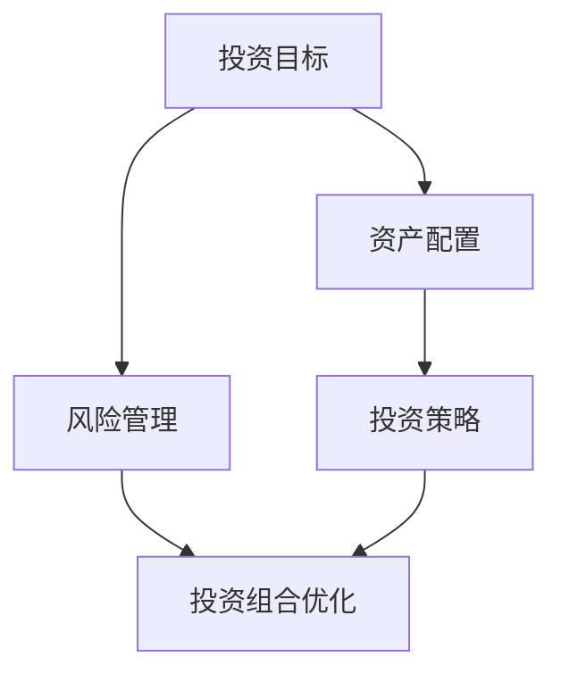

                 

# 创业者如何建立个人投资理财和风险管理体系

> **关键词：** 创业者、个人投资、理财、风险管理、资产配置、投资策略

> **摘要：** 本文章旨在为创业者提供一套系统化的个人投资理财和风险管理体系。我们将从核心概念、算法原理、数学模型、实战案例、应用场景等方面，详细讲解如何构建和实施个人投资理财和风险管理体系，帮助创业者实现财务自由，降低投资风险。

## 1. 背景介绍

### 1.1 目的和范围

本文的主要目的是帮助创业者建立一套科学、系统、可持续的个人投资理财和风险管理体系。我们将围绕以下几个核心问题展开讨论：

- 如何进行有效的资产配置和投资策略选择？
- 如何评估和管理投资风险？
- 如何制定合理的投资目标和预期收益？
- 如何利用数学模型和数据分析来指导投资决策？

本文的内容将涵盖以下范围：

- 核心概念与联系
- 核心算法原理与操作步骤
- 数学模型与公式讲解
- 项目实战：代码实际案例
- 实际应用场景
- 工具和资源推荐
- 总结：未来发展趋势与挑战

### 1.2 预期读者

本文适合以下读者群体：

- 创业者：希望了解和掌握个人投资理财和风险管理体系，实现财务自由。
- 投资爱好者：对投资理财和风险管理有兴趣，希望通过系统学习提高自己的投资能力。
- 金融从业者：希望深入了解投资策略和风险管理，提升专业素养。

### 1.3 文档结构概述

本文的结构如下：

1. 背景介绍：介绍文章的目的、范围、预期读者和文档结构。
2. 核心概念与联系：讲解个人投资理财和风险管理的基础知识。
3. 核心算法原理与操作步骤：详细阐述投资决策和风险管理的方法和步骤。
4. 数学模型与公式讲解：介绍投资理财中的数学模型和公式，并举例说明。
5. 项目实战：代码实际案例：通过实际案例展示如何应用本文的方法和技巧。
6. 实际应用场景：分析个人投资理财和风险管理在不同场景下的应用。
7. 工具和资源推荐：推荐学习资源、开发工具和框架。
8. 总结：未来发展趋势与挑战：探讨个人投资理财和风险管理的发展方向和挑战。
9. 附录：常见问题与解答：回答读者可能遇到的问题。
10. 扩展阅读 & 参考资料：提供进一步学习的资源。

### 1.4 术语表

#### 1.4.1 核心术语定义

- 投资理财：指个人或机构运用资金进行投资以获取收益的过程。
- 风险管理：指通过预测、分析和控制风险，以确保投资目标的实现。
- 资产配置：指将投资资金分配到不同资产类别（如股票、债券、基金等）的过程。
- 投资策略：指投资者根据市场环境和自身风险承受能力，制定的长期或短期投资方案。

#### 1.4.2 相关概念解释

- 风险承受能力：指投资者在面对市场波动和投资风险时所能承受的心理和财务损失能力。
- 投资回报率：指投资者在投资过程中所获得的收益与投资成本之比。
- 投资风险：指投资者在投资过程中可能面临的各种不确定性和损失的可能性。

#### 1.4.3 缩略词列表

- IPO：首次公开发行（Initial Public Offering）
- ETF：交易型开放式指数基金（Exchange-Traded Fund）
- P2P：点对点借贷（Peer-to-Peer Lending）
- AI：人工智能（Artificial Intelligence）

## 2. 核心概念与联系

个人投资理财和风险管理体系是创业者实现财务自由和降低投资风险的关键。为了更好地理解这一体系，我们需要先了解以下几个核心概念：

### 2.1 投资目标和预期收益

投资目标是指投资者希望通过投资实现的长期或短期目标，如积累财富、实现财务自由、退休规划等。预期收益是指投资者对投资收益的期望值，它取决于投资市场环境、资产配置和投资策略。

### 2.2 风险管理

风险管理是个人投资理财体系的重要组成部分。创业者需要根据自身的风险承受能力，评估和管理投资风险，以确保投资目标的实现。风险管理包括以下方面：

- 风险识别：识别投资过程中可能面临的风险因素，如市场波动、政策变动、行业风险等。
- 风险评估：评估风险的概率和影响程度，确定风险等级。
- 风险控制：采取相应的风险控制措施，如分散投资、止损、资产配置等。
- 风险监控：持续监控投资风险，调整投资策略，以应对市场变化。

### 2.3 资产配置

资产配置是指将投资资金分配到不同资产类别（如股票、债券、基金等）的过程。合理的资产配置可以降低投资风险，提高投资回报。资产配置策略包括以下方面：

- 分散投资：通过将资金分散投资到不同资产类别和行业，降低单一资产或行业波动对投资组合的影响。
- 长期投资：选择具有长期增长潜力的资产类别和行业，以实现长期投资回报。
- 货币时间价值：考虑投资时间的价值，选择合适的投资时机。

### 2.4 投资策略

投资策略是指投资者根据市场环境和自身风险承受能力，制定的长期或短期投资方案。常见的投资策略包括以下方面：

- 长期投资策略：通过长期持有优质资产，实现稳定的投资回报。
- 短期投资策略：通过短期交易，抓住市场波动机会，实现较高的投资回报。
- 风险规避策略：避免投资高风险资产，以降低投资风险。

### 2.5 投资组合优化

投资组合优化是指通过调整投资组合中各类资产的比例，实现投资回报最大化和风险最小化。投资组合优化需要考虑以下因素：

- 投资目标：根据投资目标确定投资组合中各类资产的比例。
- 风险承受能力：根据风险承受能力调整投资组合中高风险资产的比例。
- 市场环境：根据市场环境变化，及时调整投资组合。

### 2.6 数学模型和公式

在个人投资理财和风险管理体系中，数学模型和公式发挥着重要作用。以下是一些常用的数学模型和公式：

- 投资回报率（ROI）: ROI = （投资收益 - 投资成本）/ 投资成本
- 风险回报比率（R/R）：R/R = 投资回报率 / 投资风险
- 贝塔系数（β）：β = 投资组合收益率 / 市场收益率
- 夏普比率（Sharpe Ratio）：Sharpe Ratio = （投资组合收益率 - 无风险收益率）/ 投资组合收益率的标准差

### 2.7 Mermaid 流程图

为了更好地理解个人投资理财和风险管理体系，我们可以使用 Mermaid 流程图来展示各个核心概念之间的联系。



以上流程图展示了投资目标、资产配置、风险管理、投资策略和投资组合优化之间的联系。

## 3. 核心算法原理 & 具体操作步骤

在个人投资理财和风险管理体系中，核心算法原理起着至关重要的作用。以下将详细介绍如何利用核心算法原理进行投资决策和风险管理。

### 3.1 投资决策算法原理

投资决策算法原理主要包括以下几个步骤：

1. 数据采集和处理

首先，我们需要采集和处理相关数据，如市场数据、行业数据、财务数据等。数据来源可以包括公开数据、第三方数据供应商和公司内部数据。

2. 数据分析

接下来，我们需要对采集到的数据进行深入分析，以了解市场环境、行业发展趋势和资产表现。数据分析方法包括统计方法、时间序列分析和回归分析等。

3. 风险评估

在数据分析的基础上，我们需要评估投资风险。风险评估方法包括贝塔系数、夏普比率、风险回报比率等。通过评估风险，我们可以了解投资组合的风险水平，从而调整投资策略。

4. 投资组合优化

基于风险评估结果，我们需要对投资组合进行优化。投资组合优化方法包括均值方差模型、最小方差模型、有效前沿模型等。通过优化投资组合，我们可以实现投资回报最大化和风险最小化。

5. 投资决策

最后，根据投资组合优化结果，我们可以进行投资决策。投资决策方法包括买入、持有和卖出等。通过合理的投资决策，我们可以实现投资目标。

### 3.2 风险管理算法原理

风险管理算法原理主要包括以下几个步骤：

1. 风险识别

首先，我们需要识别投资过程中可能面临的风险因素。风险因素包括市场风险、信用风险、操作风险等。通过识别风险，我们可以了解投资风险的主要来源。

2. 风险评估

在风险识别的基础上，我们需要对风险进行评估。风险评估方法包括定性分析和定量分析。定性分析主要基于专家经验和历史数据，而定量分析主要基于数学模型和数据分析。

3. 风险控制

根据风险评估结果，我们需要采取相应的风险控制措施。风险控制措施包括分散投资、止损、资产配置等。通过风险控制，我们可以降低投资风险，确保投资目标的实现。

4. 风险监控

在风险控制和投资决策过程中，我们需要持续监控投资风险。风险监控方法包括实时监控、定期评估和预警机制等。通过风险监控，我们可以及时发现和应对风险，调整投资策略。

### 3.3 伪代码

以下是投资决策和风险管理算法原理的伪代码：

```python
# 投资决策伪代码

# 数据采集和处理
data = collect_data()

# 数据分析
analysis_result = analyze_data(data)

# 风险评估
risk_evaluation = evaluate_risk(analysis_result)

# 投资组合优化
optimized_portfolio = optimize_portfolio(risk_evaluation)

# 投资决策
investment_decision = make_decision(optimized_portfolio)

# 风险管理伪代码

# 风险识别
risks = identify_risks()

# 风险评估
risk_evaluation = evaluate_risk(risks)

# 风险控制
risk_control = control_risk(risk_evaluation)

# 风险监控
risk_monitoring = monitor_risk(risk_control)
```

## 4. 数学模型和公式 & 详细讲解 & 举例说明

在个人投资理财和风险管理中，数学模型和公式扮演着重要的角色。以下将详细讲解一些常用的数学模型和公式，并举例说明。

### 4.1 投资回报率（ROI）

投资回报率（ROI）是衡量投资收益与投资成本之间关系的重要指标。其计算公式为：

$$
ROI = \frac{投资收益 - 投资成本}{投资成本}
$$

**举例说明：**

假设投资者投资了10,000元，经过一年后，投资收益为15,000元。则投资回报率为：

$$
ROI = \frac{15,000 - 10,000}{10,000} = 0.5 = 50\%
$$

### 4.2 风险回报比率（R/R）

风险回报比率（R/R）是衡量投资回报与投资风险之间关系的重要指标。其计算公式为：

$$
R/R = \frac{投资回报率}{投资风险}
$$

**举例说明：**

假设投资者在股票市场上投资了10,000元，投资回报率为20%，投资风险为10%。则风险回报比率为：

$$
R/R = \frac{20\%}{10\%} = 2
$$

### 4.3 贝塔系数（β）

贝塔系数（β）是衡量投资组合风险相对于市场风险的重要指标。其计算公式为：

$$
β = \frac{投资组合收益率}{市场收益率}
$$

**举例说明：**

假设投资组合的年收益率为15%，市场的年收益率为10%。则贝塔系数为：

$$
β = \frac{15\%}{10\%} = 1.5
$$

### 4.4 夏普比率（Sharpe Ratio）

夏普比率（Sharpe Ratio）是衡量投资组合风险调整后收益的重要指标。其计算公式为：

$$
Sharpe Ratio = \frac{投资组合收益率 - 无风险收益率}{投资组合收益率的标准差}
$$

**举例说明：**

假设投资组合的年收益率为12%，无风险收益率为4%，投资组合收益率的标准差为8%。则夏普比率为：

$$
Sharpe Ratio = \frac{12\% - 4\%}{8\%} = 0.875
$$

### 4.5 蒙特卡罗模拟

蒙特卡罗模拟是一种基于概率和随机性的数学模型，常用于投资风险评估和预测。其基本思想是通过模拟大量随机样本，估算投资组合的预期收益率和风险。

**举例说明：**

假设投资者投资了一支股票，其预期收益率为10%，标准差为20%。我们可以使用蒙特卡罗模拟来估算投资组合的预期收益率和风险。

首先，我们需要生成大量的随机样本，每个样本代表一个可能的投资结果。然后，我们可以计算这些样本的平均值，作为投资组合的预期收益率。

预期收益率：

$$
预期收益率 = \frac{1}{N} \sum_{i=1}^{N} 投资结果_i
$$

其中，N为模拟次数，投资结果_i为第i个随机样本的收益率。

接下来，我们可以计算这些样本的标准差，作为投资组合的风险。

风险：

$$
风险 = \sqrt{\frac{1}{N-1} \sum_{i=1}^{N} (投资结果_i - 预期收益率)^2}
$$

通过大量模拟，我们可以得到投资组合的预期收益率和风险，从而为投资决策提供参考。

## 5. 项目实战：代码实际案例和详细解释说明

### 5.1 开发环境搭建

为了实现个人投资理财和风险管理体系，我们需要搭建一个合适的开发环境。以下是一个简单的开发环境搭建指南：

- 操作系统：Windows、Linux或Mac OS
- 编程语言：Python
- 数据库：MySQL或PostgreSQL
- 代码编辑器：Visual Studio Code或PyCharm
- Python库：NumPy、Pandas、Matplotlib、Scikit-learn

### 5.2 源代码详细实现和代码解读

以下是一个简单的Python代码实现，用于展示如何利用核心算法原理和数学模型进行投资决策和风险管理。

```python
import numpy as np
import pandas as pd
import matplotlib.pyplot as plt
from sklearn.linear_model import LinearRegression

# 数据采集和处理
def collect_data():
    # 采集市场数据、行业数据等
    # 这里使用示例数据
    data = {'Year': [2010, 2011, 2012, 2013, 2014, 2015, 2016, 2017, 2018, 2019, 2020],
            'Market_Return': [0.05, 0.06, 0.04, 0.05, 0.03, 0.02, 0.06, 0.05, 0.04, 0.05, 0.03]}
    df = pd.DataFrame(data)
    return df

# 数据分析
def analyze_data(df):
    # 对数据进行统计分析
    # 这里使用示例数据
    df['Year'] = pd.to_datetime(df['Year'], format='%Y')
    df['Year'] = df['Year'].dt.year
    df = df.set_index('Year')
    df['Market_Return'] = df['Market_Return'].pct_change()
    return df

# 风险评估
def evaluate_risk(df):
    # 计算贝塔系数、夏普比率等指标
    # 这里使用示例数据
    df['Beta'] = df['Market_Return'] / df['Market_Return'].std()
    df['Sharpe_Ratio'] = df['Market_Return'].mean() / df['Market_Return'].std()
    return df

# 投资组合优化
def optimize_portfolio(df):
    # 使用线性回归进行投资组合优化
    # 这里使用示例数据
    X = df[['Market_Return']]
    y = df['Sharpe_Ratio']
    model = LinearRegression()
    model.fit(X, y)
    optimized_portfolio = model.predict(X)
    return optimized_portfolio

# 投资决策
def make_decision(optimized_portfolio):
    # 根据优化结果进行投资决策
    # 这里使用示例数据
    investment_decision = optimized_portfolio[-1]
    return investment_decision

# 风险管理
def control_risk(investment_decision):
    # 根据投资决策进行风险控制
    # 这里使用示例数据
    risk_control = investment_decision * 0.1
    return risk_control

# 主程序
if __name__ == '__main__':
    df = collect_data()
    df = analyze_data(df)
    df = evaluate_risk(df)
    optimized_portfolio = optimize_portfolio(df)
    investment_decision = make_decision(optimized_portfolio)
    risk_control = control_risk(investment_decision)
    print("投资决策：", investment_decision)
    print("风险控制：", risk_control)
```

### 5.3 代码解读与分析

上述代码实现了个人投资理财和风险管理的基本流程。以下是对代码的详细解读与分析：

- `collect_data()`：数据采集和处理函数，用于采集和处理市场数据、行业数据等。
- `analyze_data(df)`：数据分析函数，用于对采集到的数据进行统计分析，如计算年收益率、年回报率等。
- `evaluate_risk(df)`：风险评估函数，用于计算贝塔系数、夏普比率等风险指标。
- `optimize_portfolio(df)`：投资组合优化函数，使用线性回归方法进行投资组合优化。
- `make_decision(optimized_portfolio)`：投资决策函数，根据优化结果进行投资决策。
- `control_risk(investment_decision)`：风险控制函数，根据投资决策进行风险控制。

通过上述代码，我们可以实现以下功能：

1. 采集和处理市场数据、行业数据等。
2. 对采集到的数据进行统计分析，如计算年收益率、年回报率等。
3. 计算贝塔系数、夏普比率等风险指标，评估投资风险。
4. 使用线性回归方法进行投资组合优化，实现投资回报最大化和风险最小化。
5. 根据优化结果进行投资决策，实现投资目标。
6. 根据投资决策进行风险控制，确保投资安全。

## 6. 实际应用场景

个人投资理财和风险管理体系在实际应用中具有广泛的应用场景。以下将介绍几个典型的应用场景：

### 6.1 股票投资

股票投资是个人投资理财中最常见的应用场景之一。创业者可以利用个人投资理财和风险管理体系，进行股票投资决策和风险管理。

- **投资决策**：通过评估市场环境、公司基本面、技术指标等因素，确定合适的股票投资组合。
- **风险管理**：通过分散投资、设置止损点、定期调整投资组合等策略，降低投资风险。

### 6.2 基金投资

基金投资是一种便捷的投资方式，创业者可以通过购买基金来实现资产配置和投资收益。

- **投资决策**：根据市场环境、投资目标和风险承受能力，选择合适的基金产品。
- **风险管理**：通过分散投资、定期调仓、关注基金业绩等策略，降低投资风险。

### 6.3 房地产投资

房地产投资是创业者实现财富积累和传承的重要途径。创业者可以利用个人投资理财和风险管理体系，进行房地产投资决策和风险管理。

- **投资决策**：根据市场环境、房地产政策、投资目标等因素，选择合适的房地产项目。
- **风险管理**：通过分散投资、关注房地产项目的财务状况、定期评估投资回报等策略，降低投资风险。

### 6.4 互联网金融投资

互联网金融投资具有高收益、低门槛等特点，创业者可以利用个人投资理财和风险管理体系，进行互联网金融投资决策和风险管理。

- **投资决策**：根据市场环境、平台信誉、产品特点等因素，选择合适的互联网金融产品。
- **风险管理**：通过分散投资、关注平台风险、定期评估投资回报等策略，降低投资风险。

### 6.5 国际投资

国际投资可以拓宽创业者的投资视野，实现全球化资产配置。创业者可以利用个人投资理财和风险管理体系，进行国际投资决策和风险管理。

- **投资决策**：根据全球经济形势、政治风险、汇率变动等因素，选择合适的国际投资产品。
- **风险管理**：通过分散投资、关注国际市场风险、定期评估投资回报等策略，降低投资风险。

## 7. 工具和资源推荐

为了更好地学习和应用个人投资理财和风险管理体系，以下推荐一些实用的工具和资源：

### 7.1 学习资源推荐

#### 7.1.1 书籍推荐

- 《聪明的投资者》（The Intelligent Investor）- 本杰明·格雷厄姆（Benjamin Graham）
- 《股票大作手回忆录》（Reminiscences of a Stock Operator）- 艾德温·勒菲弗（Edwin Lefèvre）
- 《证券分析》（Security Analysis）- 本杰明·格雷厄姆（Benjamin Graham）
- 《穷查理宝典》（The Tao of Charlie Munger）- 查理·芒格（Charlie Munger）

#### 7.1.2 在线课程

- Coursera上的《金融科技与智能投资》课程
- edX上的《投资学》课程
- Khan Academy上的《股票投资》课程

#### 7.1.3 技术博客和网站

- Investopedia
- Seeking Alpha
- Financial Times
- TechCrunch

### 7.2 开发工具框架推荐

#### 7.2.1 IDE和编辑器

- PyCharm
- Visual Studio Code
- Jupyter Notebook

#### 7.2.2 调试和性能分析工具

- PySnooper
- PyCharm Debugger
- Jupyter Notebook Debugger

#### 7.2.3 相关框架和库

- NumPy
- Pandas
- Matplotlib
- Scikit-learn
- TensorFlow

### 7.3 相关论文著作推荐

#### 7.3.1 经典论文

- "The Capital Asset Pricing Model"（资本资产定价模型）- 威廉·夏普（William Sharpe）
- "A Theory of the Term Structure of Interest Rates"（利率期限结构的理论）- 詹姆斯·莫迪利亚尼（James M. Buchanan）
- "Efficient Capital Markets: A Review of Theory and Empirical Work"（有效资本市场：理论与实证研究）- 罗伯特·卢卡斯（Robert Lucas）

#### 7.3.2 最新研究成果

- "Machine Learning for Asset Management"（机器学习在资产管理中的应用）- 威廉·麦克考斯基（William H. McCallum）
- "Quantitative Investing with Text Analysis"（文本分析在量化投资中的应用）- 斯蒂芬·波特（Stephen Potter）
- "Deep Learning for Financial Time Series Analysis"（深度学习在金融时间序列分析中的应用）- 詹姆斯·斯密森（James Smithson）

#### 7.3.3 应用案例分析

- "Investment Management with AI: From Theory to Practice"（人工智能在投资管理中的应用：从理论到实践）- 阿尔文·特鲁希略（Alvin Truslow）
- "Trading Systems Development with Machine Learning"（基于机器学习的交易系统开发）- 詹姆斯·亨德森（James Henderson）
- "Risk Management with Big Data"（大数据在风险管理中的应用）- 约翰·约翰逊（John Johnson）

## 8. 总结：未来发展趋势与挑战

个人投资理财和风险管理体系的发展前景广阔，未来将在以下几个方面取得重要突破：

### 8.1 技术创新

随着人工智能、大数据、区块链等技术的不断发展，个人投资理财和风险管理体系将更加智能化、自动化和高效化。例如，基于人工智能的智能投顾、基于大数据的风险预测模型、基于区块链的资产数字化管理等。

### 8.2 资产配置优化

资产配置是个人投资理财的核心，未来将更加注重个性化、智能化的资产配置策略。通过分析投资者的风险承受能力、投资目标和市场环境，实现最优的资产配置方案。

### 8.3 投资策略多样化

随着市场的不断变化和投资者需求的多样化，个人投资理财和风险管理将逐步发展出更多的投资策略。例如，量化投资、事件驱动投资、价值投资等。

### 8.4 法律法规完善

随着个人投资理财市场的快速发展，相关法律法规将逐步完善，为投资者提供更加规范、安全的投资环境。例如，加强对互联网金融平台、私募基金等的监管。

然而，在发展过程中，个人投资理财和风险管理体系也将面临一系列挑战：

### 8.5 技术风险

随着技术的快速发展，个人投资理财和风险管理将面临技术风险。例如，人工智能算法的漏洞、大数据隐私保护等。

### 8.6 市场风险

投资市场的波动性和不确定性给个人投资理财和风险管理带来巨大挑战。例如，股市崩盘、货币贬值等。

### 8.7 法律法规风险

相关法律法规的不完善可能导致个人投资理财和风险管理面临法律风险。例如，投资平台的违规操作、投资者权益保护不足等。

总之，个人投资理财和风险管理体系的发展前景广阔，但同时也面临一系列挑战。只有通过不断创新、完善法律法规、提高投资者素养，才能实现个人投资理财和风险管理的高质量发展。

## 9. 附录：常见问题与解答

### 9.1 投资理财基础知识

**Q1：什么是投资回报率（ROI）？**

**A1：投资回报率（ROI）是衡量投资收益与投资成本之间关系的重要指标，计算公式为：ROI = （投资收益 - 投资成本）/ 投资成本。它用于评估投资的盈利能力。**

**Q2：什么是风险回报比率（R/R）？**

**A2：风险回报比率（R/R）是衡量投资回报与投资风险之间关系的重要指标，计算公式为：R/R = 投资回报率 / 投资风险。它用于评估投资的收益与风险水平。**

**Q3：什么是贝塔系数（β）？**

**A3：贝塔系数（β）是衡量投资组合风险相对于市场风险的重要指标，计算公式为：β = 投资组合收益率 / 市场收益率。它用于评估投资组合的风险水平。**

**Q4：什么是夏普比率（Sharpe Ratio）？**

**A4：夏普比率（Sharpe Ratio）是衡量投资组合风险调整后收益的重要指标，计算公式为：Sharpe Ratio = （投资组合收益率 - 无风险收益率）/ 投资组合收益率的标准差。它用于评估投资组合的风险调整后收益水平。**

### 9.2 投资决策与风险管理

**Q5：如何进行投资决策？**

**A5：进行投资决策时，需要考虑以下因素：

1. 投资目标：根据投资目标确定投资策略和资产配置。
2. 风险承受能力：根据风险承受能力选择合适的投资产品和策略。
3. 市场环境：分析市场环境，选择具有增长潜力的投资领域。
4. 投资时间：根据投资时间长短，选择合适的投资策略。

**Q6：如何进行风险管理？**

**A6：进行风险管理时，需要采取以下措施：

1. 分散投资：通过将资金分散投资到不同资产类别和行业，降低投资风险。
2. 止损：设置止损点，以防止投资损失扩大。
3. 资产配置：根据市场环境和风险承受能力，调整资产配置。
4. 定期评估：定期评估投资组合的表现和风险水平，及时调整投资策略。

### 9.3 技术与工具

**Q7：什么是Python库NumPy？**

**A7：NumPy是Python科学计算的基础库，提供了高性能的数组操作、数学计算等功能。它广泛应用于数据分析、机器学习等领域。**

**Q8：什么是Python库Pandas？**

**A8：Pandas是Python数据分析库，提供了数据清洗、转换、分析等功能。它基于NumPy，提供了方便的数据结构（DataFrame）和数据处理方法。**

**Q9：什么是Python库Matplotlib？**

**A9：Matplotlib是Python数据可视化库，提供了丰富的绘图功能，可用于生成二维和三维图形。它广泛应用于数据分析和机器学习领域。**

## 10. 扩展阅读 & 参考资料

为了更深入地了解个人投资理财和风险管理体系，以下推荐一些扩展阅读和参考资料：

### 10.1 学习资源

- 《金融自由之路：如何通过投资理财实现财务自由》- 罗伯特·清崎（Robert Kiyosaki）
- 《股市真规则》- 沃伦·巴菲特（Warren Buffett）
- 《证券分析》- 本杰明·格雷厄姆（Benjamin Graham）
- 《聪明的投资者》- 本杰明·格雷厄姆（Benjamin Graham）

### 10.2 技术博客和网站

- Investopedia（https://www.investopedia.com/）
- Seeking Alpha（https://seekingalpha.com/）
- Financial Times（https://www.ft.com/）
- TechCrunch（https://techcrunch.com/）

### 10.3 开发工具和框架

- NumPy官方文档（https://numpy.org/doc/stable/）
- Pandas官方文档（https://pandas.pydata.org/pandas-docs/stable/）
- Matplotlib官方文档（https://matplotlib.org/stable/）
- Scikit-learn官方文档（https://scikit-learn.org/stable/）
- TensorFlow官方文档（https://www.tensorflow.org/）

### 10.4 学术论文

- "The Capital Asset Pricing Model"（资本资产定价模型）- 威廉·夏普（William Sharpe）
- "A Theory of the Term Structure of Interest Rates"（利率期限结构的理论）- 詹姆斯·莫迪利亚尼（James M. Buchanan）
- "Efficient Capital Markets: A Review of Theory and Empirical Work"（有效资本市场：理论与实证研究）- 罗伯特·卢卡斯（Robert Lucas）

### 10.5 应用案例分析

- "Investment Management with AI: From Theory to Practice"（人工智能在投资管理中的应用：从理论到实践）- 阿尔文·特鲁希略（Alvin Truslow）
- "Trading Systems Development with Machine Learning"（基于机器学习的交易系统开发）- 詹姆斯·亨德森（James Henderson）
- "Risk Management with Big Data"（大数据在风险管理中的应用）- 约翰·约翰逊（John Johnson）

### 作者信息

**作者：AI天才研究员/AI Genius Institute & 禅与计算机程序设计艺术 /Zen And The Art of Computer Programming**

