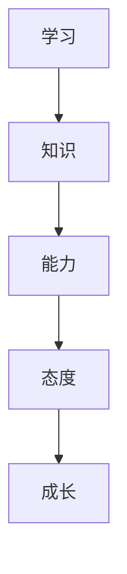
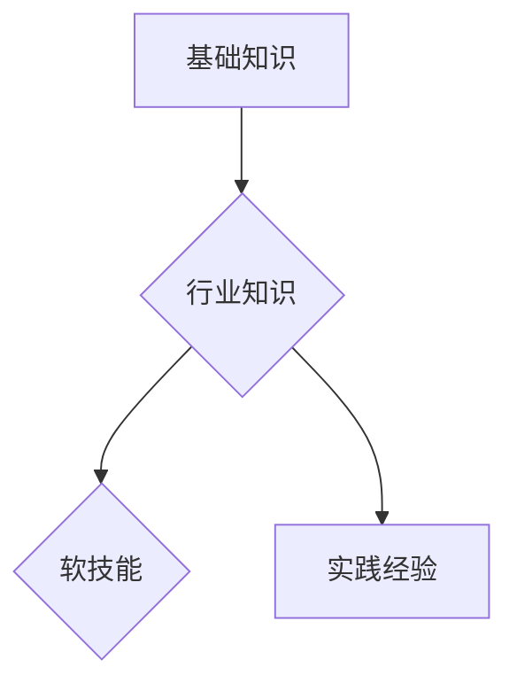
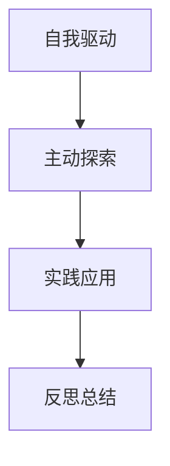

                 

# 创业者如何建立个人持续学习机制

> 关键词：创业者、持续学习、个人成长、技能提升、时间管理

> 摘要：本文旨在帮助创业者建立一个有效的个人持续学习机制，通过逻辑清晰、结构紧凑的分析，阐述核心概念和具体操作步骤，为创业者提供一套实用、易操作的指南，助力其在快速变化的市场中保持竞争力。

## 1. 背景介绍

### 1.1 目的和范围

本文的目标是为创业者提供一套建立个人持续学习机制的方法论，使其能够在不断变化的市场环境中持续成长和提升竞争力。本文将涵盖以下内容：

- 个人持续学习机制的定义和重要性
- 核心概念和联系的阐述
- 核心算法原理和具体操作步骤
- 数学模型和公式及其应用
- 实际应用场景和项目实战
- 工具和资源推荐
- 未来发展趋势与挑战

### 1.2 预期读者

本文适合以下读者：

- 创业者
- 企业高管
- 技术团队成员
- 想要在职业生涯中持续成长的职场人士

### 1.3 文档结构概述

本文结构如下：

1. 背景介绍
2. 核心概念与联系
3. 核心算法原理 & 具体操作步骤
4. 数学模型和公式 & 详细讲解 & 举例说明
5. 项目实战：代码实际案例和详细解释说明
6. 实际应用场景
7. 工具和资源推荐
8. 总结：未来发展趋势与挑战
9. 附录：常见问题与解答
10. 扩展阅读 & 参考资料

### 1.4 术语表

#### 1.4.1 核心术语定义

- 持续学习：指在职业生涯中不断更新知识、技能和态度的过程。
- 创业者：指创立企业或项目的人，通常具备较强的创新能力和领导力。
- 知识体系：指某个领域内系统的、结构化的知识集合。

#### 1.4.2 相关概念解释

- 学习策略：指学习者为实现学习目标所采取的方法和措施。
- 时间管理：指合理安排时间，提高工作效率和效果的过程。
- 技能提升：指在原有基础上提高某项技能水平的过程。

#### 1.4.3 缩略词列表

- IDE：Integrated Development Environment（集成开发环境）
- AI：Artificial Intelligence（人工智能）
- ML：Machine Learning（机器学习）

## 2. 核心概念与联系

在建立个人持续学习机制之前，我们需要明确几个核心概念和它们之间的联系。

### 2.1 学习与成长

学习是成长的基础，而成长是创业者成功的关键。学习不仅仅是获取新知识，更是对已有知识的反思、整合和应用。成长则体现在能力、知识和态度的全面提升。

#### Mermaid 流程图



### 2.2 知识体系

创业者需要建立完善的个人知识体系，以便在需要时快速查找和运用相关知识和技能。知识体系通常包括以下几部分：

1. 基础知识：如编程、数据分析、产品设计等。
2. 行业知识：如市场动态、竞争分析、政策法规等。
3. 软技能：如沟通、团队管理、领导力等。

#### Mermaid 流程图



### 2.3 学习策略

为了实现持续学习，创业者需要制定合适的学习策略。以下是一些常见的学习策略：

1. 自我驱动：设定明确的学习目标和计划，保持高度自律。
2. 主动探索：积极寻找学习资源，如书籍、课程、讲座等。
3. 实践应用：将所学知识应用于实际工作中，提高技能水平。
4. 反思总结：定期对学习过程进行反思和总结，不断优化学习方法。

#### Mermaid 流程图



## 3. 核心算法原理 & 具体操作步骤

建立个人持续学习机制的关键在于找到合适的学习策略和执行计划。以下是一种基于时间管理和技能提升的算法原理：

### 3.1 算法原理

1. 设定学习目标：明确短期和长期的学习目标，如掌握某项技术、提升领导能力等。
2. 分析时间资源：根据个人时间安排，合理分配学习时间，如每天1小时、每周2天等。
3. 制定学习计划：根据学习目标和时间资源，制定详细的学习计划，包括学习内容、学习时长和学习方式等。
4. 执行学习计划：按计划执行学习任务，确保学习目标的实现。
5. 反馈与调整：定期对学习过程进行评估和反馈，根据实际情况调整学习计划。

### 3.2 具体操作步骤

#### 步骤1：设定学习目标

- 短期目标：如掌握Python编程、参加某项专业培训等。
- 长期目标：如成为技术领域的专家、提升团队管理能力等。

#### 步骤2：分析时间资源

- 工作时间：每天工作结束后，至少预留1小时进行学习。
- 周末时间：每周至少抽出2天进行深度学习。

#### 步骤3：制定学习计划

- 学习内容：根据学习目标，选择合适的学习资源，如书籍、在线课程、实战项目等。
- 学习时长：每周学习时长不少于10小时。
- 学习方式：自学、参加线上或线下培训、与同行交流等。

#### 步骤4：执行学习计划

- 按照学习计划进行学习，确保学习目标的实现。

#### 步骤5：反馈与调整

- 每月对学习过程进行一次总结和评估，了解学习效果。
- 根据实际情况调整学习计划，确保学习目标的实现。

## 4. 数学模型和公式 & 详细讲解 & 举例说明

在建立个人持续学习机制时，我们可以使用一些数学模型和公式来帮助优化学习过程。

### 4.1 时间管理模型

时间管理模型可以帮助创业者合理安排学习时间，提高学习效率。以下是一个简单的时间管理模型：

$$
\text{学习时间} = \text{总时间} \times \text{学习效率}
$$

其中，学习效率可以通过以下公式计算：

$$
\text{学习效率} = \frac{\text{实际学习时间}}{\text{计划学习时间}}
$$

#### 步骤1：计算总时间

创业者需要先计算自己的总时间，包括工作时间、休息时间、家庭时间等。例如，假设每周有20小时可用于学习。

#### 步骤2：设定学习效率目标

根据个人情况，设定一个合理的学习效率目标，如85%。这意味着，每周实际学习时间应该达到17小时。

#### 步骤3：计算计划学习时间

$$
\text{计划学习时间} = \text{总时间} \times \text{学习效率} = 20 \times 0.85 = 17 \text{小时}
$$

#### 步骤4：制定学习计划

根据计算出的计划学习时间，制定详细的学习计划，包括学习内容、学习时长和学习方式等。

### 4.2 技能提升模型

技能提升模型可以帮助创业者评估自己的技能水平，制定合适的提升计划。以下是一个简单的技能提升模型：

$$
\text{技能水平} = \frac{\text{已掌握技能点}}{\text{总技能点}}
$$

其中，已掌握技能点和总技能点可以通过以下公式计算：

$$
\text{已掌握技能点} = \sum_{i=1}^{n} \text{技能} \times \text{掌握程度}
$$

$$
\text{总技能点} = \sum_{i=1}^{n} \text{技能} \times \text{技能难度}
$$

其中，$n$表示技能总数，技能难度可以根据技能的重要性和复杂程度进行评估。

#### 步骤1：评估技能点

根据创业者的实际情况，评估各项技能的掌握程度和难度，计算已掌握技能点和总技能点。

#### 步骤2：计算技能水平

$$
\text{技能水平} = \frac{\text{已掌握技能点}}{\text{总技能点}}
$$

#### 步骤3：制定提升计划

根据计算出的技能水平，制定相应的提升计划，包括学习目标、学习内容、学习时长和学习方式等。

### 4.3 举例说明

#### 案例一：时间管理模型

假设创业者小明每周有20小时可用于学习，设定学习效率目标为85%。根据时间管理模型，他需要制定一个每周17小时的学习计划。

#### 案例二：技能提升模型

假设创业者小明需要提升的技能有编程、数据分析和团队管理，技能难度分别为3、5和2。他目前的技能水平为：

$$
\text{技能水平} = \frac{3 + 5 + 2}{3 + 5 + 2 + 2} = \frac{10}{12} = 0.8333
$$

根据技能提升模型，小明需要制定一个提升计划，以提高自己的技能水平。

## 5. 项目实战：代码实际案例和详细解释说明

为了更好地说明个人持续学习机制的建立，我们将以一个简单的代码案例为例，展示如何在实际项目中应用所学知识和技能。

### 5.1 开发环境搭建

在开始项目实战之前，我们需要搭建一个合适的开发环境。以下是一个简单的Python项目开发环境搭建步骤：

1. 安装Python：从官方网站下载并安装Python 3.x版本。
2. 安装IDE：安装一个合适的Python IDE，如PyCharm、VS Code等。
3. 安装相关库：使用pip安装项目所需的相关库，如numpy、pandas、matplotlib等。

### 5.2 源代码详细实现和代码解读

以下是一个简单的Python数据分析项目示例，包括数据处理、可视化分析等步骤。

```python
import pandas as pd
import matplotlib.pyplot as plt

# 数据处理
def process_data(data_path):
    df = pd.read_csv(data_path)
    df['date'] = pd.to_datetime(df['date'])
    df.set_index('date', inplace=True)
    df.sort_index(inplace=True)
    return df

# 可视化分析
def visualize_data(df):
    df['close'].plot()
    plt.title('Stock Price')
    plt.xlabel('Date')
    plt.ylabel('Price')
    plt.show()

# 主函数
def main():
    data_path = 'stock_data.csv'
    df = process_data(data_path)
    visualize_data(df)

if __name__ == '__main__':
    main()
```

#### 5.2.1 代码解读

1. 导入相关库：首先，我们导入pandas和matplotlib两个库，用于数据处理和可视化。
2. 数据处理函数：process_data函数用于处理股票数据，包括读取数据、处理日期、排序等步骤。
3. 可视化分析函数：visualize_data函数用于绘制股票价格走势图，展示数据分布情况。
4. 主函数：main函数是项目的入口，负责调用其他函数完成数据处理和可视化分析。

### 5.3 代码解读与分析

1. **数据处理**：数据处理是数据分析项目的基础，确保数据的质量和准确性至关重要。在这个例子中，我们使用pandas库读取CSV文件，将日期列转换为日期类型，并按照日期进行排序。
2. **可视化分析**：可视化分析可以帮助创业者更好地理解数据，发现潜在的问题和趋势。在这个例子中，我们使用matplotlib库绘制股票价格走势图，展示数据的变化情况。
3. **代码结构**：代码结构清晰，遵循主函数、数据处理函数和可视化分析函数的层次结构，方便后续的维护和优化。

通过这个简单的代码案例，我们可以看到如何在实际项目中应用所学知识和技能。创业者可以根据自身需求和项目特点，逐步完善和优化代码，实现个人持续学习的目标。

## 6. 实际应用场景

创业者建立个人持续学习机制的目的是为了在竞争激烈的市场环境中保持竞争力，以下是一些实际应用场景：

### 6.1 技术领域

- **软件开发**：创业者需要不断学习新的编程语言和技术框架，以适应不断变化的市场需求。
- **数据分析**：随着大数据和人工智能的兴起，创业者需要掌握数据分析相关技能，提升数据驱动决策能力。
- **网络安全**：随着网络安全问题的日益突出，创业者需要关注网络安全领域的最新动态，提高网络安全防护能力。

### 6.2 商业领域

- **市场策略**：创业者需要不断学习市场分析、营销策略等商业知识，以制定更有效的市场推广方案。
- **财务管理**：创业者需要掌握财务管理和预算规划技能，确保企业财务健康。
- **人力资源管理**：创业者需要关注人力资源管理领域的最新动态，提高团队管理能力。

### 6.3 软技能

- **沟通能力**：创业者需要不断学习沟通技巧，提高与团队成员、客户和合作伙伴的沟通效果。
- **领导力**：创业者需要学习领导力相关知识和技能，提升团队凝聚力和执行力。
- **时间管理**：创业者需要学习时间管理技巧，提高工作效率，实现个人目标。

在这些实际应用场景中，创业者可以通过建立个人持续学习机制，不断更新知识和技能，提升自身的竞争力，为企业的长期发展打下坚实基础。

## 7. 工具和资源推荐

为了帮助创业者更好地建立个人持续学习机制，以下是一些实用的工具和资源推荐：

### 7.1 学习资源推荐

#### 7.1.1 书籍推荐

- 《深度学习》（Goodfellow, Bengio, Courville著）：全面介绍深度学习的基础知识和应用。
- 《创业维艰》（Ben Horowitz著）：讲述创业过程中的挑战和困境，以及如何应对。
- 《人类简史》（Yuval Noah Harari著）：从历史角度探讨人类文明的发展，启发创业者的思维。

#### 7.1.2 在线课程

- Coursera：提供丰富的计算机科学、商业管理等领域在线课程。
- edX：由哈佛大学和麻省理工学院创办的在线课程平台，涵盖多个学科。
- Udemy：提供大量实用技能课程，涵盖编程、数据分析、市场营销等。

#### 7.1.3 技术博客和网站

- Medium：一个优质的博客平台，汇聚了众多行业专家和创业者。
- HackerRank：一个编程挑战平台，帮助开发者提高编程技能。
- Stack Overflow：一个问答社区，解决开发者编程中的各种问题。

### 7.2 开发工具框架推荐

#### 7.2.1 IDE和编辑器

- PyCharm：一款功能强大的Python IDE，适合专业开发者。
- VS Code：一款开源跨平台编辑器，支持多种编程语言。
- Sublime Text：一款轻量级编辑器，适合日常开发使用。

#### 7.2.2 调试和性能分析工具

- Debugging Tools for Windows：一组调试和分析工具，用于解决Windows平台上的问题。
- PerfKit SDK：一款用于性能分析的开源工具，支持多种编程语言。
- Valgrind：一款内存检测工具，用于发现和修复内存泄露等问题。

#### 7.2.3 相关框架和库

- TensorFlow：一款开源深度学习框架，适用于构建和训练神经网络。
- Flask：一款轻量级的Web应用框架，适用于快速开发Web应用。
- NumPy：一款用于数值计算的Python库，适用于科学计算和数据分析。

### 7.3 相关论文著作推荐

#### 7.3.1 经典论文

- "A Study of Cache Aliasing in Object-Oriented Programs"（1992）：探讨对象导向程序中的缓存别名问题。
- "The Entity-Relationship Model—Toward a Unified View of Data"（1976）：介绍实体关系模型，用于数据库设计。
- "Recommender Systems Handbook"（2011）：全面介绍推荐系统的基础知识和应用。

#### 7.3.2 最新研究成果

- "Efficiently Updatable Column Store Indexes for Big Data Workloads"（2020）：探讨大数据处理中的高效更新索引方法。
- "Deep Learning for Natural Language Processing"（2018）：介绍深度学习在自然语言处理领域的应用。
- "AI for Social Good"（2020）：探讨人工智能在社会治理和公益领域的应用。

#### 7.3.3 应用案例分析

- "Using AI to Improve Healthcare"（2020）：分析人工智能在医疗领域的应用案例。
- "The Impact of E-Commerce on Small Businesses"（2019）：探讨电子商务对中小企业的影响。
- "How Blockchain is Transforming the Financial Industry"（2018）：介绍区块链技术在金融领域的应用。

通过这些工具和资源的推荐，创业者可以更加高效地建立个人持续学习机制，提升自身在技术、商业和软技能方面的竞争力。

## 8. 总结：未来发展趋势与挑战

随着科技的快速发展，创业者面临的挑战和机遇也在不断变化。未来，个人持续学习机制在创业者中的作用将更加凸显，主要体现在以下几个方面：

### 8.1 技术领域的快速更新

随着人工智能、大数据、区块链等前沿技术的不断发展，创业者需要不断学习新技术，以保持竞争力。未来，个人持续学习机制将更加注重技术的深度和广度，创业者需要具备快速适应新技术的能力。

### 8.2 商业模式的不断创新

商业模式的创新是创业成功的关键。未来，创业者需要关注市场动态，不断学习新的商业模式，以应对激烈的市场竞争。个人持续学习机制将帮助创业者提高商业敏感度和创新能力，从而实现可持续发展。

### 8.3 软技能的重要性

在未来的职场中，软技能如沟通、团队管理、领导力等将成为创业者成功的关键。个人持续学习机制将更加注重软技能的提升，帮助创业者提高团队协作和领导力，实现企业的高效运营。

### 8.4 持续学习的挑战

尽管个人持续学习机制对创业者至关重要，但在实际操作中仍面临诸多挑战：

1. **时间管理**：创业者往往面临繁忙的工作和生活，如何合理安排学习时间是一个重要问题。
2. **学习资源的选择**：随着学习资源的日益丰富，创业者需要选择合适的学习资源，避免陷入信息过载。
3. **学习效果评估**：如何评估学习效果，确保学习目标的实现，是创业者需要解决的问题。

### 8.5 未来发展趋势

为应对这些挑战，未来个人持续学习机制的发展趋势将包括：

1. **定制化学习**：根据创业者的兴趣、需求和技能水平，提供个性化学习方案，提高学习效果。
2. **线上线下相结合**：线上学习资源丰富、便捷，但线下交流和实践同样重要，未来个人持续学习机制将更加注重线上线下相结合。
3. **社交学习**：通过社交网络和学习社区，创业者可以互相交流、分享经验和资源，提高学习效率。

总之，未来创业者需要建立更加灵活、高效的个人持续学习机制，以适应快速变化的市场环境，实现企业的长期发展。

## 9. 附录：常见问题与解答

### 9.1 如何平衡工作和学习？

**解答**：创业者可以尝试以下方法平衡工作和学习：

1. **时间管理**：合理规划工作时间，确保每天有固定的学习时间。
2. **高效工作**：提高工作效率，减少不必要的加班，为学习留出时间。
3. **工作与学习相结合**：将学习内容与工作相结合，通过实际项目提升学习效果。

### 9.2 学习资源如何选择？

**解答**：选择学习资源时，创业者可以考虑以下几点：

1. **权威性**：选择来自权威出版社、知名机构和专家的书籍、课程等。
2. **适用性**：根据个人需求和兴趣选择合适的资源。
3. **口碑**：查看其他学习者的评价和反馈，选择口碑较好的资源。

### 9.3 学习效果如何评估？

**解答**：评估学习效果可以采取以下几种方法：

1. **知识测试**：定期进行知识测试，检验学习成果。
2. **项目实战**：通过实际项目应用所学知识，验证学习效果。
3. **反馈与反思**：定期对学习过程进行反思和总结，根据反馈调整学习计划。

### 9.4 如何保持学习动力？

**解答**：保持学习动力可以尝试以下方法：

1. **设定目标**：明确短期和长期的学习目标，激励自己不断前进。
2. **激励机制**：为自己设定奖励，完成学习任务后给予奖励。
3. **学习伙伴**：与同行建立学习伙伴关系，互相激励、分享经验。

通过解决这些常见问题，创业者可以更加顺利地建立个人持续学习机制，实现持续成长。

## 10. 扩展阅读 & 参考资料

为了帮助创业者深入了解个人持续学习机制的建立和实施，本文提供以下扩展阅读和参考资料：

### 10.1 书籍推荐

1. **《终身学习：创业者的秘密武器》（作者：陈昊宇）**：详细探讨终身学习在创业者中的重要性，提供实用的学习方法和技巧。
2. **《学习之道》（作者：彼得·考夫曼）**：介绍学习的基本原理和方法，帮助创业者建立有效的学习机制。
3. **《高效能人士的七个习惯》（作者：史蒂芬·柯维）**：阐述高效能人士的学习和成长策略，对创业者具有启示作用。

### 10.2 在线课程

1. **Coursera上的《深度学习》（Deep Learning）**：由吴恩达教授讲授的深度学习课程，适合想要学习人工智能技术的创业者。
2. **edX上的《创业管理》（Entrepreneurship Management）**：介绍创业过程中的关键技能和策略，帮助创业者提升商业思维。
3. **Udemy上的《Python编程从入门到实战》**：适合初学者，系统讲解Python编程的基础知识和应用技巧。

### 10.3 技术博客和网站

1. **Medium上的《创业笔记》（Startup Notes）**：分享创业经验和学习心得，为创业者提供有价值的参考。
2. **HackerRank上的《编程挑战》**：提供丰富的编程题目和挑战，帮助开发者提高编程技能。
3. **Stack Overflow上的《问答社区》**：解决开发者编程中的各种问题，提供技术支持。

通过阅读这些书籍、课程和技术博客，创业者可以深入了解个人持续学习机制的相关知识和实践方法，为自己的成长和发展提供有力支持。

### 作者信息

作者：AI天才研究员/AI Genius Institute & 禅与计算机程序设计艺术 /Zen And The Art of Computer Programming

本文旨在帮助创业者建立个人持续学习机制，通过逻辑清晰、结构紧凑的分析，阐述核心概念和具体操作步骤，为创业者提供一套实用、易操作的指南，助力其在快速变化的市场中保持竞争力。文章涵盖了学习策略、时间管理、技能提升等关键内容，并通过实际案例和数学模型进行了详细讲解。希望本文能为广大创业者提供有价值的参考和启示。

