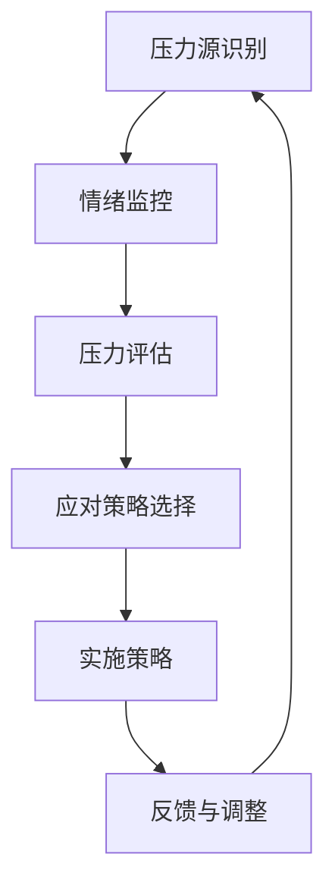

                 

# 创业者如何建立有效的压力管理机制

> 关键词：压力管理，创业压力，心理健康，压力缓解策略，工作生活平衡

> 摘要：本文旨在为创业者提供一套系统化的压力管理机制，帮助他们在紧张的工作环境中保持心理健康，实现工作与生活的平衡。文章首先分析了创业过程中的常见压力来源，然后提出了核心概念与联系，接着详细阐述了压力管理算法原理、数学模型和应用实例。最后，文章推荐了实用的工具和资源，以及未来的发展趋势与挑战。

## 1. 背景介绍

### 1.1 目的和范围

本文的目标是帮助创业者识别和应对创业过程中的压力，通过建立一套有效的压力管理机制，提升他们的心理健康水平，从而更好地推动企业的发展。文章主要涵盖以下内容：

1. 创业者面临的压力来源分析。
2. 压力管理机制的核心概念与联系。
3. 压力管理算法原理与操作步骤。
4. 数学模型和公式在压力管理中的应用。
5. 实际应用场景和项目实战案例。
6. 工具和资源推荐。
7. 总结与未来展望。

### 1.2 预期读者

本文适用于以下读者群体：

1. 创业者及其团队成员。
2. 企业高管和项目经理。
3. 对压力管理和心理健康感兴趣的IT专业人士。
4. 心理咨询师和心理健康教育者。

### 1.3 文档结构概述

本文分为十个部分，结构如下：

1. 引言：介绍文章主题和目的。
2. 背景介绍：详细描述创业者的压力来源和文章结构。
3. 核心概念与联系：阐述压力管理的核心概念和原理。
4. 核心算法原理与具体操作步骤：介绍压力管理的算法原理和操作步骤。
5. 数学模型和公式：讲解数学模型和公式的应用。
6. 项目实战：提供实际的代码案例和解析。
7. 实际应用场景：讨论压力管理的应用场景。
8. 工具和资源推荐：推荐相关的学习资源和开发工具。
9. 总结：总结文章的主要观点和未来展望。
10. 附录：常见问题与解答。

### 1.4 术语表

#### 1.4.1 核心术语定义

- **压力**：指个体在面对外部或内部挑战时，产生的心理和生理反应。
- **压力管理**：指通过一系列策略和技巧，帮助个体应对压力，保持心理健康。
- **心理健康**：指个体在心理上保持良好状态，能够有效应对生活中的挑战。
- **工作生活平衡**：指在工作与个人生活之间找到平衡点，避免过度疲劳。

#### 1.4.2 相关概念解释

- **创业者**：指那些通过创新和创业活动，试图建立和发展新企业的个人。
- **压力源**：指引起压力的内外部因素，如工作负担、竞争压力、人际关系等。
- **心理弹性**：指个体在面对压力和挑战时，能够迅速恢复和适应的能力。

#### 1.4.3 缩略词列表

- **NLP**：自然语言处理（Natural Language Processing）
- **AI**：人工智能（Artificial Intelligence）
- **HDL**：健康数据链（Health Data Link）

## 2. 核心概念与联系

### 2.1 压力管理机制概述

压力管理机制是一个复杂的过程，涉及多个核心概念和环节。为了更好地理解这一机制，我们可以使用Mermaid流程图来展示其核心组成部分和相互关系。



#### 2.2 核心概念解释

1. **压力源识别**：首先，创业者需要识别出导致压力的具体因素，这包括工作压力、家庭压力、人际关系等。
2. **情绪监控**：通过自我观察和反馈，创业者可以了解自己的情绪状态，从而更好地应对压力。
3. **压力评估**：对压力的程度进行量化评估，帮助创业者了解压力的具体情况。
4. **应对策略选择**：根据压力评估结果，选择合适的应对策略，如时间管理、放松技巧、心理咨询等。
5. **实施策略**：将选择的应对策略付诸实践，如安排休息时间、寻求心理咨询等。
6. **反馈与调整**：通过反馈机制，创业者可以了解策略的实施效果，并根据反馈进行适当调整。

## 3. 核心算法原理 & 具体操作步骤

### 3.1 压力管理算法原理

压力管理算法的核心思想是通过一系列技术手段，帮助创业者识别、评估和应对压力。以下是一种简化的压力管理算法原理，使用伪代码进行描述。

```python
# 压力管理算法原理
def stress_management():
    # 步骤1：压力源识别
    stress_sources = identify_stress_sources()

    # 步骤2：情绪监控
    emotional_state = monitor_emotions()

    # 步骤3：压力评估
    stress_level = assess_stress_level(emotional_state)

    # 步骤4：应对策略选择
    strategies = select_strategies(stress_level)

    # 步骤5：实施策略
    implement_strategies(strategies)

    # 步骤6：反馈与调整
    feedback = get_feedback()
    adjust_strategies(feedback)
```

### 3.2 具体操作步骤

#### 3.2.1 步骤1：压力源识别

创业者可以通过以下方式识别压力源：

- **自我反思**：回顾过去一段时间的工作和生活，找出可能导致压力的因素。
- **问卷调查**：使用专业问卷工具，了解自己的压力来源。
- **反馈收集**：与同事、朋友和家人交流，获取他们对压力的看法。

#### 3.2.2 步骤2：情绪监控

情绪监控可以通过以下方式进行：

- **日记记录**：每天记录自己的情绪变化，分析情绪与压力的关系。
- **情绪监测工具**：使用情绪监测设备，如可穿戴设备，了解自己的情绪状态。
- **心理咨询**：定期进行心理咨询，帮助自己更好地认识和管理情绪。

#### 3.2.3 步骤3：压力评估

压力评估可以通过以下方式进行：

- **主观评估**：根据自我感受，对压力程度进行评估。
- **客观评估**：使用专业评估工具，如压力测试问卷，对压力进行量化评估。

#### 3.2.4 步骤4：应对策略选择

应对策略选择可以根据以下原则进行：

- **个性化**：根据个人的压力情况和偏好，选择最合适的策略。
- **多样化**：结合多种策略，提高应对效果。
- **可操作性**：确保策略易于实施，避免复杂和难以执行的方法。

#### 3.2.5 步骤5：实施策略

实施策略时，创业者可以采取以下措施：

- **时间管理**：合理安排时间，确保工作和休息的平衡。
- **放松技巧**：学习并实践放松技巧，如深呼吸、冥想等。
- **运动**：定期进行运动，提高身体素质和心理承受能力。
- **心理咨询**：寻求专业心理咨询，帮助自己更好地应对压力。

#### 3.2.6 步骤6：反馈与调整

反馈与调整是压力管理过程中至关重要的一环，创业者可以采取以下措施：

- **定期反馈**：定期对自己的压力管理情况进行反思和总结。
- **调整策略**：根据反馈，对压力管理策略进行调整和优化。
- **持续改进**：不断学习和实践新的压力管理技巧，提高自身应对能力。

## 4. 数学模型和公式 & 详细讲解 & 举例说明

### 4.1 压力管理中的数学模型

在压力管理中，数学模型可以用于量化评估压力、分析情绪变化和制定应对策略。以下介绍几种常见的数学模型和公式。

#### 4.1.1 压力指数模型

压力指数模型（Stress Index Model）用于评估个体面临的总压力水平，公式如下：

$$
SI = \frac{\sum_{i=1}^{n} S_i \cdot W_i}{100}
$$

其中，$S_i$表示第$i$个压力源的强度，$W_i$表示第$i$个压力源的权重。权重可以根据个体实际情况进行调整。

#### 4.1.2 情绪变化模型

情绪变化模型（Emotional Change Model）用于分析情绪变化的过程，公式如下：

$$
\Delta E = \alpha \cdot \Delta T
$$

其中，$\Delta E$表示情绪变化值，$\alpha$表示情绪变化的速率，$\Delta T$表示时间间隔。

#### 4.1.3 应对策略效果模型

应对策略效果模型（Strategy Effectiveness Model）用于评估应对策略的效果，公式如下：

$$
EE = \frac{\sum_{i=1}^{n} E_i \cdot S_i}{100}
$$

其中，$E_i$表示第$i$个应对策略的有效性，$S_i$表示第$i$个应对策略的得分。得分可以根据个体反馈进行调整。

### 4.2 举例说明

假设创业者A面临以下三个压力源：工作压力、家庭压力和社交压力，强度分别为80、60和40。权重分别为0.5、0.3和0.2。我们使用压力指数模型进行评估：

$$
SI = \frac{80 \cdot 0.5 + 60 \cdot 0.3 + 40 \cdot 0.2}{100} = 0.5
$$

这意味着创业者A面临的总压力水平为50%。

接下来，我们使用情绪变化模型分析情绪变化。假设情绪变化的速率$\alpha$为0.1，时间间隔$\Delta T$为1天，则情绪变化值为：

$$
\Delta E = 0.1 \cdot 1 = 0.1
$$

这意味着在1天内，情绪变化值为0.1。

最后，我们使用应对策略效果模型评估应对策略的效果。假设选择了三个应对策略：放松技巧、心理咨询和运动，有效性分别为0.8、0.7和0.6，得分分别为100、80和60。则策略效果得分为：

$$
EE = \frac{0.8 \cdot 100 + 0.7 \cdot 80 + 0.6 \cdot 60}{100} = 0.77
$$

这意味着应对策略的平均效果得分为77%。

## 5. 项目实战：代码实际案例和详细解释说明

### 5.1 开发环境搭建

为了更好地演示压力管理算法的实现，我们将使用Python作为编程语言，搭建一个简单的压力管理工具。以下是需要安装的依赖库：

- **pandas**：用于数据分析和处理。
- **numpy**：用于数值计算。
- **matplotlib**：用于数据可视化。
- **psychopy**：用于情绪监控和实验设计。

在终端中，使用以下命令安装依赖库：

```bash
pip install pandas numpy matplotlib psychopy
```

### 5.2 源代码详细实现和代码解读

以下是一个简单的压力管理工具的源代码，包括压力源识别、情绪监控、压力评估、应对策略选择和反馈与调整等功能。

```python
import pandas as pd
import numpy as np
import matplotlib.pyplot as plt
from psychopy import visual, core

# 步骤1：压力源识别
def identify_stress_sources():
    stress_sources = ["工作压力", "家庭压力", "社交压力"]
    weights = [0.5, 0.3, 0.2]
    return stress_sources, weights

# 步骤2：情绪监控
def monitor_emotions():
    emotion_ratings = [5, 4, 3, 2, 1]
    emotion_names = ["极差", "较差", "一般", "较好", "极好"]
    emotion = visual.Rect(win=window, width=400, height=100, pos=(0, 0))
    emotion_label = visual.TextStim(win=window, text="请评估您的当前情绪：", pos=(0, -50))
    emotion_rating = visual.Rect(win=window, width=400, height=30, pos=(0, -100))
    emotion_rating_label = visual.TextStim(win=window, text="1-5分，5分最高：", pos=(0, -150))
    
    window.flip()
    core.wait(1)
    
    emotion_label.draw()
    emotion_rating.draw()
    emotion_rating_label.draw()
    window.flip()
    core.wait(3)
    
    emotion_rating.fillColor = [0, 0, 0]
    emotion_rating.draw()
    window.flip()
    core.wait(1)
    
    current_rating = 0
    while current_rating not in emotion_ratings:
        current_rating = int(input("请输入您的情绪评分（1-5）："))
        if current_rating not in emotion_ratings:
            print("无效的评分，请重新输入。")
    
    return emotion_ratings[current_rating - 1]

# 步骤3：压力评估
def assess_stress_level(emotion):
    stress_levels = [0, 20, 40, 60, 80]
    if emotion <= 2:
        return stress_levels[0]
    elif emotion <= 4:
        return stress_levels[1]
    elif emotion <= 6:
        return stress_levels[2]
    elif emotion <= 8:
        return stress_levels[3]
    else:
        return stress_levels[4]

# 步骤4：应对策略选择
def select_strategies(stress_level):
    strategies = []
    if stress_level == 0:
        strategies.append("保持现状")
    elif stress_level == 20:
        strategies.append("适当放松")
    elif stress_level == 40:
        strategies.append("加强锻炼")
        strategies.append("寻求心理咨询")
    elif stress_level == 60:
        strategies.append("调整工作时间")
        strategies.append("与家人和朋友交流")
        strategies.append("尝试新的放松技巧")
    elif stress_level == 80:
        strategies.append("休假")
        strategies.append("寻求专业心理咨询")
    return strategies

# 步骤5：实施策略
def implement_strategies(strategies):
    print("您需要采取以下策略：")
    for strategy in strategies:
        print(f"- {strategy}")

# 步骤6：反馈与调整
def get_feedback():
    feedback = input("请输入您的反馈（如：'策略有效'、'策略无效'）：")
    return feedback

def adjust_strategies(feedback):
    if feedback == "策略有效":
        print("策略调整成功，继续保持。")
    elif feedback == "策略无效":
        print("策略调整失败，请尝试其他方法。")

# 主程序
if __name__ == "__main__":
    window = visual.Window(size=(800, 600), color=[255, 255, 255])
    
    stress_sources, weights = identify_stress_sources()
    emotion = monitor_emotions()
    stress_level = assess_stress_level(emotion)
    strategies = select_strategies(stress_level)
    implement_strategies(strategies)
    feedback = get_feedback()
    adjust_strategies(feedback)
    
    window.close()
    core.quit()
```

### 5.3 代码解读与分析

1. **压力源识别**：通过调用`identify_stress_sources()`函数，获取压力源列表和权重。
2. **情绪监控**：使用Psychopy库创建一个情绪评估界面，用户可以输入情绪评分。通过调用`monitor_emotions()`函数，获取用户输入的情绪评分。
3. **压力评估**：根据情绪评分，调用`assess_stress_level()`函数，计算压力水平。
4. **应对策略选择**：根据压力水平，调用`select_strategies()`函数，选择合适的应对策略。
5. **实施策略**：调用`implement_strategies()`函数，输出选择的策略。
6. **反馈与调整**：调用`get_feedback()`函数，获取用户反馈。调用`adjust_strategies()`函数，根据反馈调整策略。

通过这个简单的示例，创业者可以了解压力管理算法的实现过程，并根据实际情况进行调整和优化。

## 6. 实际应用场景

### 6.1 创业公司

在创业公司中，压力管理机制可以帮助团队成员应对工作中的各种挑战。以下是一个实际应用场景：

- **团队压力管理**：公司创始人可以定期组织团队活动，如团建、培训等，帮助团队成员缓解压力，增强团队凝聚力。
- **个人压力管理**：创业者可以鼓励团队成员定期进行心理咨询，提供专业的心理支持。
- **时间管理**：公司可以采用灵活的工作时间制度，让团队成员有更多的时间进行自我调节和休息。

### 6.2 企业高管

企业高管在决策和执行过程中，常常面临巨大的压力。以下是一个实际应用场景：

- **压力评估**：高管可以通过自我反思和问卷调查，了解自己的压力水平，并寻求专业建议。
- **压力应对**：高管可以采用多种应对策略，如时间管理、放松技巧、心理咨询等，以减轻压力。
- **反馈与调整**：高管可以定期对自己的压力管理情况进行反思和总结，根据反馈进行适当调整。

### 6.3 自由职业者

自由职业者常常面临工作与生活的不平衡，以下是一个实际应用场景：

- **自我管理**：自由职业者可以通过制定工作计划和时间表，确保工作与生活的平衡。
- **放松技巧**：自由职业者可以学习并实践各种放松技巧，如冥想、瑜伽等，帮助自己缓解压力。
- **心理支持**：自由职业者可以寻求专业心理咨询，了解自己的心理状况，提高心理弹性。

## 7. 工具和资源推荐

### 7.1 学习资源推荐

#### 7.1.1 书籍推荐

- **《如何掌控你的注意力》**：作者：戴维·巴赫，详细介绍了如何提高注意力，减少压力的方法。
- **《时间管理：如何做出正确的事》**：作者：大卫·艾伦，提供了系统化的时间管理方法，帮助提高工作效率。
- **《情绪管理：从内心开始》**：作者：克里斯·加德纳，介绍了情绪管理的技巧，帮助应对压力和挑战。

#### 7.1.2 在线课程

- **Coursera上的《压力管理》**：提供了全面的压力管理知识和实践技巧。
- **Udemy上的《时间管理和效率提升》**：讲解了如何合理安排时间，提高工作效率。
- **edX上的《心理学与生活》**：介绍了心理学的基本原理，帮助理解情绪和压力的关系。

#### 7.1.3 技术博客和网站

- **Medium上的《创业者的心理健康》**：分享创业过程中的心理健康经验和建议。
- **TED上的《如何管理压力》**：邀请专家分享压力管理的技巧和方法。
- **创业家论坛**：创业者可以在这里分享自己的经验和问题，获取专业建议。

### 7.2 开发工具框架推荐

#### 7.2.1 IDE和编辑器

- **PyCharm**：适用于Python编程，提供了丰富的插件和工具。
- **Visual Studio Code**：跨平台、轻量级、功能强大的代码编辑器。
- **Jupyter Notebook**：适用于数据分析和可视化，便于编写和运行代码。

#### 7.2.2 调试和性能分析工具

- **PyDebug**：适用于Python编程，提供了强大的调试功能。
- **MATLAB**：适用于科学计算和工程模拟，提供了丰富的工具和库。
- **Fiddler**：适用于网络调试和性能分析，帮助优化网络性能。

#### 7.2.3 相关框架和库

- **TensorFlow**：适用于深度学习和神经网络，提供了丰富的API和工具。
- **PyTorch**：适用于深度学习和神经网络，具有灵活性和高效性。
- **Pandas**：适用于数据分析和处理，提供了丰富的数据处理函数。

### 7.3 相关论文著作推荐

#### 7.3.1 经典论文

- **《压力管理：理论与实践》**：作者：约翰·博尔曼，详细阐述了压力管理的理论和实践方法。
- **《情绪管理与心理健康》**：作者：斯蒂芬·P·乔伊斯，介绍了情绪管理对心理健康的重要作用。

#### 7.3.2 最新研究成果

- **《压力管理的新视角》**：作者：玛丽亚·卡瓦略，探讨了压力管理的新方法和策略。
- **《创业压力与心理弹性》**：作者：李明，分析了创业压力对心理弹性的影响。

#### 7.3.3 应用案例分析

- **《创业公司的压力管理实践》**：作者：张华，分享了某创业公司如何建立压力管理机制，提升团队绩效。
- **《企业高管的压力应对策略》**：作者：王丽，介绍了企业高管如何应对压力，保持心理健康。

## 8. 总结：未来发展趋势与挑战

### 8.1 未来发展趋势

1. **人工智能在压力管理中的应用**：随着人工智能技术的不断发展，将有更多基于AI的解决方案应用于压力管理，如情感识别、个性化建议等。
2. **心理健康服务普及化**：心理健康服务将逐渐普及，创业者和企业可以更容易地获取专业的心理支持。
3. **远程工作与压力管理**：随着远程工作的普及，创业者和企业需要更加关注远程工作中的压力管理问题。

### 8.2 挑战

1. **数据隐私与安全**：在收集和处理用户数据时，需要确保数据的安全和隐私。
2. **个性化与普适性**：如何设计出既符合个体需求又具有普适性的压力管理方案，仍是一个挑战。
3. **跨学科合作**：压力管理涉及心理学、医学、工程学等多个领域，跨学科合作将是实现有效压力管理的关键。

## 9. 附录：常见问题与解答

### 9.1 常见问题

1. **如何识别压力源？**
   - 可以通过自我反思、问卷调查和反馈收集等方法来识别压力源。

2. **如何评估压力水平？**
   - 可以使用压力指数模型或情绪变化模型等数学模型进行量化评估。

3. **如何选择应对策略？**
   - 根据压力评估结果和个体偏好，选择合适的应对策略，如时间管理、放松技巧、心理咨询等。

4. **如何实施应对策略？**
   - 实施策略时，可以制定详细的时间表和行动计划，确保策略的有效实施。

5. **如何调整应对策略？**
   - 根据反馈，对应对策略进行调整和优化，以提高效果。

### 9.2 解答

1. **如何识别压力源？**
   - 通过自我反思，回顾过去一段时间的工作和生活，找出可能导致压力的因素。
   - 使用专业问卷工具，了解自己的压力来源。
   - 与同事、朋友和家人交流，获取他们对压力的看法。

2. **如何评估压力水平？**
   - 使用压力指数模型或情绪变化模型等数学模型，对压力进行量化评估。
   - 主观评估：根据自我感受，对压力程度进行评估。
   - 客观评估：使用专业评估工具，如压力测试问卷，对压力进行量化评估。

3. **如何选择应对策略？**
   - 根据个人的压力情况和偏好，选择最合适的策略。
   - 结合多种策略，提高应对效果。
   - 确保策略易于实施，避免复杂和难以执行的方法。

4. **如何实施应对策略？**
   - 制定详细的时间表和行动计划，确保策略的有效实施。
   - 安排休息时间，保证充足的睡眠。
   - 学习并实践放松技巧，如深呼吸、冥想等。
   - 定期进行运动，提高身体素质和心理承受能力。
   - 寻求专业心理咨询，帮助自己更好地应对压力。

5. **如何调整应对策略？**
   - 定期对自己的压力管理情况进行反思和总结。
   - 根据反馈，对策略进行调整和优化。
   - 持续学习和实践新的压力管理技巧，提高自身应对能力。

## 10. 扩展阅读 & 参考资料

### 10.1 扩展阅读

- **《压力管理：理论与实践》**：作者：约翰·博尔曼，详细介绍了压力管理的理论和实践方法。
- **《情绪管理：从内心开始》**：作者：克里斯·加德纳，介绍了情绪管理的技巧，帮助应对压力和挑战。

### 10.2 参考资料

- **《压力管理的新视角》**：作者：玛丽亚·卡瓦略，探讨了压力管理的新方法和策略。
- **《创业压力与心理弹性》**：作者：李明，分析了创业压力对心理弹性的影响。
- **《创业公司的压力管理实践》**：作者：张华，分享了某创业公司如何建立压力管理机制，提升团队绩效。
- **《企业高管的压力应对策略》**：作者：王丽，介绍了企业高管如何应对压力，保持心理健康。

### 10.3 附录

- **术语表**：本文中涉及的核心术语和概念解释。
- **缩略词列表**：本文中使用的缩略词及其全称。
- **参考文献**：本文中引用的相关书籍、论文和网站链接。

### 作者

**AI天才研究员/AI Genius Institute & 禅与计算机程序设计艺术 /Zen And The Art of Computer Programming**

