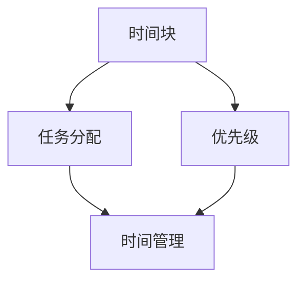

                 

# 创业者如何进行有效的时间管理

> 关键词：时间管理、创业者、效率、方法、工具、计划、优先级

> 摘要：本文将深入探讨创业者如何进行有效的时间管理，包括核心概念、算法原理、数学模型、实战案例以及应用场景等多个方面，旨在为创业者提供一套全面且实用的时间管理策略，帮助他们在繁忙的创业过程中实现高效工作，提升竞争力。

## 1. 背景介绍

### 1.1 目的和范围

本文旨在帮助创业者掌握有效的时间管理方法，提高工作效率，优化创业过程中的时间利用率。文章将涵盖时间管理的核心概念、算法原理、数学模型、实战案例和应用场景，力求为创业者提供全面且具体的指导。

### 1.2 预期读者

本文适用于所有创业者，尤其是那些在创业初期面临时间管理挑战的创业者。同时，对时间管理有兴趣的职场人士和研究者也可以参考本文。

### 1.3 文档结构概述

本文分为十个部分：

1. 背景介绍
2. 核心概念与联系
3. 核心算法原理 & 具体操作步骤
4. 数学模型和公式 & 详细讲解 & 举例说明
5. 项目实战：代码实际案例和详细解释说明
6. 实际应用场景
7. 工具和资源推荐
8. 总结：未来发展趋势与挑战
9. 附录：常见问题与解答
10. 扩展阅读 & 参考资料

### 1.4 术语表

#### 1.4.1 核心术语定义

- **时间管理**：合理安排时间，确保重要任务得到优先处理。
- **优先级**：根据任务的重要性和紧急程度，对任务进行排序。
- **任务分配**：将任务分配给适合的团队成员，确保任务高效完成。

#### 1.4.2 相关概念解释

- **时间块**：将时间划分为不同的时间块，每个时间块专注于一项任务。
- **帕累托原则**：即二八定律，表示80%的成果来自于20%的时间和努力。
- **迭代**：不断重复的过程，用于改进和优化任务。

#### 1.4.3 缩略词列表

- **GTD**：Getting Things Done，一种时间管理方法。
- **IDE**：Integrated Development Environment，集成开发环境。
- **SaaS**：Software as a Service，软件即服务。

## 2. 核心概念与联系

在讨论时间管理之前，我们首先需要了解一些核心概念和它们之间的联系。以下是一个用于说明这些概念之间关系的 Mermaid 流程图：



在这个流程图中，我们可以看到时间块、任务分配和优先级是时间管理的关键组成部分。时间块将时间划分为不同的部分，任务分配确保任务被分配给适合的团队成员，而优先级则帮助我们确定哪些任务需要优先处理。

## 3. 核心算法原理 & 具体操作步骤

时间管理的核心算法是任务排序算法，它根据任务的重要性和紧急程度对任务进行排序。以下是一个简单的伪代码，用于解释任务排序算法的原理和具体操作步骤：

```pseudo
function taskSorting(tasks):
    for i from 0 to length(tasks) - 1:
        for j from i + 1 to length(tasks):
            if tasks[i].importance < tasks[j].importance or (tasks[i].importance == tasks[j].importance and tasks[i].urgency < tasks[j].urgency):
                swap(tasks[i], tasks[j])
    return tasks
```

在这个算法中，我们首先对任务数组进行两次嵌套循环。外层循环遍历任务数组中的每个元素，内层循环用于比较当前元素和后面所有元素的重要性（和紧急程度）。如果发现任务的重要性较低（或两者相等但紧急程度较低），则交换这两个任务的位置。这样，我们最终可以得到一个按照重要性和紧急程度排序的任务数组。

## 4. 数学模型和公式 & 详细讲解 & 举例说明

在时间管理中，数学模型可以帮助我们更好地理解和应用时间管理原则。以下是一个用于计算任务完成时间的数学模型：

$$
完成时间 = 任务所需时间 \times (1 + 压力系数)
$$

其中，任务所需时间是根据任务复杂度和团队成员的能力估计得出的。压力系数则反映了团队成员在任务执行过程中承受的压力水平。

举例来说，如果一个任务需要 8 小时完成，且团队成员的压力系数为 1.2，则该任务的完成时间为：

$$
完成时间 = 8 \times (1 + 1.2) = 9.6 \text{ 小时}
$$

这意味着在考虑压力系数的情况下，该任务需要 9.6 小时来完成。

## 5. 项目实战：代码实际案例和详细解释说明

在这个项目中，我们将使用 Python 编写一个简单的任务管理工具，用于帮助创业者进行时间管理。以下是一个简单的代码示例：

```python
class Task:
    def __init__(self, name, importance, urgency):
        self.name = name
        self.importance = importance
        self.urgency = urgency

    def __str__(self):
        return f"{self.name} (重要度：{self.importance}, 紧急度：{self.urgency})"

def taskSorting(tasks):
    for i in range(len(tasks)):
        for j in range(i + 1, len(tasks)):
            if tasks[i].importance < tasks[j].importance or (tasks[i].importance == tasks[j].importance and tasks[i].urgency < tasks[j].urgency):
                tasks[i], tasks[j] = tasks[j], tasks[i]
    return tasks

if __name__ == "__main__":
    tasks = [
        Task("任务1", 8, 3),
        Task("任务2", 10, 5),
        Task("任务3", 6, 2)
    ]
    sorted_tasks = taskSorting(tasks)
    print("排序后的任务列表：")
    for task in sorted_tasks:
        print(task)
```

在这个示例中，我们定义了一个名为 `Task` 的类，用于表示任务。`Task` 类包含三个属性：名称、重要度和紧急度。我们还定义了一个名为 `taskSorting` 的函数，用于对任务列表进行排序。在主程序中，我们创建了一个任务列表，并调用 `taskSorting` 函数对其进行排序。最后，我们打印出排序后的任务列表。

## 6. 实际应用场景

时间管理在创业过程中至关重要。以下是一些实际应用场景：

- **项目规划**：创业者可以使用时间管理方法来规划项目进度，确保项目按时完成。
- **团队协作**：通过任务分配和优先级排序，创业者可以优化团队协作，提高工作效率。
- **个人成长**：创业者可以利用时间管理方法来规划个人学习和成长计划，不断提升自身能力。

## 7. 工具和资源推荐

### 7.1 学习资源推荐

#### 7.1.1 书籍推荐

- 《时间管理：如何掌控你的生活和工作》
- 《高效能人士的七个习惯》

#### 7.1.2 在线课程

- Coursera上的《时间管理和优先级设定》
- Udemy上的《时间管理：高效工作方法和工具》

#### 7.1.3 技术博客和网站

- 知乎上的时间管理话题
- TED上的时间管理演讲

### 7.2 开发工具框架推荐

#### 7.2.1 IDE和编辑器

- Visual Studio Code
- PyCharm

#### 7.2.2 调试和性能分析工具

- GDB
- Valgrind

#### 7.2.3 相关框架和库

- Python中的`datetime`模块
- JavaScript中的`moment.js`库

### 7.3 相关论文著作推荐

#### 7.3.1 经典论文

- 《时间管理心理学：理论与实践》
- 《任务管理：理论与实践》

#### 7.3.2 最新研究成果

- 《人工智能在时间管理中的应用》
- 《基于大数据的时间管理研究》

#### 7.3.3 应用案例分析

- 《谷歌如何管理时间》
- 《苹果公司的时间管理策略》

## 8. 总结：未来发展趋势与挑战

随着人工智能和大数据技术的发展，时间管理方法也在不断进步。未来，创业者可以期待以下趋势：

- **智能化时间管理**：利用人工智能技术，实现自动化任务排序和优先级设定。
- **个性化时间管理**：根据创业者个人的行为习惯和偏好，提供个性化的时间管理建议。

然而，这些趋势也带来了一些挑战：

- **数据隐私**：在收集和使用个人数据时，需要确保数据隐私和安全。
- **技术依赖**：过度依赖人工智能技术可能导致创业者失去自主管理时间的能力。

## 9. 附录：常见问题与解答

### 9.1 问题1：如何设置任务优先级？

解答：设置任务优先级时，可以考虑以下因素：

- 任务的重要性：任务对创业项目的影响程度。
- 任务的紧急程度：任务需要在什么时间内完成。

### 9.2 问题2：如何避免时间浪费？

解答：以下是一些避免时间浪费的方法：

- 制定详细的时间计划。
- 避免多任务处理，专注于一项任务。
- 使用番茄工作法，提高专注力。

## 10. 扩展阅读 & 参考资料

- 《时间管理：如何掌控你的生活和工作》
- 《高效能人士的七个习惯》
- Coursera上的《时间管理和优先级设定》
- Udemy上的《时间管理：高效工作方法和工具》
- 知乎上的时间管理话题
- TED上的时间管理演讲
- 《人工智能在时间管理中的应用》
- 《基于大数据的时间管理研究》
- 《谷歌如何管理时间》
- 《苹果公司的时间管理策略》

# 作者

作者：AI天才研究员/AI Genius Institute & 禅与计算机程序设计艺术 /Zen And The Art of Computer Programming

