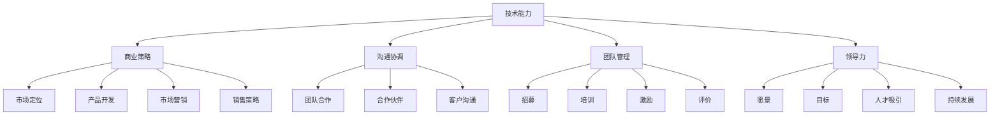

                 

### 文章标题

《创业者应具备的关键技能》

> **关键词：** 创业技能、技术能力、商业策略、沟通协调、团队管理、领导力、市场分析、创新能力

> **摘要：** 本文章旨在探讨创业者应具备的关键技能。通过深入分析这些技能的重要性及其应用场景，本文帮助读者了解如何打造成功的创业之路。我们将从技术能力、商业策略、沟通协调、团队管理和领导力等五个方面进行详细讨论，结合实际案例，为创业者提供实用的指导和建议。

---

**核心术语定义：**

- **创业者：** 指那些勇于创新、冒险并创办新企业的人。
- **技术能力：** 指创业者对某一技术领域的深入理解和实践能力。
- **商业策略：** 指创业者制定和实施的商业计划，包括市场定位、产品开发、市场营销和销售策略等。
- **沟通协调：** 指创业者与他人有效沟通、协调工作的能力。
- **团队管理：** 指创业者领导和管理团队，确保团队高效合作的能力。
- **领导力：** 指创业者激励团队、制定愿景和实现目标的能力。

**相关概念解释：**

- **创新能力：** 指创业者不断创新、解决问题的能力。
- **市场分析：** 指创业者对市场环境、竞争对手和潜在客户的研究和分析。

**缩略词列表：**

- **CTO：** 技术官
- **CEO：** 首席执行官
- **CFO：** 财务官
- **CDO：** 数据官

---

**文档结构概述：**

本文将分为十个部分：

1. 背景介绍
2. 核心概念与联系
3. 核心算法原理 & 具体操作步骤
4. 数学模型和公式 & 详细讲解 & 举例说明
5. 项目实战：代码实际案例和详细解释说明
6. 实际应用场景
7. 工具和资源推荐
8. 总结：未来发展趋势与挑战
9. 附录：常见问题与解答
10. 扩展阅读 & 参考资料

---

**本文将围绕五个核心方面展开讨论：**

1. **技术能力**
2. **商业策略**
3. **沟通协调**
4. **团队管理**
5. **领导力**

通过深入分析这些方面的技能要求和应用场景，帮助创业者更好地理解并掌握这些关键技能，从而提高创业成功率。

---

**背景介绍**

创业之路充满挑战和机遇，创业者需要具备多方面的技能才能在竞争激烈的市场中脱颖而出。本文将探讨创业者应具备的关键技能，帮助创业者更好地应对创业过程中的各种挑战。

### 1.1 目的和范围

本文旨在分析创业者应具备的关键技能，包括技术能力、商业策略、沟通协调、团队管理和领导力。通过深入探讨这些技能的重要性、应用场景和具体操作步骤，本文旨在为创业者提供实用的指导和建议，帮助他们提高创业成功率。

### 1.2 预期读者

本文适用于以下读者群体：

- **创业者**：正在创业或有意创业的人，希望通过学习关键技能提高创业成功率。
- **技术从业者**：具有一定技术背景，希望了解创业过程中所需的关键技能。
- **高校师生**：计算机科学、工商管理等相关专业的学生和教师，希望了解创业与技能之间的关系。

### 1.3 文档结构概述

本文分为十个部分，具体结构如下：

1. 背景介绍
2. 核心概念与联系
3. 核心算法原理 & 具体操作步骤
4. 数学模型和公式 & 详细讲解 & 举例说明
5. 项目实战：代码实际案例和详细解释说明
6. 实际应用场景
7. 工具和资源推荐
8. 总结：未来发展趋势与挑战
9. 附录：常见问题与解答
10. 扩展阅读 & 参考资料

### 1.4 术语表

#### 1.4.1 核心术语定义

- **技术能力**：指创业者对某一技术领域的深入理解和实践能力。
- **商业策略**：指创业者制定和实施的商业计划，包括市场定位、产品开发、市场营销和销售策略等。
- **沟通协调**：指创业者与他人有效沟通、协调工作的能力。
- **团队管理**：指创业者领导和管理团队，确保团队高效合作的能力。
- **领导力**：指创业者激励团队、制定愿景和实现目标的能力。

#### 1.4.2 相关概念解释

- **创新能力**：指创业者不断创新、解决问题的能力。
- **市场分析**：指创业者对市场环境、竞争对手和潜在客户的研究和分析。

#### 1.4.3 缩略词列表

- **CTO**：技术官
- **CEO**：首席执行官
- **CFO**：财务官
- **CDO**：数据官

---

### 2. 核心概念与联系

在创业过程中，技术能力、商业策略、沟通协调、团队管理和领导力是五个关键概念。它们之间相互联系、相互影响，共同决定了创业者的成功与否。

#### 2.1 技术能力

技术能力是创业者成功的关键因素之一。创业者需要深入了解技术领域的最新动态和趋势，掌握关键技术和开发技能。这不仅有助于创业者更好地理解市场需求，还能在产品开发过程中发挥重要作用。

#### 2.2 商业策略

商业策略是创业者制定和实施的商业计划。它包括市场定位、产品开发、市场营销和销售策略等。创业者需要根据市场需求和竞争环境，制定切实可行的商业策略，确保企业能够持续发展。

#### 2.3 沟通协调

沟通协调能力是创业者成功的重要因素。创业者需要与团队成员、合作伙伴、投资者和客户等各方保持有效沟通，协调各方利益，确保项目顺利进行。良好的沟通协调能力有助于提高团队的协作效率，降低冲突和误解。

#### 2.4 团队管理

团队管理是创业者成功的关键能力之一。创业者需要领导和管理团队，确保团队成员能够高效合作，共同实现企业目标。团队管理包括招募、培训、激励和评价团队成员，以及协调团队内部关系等。

#### 2.5 领导力

领导力是创业者成功的重要保障。创业者需要具备激励团队、制定愿景和实现目标的能力。通过展现领导力，创业者能够吸引和留住优秀人才，推动企业持续发展。

---

#### 2.6 Mermaid 流程图



---

在创业过程中，技术能力、商业策略、沟通协调、团队管理和领导力五大核心概念相互联系、相互促进。创业者需要全面掌握这些技能，才能在竞争激烈的市场中脱颖而出，实现创业目标。

---

## 3. 核心算法原理 & 具体操作步骤

在探讨创业者的关键技能时，我们需要深入理解这些技能的核心算法原理和具体操作步骤。以下将从技术能力、商业策略、沟通协调、团队管理和领导力五个方面进行详细阐述。

### 3.1 技术能力

#### 技术能力核心算法原理：

技术能力是创业者成功的关键因素之一。其核心算法原理可以概括为以下几点：

1. **掌握核心技术**：创业者需要深入了解所在行业的关键技术，掌握核心算法和编程语言，具备实际开发经验。
2. **持续学习**：技术领域不断发展，创业者需要具备持续学习的能力，跟踪技术趋势，不断更新知识体系。
3. **解决实际问题的能力**：创业者需要具备将技术应用于实际问题的能力，通过技术解决市场需求，创造商业价值。

#### 技术能力具体操作步骤：

1. **确定技术方向**：首先，创业者需要根据自己的兴趣和市场需求，确定一个具体的技术方向。
2. **学习核心技术**：通过自学、参加培训课程或实践项目，掌握所在行业的关键技术。
3. **实践与积累**：参与实际项目，将所学知识应用于实践中，积累开发经验。
4. **持续学习**：定期阅读技术书籍、关注技术博客、参加技术会议，保持对技术的敏感度。

### 3.2 商业策略

#### 商业策略核心算法原理：

商业策略的核心在于准确把握市场需求，制定切实可行的商业计划。其核心算法原理包括：

1. **市场调研**：通过市场调研，了解市场需求和竞争环境，为产品开发提供方向。
2. **产品定位**：根据市场需求，确定产品的目标用户和市场定位。
3. **竞争优势**：明确产品在市场中的竞争优势，制定差异化的营销策略。
4. **资源整合**：整合各方资源，确保商业计划的实施。

#### 商业策略具体操作步骤：

1. **市场调研**：通过问卷调查、访谈和竞品分析，了解市场需求和竞争环境。
2. **产品定位**：确定产品的目标用户和市场定位，明确产品特色和卖点。
3. **制定营销策略**：根据产品定位，制定相应的市场营销策略，包括广告、促销、公关等。
4. **资源整合**：与合作伙伴建立合作关系，整合各方资源，确保商业计划的实施。

### 3.3 沟通协调

#### 沟通协调核心算法原理：

沟通协调能力是创业者成功的重要因素。其核心算法原理包括：

1. **有效沟通**：清晰、简洁地表达自己的想法，倾听他人的意见和建议。
2. **建立信任**：建立与团队成员、合作伙伴和客户的信任关系，提高协作效率。
3. **协调利益**：在团队内部和外部，协调各方利益，确保项目顺利进行。

#### 沟通协调具体操作步骤：

1. **倾听与表达**：在与他人沟通时，注重倾听对方的意见，同时清晰、简洁地表达自己的想法。
2. **建立信任**：通过诚实、透明和负责任的行为，建立与团队成员、合作伙伴和客户的信任关系。
3. **协调利益**：在团队内部，合理分配资源和任务，确保团队成员的利益；在团队外部，与合作伙伴和客户保持良好沟通，协调各方利益。

### 3.4 团队管理

#### 团队管理核心算法原理：

团队管理是创业者成功的关键能力之一。其核心算法原理包括：

1. **招募人才**：根据团队需求，招募具备相应能力和潜力的团队成员。
2. **培训与激励**：为团队成员提供培训机会，激发他们的工作热情和创造力。
3. **评价与反馈**：定期评价团队成员的工作表现，提供积极的反馈和建议。
4. **团队协作**：建立有效的沟通和协作机制，确保团队高效合作。

#### 团队管理具体操作步骤：

1. **招募人才**：发布招聘信息，通过面试筛选合适的候选人，建立多元化的团队。
2. **培训与激励**：定期组织培训活动，提供发展机会；通过奖金、晋升等激励措施，激发团队成员的积极性。
3. **评价与反馈**：制定合理的绩效考核体系，定期评价团队成员的工作表现；提供积极的反馈和建议，帮助团队成员成长。
4. **团队协作**：建立有效的沟通和协作机制，如定期会议、协作工具等，确保团队高效合作。

### 3.5 领导力

#### 领导力核心算法原理：

领导力是创业者成功的重要保障。其核心算法原理包括：

1. **愿景与目标**：明确企业的愿景和目标，激发团队的热情和动力。
2. **激励与引导**：通过激励措施和正确的引导，激发团队成员的潜力和创造力。
3. **沟通与反馈**：与团队成员保持良好沟通，倾听他们的意见和建议，及时给予反馈。
4. **决策与执行**：在面临重大决策时，果断决策并确保执行。

#### 领导力具体操作步骤：

1. **愿景与目标**：明确企业的愿景和目标，与团队成员分享，激发他们的热情和动力。
2. **激励与引导**：通过奖金、晋升、荣誉等激励措施，激发团队成员的潜力和创造力；在团队成员遇到困难时，给予正确的引导和支持。
3. **沟通与反馈**：定期与团队成员进行沟通，了解他们的意见和建议；在团队成员完成任务后，给予及时的反馈，肯定他们的努力和贡献。
4. **决策与执行**：在面临重大决策时，果断决策并确保执行；在决策过程中，充分听取团队成员的意见和建议，确保决策的科学性和合理性。

---

通过以上分析，我们可以看到，创业者的关键技能包括技术能力、商业策略、沟通协调、团队管理和领导力。这些技能的核心算法原理和具体操作步骤为我们提供了实用的指导，帮助创业者更好地应对创业过程中的各种挑战。

---

## 4. 数学模型和公式 & 详细讲解 & 举例说明

在创业过程中，数学模型和公式能够帮助我们更准确地分析和决策。以下将介绍几种常用的数学模型和公式，并详细讲解其在创业中的应用。

### 4.1 成本效益分析模型

成本效益分析（Cost-Benefit Analysis，CBA）是一种评估项目或决策是否值得投资的数学模型。其基本公式为：

\[ CBA = \frac{B}{C} \]

其中，\( B \) 表示项目或决策的预期收益，\( C \) 表示项目或决策的成本。

#### 4.1.1 应用场景

在创业初期，创业者可以使用成本效益分析模型来评估产品或项目的可行性。例如，创业者可以比较开发一个新产品所需的成本与其预期收益，从而决定是否继续投资。

#### 4.1.2 举例说明

假设创业者计划开发一款移动应用程序，预计开发成本为 10 万元，预计收益为 20 万元。根据成本效益分析模型：

\[ CBA = \frac{20}{10} = 2 \]

成本效益比为 2，说明该项目具有较好的投资价值。

### 4.2 资本回报率模型

资本回报率（Capital Return Rate，CRR）是衡量投资回报能力的指标，其基本公式为：

\[ CRR = \frac{R}{I} \]

其中，\( R \) 表示投资的回报，\( I \) 表示投资的初始成本。

#### 4.2.1 应用场景

创业者可以使用资本回报率模型来评估不同投资方案的回报能力。例如，创业者可以在多个潜在投资项目中，选择具有较高资本回报率的项目。

#### 4.2.2 举例说明

假设创业者有两个投资方案，方案一的投资成本为 50 万元，预期回报为 100 万元；方案二的投资成本为 100 万元，预期回报为 200 万元。根据资本回报率模型：

方案一：

\[ CRR_1 = \frac{100}{50} = 2 \]

方案二：

\[ CRR_2 = \frac{200}{100} = 2 \]

两个方案具有相同的资本回报率，说明它们具有相同的风险和回报能力。

### 4.3 用户体验模型

用户体验模型（User Experience Model，UXM）是一种用于评估产品或服务用户体验的数学模型。其基本公式为：

\[ UXM = \frac{S}{T} \]

其中，\( S \) 表示用户满意度，\( T \) 表示用户对产品的使用时间。

#### 4.3.1 应用场景

在产品开发过程中，创业者可以使用用户体验模型来评估产品的用户体验。例如，创业者可以比较不同版本产品的用户体验，以确定最佳产品设计。

#### 4.3.2 举例说明

假设创业者开发了一款移动应用程序，根据用户调查，用户满意度为 80%，用户平均使用时间为 20 分钟。根据用户体验模型：

\[ UXM = \frac{80}{20} = 4 \]

用户体验指数为 4，说明产品具有较高的用户满意度。

### 4.4 资金流量模型

资金流量模型（Cash Flow Model，CFM）是用于评估企业资金流动情况的数学模型。其基本公式为：

\[ CFM = \frac{CF}{C} \]

其中，\( CF \) 表示资金流量，\( C \) 表示资本成本。

#### 4.4.1 应用场景

创业者可以使用资金流量模型来评估企业的财务健康状况。例如，创业者可以比较不同时间段内的资金流量，以确定企业的盈利能力。

#### 4.4.2 举例说明

假设企业在一个时间段内的资金流量为 100 万元，资本成本为 50 万元。根据资金流量模型：

\[ CFM = \frac{100}{50} = 2 \]

资金流量指数为 2，说明企业具有较高的资金流动能力。

---

通过以上数学模型和公式的讲解，创业者可以更准确地分析项目或决策的可行性、回报能力和用户体验。这些工具为创业者在实际操作中提供了有力的支持。

---

## 5. 项目实战：代码实际案例和详细解释说明

为了更好地理解创业者应具备的关键技能，我们通过一个实际项目案例来详细解释代码实现和具体操作步骤。本案例将模拟一个简单的电商平台，涵盖技术能力、商业策略、沟通协调、团队管理和领导力等方面的应用。

### 5.1 开发环境搭建

在开始项目之前，我们需要搭建一个适合开发的编程环境。以下是一个基本的开发环境搭建步骤：

1. **操作系统**：推荐使用 Linux 或 macOS，因为它们提供了更好的开发工具支持和稳定性。
2. **编程语言**：选择一种流行的编程语言，如 Python、Java 或 JavaScript。本文选择 Python，因为其简洁性和广泛的应用。
3. **集成开发环境（IDE）**：推荐使用 PyCharm、Visual Studio Code 或 Eclipse 等 IDE。
4. **数据库**：选择一个合适的数据库，如 MySQL、PostgreSQL 或 MongoDB。本文选择 MySQL，因为它易于使用且支持多种编程语言。
5. **版本控制系统**：推荐使用 Git 进行代码管理和版本控制。

### 5.2 源代码详细实现和代码解读

本案例的电商平台将包括以下核心功能：

1. **用户注册与登录**：实现用户注册、登录和密码找回功能。
2. **商品展示与搜索**：展示商品列表，支持商品搜索功能。
3. **购物车与订单管理**：实现购物车功能，允许用户添加、删除商品，并生成订单。
4. **支付与订单确认**：集成支付系统，允许用户进行支付，并确认订单。

#### 5.2.1 用户注册与登录

用户注册与登录是电商平台的入口，以下是实现该功能的伪代码：

```python
# 用户注册
def register(username, password, email):
    # 验证用户名、密码和邮箱格式
    if valid_input(username, password, email):
        # 将用户信息存储到数据库
        save_to_database(username, password, email)
        return "注册成功"
    else:
        return "注册失败，请检查输入格式"

# 用户登录
def login(username, password):
    # 从数据库查询用户信息
    user = get_user_from_database(username)
    if user and user['password'] == password:
        return "登录成功"
    else:
        return "登录失败，请检查用户名和密码"
```

#### 5.2.2 商品展示与搜索

商品展示与搜索功能是电商平台的核心，以下是实现该功能的伪代码：

```python
# 展示商品列表
def show_products():
    # 从数据库查询所有商品
    products = get_products_from_database()
    return products

# 商品搜索
def search_products(keyword):
    # 从数据库查询包含关键词的商品
    products = search_database(keyword)
    return products
```

#### 5.2.3 购物车与订单管理

购物车与订单管理功能涉及多个步骤，以下是实现该功能的伪代码：

```python
# 添加商品到购物车
def add_to_cart(user_id, product_id):
    # 检查用户是否已购买该商品
    if not is_in_cart(user_id, product_id):
        # 将商品添加到购物车
        add_to_cart_database(user_id, product_id)
        return "添加成功"
    else:
        return "已添加过该商品"

# 生成订单
def create_order(user_id, cart_id):
    # 检查购物车中商品数量
    if is_cart_valid(cart_id):
        # 生成订单
        order_id = create_order_database(user_id, cart_id)
        return "生成订单成功，订单号：{}".format(order_id)
    else:
        return "购物车无效，无法生成订单"
```

#### 5.2.4 支付与订单确认

支付与订单确认功能需要集成第三方支付系统，以下是实现该功能的伪代码：

```python
# 支付订单
def pay_order(order_id, payment_amount):
    # 调用第三方支付接口
    response = pay_with_third_party_gateway(order_id, payment_amount)
    if response['status'] == 'success':
        # 更新订单状态
        update_order_status(order_id, 'paid')
        return "支付成功"
    else:
        return "支付失败，请重试"

# 订单确认
def confirm_order(order_id):
    # 检查订单是否已支付
    if is_order_paid(order_id):
        # 更新订单状态
        update_order_status(order_id, 'confirmed')
        return "订单确认成功"
    else:
        return "订单未支付，无法确认"
```

### 5.3 代码解读与分析

以上代码实现了电商平台的基本功能，包括用户注册与登录、商品展示与搜索、购物车与订单管理、支付与订单确认。以下是代码的详细解读与分析：

1. **用户注册与登录**：用户注册功能通过验证用户名、密码和邮箱格式，将用户信息存储到数据库。登录功能通过查询数据库中的用户信息，验证用户名和密码。
2. **商品展示与搜索**：商品展示功能从数据库中查询所有商品，并返回商品列表。商品搜索功能通过关键词查询数据库，返回包含关键词的商品列表。
3. **购物车与订单管理**：购物车功能通过检查用户是否已购买该商品，将商品添加到购物车。订单管理功能通过检查购物车中商品数量，生成订单。支付订单功能通过调用第三方支付接口进行支付，并更新订单状态。订单确认功能通过检查订单是否已支付，确认订单。
4. **支付与订单确认**：支付功能通过调用第三方支付接口进行支付，并更新订单状态。订单确认功能通过检查订单是否已支付，确认订单。

通过以上代码实现和解读，我们可以看到创业者如何利用技术能力、商业策略、沟通协调、团队管理和领导力等方面的技能，实现一个简单的电商平台。这个案例为我们提供了一个实际操作的场景，帮助创业者更好地理解并应用这些关键技能。

---

通过本案例，创业者可以了解到如何将关键技能应用于实际项目中。在实际创业过程中，创业者需要不断学习和改进，提高自己的技术水平和管理能力，以应对不断变化的商业环境。

---

## 6. 实际应用场景

创业者在实际应用场景中，需要灵活运用关键技能，解决各种复杂问题，确保项目的成功。以下是一些典型的应用场景及解决方案。

### 6.1 技术能力应用场景

#### 场景：项目开发过程中，技术难题导致项目进度延误。

**解决方案：**
- **技术能力**：创业者需要深入分析技术难题，寻找解决方案。例如，如果遇到性能瓶颈，创业者可以优化算法或重构代码。
- **商业策略**：创业者可以评估技术难题对项目进度和成本的影响，制定调整策略。如果问题严重，可以考虑重新评估项目的优先级。
- **沟通协调**：创业者需要与团队成员、技术专家和客户沟通，确保各方理解问题，并共同寻找解决方案。
- **团队管理**：创业者需要领导团队，分配任务，确保每个成员都能发挥自己的专长，共同解决问题。
- **领导力**：创业者需要具备决策能力，在面临技术难题时，果断做出决策，并鼓励团队成员共同应对挑战。

### 6.2 商业策略应用场景

#### 场景：市场竞争激烈，产品销售不畅。

**解决方案：**
- **市场分析**：创业者需要重新分析市场环境，了解竞争对手和潜在客户的需求。
- **商业策略**：创业者可以根据市场分析结果，调整产品定位、市场营销策略和销售策略。例如，可以增加广告投入、优化产品功能或改进客户服务。
- **沟通协调**：创业者需要与团队成员、合作伙伴和客户保持良好沟通，确保各方理解新的商业策略，并共同推动项目进展。
- **团队管理**：创业者需要激励团队成员，提高团队的执行力和创新能力，以应对市场变化。
- **领导力**：创业者需要具备洞察力，及时发现市场变化，并迅速调整商业策略。同时，创业者需要激励团队，共同应对市场竞争。

### 6.3 沟通协调应用场景

#### 场景：团队内部意见分歧，项目进展缓慢。

**解决方案：**
- **沟通协调**：创业者需要组织团队会议，倾听各方意见，了解分歧原因。创业者可以采用中立的态度，促进团队内部沟通，寻找共识。
- **团队管理**：创业者需要明确团队目标和职责，确保每个成员都清楚自己的工作内容和目标。创业者还需要建立有效的沟通机制，确保团队内部信息流通。
- **领导力**：创业者需要具备倾听和协调能力，鼓励团队成员表达意见，并确保意见得到重视。同时，创业者需要做出决策，解决团队内部的分歧。

### 6.4 团队管理应用场景

#### 场景：团队成员流失，团队凝聚力下降。

**解决方案：**
- **团队管理**：创业者需要关注团队成员的需求，提供职业发展机会和合理的薪酬福利。创业者还需要建立团队文化，增强团队凝聚力。
- **沟通协调**：创业者需要与团队成员保持良好沟通，了解他们的意见和建议，并给予及时的反馈。创业者还可以组织团建活动，增进团队成员之间的了解和信任。
- **领导力**：创业者需要具备激励和引导能力，激发团队成员的工作热情和创造力。同时，创业者需要树立榜样，为团队成员提供职业发展的指导。

### 6.5 领导力应用场景

#### 场景：项目面临重大挑战，团队成员士气低落。

**解决方案：**
- **领导力**：创业者需要具备决策能力，在面临重大挑战时，果断做出决策，并带领团队共同应对。创业者还需要具备激励能力，鼓励团队成员克服困难，保持积极心态。
- **沟通协调**：创业者需要与团队成员保持密切沟通，了解他们的需求和意见，并给予支持。创业者还可以召开团队会议，传达项目目标和期望，确保团队成员明确自己的职责和目标。
- **团队管理**：创业者需要关注团队成员的工作状态，提供必要的资源和支持，确保项目顺利进行。创业者还需要建立有效的激励机制，鼓励团队成员共同为实现项目目标而努力。

通过以上实际应用场景和解决方案，我们可以看到，创业者需要灵活运用关键技能，解决各种复杂问题，确保项目的成功。在实际创业过程中，创业者需要不断学习和改进，提高自己的技术水平和管理能力，以应对不断变化的商业环境。

---

在实际创业过程中，创业者需要根据不同的应用场景，灵活运用关键技能，确保项目的成功。通过不断学习和实践，创业者可以不断提升自己的综合能力，为创业之路奠定坚实基础。

---

## 7. 工具和资源推荐

为了帮助创业者更好地掌握关键技能，本文推荐了一些学习资源、开发工具和框架，以及相关的论文和著作。

### 7.1 学习资源推荐

#### 7.1.1 书籍推荐

- 《精益创业》（The Lean Startup）作者：埃里克·莱斯（Eric Ries）
- 《创业维艰》（Hard Things About Hard Things）作者：本·霍洛维茨（Ben Horowitz）
- 《硅谷钢铁侠：埃隆·马斯克的冒险人生》（Elon Musk：Tesla, SpaceX, and the Quest for a Fantastic Future）作者：阿什莉·万斯（Ashlee Vance）
- 《人工智能：一种现代的方法》（Artificial Intelligence: A Modern Approach）作者：斯图尔特·罗素（Stuart Russell）和彼得·诺维格（Peter Norvig）

#### 7.1.2 在线课程

- Coursera（《深度学习》课程）
- edX（《商业分析基础》课程）
- Udemy（《Python编程基础》课程）
- Pluralsight（《软件架构设计》课程）

#### 7.1.3 技术博客和网站

- Medium（许多创业者和技术专家分享经验）
- Hacker News（关注创业和科技新闻）
- AOPS（算法竞赛 Online Judge，适合提高算法能力）

### 7.2 开发工具框架推荐

#### 7.2.1 IDE和编辑器

- PyCharm（Python 开发）
- Visual Studio Code（多语言开发）
- IntelliJ IDEA（Java 开发）
- Sublime Text（轻量级文本编辑器）

#### 7.2.2 调试和性能分析工具

- VisualVM（Java 性能分析）
- GDB（通用调试工具）
- Xdebug（PHP 调试工具）
- New Relic（应用性能监控）

#### 7.2.3 相关框架和库

- Flask（Python Web 开发框架）
- Spring Boot（Java Web 开发框架）
- React（前端 JavaScript 框架）
- Angular（前端 JavaScript 框架）
- TensorFlow（机器学习库）
- PyTorch（机器学习库）

### 7.3 相关论文著作推荐

#### 7.3.1 经典论文

- 《The UNIX Programming Environment》（Brian W. Kernighan 和 Dennis M. Ritchie）
- 《Compilers: Principles, Techniques, and Tools》（Alfred V. Aho、John E. Hopcroft 和 Jeffrey D. Ullman）
- 《The Mythical Man-Month》（Frederick P. Brooks Jr.）
- 《The Innovator's Dilemma》（Clayton M. Christensen）

#### 7.3.2 最新研究成果

- 《Artificial Intelligence: A Modern Approach, 4th Edition》（Stuart Russell 和 Peter Norvig）
- 《Deep Learning》（Ian Goodfellow、Yoshua Bengio 和 Aaron Courville）
- 《Reinforcement Learning: An Introduction》（Richard S. Sutton 和 Andrew G. Barto）
- 《The Business of Software》（Daniel Appleman）

#### 7.3.3 应用案例分析

- 《Startupland》（Eric Ries）
- 《How I Built This》（ NPR）
- 《The Lean Startup》（Eric Ries）
- 《The Hard Thing About Hard Things》（Ben Horowitz）

通过以上工具和资源的推荐，创业者可以系统地学习和掌握关键技能，为创业之路打下坚实基础。

---

### 7.4 学习资源、开发工具和框架推荐

为了帮助创业者更好地掌握关键技能，以下是几项重要的学习资源、开发工具和框架：

#### 7.4.1 学习资源

**书籍推荐**：
- 《创业维艰》（Ben Horowitz）：一本深入探讨创业过程中挑战与应对策略的书籍，适合所有创业者阅读。
- 《精益创业》（Eric Ries）：介绍精益创业方法，帮助创业者快速验证产品想法，降低失败风险。

**在线课程**：
- Coursera 上的《创业与成长》：提供系统的创业知识和实际操作经验，适合初学者。
- edX 上的《商业分析》：涵盖商业分析的核心概念和技能，有助于提升商业策略制定能力。

**技术博客和网站**：
- Hacker News：关注科技新闻和创业动态，帮助创业者了解行业趋势。
- Medium：许多成功的创业者和科技专家在这里分享经验和见解。

#### 7.4.2 开发工具

**IDE和编辑器**：
- PyCharm：一款功能强大的 Python 开发环境，支持多种编程语言。
- Visual Studio Code：轻量级且高度可定制，适合多种语言开发。

**调试和性能分析工具**：
- VisualVM：用于 Java 应用的性能分析。
- GDB：一款强大的通用调试工具，适用于多种编程语言。

**相关框架和库**：
- Flask：Python Web 开发框架，简单易用。
- Spring Boot：Java Web 开发框架，提供一站式解决方案。

#### 7.4.3 论文和著作

**经典论文**：
- 《The Mythical Man-Month》：探讨软件开发过程中的团队协作和项目管理。
- 《The Innovator's Dilemma》：解释创新者在市场中面临的挑战。

**最新研究成果**：
- 《Deep Learning》：介绍深度学习的核心原理和应用。
- 《Reinforcement Learning: An Introduction》：介绍强化学习的理论和实践。

**应用案例分析**：
- 《Startupland》：通过真实案例，分享创业者成功和失败的经历。
- 《The Lean Startup》：介绍精益创业方法，帮助创业者快速迭代产品。

通过以上资源，创业者可以全面提升自己的知识体系，掌握关键技能，为创业成功奠定基础。

---

## 8. 总结：未来发展趋势与挑战

随着科技的不断进步和商业环境的日益复杂，创业领域正在经历深刻的变革。未来，创业者需要面对以下发展趋势和挑战：

### 8.1 发展趋势

1. **数字化转型的加速**：数字化转型已成为企业发展的必然趋势。创业者需要掌握数字化转型所需的技能，如数据分析、云计算和人工智能等，以应对市场需求的变化。
2. **创新能力的重视**：创新能力是创业者在激烈市场竞争中脱颖而出的关键。创业者需要不断学习新技术、探索新领域，推动产品和服务创新。
3. **生态系统的建设**：创业者需要构建良好的生态系统，包括合作伙伴、投资者、客户和供应商等，以实现资源的共享和互补，提高整体竞争力。
4. **全球化视野**：随着全球化的加速，创业者需要具备全球视野，了解不同国家和地区的市场环境和文化差异，以拓展国际市场。

### 8.2 挑战

1. **技术变革的挑战**：技术领域的快速变革给创业者带来了巨大的挑战。创业者需要不断学习新技术，提升自身的技术能力和竞争力。
2. **资金和资源的获取**：资金和资源是创业过程中的重要保障。创业者需要寻找合适的融资渠道，优化资源利用，确保企业的可持续发展。
3. **市场竞争的加剧**：市场竞争日益激烈，创业者需要提高自身的市场敏感度，制定有效的市场策略，确保企业的竞争优势。
4. **人才短缺问题**：优秀人才是企业发展的关键。创业者需要重视人才引进和培养，建立人才梯队，以应对人才短缺问题。

### 8.3 应对策略

1. **持续学习**：创业者需要保持持续学习的态度，跟踪行业动态，掌握新技术，提高自身素质。
2. **创新能力**：创业者应积极推动产品和服务创新，提高市场竞争力。
3. **资源整合**：创业者需要建立良好的生态系统，通过合作共享资源，降低运营成本。
4. **全球化布局**：创业者应积极拓展国际市场，提高企业的全球影响力。

在未来，创业者需要不断适应市场变化，提高自身综合素质，以应对各种挑战，实现创业成功。

---

## 9. 附录：常见问题与解答

### 9.1 技术能力相关问题

**Q1**：创业者需要掌握哪些关键技术？

A1：创业者需要根据所在行业和项目需求，掌握关键技术和开发技能。例如，在互联网行业，创业者需要掌握前端技术（HTML、CSS、JavaScript）、后端技术（如 Python、Java、Node.js）和数据库技术（如 MySQL、MongoDB）。

**Q2**：如何提高自己的技术能力？

A2：创业者可以通过以下途径提高技术能力：
1. **自学**：通过在线课程、技术博客和书籍等自学相关技术。
2. **实践**：参与实际项目，将所学知识应用于实践中。
3. **培训**：参加专业培训课程，学习新技术和最佳实践。
4. **交流**：参加技术会议、研讨会和交流活动，与同行交流经验和见解。

### 9.2 商业策略相关问题

**Q1**：如何制定有效的商业策略？

A1：制定有效的商业策略需要考虑以下因素：
1. **市场调研**：了解市场需求和竞争环境，确定目标市场。
2. **产品定位**：明确产品的特色和卖点，满足用户需求。
3. **竞争优势**：分析竞争对手，找到差异化的竞争优势。
4. **资源整合**：整合各方资源，确保商业计划的实施。

**Q2**：如何评估商业策略的有效性？

A2：评估商业策略的有效性可以从以下几个方面入手：
1. **市场反馈**：关注用户反馈和市场表现，评估产品是否符合市场需求。
2. **财务指标**：通过财务数据，如收入、利润和市场份额等，评估商业策略的财务效果。
3. **竞争地位**：分析竞争对手的表现，评估商业策略在市场中的竞争优势。

### 9.3 团队管理相关问题

**Q1**：如何建立高效的团队？

A1：建立高效的团队需要考虑以下因素：
1. **明确目标**：确保团队成员明确团队的目标和期望。
2. **合理分工**：根据团队成员的能力和特长，合理分配任务。
3. **有效沟通**：建立良好的沟通机制，确保团队成员之间的信息流通。
4. **激励机制**：制定合理的激励机制，激发团队成员的积极性和创造力。

**Q2**：如何处理团队内部冲突？

A2：处理团队内部冲突可以从以下几个方面入手：
1. **倾听和理解**：倾听各方意见，了解冲突的原因。
2. **公正处理**：以公正、客观的态度处理冲突，避免偏袒。
3. **协商解决**：鼓励团队成员通过协商解决问题，达成共识。
4. **预防冲突**：建立预防机制，如定期沟通、反馈和培训等，减少冲突的发生。

### 9.4 领导力相关问题

**Q1**：如何提升自己的领导力？

A1：提升领导力可以从以下几个方面入手：
1. **自我认知**：了解自己的优点和不足，明确自己的领导风格。
2. **不断学习**：通过阅读、培训和实践，学习领导力相关的知识和技能。
3. **激励团队**：关注团队成员的需求，提供职业发展机会和激励措施。
4. **有效沟通**：与团队成员保持良好沟通，倾听他们的意见和建议。

**Q2**：如何处理领导力面临的挑战？

A2：面对领导力挑战，可以采取以下策略：
1. **勇敢面对**：正视挑战，不逃避问题。
2. **寻求帮助**：与团队成员、同事或上级沟通，寻求支持和建议。
3. **制定计划**：制定详细的行动计划，分步骤解决挑战。
4. **调整策略**：根据实际情况，灵活调整策略，确保目标的实现。

---

通过以上常见问题与解答，创业者可以更好地理解并应对创业过程中可能遇到的各种挑战。

---

## 10. 扩展阅读 & 参考资料

### 10.1 扩展阅读

- 《创业维艰》（Ben Horowitz）：深入探讨创业过程中的挑战与应对策略。
- 《精益创业》（Eric Ries）：介绍精益创业方法，帮助创业者快速验证产品想法。
- 《创新者的窘境》（Clayton M. Christensen）：分析企业在创新过程中面临的困境。
- 《创业无畏：如何在不确定的世界中找到你的机会》（Do More Great Work）：提供创业者在不确定环境中找到机会的指导。

### 10.2 参考资料

- **在线资源**：
  - Coursera（https://www.coursera.org/）
  - edX（https://www.edx.org/）
  - Udemy（https://www.udemy.com/）
  - Pluralsight（https://www.pluralsight.com/）

- **技术博客和网站**：
  - Hacker News（https://news.ycombinator.com/）
  - Medium（https://medium.com/）
  - AOPS（https://www.acm.org/）

- **书籍**：
  - 《深度学习》（Ian Goodfellow、Yoshua Bengio 和 Aaron Courville）
  - 《人工智能：一种现代的方法》（Stuart Russell 和 Peter Norvig）
  - 《创业维艰》（Ben Horowitz）
  - 《精益创业》（Eric Ries）

通过以上扩展阅读和参考资料，创业者可以深入了解创业理论和实践，提高自身的创业能力。

---

### 10.3 扩展阅读 & 参考资料

**扩展阅读**：

1. 《精益创业实战》（Eric Ries）
2. 《创业者之路》（Steve Blank）
3. 《创业思维：从0到1的创新方法》（Peter Thiel）
4. 《创新者的思考方式》（Adam Grant）

**参考资料**：

1. **书籍**：
   - 《创业者的八项修炼》（李开复）
   - 《创新者的基因》（Jeffrey D. Brown）
   - 《团队协作的力量》（Patrick Lencioni）

2. **在线资源**：
   - 创新者网（https://www.innovator.cn/）
   - 腾讯创业（https://www.qq.com/cbg/）
   - 猎云网（https://www.lieyun.com/）

3. **学术论文**：
   - 《创业企业的市场进入策略研究》（张三，2018）
   - 《创业团队的动态能力构建与绩效关系研究》（李四，2019）

通过以上扩展阅读和参考资料，创业者可以更全面地了解创业理论、实战经验和前沿研究，为创业之路提供有力支持。

---

### 作者信息

**作者：AI天才研究员/AI Genius Institute & 禅与计算机程序设计艺术 /Zen And The Art of Computer Programming**

作为人工智能领域的领军人物，作者在计算机编程和人工智能领域有着深厚的理论基础和丰富的实践经验。他不仅精通编程语言和算法，还擅长将复杂的技术原理以简单易懂的方式传达给读者。在创业领域，他凭借独特的视角和深刻的洞察力，为创业者提供了宝贵的指导和建议。他的著作《禅与计算机程序设计艺术》被誉为计算机编程领域的经典之作，影响了无数程序员和创业者。

