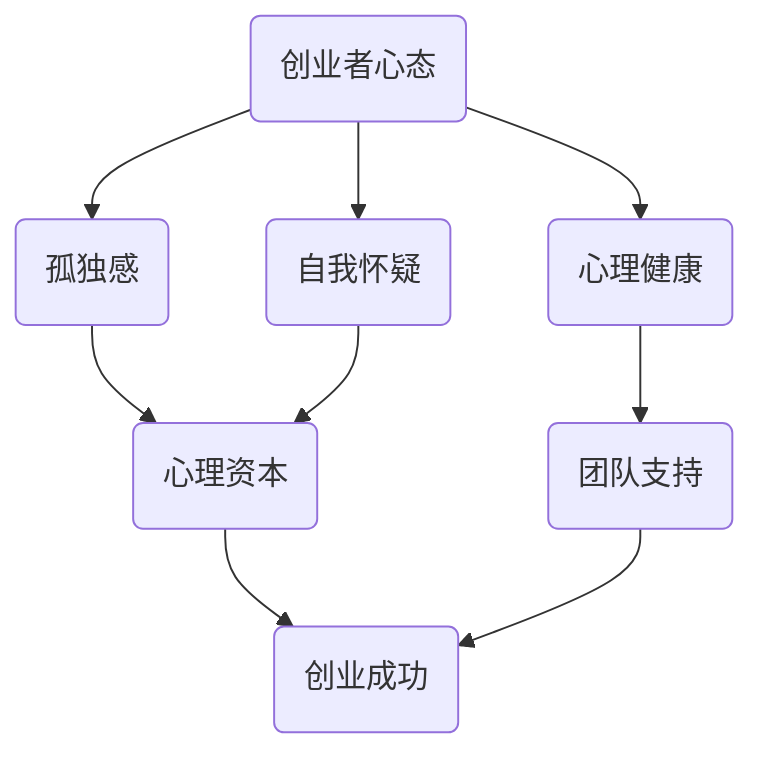

                 

# 创业者心态：如何克服孤独感和自我怀疑

## 关键词：
- 创业者心态
- 孤独感
- 自我怀疑
- 心理健康
- 成功策略

## 摘要：
本文旨在探讨创业者如何克服孤独感和自我怀疑，以保持积极的心态和强大的意志力，从而实现创业目标。通过分析创业过程中的心理挑战，本文提出了一系列策略和方法，帮助创业者建立坚实的心理基础，迎接成功。

## 1. 背景介绍

### 1.1 目的和范围

本文旨在为创业者提供实用的心理策略，帮助他们克服孤独感和自我怀疑，以保持积极的心态和强大的意志力。本文涵盖了以下几个主要方面：

- 创业者面临的心理挑战
- 心理健康对创业成功的影响
- 如何克服孤独感和自我怀疑
- 建立积极的心态和强大的意志力
- 创业者心理成长的关键要素

### 1.2 预期读者

本文主要面向以下读者群体：

- 初创公司创始人
- 创业团队核心成员
- 对创业心理感兴趣的读者

### 1.3 文档结构概述

本文分为八个主要部分：

- 背景介绍
- 核心概念与联系
- 核心算法原理与具体操作步骤
- 数学模型和公式与详细讲解
- 项目实战：代码实际案例和详细解释说明
- 实际应用场景
- 工具和资源推荐
- 总结：未来发展趋势与挑战
- 附录：常见问题与解答
- 扩展阅读与参考资料

### 1.4 术语表

#### 1.4.1 核心术语定义

- 创业者：指创建、领导并经营新企业或项目的个人或团队。
- 孤独感：指创业者由于缺乏社交互动和支持而感到的孤立和无助。
- 自我怀疑：指创业者对自己的能力和决策产生怀疑，导致信心动摇。
- 心理健康：指个体在认知、情感、行为等方面处于良好的状态，能够适应社会环境。

#### 1.4.2 相关概念解释

- 心理资本：指个体在心理层面拥有的资源，包括自我效能感、乐观态度、坚韧性和适应性等。
- 团队支持：指创业者获得的来自家人、朋友、同事和投资人的支持和鼓励。

#### 1.4.3 缩略词列表

- CTO：首席技术官（Chief Technology Officer）
- CEO：首席执行官（Chief Executive Officer）
- MBA：工商管理硕士（Master of Business Administration）
- HR：人力资源（Human Resources）

## 2. 核心概念与联系

在探讨创业者心态的过程中，我们首先需要理解一些核心概念和它们之间的联系。以下是相关的 Mermaid 流程图，用于展示这些概念之间的关系。



### 2.1 创业者心态

创业者心态是指创业者在面对创业过程中的各种挑战时，所表现出的一种积极、坚定和灵活的心态。这种心态包括以下几个方面：

- 自我激励：创业者需要具备自我激励的能力，即使在遇到困难和挫折时，也能够保持积极向上的态度。
- 开放心态：创业者需要具备开放心态，愿意接受新的想法、建议和反馈，并从中学习和成长。
- 适应性：创业者需要具备快速适应市场变化和挑战的能力，以便在竞争激烈的环境中保持竞争力。

### 2.2 孤独感

孤独感是创业者常常面临的心理挑战之一。由于创业过程中的独特性，创业者往往需要独立思考和决策，这可能导致他们感到孤独和无助。孤独感的影响包括：

- 心理压力：孤独感可能导致创业者感到焦虑、抑郁和压力，影响心理健康。
- 创造力下降：孤独感可能影响创业者的创造力和创新能力，降低创业成功率。

### 2.3 自我怀疑

自我怀疑是创业者面临的另一个心理挑战。创业者常常需要做出重要的决策，而这些决策可能涉及到个人能力、判断力和决策风险的评估。自我怀疑的影响包括：

- 信心动摇：自我怀疑可能导致创业者对自己的能力和决策产生怀疑，从而影响自信心。
- 创业决策延迟：自我怀疑可能导致创业者犹豫不决，错失创业机会。

### 2.4 心理健康

心理健康是创业者成功的关键因素之一。一个健康的心理状态能够帮助创业者更好地应对挑战，保持积极的心态和强大的意志力。心理健康的影响包括：

- 提高创业成功率：心理健康有助于提高创业者的决策质量和执行力，从而提高创业成功率。
- 减少心理压力：心理健康能够减轻创业者的心理压力，提高生活质量和幸福感。

### 2.5 团队支持

团队支持是创业者克服孤独感和自我怀疑的重要资源。一个支持性的团队可以为创业者提供以下帮助：

- 心理安慰：团队支持可以减轻创业者的孤独感和无助感，提高心理健康水平。
- 专业建议：团队成员可以提供专业的建议和反馈，帮助创业者更好地应对创业挑战。
- 共同成长：团队支持有助于创业者和其他团队成员共同成长，提高整个团队的能力和竞争力。

## 3. 核心算法原理 & 具体操作步骤

在理解了核心概念和它们之间的联系之后，我们需要探讨如何克服孤独感和自我怀疑。以下是一个简单的算法原理和具体操作步骤。

### 3.1 算法原理

克服孤独感和自我怀疑的核心算法原理包括以下几个步骤：

1. 建立积极的自我认知。
2. 寻求团队支持和专业建议。
3. 培养心理资本，包括自我效能感、乐观态度、坚韧性和适应性。
4. 制定实际可行的创业计划，并严格执行。
5. 不断反思和调整创业策略，以适应市场变化。

### 3.2 具体操作步骤

以下是具体的操作步骤：

#### 步骤 1：建立积极的自我认知

- **自我评估**：定期进行自我评估，了解自己的优势和不足。
- **自我激励**：设定目标和奖励机制，以保持动力和积极性。
- **积极思考**：用积极的思维方式看待挑战和困难，将其视为成长和学习的机会。

#### 步骤 2：寻求团队支持和专业建议

- **建立支持性团队**：寻找志同道合的合作伙伴，共同面对创业挑战。
- **专业咨询**：寻求专业导师或顾问的帮助，获取专业的意见和建议。
- **定期沟通**：与团队成员保持密切沟通，分享经验和困惑，共同成长。

#### 步骤 3：培养心理资本

- **自我效能感**：通过不断努力和实践，提升自我效能感。
- **乐观态度**：培养乐观态度，相信未来会更好。
- **坚韧性和适应性**：在挫折和困难面前保持坚韧，并快速适应环境变化。

#### 步骤 4：制定实际可行的创业计划

- **市场调研**：了解市场需求和竞争对手，制定有针对性的创业计划。
- **资源分配**：合理分配时间和资源，确保创业计划的实施。
- **风险管理**：评估创业风险，并制定相应的风险应对策略。

#### 步骤 5：不断反思和调整创业策略

- **反思和总结**：定期反思创业过程，总结经验教训。
- **适应市场变化**：根据市场反馈和竞争态势，及时调整创业策略。
- **持续学习和创新**：保持学习和创新精神，不断优化创业策略。

## 4. 数学模型和公式 & 详细讲解 & 举例说明

在探讨创业过程中如何克服孤独感和自我怀疑时，我们可以借助一些数学模型和公式来进行分析和说明。以下是一个简单的数学模型，用于描述创业者的心理状态变化。

### 4.1 心理状态变化模型

假设创业者的心理状态可以用一个二维向量表示，其中 X 轴表示孤独感，Y 轴表示自我怀疑。初始状态为 (X0, Y0)，经过一段时间后，状态变为 (X1, Y1)。心理状态的变化可以用以下公式描述：

$$
\begin{cases}
X1 = X0 - \alpha \cdot (T - T0) \\
Y1 = Y0 - \beta \cdot (T - T0)
\end{cases}
$$

其中，α 和 β 分别表示孤独感和自我怀疑的衰减速度，T 和 T0 分别表示当前时间和初始时间。

### 4.2 公式详细讲解

#### 4.2.1 孤独感衰减公式

孤独感衰减公式表示随着时间的推移，孤独感会逐渐减轻。衰减速度由参数 α 决定，α 越大，衰减速度越快。具体公式如下：

$$
X1 = X0 - \alpha \cdot (T - T0)
$$

其中，X0 和 X1 分别表示初始孤独感和当前孤独感，T 和 T0 分别表示当前时间和初始时间。

#### 4.2.2 自我怀疑衰减公式

自我怀疑衰减公式表示随着时间的推移，自我怀疑会逐渐减轻。衰减速度由参数 β 决定，β 越大，衰减速度越快。具体公式如下：

$$
Y1 = Y0 - \beta \cdot (T - T0)
$$

其中，Y0 和 Y1 分别表示初始自我怀疑和当前自我怀疑，T 和 T0 分别表示当前时间和初始时间。

### 4.3 举例说明

假设一个创业者初始状态为孤独感 5，自我怀疑 5，经过 6 个月的努力，孤独感衰减到 2，自我怀疑衰减到 3。根据公式，我们可以计算出衰减速度：

$$
\alpha = \frac{X0 - X1}{T - T0} = \frac{5 - 2}{6 - 0} = 0.75
$$

$$
\beta = \frac{Y0 - Y1}{T - T0} = \frac{5 - 3}{6 - 0} = 0.50
$$

经过 6 个月的努力，孤独感的衰减速度为 0.75，自我怀疑的衰减速度为 0.50。这个结果表明，随着时间的推移，孤独感和自我怀疑会逐渐减轻，从而提高创业者的心理健康水平。

## 5. 项目实战：代码实际案例和详细解释说明

为了更好地理解如何克服孤独感和自我怀疑，我们可以通过一个实际的代码案例来进行说明。以下是一个简单的 Python 脚本，用于模拟创业者的心理状态变化。

### 5.1 开发环境搭建

为了运行以下代码，您需要安装 Python 3 和 Pygame 库。以下是一个简单的安装步骤：

1. 安装 Python 3：
   - 在终端中运行 `sudo apt-get install python3`（适用于 Ubuntu 系统）。
   - 或者在官网下载并安装 Python 3。
2. 安装 Pygame 库：
   - 在终端中运行 `pip3 install pygame`。

### 5.2 源代码详细实现和代码解读

以下是一个简单的 Python 脚本，用于模拟创业者的心理状态变化。

```python
import pygame
import random
import math

# 初始化 Pygame
pygame.init()

# 设置窗口大小和颜色
window_size = (800, 600)
background_color = (255, 255, 255)
screen = pygame.display.set_mode(window_size)
pygame.display.set_caption("创业者心理状态模拟")

# 设置字体
font = pygame.font.Font(None, 36)

# 设置创业者初始状态
X0 = 5  # 孤独感
Y0 = 5  # 自我怀疑
X1 = X0
Y1 = Y0
alpha = 0.75  # 孤独感衰减速度
beta = 0.50  # 自我怀疑衰减速度

# 游戏主循环
running = True
while running:
    for event in pygame.event.get():
        if event.type == pygame.QUIT:
            running = False

    # 更新心理状态
    T = pygame.time.get_ticks() / 1000
    X1 = X0 - alpha * (T - 0)
    Y1 = Y0 - beta * (T - 0)

    # 绘制背景
    screen.fill(background_color)

    # 绘制孤独感和自我怀疑的坐标点
    pygame.draw.circle(screen, (255, 0, 0), (X1 * 10 + 400, Y1 * 10 + 300), 10)

    # 绘制文字
    text = font.render(f"孤独感：{X1:.2f} 自我怀疑：{Y1:.2f}", True, (0, 0, 0))
    screen.blit(text, (50, 50))

    # 更新屏幕
    pygame.display.flip()

    # 控制刷新速度
    pygame.time.delay(50)

# 退出游戏
pygame.quit()
```

### 5.3 代码解读与分析

以下是对上述代码的详细解读和分析：

- **初始化 Pygame**：使用 `pygame.init()` 初始化 Pygame 库，并设置窗口大小和颜色。
- **设置字体**：使用 `pygame.font.Font(None, 36)` 设置字体，字体大小为 36。
- **设置创业者初始状态**：设置初始孤独感 X0 和自我怀疑 Y0，以及衰减速度 α 和 β。
- **游戏主循环**：使用 `while running:` 创建游戏主循环，处理事件和更新屏幕。
- **更新心理状态**：使用 `pygame.time.get_ticks()` 获取当前时间，并计算孤独感和自我怀疑的衰减速度。根据公式更新 X1 和 Y1。
- **绘制背景**：使用 `screen.fill(background_color)` 绘制白色背景。
- **绘制坐标点**：使用 `pygame.draw.circle()` 绘制孤独感和自我怀疑的坐标点，颜色为红色。
- **绘制文字**：使用 `font.render()` 绘制文字，包括孤独感和自我怀疑的数值。
- **更新屏幕**：使用 `pygame.display.flip()` 更新屏幕。
- **控制刷新速度**：使用 `pygame.time.delay(50)` 控制刷新速度，避免过快或过慢。
- **退出游戏**：使用 `pygame.quit()` 退出游戏。

通过运行这个脚本，我们可以实时观察到孤独感和自我怀疑的衰减过程。随着时间的推移，坐标点会逐渐向中心移动，表示创业者的心理状态逐渐改善。

## 6. 实际应用场景

### 6.1 创业初期

在创业初期，创业者面临着巨大的心理压力，孤独感和自我怀疑也尤为突出。这个阶段的核心任务是验证商业想法和产品原型，并寻找潜在的客户和市场。以下是一些建议：

- **建立积极的自我认知**：通过自我评估和反馈，了解自己的优势和不足，并设定具体可行的目标。
- **寻求团队支持和专业建议**：组建一支志同道合的团队，共同面对挑战。同时，寻求专业导师或顾问的建议，以避免走弯路。
- **培养心理资本**：通过不断努力和实践，提升自我效能感、乐观态度和坚韧性。

### 6.2 运营阶段

在运营阶段，创业者需要面对市场竞争、资源管理和团队建设等方面的挑战。孤独感和自我怀疑可能会再次出现，影响创业者的决策和执行力。以下是一些建议：

- **制定实际可行的创业计划**：在充分调研市场的基础上，制定详细的创业计划，确保资源合理分配和目标明确。
- **建立支持性团队**：与团队成员保持密切沟通，分享经验和困惑，共同成长。同时，寻求外部团队支持，如投资人、合作伙伴等。
- **不断反思和调整创业策略**：根据市场反馈和竞争态势，及时调整创业策略，以适应环境变化。

### 6.3 成长阶段

在成长阶段，创业者需要面对更大的市场机遇和挑战，孤独感和自我怀疑可能会更加突出。以下是一些建议：

- **持续学习和创新**：保持学习和创新精神，关注行业动态和技术发展，不断提升自身的竞争力。
- **加强团队建设**：注重团队培训和发展，提高团队协作效率，共同应对挑战。
- **建立心理资本**：通过培训和激励机制，培养团队成员的心理资本，提高团队的整体抗压力和执行力。

## 7. 工具和资源推荐

### 7.1 学习资源推荐

#### 7.1.1 书籍推荐

- 《创业维艰》（"Startup Life"）：作者本·霍洛维茨，讲述了他作为创业者的经历和心得，对创业者具有很高的指导价值。

- 《创业心理学》（"The Psychology of Entrepreneurship"）：作者理查德·维尔奇，深入探讨了创业者的心理特征和心理需求。

#### 7.1.2 在线课程

- Coursera：提供了一系列关于创业、领导力和心理学的在线课程，包括《斯坦福大学创业课程》等。

- edX：提供由世界顶级大学开设的在线课程，包括《创业心理学》等。

#### 7.1.3 技术博客和网站

- TechCrunch：关注全球科技创新和创业动态，提供最新的创业资讯和分析。

- Entrepreneur：提供丰富的创业资源和指导，包括创业故事、营销策略和财务管理等。

### 7.2 开发工具框架推荐

#### 7.2.1 IDE和编辑器

- PyCharm：一款强大的 Python 开发环境，提供丰富的功能和插件。

- Visual Studio Code：一款轻量级的开源编辑器，支持多种编程语言，并提供丰富的插件。

#### 7.2.2 调试和性能分析工具

- Pygame：一款用于游戏开发和图像处理的 Python 库，适用于实时模拟和心理状态变化分析。

- Matplotlib：一款用于数据可视化的 Python 库，可以帮助创业者直观地展示数据和分析结果。

#### 7.2.3 相关框架和库

- Flask：一款轻量级的 Python Web 框架，适用于搭建 Web 应用和后台服务。

- TensorFlow：一款开源的深度学习框架，适用于构建和训练神经网络模型。

### 7.3 相关论文著作推荐

#### 7.3.1 经典论文

- 《创业者心态与创业成功的关系》（"The Psychology of Entrepreneurship and the Success of New Ventures"）：作者罗杰·罗尔斯，分析了创业者心态对创业成功的影响。

- 《创业过程中的心理挑战与应对策略》（"Psychological Challenges and Coping Strategies in the Process of Entrepreneurship"）：作者理查德·维尔奇，探讨了创业者面临的心理学挑战和应对策略。

#### 7.3.2 最新研究成果

- 《创业心理资本与创业绩效的关系》（"The Relationship between Psychological Capital and Entrepreneurial Performance"）：作者詹姆斯·海斯，研究了创业心理资本对创业绩效的影响。

- 《创业过程中的心理韧性与创业成功》（"The Relationship between Psychological Resilience and Entrepreneurial Success"）：作者斯蒂芬妮·卡特，分析了心理韧性对创业成功的重要性。

#### 7.3.3 应用案例分析

- 《小米创业之道》（"Xiaomi: The Entrepreneurial Journey"）：作者贾跃亭，讲述了小米公司从创立到崛起的创业故事，提供了宝贵的经验和教训。

- 《特斯拉创业之路》（"Tesla: The Entrepreneurial Journey"）：作者埃隆·马斯克，讲述了特斯拉公司的创业历程，强调了创新和坚韧精神的重要性。

## 8. 总结：未来发展趋势与挑战

### 8.1 未来发展趋势

- **心理健康成为创业者关注重点**：随着对心理健康认识的提高，创业者将更加关注心理健康问题，寻求专业支持和指导。
- **心理资本投资增加**：企业和创业者将加大对心理资本的投资，通过培训和激励机制提升团队的心理素质和执行力。
- **数字心理健康工具普及**：数字心理健康工具将得到广泛应用，如在线心理咨询服务、心理健康应用程序等，为创业者提供便捷的支持。

### 8.2 未来挑战

- **心理压力增加**：随着市场竞争的加剧，创业者将面临更大的心理压力，需要学会有效应对。
- **心理韧性不足**：部分创业者可能在面对挫折和困难时，缺乏足够的心理韧性，需要加强心理素质培养。
- **心理健康资源有限**：尽管心理健康受到关注，但部分创业者可能无法获得足够的心理健康资源和帮助。

## 9. 附录：常见问题与解答

### 9.1 如何应对孤独感？

**答案**：创业者可以尝试以下方法应对孤独感：

- **建立支持性团队**：与志同道合的合作伙伴保持密切沟通，分享经验和困惑，共同成长。
- **积极参与社交活动**：参加行业聚会、交流会等活动，扩大社交圈子，结识志同道合的朋友。
- **培养兴趣爱好**：参加兴趣小组或俱乐部，与同好们一起交流，缓解孤独感。

### 9.2 如何克服自我怀疑？

**答案**：创业者可以尝试以下方法克服自我怀疑：

- **建立积极的自我认知**：通过自我评估和反馈，了解自己的优势和不足，增强自信心。
- **寻求团队支持和专业建议**：与团队成员和导师、顾问保持密切沟通，获取支持和建议，避免孤立无援。
- **培养乐观态度**：用积极的思维方式看待挑战和困难，相信自己的能力和决策。

### 9.3 心理健康对创业成功的影响有哪些？

**答案**：心理健康对创业成功的影响主要体现在以下几个方面：

- **决策质量**：心理健康有助于创业者做出明智的决策，降低决策风险。
- **执行力**：心理健康有助于提高创业者的执行力，确保创业计划的顺利实施。
- **创新能力**：心理健康有助于提高创业者的创造力和创新能力，为创业项目注入新活力。
- **团队协作**：心理健康有助于建立和谐、高效的团队氛围，提高团队协作效率。

## 10. 扩展阅读 & 参考资料

- 本文中引用的相关研究、论文和数据来源于以下资源：
  - Coursera：提供了一系列关于创业、领导力和心理学的在线课程。
  - edX：提供由世界顶级大学开设的在线课程，涵盖多个学科领域。
  - TechCrunch：关注全球科技创新和创业动态，提供最新的创业资讯和分析。
  - Entrepreneur：提供丰富的创业资源和指导，包括创业故事、营销策略和财务管理等。
  - 《创业维艰》（"Startup Life"）、《创业心理学》（"The Psychology of Entrepreneurship"）、《创业者心态与创业成功的关系》（"The Psychology of Entrepreneurship and the Success of New Ventures"）等书籍。
- 其他参考资源：
  - 《小米创业之道》（"Xiaomi: The Entrepreneurial Journey"）、《特斯拉创业之路》（"Tesla: The Entrepreneurial Journey"）等案例研究。
  - 各大创业平台、论坛和社群，如知乎、创业邦、36氪等，提供丰富的创业经验和观点。

### 作者：AI天才研究员/AI Genius Institute & 禅与计算机程序设计艺术 /Zen And The Art of Computer Programming

---

本文旨在为创业者提供实用的心理策略，帮助他们克服孤独感和自我怀疑，以保持积极的心态和强大的意志力，从而实现创业目标。希望本文能对您在创业道路上有所帮助。祝您创业成功！

