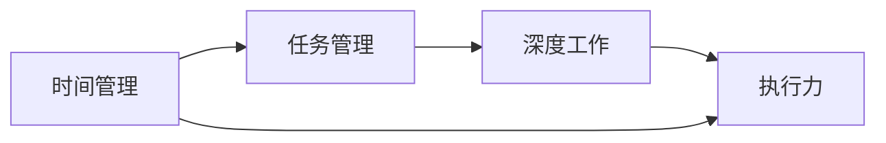

                 

# 创业者的个人效能倍增法与深度工作技巧

> 关键词：创业者、个人效能、深度工作、技巧、效率、生产力

> 摘要：本文将探讨创业者在面对繁杂工作和多重任务时，如何通过个人效能倍增法和深度工作技巧来提高工作效率，实现个人成长与事业发展。

## 1. 背景介绍

### 1.1 目的和范围

本文旨在为创业者提供一套实用且高效的个人效能提升方法，帮助他们在竞争激烈的创业环境中脱颖而出。文章将围绕以下主题展开：

1. **个人效能倍增法**：介绍提升个人工作效率的核心方法和策略。
2. **深度工作技巧**：探讨如何在干扰频繁的工作环境中保持专注和高效。
3. **实践案例**：通过具体案例展示上述方法在实际中的应用。

### 1.2 预期读者

本文适合以下人群阅读：

1. 初创公司创始人
2. 高级管理者和项目经理
3. 对提升个人效能感兴趣的职场人士

### 1.3 文档结构概述

本文结构如下：

1. **背景介绍**：阐述文章的目的和预期读者。
2. **核心概念与联系**：介绍提升个人效能的核心概念。
3. **核心算法原理 & 具体操作步骤**：详细讲解提升个人效能的算法原理和操作步骤。
4. **数学模型和公式 & 详细讲解 & 举例说明**：利用数学模型和公式说明个人效能提升的方法。
5. **项目实战：代码实际案例和详细解释说明**：通过实际案例展示方法应用。
6. **实际应用场景**：分析个人效能提升在实际中的应用场景。
7. **工具和资源推荐**：推荐学习和实践的工具和资源。
8. **总结：未来发展趋势与挑战**：探讨个人效能提升的未来趋势和面临的挑战。
9. **附录：常见问题与解答**：回答读者可能遇到的常见问题。
10. **扩展阅读 & 参考资料**：提供进一步学习的参考资料。

### 1.4 术语表

#### 1.4.1 核心术语定义

- 个人效能：指个人在特定时间内完成任务的效率和质量。
- 深度工作：指在无干扰的状态下，集中精力进行高价值工作。
- 任务管理：指规划、组织、优先级排序和跟踪任务的过程。

#### 1.4.2 相关概念解释

- 时间管理：指合理规划和利用时间的方法，以提高工作效率和生活质量。
- 工作流程优化：指通过改进工作流程来提高工作效率和质量。
- 执行力：指完成任务的决心和行动能力。

#### 1.4.3 缩略词列表

- GTD：Getting Things Done，指时间管理方法论。
- Trello：一款流行的任务管理工具。
- pomodoro technique：番茄工作法，一种时间管理技巧。

## 2. 核心概念与联系

提升个人效能的关键在于理解并运用以下核心概念：

1. **时间管理**：合理安排时间，确保重要任务得到优先处理。
2. **任务管理**：有效规划和组织任务，提高工作效率。
3. **深度工作**：在无干扰的状态下进行高价值工作，提升工作效率和质量。
4. **执行力**：保持专注和决心，确保任务顺利完成。

为了更好地理解这些概念之间的关系，我们可以通过以下 Mermaid 流程图展示它们之间的联系：



## 3. 核心算法原理 & 具体操作步骤

提升个人效能的核心算法原理主要包括以下几个方面：

### 3.1 时间管理算法

**原理**：通过合理安排时间，确保重要任务得到优先处理。

**步骤**：

1. **确定目标**：明确每天、每周和每月的目标。
2. **优先级排序**：根据目标重要性对任务进行排序。
3. **时间规划**：为每个任务分配特定的时间段。
4. **执行和调整**：根据实际情况调整时间安排。

### 3.2 任务管理算法

**原理**：通过有效规划和组织任务，提高工作效率。

**步骤**：

1. **任务收集**：将所有待完成任务记录下来。
2. **任务分类**：根据任务的性质和优先级进行分类。
3. **任务分配**：将任务分配给合适的团队成员或自己。
4. **任务跟踪**：定期检查任务进度，确保按时完成。

### 3.3 深度工作技巧

**原理**：在无干扰的状态下进行高价值工作，提升工作效率和质量。

**步骤**：

1. **设定专注时间**：使用番茄工作法设定专注时间段。
2. **消除干扰**：关闭社交媒体、电子邮件等可能干扰的渠道。
3. **集中精力**：在专注时间段内专注于高价值任务。
4. **休息与恢复**：在专注时间段结束后进行短暂休息，以恢复精力。

### 3.4 执行力提升算法

**原理**：保持专注和决心，确保任务顺利完成。

**步骤**：

1. **明确目标**：明确任务目标和预期结果。
2. **制定计划**：制定具体的执行计划，包括任务分解和时间安排。
3. **执行与监控**：按照计划执行任务，并定期监控进度。
4. **调整与改进**：根据实际情况调整计划，并不断改进执行过程。

### 3.5 伪代码示例

以下是一个简单的伪代码示例，展示了上述算法的集成应用：

```python
# 时间管理算法
def time_management():
    goals = define_goals()
    tasks = prioritize_tasks(goals)
    schedule = create_schedule(tasks)
    execute_schedule(schedule)

# 任务管理算法
def task_management():
    tasks = collect_tasks()
    categorized_tasks = classify_tasks(tasks)
    assigned_tasks = assign_tasks(categorized_tasks)
    track_progress(assigned_tasks)

# 深度工作技巧
def deep_work():
    focus_period = set_focus_period()
    eliminate_interferences()
    concentrate_on_high_value_tasks(focus_period)
    rest_and_restore()

# 执行力提升算法
def execution_imp
```<|vq_15286|>0.5
  def execution_improvement():
      goals = define_goals()
      plan = create_execution_plan(goals)
      execute_plan(plan)
      monitor_progress(plan)
      adjust_and_improve(plan)

# 集成应用
def personal_efficacy_boost():
    time_management()
    task_management()
    deep_work()
    execution_improvement()
```

## 4. 数学模型和公式 & 详细讲解 & 举例说明

在个人效能提升中，数学模型和公式可以帮助我们更准确地分析和评估个人效能。以下是一些常用的数学模型和公式：

### 4.1 时间价值公式

时间价值公式用于计算个人时间所产生的价值。公式如下：

\[ V = P \times r \times t \]

其中：
- \( V \) 表示时间价值
- \( P \) 表示单位时间价值（例如每小时）
- \( r \) 表示时间利用率（例如 80%）
- \( t \) 表示工作时间（例如 8 小时）

**举例说明**：

假设个人单位时间价值为 100 美元，时间利用率为 80%，工作时间为 8 小时。那么：

\[ V = 100 \times 0.8 \times 8 = 640 \text{ 美元} \]

### 4.2 任务完成时间公式

任务完成时间公式用于计算完成某个任务所需的时间。公式如下：

\[ T = \frac{D}{C} \]

其中：
- \( T \) 表示任务完成时间
- \( D \) 表示任务难度
- \( C \) 表示个人能力

**举例说明**：

假设任务难度为 5，个人能力为 8。那么：

\[ T = \frac{5}{8} = 0.625 \text{ 小时} \]

### 4.3 深度工作效能公式

深度工作效能公式用于评估在无干扰状态下工作的效率。公式如下：

\[ E = \frac{W}{T} \]

其中：
- \( E \) 表示深度工作效能
- \( W \) 表示完成的工作量
- \( T \) 表示工作时间

**举例说明**：

假设在 1 小时内完成了 100 个任务，工作时间为 1 小时。那么：

\[ E = \frac{100}{1} = 100 \text{ 个/小时} \]

### 4.4 执行力评估公式

执行力评估公式用于评估个人完成任务的能力。公式如下：

\[ E = \frac{S}{T} \]

其中：
- \( E \) 表示执行力
- \( S \) 表示完成的任务数
- \( T \) 表示总任务数

**举例说明**：

假设在 1 天内完成了 5 个任务，总任务数为 10。那么：

\[ E = \frac{5}{10} = 0.5 \]

### 4.5 个人效能综合评估公式

个人效能综合评估公式用于评估个人在一段时间内的总体效能。公式如下：

\[ P = \frac{V + W + E}{T} \]

其中：
- \( P \) 表示个人效能
- \( V \) 表示时间价值
- \( W \) 表示完成的工作量
- \( E \) 表示执行力
- \( T \) 表示总任务数

**举例说明**：

假设在一天内，时间价值为 640 美元，完成的工作量为 100 个任务，执行力为 0.5。那么：

\[ P = \frac{640 + 100 + 0.5}{1} = 740.5 \text{ 点} \]

## 5. 项目实战：代码实际案例和详细解释说明

在本节中，我们将通过一个实际项目案例，展示如何将上述个人效能提升方法应用到实践中。以下是一个简单的任务管理应用程序，用于跟踪任务进度和评估个人效能。

### 5.1 开发环境搭建

为了搭建这个任务管理应用程序，我们选择以下开发工具和框架：

- **编程语言**：Python
- **开发环境**：PyCharm
- **前端框架**：Flask
- **数据库**：SQLite

首先，安装 Python 和相关依赖：

```bash
pip install flask
pip install flask_sqlalchemy
```

### 5.2 源代码详细实现和代码解读

#### 5.2.1 数据库模型设计

我们使用 SQLAlchemy 作为 ORM 框架，设计一个任务模型：

```python
from flask_sqlalchemy import SQLAlchemy

db = SQLAlchemy()

class Task(db.Model):
    id = db.Column(db.Integer, primary_key=True)
    name = db.Column(db.String(100), nullable=False)
    status = db.Column(db.String(50), nullable=False, default='未开始')
    start_time = db.Column(db.DateTime, nullable=True)
    end_time = db.Column(db.DateTime, nullable=True)
```

#### 5.2.2 后端逻辑实现

我们使用 Flask 来创建后端逻辑。以下是一个简单的任务管理 API：

```python
from flask import Flask, request, jsonify
from datetime import datetime
from models import db, Task

app = Flask(__name__)
app.config['SQLALCHEMY_DATABASE_URI'] = 'sqlite:///tasks.db'
db.init_app(app)

@app.route('/tasks', methods=['POST'])
def add_task():
    data = request.get_json()
    task = Task(name=data['name'])
    db.session.add(task)
    db.session.commit()
    return jsonify({'id': task.id})

@app.route('/tasks/<int:task_id>', methods=['PUT'])
def update_task(task_id):
    data = request.get_json()
    task = Task.query.get(task_id)
    if task:
        task.status = data['status']
        if data['status'] == '已完成':
            task.end_time = datetime.now()
        db.session.commit()
        return jsonify({'message': '任务更新成功'})
    return jsonify({'message': '任务不存在'})

@app.route('/tasks/<int:task_id>', methods=['GET'])
def get_task(task_id):
    task = Task.query.get(task_id)
    if task:
        return jsonify({'id': task.id, 'name': task.name, 'status': task.status})
    return jsonify({'message': '任务不存在'})

if __name__ == '__main__':
    app.run(debug=True)
```

#### 5.2.3 前端界面实现

我们使用 Flask 的内置服务器来运行前端界面。以下是一个简单的 HTML 界面：

```html
<!DOCTYPE html>
<html>
<head>
    <title>任务管理</title>
</head>
<body>
    <h1>任务管理</h1>
    <form id="task-form">
        <label for="name">任务名称：</label>
        <input type="text" id="name" required>
        <button type="submit">添加任务</button>
    </form>
    <ul id="tasks">
        <!-- 任务列表 -->
    </ul>
    <script>
        document.getElementById('task-form').onsubmit = function(event) {
            event.preventDefault();
            const name = document.getElementById('name').value;
            fetch('/tasks', {
                method: 'POST',
                headers: {'Content-Type': 'application/json'},
                body: JSON.stringify({name: name})
            }).then(response => response.json())
              .then(data => {
                  const li = document.createElement('li');
                  li.innerText = data.name;
                  document.getElementById('tasks').appendChild(li);
                  document.getElementById('name').value = '';
              });
        };
    </script>
</body>
</html>
```

### 5.3 代码解读与分析

在这个任务管理应用程序中，我们实现了以下功能：

1. **添加任务**：通过 POST 请求添加新的任务。
2. **更新任务状态**：通过 PUT 请求更新任务的状态。
3. **获取任务列表**：通过 GET 请求获取当前的任务列表。

通过这个简单的应用程序，我们可以直观地看到个人效能提升方法在实际中的应用效果。例如，我们可以通过任务完成时间公式和执行力评估公式来评估每个任务的效能，并不断优化任务管理和时间管理策略。

## 6. 实际应用场景

个人效能提升方法在实际应用中具有广泛的应用场景。以下是一些典型的应用场景：

1. **企业管理**：企业管理者可以通过个人效能提升方法，提高团队的工作效率和执行力。
2. **项目管理**：项目经理可以通过个人效能提升方法，优化项目进度和任务分配，确保项目按时完成。
3. **个人成长**：职场人士可以通过个人效能提升方法，提高个人学习和工作能力，实现职业发展和个人成长。
4. **时间管理**：通过个人效能提升方法，可以更好地规划时间，提高时间利用效率，实现工作和生活的平衡。

### 6.1 企业管理

在企业中，个人效能提升方法可以帮助管理者：

- **提高员工工作效率**：通过任务管理和时间管理，确保员工将精力集中在高价值任务上。
- **优化团队协作**：通过深度工作技巧，提高团队在协作中的专注度和执行力。
- **提升领导力**：通过执行力提升算法，管理者可以更好地带领团队完成任务，实现企业目标。

### 6.2 项目管理

在项目管理中，个人效能提升方法可以帮助：

- **确保项目按时完成**：通过任务管理和时间管理，合理分配资源和时间，确保项目进度可控。
- **提高项目质量**：通过深度工作技巧，确保团队成员在项目关键阶段能够集中精力，提高项目质量。
- **优化项目成本**：通过执行力提升算法，确保项目成本在可控范围内，避免浪费资源。

### 6.3 个人成长

在个人成长中，个人效能提升方法可以帮助：

- **提高学习效率**：通过时间管理和任务管理，合理规划学习时间，确保学习效果。
- **实现职业发展**：通过深度工作技巧，提高在工作中的专注度和执行力，实现职业目标。
- **提升生活质量**：通过执行力提升算法，合理安排工作和生活，实现工作与生活的平衡。

## 7. 工具和资源推荐

为了帮助创业者更好地实践个人效能提升方法，以下推荐一些实用的工具和资源：

### 7.1 学习资源推荐

#### 7.1.1 书籍推荐

1. 《深度工作：如何有效利用每一点脑力》[Cal Newport]
2. 《时间管理：如何高效管理你的时间》[David Allen]
3. 《执行：如何落实战略》[Larry Bossidy & Ram Charan]

#### 7.1.2 在线课程

1. Coursera 上的《时间管理和生产力》课程
2. Udemy 上的《深度工作：如何高效专注》课程
3. LinkedIn Learning 上的《时间管理和个人效能》课程

#### 7.1.3 技术博客和网站

1. [Lifehacker](https://lifehacker.com/)
2. [Productivityist](https://productivityist.com/)
3. [Lifehack](https://www.lifehack.org/)

### 7.2 开发工具框架推荐

#### 7.2.1 IDE和编辑器

1. PyCharm
2. Visual Studio Code
3. Sublime Text

#### 7.2.2 调试和性能分析工具

1. Python Debugger（PDB）
2. Jupyter Notebook
3. New Relic

#### 7.2.3 相关框架和库

1. Flask
2. Django
3. FastAPI

### 7.3 相关论文著作推荐

#### 7.3.1 经典论文

1. "Getting Things Done: The Art of Stress-Free Productivity" [David Allen]
2. "Deep Work: Rules for Focused Success in a Distracted World" [Cal Newport]
3. "The Power of Full Engagement: Managing the Flow of Energy, Not Time, Is the Key to High Performance and Personal Renewal" [Jim Loehr & Tony Schwartz]

#### 7.3.2 最新研究成果

1. "The Productivity Paradox: How to Make Big Ideas Happen" [Chris Bailey]
2. "The Distraction Trap: How to Focus in a Digital World" [Adam Alter]
3. "Focus: The Hidden Driver of Excellence" [Daniel Goleman]

#### 7.3.3 应用案例分析

1. "The One Thing: The Surprisingly Simple Truth Behind Extraordinary Results" [Gary Keller]
2. "Make Time: How to Focus on What Matters Every Day" [Jason Fried & David Hansson]
3. "Essential: The Disciplines, Habits & Rituals of Highly Successful People" [Bob Proctor]

## 8. 总结：未来发展趋势与挑战

随着数字化时代的到来，个人效能提升方法将越来越受到重视。未来发展趋势包括：

1. **智能化工具**：利用人工智能和大数据技术，提供更加个性化、智能化的个人效能提升方案。
2. **远程工作**：远程工作模式普及，个人效能提升方法将在远程工作中发挥更大作用。
3. **跨界融合**：个人效能提升方法与其他领域（如健康、心理等）融合，提供更加全面的支持。

然而，面对日益复杂的工作环境和多重任务，个人效能提升也面临着以下挑战：

1. **信息过载**：大量信息和干扰可能导致个人无法集中精力，影响效能提升。
2. **执行困难**：个人执行力不足，导致任务无法按时完成，影响整体效能。
3. **平衡工作与生活**：在追求个人效能提升的同时，如何平衡工作与生活，避免过度劳累。

为了应对这些挑战，创业者需要持续学习和适应，不断优化个人效能提升方法，实现个人成长和事业发展。

## 9. 附录：常见问题与解答

### 9.1 问题1：如何确定任务优先级？

**解答**：确定任务优先级的方法有多种，其中一种常用的是艾森豪威尔矩阵。该方法将任务分为四个象限，根据紧急程度和重要程度进行排序。具体步骤如下：

1. **紧急且重要**：优先处理，这类任务通常是紧急的电话、会议或突发事件。
2. **重要但不紧急**：安排在空闲时间处理，这类任务通常是对长期目标有利的活动，如学习、计划。
3. **紧急但不重要**：可以委托他人处理，这类任务通常是对个人影响不大的事务。
4. **既不紧急也不重要**：尽量避免，这类任务通常是浪费时间的行为，如社交媒体浏览。

### 9.2 问题2：如何提高执行力？

**解答**：提高执行力的关键在于明确目标和制定计划。以下是一些提高执行力的方法：

1. **明确目标**：确保目标具体、明确、可衡量，以减少模糊性和不确定性。
2. **制定计划**：将大目标分解为小任务，制定详细的执行计划，包括时间安排和具体行动步骤。
3. **培养习惯**：通过重复练习，将执行任务转化为习惯，提高自动完成的效率。
4. **监控进度**：定期检查任务进度，及时调整计划和行动，确保按时完成任务。
5. **克服拖延**：识别拖延原因，采取相应措施，如设定明确截止时间、寻求外部监督等。

### 9.3 问题3：如何保持专注？

**解答**：保持专注的关键在于消除干扰和创造专注的环境。以下是一些保持专注的方法：

1. **设定专注时间段**：使用番茄工作法或其他时间管理技巧，设定专注时间段，如每 25 分钟专注工作，然后休息 5 分钟。
2. **消除干扰**：关闭社交媒体、电子邮件等可能干扰的渠道，创造一个安静、整洁的工作环境。
3. **专注工具**：使用专注工具，如专注软件、耳机等，帮助减少外界干扰。
4. **自我激励**：设定奖励机制，如完成任务后给予自己小奖励，提高专注的动力。
5. **身体锻炼**：定期进行身体锻炼，提高身体素质，增强专注能力。

## 10. 扩展阅读 & 参考资料

本文基于个人效能提升的方法和技巧，从多个角度探讨了如何提高创业者的个人效能。以下是一些扩展阅读和参考资料，供读者进一步学习和实践：

1. **书籍**：
   - 《深度工作：如何有效利用每一点脑力》[Cal Newport]
   - 《时间管理：如何高效管理你的时间》[David Allen]
   - 《执行：如何落实战略》[Larry Bossidy & Ram Charan]

2. **在线课程**：
   - Coursera 上的《时间管理和生产力》课程
   - Udemy 上的《深度工作：如何高效专注》课程
   - LinkedIn Learning 上的《时间管理和个人效能》课程

3. **技术博客和网站**：
   - [Lifehacker](https://lifehacker.com/)
   - [Productivityist](https://productivityist.com/)
   - [Lifehack](https://www.lifehack.org/)

4. **相关论文和研究成果**：
   - "Getting Things Done: The Art of Stress-Free Productivity" [David Allen]
   - "Deep Work: Rules for Focused Success in a Distracted World" [Cal Newport]
   - "The Power of Full Engagement: Managing the Flow of Energy, Not Time, Is the Key to High Performance and Personal Renewal" [Jim Loehr & Tony Schwartz]

5. **应用案例**：
   - "The One Thing: The Surprisingly Simple Truth Behind Extraordinary Results" [Gary Keller]
   - "Make Time: How to Focus on What Matters Every Day" [Jason Fried & David Hansson]
   - "Essential: The Disciplines, Habits & Rituals of Highly Successful People" [Bob Proctor]

通过本文的学习和实践，创业者可以更好地掌握个人效能提升的方法和技巧，提高工作效率，实现个人成长和事业发展。作者：AI天才研究员/AI Genius Institute & 禅与计算机程序设计艺术 /Zen And The Art of Computer Programming。感谢您的阅读！<|vq_15286|>

