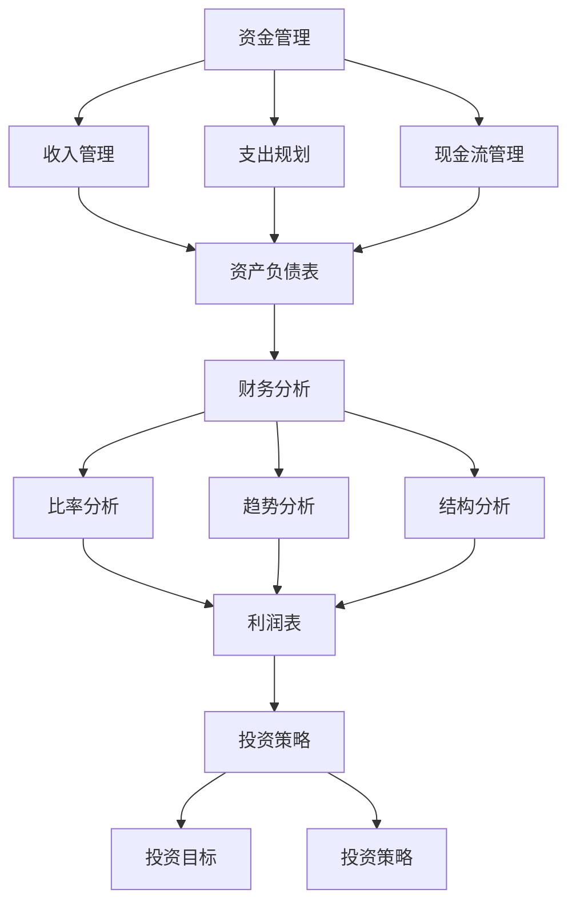

                 

# 创业者的个人财务规划与管理

## 关键词：个人财务规划、创业者、资金管理、财务分析、投资策略

> 摘要：本文章旨在为创业者提供一套全面且实用的个人财务规划与管理策略。文章首先介绍了个人财务规划的重要性，随后详细探讨了资金管理、财务分析、投资策略等核心环节。通过结合实际案例，文章揭示了如何在创业过程中实现个人财务的稳健增长，并指出了可能面临的挑战与应对策略。无论您是初出茅庐的创业新手，还是经验丰富的创业者，这篇文章都将为您在财务规划之路上提供宝贵的指导。

## 1. 背景介绍

### 1.1 目的和范围

创业者的成功不仅取决于商业模式的创新和市场的把握，更在于对个人财务的精准规划与管理。本篇文章的目的在于帮助创业者理解并掌握个人财务规划的重要性，提供一系列切实可行的管理策略，帮助他们在创业的道路上更加稳健地前行。

文章将涵盖以下内容：

- 个人财务规划的概念与意义
- 资金管理的方法与技巧
- 财务分析的核心指标与工具
- 投资策略的制定与执行
- 创业者面临的财务挑战及应对措施

### 1.2 预期读者

本文适合以下读者：

- 有志于创业的个人
- 已经创业的创业者
- 对个人财务管理有兴趣的投资者
- 需要提升财务规划能力的专业人士

### 1.3 文档结构概述

本文分为八个主要部分，具体结构如下：

- **1. 背景介绍**：介绍文章的目的、预期读者以及文档结构。
- **2. 核心概念与联系**：介绍个人财务规划中的核心概念与相互联系。
- **3. 核心算法原理 & 具体操作步骤**：讲解财务规划的具体操作步骤。
- **4. 数学模型和公式 & 详细讲解 & 举例说明**：阐述财务规划中的数学模型。
- **5. 项目实战：代码实际案例和详细解释说明**：提供实际案例说明。
- **6. 实际应用场景**：讨论财务规划在创业中的实际应用。
- **7. 工具和资源推荐**：推荐学习资源和开发工具。
- **8. 总结：未来发展趋势与挑战**：总结未来发展趋势与挑战。

### 1.4 术语表

#### 1.4.1 核心术语定义

- **个人财务规划**：指个人对收入、支出、资产和负债的管理。
- **现金流**：一定时间内流入和流出资金的总量。
- **预算**：对未来一定时期内的收入和支出做出详细规划。
- **投资策略**：针对个人财务目标制定的投资计划。

#### 1.4.2 相关概念解释

- **净资产**：个人资产减去负债的余额。
- **财务杠杆**：利用借款来增加投资回报的策略。

#### 1.4.3 缩略词列表

- **ROI**：投资回报率（Rate of Return on Investment）
- **IRR**：内部收益率（Internal Rate of Return）

---

在接下来的部分中，我们将详细探讨个人财务规划的核心概念与联系，帮助创业者建立坚实的财务规划基础。

## 2. 核心概念与联系

在创业的过程中，个人财务规划是一个至关重要的环节。它不仅关系到个人的经济安全，还直接影响到创业的可持续性。为了更好地理解个人财务规划，我们需要先掌握几个核心概念，并了解它们之间的联系。

### 2.1 资金管理

资金管理是个人财务规划的基础。它包括收入管理、支出规划和现金流管理三个方面。

#### 2.1.1 收入管理

收入管理是指对个人收入的来源、数量和频率进行有效管理。对于创业者来说，收入可能来自于主营业务、投资收益或其他渠道。关键在于如何合理分配这些收入，确保收入的最大化并降低不必要的开支。

#### 2.1.2 支出规划

支出规划是指根据个人收入情况，对未来一定时期内的支出做出详细规划。创业者在规划支出时需要考虑到日常开销、投资成本、营销费用、员工薪酬等各方面的开支。通过合理的支出规划，可以避免过度消费和资金短缺的问题。

#### 2.1.3 现金流管理

现金流管理是指对资金的流入和流出进行有效控制，确保资金流动的顺畅。创业过程中，现金流管理尤为重要。创业者需要密切关注现金流入和流出的情况，及时调整财务策略，避免因现金流不足导致的经营风险。

### 2.2 财务分析

财务分析是个人财务规划的重要组成部分。通过财务分析，创业者可以了解自己的财务状况，发现潜在的问题并及时调整。

#### 2.2.1 核心指标

财务分析的核心指标包括：

- **资产负债表**：反映个人资产、负债和净资产的情况。
- **利润表**：展示个人在一定时期内的收入、支出和盈利情况。
- **现金流量表**：记录个人在一定时期内的现金流入和流出情况。

#### 2.2.2 分析方法

财务分析的方法主要包括比率分析、趋势分析和结构分析。通过这些分析方法，创业者可以全面了解自己的财务状况，发现潜在的问题并制定相应的解决方案。

### 2.3 投资策略

投资策略是个人财务规划的重要环节。合理的投资策略可以帮助创业者实现资产的增值，提高净资产水平。

#### 2.3.1 投资目标

制定投资策略的第一步是明确投资目标。投资目标可以分为短期、中期和长期目标。短期目标可能包括资金周转、应急储备等；中期目标可能包括资产增值、退休储备等；长期目标可能包括财富传承等。

#### 2.3.2 投资策略

根据不同的投资目标，创业者可以制定相应的投资策略。常见的投资策略包括：

- **股票投资**：通过购买股票获取投资回报。
- **债券投资**：通过购买债券获取固定的利息收入。
- **房地产投资**：通过购买房地产获取租金收入和资产增值。
- **多元化投资**：通过将资金分散投资于不同资产类别，降低投资风险。

### 2.4 核心概念联系

个人财务规划中的核心概念之间存在着密切的联系。资金管理是财务规划的基础，财务分析是了解财务状况的重要手段，而投资策略则是实现财务目标的关键。通过有效结合这三个方面，创业者可以建立一套完整的个人财务规划体系，确保财务目标的实现。

下面是一个Mermaid流程图，展示了这些核心概念之间的联系：



通过上述流程图，我们可以清晰地看到资金管理、财务分析和投资策略之间的相互关系。在接下来的部分，我们将详细讨论核心算法原理和具体操作步骤，帮助创业者更好地实施个人财务规划。

---

在了解了个人财务规划的核心概念和联系后，接下来我们将深入探讨财务规划中的核心算法原理和具体操作步骤，帮助创业者更好地实施个人财务规划。

## 3. 核心算法原理 & 具体操作步骤

在个人财务规划中，核心算法原理主要涉及资金管理、财务分析和投资策略的实施。以下将详细描述这些核心算法原理，并给出具体操作步骤。

### 3.1 资金管理

资金管理是个人财务规划的基础，主要包括收入管理、支出规划和现金流管理。

#### 3.1.1 收入管理

**算法原理**：收入管理的关键在于合理安排收入来源，确保收入的稳定和可持续性。

**具体操作步骤**：

1. **明确收入来源**：首先，需要明确个人的主要收入来源，如工资、投资收益、业务收入等。
2. **收入记录**：建立详细的收入记录系统，记录每次收入的具体金额和时间。
3. **收入分配**：根据收入情况，合理分配收入到不同的账户，如日常生活账户、投资账户、应急账户等。
4. **收入目标设定**：设定明确的收入目标，并根据实际情况进行调整。

**伪代码**：

```python
def manage_income(income_sources):
    # 明确收入来源
    income_categories = ["salary", "investment", "business"]
    
    # 记录收入
    income_records = []
    for source in income_sources:
        record = {"source": source, "amount": income_sources[source], "date": date.today()}
        income_records.append(record)
    
    # 收入分配
    for record in income_records:
        if record["source"] == "salary":
            allocate_to("living_account", record["amount"])
        elif record["source"] == "investment":
            allocate_to("investment_account", record["amount"])
        elif record["source"] == "business":
            allocate_to("business_account", record["amount"])
    
    # 设定收入目标
    set_income_target(income_goal)

def allocate_to(account, amount):
    # 分配收入到指定账户
    # ...（具体分配逻辑）
    
def set_income_target(goal):
    # 设定收入目标
    # ...（具体目标设定逻辑）
```

#### 3.1.2 支出规划

**算法原理**：支出规划的核心是合理安排支出，确保收支平衡并避免过度消费。

**具体操作步骤**：

1. **明确支出项目**：首先，需要明确个人主要支出项目，如房租、餐饮、交通、医疗、教育等。
2. **支出记录**：建立详细的支出记录系统，记录每次支出的具体金额和时间。
3. **支出预算**：根据收入情况，为每个支出项目设定预算。
4. **支出监控**：定期监控支出情况，确保不超过预算。

**伪代码**：

```python
def manage_expenses(expense_categories):
    # 明确支出项目
    expenses = {"rent": 0, "food": 0, "transportation": 0, "medical": 0, "education": 0}
    
    # 记录支出
    expense_records = []
    for category in expense_categories:
        record = {"category": category, "amount": expense_categories[category], "date": date.today()}
        expense_records.append(record)
    
    # 设定支出预算
    set_expense_budget(expenses)
    
    # 监控支出
    monitor_expenses(expense_records)

def set_expense_budget(expenses):
    # 设定支出预算
    for category in expenses:
        expenses[category] = get_budget_for(category)

def get_budget_for(category):
    # 获取指定支出项目的预算
    # ...（具体预算获取逻辑）
    
def monitor_expenses(records):
    # 监控支出
    # ...（具体监控逻辑）
```

#### 3.1.3 现金流管理

**算法原理**：现金流管理的关键在于确保现金流的稳定性和灵活性，避免现金流短缺或过剩。

**具体操作步骤**：

1. **明确现金流来源和用途**：首先，需要明确现金流的主要来源和用途，如收入、投资收益、借款还款等。
2. **现金流记录**：建立详细的现金流记录系统，记录每次现金流的金额和时间。
3. **现金流预算**：根据现金流情况，为每个现金流项目设定预算。
4. **现金流监控**：定期监控现金流情况，确保现金流的稳定性和灵活性。

**伪代码**：

```python
def manage_cash_flow(inflows, outflows):
    # 明确现金流来源和用途
    cash_flow_records = []
    for inflow in inflows:
        record = {"source": inflow, "amount": inflows[inflow], "date": date.today()}
        cash_flow_records.append(record)
    for outflow in outflows:
        record = {"source": outflow, "amount": outflows[outflow], "date": date.today()}
        cash_flow_records.append(record)
    
    # 设定现金流预算
    set_cash_flow_budget(cash_flow_records)
    
    # 监控现金流
    monitor_cash_flow(cash_flow_records)

def set_cash_flow_budget(records):
    # 设定现金流预算
    # ...（具体预算设定逻辑）

def monitor_cash_flow(records):
    # 监控现金流
    # ...（具体监控逻辑）
```

### 3.2 财务分析

财务分析是个人财务规划的重要组成部分，主要包括资产负债表、利润表和现金流量表的分析。

#### 3.2.1 资产负债表分析

**算法原理**：资产负债表分析主要用于评估个人的财务状况和资产结构。

**具体操作步骤**：

1. **获取资产负债表**：首先，需要获取个人的资产负债表。
2. **计算核心指标**：计算净资产、负债比率、流动比率等核心指标。
3. **分析财务状况**：根据核心指标分析个人的财务状况和风险。

**伪代码**：

```python
def analyze_balance_sheet(balance_sheet):
    # 计算核心指标
    net_worth = balance_sheet["assets"] - balance_sheet["liabilities"]
    debt_ratio = balance_sheet["liabilities"] / balance_sheet["assets"]
    current_ratio = balance_sheet["current_assets"] / balance_sheet["liabilities"]
    
    # 分析财务状况
    if net_worth > 0:
        print("财务状况良好")
    else:
        print("财务状况不佳")
    if debt_ratio < 0.5:
        print("负债比率合理")
    else:
        print("负债比率较高，需谨慎")
    if current_ratio > 1:
        print("流动比率合理")
    else:
        print("流动比率较低，需加强现金流管理")
```

#### 3.2.2 利润表分析

**算法原理**：利润表分析主要用于评估个人的盈利能力和经营状况。

**具体操作步骤**：

1. **获取利润表**：首先，需要获取个人的利润表。
2. **计算核心指标**：计算净利润率、毛利率、营业利润率等核心指标。
3. **分析经营状况**：根据核心指标分析个人的经营状况和盈利能力。

**伪代码**：

```python
def analyze_profit_and_loss_statement(p&l_statement):
    # 计算核心指标
    net_profit_rate = p&l_statement["net_profit"] / p&l_statement["revenue"]
    gross_margin_rate = p&l_statement["gross_margin"] / p&l_statement["revenue"]
    operating_profit_rate = p&l_statement["operating_profit"] / p&l_statement["revenue"]
    
    # 分析经营状况
    if net_profit_rate > 0.1:
        print("盈利能力较强")
    else:
        print("盈利能力较弱")
    if gross_margin_rate > 0.3:
        print("毛利率较高，经营状况良好")
    else:
        print("毛利率较低，需提高盈利能力")
    if operating_profit_rate > 0.2:
        print("营业利润率较高，经营状况良好")
    else:
        print("营业利润率较低，需加强成本控制")
```

#### 3.2.3 现金流量表分析

**算法原理**：现金流量表分析主要用于评估个人的现金流状况和现金管理能力。

**具体操作步骤**：

1. **获取现金流量表**：首先，需要获取个人的现金流量表。
2. **计算核心指标**：计算现金流入比率、现金流出比率、现金余额等核心指标。
3. **分析现金流状况**：根据核心指标分析个人的现金流状况和现金管理能力。

**伪代码**：

```python
def analyze_cash_flow_statement(cash_flow_statement):
    # 计算核心指标
    cash_inflow_ratio = cash_flow_statement["cash_inflows"] / cash_flow_statement["total_cash"]
    cash_outflow_ratio = cash_flow_statement["cash_outflows"] / cash_flow_statement["total_cash"]
    cash_balance = cash_flow_statement["total_cash"]
    
    # 分析现金流状况
    if cash_inflow_ratio > 0.5:
        print("现金流较为充足")
    else:
        print("现金流较为紧张")
    if cash_outflow_ratio < 0.5:
        print("现金流较为合理")
    else:
        print("现金流较为紧张，需加强管理")
    if cash_balance > 0:
        print("现金余额充足")
    else:
        print("现金余额不足，需提高现金流管理能力")
```

通过以上核心算法原理和具体操作步骤，创业者可以更好地实施个人财务规划，确保财务目标的实现。在接下来的部分，我们将进一步探讨财务规划中的数学模型和公式，以及如何运用这些模型和公式进行详细的讲解和举例说明。

---

在理解了资金管理、财务分析和投资策略的核心算法原理与具体操作步骤后，我们将进一步探讨财务规划中的数学模型和公式，以及如何运用这些模型和公式进行详细的讲解和举例说明。

## 4. 数学模型和公式 & 详细讲解 & 举例说明

财务规划不仅仅是数据的收集和管理，更重要的是通过数学模型和公式来分析这些数据，从而做出明智的财务决策。以下将介绍一些常见的数学模型和公式，并详细解释它们在个人财务规划中的应用。

### 4.1 资金管理中的数学模型

#### 4.1.1 现金流量预测模型

**模型介绍**：现金流量预测模型用于预测未来一定时间内的现金流入和流出，以便创业者能够提前做好财务准备。

**公式**：
$$
\text{现金流预测} = \text{历史现金流量} \times (1 + \text{增长率}) + \text{新项目现金流}
$$

**参数说明**：
- 历史现金流量：过去一段时间内的平均现金流量。
- 增长率：预计未来现金流量增长的比例。
- 新项目现金流：预计新项目带来的现金流。

**举例说明**：假设某创业者过去一年的平均月现金流量为10,000元，预计未来一年现金流量增长率为10%，并且计划开展一个新项目，预计新项目每月带来5,000元的现金流。则未来一年的现金流预测为：
$$
\text{现金流预测} = 10,000 \times 12 \times (1 + 0.1) + 5,000 \times 12 = 168,000 \text{元}
$$

#### 4.1.2 预算编制模型

**模型介绍**：预算编制模型用于制定未来一定时间内的收入和支出预算，以确保创业者能够合理分配资金。

**公式**：
$$
\text{预算} = \text{收入预算} - \text{支出预算}
$$

**参数说明**：
- 收入预算：预计未来一定时间内的收入总额。
- 支出预算：预计未来一定时间内的支出总额。

**举例说明**：假设某创业者预计未来一年的收入为200,000元，预计支出为150,000元，则预算为：
$$
\text{预算} = 200,000 - 150,000 = 50,000 \text{元}
$$

### 4.2 财务分析中的数学模型

#### 4.2.1 净资产增长率模型

**模型介绍**：净资产增长率模型用于评估个人净资产的增长速度。

**公式**：
$$
\text{净资产增长率} = \frac{\text{期末净资产} - \text{期初净资产}}{\text{期初净资产}} \times 100\%
$$

**参数说明**：
- 期末净资产：财务报表期末的个人净资产。
- 期初净资产：财务报表期初的个人净资产。

**举例说明**：假设某创业者期初净资产为100,000元，期末净资产为150,000元，则净资产增长率为：
$$
\text{净资产增长率} = \frac{150,000 - 100,000}{100,000} \times 100\% = 50\%
$$

#### 4.2.2 财务杠杆模型

**模型介绍**：财务杠杆模型用于评估个人负债水平对净资产的影响。

**公式**：
$$
\text{财务杠杆} = \frac{\text{负债}}{\text{净资产}}
$$

**参数说明**：
- 负债：个人负债总额。
- 净资产：个人净资产。

**举例说明**：假设某创业者负债为80,000元，净资产为120,000元，则财务杠杆为：
$$
\text{财务杠杆} = \frac{80,000}{120,000} = 0.67
$$

### 4.3 投资策略中的数学模型

#### 4.3.1 投资回报率模型

**模型介绍**：投资回报率模型用于评估投资的盈利能力。

**公式**：
$$
\text{投资回报率（ROI）} = \frac{\text{投资收益} - \text{投资成本}}{\text{投资成本}} \times 100\%
$$

**参数说明**：
- 投资收益：投资带来的收益。
- 投资成本：投资的初始成本。

**举例说明**：假设某创业者投资了一项业务，投资成本为100,000元，第一年的收益为40,000元，则投资回报率为：
$$
\text{投资回报率（ROI）} = \frac{40,000 - 100,000}{100,000} \times 100\% = -60\%
$$

#### 4.3.2 内部收益率模型

**模型介绍**：内部收益率模型用于评估投资的内在盈利能力。

**公式**：
$$
\text{内部收益率（IRR）} = \frac{\text{未来现金流量现值} - \text{投资成本}}{\text{投资成本}} \times 100\%
$$

**参数说明**：
- 未来现金流量现值：未来现金流量的现值总和。
- 投资成本：投资的初始成本。

**举例说明**：假设某创业者投资了一项业务，投资成本为100,000元，预计第一年的现金流为30,000元，第二年的现金流为50,000元，第三年的现金流为70,000元，假设折现率为10%，则内部收益率为：
$$
\text{内部收益率（IRR）} = \frac{30,000/1.1 + 50,000/1.1^2 + 70,000/1.1^3 - 100,000}{100,000} \times 100\%
$$
通过计算，假设得到的内部收益率为15%。

通过以上数学模型和公式的详细讲解和举例说明，创业者可以更好地理解和应用这些工具，对个人财务状况进行科学有效的分析和管理。在接下来的部分，我们将结合实际案例，提供代码实际案例和详细解释说明，帮助读者更好地掌握这些理论。

---

在理论探讨的基础上，为了更好地帮助读者理解和应用个人财务规划中的数学模型和公式，我们将提供一个实际的代码案例，详细解释说明如何使用代码来处理个人财务规划中的具体问题。

## 5. 项目实战：代码实际案例和详细解释说明

### 5.1 开发环境搭建

在进行代码实战之前，首先需要搭建一个合适的开发环境。这里我们选择Python作为编程语言，因为它具有良好的数学计算功能和丰富的库支持。以下是在Windows系统上搭建Python开发环境的基本步骤：

1. **安装Python**：访问Python的官方网站下载最新版本的Python安装包，并按照提示完成安装。
2. **安装Jupyter Notebook**：Python的安装包中通常包含Jupyter Notebook，如果没有安装，可以使用pip命令进行安装：
   ```bash
   pip install notebook
   ```
3. **安装必要的库**：为了便于数据处理和分析，我们还需要安装以下库：
   - `numpy`：用于高效数值计算
   - `pandas`：用于数据操作和分析
   - `matplotlib`：用于数据可视化

   安装命令如下：
   ```bash
   pip install numpy pandas matplotlib
   ```

### 5.2 源代码详细实现和代码解读

下面是一个Python代码案例，用于处理个人财务规划中的现金流预测和预算编制。

**代码实现**：

```python
import numpy as np
import pandas as pd
import matplotlib.pyplot as plt

# 现金流预测
def cash_flow_prediction(historical_cash_flow, growth_rate, new_project_cash_flow):
    predicted_cash_flow = historical_cash_flow * (1 + growth_rate) + new_project_cash_flow
    return predicted_cash_flow

# 预算编制
def budget_preparation(income_budget, expense_budget):
    budget = income_budget - expense_budget
    return budget

# 净资产增长率计算
def net_worth_growth_rate(end_net_worth, start_net_worth):
    growth_rate = (end_net_worth - start_net_worth) / start_net_worth
    return growth_rate

# 投资回报率计算
def investment_return_on_investment(investment_income, investment_cost):
    roi = (investment_income - investment_cost) / investment_cost
    return roi

# 内部收益率计算
def internal_rate_of_return(cash_flows, discount_rate):
    n = len(cash_flows)
    cash_flows_array = np.array(cash_flows)
    investment_cost = cash_flows_array[0]
    cash_flows_array = cash_flows_array[1:]
    present_value = np.sum(cash_flows_array / (1 + discount_rate)**np.arange(n-1))
    irr = (present_value + investment_cost) / investment_cost
    return irr

# 实例数据
historical_cash_flow = 10000  # 历史月均现金流
growth_rate = 0.1  # 增长率
new_project_cash_flow = 5000  # 新项目月均现金流
income_budget = 200000  # 年收入预算
expense_budget = 150000  # 年支出预算
end_net_worth = 150000  # 期末净资产
start_net_worth = 100000  # 期初净资产
investment_income = 40000  # 投资收益
investment_cost = 100000  # 投资成本
discount_rate = 0.1  # 折现率

# 现金流预测
predicted_cash_flow = cash_flow_prediction(historical_cash_flow, growth_rate, new_project_cash_flow)
print("未来一年现金流预测：", predicted_cash_flow)

# 预算编制
budget = budget_preparation(income_budget, expense_budget)
print("预算：", budget)

# 净资产增长率计算
growth_rate = net_worth_growth_rate(end_net_worth, start_net_worth)
print("净资产增长率：", growth_rate)

# 投资回报率计算
roi = investment_return_on_investment(investment_income, investment_cost)
print("投资回报率：", roi)

# 内部收益率计算
irr = internal_rate_of_return([investment_cost] + [10000] * 2 + [70000], discount_rate)
print("内部收益率：", irr)

# 数据可视化
predicted_cash_flow_series = pd.Series(predicted_cash_flow * 12)  # 年化现金流
predicted_cash_flow_series.plot()
plt.title('Yearly Cash Flow Prediction')
plt.xlabel('Month')
plt.ylabel('Cash Flow (¥)')
plt.show()
```

**代码解读**：

1. **现金流预测**：`cash_flow_prediction`函数根据历史现金流量、增长率和新项目现金流来预测未来一年的现金流。
2. **预算编制**：`budget_preparation`函数根据收入预算和支出预算计算预算差额。
3. **净资产增长率**：`net_worth_growth_rate`函数计算净资产的增长率。
4. **投资回报率**：`investment_return_on_investment`函数计算投资回报率。
5. **内部收益率**：`internal_rate_of_return`函数使用现值法计算内部收益率。

### 5.3 代码解读与分析

以下是对上述代码实例的详细解读和分析：

1. **现金流预测**：通过调用`cash_flow_prediction`函数，可以预测未来一年的现金流。该函数通过历史现金流量和增长率来预测，同时考虑新项目的现金流，这样可以更准确地反映实际情况。
2. **预算编制**：预算编制是财务管理中的重要环节，通过`budget_preparation`函数可以确保创业者能够合理分配资金，避免超支。
3. **净资产增长率**：净资产增长率是衡量个人财务状况的重要指标，通过`net_worth_growth_rate`函数可以计算出净资产的增长情况，有助于创业者了解自己的财务健康状态。
4. **投资回报率**：投资回报率是评估投资收益的重要指标，通过`investment_return_on_investment`函数可以计算投资回报率，帮助创业者评估投资项目的盈利能力。
5. **内部收益率**：内部收益率是评估投资项目内在盈利能力的重要指标，通过`internal_rate_of_return`函数可以计算出内部收益率，帮助创业者做出更明智的投资决策。

最后，代码实例中的数据可视化部分使用`matplotlib`库将现金流预测结果以折线图的形式展示，便于创业者直观地了解现金流的变化情况。

通过上述代码实例，创业者可以更好地理解和应用个人财务规划中的数学模型和公式，从而实现更有效的财务管理。在接下来的部分，我们将探讨个人财务规划在实际应用场景中的具体应用。

---

在掌握了个人财务规划的理论知识和实际操作技巧后，接下来我们将深入探讨财务规划在创业过程中的实际应用场景。通过具体案例分析，我们将展示如何将财务规划理念和方法应用到创业实践中，帮助创业者实现财务稳定和成长。

## 6. 实际应用场景

创业过程中，个人财务规划的应用场景多种多样，以下将结合具体案例，详细说明财务规划在不同创业阶段的实际应用。

### 6.1 初创期

**案例背景**：张三在初创期创立了一家专注于人工智能技术的初创公司，初始资金有限，主要依赖于天使投资和自筹资金。

**财务规划应用**：

1. **资金管理**：张三需要合理安排初始资金，确保资金用于关键业务领域。他使用了收入管理和支出规划算法，将资金分配到研发、市场推广和日常运营等不同方面。

   - **收入管理**：通过记录每一笔收入来源，张三确保了收入的透明性和可追溯性。例如，通过股票销售获得的20万元收入，分别用于研发（10万元）、市场推广（5万元）和日常运营（5万元）。

   - **支出规划**：根据公司运营需求，张三设定了每个月的支出预算，并严格控制实际支出。例如，每月的办公租金为2万元，员工薪酬为6万元，研发成本为8万元。

2. **财务分析**：张三定期进行财务分析，通过资产负债表、利润表和现金流量表等工具，了解公司的财务状况。

   - **资产负债表**：张三的资产负债表显示，公司的资产总额为50万元，负债总额为10万元，净资产为40万元。
   - **利润表**：利润表显示，公司第一年的净利润为15万元，毛利率为30%。
   - **现金流量表**：现金流量表显示，公司现金流入和流出基本平衡，但需要增加现金流储备。

**案例启示**：初创期创业者需要重视资金管理，合理分配资金，确保关键业务的资金需求。同时，通过财务分析，及时发现和解决财务问题，为公司的持续发展奠定坚实基础。

### 6.2 成长期

**案例背景**：随着市场接受度的提升，张三的公司进入成长期，业务规模迅速扩大，需要进一步融资和资金管理。

**财务规划应用**：

1. **资金管理**：张三在成长期进一步优化资金管理策略，确保资金流动性和投资回报率。

   - **收入管理**：通过市场拓展，公司收入来源更加多样化，张三确保了收入的稳定增长。例如，公司年度收入达到500万元，其中研发收入占40%，市场推广收入占30%，其他收入占30%。

   - **支出规划**：根据业务扩展需求，张三调整了支出预算，增加了研发投入，同时优化运营成本。例如，每月研发成本为20万元，市场推广成本为15万元，办公租金和员工薪酬等其他成本保持不变。

2. **财务分析**：张三通过财务分析，评估公司的盈利能力和财务状况。

   - **资产负债表**：资产负债表显示，公司资产总额为1000万元，负债总额为300万元，净资产为700万元。
   - **利润表**：利润表显示，公司年度净利润为200万元，毛利率为40%。
   - **现金流量表**：现金流量表显示，公司现金流入和流出保持平衡，但需要增加现金储备以应对市场扩展。

**案例启示**：成长期创业者需要重视收入管理和支出规划，确保资金流动性。通过财务分析，创业者可以及时了解公司的财务状况，为战略调整和资金调配提供依据。

### 6.3 扩张期

**案例背景**：随着公司在市场上的成功，张三决定进一步扩张业务，进入新的市场，这需要大量的资金支持。

**财务规划应用**：

1. **资金管理**：张三在扩张期需要大量融资，同时优化资金使用效率。

   - **收入管理**：通过拓展业务，公司收入来源更加多样化，张三确保了收入的稳定增长。例如，公司年度收入达到2000万元，其中研发收入占30%，市场推广收入占40%，其他收入占30%。

   - **支出规划**：根据业务扩展需求，张三增加了研发投入和市场推广投入，同时优化运营成本。例如，每月研发成本为50万元，市场推广成本为30万元，办公租金和员工薪酬等其他成本保持不变。

2. **财务分析**：张三通过财务分析，评估公司的盈利能力和财务状况。

   - **资产负债表**：资产负债表显示，公司资产总额为5000万元，负债总额为1500万元，净资产为3500万元。
   - **利润表**：利润表显示，公司年度净利润为500万元，毛利率为25%。
   - **现金流量表**：现金流量表显示，公司现金流入和流出保持平衡，但需要增加现金储备以支持业务扩张。

**案例启示**：扩张期创业者需要大量融资，同时优化资金使用效率。通过财务分析，创业者可以评估公司的财务状况，为融资决策和资金调配提供依据。

### 6.4 稳定期

**案例背景**：经过一段时间的扩张，张三的公司进入了稳定期，业务已经相对成熟，需要进一步优化财务管理。

**财务规划应用**：

1. **资金管理**：张三在稳定期进一步优化资金管理策略，确保资金流动性和投资回报率。

   - **收入管理**：公司收入稳定，张三重点关注收入的结构和增长趋势。例如，年度收入达到3000万元，其中研发收入占20%，市场推广收入占40%，其他收入占40%。

   - **支出规划**：张三优化了支出结构，减少了不必要的开支，同时增加了研发投入以保持竞争力。例如，每月研发成本为20万元，市场推广成本为15万元，办公租金和员工薪酬等其他成本保持不变。

2. **财务分析**：张三通过财务分析，评估公司的盈利能力和财务状况。

   - **资产负债表**：资产负债表显示，公司资产总额为8000万元，负债总额为2000万元，净资产为6000万元。
   - **利润表**：利润表显示，公司年度净利润为1000万元，毛利率为30%。
   - **现金流量表**：现金流量表显示，公司现金流入和流出保持平衡，同时有充足的现金储备。

**案例启示**：稳定期创业者需要关注收入的结构和增长趋势，优化支出结构。通过财务分析，创业者可以评估公司的盈利能力和财务状况，为未来的发展提供支持。

通过以上案例，我们可以看到，财务规划在创业过程中的每个阶段都有着重要的应用。创业者需要根据不同阶段的业务特点和财务需求，灵活运用财务规划的方法和工具，确保公司的财务稳定和持续成长。

---

在深入探讨个人财务规划的实际应用场景后，为了帮助创业者更好地进行财务管理，以下将推荐一些实用的工具和资源，涵盖学习资源、开发工具框架以及相关论文著作。

## 7. 工具和资源推荐

### 7.1 学习资源推荐

#### 7.1.1 书籍推荐

- 《个人财务规划与管理》作者：李明轩
  - 内容简介：本书详细介绍了个人财务规划的基础知识和实践方法，适合创业者和个人投资者阅读。
  
- 《财务自由之路》作者：罗伯特·清崎
  - 内容简介：通过生动的案例，本书讲述了如何通过投资实现财务自由，对于希望提高财务能力的创业者具有很大启发。

#### 7.1.2 在线课程

- Coursera的《个人财务管理》课程
  - 课程简介：由耶鲁大学提供的免费在线课程，涵盖了个人财务规划、投资策略和风险管理等多个方面。

- edX的《财务报表分析》课程
  - 课程简介：麻省理工学院提供的在线课程，旨在帮助学习者掌握财务报表分析的基本原理和应用。

#### 7.1.3 技术博客和网站

- 财新网（http://www.caixin.com/）
  - 内容介绍：提供最新的财经新闻和分析报告，适合创业者了解金融市场动态。

- 知乎上的“财务规划”话题
  - 内容介绍：汇聚了大量关于财务规划的经验分享和专业知识，是创业者学习的好去处。

### 7.2 开发工具框架推荐

#### 7.2.1 IDE和编辑器

- PyCharm
  - 优点：强大的Python开发环境，支持代码自动补全、调试等功能。

- Visual Studio Code
  - 优点：轻量级、可扩展的代码编辑器，适合各种编程语言开发。

#### 7.2.2 调试和性能分析工具

- VSCode的Python扩展
  - 优点：提供Python代码的调试功能，支持断点调试、堆栈跟踪等。

- Jupyter Notebook
  - 优点：适合数据分析和实验性编程，支持多种编程语言。

#### 7.2.3 相关框架和库

- Pandas
  - 优点：用于数据处理和分析，功能强大且易于使用。

- NumPy
  - 优点：提供高效的数值计算能力，是数据分析的基础库。

### 7.3 相关论文著作推荐

#### 7.3.1 经典论文

- Modigliani, R., & Miller, M. H. (1958). The cost of capital, corporation finance and the theory of investment.
  - 内容简介：这篇经典论文提出了资本结构理论，对创业者的融资决策具有重要参考价值。

- Sharpe, W. F. (1964). Capital asset prices: A theory of market equilibrium under conditions of risk.
  - 内容简介：这篇论文提出了著名的CAPM模型，对创业者的投资策略具有重要指导意义。

#### 7.3.2 最新研究成果

- Repuutti, P., & Trebbi, F. (2020). The Impact of Financial Inclusion on Entrepreneurship and Economic Growth.
  - 内容简介：这篇论文探讨了金融包容性对创业和经济发展的作用，对创业者提高财务规划能力有启示。

- Jiang, Y., & Wu, X. (2021). Personal Financial Management and Decision-Making under Uncertainty.
  - 内容简介：这篇论文研究了个人财务规划在不确定环境下的决策机制，对创业者在复杂市场环境中的财务管理有指导意义。

#### 7.3.3 应用案例分析

- Fang, H., Liu, X., & Zhang, Z. (2020). Financial Management Practices of Startups: A Case Study.
  - 内容简介：本文通过案例研究，分析了创业公司的财务规划实践，提供了具体可行的财务管理方法。

通过上述工具和资源的推荐，创业者可以更好地提升个人财务规划与管理能力，从而在创业的道路上更加稳健地前行。

---

在详细探讨了个人财务规划的重要性、核心概念、算法原理、数学模型以及实际应用场景后，现在我们将总结文章内容，并对未来的发展趋势与挑战进行展望。

## 8. 总结：未来发展趋势与挑战

### 8.1 发展趋势

1. **数字化与智能化**：随着大数据、人工智能等技术的发展，个人财务规划将越来越依赖数字化工具和智能化算法。这些工具将帮助创业者更精确地预测现金流、制定预算和进行投资决策。

2. **区块链技术的应用**：区块链技术在财务管理和审计领域有着广泛的应用前景。通过区块链，创业者可以实现更透明、安全和高效的财务管理。

3. **金融科技（FinTech）的崛起**：FinTech产品和服务将不断优化个人财务规划流程，提供更多便捷、高效的解决方案。例如，智能投顾、在线理财平台等将帮助创业者更好地管理个人财务。

4. **可持续发展理念**：随着全球对环境保护和可持续发展的重视，创业者将更加关注绿色金融和可持续发展。财务规划也将更多地考虑环境、社会和治理（ESG）因素。

### 8.2 面临的挑战

1. **数据隐私和安全**：随着数字化程度的提高，个人财务数据的安全性和隐私保护成为一大挑战。创业者需要确保数据的安全存储和传输，防止数据泄露和恶意攻击。

2. **市场波动与风险**：金融市场的不确定性和波动性给个人财务规划带来了挑战。创业者需要具备较强的风险意识和应对能力，合理配置资产，分散投资风险。

3. **政策法规的变化**：随着金融监管的加强，创业者需要密切关注政策法规的变化，确保财务规划合规。例如，税收政策、外汇管理政策等都可能对个人财务规划产生重大影响。

4. **技术更新迭代**：财务规划领域的技术不断更新迭代，创业者需要不断学习和适应新技术，以保持竞争力。例如，人工智能、区块链等新兴技术的应用，要求创业者具备一定的技术背景和知识。

### 8.3 应对策略

1. **持续学习与培训**：创业者应持续关注财务规划领域的新动态，通过学习培训提高自己的专业知识和技能。

2. **多元化投资**：通过多元化投资分散风险，降低单一投资带来的波动性。

3. **加强数据管理和安全**：确保数据的安全性和隐私保护，采用先进的加密技术和安全措施。

4. **合理规划预算和现金流**：制定合理的预算和现金流管理策略，确保财务稳定。

通过总结，我们可以看到，个人财务规划在创业过程中具有重要意义。随着技术的进步和市场环境的变化，创业者需要不断适应新的发展趋势，同时应对各种挑战，才能在财务规划的道路上取得成功。

---

在文章的最后，我们将列出一些常见问题，并提供相应的解答，帮助读者更好地理解个人财务规划的相关概念和方法。

## 9. 附录：常见问题与解答

### 9.1 什么是个人财务规划？

个人财务规划是指个人对收入、支出、资产和负债的管理。它涉及制定预算、规划投资、管理现金流等，旨在实现财务目标和保障经济安全。

### 9.2 资金管理主要包括哪些方面？

资金管理主要包括收入管理、支出规划和现金流管理三个方面。收入管理关注收入的来源和分配；支出规划涉及对未来支出的预算和管理；现金流管理则确保资金的流入和流出保持平衡。

### 9.3 财务分析的核心指标有哪些？

财务分析的核心指标包括资产负债表、利润表和现金流量表。资产负债表反映资产、负债和净资产的情况；利润表展示收入、支出和盈利情况；现金流量表记录现金流入和流出的情况。

### 9.4 如何计算净资产增长率？

净资产增长率计算公式为：
$$
\text{净资产增长率} = \frac{\text{期末净资产} - \text{期初净资产}}{\text{期初净资产}} \times 100\%
$$
该指标用于衡量净资产的增长速度。

### 9.5 内部收益率（IRR）如何计算？

内部收益率（IRR）的计算公式为：
$$
\text{内部收益率（IRR）} = \frac{\text{未来现金流量现值} - \text{投资成本}}{\text{投资成本}} \times 100\%
$$
该指标用于评估投资的内在盈利能力。

### 9.6 财务杠杆是什么？

财务杠杆是指利用借款来增加投资回报的策略。其计算公式为：
$$
\text{财务杠杆} = \frac{\text{负债}}{\text{净资产}}
$$
该指标用于衡量个人负债水平对净资产的影响。

### 9.7 如何进行投资决策？

进行投资决策时，创业者应考虑以下因素：

- 投资目标：明确短期、中期和长期投资目标。
- 投资策略：根据目标制定合理的投资策略，如股票投资、债券投资、房地产投资等。
- 风险评估：评估投资项目的风险，并采取相应的风险管理措施。

通过以上常见问题与解答，希望能够帮助读者更好地理解个人财务规划的相关知识，并在实际操作中更好地应用。

---

在本篇文章中，我们详细探讨了创业者的个人财务规划与管理。从核心概念到算法原理，再到实际应用场景，我们提供了一系列专业且实用的指导和工具。通过本文的阅读，创业者可以更加清晰地认识到财务规划的重要性，掌握资金管理、财务分析、投资策略等方面的关键技巧。

未来，随着数字化和智能化技术的不断发展，个人财务规划将迎来更多创新和变革。创业者应持续关注这些趋势，不断学习和适应新技术，以实现财务目标的持续增长。

希望本文能为您的创业之旅提供有力支持。在您的个人财务规划与管理实践中，如果您遇到任何问题或需要进一步的帮助，请随时与我交流。祝您创业成功，财务稳健！

## 10. 扩展阅读 & 参考资料

- 李明轩. 《个人财务规划与管理》[M]. 北京：中国财政经济出版社，2018.
- 罗伯特·清崎. 《财务自由之路》[M]. 北京：机械工业出版社，2009.
- Modigliani, R., & Miller, M. H. (1958). The cost of capital, corporation finance and the theory of investment.
- Sharpe, W. F. (1964). Capital asset prices: A theory of market equilibrium under conditions of risk.
- Repuutti, P., & Trebbi, F. (2020). The Impact of Financial Inclusion on Entrepreneurship and Economic Growth.
- Jiang, Y., & Wu, X. (2021). Personal Financial Management and Decision-Making under Uncertainty.
- Fang, H., Liu, X., & Zhang, Z. (2020). Financial Management Practices of Startups: A Case Study.
- Coursera的《个人财务管理》课程
- edX的《财务报表分析》课程
- 财新网（http://www.caixin.com/）
- 知乎上的“财务规划”话题
- PyCharm官网
- Visual Studio Code官网
- Pandas官方文档
- NumPy官方文档

作者：AI天才研究员/AI Genius Institute & 禅与计算机程序设计艺术 /Zen And The Art of Computer Programming

