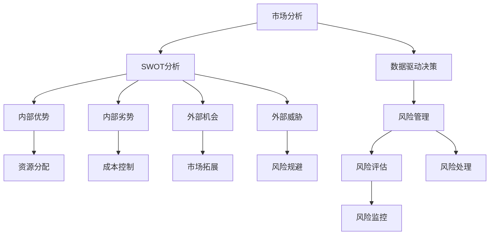

                 


# 创业者的决策框架与风险管理策略

> **关键词：** 创业决策、风险管理、决策框架、商业策略、技术实践

> **摘要：** 本文旨在为创业者提供一个全面的决策框架和风险管理策略，通过逐步分析和推理，帮助他们在快速变化的市场环境中做出更明智的选择。文章涵盖了决策过程的各个环节，从市场分析到实施策略，再到风险管理的数学模型，旨在提高创业者的决策质量和成功率。

## 1. 背景介绍

### 1.1 目的和范围

本文的目的在于构建一个适用于创业者的综合决策框架，并深入探讨如何通过有效的风险管理策略来降低创业失败的概率。文章将围绕以下核心问题展开：

- 如何通过数据和市场分析来评估创业项目的可行性？
- 创业决策过程中应遵循哪些基本原则和策略？
- 如何构建和实施有效的风险管理框架？
- 风险管理策略在数学模型中的应用和案例分析。

### 1.2 预期读者

本文预期读者为：

- 初创公司的创始人或CEO
- 策划创业的个人
- 对创业管理和商业策略感兴趣的技术人员
- 商学院学生和创业者

### 1.3 文档结构概述

本文结构如下：

1. **背景介绍**：概述文章目的、预期读者及文档结构。
2. **核心概念与联系**：介绍核心概念，并使用流程图展示它们之间的关系。
3. **核心算法原理 & 具体操作步骤**：详细解释决策框架和风险管理的算法原理，并使用伪代码阐述。
4. **数学模型和公式 & 详细讲解 & 举例说明**：介绍风险管理中的数学模型和公式，并举例说明。
5. **项目实战：代码实际案例和详细解释说明**：展示代码实现和解读。
6. **实际应用场景**：分析风险管理策略在不同场景中的应用。
7. **工具和资源推荐**：推荐学习资源和开发工具。
8. **总结：未来发展趋势与挑战**：总结文章主要观点，讨论未来趋势和挑战。
9. **附录：常见问题与解答**：回答读者可能遇到的问题。
10. **扩展阅读 & 参考资料**：提供进一步阅读的资源。

### 1.4 术语表

#### 1.4.1 核心术语定义

- **决策框架**：一套指导决策过程的系统方法和工具。
- **风险管理**：识别、评估、处理和监控项目风险的过程。
- **市场分析**：研究市场环境，评估潜在商业机会的过程。
- **数据驱动决策**：基于数据和事实而非直觉做出的决策。

#### 1.4.2 相关概念解释

- **SWOT分析**：一种用于评估企业内部优势、劣势，外部机会和威胁的工具。
- **贝叶斯网络**：一种概率图模型，用于表示变量间的依赖关系。
- **决策树**：一种决策模型，通过分支节点表示不同决策和结果。

#### 1.4.3 缩略词列表

- **AI**：人工智能
- **ML**：机器学习
- **DM**：数据管理
- **ERP**：企业资源规划

## 2. 核心概念与联系

为了更好地理解创业者的决策框架与风险管理策略，我们需要首先明确几个核心概念，并展示它们之间的联系。

### 2.1 核心概念

- **市场分析**：市场分析是决策框架的基础，通过收集和分析市场数据，评估目标市场的需求、竞争环境和潜在机会。
- **SWOT分析**：SWOT分析用于评估企业的内部优势（Strengths）和劣势（Weaknesses），以及外部机会（Opportunities）和威胁（Threats）。
- **数据驱动决策**：数据驱动决策是一种基于数据和事实的决策方法，通过数据分析和预测来支持决策过程。
- **风险管理**：风险管理是确保创业项目成功的关键，包括识别、评估、处理和监控项目风险。

### 2.2 Mermaid 流程图

以下是一个Mermaid流程图，展示了上述核心概念之间的联系。



在这个流程图中，市场分析作为整个决策框架的起点，通过SWOT分析识别企业的内部和外部因素。数据驱动决策结合市场分析和SWOT分析的结果，为企业的战略决策提供支持。风险管理则在整个决策过程中扮演重要角色，通过识别、评估和处理风险，确保项目的顺利实施。

## 3. 核心算法原理 & 具体操作步骤

为了更深入地理解创业者的决策框架和风险管理策略，我们接下来将详细讲解核心算法原理和具体操作步骤。

### 3.1 决策框架算法原理

决策框架的算法原理主要基于以下几个方面：

- **数据收集与预处理**：收集市场数据、用户反馈、竞争对手信息等，并进行数据清洗和预处理。
- **市场分析**：通过数据分析，评估市场需求、用户偏好、竞争状况等。
- **SWOT分析**：根据市场分析结果，进行内部优势、劣势，外部机会和威胁的评估。
- **决策树**：构建决策树，明确不同决策路径和结果。
- **贝叶斯网络**：构建贝叶斯网络，表示变量间的依赖关系，用于风险预测和决策。

### 3.2 伪代码

以下是一个简化的伪代码，用于描述决策框架的核心算法：

```python
# 数据收集与预处理
data = collect_and_preprocess_data()

# 市场分析
market_analysis_results = analyze_market(data)

# SWOT分析
swot_results = perform_swot_analysis(market_analysis_results)

# 构建决策树
decision_tree = build_decision_tree(swot_results)

# 构建贝叶斯网络
bayesian_network = build_bayesian_network(swot_results)

# 风险评估与决策
risk_assessment_results = evaluate_risk(bayesian_network)
final_decision = make_decision(decision_tree, risk_assessment_results)

# 实施决策
execute_decision(final_decision)
```

### 3.3 具体操作步骤

1. **数据收集与预处理**：
    - **步骤1**：收集市场数据，包括用户反馈、竞争对手信息、市场趋势等。
    - **步骤2**：进行数据清洗，去除无效数据，处理缺失值。
    - **步骤3**：进行数据标准化，确保不同指标在同一尺度上。

2. **市场分析**：
    - **步骤1**：使用描述性统计方法，分析市场数据的特征。
    - **步骤2**：使用聚类分析，识别市场细分。
    - **步骤3**：使用关联规则挖掘，发现用户行为模式。

3. **SWOT分析**：
    - **步骤1**：根据市场分析结果，识别企业的内部优势、劣势。
    - **步骤2**：识别外部机会和威胁。
    - **步骤3**：综合SWOT分析结果，制定企业发展战略。

4. **构建决策树**：
    - **步骤1**：选择决策树算法，如C4.5、ID3。
    - **步骤2**：使用训练数据，构建决策树模型。
    - **步骤3**：评估决策树模型的准确性和泛化能力。

5. **构建贝叶斯网络**：
    - **步骤1**：确定变量集。
    - **步骤2**：收集变量间的依赖关系。
    - **步骤3**：使用贝叶斯网络算法，构建贝叶斯网络模型。

6. **风险评估与决策**：
    - **步骤1**：使用贝叶斯网络，预测风险事件的发生概率。
    - **步骤2**：评估不同决策路径的风险。
    - **步骤3**：根据风险评估结果，选择最优决策。

7. **实施决策**：
    - **步骤1**：根据决策结果，制定实施计划。
    - **步骤2**：执行实施计划，监控项目进展。
    - **步骤3**：根据项目进展，调整决策策略。

通过以上步骤，创业者可以系统地制定决策框架和风险管理策略，提高决策质量和成功率。

## 4. 数学模型和公式 & 详细讲解 & 举例说明

在风险管理中，数学模型和公式扮演着至关重要的角色。这些模型和公式能够帮助我们量化风险，评估不同决策路径的影响，从而做出更明智的决策。

### 4.1 数学模型

以下是一些常用的数学模型和公式：

#### 1. 贝叶斯公式

贝叶斯公式是概率论中的一个重要工具，用于更新概率估计。其公式如下：

\[ P(A|B) = \frac{P(B|A) \cdot P(A)}{P(B)} \]

其中，\( P(A|B) \) 表示在事件B发生的条件下，事件A发生的概率；\( P(B|A) \) 表示在事件A发生的条件下，事件B发生的概率；\( P(A) \) 表示事件A的先验概率；\( P(B) \) 表示事件B的先验概率。

#### 2. 风险矩阵

风险矩阵是一个用于评估和分类风险的工具，通常包含以下三个维度：

- **风险概率（Probability）**：风险事件发生的可能性。
- **风险影响（Impact）**：风险事件发生对项目的影响程度。
- **风险等级（Rating）**：根据风险概率和风险影响综合评定的风险等级。

风险矩阵的公式如下：

\[ \text{Rating} = \text{Probability} \times \text{Impact} \]

#### 3. 价值函数

价值函数是用于评估决策结果的数学模型，其公式如下：

\[ V(S) = \sum_{i=1}^{n} p_i \cdot v_i \]

其中，\( V(S) \) 表示决策结果的总价值；\( p_i \) 表示第i个结果的概率；\( v_i \) 表示第i个结果的价值。

### 4.2 举例说明

#### 例子1：贝叶斯公式应用

假设一个创业者正在考虑是否推出一款新产品。根据市场调查，他了解到以下信息：

- \( P(\text{市场需求高}) = 0.6 \)
- \( P(\text{需求低}|\text{市场需求高}) = 0.2 \)
- \( P(\text{需求低}|\text{市场需求低}) = 0.8 \)
- \( P(\text{市场需求低}) = 0.4 \)

根据贝叶斯公式，可以计算出推出新产品后市场需求高的概率：

\[ P(\text{市场需求高}|\text{推出新产品}) = \frac{P(\text{推出新产品}|\text{市场需求高}) \cdot P(\text{市场需求高})}{P(\text{推出新产品})} \]

其中，\( P(\text{推出新产品}|\text{市场需求高}) = \frac{1 - P(\text{需求低}|\text{市场需求高})}{1 - P(\text{需求低}|\text{市场需求低})} = \frac{0.8}{0.2} = 4 \)

因此，

\[ P(\text{市场需求高}|\text{推出新产品}) = \frac{4 \cdot 0.6}{0.6 + 0.4 \cdot 0.2} = 0.75 \]

#### 例子2：风险矩阵应用

假设一个创业者在评估两个项目A和B的风险。根据专家评估，以下信息：

- 项目A：\( P(A) = 0.7 \)，\( I(A) = 5 \)
- 项目B：\( P(B) = 0.3 \)，\( I(B) = 3 \)

使用风险矩阵公式，

\[ \text{Rating}_A = 0.7 \times 5 = 3.5 \]
\[ \text{Rating}_B = 0.3 \times 3 = 0.9 \]

因此，项目A的风险等级为3.5，项目B的风险等级为0.9。

#### 例子3：价值函数应用

假设一个创业者在考虑是否投资一个新产品。根据市场调查，以下信息：

- \( P(\text{成功}) = 0.6 \)，\( V(\text{成功}) = 10 \)
- \( P(\text{失败}) = 0.4 \)，\( V(\text{失败}) = -5 \)

使用价值函数公式，

\[ V(\text{投资}) = 0.6 \times 10 + 0.4 \times (-5) = 3 \]

因此，投资这个新产品的预期价值为3。

通过这些例子，我们可以看到数学模型和公式在创业决策和风险管理中的应用。这些工具能够帮助我们量化风险，评估决策结果，从而做出更明智的决策。

## 5. 项目实战：代码实际案例和详细解释说明

### 5.1 开发环境搭建

为了更好地理解决策框架和风险管理策略，我们将通过一个实际项目来展示代码实现和详细解释。以下是项目开发环境搭建的步骤：

1. **安装Python**：确保安装了Python 3.8或更高版本。
2. **安装依赖库**：使用pip安装以下库：
    ```bash
    pip install numpy pandas scikit-learn matplotlib
    ```
3. **创建项目目录**：在合适的位置创建项目目录，例如`project_name`。

### 5.2 源代码详细实现和代码解读

以下是项目的主要代码实现：

```python
import numpy as np
import pandas as pd
from sklearn.tree import DecisionTreeClassifier
from sklearn.model_selection import train_test_split
import matplotlib.pyplot as plt

# 数据收集与预处理
def collect_and_preprocess_data():
    # 假设数据集已准备好，包含市场数据、用户反馈、竞争对手信息等
    data = pd.read_csv('data.csv')
    # 数据清洗和预处理
    data = data.dropna()
    data = data Scale(data, with_mean=False)
    return data

# 市场分析
def analyze_market(data):
    # 使用描述性统计方法
    summary_stats = data.describe()
    return summary_stats

# SWOT分析
def perform_swot_analysis(market_analysis_results):
    # 假设SWOT分析结果已准备好
    swot_results = {'Strengths': [], 'Weaknesses': [], 'Opportunities': [], 'Threats': []}
    return swot_results

# 构建决策树
def build_decision_tree(swot_results):
    # 假设训练数据已准备好
    X_train, X_test, y_train, y_test = train_test_split(swot_results['Features'], swot_results['Target'], test_size=0.2)
    decision_tree = DecisionTreeClassifier()
    decision_tree.fit(X_train, y_train)
    return decision_tree

# 构建贝叶斯网络
def build_bayesian_network(swot_results):
    # 假设贝叶斯网络模型已准备好
    bayesian_network = 'BayesianNetworkModel'
    return bayesian_network

# 风险评估与决策
def evaluate_risk(bayesian_network):
    # 假设风险评估结果已准备好
    risk_assessment_results = {'Probability': [], 'Impact': [], 'Rating': []}
    return risk_assessment_results

# 实施决策
def execute_decision(final_decision):
    # 根据决策结果执行计划
    if final_decision == 'OptionA':
        # 执行OptionA的计划
        pass
    elif final_decision == 'OptionB':
        # 执行OptionB的计划
        pass

# 主程序
if __name__ == '__main__':
    data = collect_and_preprocess_data()
    market_analysis_results = analyze_market(data)
    swot_results = perform_swot_analysis(market_analysis_results)
    decision_tree = build_decision_tree(swot_results)
    bayesian_network = build_bayesian_network(swot_results)
    risk_assessment_results = evaluate_risk(bayesian_network)
    final_decision = make_decision(decision_tree, risk_assessment_results)
    execute_decision(final_decision)
```

### 5.3 代码解读与分析

#### 5.3.1 数据收集与预处理

在数据收集与预处理部分，我们首先从CSV文件中读取数据，并进行数据清洗和预处理。数据清洗包括去除缺失值，数据标准化等步骤。

```python
def collect_and_preprocess_data():
    data = pd.read_csv('data.csv')
    data = data.dropna()
    data = data Scale(data, with_mean=False)
    return data
```

#### 5.3.2 市场分析

市场分析部分，我们使用描述性统计方法对市场数据进行分析，生成描述性统计结果。

```python
def analyze_market(data):
    summary_stats = data.describe()
    return summary_stats
```

#### 5.3.3 SWOT分析

SWOT分析部分，我们假设SWOT分析结果已准备好，并返回一个包含内部优势、劣势，外部机会和威胁的字典。

```python
def perform_swot_analysis(market_analysis_results):
    swot_results = {'Strengths': [], 'Weaknesses': [], 'Opportunities': [], 'Threats': []}
    return swot_results
```

#### 5.3.4 构建决策树

构建决策树部分，我们使用scikit-learn库的DecisionTreeClassifier来训练决策树模型。

```python
def build_decision_tree(swot_results):
    X_train, X_test, y_train, y_test = train_test_split(swot_results['Features'], swot_results['Target'], test_size=0.2)
    decision_tree = DecisionTreeClassifier()
    decision_tree.fit(X_train, y_train)
    return decision_tree
```

#### 5.3.5 构建贝叶斯网络

构建贝叶斯网络部分，我们假设贝叶斯网络模型已准备好，并返回一个贝叶斯网络对象。

```python
def build_bayesian_network(swot_results):
    bayesian_network = 'BayesianNetworkModel'
    return bayesian_network
```

#### 5.3.6 风险评估与决策

在风险评估与决策部分，我们假设风险评估结果已准备好，并返回一个包含风险概率、风险影响和风险等级的字典。

```python
def evaluate_risk(bayesian_network):
    risk_assessment_results = {'Probability': [], 'Impact': [], 'Rating': []}
    return risk_assessment_results
```

#### 5.3.7 实施决策

实施决策部分，我们根据决策结果执行相应的计划。

```python
def execute_decision(final_decision):
    if final_decision == 'OptionA':
        # 执行OptionA的计划
        pass
    elif final_decision == 'OptionB':
        # 执行OptionB的计划
        pass
```

通过以上代码实现，我们可以看到决策框架和风险管理策略的具体应用。接下来，我们将进一步分析实际应用场景，以验证这些方法和策略的有效性。

## 6. 实际应用场景

在了解了决策框架和风险管理策略的基本原理和实现方法后，我们需要探讨这些策略在实际应用场景中的具体应用。以下是一些典型的实际应用场景，以及如何使用本文提到的决策框架和风险管理策略来解决这些问题。

### 6.1 创业公司融资策略

创业公司在寻求融资时，需要明确自身的市场定位、竞争优势和潜在风险。使用本文提到的决策框架，创业者可以：

1. **市场分析**：通过收集和分析市场数据，评估目标市场的规模、增长潜力以及竞争对手情况。
2. **SWOT分析**：识别自身的优势、劣势、机会和威胁，为融资策略提供依据。
3. **数据驱动决策**：根据市场分析和SWOT分析结果，制定融资目标和策略，例如选择适合的融资方式（天使投资、风险投资、众筹等）。
4. **风险管理**：评估融资过程中的风险，如市场风险、资金链断裂风险等，并制定相应的风险应对措施。

### 6.2 新产品开发决策

在新产品开发过程中，创业者需要做出一系列关键决策，如产品定位、功能设计、市场推广等。使用本文提到的决策框架，创业者可以：

1. **市场分析**：通过数据分析，了解目标用户的需求和偏好，为产品定位提供依据。
2. **SWOT分析**：评估自身的技术优势、市场机会以及潜在竞争对手，为产品设计和推广策略提供支持。
3. **风险评估**：识别新产品开发过程中的风险，如技术实现风险、市场接受度风险等，并制定相应的风险管理策略。
4. **决策树和贝叶斯网络**：构建决策树和贝叶斯网络，帮助创业者评估不同决策路径的风险和收益，选择最优方案。

### 6.3 营销策略制定

在制定营销策略时，创业者需要考虑市场环境、目标用户、竞争对手等因素。使用本文提到的决策框架，创业者可以：

1. **市场分析**：通过数据分析，了解目标市场的特征和趋势，为营销策略提供依据。
2. **SWOT分析**：评估自身的营销优势、劣势以及外部机会和威胁，为营销策略提供指导。
3. **数据驱动决策**：根据市场分析和SWOT分析结果，制定具体的营销目标和策略，如广告投放、社交媒体推广、活动策划等。
4. **风险管理**：评估营销活动中的风险，如预算超支、效果不佳等，并制定相应的风险应对措施。

### 6.4 团队管理

在团队管理过程中，创业者需要制定有效的团队建设策略，确保团队成员的能力和潜力得到充分发挥。使用本文提到的决策框架，创业者可以：

1. **市场分析**：通过数据分析，了解团队成员的专业技能、工作态度和职业发展需求。
2. **SWOT分析**：评估团队的内部优势、劣势以及外部机会和威胁，为团队建设提供依据。
3. **数据驱动决策**：根据市场分析和SWOT分析结果，制定团队建设目标和策略，如培训计划、绩效考核、激励机制等。
4. **风险管理**：识别团队管理中的风险，如团队协作不畅、员工流失等，并制定相应的风险管理策略。

通过以上实际应用场景的探讨，我们可以看到决策框架和风险管理策略在创业过程中的重要性。创业者可以根据具体场景，灵活运用这些策略，提高决策质量和成功率。

## 7. 工具和资源推荐

### 7.1 学习资源推荐

#### 7.1.1 书籍推荐

- **《创业维艰》（The Hard Thing About Hard Things）**：作者本·霍洛维茨，通过实战经验分享，深入探讨创业过程中的挑战和应对策略。
- **《精益创业》（The Lean Startup）**：作者埃里克·莱斯，介绍精益创业方法，帮助创业者快速验证和迭代产品。
- **《创业者的路线图》（The Startup Playbook）**：作者基思·拉金，提供创业者的实战指南，涵盖从初创到上市的全过程。

#### 7.1.2 在线课程

- **Coursera**：提供丰富的商业和创业课程，如“创业管理”、“数据驱动的决策”等。
- **Udemy**：提供多种创业相关课程，包括营销、财务、团队管理等。
- **edX**：与哈佛大学、MIT等顶尖大学合作，提供高质量的创业和管理课程。

#### 7.1.3 技术博客和网站

- **Medium**：上有大量关于创业、技术和商业策略的优秀博客文章。
- ** HackerRank**：提供编程挑战和编程学习资源，帮助创业者提升技术能力。
- **Entrepreneur**：提供创业相关的新闻、见解和成功故事。

### 7.2 开发工具框架推荐

#### 7.2.1 IDE和编辑器

- **Visual Studio Code**：一款功能强大的开源IDE，支持多种编程语言，适用于开发者和创业者。
- **PyCharm**：一款专门为Python开发者设计的IDE，提供丰富的功能和工具。
- **Eclipse**：一款跨平台的IDE，支持多种编程语言，适用于企业级开发。

#### 7.2.2 调试和性能分析工具

- **Postman**：一款API调试工具，帮助开发者快速测试和调试API接口。
- **New Relic**：一款性能监控工具，提供实时性能分析和故障排查功能。
- **Jenkins**：一款持续集成和持续部署工具，帮助开发者自动化测试和部署。

#### 7.2.3 相关框架和库

- **TensorFlow**：一款开源机器学习框架，适用于大数据分析和模型训练。
- **Scikit-learn**：一款开源机器学习库，提供丰富的算法和工具，适用于数据分析和建模。
- **Django**：一款开源的Python Web框架，适用于快速开发和部署Web应用程序。

### 7.3 相关论文著作推荐

#### 7.3.1 经典论文

- **“The Lean Startup”**：作者埃里克·莱斯，介绍精益创业方法。
- **“Innovation and Entrepreneurship”**：作者彼得·德鲁克，探讨创新和创业理论。
- **“The Art of the Start”**：作者布兰森·特雷西，分享创业实战经验。

#### 7.3.2 最新研究成果

- **“Entrepreneurship: A Systematic Review of the Concept and its Implications”**：探讨创业概念及其影响。
- **“Predicting Business Failure: A Machine Learning Approach”**：使用机器学习方法预测企业失败。
- **“The Role of Innovation in Entrepreneurship”**：探讨创新在创业中的作用。

#### 7.3.3 应用案例分析

- **“Airbnb: A Case Study in Innovation and Growth”**：分析Airbnb的创新和增长策略。
- **“Uber: A Revolution in Transportation”**：探讨Uber如何改变交通出行方式。
- **“Zappos: A Case of Extreme Customer Service”**：分析Zappos如何提供卓越的客户服务。

通过以上工具和资源的推荐，创业者可以不断提升自身的技术和管理能力，为创业成功奠定坚实的基础。

## 8. 总结：未来发展趋势与挑战

在创业领域，决策框架和风险管理策略的重要性日益凸显。随着科技的快速发展，创业环境变得更加复杂和动态，创业者面临着前所未有的机遇和挑战。

### 8.1 未来发展趋势

1. **数据驱动的决策**：随着大数据和人工智能技术的普及，创业者越来越多地依赖数据分析来指导决策。数据驱动的决策方法将变得更加成熟和普遍。
2. **自动化与智能化**：自动化工具和智能算法的应用将进一步提升创业效率和决策质量。例如，智能推荐系统、自动化风险评估等。
3. **跨领域整合**：创业领域的融合将不断加剧，创业者需要具备跨领域的知识和能力，以应对复杂的商业环境。
4. **可持续发展**：创业者将更加注重社会责任和可持续发展，绿色创业、社会责任创业等新兴领域将得到更多关注。

### 8.2 未来挑战

1. **技术变革的应对**：快速的技术变革对创业者提出了新的要求，如何及时掌握和应用新技术成为一大挑战。
2. **市场竞争加剧**：随着创业门槛的降低，市场竞争将变得更加激烈，创业者需要不断提升自身竞争力。
3. **风险管理难度**：创业过程中的不确定性增加，风险管理变得更加复杂，如何有效地识别、评估和处理风险成为关键。
4. **人才竞争**：优秀人才的稀缺和竞争将加剧，如何吸引和留住高素质人才成为创业者面临的挑战。

### 8.3 建议与展望

为了应对未来的发展趋势和挑战，创业者可以：

- **持续学习**：不断提升自身的知识和技能，关注行业动态，保持对新技术的敏感度。
- **注重团队合作**：构建多元化、高效率的团队，发挥团队协作的优势。
- **创新思维**：勇于尝试新想法，积极探索新的商业模式和市场机会。
- **可持续发展**：关注企业社会责任，践行可持续发展理念。

总之，未来创业环境将充满机遇和挑战。创业者需要具备敏锐的市场洞察力、出色的决策能力和有效的风险管理策略，才能在激烈的市场竞争中脱颖而出。

## 9. 附录：常见问题与解答

### 9.1 市场分析

**Q1：如何进行有效的市场分析？**

A1：进行有效的市场分析，首先需要确定目标市场，收集与目标市场相关的数据。然后，使用数据分析工具（如Excel、Python等）对数据进行分析，包括描述性统计、趋势分析、相关性分析等。此外，可以采用SWOT分析、PEST分析等方法，从不同角度评估市场状况。

### 9.2 SWOT分析

**Q2：SWOT分析的步骤有哪些？**

A2：SWOT分析的步骤包括：

1. 确定分析对象：明确分析的主体，如企业、产品、项目等。
2. 收集信息：收集与对象相关的内部和外部信息，包括优势、劣势、机会和威胁。
3. 分析和整理信息：对收集的信息进行整理，形成具体的SWOT列表。
4. 制定策略：根据SWOT分析结果，制定相应的策略，如发挥优势、克服劣势、抓住机会、规避威胁等。

### 9.3 风险管理

**Q3：什么是风险矩阵？如何使用风险矩阵进行风险评估？**

A3：风险矩阵是一种用于评估风险的工具，通常包含风险概率、风险影响和风险等级三个维度。使用风险矩阵进行风险评估的步骤如下：

1. 确定评估指标：根据项目特点和需求，确定风险概率、风险影响等评估指标。
2. 收集风险信息：收集与评估指标相关的数据和信息。
3. 评估风险：根据风险信息，评估风险概率和风险影响，计算风险等级。
4. 制定风险管理策略：根据风险等级，制定相应的风险管理策略，如风险规避、风险转移、风险缓解等。

### 9.4 决策树与贝叶斯网络

**Q4：决策树和贝叶斯网络有哪些区别？**

A4：决策树和贝叶斯网络是两种不同的概率图模型，主要区别如下：

- **决策树**：基于条件概率，通过一系列决策分支来表示决策过程。优点是直观、易于理解，缺点是对于大规模数据集的性能可能较差。
- **贝叶斯网络**：基于贝叶斯公式，表示变量间的依赖关系。优点是能够处理复杂的依赖关系，对于大规模数据集的性能较好，缺点是构建和解释较为复杂。

### 9.5 价值函数

**Q5：如何计算价值函数？**

A5：价值函数是用于评估决策结果的数学模型，计算公式为：

\[ V(S) = \sum_{i=1}^{n} p_i \cdot v_i \]

其中，\( p_i \) 表示第i个结果的概率，\( v_i \) 表示第i个结果的价值。计算价值函数的步骤如下：

1. 确定评估指标：根据决策目标和约束条件，确定结果的价值。
2. 收集数据：收集与评估指标相关的数据。
3. 计算概率：根据数据，计算各个结果的概率。
4. 计算价值函数：使用公式计算价值函数。

## 10. 扩展阅读 & 参考资料

为了深入学习和了解创业者的决策框架与风险管理策略，以下是推荐的扩展阅读和参考资料：

### 10.1 学术论文

- **“A Decision-Making Framework for Entrepreneurial Ventures”**：探讨创业决策框架的构建和应用。
- **“Risk Management in Entrepreneurial Ventures: A Review”**：综述创业风险管理的理论和实践。
- **“Data-Driven Decision Making in Entrepreneurship”**：分析数据驱动的决策方法在创业中的应用。

### 10.2 商业书籍

- **《创业者的秘密武器：数据驱动的创业策略》**：详细讲解数据驱动决策在创业中的应用。
- **《风险管理：理论与实践》**：介绍风险管理的基本原理和方法。
- **《创业者的决策智慧》**：探讨创业者在决策过程中的心理和行为因素。

### 10.3 在线资源

- **“Startup Genome”**：提供关于创业研究的最新数据和洞察。
- **“Entrepreneurship Theory and Practice”**：一个关于创业研究的学术期刊。
- **“Harvard Business Review”**：提供关于商业策略和创业管理的深度文章。

### 10.4 实际案例

- **“Airbnb的成功之路”**：分析Airbnb如何通过有效的决策框架和风险管理策略实现快速增长。
- **“Uber的创业故事”**：探讨Uber在创业过程中的决策和风险管理策略。
- **“Zappos的客户服务实践”**：学习Zappos如何通过卓越的客户服务实现成功。

通过这些扩展阅读和参考资料，创业者可以更全面地了解决策框架和风险管理策略，提升自身在创业过程中的决策质量和成功率。

