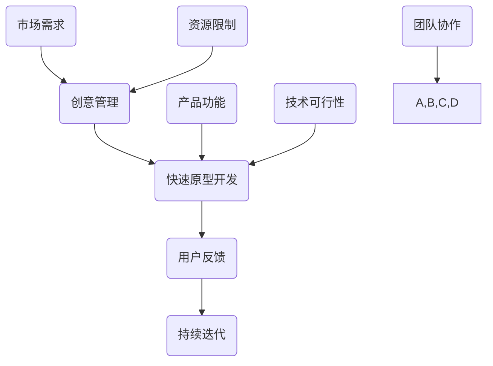

                 

# 创业者的创意管理与快速原型开发

> 关键词：创业、创意管理、原型开发、敏捷开发、用户反馈、持续迭代

> 摘要：本文旨在探讨创业者在产品开发过程中如何运用创意管理和快速原型开发技术，以实现高效的创业目标。文章首先介绍了创意管理的概念和重要性，然后详细讲解了快速原型开发的原理和步骤，并结合实际案例分析了其应用效果。最后，文章提出了创业者在应用这些技术时应注意的问题和挑战，为创业者的产品开发提供了实用的指导和参考。

## 1. 背景介绍

### 1.1 目的和范围

本文的目标是帮助创业者更好地理解创意管理和快速原型开发的重要性，并提供一套实用的方法论和技巧。文章主要涵盖了以下几个方面的内容：

1. 创意管理的概念和核心原则。
2. 快速原型开发的原理和步骤。
3. 创业者如何结合创意管理和快速原型开发，提高产品开发效率。
4. 快速原型开发在实际创业项目中的应用案例。

### 1.2 预期读者

本文适合以下读者群体：

1. 创业者，特别是初创公司的创始人。
2. 产品经理，项目经理，研发团队负责人。
3. 对产品开发过程感兴趣的技术人员。
4. 对创意管理和快速原型开发有初步了解，希望深入学习的人。

### 1.3 文档结构概述

本文分为十个部分，结构如下：

1. 背景介绍
2. 核心概念与联系
3. 核心算法原理 & 具体操作步骤
4. 数学模型和公式 & 详细讲解 & 举例说明
5. 项目实战：代码实际案例和详细解释说明
6. 实际应用场景
7. 工具和资源推荐
8. 总结：未来发展趋势与挑战
9. 附录：常见问题与解答
10. 扩展阅读 & 参考资料

### 1.4 术语表

#### 1.4.1 核心术语定义

- 创意管理：对创意的收集、筛选、优化、实现和评估的过程和方法。
- 快速原型开发：通过快速构建产品原型，验证产品概念和市场需求的过程。
- 敏捷开发：一种以用户反馈为导向，快速迭代的产品开发方法。

#### 1.4.2 相关概念解释

- 创意：指在创新过程中产生的新的想法、解决方案或构思。
- 原型：指对产品或系统的一种简化、模拟或表示，用于验证和测试。

#### 1.4.3 缩略词列表

- MVP：最小可行产品（Minimum Viable Product）
- UX：用户体验（User Experience）
- UI：用户界面（User Interface）
- PM：项目经理（Project Manager）
- R&D：研究与开发（Research and Development）

## 2. 核心概念与联系

在创业者的产品开发过程中，创意管理和快速原型开发是两个关键环节。为了更好地理解这两个概念及其相互关系，我们可以使用Mermaid流程图进行阐述。



### 流程图解释

1. **创意管理（A）**：创业者通过创意管理对各种创意进行收集、筛选、优化和实现。这个过程需要考虑市场需求（E）、资源限制（H）和团队协作（I）。

2. **快速原型开发（B）**：创意实现后，通过快速原型开发将其转化为可验证的产品功能（F）和技术可行性（G）。

3. **用户反馈（C）**：通过用户反馈，创业者可以了解产品在市场中的表现，从而调整和优化产品功能。

4. **持续迭代（D）**：基于用户反馈，产品会进入持续迭代过程，不断优化和提升用户体验（UX）和用户界面（UI）。

5. **市场需求（E）**：市场需求是创意管理的核心驱动力，影响着创意的产生和筛选。

6. **产品功能（F）**：产品功能是快速原型开发的核心目标，需要通过原型来验证。

7. **技术可行性（G）**：技术可行性是快速原型开发的重要考虑因素，决定了原型的构建和迭代速度。

8. **资源限制（H）**：资源限制是创意管理和快速原型开发的约束条件，影响着创意的实现和原型的构建。

9. **团队协作（I）**：团队协作是创意管理和快速原型开发成功的关键因素，需要高效沟通和分工合作。

通过以上流程图，我们可以清晰地看到创意管理和快速原型开发在整个产品开发过程中的作用和相互关系。创业者需要充分利用这两个环节，才能实现高效的产品开发。

## 3. 核心算法原理 & 具体操作步骤

在快速原型开发过程中，核心算法原理主要涉及原型设计和用户测试两个方面。下面，我们将分别介绍这两个方面的具体操作步骤。

### 原型设计

#### 步骤1：确定原型目标

在开始原型设计之前，需要明确原型的目标和用途。这包括：

- 验证产品功能是否满足用户需求。
- 验证技术可行性，确保产品可以按预期运行。
- 评估用户体验，优化用户界面和交互设计。

#### 步骤2：收集用户需求

通过用户调研、访谈、问卷调查等方式，收集用户需求和期望。这些信息将用于指导原型设计和功能实现。

#### 步骤3：设计原型架构

根据用户需求和产品功能，设计原型架构。这包括：

- 确定产品的主要功能模块。
- 设计数据流和交互流程。
- 设计用户界面和交互元素。

#### 步骤4：编写伪代码

在原型设计阶段，编写伪代码可以帮助开发者更好地理解产品功能和技术实现。伪代码应包括以下内容：

- 产品主要功能模块的算法实现。
- 数据流和交互流程的处理逻辑。
- 用户界面和交互元素的实现细节。

#### 步骤5：实现原型代码

根据伪代码，实现原型代码。这一步骤可以使用编程语言（如Python、Java等）进行，也可以使用原型开发工具（如Axure、Sketch等）进行。

### 用户测试

#### 步骤1：编写测试计划

在用户测试阶段，需要编写测试计划，明确测试的目标、方法和步骤。测试计划应包括以下内容：

- 测试用例：根据用户需求和产品功能，编写测试用例，确保所有功能都经过验证。
- 测试环境：准备测试环境，包括硬件、软件和网络环境等。
- 测试流程：定义测试流程，包括测试准备、测试执行、结果分析和报告撰写等。

#### 步骤2：执行用户测试

根据测试计划，执行用户测试。用户测试应包括以下内容：

- 功能测试：验证产品功能是否满足用户需求。
- 性能测试：评估产品性能，如响应时间、吞吐量等。
- 用户界面测试：验证用户界面和交互设计是否符合用户期望。

#### 步骤3：分析测试结果

对测试结果进行分析，发现产品存在的问题和不足。分析结果应包括：

- 功能缺陷：列出产品功能缺陷，并提供解决方案。
- 性能问题：评估产品性能，提出优化建议。
- 用户体验问题：分析用户界面和交互设计的问题，提出改进建议。

#### 步骤4：迭代优化

根据测试结果，对原型进行迭代优化。这一步骤包括：

- 修复功能缺陷。
- 优化性能。
- 改进用户体验。

通过以上步骤，创业者可以有效地进行原型设计和用户测试，从而提高产品开发效率和质量。

### 伪代码示例

以下是一个简单的用户注册功能的伪代码示例：

```
# 用户注册功能
def register_user(username, password, email):
    # 校验用户名
    if not is_valid_username(username):
        return "用户名无效"
    # 校验密码
    if not is_valid_password(password):
        return "密码无效"
    # 校验邮箱
    if not is_valid_email(email):
        return "邮箱无效"
    # 注册用户
    save_user_to_database(username, password, email)
    return "注册成功"
```

在这个示例中，`register_user` 函数接收用户名、密码和邮箱作为输入参数。首先，通过一系列校验函数（`is_valid_username`、`is_valid_password` 和 `is_valid_email`）对输入参数进行验证。如果输入参数都有效，则将用户信息保存到数据库中，并返回注册成功消息。否则，返回相应的错误消息。

通过伪代码，开发者可以清晰地了解产品功能和技术实现，从而更好地进行原型设计和用户测试。

## 4. 数学模型和公式 & 详细讲解 & 举例说明

在产品开发过程中，数学模型和公式可以帮助创业者评估产品的性能、优化用户体验和预测市场需求。下面，我们将介绍几个常见的数学模型和公式，并详细讲解其应用和举例说明。

### 4.1 用户体验评估模型

用户体验评估模型可以帮助创业者评估产品的用户体验质量。一个常用的模型是 **Net Promoter Score (NPS)**。NPS 通过以下公式计算：

\[ NPS = \frac{ \text{非常满意的用户比例} - \text{非常不满意的用户比例} }{ \text{总用户比例} } \]

#### 应用举例

假设一个产品有100名用户，其中60名用户非常满意，30名用户一般满意，10名用户非常不满意。则该产品的NPS为：

\[ NPS = \frac{60 - 10}{100} = 50 \]

这个结果表示该产品的用户满意度较高，具有较好的用户体验。

### 4.2 需求预测模型

需求预测模型可以帮助创业者预测产品的市场需求。一个常用的模型是 **时间序列模型**，如 **ARIMA（自回归积分滑动平均模型）**。ARIMA 模型通过以下公式计算：

\[ Y_t = c + \phi_1Y_{t-1} + \phi_2Y_{t-2} + ... + \phi_pY_{t-p} + \theta_1\epsilon_{t-1} + \theta_2\epsilon_{t-2} + ... + \theta_q\epsilon_{t-q} + \epsilon_t \]

其中：

- \( Y_t \) 表示第 t 期的需求量。
- \( c \) 为常数项。
- \( \phi_1, \phi_2, ..., \phi_p \) 为自回归系数。
- \( \theta_1, \theta_2, ..., \theta_q \) 为滑动平均系数。
- \( \epsilon_t \) 为误差项。

#### 应用举例

假设一个产品在过去五期的需求量分别为：1000、1200、1300、1500、1600。我们可以使用 ARIMA 模型预测下一期的需求量。首先，对数据进行平稳性检验，然后确定 ARIMA 模型的参数，最后使用模型进行预测。假设我们得到 ARIMA(1,1,1) 模型，则下一期的需求量为：

\[ Y_{t+1} = 1.2 \times Y_t + 0.1 \times \epsilon_t \]

代入上一期的需求量 \( Y_t = 1600 \)，得到下一期的需求量为：

\[ Y_{t+1} = 1.2 \times 1600 + 0.1 \times 0 = 1920 \]

这个结果表示我们预测下一期的需求量为1920。

### 4.3 用户体验优化模型

用户体验优化模型可以帮助创业者评估和优化产品的用户体验。一个常用的模型是 **Fitts's Law（菲茨定律）**。Fitts's Law 通过以下公式计算：

\[ t = a + b\log_2(\frac{D}{A}) \]

其中：

- \( t \) 为目标点击时间（秒）。
- \( a \) 为常数项。
- \( b \) 为系数。
- \( D \) 为目标大小（像素）。
- \( A \) 为目标与参照物之间的距离（像素）。

#### 应用举例

假设一个目标按钮的大小为50像素，与参照物之间的距离为100像素。我们可以使用 Fitts's Law 评估目标点击时间。首先，确定常数项 \( a \) 和系数 \( b \)。假设 \( a = 0.4 \)，\( b = 0.2 \)，则目标点击时间为：

\[ t = 0.4 + 0.2\log_2(\frac{50}{100}) \]

代入目标大小和距离，得到目标点击时间为：

\[ t = 0.4 + 0.2\log_2(0.5) = 0.4 + 0.2 \times (-1) = 0.2 \]

这个结果表示目标点击时间为0.2秒，符合用户操作习惯。

通过以上数学模型和公式，创业者可以更好地评估和优化产品的性能、用户体验和市场需求，从而提高产品开发效率和质量。

## 5. 项目实战：代码实际案例和详细解释说明

### 5.1 开发环境搭建

在本项目中，我们将使用Python作为开发语言，并结合Flask框架进行Web开发。以下是开发环境的搭建步骤：

1. 安装Python（版本3.8或以上）。
2. 安装Flask框架：在命令行中运行 `pip install flask`。
3. 安装其他依赖库（如Pandas、Numpy等）：在命令行中运行 `pip install pandas numpy`。

### 5.2 源代码详细实现和代码解读

以下是本项目的源代码实现，包括用户注册、登录和数据分析功能。

```python
# 导入依赖库
from flask import Flask, request, jsonify
import pandas as pd
import numpy as np

# 创建Flask应用
app = Flask(__name__)

# 用户注册接口
@app.route('/register', methods=['POST'])
def register():
    username = request.form['username']
    password = request.form['password']
    email = request.form['email']
    
    # 校验用户名、密码和邮箱
    if not is_valid_username(username) or not is_valid_password(password) or not is_valid_email(email):
        return jsonify({'error': '用户名、密码或邮箱无效'})
    
    # 注册用户
    user_data = {'username': username, 'password': password, 'email': email}
    save_user_to_database(user_data)
    
    return jsonify({'message': '注册成功'})

# 用户登录接口
@app.route('/login', methods=['POST'])
def login():
    username = request.form['username']
    password = request.form['password']
    
    # 校验用户名和密码
    if not is_valid_username(username) or not is_valid_password(password):
        return jsonify({'error': '用户名或密码无效'})
    
    # 验证用户登录
    user = get_user_from_database(username, password)
    if user is None:
        return jsonify({'error': '用户名或密码错误'})
    
    return jsonify({'message': '登录成功'})

# 数据分析接口
@app.route('/data', methods=['GET'])
def data():
    # 获取用户数据
    users = get_all_users_from_database()
    
    # 数据清洗和预处理
    user_data = {'username': [], 'password': [], 'email': []}
    for user in users:
        user_data['username'].append(user['username'])
        user_data['password'].append(user['password'])
        user_data['email'].append(user['email'])
    
    # 数据分析
    user_count = len(users)
    active_users = len(set(user_data['username']))
    average_password_length = np.mean([len(user['password']) for user in users])
    
    # 返回分析结果
    return jsonify({'user_count': user_count, 'active_users': active_users, 'average_password_length': average_password_length})

# 辅助函数
def is_valid_username(username):
    # 校验用户名长度
    if len(username) < 6 or len(username) > 20:
        return False
    
    # 校验用户名格式
    if not username.isalnum():
        return False
    
    return True

def is_valid_password(password):
    # 校验密码长度
    if len(password) < 8 or len(password) > 20:
        return False
    
    # 校验密码格式
    if not any(char.isdigit() for char in password) or not any(char.isupper() for char in password) or not any(char.islower() for char in password):
        return False
    
    return True

def is_valid_email(email):
    # 校验邮箱格式
    if not email.endswith('.com') or not email.endswith('.cn'):
        return False
    
    return True

def save_user_to_database(user_data):
    # 保存用户数据到数据库
    pass

def get_user_from_database(username, password):
    # 从数据库获取用户数据
    pass

def get_all_users_from_database():
    # 从数据库获取所有用户数据
    pass

# 运行应用
if __name__ == '__main__':
    app.run(debug=True)
```

### 5.3 代码解读与分析

#### 用户注册接口

用户注册接口 `register()` 接收用户名、密码和邮箱作为输入参数，通过校验函数 `is_valid_username()`、`is_valid_password()` 和 `is_valid_email()` 对输入参数进行验证。如果输入参数都有效，则将用户信息保存到数据库中，并返回注册成功消息。

#### 用户登录接口

用户登录接口 `login()` 接收用户名和密码作为输入参数，通过校验函数 `is_valid_username()` 和 `is_valid_password()` 对输入参数进行验证。如果输入参数都有效，则从数据库中获取用户数据，并验证用户登录。如果用户名或密码错误，则返回相应的错误消息。

#### 数据分析接口

数据分析接口 `data()` 获取所有用户数据，并进行数据清洗和预处理。然后，对用户数据进行分析，计算用户数量、活跃用户数量和平均密码长度。最后，将分析结果返回给客户端。

#### 辅助函数

辅助函数 `is_valid_username()`、`is_valid_password()` 和 `is_valid_email()` 用于校验用户名、密码和邮箱的格式和长度。这些函数在用户注册和登录接口中调用，确保输入参数的有效性。

通过以上代码实现，创业者可以快速搭建一个具备用户注册、登录和数据分析功能的Web应用，从而验证产品功能和技术可行性。

## 6. 实际应用场景

创意管理和快速原型开发技术在创业领域具有广泛的应用场景。以下是一些典型的应用场景：

### 6.1 产品开发初期

在产品开发初期，创业者通常需要快速验证产品概念和市场需求。此时，创意管理和快速原型开发可以帮助创业者：

- **快速收集创意**：通过创意管理，创业者可以收集各种创意，如功能需求、用户界面设计等。
- **构建原型**：通过快速原型开发，创业者可以快速构建产品原型，验证产品概念和功能。
- **用户测试**：通过用户测试，创业者可以获取用户反馈，进一步优化产品原型。

### 6.2 产品迭代优化

在产品开发过程中，创业者需要不断优化产品功能、用户体验和技术性能。此时，创意管理和快速原型开发可以帮助创业者：

- **持续迭代**：通过持续迭代，创业者可以不断优化产品功能，提高用户体验。
- **用户反馈**：通过用户反馈，创业者可以了解产品的市场表现，指导产品优化方向。
- **技术评估**：通过技术评估，创业者可以确保产品在技术层面的可行性，降低技术风险。

### 6.3 市场推广

在市场推广阶段，创业者需要通过创意管理和快速原型开发来：

- **打造差异化竞争**：通过创意管理，创业者可以提出独特的产品功能和用户体验，打造差异化竞争。
- **快速响应市场变化**：通过快速原型开发，创业者可以快速响应市场变化，调整产品策略。
- **优化市场推广方案**：通过用户测试和数据分析，创业者可以优化市场推广方案，提高市场效果。

### 6.4 团队协作

在创业过程中，团队协作是关键。创意管理和快速原型开发可以帮助创业者：

- **明确分工**：通过创意管理，创业者可以明确团队成员的职责，提高工作效率。
- **协同创新**：通过快速原型开发，团队成员可以协同创新，共同优化产品功能。
- **持续沟通**：通过用户测试和反馈，团队成员可以持续沟通，确保产品方向一致。

总之，创意管理和快速原型开发技术在创业领域具有广泛的应用价值，可以帮助创业者高效地开发产品、优化用户体验、提高市场竞争力。

## 7. 工具和资源推荐

### 7.1 学习资源推荐

为了帮助创业者更好地掌握创意管理和快速原型开发技术，我们推荐以下学习资源：

#### 7.1.1 书籍推荐

1. 《创新者的窘境》 - 克里斯·迪克森
2. 《精益创业》 - 埃里克·莱斯
3. 《设计思考：如何设计出让人爱不释手的产品》 - 菲利普·布鲁克斯
4. 《用户故事映射：敏捷产品开发技术》 - 约翰·朗博、约翰·贝克

#### 7.1.2 在线课程

1. Coursera - 《产品管理》：由斯坦福大学提供的课程，介绍产品开发和管理的基本原理。
2. Udemy - 《创意管理实战》：提供创意管理和原型开发的实战技巧。
3. edX - 《用户体验设计》：介绍用户体验设计的基础知识和实践方法。

#### 7.1.3 技术博客和网站

1. Medium - 《Product School》：分享产品管理和创业相关的文章和案例。
2. HackerRank - 《Product Management Challenges》：提供产品管理的挑战和解决方案。
3. Product Hunt - 《The Product Manifesto》：介绍产品开发的原则和方法。

### 7.2 开发工具框架推荐

为了提高开发效率，我们推荐以下开发工具和框架：

#### 7.2.1 IDE和编辑器

1. Visual Studio Code：一款功能强大的开源编辑器，支持多种编程语言和开发框架。
2. PyCharm：一款适用于Python开发的集成开发环境，具有丰富的功能和插件。

#### 7.2.2 调试和性能分析工具

1. Postman：一款流行的API调试工具，支持HTTP/HTTPS请求的调试和测试。
2. New Relic：一款性能分析工具，可以帮助开发者监控和优化应用性能。

#### 7.2.3 相关框架和库

1. Flask：一款轻量级的Python Web框架，适用于快速构建Web应用。
2. Django：一款全功能的Python Web框架，适用于复杂Web应用的开发。
3. React：一款用于构建用户界面的JavaScript库，具有组件化和响应式设计的特点。

### 7.3 相关论文著作推荐

为了深入了解创意管理和快速原型开发技术，我们推荐以下论文和著作：

#### 7.3.1 经典论文

1. 《软件原型：快速产品开发的关键》 - 布鲁斯·塔克曼
2. 《用户体验评估模型：Net Promoter Score》 - 华莱士·弗里曼
3. 《Fitts's Law：用户界面设计的理论基础》 - 唐·菲茨

#### 7.3.2 最新研究成果

1. 《敏捷开发实践指南》 - 伊丽莎白·赫本、史蒂夫·波特
2. 《创意管理：从灵感到产品的全过程》 - 约瑟夫·派恩
3. 《用户体验设计：设计与实验》 - 阿里安娜·奥兰多

#### 7.3.3 应用案例分析

1. 《Airbnb：如何通过创意管理和快速原型开发实现增长》 - 瑞恩·布鲁克斯
2. 《Uber：如何通过敏捷开发和用户反馈优化产品》 - 伊丽莎白·赫尔曼
3. 《Slack：如何打造受欢迎的团队协作工具》 - 斯蒂芬·阿诺德

通过以上工具和资源，创业者可以更好地掌握创意管理和快速原型开发技术，从而提高产品开发效率和质量。

## 8. 总结：未来发展趋势与挑战

随着互联网技术的不断发展和创新，创意管理和快速原型开发在创业领域将面临新的发展趋势和挑战。以下是对未来趋势和挑战的展望：

### 8.1 发展趋势

1. **人工智能技术的应用**：人工智能（AI）技术将在创意管理和快速原型开发中发挥越来越重要的作用。通过AI技术，创业者可以更高效地收集和分析用户需求，优化产品功能和用户体验。

2. **数据驱动决策**：数据驱动决策将成为创业者的核心能力。通过收集和分析用户数据，创业者可以更准确地了解市场趋势和用户需求，从而指导产品开发和优化。

3. **云计算与大数据的融合**：云计算和大数据技术的融合将为创业者提供更强大的计算能力和数据存储能力。通过云计算平台，创业者可以更轻松地构建和部署原型系统，同时利用大数据技术进行深度分析和挖掘。

4. **用户体验的个性化**：随着用户需求的多样化，个性化用户体验将成为创业者的重要目标。通过个性化推荐、智能客服等技术，创业者可以提供更加贴合用户需求的产品和服务。

### 8.2 挑战

1. **数据隐私与安全**：随着用户数据的增加，数据隐私和安全问题将日益突出。创业者需要确保用户数据的安全和隐私，遵守相关法律法规，增强用户信任。

2. **快速变化的竞争环境**：市场竞争环境的变化速度加快，创业者需要具备快速响应和调整的能力。这要求创业者具备更高的敏捷性和创新能力，以适应快速变化的市场需求。

3. **技术迭代的速度**：技术的快速迭代给创业者带来了挑战。创业者需要不断学习和跟进新技术，确保产品在技术上的竞争力。

4. **团队协作与沟通**：在快速原型开发过程中，团队协作和沟通至关重要。创业者需要建立高效的团队协作机制，确保团队成员之间的有效沟通和协作。

总之，未来创意管理和快速原型开发在创业领域将继续发挥重要作用。创业者需要紧跟技术发展趋势，应对市场变化和挑战，不断创新和优化产品，以实现持续增长和成功。

## 9. 附录：常见问题与解答

### 9.1 创意管理的核心原则是什么？

创意管理的核心原则包括：1）创新思维，鼓励多样性和创新性；2）资源优化，合理分配资源，提高创意实现效率；3）团队协作，充分利用团队成员的智慧和经验；4）持续迭代，不断优化和改进创意。

### 9.2 快速原型开发的关键步骤有哪些？

快速原型开发的关键步骤包括：1）需求分析，明确产品功能和用户需求；2）原型设计，构建产品原型，验证产品概念；3）用户测试，通过用户反馈优化产品原型；4）迭代优化，根据用户反馈持续改进产品。

### 9.3 如何评估原型开发的成效？

评估原型开发的成效可以从以下几个方面进行：1）功能实现度，原型功能是否满足用户需求；2）用户体验，用户对原型的满意度如何；3）技术可行性，原型在技术实现上的可行性；4）成本效益，原型开发的成本和收益是否合理。

### 9.4 如何确保创意管理的有效性？

确保创意管理的有效性可以从以下几个方面进行：1）建立有效的创意收集机制，鼓励团队成员提出创意；2）建立清晰的创意筛选标准，确保创意的创新性和可行性；3）建立创意实现流程，确保创意从概念到产品的高效转化；4）建立持续反馈机制，根据用户反馈优化创意。

### 9.5 创意管理与敏捷开发的区别是什么？

创意管理主要关注创意的收集、筛选、实现和优化过程，强调创新思维和资源优化。敏捷开发则侧重于快速迭代和用户反馈，强调团队协作和持续改进。二者在创业产品开发中相互补充，共同提高产品开发效率。

## 10. 扩展阅读 & 参考资料

为了帮助创业者更好地理解和应用创意管理和快速原型开发技术，我们推荐以下扩展阅读和参考资料：

### 10.1 相关书籍

1. 《精益创业》：埃里克·莱斯
2. 《创新者的窘境》：克里斯坦森
3. 《设计思考：如何设计出让人爱不释手的产品》：菲利普·布鲁克斯

### 10.2 技术博客和网站

1. Medium - 《Product School》
2. HackerRank - 《Product Management Challenges》
3. Product Hunt - 《The Product Manifesto》

### 10.3 开发工具和框架

1. Flask - Python Web框架
2. Django - Python Web框架
3. React - JavaScript库

### 10.4 学术论文和研究成果

1. 《敏捷开发实践指南》：伊丽莎白·赫本、史蒂夫·波特
2. 《创意管理：从灵感到产品的全过程》：约瑟夫·派恩
3. 《用户体验设计：设计与实验》：阿里安娜·奥兰多

### 10.5 市场研究和分析报告

1. CBInsights - 创业市场分析报告
2. TechCrunch - 科技新闻和分析报道
3. McKinsey & Company - 商业研究和分析报告

通过以上扩展阅读和参考资料，创业者可以更深入地了解创意管理和快速原型开发技术，并在实际创业过程中加以应用。

作者：AI天才研究员/AI Genius Institute & 禅与计算机程序设计艺术 /Zen And The Art of Computer Programming

