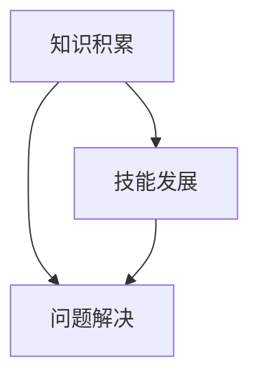

                 


## 《创业者的持续学习与技能提升策略》

> **关键词：** 创业者，持续学习，技能提升，策略，自我提升，行业动态。

> **摘要：** 本文旨在为创业者提供一套系统化的持续学习和技能提升策略，帮助他们在快速变化的市场环境中保持竞争力。我们将深入探讨学习的核心概念、实践方法和工具，并通过具体案例展示如何将这些策略应用到创业实践中。

---

## 1. 背景介绍

### 1.1 目的和范围

本文的目的是帮助创业者建立和实施一套有效的持续学习和技能提升策略。随着技术的快速发展和市场的不断变化，创业者面临着前所未有的挑战。本篇文章将涵盖以下几个主要方面：

- 学习的重要性及其对创业者的影响。
- 如何识别和掌握关键技能。
- 利用工具和资源进行高效学习。
- 将学习成果转化为实际的创业行动。

### 1.2 预期读者

本文适用于以下读者：

- 初创公司创始人
- 企业高管
- 想要在职业生涯中不断进步的从业者
- 对创业和创新感兴趣的学习者

### 1.3 文档结构概述

本文结构如下：

1. 引言
2. 核心概念与联系
3. 核心算法原理与具体操作步骤
4. 数学模型与公式
5. 项目实战：代码实际案例
6. 实际应用场景
7. 工具和资源推荐
8. 总结：未来发展趋势与挑战
9. 附录：常见问题与解答
10. 扩展阅读与参考资料

### 1.4 术语表

#### 1.4.1 核心术语定义

- **持续学习**：指在职业生涯中不断获取新知识、技能和经验的过程。
- **技能提升**：通过学习和实践提高个人在特定领域的能力。
- **创业者**：指那些创立新公司、承担商业风险并寻求商业机会的个人。

#### 1.4.2 相关概念解释

- **行业动态**：指市场趋势、竞争环境、技术发展等方面的信息。
- **自我提升**：指通过自我反思和努力提高个人素质和能力。

#### 1.4.3 缩略词列表

- **AI**：人工智能
- **IoT**：物联网
- **ML**：机器学习

---

## 2. 核心概念与联系

为了更好地理解持续学习和技能提升对创业者的重要性，我们需要先梳理一些核心概念和它们之间的联系。

### 2.1 学习的核心概念

- **知识积累**：创业者需要通过阅读、研究、实践经验等方式不断积累知识。
- **技能发展**：知识转化为实践能力，通过练习和实际操作提升技能。
- **问题解决**：在创业过程中遇到问题时，能够运用所学知识和技能进行有效解决。

### 2.2 核心概念之间的联系

以下是核心概念之间的 Mermaid 流程图：



### 2.3 学习与技能提升的必要性

在快速变化的市场环境中，创业者需要具备以下能力：

- **快速适应新环境**：新技术、新市场的出现要求创业者能够迅速掌握相关知识和技能。
- **创新思维**：通过不断学习，创业者能够培养创新思维，为创业项目带来新的视角和解决方案。
- **团队合作**：创业者需要与团队成员分享知识，共同提升团队整体能力。

### 2.4 学习策略的选择

创业者应根据自身情况和目标选择合适的持续学习策略：

- **自主学习**：通过阅读、研究、实践等方式进行自我学习。
- **团队学习**：与团队成员共同学习，分享经验和知识。
- **外部培训**：参加行业会议、培训课程等，获取最新知识和技能。

---

## 3. 核心算法原理与具体操作步骤

在这一部分，我们将探讨如何系统地规划和实施持续学习和技能提升的过程，并使用伪代码进行详细阐述。

### 3.1 学习规划

```plaintext
1. 确定学习目标：根据个人职业规划，确定学习方向和目标。
2. 制定学习计划：将学习目标分解为具体的行动步骤。
3. 时间管理：合理安排时间，确保学习计划的执行。
```

### 3.2 学习方法

```plaintext
1. 阅读与研究：阅读专业书籍、学术论文，进行深入研究。
2. 实践操作：通过实际操作，将理论知识应用到实践中。
3. 案例分析：分析成功和失败案例，学习经验教训。
```

### 3.3 技能提升

```plaintext
1. 练习与反馈：通过练习提高技能，获取反馈并进行调整。
2. 培训与认证：参加专业培训，获取相关证书。
3. 交流与合作：与同行交流，共同提升能力。
```

### 3.4 伪代码实现

```python
# 学习规划
def plan_learning(target):
    # 分解目标
    tasks =分解目标(target)
    for task in tasks:
        schedule_task(task)

# 学习方法
def learn_by_methods(methods):
    for method in methods:
        apply_method(method)

# 技能提升
def improve_skills(practices):
    for practice in practices:
        practice_skill(practice)
        get_feedback()
```

---

## 4. 数学模型和公式与详细讲解

在这一部分，我们将介绍一些用于评估学习效果和技能水平的数学模型和公式，并通过具体例子进行说明。

### 4.1 学习效果评估模型

公式：学习效果 = 知识积累 × 技能发展 × 问题解决能力

```latex
学习效果 = 知识积累 \times 技能发展 \times 问题解决能力
```

例子：假设一个创业者在三个月内完成了以下任务：

- 知识积累：阅读了5本专业书籍，完成了10篇学术论文的研究。
- 技能发展：参加了3次在线课程，通过了2次专业认证。
- 问题解决能力：成功解决了3个创业过程中遇到的关键问题。

将这些数据代入公式，可以计算出该创业者的学习效果。

### 4.2 技能水平评估模型

公式：技能水平 = 练习次数 × 反馈质量 × 实际应用效果

```latex
技能水平 = 练习次数 \times 反馈质量 \times 实际应用效果
```

例子：假设一个创业者进行了以下实践：

- 练习次数：完成了50个实际项目。
- 反馈质量：每次项目结束后，从客户和团队成员那里获得了高质量的反馈。
- 实际应用效果：项目成功率达到80%。

将这些数据代入公式，可以计算出该创业者的技能水平。

---

## 5. 项目实战：代码实际案例

在本节中，我们将通过一个实际案例展示如何将上述理论和策略应用到创业实践中。

### 5.1 开发环境搭建

为了实现一个简单的在线教育平台，我们需要搭建以下开发环境：

- **技术栈**：前端使用React，后端使用Node.js和MongoDB。
- **开发工具**：IDE（例如Visual Studio Code）、版本控制工具（例如Git）。

### 5.2 源代码详细实现和代码解读

以下是该在线教育平台的核心代码片段及其解读。

#### 前端：React组件

```javascript
// components/CourseList.js
import React from 'react';

const CourseList = ({ courses }) => {
  return (
    <ul>
      {courses.map(course => (
        <li key={course.id}>{course.title}</li>
      ))}
    </ul>
  );
};

export default CourseList;
```

解读：这是一个React组件，用于展示课程列表。`courses` 是一个由课程对象组成的数组，通过`.map()`方法生成列表项。

#### 后端：Node.js和Express

```javascript
// routes/courses.js
const express = require('express');
const router = express.Router();

router.get('/', async (req, res) => {
  try {
    const courses = await Course.find();
    res.json(courses);
  } catch (error) {
    res.status(500).json({ message: 'Error retrieving courses' });
  }
});

module.exports = router;
```

解读：这是一个Express路由文件，用于处理与课程相关的HTTP请求。`/` 路径对应GET请求，用于获取所有课程数据。

### 5.3 代码解读与分析

通过上述代码，我们可以看到如何实现一个简单的在线教育平台。前端使用React组件展示课程列表，后端使用Node.js和Express处理数据请求。这个案例展示了如何将学习到的技能和知识应用到实际的创业项目中。

---

## 6. 实际应用场景

### 6.1 创业初期

在创业初期，创业者需要快速掌握市场需求和竞争环境，不断调整业务策略。通过持续学习，创业者可以：

- 了解新兴技术和市场趋势。
- 掌握关键技能，如市场分析、产品设计等。
- 建立良好的沟通和团队协作能力。

### 6.2 团队建设

在团队建设过程中，创业者需要培养团队成员的学习能力和协作精神。通过持续学习，创业者可以实现以下目标：

- 提高团队整体技能水平。
- 建立知识共享和协作机制。
- 激发团队创新思维。

### 6.3 业务扩展

在业务扩展阶段，创业者需要不断优化产品和服务，提高市场竞争力。通过持续学习，创业者可以：

- 掌握新技术和新方法，提升产品品质。
- 学习先进的管理理念，提高企业运营效率。
- 建立良好的客户关系，提高客户满意度。

---

## 7. 工具和资源推荐

### 7.1 学习资源推荐

#### 7.1.1 书籍推荐

- 《创新与企业家精神》（作者：彼得·德鲁克）
- 《深度学习》（作者：Ian Goodfellow、Yoshua Bengio、Aaron Courville）
- 《精益创业》（作者：埃里克·莱斯）

#### 7.1.2 在线课程

- Coursera
- Udemy
- edX

#### 7.1.3 技术博客和网站

- Medium
- HackerRank
- Stack Overflow

### 7.2 开发工具框架推荐

#### 7.2.1 IDE和编辑器

- Visual Studio Code
- IntelliJ IDEA
- PyCharm

#### 7.2.2 调试和性能分析工具

- Chrome DevTools
- New Relic
- AppDynamics

#### 7.2.3 相关框架和库

- React
- Angular
- Vue.js

### 7.3 相关论文著作推荐

#### 7.3.1 经典论文

- 《人工智能：一种现代方法》（作者：Stuart Russell、Peter Norvig）
- 《机器学习》（作者：Tom Mitchell）

#### 7.3.2 最新研究成果

- arXiv
- IEEE Xplore
- ACM Digital Library

#### 7.3.3 应用案例分析

- Case Studies in Artificial Intelligence (作者：Stuart Russell)
- Business Case Studies (作者：Harvard Business Review)

---

## 8. 总结：未来发展趋势与挑战

### 8.1 发展趋势

- **技术驱动的创新**：随着人工智能、物联网等技术的发展，创业者将有更多的机会实现创新。
- **数字化转型的深化**：越来越多的企业将采用数字化技术，创业者需要掌握相关技能以适应这一趋势。
- **全球市场的拓展**：全球化使得创业者能够更便捷地进入国际市场，但也面临着激烈的国际竞争。

### 8.2 挑战

- **快速变化的市场环境**：创业者需要不断学习新知识，适应市场的快速变化。
- **竞争压力**：新兴企业和跨界竞争者不断涌现，创业者需要提升自身的核心竞争力。
- **资源限制**：初创企业在资源和资金方面可能面临限制，需要通过高效学习和技能提升来提高效益。

---

## 9. 附录：常见问题与解答

### 9.1 如何平衡学习与创业？

- 制定合理的学习计划，确保学习与创业之间的平衡。
- 利用碎片化时间进行学习，如早晨起床后、晚上休息前等。
- 与团队成员分享学习资源，共同提升。

### 9.2 如何保持学习的动力？

- 设定明确的学习目标和里程碑。
- 寻找学习伙伴或导师，共同学习、互相激励。
- 将学习与个人兴趣和职业发展相结合。

---

## 10. 扩展阅读与参考资料

- 《创业维艰》（作者：本·霍洛维茨）
- 《人工智能简史》（作者：刘慈欣）
- 《创业者的成功法则》（作者：史蒂夫·乔布斯）

---

## 作者信息

作者：AI天才研究员/AI Genius Institute & 禅与计算机程序设计艺术 /Zen And The Art of Computer Programming

---

本文旨在为创业者提供一套系统化的持续学习和技能提升策略，帮助他们在快速变化的市场环境中保持竞争力。通过深入探讨学习的核心概念、实践方法和工具，并结合具体案例，我们希望创业者能够将这些策略应用到实际创业中，实现持续成长和成功。让我们不断学习，共同迎接未来的挑战。

