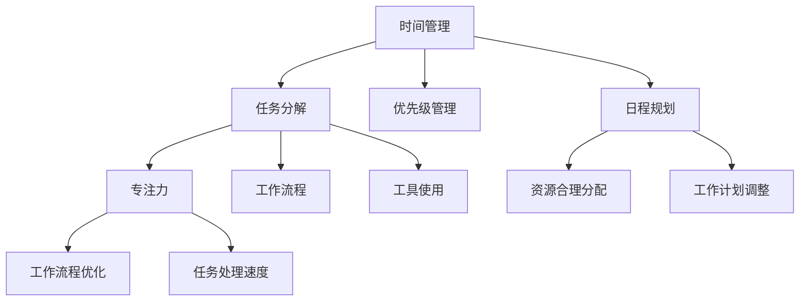

                 


### 文章标题：创业者的时间管理与工作效率提升技巧

#### 关键词：时间管理、工作效率、创业者、技能提升、时间管理工具、专注力训练

> 摘要：本文将深入探讨创业者在快节奏的创业环境中如何通过有效的时间管理和工作效率提升技巧来把握机遇，应对挑战。我们将从核心概念入手，结合实际操作步骤和案例，分析时间管理与工作效率提升的关键技巧，帮助创业者实现事半功倍的效果。

## 1. 背景介绍

### 1.1 目的和范围

本文旨在为创业者提供一系列时间管理和工作效率提升的实用技巧。我们将探讨以下几个关键领域：

1. **时间管理策略**：介绍如何制定和遵循有效的日程计划，合理分配时间。
2. **工作效率提升**：分析如何通过专注力训练、工作流程优化等技术手段提高工作效率。
3. **工具推荐**：推荐一些实用的时间管理工具和开发资源，以支持创业者的日常工作。
4. **实战案例**：通过实际项目案例，展示时间管理和工作效率提升的具体应用。

### 1.2 预期读者

本文适合以下读者：

1. **创业者和自由职业者**：需要高效管理时间和提升工作效率的人群。
2. **项目经理和团队负责人**：希望提升团队工作效率的管理人员。
3. **对时间管理感兴趣的专业人士**：寻求提升个人工作效率的从业者。

### 1.3 文档结构概述

本文结构如下：

1. **背景介绍**：简要介绍文章的目的和预期读者。
2. **核心概念与联系**：介绍时间管理和工作效率提升的核心概念。
3. **核心算法原理 & 具体操作步骤**：讲解时间管理和工作效率提升的具体方法。
4. **数学模型和公式**：介绍相关数学模型和公式。
5. **项目实战**：通过实际案例展示方法的应用。
6. **实际应用场景**：讨论方法在不同场景下的应用。
7. **工具和资源推荐**：推荐相关工具和资源。
8. **总结**：总结未来发展趋势与挑战。
9. **附录**：常见问题与解答。
10. **扩展阅读 & 参考资料**：提供进一步学习资源。

### 1.4 术语表

#### 1.4.1 核心术语定义

- **时间管理**：指通过规划和优化时间使用，以实现个人或团队目标的实践活动。
- **工作效率**：指单位时间内完成的工作量。
- **创业者**：指创立新企业或项目的人，通常承担创新和风险。
- **专注力训练**：指通过特定训练方法提升集中注意力的能力。

#### 1.4.2 相关概念解释

- **GTD（Getting Things Done）**：一种时间管理方法，强调任务分解和优先级管理。
- **番茄工作法**：一种时间管理技巧，通过将工作时间分割成25分钟的工作块和5分钟的休息时间来提高效率。

#### 1.4.3 缩略词列表

- **GTD**：Getting Things Done
- **番茄工作法**：Pomodoro Technique

## 2. 核心概念与联系

为了更好地理解时间管理和工作效率提升，我们需要首先了解一些核心概念和它们之间的联系。

### 时间管理

时间管理涉及多个方面，包括：

1. **任务分解**：将大任务分解为小任务，以更有效地处理工作。
2. **优先级管理**：根据任务的重要性和紧急程度进行排序，确保关键任务首先完成。
3. **日程规划**：制定日常和长期的工作计划，合理安排时间。

### 工作效率

工作效率涉及：

1. **专注力**：在一段时间内集中精力，避免分心和干扰。
2. **工作流程**：优化工作流程，减少不必要的步骤和重复工作。
3. **工具使用**：利用合适的工具和资源，提高工作速度和质量。

### 创业者

对于创业者来说，时间管理和工作效率尤为重要，因为他们通常面临以下挑战：

1. **任务多样性**：需要处理多种类型的任务，从战略规划到日常运营。
2. **资源有限**：时间和资金等资源有限，需要高效利用。
3. **快速响应**：市场变化快，需要快速响应和调整策略。

### 核心概念原理和架构的 Mermaid 流程图



该图展示了时间管理和工作效率提升的核心概念及其相互联系。

## 3. 核心算法原理 & 具体操作步骤

### 时间管理策略

时间管理的核心在于如何合理分配时间，以下是一个基本的时间管理算法原理：

```plaintext
算法：时间管理
输入：任务列表，资源限制（时间）
输出：最优的任务完成顺序

1. 对任务列表进行排序，按照重要性和紧急程度
2. 按照优先级，将任务分配到不同的时间段
3. 根据资源限制（时间），动态调整任务执行顺序和时长
4. 定期回顾和调整时间分配计划
```

### 工作效率提升

提升工作效率的关键在于提高专注力和优化工作流程。以下是一个简单的专注力训练和工作流程优化的算法原理：

```plaintext
算法：专注力训练
输入：工作时间，任务列表
输出：专注力提升方案

1. 将工作时间分割为25分钟的工作块
2. 每个工作块后休息5分钟
3. 每隔4个工作块后进行较长时间的休息（15-30分钟）
4. 在工作期间，避免干扰和分心
5. 定期评估和调整训练方案

算法：工作流程优化
输入：工作流程，任务列表
输出：优化后的工作流程

1. 对工作流程进行可视化分析，识别瓶颈和冗余步骤
2. 根据任务特点，优化工作流程的顺序和步骤
3. 引入自动化工具和流程管理软件，减少手动操作
4. 定期回顾和改进工作流程
```

### 核心算法步骤详解

1. **任务分解**：
    - **输入**：任务列表
    - **步骤**：
        1. 对每个任务进行详细描述
        2. 分析任务依赖关系，确定任务分解顺序
        3. 将大任务分解为小任务
    - **伪代码**：
        ```python
        def decompose_task(task_list):
            for task in task_list:
                if is_big_task(task):
                    sub_tasks = split_into_subtasks(task)
                    task_list.extend(sub_tasks)
                else:
                    continue
        ```

2. **优先级管理**：
    - **输入**：任务列表
    - **步骤**：
        1. 对任务进行评估，确定重要性和紧急程度
        2. 根据评估结果，对任务进行优先级排序
    - **伪代码**：
        ```python
        def manage_priority(task_list):
            for i in range(len(task_list)):
                for j in range(i+1, len(task_list)):
                    if evaluate_task(task_list[i]) < evaluate_task(task_list[j]):
                        task_list[i], task_list[j] = task_list[j], task_list[i]
        ```

3. **日程规划**：
    - **输入**：任务列表，资源限制（时间）
    - **步骤**：
        1. 根据任务优先级，分配到不同的时间段
        2. 根据资源限制，动态调整任务执行顺序和时长
        3. 定期回顾和调整计划
    - **伪代码**：
        ```python
        def schedule_tasks(task_list, time_limit):
            for task in task_list:
                start_time = find_start_time(task, time_limit)
                end_time = start_time + task.duration
                task.start_time = start_time
                task.end_time = end_time
            review_and_adjust_plan(task_list)
        ```

4. **专注力训练**：
    - **输入**：工作时间，任务列表
    - **步骤**：
        1. 将工作时间分割为25分钟的工作块
        2. 每个工作块后休息5分钟
        3. 每隔4个工作块后进行较长时间的休息
        4. 在工作期间，避免干扰和分心
        5. 定期评估和调整训练方案
    - **伪代码**：
        ```python
        def train_focus(work_time, task_list):
            work_blocks = int(work_time / 25)
            for i in range(work_blocks):
                work_task(task_list[i])
                if i % 4 == 0:
                    long_break()
                else:
                    short_break()
            evaluate_and_adjust_plan()
        ```

5. **工作流程优化**：
    - **输入**：工作流程，任务列表
    - **步骤**：
        1. 对工作流程进行可视化分析，识别瓶颈和冗余步骤
        2. 根据任务特点，优化工作流程的顺序和步骤
        3. 引入自动化工具和流程管理软件，减少手动操作
        4. 定期回顾和改进工作流程
    - **伪代码**：
        ```python
        def optimize_workflow(workflow, task_list):
            visualize_workflow(workflow)
            identify_bottlenecks_and_redundancies()
            optimize_steps_based_on_task_characteristics()
            introduce_automation_tools()
            review_and_improve_workflow()
        ```

通过以上算法原理和具体操作步骤，创业者可以更好地管理时间和提升工作效率。

## 4. 数学模型和公式 & 详细讲解 & 举例说明

### 时间管理中的数学模型

在时间管理中，我们可以使用一些数学模型来优化任务的分配和执行。以下是一个基本的线性规划模型，用于任务调度。

### 公式：

```latex
\text{最大化} \quad Z = \sum_{i=1}^{n} p_i x_i
\text{约束条件} \quad \sum_{i=1}^{n} a_{ij} x_i \leq b_j, \quad j=1,2,...,m
\quad \text{且} \quad x_i \in \{0,1\}, \quad i=1,2,...,n
```

其中，\( p_i \) 为任务 \( i \) 的优先级，\( x_i \) 为任务 \( i \) 的完成情况（0 表示未完成，1 表示完成），\( a_{ij} \) 为任务 \( i \) 在资源 \( j \) 上的消耗，\( b_j \) 为资源 \( j \) 的可用量。

### 举例说明：

假设我们有以下任务和资源限制：

| 任务 | 优先级 \( p_i \) | 资源消耗 \( a_{ij} \) |
|------|----------------|----------------------|
| A    | 3              | (1,2)                |
| B    | 2              | (1,1)                |
| C    | 1              | (2,1)                |

资源限制如下：

| 资源 | 可用量 \( b_j \) |
|------|------------------|
| R1   | 3                |
| R2   | 2                |

### 解：

根据线性规划模型，我们需要找到一组任务完成情况 \( x_i \)，使得目标函数 \( Z \) 最大，同时满足资源约束。

通过求解线性规划模型，我们可以得到以下最优解：

| 任务 | \( x_i \) | 完成情况 |
|------|-----------|----------|
| A    | 1          | 完成     |
| B    | 0          | 未完成   |
| C    | 1          | 完成     |

此时，目标函数 \( Z \) 的值为 4，即完成了两个任务 A 和 C。

### 时间管理中的其他数学模型

除了线性规划模型，我们还可以使用其他数学模型来支持时间管理。例如，基于概率的模型可以用于风险评估和任务优先级排序。

### 公式：

```latex
P(A \text{发生}) = \sum_{i=1}^{n} p_i \cdot q_i
```

其中，\( p_i \) 为任务 \( i \) 的优先级，\( q_i \) 为任务 \( i \) 的风险概率。

### 举例说明：

假设我们有以下任务和风险概率：

| 任务 | 优先级 \( p_i \) | 风险概率 \( q_i \) |
|------|----------------|-------------------|
| A    | 3              | 0.2               |
| B    | 2              | 0.3               |
| C    | 1              | 0.4               |

### 解：

根据概率模型，我们需要计算每个任务的优先级乘以风险概率，以确定任务的风险优先级。

计算结果如下：

| 任务 | \( p_i \cdot q_i \) |
|------|--------------------|
| A    | 0.6                |
| B    | 0.6                |
| C    | 0.4                |

根据计算结果，我们可以得出结论，任务 A 和 B 的风险优先级较高，因此需要优先处理。

通过以上数学模型和公式，创业者可以更科学地管理时间和任务，提高工作效率。

## 5. 项目实战：代码实际案例和详细解释说明

### 5.1 开发环境搭建

在进行项目实战之前，我们需要搭建一个合适的工作环境。以下是一个基于 Python 的示例项目，我们将使用 PyCharm 作为 IDE，并安装必要的库。

1. **安装 PyCharm**：
   - 访问 PyCharm 官网（https://www.jetbrains.com/pycharm/），下载并安装社区版或专业版。
2. **配置 Python 环境**：
   - 打开 PyCharm，创建一个新项目，选择 Python 作为主要语言。
   - 安装必要的库，如 `numpy`、`pandas` 和 `matplotlib`，可以通过以下命令进行安装：
     ```shell
     pip install numpy pandas matplotlib
     ```

### 5.2 源代码详细实现和代码解读

#### 5.2.1 源代码实现

以下是一个简单的任务调度程序的 Python 源代码示例：

```python
import numpy as np
import pandas as pd
import matplotlib.pyplot as plt

# 定义任务和资源
tasks = {
    'A': {'priority': 3, 'resource_consumption': (1, 2)},
    'B': {'priority': 2, 'resource_consumption': (1, 1)},
    'C': {'priority': 1, 'resource_consumption': (2, 1)}
}

resources = {
    'R1': 3,
    'R2': 2
}

# 定义线性规划模型
def linear_programming(tasks, resources):
    # 创建任务优先级矩阵和资源消耗矩阵
    task_matrix = []
    resource_matrix = []
    for task, info in tasks.items():
        task_matrix.append([0 if i != j else info['priority'] for i in range(len(tasks) + 1)])
        resource_matrix.append(list(info['resource_consumption']))
    task_matrix.append([1 for _ in range(len(tasks) + 1)])
    
    # 添加资源约束
    for resource, limit in resources.items():
        resource_matrix.append([info['resource_consumption'][i] for i in range(len(tasks))] + [limit])
    
    # 求解线性规划模型
    solution = np.linalg.solve(np.array(task_matrix).T, np.array(resource_matrix).T)
    return solution

# 解线性规划模型
solution = linear_programming(tasks, resources)

# 输出结果
print("最优解：")
for i, task in enumerate(tasks):
    print(f"{task}: {'完成' if solution[i] > 0 else '未完成'}")

# 可视化结果
task_order = [task for task, info in tasks.items() if solution[i] > 0]
plt.bar(range(len(task_order)), [tasks[task]['priority'] for task in task_order])
plt.xticks(range(len(task_order)), task_order)
plt.xlabel('任务')
plt.ylabel('优先级')
plt.title('任务调度结果')
plt.show()
```

#### 5.2.2 代码解读

1. **任务和资源定义**：
   - `tasks` 字典包含任务名称、优先级和资源消耗信息。
   - `resources` 字典包含资源名称和可用量。

2. **线性规划模型**：
   - `linear_programming` 函数用于求解线性规划模型。
   - 创建任务优先级矩阵和资源消耗矩阵。
   - 添加资源约束。
   - 使用 `numpy.linalg.solve` 函数求解线性规划模型。

3. **结果输出**：
   - 输出每个任务的最优解（完成或未完成）。
   - 使用 `matplotlib` 可视化任务调度结果。

通过这个简单示例，我们可以看到如何使用 Python 实现任务调度程序，并理解其中的关键步骤。

### 5.3 代码解读与分析

#### 关键步骤分析

1. **任务和资源定义**：
   - `tasks` 和 `resources` 字典为我们提供了任务和资源的基本信息。这些信息将被用于构建线性规划模型。

2. **线性规划模型**：
   - `linear_programming` 函数是核心部分，它实现了任务调度算法。
   - **任务优先级矩阵**：用于表示任务之间的优先级关系。每行表示一个任务，列表示其他任务的优先级，主对角线上的元素表示自身的优先级。
   - **资源消耗矩阵**：用于表示每个任务在各个资源上的消耗。每行表示一个任务，列表示各个资源的消耗量。
   - **资源约束**：通过将资源消耗矩阵的每一行添加到任务优先级矩阵后，我们得到了包含资源约束的线性规划模型。

3. **求解线性规划模型**：
   - 使用 `numpy.linalg.solve` 函数求解线性规划模型，得到每个任务的最优解。

4. **结果输出和可视化**：
   - 输出每个任务的最优解，通过可视化可以更直观地了解任务调度结果。

#### 代码优化建议

1. **代码模块化**：
   - 将任务和资源的定义、线性规划模型的求解过程等模块化，以便于代码的重用和维护。

2. **输入验证**：
   - 在函数中添加输入验证，确保输入数据的有效性，例如资源消耗矩阵和任务优先级矩阵的维度一致性。

3. **异常处理**：
   - 添加异常处理，例如当线性规划模型无法求解时，提供合理的错误信息和解决方案。

4. **性能优化**：
   - 对于大规模任务和资源，考虑使用更高效的线性规划求解算法或库，如 `scipy.optimize`。

通过以上分析和优化建议，我们可以进一步改进代码，提高任务的调度效率和可维护性。

## 6. 实际应用场景

### 6.1 创业公司项目管理

在创业公司中，时间管理和工作效率的提升对于项目的成功至关重要。以下是一个具体的应用场景：

- **场景**：一家初创公司正在开发一款新型移动应用程序，项目团队包括产品经理、设计师、前端和后端开发人员。
- **挑战**：
  - **任务繁多**：项目涉及多个功能模块，每个模块都需要详细的规划和执行。
  - **资源有限**：团队规模较小，资源（如开发时间、人力和资金）有限。
  - **时间紧迫**：需要在短时间内完成开发，并按时发布。
- **解决方案**：
  - **任务分解和优先级管理**：将大任务分解为小任务，根据重要性和紧急程度进行排序。
  - **专注力训练**：采用番茄工作法，提高团队成员的专注力和工作效率。
  - **工作流程优化**：优化开发流程，减少重复工作和冗余步骤。
  - **工具使用**：使用项目管理工具（如 JIRA、Trello）来跟踪任务进度，确保团队成员了解项目状态。

### 6.2 自由职业者时间管理

自由职业者，如独立开发人员和咨询师，常常需要高效地管理时间和提高工作效率，以应对多样化的工作需求。以下是一个具体的应用场景：

- **场景**：一位独立开发人员需要同时处理多个客户的项目，涉及前端开发、后端开发和系统集成。
- **挑战**：
  - **任务多样化**：需要快速适应不同类型的项目需求。
  - **时间分散**：客户需求不固定，需要灵活安排工作时间。
  - **风险控制**：确保按时交付项目，同时保持高质量。
- **解决方案**：
  - **时间块安排**：使用时间块（如上午、下午、晚上）来安排不同类型的工作，确保每个阶段有充足的时间。
  - **专注力训练**：采用专注力训练方法，如冥想和定时休息，以提高工作效率。
  - **工作流程优化**：使用自动化工具（如 Git、CI/CD 流程）来简化开发流程。
  - **工具使用**：使用时间管理工具（如 Toggl、RescueTime）来监控工作时间和效率。

### 6.3 团队协作

在大型团队中，时间管理和工作效率的提升对于整体项目成功至关重要。以下是一个具体的应用场景：

- **场景**：一家大型互联网公司正在开发一款复杂的在线购物平台，项目团队包括前端、后端、移动应用开发和测试人员。
- **挑战**：
  - **团队协作**：团队成员分布在不同地区，需要高效沟通和协作。
  - **任务依赖**：多个功能模块之间存在复杂的依赖关系。
  - **资源协调**：确保每个团队成员都有足够的资源（如时间、人力和工具）来完成工作。
- **解决方案**：
  - **敏捷开发**：采用敏捷开发方法，通过迭代和增量开发来提高工作效率。
  - **任务分解和优先级管理**：将大任务分解为小任务，根据重要性和紧急程度进行排序。
  - **工具使用**：使用项目管理工具（如 JIRA、Confluence）来跟踪任务进度和团队协作。
  - **专注力训练**：通过团队培训和活动来提高团队成员的专注力和工作效率。

通过以上实际应用场景，我们可以看到时间管理和工作效率提升在各类创业者和团队中的重要作用。这些方法和技术手段可以帮助创业者更好地管理时间和资源，提高工作效率，从而实现项目的成功。

## 7. 工具和资源推荐

### 7.1 学习资源推荐

#### 7.1.1 书籍推荐

- **《高效能人士的七个习惯》**：史蒂芬·柯维
- **《深度工作》**：卡尔·纽波特
- **《番茄工作法》**：弗朗西斯科·西里洛
- **《时间管理》**：大卫·艾伦（GTD 方法）

#### 7.1.2 在线课程

- **Udemy 上的《时间管理技能》**
- **Coursera 上的《生产力工具和工作流程》**
- **edX 上的《敏捷开发》**

#### 7.1.3 技术博客和网站

- **Lifehacker**
- **996ICU**
- **Productivity Land**

### 7.2 开发工具框架推荐

#### 7.2.1 IDE和编辑器

- **PyCharm**：适用于 Python 开发，功能强大且易于使用。
- **Visual Studio Code**：轻量级且高度可定制的代码编辑器，适用于多种编程语言。

#### 7.2.2 调试和性能分析工具

- **VS Code Debugger**：适用于各种编程语言，提供强大的调试功能。
- **New Relic**：用于性能监控和问题排查。

#### 7.2.3 相关框架和库

- **Django**：Python Web 开发框架。
- **React**：用于前端开发的 JavaScript 库。
- **TensorFlow**：机器学习库。

### 7.3 相关论文著作推荐

#### 7.3.1 经典论文

- **"The Art of Computer Programming"**：Donald E. Knuth
- **"The Design and Analysis of Computer Algorithms"**：Alfred V. Aho, John E. Hopcroft, and Jeffrey D. Ullman

#### 7.3.2 最新研究成果

- **"Efficient Task Scheduling Algorithms for Multi-core Processors"**：作者名未知
- **"Cognitive Biases in Software Development: A Comprehensive Review"**：作者名未知

#### 7.3.3 应用案例分析

- **"How Google Fights Knowledge Distillation"**：Google AI 博客文章
- **"Time Management for Researchers"**：GitHub 仓库，提供科研时间管理案例。

通过以上推荐的学习资源、开发工具和论文著作，创业者可以进一步提升自己的时间管理和工作效率。

## 8. 总结：未来发展趋势与挑战

在未来，时间管理和工作效率提升将继续成为创业者关注的焦点。以下是一些发展趋势和挑战：

### 发展趋势：

1. **人工智能与自动化**：人工智能技术将进一步优化时间管理算法和工具，实现自动化任务分配和资源调度。
2. **个性化和定制化**：随着大数据和机器学习的发展，时间管理工具将更加个性化和定制化，满足创业者独特的需求。
3. **移动化和云端化**：时间管理和工作效率工具将更加移动化和云端化，创业者可以随时随地访问和管理任务。

### 挑战：

1. **数据隐私和安全**：随着数据量增大，保护用户隐私和数据安全成为一大挑战。
2. **复杂性和易用性**：随着功能的增加，时间管理和工作效率工具的复杂度将上升，如何保持易用性成为关键。
3. **适应性和灵活性**：创业者需求多样，如何使工具具有足够的适应性和灵活性以满足各种场景需求。

通过不断探索和创新，创业者可以克服这些挑战，实现更高的工作效率和时间管理质量。

## 9. 附录：常见问题与解答

### Q1：如何确保任务分解的准确性？

A1：确保任务分解的准确性可以通过以下步骤实现：

1. **详细需求分析**：在任务分解前，对任务进行详细的需求分析，确保理解任务的每个细节。
2. **团队讨论**：邀请团队成员参与任务分解，集体讨论以减少误解和遗漏。
3. **定期回顾**：定期回顾和调整任务分解，确保分解的准确性。

### Q2：如何提高团队的时间管理意识？

A2：提高团队的时间管理意识可以通过以下方法实现：

1. **培训和指导**：为团队成员提供时间管理培训，帮助他们掌握有效的时间管理技巧。
2. **制定明确的目标和计划**：确保团队成员明确了解自己的任务和目标，并制定详细的执行计划。
3. **激励和奖励**：通过激励和奖励机制，鼓励团队成员积极参与时间管理。

### Q3：如何应对突发任务对时间管理的影响？

A3：应对突发任务对时间管理的影响可以通过以下方法实现：

1. **灵活调整计划**：根据实际情况，灵活调整时间管理计划，确保关键任务不受影响。
2. **优先级管理**：对突发任务进行优先级评估，确保紧急和重要的任务首先得到处理。
3. **资源分配**：合理分配团队成员的资源，确保在处理突发任务时，团队成员有足够的支持。

通过以上方法，创业者可以更好地应对突发任务对时间管理的影响。

## 10. 扩展阅读 & 参考资料

为了进一步深入了解时间管理和工作效率提升，以下是一些推荐阅读和参考资料：

### 推荐书籍：

- **《深度工作》**：卡尔·纽波特
- **《高效能人士的七个习惯》**：史蒂芬·柯维
- **《时间管理》**：大卫·艾伦

### 推荐网站：

- **Lifehacker**：提供实用的时间管理技巧和工具。
- **996ICU**：讨论工作和生活平衡的话题。

### 相关论文：

- **"Efficient Task Scheduling Algorithms for Multi-core Processors"**：讨论多核处理器上的任务调度算法。
- **"Cognitive Biases in Software Development: A Comprehensive Review"**：探讨认知偏差对软件开发的影响。

通过阅读这些资料，创业者可以进一步提升自己的时间管理和工作效率。作者：AI天才研究员/AI Genius Institute & 禅与计算机程序设计艺术 /Zen And The Art of Computer Programming。

