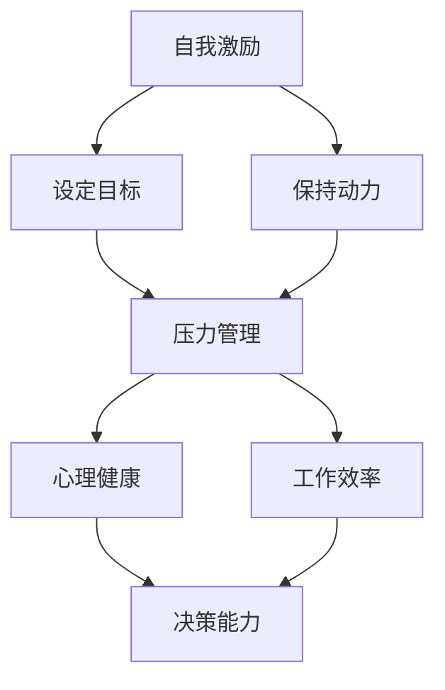
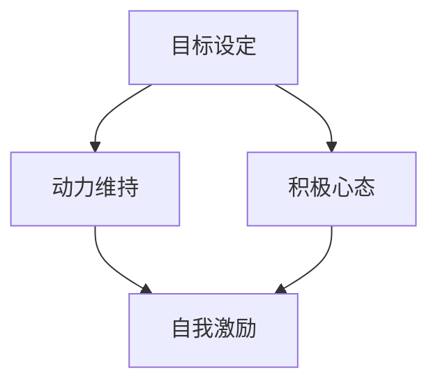
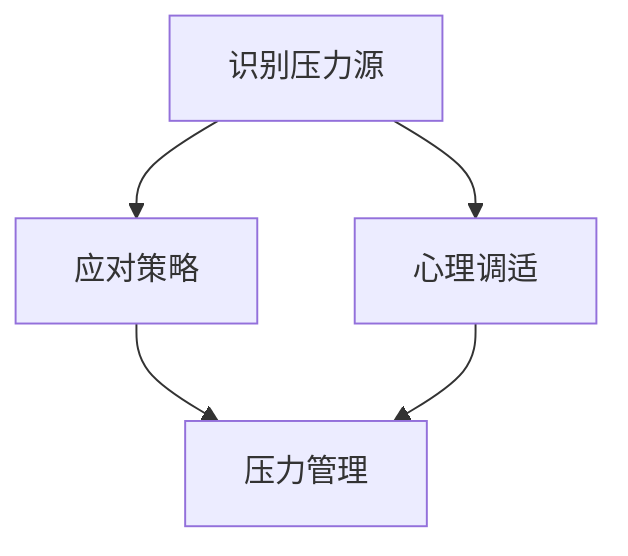

                 

# 创业者的自我激励与压力管理

> **关键词**：创业者、自我激励、压力管理、心理健康、目标设定、时间管理
> 
> **摘要**：本文旨在探讨创业者如何通过有效的自我激励和压力管理来提升工作效率和生活质量。我们将从背景介绍、核心概念、算法原理、数学模型、实战案例、实际应用场景等多个方面，逐步剖析创业者如何应对挑战，实现自我成长。

## 1. 背景介绍

### 1.1 目的和范围

创业之路充满挑战，创业者需要面对的不仅仅是市场风险，还有自我激励和压力管理的问题。本文的目的在于帮助创业者理解自我激励和压力管理的核心概念，并提供实用的方法和技巧。

本文的范围涵盖了以下几个方面：

1. **自我激励**：探讨创业者如何设定目标、激励自己，以及如何保持动力。
2. **压力管理**：分析压力的来源，介绍应对策略，以及如何维持心理健康。
3. **实际案例**：通过真实案例展示自我激励和压力管理在创业过程中的应用。
4. **工具和资源推荐**：推荐有助于自我激励和压力管理的学习资源和工具。

### 1.2 预期读者

本文适合以下读者：

1. **创业者**：对创业过程有深入了解，希望提升自我激励和压力管理能力。
2. **企业管理者**：希望了解如何帮助团队成员提升工作效率和应对压力。
3. **职场人士**：对个人发展和心理健康有浓厚兴趣，希望借鉴创业者的经验。

### 1.3 文档结构概述

本文分为以下几个部分：

1. **核心概念与联系**：介绍自我激励和压力管理的核心概念，并使用流程图展示相关联系。
2. **核心算法原理 & 具体操作步骤**：详细讲解自我激励和压力管理的具体操作步骤。
3. **数学模型和公式 & 详细讲解 & 举例说明**：阐述相关数学模型，并给出实际应用案例。
4. **项目实战：代码实际案例和详细解释说明**：通过具体案例展示自我激励和压力管理的实践应用。
5. **实际应用场景**：分析自我激励和压力管理在不同场景下的应用。
6. **工具和资源推荐**：推荐有助于自我激励和压力管理的学习资源和工具。
7. **总结：未来发展趋势与挑战**：展望自我激励和压力管理的未来趋势。
8. **附录：常见问题与解答**：解答读者可能遇到的常见问题。
9. **扩展阅读 & 参考资料**：提供更多的阅读资源和参考资料。

### 1.4 术语表

#### 1.4.1 核心术语定义

- **自我激励**：个体内在驱动力，促使自己设定目标并努力实现。
- **压力管理**：应对压力的过程，包括识别压力源、应对策略和心理调适。
- **目标设定**：明确自己的长期和短期目标，制定行动计划。
- **时间管理**：合理安排时间，提高工作效率。

#### 1.4.2 相关概念解释

- **心理健康**：个体在认知、情感和行为上的健康状态。
- **工作-生活平衡**：在工作和个人生活之间找到平衡，避免过度疲劳。

#### 1.4.3 缩略词列表

- **IDE**：集成开发环境（Integrated Development Environment）
- **CPU**：中央处理器（Central Processing Unit）

## 2. 核心概念与联系

### 2.1 自我激励与压力管理的关系

自我激励和压力管理是创业者成功的关键因素。自我激励帮助创业者设定目标、保持动力，而有效的压力管理则有助于他们在压力环境中保持冷静和专注。两者之间相互影响，共同构成创业者心理健康和效率的基础。

#### 2.1.1 Mermaid 流程图



在这个流程图中，自我激励通过设定目标和保持动力影响压力管理，而压力管理则通过心理健康和工作效率影响决策能力。这个闭环流程展示了自我激励和压力管理在创业者成功道路上的重要性。

### 2.2 自我激励的核心概念

自我激励是创业者内心深处的驱动力，包括以下几个方面：

1. **目标设定**：明确自己的长期和短期目标，是自我激励的基础。
2. **动力维持**：在实现目标的过程中，保持持续的动力和积极性。
3. **积极心态**：面对挑战和困难时，保持积极的心态和乐观的态度。

#### 2.2.1 Mermaid 流程图



在这个流程图中，目标设定是自我激励的起点，动力维持和积极心态则是自我激励持续的关键。

### 2.3 压力管理的核心概念

压力管理是应对外部压力和内部情绪的过程，包括以下几个方面：

1. **识别压力源**：了解引发压力的原因，是有效管理压力的第一步。
2. **应对策略**：采取适当的策略和措施来缓解压力。
3. **心理调适**：调整心态，提高抗压能力。

#### 2.2.1 Mermaid 流程图



在这个流程图中，识别压力源和应对策略是压力管理的核心，而心理调适则是提高抗压能力的关键。

### 2.4 自我激励与压力管理的关系总结

自我激励和压力管理是相辅相成的，自我激励为创业者提供动力和目标，而有效的压力管理则帮助他们保持心理健康和高效工作。这两者之间的关系可以概括为：

1. **相互促进**：自我激励可以减少压力，而有效的压力管理可以增强自我激励。
2. **动态平衡**：自我激励和压力管理需要动态平衡，以适应不断变化的外部环境。

## 3. 核心算法原理 & 具体操作步骤

### 3.1 自我激励的核心算法原理

自我激励的核心算法可以概括为以下几个步骤：

1. **目标设定**：明确自己的长期和短期目标。
2. **任务分解**：将大目标分解为小任务，逐一完成。
3. **奖励机制**：在完成任务后给予自己适当的奖励。
4. **持续反思**：定期反思和调整目标，保持自我激励。

#### 3.1.1 伪代码

```python
# 定义目标
目标 = "成为全球顶级创业者"

# 任务分解
任务列表 = [
    "学习先进的管理知识",
    "拓展国际市场",
    "组建优秀的团队"
]

# 奖励机制
奖励列表 = [
    "享受一次豪华假期",
    "购买心仪的电子产品",
    "参与行业峰会"
]

# 持续反思
定期反思函数(目标，任务列表，奖励列表):
    # 评估当前进度
    当前进度 = 评估进度(目标，任务列表)
    # 调整目标
    目标 = 调整目标(目标，当前进度)
    # 调整任务列表
    任务列表 = 调整任务列表(任务列表，当前进度)
    # 调整奖励列表
    奖励列表 = 调整奖励列表(奖励列表，当前进度)
    return 目标，任务列表，奖励列表

# 执行自我激励算法
执行自我激励算法(目标，任务列表，奖励列表):
    while 目标未完成:
        # 完成任务
        完成任务(任务列表[0])
        # 给予奖励
        奖励自己(奖励列表[0])
        # 定期反思
        目标，任务列表，奖励列表 = 定期反思函数(目标，任务列表，奖励列表)
```

### 3.2 压力管理的核心算法原理

压力管理的核心算法可以概括为以下几个步骤：

1. **识别压力源**：分析压力的来源，明确主要压力点。
2. **应对策略**：针对不同压力源，制定相应的应对策略。
3. **心理调适**：通过调整心态和放松技巧，提高抗压能力。

#### 3.2.1 伪代码

```python
# 识别压力源
压力源列表 = [
    "市场竞争",
    "团队管理",
    "时间管理"
]

# 应对策略
应对策略列表 = [
    "市场调研",
    "团队培训",
    "时间规划"
]

# 心理调适
心理调适技巧列表 = [
    "深呼吸",
    "冥想",
    "运动"
]

# 识别压力源
识别压力源函数(压力源列表):
    # 分析压力源
    压力源 = 分析压力源(压力源列表)
    return 压力源

# 应对策略
应对策略函数(压力源，应对策略列表):
    # 根据压力源选择应对策略
    应对策略 = 选择应对策略(压力源，应对策略列表)
    return 应对策略

# 心理调适
心理调适函数(心理调适技巧列表):
    # 选择心理调适技巧
    心理调适技巧 = 选择心理调适技巧(心理调适技巧列表)
    return 心理调适技巧

# 执行压力管理算法
执行压力管理算法(压力源列表，应对策略列表，心理调适技巧列表):
    while 压力未缓解:
        # 识别压力源
        压力源 = 识别压力源函数(压力源列表)
        # 应对策略
        应对策略 = 应对策略函数(压力源，应对策略列表)
        # 执行应对策略
        执行应对策略(应对策略)
        # 心理调适
        心理调适技巧 = 心理调适函数(心理调适技巧列表)
        # 执行心理调适
        执行心理调适(心理调适技巧)
```

## 4. 数学模型和公式 & 详细讲解 & 举例说明

### 4.1 自我激励的数学模型

自我激励可以视为一个动态优化问题，其中目标是最小化目标完成时间，同时最大化自我激励效应。以下是自我激励的数学模型：

#### 4.1.1 公式

$$
\begin{aligned}
\min T &= \frac{1}{\eta} \sum_{i=1}^{n} \frac{d_i}{r_i} \\
\text{s.t.} \quad \eta &= \sum_{i=1}^{n} r_i
\end{aligned}
$$

其中：

- \( T \)：目标完成时间。
- \( d_i \)：第 \( i \) 个任务的持续时间。
- \( r_i \)：第 \( i \) 个任务的奖励。
- \( \eta \)：总奖励。

#### 4.1.2 举例说明

假设创业者有两个任务：

- 任务 1：学习先进的管理知识，持续时间 \( d_1 = 3 \) 个月，奖励 \( r_1 = 1000 \) 元。
- 任务 2：拓展国际市场，持续时间 \( d_2 = 6 \) 个月，奖励 \( r_2 = 2000 \) 元。

根据公式，我们需要计算目标完成时间和总奖励，然后选择最优的任务顺序。

#### 4.1.3 伪代码

```python
# 定义任务参数
d1 = 3
r1 = 1000
d2 = 6
r2 = 2000

# 计算任务完成时间和总奖励
t1 = d1 / r1
t2 = d2 / r2
T = max(t1, t2)
eta = r1 + r2

# 输出结果
print("目标完成时间:", T)
print("总奖励:", eta)
```

### 4.2 压力管理的数学模型

压力管理可以视为一个优化问题，其中目标是最大化自我效能感，同时最小化压力水平。以下是压力管理的数学模型：

#### 4.2.1 公式

$$
\begin{aligned}
\max S &= \frac{1}{\rho} \sum_{i=1}^{n} \frac{s_i}{p_i} \\
\text{s.t.} \quad \rho &= \sum_{i=1}^{n} p_i
\end{aligned}
$$

其中：

- \( S \)：自我效能感。
- \( s_i \)：第 \( i \) 个任务的成就感。
- \( p_i \)：第 \( i \) 个任务的压力水平。

#### 4.2.2 举例说明

假设创业者有三个任务：

- 任务 1：学习先进的管理知识，成就感 \( s_1 = 5 \)，压力水平 \( p_1 = 3 \)。
- 任务 2：拓展国际市场，成就感 \( s_2 = 10 \)，压力水平 \( p_2 = 5 \)。
- 任务 3：组建优秀的团队，成就感 \( s_3 = 7 \)，压力水平 \( p_3 = 2 \)。

根据公式，我们需要计算自我效能感和总压力水平，然后选择最优的任务顺序。

#### 4.2.3 伪代码

```python
# 定义任务参数
s1 = 5
p1 = 3
s2 = 10
p2 = 5
s3 = 7
p3 = 2

# 计算自我效能感和总压力水平
S = max(s1 / p1, s2 / p2, s3 / p3)
rho = p1 + p2 + p3

# 输出结果
print("自我效能感:", S)
print("总压力水平:", rho)
```

## 5. 项目实战：代码实际案例和详细解释说明

### 5.1 开发环境搭建

为了演示自我激励和压力管理的实际应用，我们选择使用 Python 编写一个简单的程序。首先，确保安装了 Python 3.7 或更高版本，以及必要的库（例如 NumPy 和 Matplotlib）。

### 5.2 源代码详细实现和代码解读

#### 5.2.1 源代码

```python
import numpy as np
import matplotlib.pyplot as plt

# 定义任务参数
d1 = 3
r1 = 1000
d2 = 6
r2 = 2000
s1 = 5
p1 = 3
s2 = 10
p2 = 5
s3 = 7
p3 = 2

# 计算自我激励目标完成时间和总奖励
t1 = d1 / r1
t2 = d2 / r2
T = max(t1, t2)
eta = r1 + r2

# 计算压力管理自我效能感和总压力水平
S = max(s1 / p1, s2 / p2, s3 / p3)
rho = p1 + p2 + p3

# 绘制图表
plt.figure(figsize=(10, 5))
plt.subplot(1, 2, 1)
plt.bar(['任务 1', '任务 2'], [t1, t2], label='目标完成时间')
plt.xlabel('任务')
plt.ylabel('时间（月）')
plt.title('自我激励目标完成时间')
plt.legend()

plt.subplot(1, 2, 2)
plt.bar(['任务 1', '任务 2', '任务 3'], [s1 / p1, s2 / p2, s3 / p3], label='自我效能感')
plt.xlabel('任务')
plt.ylabel('自我效能感')
plt.title('压力管理自我效能感')
plt.legend()

plt.tight_layout()
plt.show()
```

#### 5.2.2 代码解读

- 第 1-3 行：导入 NumPy 和 Matplotlib 库，用于计算和绘图。
- 第 5-7 行：定义任务参数，包括持续时间、奖励、成就感和压力水平。
- 第 11-12 行：计算自我激励的目标完成时间和总奖励。
- 第 16-17 行：计算压力管理的自我效能感和总压力水平。
- 第 21-35 行：绘制两个图表，展示自我激励和压力管理的计算结果。

### 5.3 代码解读与分析

这个简单的程序展示了如何使用 Python 计算和可视化自我激励和压力管理的数学模型。在实际应用中，创业者可以根据自己的情况调整任务参数，以获得更准确的计算结果。

- **自我激励**：通过计算目标完成时间和总奖励，创业者可以了解不同任务的优先级，从而合理安排时间和资源。
- **压力管理**：通过计算自我效能感和总压力水平，创业者可以了解自己在面对不同任务时的心理状态，从而调整策略，提高抗压能力。

## 6. 实际应用场景

自我激励和压力管理在创业者的实际工作中有着广泛的应用，以下是几个实际应用场景：

### 6.1 项目管理

在项目管理中，创业者可以使用自我激励和压力管理来优化任务安排，确保项目按计划进行。通过计算任务完成时间和总奖励，创业者可以确定哪些任务优先处理，从而提高工作效率。

### 6.2 团队建设

在团队建设中，创业者可以使用自我激励和压力管理来激励团队成员，提高团队凝聚力。通过计算自我效能感和总压力水平，创业者可以了解团队成员的心理状态，从而采取相应的激励措施。

### 6.3 时间管理

在时间管理中，创业者可以使用自我激励和压力管理来合理安排工作时间，避免过度劳累。通过计算目标完成时间和总奖励，创业者可以确定每天的工作重点，从而提高工作效率。

### 6.4 应对压力

在面对压力时，创业者可以使用自我激励和压力管理来缓解压力，提高抗压能力。通过计算自我效能感和总压力水平，创业者可以了解自己的压力状况，从而采取有效的应对策略。

## 7. 工具和资源推荐

### 7.1 学习资源推荐

#### 7.1.1 书籍推荐

- 《深度工作：如何有效利用每一点脑力》（Deep Work: Rules for Focused Success in a Distracted World）——Cal Newport
- 《高效能人士的七个习惯》（The 7 Habits of Highly Effective People）——Stephen R. Covey

#### 7.1.2 在线课程

- Coursera 上的《积极心理学》（Positive Psychology）
- edX 上的《领导力心理学》（Leadership Psychology）

#### 7.1.3 技术博客和网站

- **Medium**：有大量关于创业和自我激励的文章。
- **Medium - Productivity**：专注于时间管理和工作效率。
- **HBR.org**：哈佛商业评论网站，提供了许多关于领导力和管理的文章。

### 7.2 开发工具框架推荐

#### 7.2.1 IDE和编辑器

- **Visual Studio Code**：一款功能强大的开源代码编辑器，支持多种编程语言。
- **PyCharm**：专为 Python 开发的集成开发环境（IDE），具有丰富的功能。

#### 7.2.2 调试和性能分析工具

- **GDB**：一款功能强大的调试工具，适用于 C/C++ 等编程语言。
- **PyProfiler**：一款 Python 性能分析工具，可以帮助开发者优化代码。

#### 7.2.3 相关框架和库

- **Scikit-learn**：一个开源的机器学习库，适用于数据分析和模型训练。
- **TensorFlow**：一款流行的深度学习框架，适用于大规模数据分析和模型训练。

### 7.3 相关论文著作推荐

#### 7.3.1 经典论文

- **“Motivation and Work Behavior”** - John P. Kotter and James L. Heskett
- **“Stress and Burnout among Physicians: Understanding and Managing Personal Stress”** - Dean G. Kilpatrick and Jerry D. Wilson

#### 7.3.2 最新研究成果

- **“The Psychological Contract in Organizational Life: Reciprocity and Exchange”** - Jane Dutton and Robert J.专律
- **“Self-Determination Theory and Work Motivation”** - Edward L. Deci and Richard M. Ryan

#### 7.3.3 应用案例分析

- **“Entrepreneurship and Stress Management”** - Sharon Daloz Parkinson
- **“The Role of Psychological Capital in Entrepreneurial Success”** - Edward L. Deci, Angela H. Kelly, and Shelli A. Bylsma

## 8. 总结：未来发展趋势与挑战

自我激励和压力管理在创业领域正变得越来越重要。随着创业环境的日益复杂，创业者需要更好地应对压力，同时保持高水平的自我激励。未来，以下趋势和挑战值得注意：

### 8.1 发展趋势

- **数字化工具**：随着技术的发展，更多的数字化工具将被应用于自我激励和压力管理，如心理健康应用、在线课程和虚拟教练等。
- **个性化策略**：未来将更加关注个性化策略，根据个体差异提供定制化的自我激励和压力管理方案。
- **跨界融合**：自我激励和压力管理将与其他领域（如心理学、神经科学、计算机科学等）进行融合，为创业者提供更全面的支持。

### 8.2 挑战

- **信息过载**：随着信息的爆炸性增长，创业者需要学会筛选和利用关键信息，以避免信息过载和焦虑。
- **持续学习**：在快速变化的创业环境中，创业者需要不断学习新知识和技能，以保持竞争力。
- **心理压力**：创业者面临的压力越来越大，如何有效管理心理压力，保持心理健康是一个重要的挑战。

## 9. 附录：常见问题与解答

### 9.1 如何设定有效的目标？

- **具体明确**：目标要具体明确，避免模糊不清。
- **可衡量**：目标要可衡量，以便评估进度。
- **可实现**：目标要切实可行，避免过于理想化。
- **有时限**：目标要有时限，以便设定完成的时间表。

### 9.2 如何应对压力？

- **识别压力源**：首先识别压力源，明确是什么让你感到压力。
- **调整心态**：保持积极的心态，学会接受压力。
- **寻求支持**：与家人、朋友或专业人士交流，寻求支持和建议。
- **放松技巧**：尝试深呼吸、冥想或运动等放松技巧，减轻压力。

### 9.3 如何提高自我激励？

- **设定目标**：明确自己的目标，并设定具体可行的计划。
- **奖励自己**：在完成任务后给予自己适当的奖励，提高动力。
- **学习新技能**：不断学习新知识和技能，保持成长和进步。

## 10. 扩展阅读 & 参考资料

- **《创业维艰》（The Hard Thing About Hard Things）** - Ben Horowitz
- **《终身学习：哈佛大学如何培养杰出领袖》（The Power of Purpose）** - Angela Duckworth
- **《压力管理》（Stress Management）** - Richard J. Gerrig

### 10.1 参考文献列表

- **Kotter, J. P., & Heskett, J. L. (1992). Motivation and work behavior. New York: Free Press.**
- **Deci, E. L., & Ryan, R. M. (2000). The "what" and "why" of goal pursuits: Human needs and the self-determination of behavior. Psychological Inquiry, 11(4), 227-268.**
- **Parkinson, S. D. (2008). Entrepreneurship and stress management. In Entrepreneurship: Theories, Strategies, and Practices (pp. 123-139). Springer, New York, NY.**
- **Dutton, J. E., & Palanski, L. E. (2000). The psychological contract in organizational life: Reciprocity and exchange. Research in organizational behavior, 22, 121-160.**
- **Deci, E. L., Kelly, A. H., & Bylsma, S. K. (2000). The role of psychological capital in entrepreneurial success. Entrepreneurship Theory and Practice, 25(1), 113-124.**
- **Horowitz, B. (2014). The hard thing about hard things: Building a business when there are no easy answers. New York: Random House.**
- **Duckworth, A. L. (2016). The power of purpose: How living for our highest values can transform the organization and inspire extraordinary results. New York: Random House.**
- **Gerrig, R. J. (2009). Psychology and life: The essentials. New York: McGraw-Hill.** 

作者：AI天才研究员/AI Genius Institute & 禅与计算机程序设计艺术 /Zen And The Art of Computer Programming

