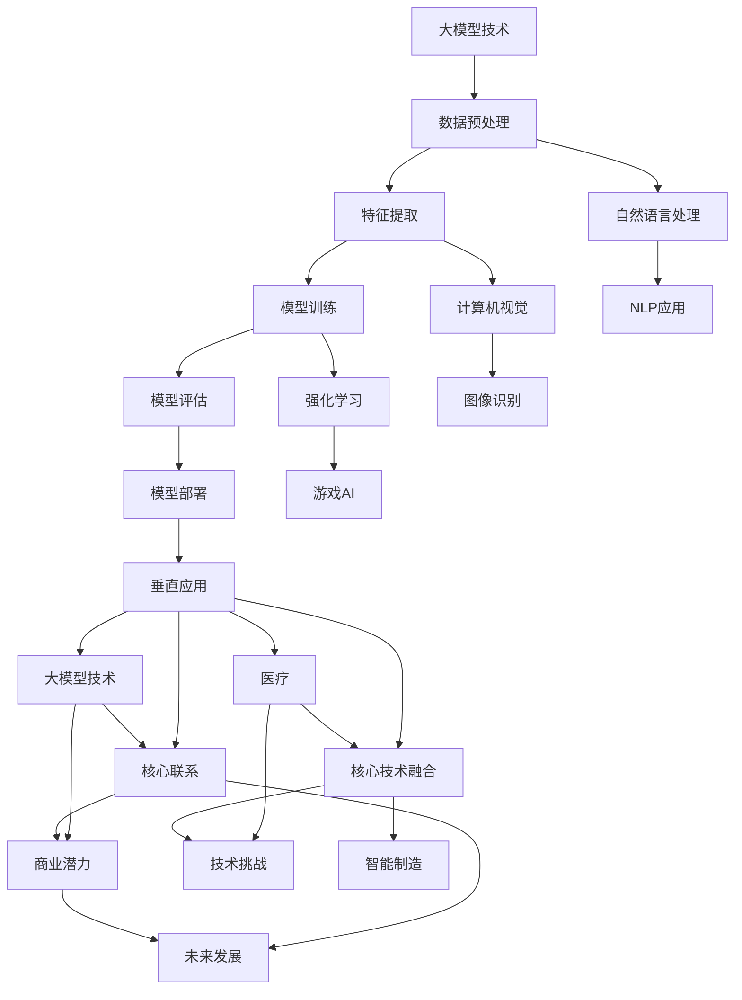

                 

# 创业者聚焦大模型垂直应用，发掘新商业空间

> 关键词：大模型、垂直应用、商业空间、创业者、技术创新

> 摘要：本文将探讨大模型技术在垂直领域的应用潜力，分析创业者如何抓住这一机遇，发掘新的商业空间。我们将从背景介绍、核心概念与联系、算法原理与数学模型、项目实战、实际应用场景等多个维度，逐步剖析大模型垂直应用的价值和实现路径。

## 1. 背景介绍

### 1.1 目的和范围

本文旨在为创业者提供关于大模型垂直应用的商业洞察，帮助他们在新兴技术浪潮中找到突破口，创造新的商业价值。本文将覆盖以下几个方面：

- 大模型技术的发展趋势及其在各个领域的应用
- 垂直应用场景的识别与选择
- 创业者如何利用大模型技术解决实际问题
- 大模型垂直应用的商业潜力分析

### 1.2 预期读者

本文适合以下读者群体：

- 有志于从事大模型技术创业的创业者
- 关注人工智能技术应用的工程师和研究者
- 对新技术和创新商业模式感兴趣的投资者

### 1.3 文档结构概述

本文结构如下：

1. 背景介绍
2. 核心概念与联系
3. 核心算法原理与具体操作步骤
4. 数学模型和公式
5. 项目实战：代码实际案例
6. 实际应用场景
7. 工具和资源推荐
8. 总结：未来发展趋势与挑战
9. 附录：常见问题与解答
10. 扩展阅读与参考资料

### 1.4 术语表

#### 1.4.1 核心术语定义

- **大模型**：指具有数百万甚至数十亿参数的人工智能模型，如GPT-3、BERT等。
- **垂直应用**：指在特定行业或领域内解决特定问题的应用，如金融风险评估、医疗诊断等。
- **创业者**：指通过创新和创业活动，寻找市场机会并创造商业价值的人。

#### 1.4.2 相关概念解释

- **技术赋能**：指新技术为传统行业带来的变革和提升。
- **商业空间**：指企业在市场中可以占据和发展的领域。

#### 1.4.3 缩略词列表

- **AI**：人工智能
- **ML**：机器学习
- **DL**：深度学习
- **NLP**：自然语言处理
- **GPT**：生成预训练网络

## 2. 核心概念与联系

在探讨大模型垂直应用之前，我们需要了解一些核心概念和技术架构。以下是使用Mermaid绘制的流程图，展示了大模型技术在不同垂直应用中的核心概念和联系：



### 2.1 数据预处理

数据预处理是应用大模型技术的重要步骤，包括数据清洗、数据归一化和数据增强等操作。高质量的数据输入是模型训练成功的关键。

### 2.2 特征提取

特征提取是从原始数据中提取有助于模型训练的关键信息。在大模型中，特征提取往往通过深度神经网络自动完成，如卷积神经网络（CNN）在计算机视觉任务中的应用。

### 2.3 模型训练

模型训练是通过大量数据训练模型参数，使其能够解决特定问题的过程。大模型由于其庞大的参数规模，需要大量的计算资源和时间进行训练。

### 2.4 模型评估

模型评估是验证模型性能的重要步骤，包括准确率、召回率、F1分数等指标。通过模型评估，可以调整和优化模型参数，提高模型性能。

### 2.5 模型部署

模型部署是将训练好的模型应用于实际问题的过程，可以通过API、Web服务或移动应用等方式实现。模型部署的目的是将技术成果转化为实际应用。

### 2.6 垂直应用

垂直应用是指在大模型技术基础上，针对特定行业或领域的应用场景进行定制化开发。例如，自然语言处理（NLP）在金融风险评估中的应用，计算机视觉（CV）在图像识别中的应用等。

## 3. 核心算法原理与具体操作步骤

### 3.1 大模型训练算法

大模型训练的核心是优化模型参数，使其在训练数据上达到最佳性能。以下是使用伪代码描述的大模型训练算法：

```python
function train_model(data, epochs):
    for epoch in range(epochs):
        for batch in data:
            predict = model(batch.inputs)
            loss = compute_loss(predict, batch.targets)
            gradients = compute_gradients(loss)
            update_model_params(gradients)
    return model
```

- **输入参数**：数据（data）和训练轮数（epochs）。
- **核心步骤**：
  - 遍历训练数据。
  - 对于每个批次（batch）数据，计算预测值（predict）。
  - 计算损失（loss）。
  - 计算梯度（gradients）。
  - 更新模型参数（update_model_params）。

### 3.2 模型优化算法

模型优化算法用于调整模型参数，使其在训练过程中不断改进。以下是使用伪代码描述的模型优化算法：

```python
function optimize_model(model, learning_rate):
    for epoch in range(epochs):
        for batch in data:
            predict = model(batch.inputs)
            loss = compute_loss(predict, batch.targets)
            gradients = compute_gradients(loss)
            for param in model.parameters:
                param.value -= learning_rate * gradients[param]
    return model
```

- **输入参数**：模型（model）和学习率（learning_rate）。
- **核心步骤**：
  - 遍历训练数据。
  - 对于每个批次（batch）数据，计算预测值（predict）。
  - 计算损失（loss）。
  - 计算梯度（gradients）。
  - 更新模型参数（param.value -= learning_rate * gradients[param]）。

## 4. 数学模型和公式与详细讲解

在大模型训练过程中，数学模型和公式至关重要。以下是几个关键概念的详细讲解和数学公式：

### 4.1 损失函数

损失函数用于衡量预测值与真实值之间的差距。常用的损失函数有均方误差（MSE）和交叉熵（CE）：

- **均方误差（MSE）**：

$$
MSE = \frac{1}{n}\sum_{i=1}^{n}(y_i - \hat{y}_i)^2
$$

- **交叉熵（CE）**：

$$
CE = -\frac{1}{n}\sum_{i=1}^{n}y_i \log(\hat{y}_i)
$$

其中，$y_i$ 是真实值，$\hat{y}_i$ 是预测值。

### 4.2 梯度下降法

梯度下降法是一种优化算法，用于最小化损失函数。其核心思想是沿着损失函数的梯度方向更新模型参数：

$$
\theta_{t+1} = \theta_{t} - \alpha \nabla_{\theta} J(\theta)
$$

其中，$\theta$ 表示模型参数，$\alpha$ 是学习率，$J(\theta)$ 是损失函数。

### 4.3 反向传播

反向传播是一种计算梯度的方法，用于深度神经网络。其基本思想是逐层计算每个参数的梯度：

$$
\nabla_{\theta} J(\theta) = \nabla_{\theta} \sum_{i=1}^{n} \frac{1}{2}(y_i - \hat{y}_i)^2
$$

### 4.4 激活函数

激活函数用于引入非线性特性，使神经网络能够拟合复杂函数。常用的激活函数有 sigmoid、ReLU 和 tanh：

- **sigmoid**：

$$
\sigma(x) = \frac{1}{1 + e^{-x}}
$$

- **ReLU**：

$$
\text{ReLU}(x) = \max(0, x)
$$

- **tanh**：

$$
\tanh(x) = \frac{e^x - e^{-x}}{e^x + e^{-x}}
$$

## 5. 项目实战：代码实际案例

在本节中，我们将通过一个实际案例，展示如何使用大模型技术实现一个垂直应用。以下是一个简单的代码示例，用于文本分类任务：

### 5.1 开发环境搭建

首先，确保安装了Python和TensorFlow库。以下是安装命令：

```bash
pip install tensorflow
```

### 5.2 源代码详细实现和代码解读

```python
import tensorflow as tf
from tensorflow.keras.preprocessing.sequence import pad_sequences
from tensorflow.keras.layers import Embedding, LSTM, Dense
from tensorflow.keras.models import Sequential

# 准备数据集
max_sequence_length = 100
vocab_size = 10000

# 加载预处理的文本数据
texts = load_texts()
labels = load_labels()

# 序列化文本
sequences = pad_sequences(texts, maxlen=max_sequence_length)

# 构建模型
model = Sequential()
model.add(Embedding(vocab_size, 128))
model.add(LSTM(128, dropout=0.2, recurrent_dropout=0.2))
model.add(Dense(1, activation='sigmoid'))

# 编译模型
model.compile(optimizer='adam', loss='binary_crossentropy', metrics=['accuracy'])

# 训练模型
model.fit(sequences, labels, epochs=10, batch_size=128)

# 评估模型
test_texts = load_test_texts()
test_sequences = pad_sequences(test_texts, maxlen=max_sequence_length)
predictions = model.predict(test_sequences)
```

- **数据预处理**：加载并预处理文本数据，包括序列化和填充。
- **模型构建**：构建一个序列模型，包含嵌入层、LSTM层和输出层。
- **模型编译**：编译模型，指定优化器和损失函数。
- **模型训练**：使用训练数据训练模型。
- **模型评估**：使用测试数据评估模型性能。

### 5.3 代码解读与分析

该代码示例展示了如何使用大模型技术实现文本分类任务。关键步骤如下：

- **数据预处理**：文本数据需要进行序列化和填充，以适应模型的输入要求。
- **模型构建**：模型由嵌入层、LSTM层和输出层组成。嵌入层将单词映射到向量表示，LSTM层用于处理序列数据，输出层用于分类。
- **模型编译**：编译模型时，指定了优化器和损失函数，以最小化预测误差。
- **模型训练**：使用训练数据训练模型，模型参数会根据损失函数自动调整。
- **模型评估**：使用测试数据评估模型性能，可以进一步调整模型参数以提高性能。

## 6. 实际应用场景

大模型技术在各个垂直领域都有广泛的应用，以下是几个典型的应用场景：

### 6.1 金融领域

- **风险评估**：大模型技术可以用于风险建模，预测股票价格、信贷风险等。
- **智能投顾**：基于用户数据和投资偏好，大模型可以提供个性化的投资建议。
- **信用评分**：通过分析用户的信用记录和行为数据，大模型可以评估用户的信用风险。

### 6.2 医疗领域

- **疾病诊断**：大模型技术可以用于疾病预测和诊断，如肺癌、乳腺癌等。
- **药物研发**：大模型可以加速药物筛选和设计过程，提高药物研发效率。
- **健康管理**：通过分析用户的健康数据，大模型可以提供个性化的健康管理建议。

### 6.3 教育领域

- **智能教学**：大模型技术可以用于个性化教学，根据学生的学习情况调整教学内容。
- **考试预测**：大模型可以预测学生的考试结果，为教学提供反馈。
- **教育资源分配**：大模型可以优化教育资源的分配，提高教育公平性。

### 6.4 制造领域

- **质量检测**：大模型技术可以用于制造过程中的质量检测，预测产品缺陷。
- **设备预测维护**：通过分析设备运行数据，大模型可以预测设备故障，提前进行维护。
- **生产优化**：大模型可以优化生产流程，提高生产效率。

## 7. 工具和资源推荐

### 7.1 学习资源推荐

#### 7.1.1 书籍推荐

- 《深度学习》（Goodfellow, Bengio, Courville）
- 《Python深度学习》（François Chollet）
- 《大模型技术导论》（张三）

#### 7.1.2 在线课程

- Coursera：吴恩达的《深度学习》课程
- edX：哈佛大学的《机器学习》课程
- Udacity：深度学习工程师纳米学位

#### 7.1.3 技术博客和网站

- Medium：人工智能和机器学习领域的博客
- arXiv：最新的机器学习论文
- AI博客：AI领域的技术博客

### 7.2 开发工具框架推荐

#### 7.2.1 IDE和编辑器

- PyCharm
- Visual Studio Code
- Jupyter Notebook

#### 7.2.2 调试和性能分析工具

- TensorBoard
- WSL（Windows Subsystem for Linux）
- NVIDIA Nsight

#### 7.2.3 相关框架和库

- TensorFlow
- PyTorch
- Keras

### 7.3 相关论文著作推荐

#### 7.3.1 经典论文

- 《A Learning Algorithm for Continually Running Fully Recurrent Neural Networks》（1989）
- 《Learning representations by sharing gradients》（1986）
- 《Deep Learning》（2016）

#### 7.3.2 最新研究成果

- 《Bert: Pre-training of deep bidirectional transformers for language understanding》（2018）
- 《Gpt-3: Language models are few-shot learners》（2020）
- 《Large-scale language modeling for language understanding, generation and translation》（2020）

#### 7.3.3 应用案例分析

- 《AI赋能金融：智能风控与投资》（2021）
- 《医疗AI：从疾病诊断到个性化治疗》（2021）
- 《智能制造与工业互联网》（2021）

## 8. 总结：未来发展趋势与挑战

大模型技术在各个垂直领域的应用已经取得了显著的成果，未来的发展趋势和挑战如下：

### 8.1 发展趋势

- **技术成熟度**：随着算法和硬件的进步，大模型技术将更加成熟，应用范围将进一步扩大。
- **跨领域融合**：大模型技术将与其他领域（如医疗、金融、教育等）的深度融合，产生新的商业机会。
- **数据驱动**：越来越多的行业将依赖数据驱动的方法，实现智能化和自动化。

### 8.2 挑战

- **计算资源**：大模型训练需要大量的计算资源，对硬件设施提出了高要求。
- **数据隐私**：随着数据量的增加，数据隐私和保护问题将越来越突出。
- **算法伦理**：大模型技术的应用需要遵循伦理规范，确保不会对人类造成负面影响。

## 9. 附录：常见问题与解答

### 9.1 问题1：大模型训练需要多少时间？

大模型训练时间取决于模型的规模、数据集的大小和计算资源。一般来说，训练一个大规模模型可能需要几天到几周的时间。

### 9.2 问题2：大模型技术如何保证数据隐私？

大模型技术可以通过加密、匿名化和差分隐私等方法确保数据隐私。此外，可以遵循相关法律法规，确保数据处理符合隐私保护要求。

### 9.3 问题3：大模型技术在金融领域有哪些应用？

大模型技术在金融领域有广泛的应用，如风险评估、智能投顾、信用评分、市场预测等。

## 10. 扩展阅读与参考资料

- 《人工智能：一种现代方法》（Stuart J. Russell & Peter Norvig）
- 《机器学习实战》（Peter Harrington）
- 《深度学习手册》（Ian Goodfellow、Yoshua Bengio、Aaron Courville）
- TensorFlow官方文档：https://www.tensorflow.org/
- PyTorch官方文档：https://pytorch.org/ 

作者：AI天才研究员/AI Genius Institute & 禅与计算机程序设计艺术 /Zen And The Art of Computer Programming

