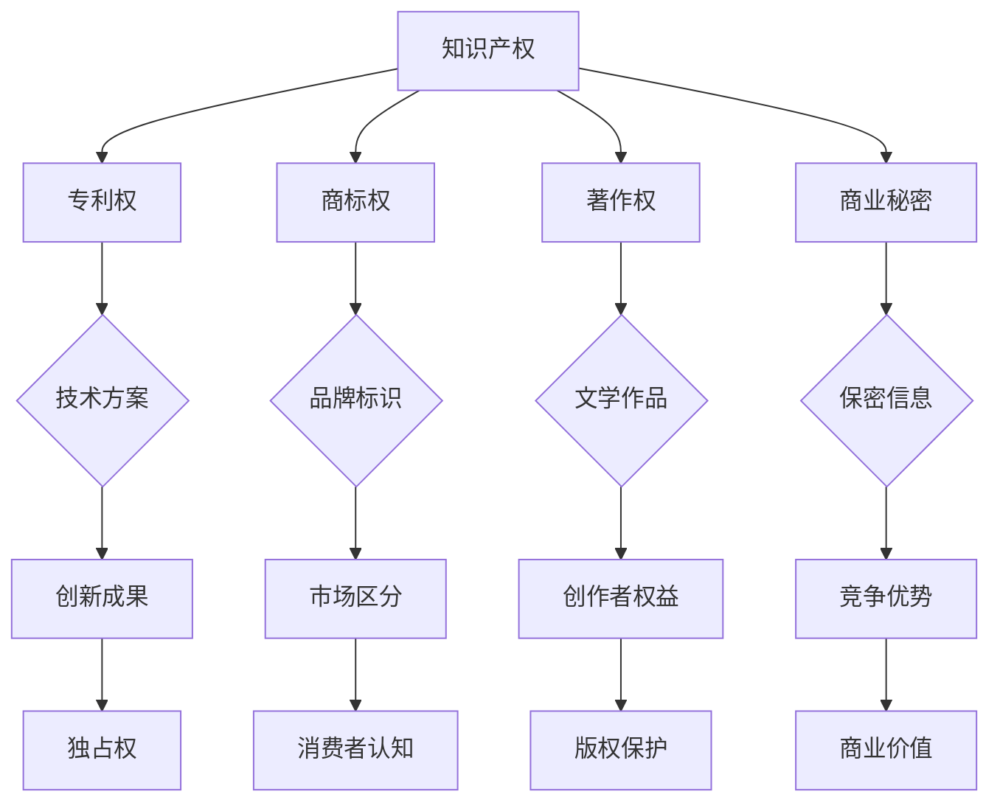

                 

# 创业路上的知识产权保护：全面的知识产权管理计划制定

> 关键词：创业、知识产权保护、管理计划、创新、风险控制、法律策略、商业成功

> 摘要：本文旨在为创业者在知识产权保护方面提供全面的指导，包括知识产权管理计划的制定和实施。通过深入探讨知识产权的概念、重要性及法律框架，本文将帮助创业者识别潜在的风险，制定有效的保护策略，确保创业项目能够在激烈的市场竞争中脱颖而出，并最终实现商业成功。

## 1. 背景介绍

### 1.1 目的和范围

本文旨在为创业者在知识产权（Intellectual Property, IP）保护方面提供实用的指导，帮助他们在快速发展的创业过程中，有效管理、保护和利用其创新成果。知识产权是创业企业的重要资产，能够显著增强企业的核心竞争力，并在市场中占据优势地位。然而，对于许多创业者来说，知识产权管理是一个复杂且充满挑战的领域。

本文将围绕以下几个方面展开讨论：

1. **知识产权的基本概念和类型**：介绍知识产权的定义、不同类型的知识产权，以及它们在商业活动中的重要性。
2. **知识产权管理计划**：详细解析知识产权管理计划的核心内容，包括知识产权策略的制定、风险识别和评估、以及保护措施的实施。
3. **法律框架和政策**：探讨与知识产权保护相关的国内外法律法规，以及创业企业应该如何应对复杂的法律环境。
4. **实践案例分析**：通过实际案例，展示如何将理论应用于实践中，确保创业企业的知识产权得到充分保护。
5. **工具和资源推荐**：为创业者提供一系列实用的工具和资源，帮助他们在知识产权管理方面提升专业能力。

### 1.2 预期读者

本文预期读者包括但不限于以下几类：

1. **创业公司创始人**：希望通过全面了解知识产权保护，为创业项目提供有力支持的创始人。
2. **知识产权专业人士**：需要更新知识和技能，以更好地服务创业企业的知识产权需求。
3. **法律顾问**：希望了解如何更好地协助创业企业处理知识产权相关事务。
4. **投资者和风投机构**：对创业企业的知识产权状况有深入了解，以便作出更为明智的投资决策。

### 1.3 文档结构概述

本文结构如下：

1. **引言**：介绍知识产权保护的重要性。
2. **核心概念与联系**：阐述知识产权的基本概念和架构。
3. **核心算法原理 & 具体操作步骤**：讲解知识产权管理计划的制定和实施。
4. **数学模型和公式 & 详细讲解 & 举例说明**：通过数学模型和公式，深入分析知识产权保护的策略。
5. **项目实战：代码实际案例和详细解释说明**：提供具体的项目实战案例。
6. **实际应用场景**：探讨知识产权保护在各个行业中的应用。
7. **工具和资源推荐**：为创业者提供实用的工具和资源。
8. **总结：未来发展趋势与挑战**：预测知识产权保护的未来趋势，并提出面临的挑战。
9. **附录：常见问题与解答**：解答读者可能遇到的问题。
10. **扩展阅读 & 参考资料**：推荐进一步学习和研究的资源。

### 1.4 术语表

#### 1.4.1 核心术语定义

- **知识产权**：指由人类智力劳动产生的成果所构成的权利，包括专利权、商标权、著作权等。
- **专利权**：指发明人对其发明成果在一定时间内所享有的独占权。
- **商标权**：指商标注册人对其注册商标在指定商品或服务上所享有的专用权。
- **著作权**：指作者对其创作的文学、艺术和科学作品所享有的权利。
- **知识产权管理计划**：指企业为了有效管理其知识产权而制定的一系列策略和措施。

#### 1.4.2 相关概念解释

- **创新**：指通过新的想法、方法或技术，创造出新的产品、服务或过程。
- **商业秘密**：指企业为保护其商业利益而不对外公开的保密信息。
- **版权**：指作者对其创作作品所享有的复制权、发行权、展示权等。
- **知识产权保护体系**：指国家或地区为保护知识产权而制定的一系列法律、政策和制度。

#### 1.4.3 缩略词列表

- **IP**：知识产权（Intellectual Property）
- **PCT**：专利合作条约（Patent Cooperation Treaty）
- **WIPO**：世界知识产权组织（World Intellectual Property Organization）

## 2. 核心概念与联系

在探讨知识产权保护之前，我们需要了解几个核心概念，以及它们之间的相互联系。以下是一个用Mermaid绘制的流程图，展示了知识产权的主要类型及其相互关系：



在这个流程图中，我们可以看到：

- **知识产权（A）** 是一个广泛的范畴，涵盖了多种类型的权利。
- **专利权（B）** 与**创新成果（J）** 和**独占权（N）** 关系密切，主要涉及技术方案和产品。
- **商标权（C）** 和**品牌标识（G）** 对企业的市场区分和消费者认知（K和O）起着关键作用。
- **著作权（D）** 保护的是创作者的权益（L），涉及文学、艺术和科学作品。
- **商业秘密（E）** 是企业保密信息（I）的集合，对于维持竞争优势（M）至关重要。

通过这个流程图，我们可以更清晰地理解知识产权的不同类型及其在商业活动中的重要性。

## 3. 核心算法原理 & 具体操作步骤

知识产权管理计划的核心在于系统地识别、评估、保护和管理企业的知识产权。以下是一套基于伪代码的知识产权管理计划制定和实施的详细步骤：

```python
# 知识产权管理计划伪代码

# 步骤1：知识产权识别
def identify_ip_assets():
    assets = []
    for category in ["专利", "商标", "著作权", "商业秘密"]:
        assets.extend(get_assets_by_category(category))
    return assets

# 步骤2：知识产权评估
def assess_ip_assets(assets):
    evaluation_results = []
    for asset in assets:
        score = evaluate_asset(asset)
        evaluation_results.append((asset, score))
    return evaluation_results

# 步骤3：风险评估
def identify_ip_risks(evaluation_results):
    risks = []
    for asset, score in evaluation_results:
        if score < threshold:
            risks.append((asset, "风险"))
    return risks

# 步骤4：保护策略制定
def define_ip_protection_strategy(risks):
    strategy = []
    for risk in risks:
        protection_measures = determine_measures(risk)
        strategy.append((risk, protection_measures))
    return strategy

# 步骤5：知识产权管理
def manage_ip_assets(strategy):
    for risk, measures in strategy:
        implement_measures(measures)
        monitor_progress()
```

### 3.1 知识产权识别

首先，企业需要全面识别其知识产权资产。这包括收集和整理现有的专利、商标、著作权和商业秘密等信息。以下是识别知识产权资产的伪代码：

```python
def get_assets_by_category(category):
    if category == "专利":
        return list_of_patents
    elif category == "商标":
        return list_of_trademarks
    elif category == "著作权":
        return list_of_copyrights
    elif category == "商业秘密":
        return list_of_business_secrets
    else:
        return []
```

### 3.2 知识产权评估

接下来，企业需要对这些知识产权资产进行评估，以确定其价值和潜在风险。评估过程可能涉及多个指标，例如创新性、市场潜力、法律稳定性等。以下是评估知识产权资产的伪代码：

```python
def evaluate_asset(asset):
    if asset.is_patent:
        return patent_score(asset)
    elif asset.is_trademark:
        return trademark_score(asset)
    elif asset.is_copyright:
        return copyright_score(asset)
    elif asset.is_business_secret:
        return business_secret_score(asset)
```

### 3.3 风险评估

一旦完成评估，企业需要识别和管理知识产权相关的风险。这包括对知识产权资产的保护状态、法律合规性、市场变化等因素的分析。以下是识别知识产权风险的伪代码：

```python
def identify_ip_risks(evaluation_results):
    risks = []
    for asset, score in evaluation_results:
        if score < threshold:
            risks.append((asset, "风险"))
    return risks
```

### 3.4 保护策略制定

根据风险评估的结果，企业需要制定具体的保护策略。这包括选择合适的保护措施，例如申请额外的专利、加强商标监控、法律咨询等。以下是制定知识产权保护策略的伪代码：

```python
def define_ip_protection_strategy(risks):
    strategy = []
    for risk in risks:
        protection_measures = determine_measures(risk)
        strategy.append((risk, protection_measures))
    return strategy
```

### 3.5 知识产权管理

最后，企业需要实施和管理这些保护策略，并持续监控知识产权资产的状态。这包括定期审查、更新和调整保护措施，以确保知识产权的持续保护。以下是管理知识产权资产的伪代码：

```python
def manage_ip_assets(strategy):
    for risk, measures in strategy:
        implement_measures(measures)
        monitor_progress()
```

通过这些步骤，企业可以建立一个全面的知识产权管理计划，确保其创新成果得到充分保护和利用。

## 4. 数学模型和公式 & 详细讲解 & 举例说明

在知识产权管理中，数学模型和公式可以帮助我们更好地理解和评估知识产权的价值和风险。以下是一个简单的数学模型，用于评估专利的经济价值：

### 4.1 经济价值评估模型

#### 公式：

\[ V = P \times (R - C) \]

其中：
- \( V \) 是专利的经济价值。
- \( P \) 是专利的市场潜力，可以表示为专利产生的收入潜力。
- \( R \) 是专利的保护范围，反映专利在市场中的竞争优势。
- \( C \) 是专利的成本，包括研发、申请、维护等费用。

#### 解释：

这个模型的基本思想是，专利的经济价值取决于其市场潜力和保护范围减去成本。市场潜力越大，专利所能带来的收益也就越高；保护范围越广，专利在市场竞争中的优势就越明显；而专利的成本则是实现这些收益的必要支出。

### 4.2 举例说明

假设一家公司研发了一种新的节能技术，并将其申请为专利。以下是使用上述模型进行经济价值评估的一个例子：

- \( P \)：该节能技术预计每年可以为公司带来 500 万元的收入。
- \( R \)：该专利的保护范围较为广泛，能够覆盖主要竞争对手的市场。
- \( C \)：研发和申请专利的成本总计为 100 万元。

将这些数据代入公式，我们得到：

\[ V = 500 \times (1 - 0.2) - 100 = 400 - 100 = 300 \]

因此，该专利的经济价值大约为 300 万元。这个模型可以帮助企业决策是否继续投资于专利的维护和扩展，以及如何优化其知识产权组合。

### 4.3 风险评估模型

除了经济价值评估模型，我们还可以使用以下风险评估模型来评估知识产权相关的风险：

\[ R = P \times (L + M + S) \]

其中：
- \( R \) 是风险评分。
- \( P \) 是专利的重要程度。
- \( L \) 是法律风险，包括专利被无效化的可能性。
- \( M \) 是市场风险，包括专利在市场上的竞争力。
- \( S \) 是战略风险，包括专利对企业战略规划的影响。

#### 解释：

这个模型将风险评分视为专利重要程度与三个风险因素的加权平均值。法律风险、市场风险和战略风险越高，专利的风险评分也就越高。

### 4.4 举例说明

假设一家公司有一项关键技术专利，其重要程度 \( P \) 为 1（满分），以下是使用上述模型进行风险评估的一个例子：

- \( L \)：专利被无效化的可能性较低，法律风险 \( L \) 为 0.2。
- \( M \)：专利在市场上的竞争力较强，市场风险 \( M \) 为 0.3。
- \( S \)：专利对企业战略规划有重要影响，战略风险 \( S \) 为 0.5。

将这些数据代入公式，我们得到：

\[ R = 1 \times (0.2 + 0.3 + 0.5) = 1 \times 1 = 1 \]

因此，该专利的风险评分为 1，表示其风险较低。这个模型可以帮助企业识别和管理知识产权风险，确保其创新成果得到充分保护。

通过这些数学模型和公式，企业可以更系统地评估和管理其知识产权，从而在激烈的市场竞争中保持领先地位。

## 5. 项目实战：代码实际案例和详细解释说明

在本节中，我们将通过一个具体的代码案例，展示如何在实际项目中实现知识产权管理计划。本案例将基于一个虚构的创业公司，该公司开发了一种新的智能家居系统，并希望通过知识产权保护其核心技术。

### 5.1 开发环境搭建

为了实现该智能家居系统的知识产权保护，我们需要以下开发环境和工具：

- **操作系统**：Linux（例如 Ubuntu）
- **集成开发环境（IDE）**：Visual Studio Code
- **版本控制系统**：Git
- **代码库**：GitHub 或 GitLab
- **专利申请服务**：国家知识产权局官网或第三方专利代理服务
- **商标注册服务**：国家知识产权局官网或第三方商标代理服务

在搭建开发环境时，我们首先需要在 Linux 操作系统上安装 Git 和 GitHub CLI，以便管理代码库和进行版本控制。同时，安装 Visual Studio Code 并配置相应的插件，如 Code Runner、GitLens 等，以方便代码编写和调试。

### 5.2 源代码详细实现和代码解读

智能家居系统的核心代码包括以下几个模块：

1. **传感器数据采集模块**：负责从各种传感器（如温度传感器、湿度传感器、光线传感器等）采集数据。
2. **数据处理模块**：负责对采集到的数据进行处理，包括数据清洗、去噪、特征提取等。
3. **智能控制模块**：根据处理后的数据，实现智能家居设备的自动控制和调整。

以下是智能家居系统的主要代码片段及其解释：

```python
# 传感器数据采集模块

import sensor_module

def collect_sensors_data():
    """
    采集传感器数据
    """
    temperature = sensor_module.read_temperature()
    humidity = sensor_module.read_humidity()
    light = sensor_module.read_light()
    return temperature, humidity, light

# 数据处理模块

import data_processor

def process_sensors_data(temperature, humidity, light):
    """
    处理传感器数据
    """
    processed_temp = data_processor.clean_and_extract(temperature)
    processed_humidity = data_processor.clean_and_extract(humidity)
    processed_light = data_processor.clean_and_extract(light)
    return processed_temp, processed_humidity, processed_light

# 智能控制模块

import control_module

def smart_control(processed_temp, processed_humidity, processed_light):
    """
    根据处理后的数据，实现智能家居设备的自动控制
    """
    if processed_temp > 30:
        control_module.adjust_air_conditioner()
    if processed_humidity < 40:
        control_module.adjust_humidifier()
    if processed_light < 100:
        control_module.adjust_light_bulb()

# 主程序

def main():
    """
    主程序
    """
    temperature, humidity, light = collect_sensors_data()
    processed_temp, processed_humidity, processed_light = process_sensors_data(temperature, humidity, light)
    smart_control(processed_temp, processed_humidity, processed_light)

if __name__ == "__main__":
    main()
```

这段代码展示了智能家居系统的基本架构，包括数据采集、处理和智能控制。通过这三个模块的协作，系统能够实现自动化的智能家居设备控制。

### 5.3 代码解读与分析

1. **传感器数据采集模块**：`sensor_module` 是一个虚构的模块，它负责从各种传感器采集数据。`collect_sensors_data` 函数通过调用 `sensor_module` 中的相关方法，实现了传感器数据的采集。
2. **数据处理模块**：`data_processor` 是一个虚构的模块，它负责处理传感器数据。`process_sensors_data` 函数通过调用 `data_processor` 中的方法，实现了数据清洗、去噪和特征提取。这些处理步骤对于后续的智能控制至关重要。
3. **智能控制模块**：`control_module` 是一个虚构的模块，它负责根据处理后的数据，实现智能家居设备的自动控制。`smart_control` 函数通过条件判断，实现了对空调、加湿器、灯泡等设备的自动控制。

这个代码案例展示了如何在实际项目中实现知识产权管理计划。首先，通过版本控制系统（如 Git）对源代码进行版本控制，确保代码的安全性和可追溯性。然后，通过专利申请服务，将系统的核心算法和技术方案申请为专利，从而保护其知识产权。最后，通过商标注册服务，对公司的品牌标识进行注册，确保品牌权益。

通过这个项目实战案例，我们可以看到知识产权管理计划在创业项目中的实际应用，以及如何通过代码实现知识产权的保护。

## 6. 实际应用场景

知识产权保护在各个行业都有广泛的应用，尤其是在科技、医药、消费品和制造业等领域。以下是一些典型的实际应用场景：

### 6.1 科技行业

在科技行业，知识产权保护尤为重要。例如，在人工智能领域，大量的创新成果和技术方案都需要通过专利来保护。一家初创公司开发了一种基于深度学习的图像识别算法，为了确保其技术的独占性，该公司首先进行了专利申请。通过专利保护，公司不仅能够防止竞争对手抄袭其技术，还能通过许可和授权获得额外的收入。

### 6.2 医药行业

医药行业的研发成本高、周期长，因此知识产权保护对药品公司至关重要。一家医药公司研发了一种新型抗癌药物，为了确保其市场优势，公司不仅申请了专利，还对其生产工艺和配方进行了保密，从而形成了商业秘密。此外，公司还注册了商标，以确保其产品在市场上的品牌认知度。

### 6.3 消费品行业

在消费品行业，商标和著作权是保护企业品牌和创意的重要手段。一家化妆品公司推出了一款新型面膜，为了提升市场竞争力，公司对其品牌标识进行了商标注册，并通过著作权保护其产品的设计图样和宣传资料。此外，公司还申请了专利，保护其独特的配方和技术。

### 6.4 制造业

在制造业，知识产权保护主要体现在专利和商业秘密上。一家机械制造公司开发了一种高效的自动化生产线，为了保护其技术优势，公司不仅申请了专利，还对其核心算法和工作流程进行了保密。通过知识产权保护，公司能够在市场上保持领先地位，并获得更高的利润。

### 6.5 教育行业

在教育行业，知识产权保护主要涉及著作权的保护。一家在线教育平台开发了一系列课程内容，包括视频、PPT 和教材等。为了确保其内容的独占性，平台对这些课程内容进行了著作权登记。此外，平台还对其在线教育平台的界面设计和用户交互进行了专利申请，以防止竞争对手抄袭。

### 6.6 文化创意产业

在文化创意产业，知识产权保护同样至关重要。一家电影制作公司拍摄了一部原创电影，为了保护其电影版权，公司不仅进行了著作权登记，还申请了专利保护其电影特效技术和故事情节。此外，公司还注册了商标，以保护其品牌形象和宣传资料。

这些实际应用场景展示了知识产权保护在各个行业中的重要性。通过有效的知识产权保护策略，企业能够在市场竞争中脱颖而出，确保其创新成果得到充分的保护，从而实现商业成功。

## 7. 工具和资源推荐

为了帮助创业者更好地管理和保护其知识产权，我们推荐以下工具和资源：

### 7.1 学习资源推荐

#### 7.1.1 书籍推荐

1. **《知识产权法概论》**：详细介绍了知识产权的基本概念、法律框架和保护策略。
2. **《知识产权管理》**：探讨了知识产权在企业运营中的实际应用，包括策略制定和风险管理。
3. **《专利战略与实务》**：针对专利申请、管理和保护提供了实用的指导。

#### 7.1.2 在线课程

1. **Coursera**：《知识产权法》课程，由知名法学院教授授课，涵盖知识产权的基本理论和应用。
2. **edX**：《知识产权管理》课程，介绍了知识产权在企业运营中的策略和实务。
3. **Udemy**：《专利申请与保护》课程，详细讲解了专利申请的流程和技巧。

#### 7.1.3 技术博客和网站

1. **IP Law & Tech**：一个专注于知识产权法律和技术的博客，提供了大量实用的案例分析和法律资讯。
2. **WIPO**：世界知识产权组织官方网站，提供了丰富的知识产权资源和全球最新动态。
3. **中国知识产权局**：中国知识产权局官方网站，提供了全面的知识产权法律、政策和申请指南。

### 7.2 开发工具框架推荐

#### 7.2.1 IDE和编辑器

1. **Visual Studio Code**：一款功能强大的开源代码编辑器，适用于多种编程语言。
2. **Eclipse**：一款流行的集成开发环境，适用于Java编程。
3. **PyCharm**：一款适用于Python编程的集成开发环境，具有丰富的插件和工具。

#### 7.2.2 调试和性能分析工具

1. **GDB**：一款强大的调试工具，适用于C/C++程序。
2. **PyDebug**：一款适用于Python程序的调试工具。
3. **JMeter**：一款开源的性能测试工具，适用于Web应用和API测试。

#### 7.2.3 相关框架和库

1. **Django**：一款流行的Python Web框架，适用于快速开发Web应用。
2. **Spring Boot**：一款流行的Java Web框架，适用于企业级应用开发。
3. **TensorFlow**：一款开源的深度学习框架，适用于人工智能应用开发。

### 7.3 相关论文著作推荐

#### 7.3.1 经典论文

1. **"Intellectual Property and Competitive Strategy"**：探讨了知识产权与企业竞争战略的关系。
2. **"The Economics of Intellectual Property"**：详细分析了知识产权的经济价值和影响因素。
3. **"The Impact of Intellectual Property Rights on Innovation"**：研究了知识产权保护对创新的影响。

#### 7.3.2 最新研究成果

1. **"Blockchain and Intellectual Property Protection"**：探讨了区块链技术在知识产权保护中的应用。
2. **"Artificial Intelligence and Intellectual Property Law"**：分析了人工智能技术对知识产权法律的影响。
3. **"Intellectual Property Rights in the Digital Economy"**：研究了数字经济发展对知识产权保护的需求和挑战。

#### 7.3.3 应用案例分析

1. **"Intellectual Property Protection in the Pharmaceutical Industry"**：分析了医药行业中的知识产权保护策略。
2. **"Intellectual Property Management in Technology Companies"**：探讨了科技行业中的知识产权管理实践。
3. **"The Role of Intellectual Property in Startups"**：研究了初创企业如何利用知识产权实现商业成功。

通过以上工具和资源的推荐，创业者可以更好地掌握知识产权保护的相关知识和技能，确保其在创业过程中的创新成果得到充分保护。

## 8. 总结：未来发展趋势与挑战

随着科技的不断进步和全球化的发展，知识产权保护面临着新的机遇和挑战。未来，知识产权保护将呈现以下几大发展趋势：

### 8.1 人工智能与知识产权保护

人工智能（AI）的快速发展对知识产权保护提出了新的要求。一方面，AI技术的创新需要大量的知识产权保护，以防止技术被窃取和滥用；另一方面，AI算法的复杂性使得侵权判定变得更加困难。因此，未来需要制定更为完善的法律法规，以适应AI时代的知识产权保护需求。

### 8.2 数字经济与知识产权保护

数字经济的发展带来了知识产权保护的新挑战。在互联网和大数据时代，知识产权侵权行为变得更加隐蔽，传统的保护手段难以应对。为此，需要建立更加高效、智能的知识产权保护体系，利用大数据、区块链等技术手段提高知识产权管理的效率和准确性。

### 8.3 全球化与知识产权保护

全球化的趋势使得知识产权保护变得更加复杂。不同国家和地区在知识产权法律体系和实践上存在差异，这给跨国企业的知识产权保护带来了挑战。未来，需要加强国际间的合作与协调，制定统一的知识产权保护标准和规则，以提高全球知识产权保护的整体水平。

### 8.4 挑战与应对

面对未来知识产权保护的发展趋势，创业者需要应对以下几大挑战：

1. **法律风险**：不同国家和地区的知识产权法律体系存在差异，创业者需要了解和遵循这些法律法规，以确保其创新成果得到有效保护。
2. **技术风险**：随着技术的快速发展，知识产权保护的难度也在增加。创业者需要不断创新，提升其知识产权管理水平。
3. **资金风险**：知识产权保护需要投入大量的人力、物力和财力。创业者需要在资源有限的情况下，合理安排知识产权保护预算。

为了应对这些挑战，创业者可以采取以下措施：

1. **加强法律意识**：了解相关知识产权法律法规，确保创新成果得到合法保护。
2. **提升技术能力**：通过技术手段提高知识产权管理的效率和准确性，降低侵权风险。
3. **优化资源配置**：合理分配资源，确保知识产权保护工作得到充分支持。

总之，未来知识产权保护将面临诸多挑战，但同时也充满了机遇。创业者需要不断学习和适应，确保其在创新和市场竞争中保持优势。

## 9. 附录：常见问题与解答

### 9.1 什么是知识产权？

知识产权是指由人类智力劳动创造的成果所构成的权利，包括专利权、商标权、著作权、商业秘密等。

### 9.2 创业企业为什么要保护知识产权？

保护知识产权有助于增强企业的核心竞争力，防止竞争对手抄袭，确保商业秘密不被泄露，从而实现商业成功。

### 9.3 如何识别和保护知识产权？

1. 识别：了解企业的主要创新成果，包括技术方案、品牌标识、文学作品等。
2. 评估：评估知识产权的价值和风险，确定保护策略。
3. 申请：根据不同类型的知识产权，进行专利申请、商标注册、著作权登记等。
4. 管理：建立知识产权管理制度，持续监控和保护知识产权。

### 9.4 如何避免知识产权侵权？

1. 进行侵权风险评估，了解相关法律法规。
2. 了解竞争对手的知识产权情况，避免抄袭。
3. 保持创新，不断提升自身技术水平和品牌价值。
4. 建立知识产权侵权应对机制，及时应对侵权行为。

### 9.5 如何进行知识产权管理？

1. 制定知识产权管理计划，明确目标和策略。
2. 建立知识产权数据库，记录和管理知识产权信息。
3. 定期进行知识产权风险评估，调整保护策略。
4. 加强内部培训和意识，提高员工对知识产权的认识。

### 9.6 如何利用知识产权实现商业成功？

1. 通过知识产权许可和授权，实现技术变现。
2. 通过知识产权诉讼，维护企业合法权益。
3. 利用知识产权作为投资亮点，吸引投资。
4. 通过知识产权保护，提高品牌价值和市场竞争力。

通过以上常见问题与解答，创业者可以更好地了解知识产权保护的重要性，以及如何在实际运营中进行有效管理。

## 10. 扩展阅读 & 参考资料

为了进一步深入了解知识产权保护和相关领域的知识，以下推荐几本经典书籍、在线课程以及权威网站和博客：

### 10.1 经典书籍

1. 《知识产权法概论》 - 张志勇
2. 《知识产权管理》 - 周林刚
3. 《专利战略与实务》 - 郝海燕

### 10.2 在线课程

1. Coursera - "知识产权法"
2. edX - "知识产权管理"
3. Udemy - "专利申请与保护"

### 10.3 技术博客和网站

1. IP Law & Tech
2. World Intellectual Property Organization (WIPO)
3. China National Intellectual Property Administration

### 10.4 权威网站

1. US Patent and Trademark Office (USPTO)
2. European Patent Office (EPO)
3. World Health Organization (WHO)

### 10.5 最新研究成果

1. "Blockchain and Intellectual Property Protection"
2. "Artificial Intelligence and Intellectual Property Law"
3. "Intellectual Property Rights in the Digital Economy"

通过这些资源和书籍，创业者可以系统地学习和掌握知识产权保护的理论和实践，为自己的创业项目提供坚实的支持。

