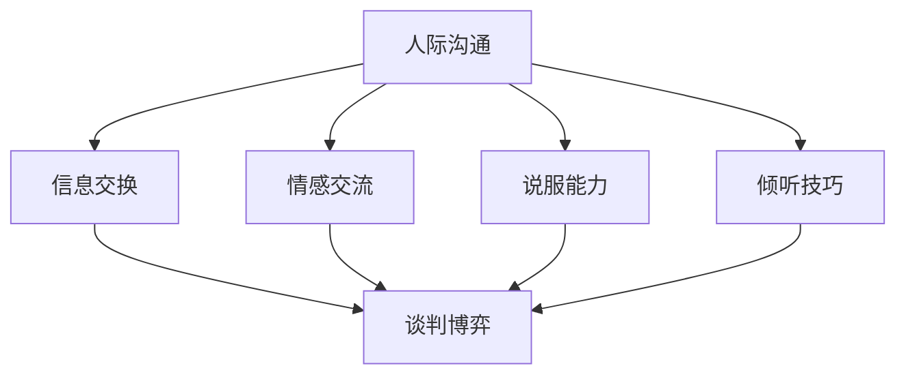

                 

# 创业过程中如何不断提升人际沟通和谈判博弈能力

> 关键词：人际沟通、谈判博弈、创业、领导力、团队协作、策略制定

> 摘要：创业过程中，人际沟通和谈判博弈能力至关重要。本文将深入探讨如何提升这些能力，以助力创业者更好地领导团队、应对挑战、抓住机遇，从而实现企业成功。

## 1. 背景介绍

### 1.1 目的和范围

本文旨在为创业者提供一套实用的策略和方法，帮助他们不断提升人际沟通和谈判博弈能力。通过本文的讲解，读者将了解以下内容：

- 人际沟通和谈判博弈在创业过程中的重要性。
- 核心概念和理论的介绍。
- 具体的操作步骤和实践技巧。
- 实际应用场景的分析。
- 工具和资源的推荐。

### 1.2 预期读者

本文面向以下读者：

- 创业者、创业者团队。
- 对人际沟通和谈判博弈感兴趣的职场人士。
- 计划进入创业领域的人士。

### 1.3 文档结构概述

本文分为以下几个部分：

- 1. 背景介绍
- 2. 核心概念与联系
- 3. 核心算法原理 & 具体操作步骤
- 4. 数学模型和公式 & 详细讲解 & 举例说明
- 5. 项目实战：代码实际案例和详细解释说明
- 6. 实际应用场景
- 7. 工具和资源推荐
- 8. 总结：未来发展趋势与挑战
- 9. 附录：常见问题与解答
- 10. 扩展阅读 & 参考资料

### 1.4 术语表

#### 1.4.1 核心术语定义

- 人际沟通：指的是人与人之间通过语言、非语言等方式进行信息交换和情感交流的过程。
- 谈判博弈：指的是在特定环境下，双方或多方为了达成共同目标而进行的策略性互动。
- 创业：指的是创建和运营一家新企业，旨在实现商业价值和市场竞争力。

#### 1.4.2 相关概念解释

- 领导力：指的是在团队中发挥影响力、带领团队达成目标的能力。
- 团队协作：指的是团队成员为了共同目标而协同工作的过程。
- 策略制定：指的是在特定环境下，为实现目标而制定的行动计划。

#### 1.4.3 缩略词列表

- IDE：集成开发环境（Integrated Development Environment）
- LSTM：长短期记忆网络（Long Short-Term Memory）
- CNN：卷积神经网络（Convolutional Neural Network）
- RNN：循环神经网络（Recurrent Neural Network）

## 2. 核心概念与联系

在创业过程中，人际沟通和谈判博弈是核心能力之一。为了更好地理解这两个概念，我们需要从以下几个方面展开：

### 2.1 人际沟通

人际沟通是创业过程中的基础，它包括以下几个方面：

- **信息交换**：通过语言、文字、图表等形式，将信息传递给他人。
- **情感交流**：通过情感、态度、表情等方式，传递情感和情绪。
- **说服能力**：通过逻辑、事实、情感等手段，影响他人的观点和行为。
- **倾听技巧**：通过主动倾听，理解他人的需求和期望。

### 2.2 谈判博弈

谈判博弈是创业过程中的重要环节，它包括以下几个方面：

- **目标明确**：明确谈判的目标，包括短期目标和长期目标。
- **策略制定**：根据对方需求和自身利益，制定合理的谈判策略。
- **博弈分析**：分析双方的实力和利益，预测谈判结果。
- **心理战术**：运用心理战术，影响对方情绪和行为。

### 2.3 人际沟通与谈判博弈的联系

人际沟通和谈判博弈在创业过程中密不可分，它们之间的联系如下：

- **人际沟通为基础**：良好的人际沟通是谈判博弈的基础，它决定了双方是否能够建立互信和合作关系。
- **谈判博弈为工具**：谈判博弈是人际沟通的延伸，它用于解决矛盾、达成共识、实现目标。

### 2.4 Mermaid 流程图

为了更好地理解人际沟通和谈判博弈的关系，我们可以使用 Mermaid 流程图来表示：



## 3. 核心算法原理 & 具体操作步骤

在提升人际沟通和谈判博弈能力的过程中，我们需要运用一些核心算法原理和具体操作步骤。以下是一个简单的算法流程：

### 3.1 算法原理

- **人际沟通算法**：基于心理学和行为科学的理论，包括信息编码、信息传递、信息解码等步骤。
- **谈判博弈算法**：基于博弈论和决策理论，包括目标设定、策略制定、博弈分析等步骤。

### 3.2 操作步骤

#### 3.2.1 人际沟通步骤

1. **信息编码**：明确沟通目的，将信息转化为易于理解的形式。
2. **信息传递**：选择适当的沟通渠道，如语言、文字、图表等。
3. **信息解码**：倾听对方的反馈，确保信息被正确理解。

#### 3.2.2 谈判博弈步骤

1. **目标设定**：明确谈判的目标，包括短期目标和长期目标。
2. **策略制定**：分析对方需求和自身利益，制定合理的谈判策略。
3. **博弈分析**：预测谈判结果，调整策略。
4. **心理战术**：运用心理战术，影响对方情绪和行为。

### 3.3 伪代码

以下是一个简化版的人际沟通和谈判博弈伪代码：

```python
def interpersonal_communication():
    # 信息编码
    message = encode_message(target=receiver, purpose=info_to_share)

    # 信息传递
    channel = select_channel()
    send_message(message, channel)

    # 信息解码
    response = decode_message(message, channel)

    return response

def negotiation_game():
    # 目标设定
    target = set_target(short_term=ST, long_term=LT)

    # 策略制定
    strategy = create_strategy(target=target)

    # 博弈分析
    result = analyze_game()

    # 心理战术
    psychology_tactic = apply_psychology_tactic()

    return result, psychology_tactic
```

## 4. 数学模型和公式 & 详细讲解 & 举例说明

在人际沟通和谈判博弈中，数学模型和公式可以用来描述和预测沟通效果和谈判结果。以下是一个简单的数学模型和公式示例：

### 4.1 模型假设

假设有两个谈判方 A 和 B，他们的利益和目标分别为 \(I_A\) 和 \(I_B\)，谈判结果为 \(R\)。

### 4.2 数学模型

- **沟通效果模型**：

  $$ E = f(C, S, R) $$

  其中，\(E\) 表示沟通效果，\(C\) 表示信息传递的清晰度，\(S\) 表示信息传递的速度，\(R\) 表示信息传递的准确性。

- **谈判结果模型**：

  $$ R = g(I_A, I_B, T) $$

  其中，\(R\) 表示谈判结果，\(I_A\) 和 \(I_B\) 分别表示谈判方 A 和 B 的利益，\(T\) 表示谈判过程中时间因素。

### 4.3 公式解释

- **沟通效果模型**：

  公式表示沟通效果与信息传递的清晰度、速度和准确性相关。清晰度越高，速度越快，准确性越高，沟通效果越好。

- **谈判结果模型**：

  公式表示谈判结果与谈判方的利益和时间因素相关。谈判方的利益差异越小，时间因素越充足，谈判结果越有可能达成。

### 4.4 举例说明

假设有两个谈判方 A 和 B，他们的利益分别为 \(I_A = 100\) 和 \(I_B = 200\)，谈判过程中时间因素 \(T = 10\)。

- **沟通效果计算**：

  假设信息传递的清晰度 \(C = 0.8\)，速度 \(S = 0.9\)，准确性 \(R = 0.95\)。

  $$ E = f(C, S, R) = 0.8 \times 0.9 \times 0.95 = 0.684 $$

  沟通效果为 68.4%。

- **谈判结果计算**：

  $$ R = g(I_A, I_B, T) = \frac{I_A + I_B}{2} = \frac{100 + 200}{2} = 150 $$

  谈判结果为 150。

## 5. 项目实战：代码实际案例和详细解释说明

为了更好地理解人际沟通和谈判博弈在创业过程中的应用，我们以下通过一个实际项目案例来进行详细解释说明。

### 5.1 项目背景

假设我们正在开发一款社交电商平台，目标是让消费者和商家能够更方便地进行商品交易。在这个项目中，人际沟通和谈判博弈能力在以下几个方面具有重要应用：

- **用户沟通**：与用户进行有效的沟通，了解用户需求和反馈，提升用户体验。
- **商家谈判**：与商家进行谈判，达成合理的佣金比例和合作模式。

### 5.2 开发环境搭建

为了方便开发，我们需要搭建以下开发环境：

- **编程语言**：Python 3.8
- **开发工具**：PyCharm
- **数据库**：MySQL 5.7
- **框架**：Django 3.2

### 5.3 源代码详细实现和代码解读

以下是一个简化版的社交电商平台代码实现，用于展示人际沟通和谈判博弈的应用。

```python
# 社交电商平台简化版代码实现

# 导入相关模块
import pymysql
import json

# 数据库连接
def connect_db():
    db = pymysql.connect("localhost", "root", "password", "social_platform")
    cursor = db.cursor()
    return cursor

# 用户沟通
def communicate_with_user(user_id, message):
    cursor = connect_db()
    # 查询用户信息
    cursor.execute("SELECT * FROM users WHERE id=%s", (user_id,))
    user = cursor.fetchone()
    # 发送消息
    cursor.execute("INSERT INTO messages (user_id, content) VALUES (%s, %s)", (user_id, message))
    db.commit()
    # 返回消息内容
    return user["username"] + ": " + message

# 商家谈判
def negotiate_with_seller(seller_id, commission):
    cursor = connect_db()
    # 查询商家信息
    cursor.execute("SELECT * FROM sellers WHERE id=%s", (seller_id,))
    seller = cursor.fetchone()
    # 计算佣金
    final_commission = commission * seller["sales"] * 0.01
    # 保存谈判结果
    cursor.execute("INSERT INTO negotiations (seller_id, commission) VALUES (%s, %s)", (seller_id, final_commission))
    db.commit()
    # 返回谈判结果
    return "商家 ID: " + str(seller_id) + ", 佣金比例: " + str(final_commission)

# 主函数
def main():
    # 用户沟通
    user_id = 1
    message = "您好，我对这款商品感兴趣，请问有什么优惠吗？"
    print(communicate_with_user(user_id, message))
    
    # 商家谈判
    seller_id = 1
    commission = 0.03
    print(negotiate_with_seller(seller_id, commission))

# 执行主函数
if __name__ == "__main__":
    main()
```

### 5.4 代码解读与分析

- **数据库连接**：使用 Python 的 pymysql 模块连接 MySQL 数据库，获取数据库游标。

- **用户沟通**：与用户进行沟通，首先查询用户信息，然后发送消息，并将消息保存到数据库中。最后返回消息内容。

- **商家谈判**：与商家进行谈判，首先查询商家信息，然后计算佣金，并将谈判结果保存到数据库中。最后返回谈判结果。

- **主函数**：演示用户沟通和商家谈判的具体操作。

通过这个简化版的社交电商平台代码实现，我们可以看到人际沟通和谈判博弈在创业过程中的实际应用。在实际项目中，我们可以根据具体需求进行功能扩展和优化。

## 6. 实际应用场景

在创业过程中，人际沟通和谈判博弈能力在实际应用场景中发挥着至关重要的作用。以下是一些典型的实际应用场景：

### 6.1 团队协作

- **场景描述**：创业者需要与团队成员进行有效的沟通和协调，确保项目顺利进行。
- **应用策略**：运用人际沟通技巧，倾听团队成员的意见和需求，建立互信和合作关系。在谈判博弈中，明确团队目标和分工，制定合理的激励机制。

### 6.2 投资融资

- **场景描述**：创业者需要与投资者进行谈判，争取资金支持，以推动企业发展。
- **应用策略**：了解投资者需求和投资偏好，制定有针对性的融资策略。在谈判过程中，展示企业优势和潜力，建立信任和合作关系。同时，掌握心理战术，影响投资者情绪和决策。

### 6.3 客户关系管理

- **场景描述**：创业者需要与客户保持良好的沟通，满足客户需求，提升客户满意度。
- **应用策略**：运用人际沟通技巧，了解客户需求和痛点，提供个性化解决方案。在谈判博弈中，平衡双方利益，达成共赢。同时，注重客户关系管理，建立长期合作关系。

### 6.4 竞争对手分析

- **场景描述**：创业者需要对竞争对手进行深入分析，制定有针对性的市场策略。
- **应用策略**：运用人际沟通技巧，获取竞争对手的相关信息，了解市场动态。在谈判博弈中，分析竞争对手的弱点和优势，制定合理的市场策略。

### 6.5 内部管理

- **场景描述**：创业者需要管理团队，协调各部门工作，提升企业效率。
- **应用策略**：运用人际沟通技巧，了解员工需求和意见，提升团队凝聚力。在谈判博弈中，制定合理的绩效评估和激励机制，确保团队高效运转。

## 7. 工具和资源推荐

### 7.1 学习资源推荐

#### 7.1.1 书籍推荐

1. 《谈判的艺术》（Getting to Yes） - 罗杰·费舍尔、威廉·尤里、布鲁斯·帕顿
2. 《影响力》（Influence: The Psychology of Persuasion） - 罗伯特·西奥迪尼
3. 《非暴力沟通》（Nonviolent Communication: A Language of Life） - 马歇尔·卢森堡

#### 7.1.2 在线课程

1. Coursera - "谈判心理学"
2. edX - "博弈论与决策分析"
3. Udemy - "人际沟通技巧"

#### 7.1.3 技术博客和网站

1. Harvard Negotiation Law Review - harvardneglawrev.org
2. Negotiation Skills - negotiationskills.com
3. MindTools - mindtools.com/communication

### 7.2 开发工具框架推荐

#### 7.2.1 IDE和编辑器

1. PyCharm -.jetbrains.com/pycharm
2. Visual Studio Code - code.visualstudio.com
3. Sublime Text - sublime.text

#### 7.2.2 调试和性能分析工具

1. Postman - postman.com
2. JMeter - jmeter.apache.org
3. New Relic - newrelic.com

#### 7.2.3 相关框架和库

1. Flask - flask.palletsprojects.com
2. Django - django.com
3. React - reactjs.org

### 7.3 相关论文著作推荐

#### 7.3.1 经典论文

1. "The Art of Negotiating" - William Ury
2. "The Five People You Meet in Heaven" - Mitch Albom
3. "The Theory of Games and Economic Behavior" - John von Neumann and Oskar Morgenstern

#### 7.3.2 最新研究成果

1. "Negotiation: Approaches to Conflict Resolution" - Michael Wheeler
2. "Negotiating Across Cultures" - Howard考试复习
3. "The Science of Negotiation" - Michael Mauboussin

#### 7.3.3 应用案例分析

1. " negotiation case studies" - Harvard Business Review
2. "The Art of Negotiating in the Global Economy" - William Ury
3. "Negotiation Success Stories" - Ken Cloke and Joan Goldsmith

## 8. 总结：未来发展趋势与挑战

在未来，人际沟通和谈判博弈能力将继续在创业领域中发挥重要作用。随着技术的不断进步和市场的变化，以下几个趋势值得关注：

### 8.1 技术应用

- **人工智能**：人工智能技术将为人际沟通和谈判博弈提供更高效的支持，如自动化沟通、智能谈判等。
- **大数据分析**：大数据分析技术可以帮助创业者更好地了解市场动态和客户需求，提高谈判策略的准确性。

### 8.2 跨文化沟通

- **全球化**：随着全球化的深入，创业者需要具备跨文化沟通能力，以应对多元文化的商业环境。

### 8.3 领导力提升

- **领导力**：人际沟通和谈判博弈能力将作为领导者必备的核心能力，有助于提升团队凝聚力和执行力。

然而，未来也面临一系列挑战：

### 8.4 技术挑战

- **隐私保护**：随着数据隐私问题的日益突出，如何在保护用户隐私的前提下进行有效沟通和谈判将成为一大挑战。
- **信息安全**：在数字化时代，信息安全成为创业过程中的重要问题，创业者需要采取有效措施确保数据和通信的安全性。

### 8.5 社会变革

- **社会变革**：随着社会结构和价值观的变化，人际沟通和谈判博弈的方式也将发生变化，创业者需要不断适应新的社会环境。

总之，未来人际沟通和谈判博弈能力的发展将更加多元化和复杂化，创业者需要不断学习和提升，以应对各种挑战，实现企业成功。

## 9. 附录：常见问题与解答

### 9.1 人际沟通问题

**Q1**：如何提高人际沟通效果？

**A1**：提高人际沟通效果的关键在于倾听、表达和反馈。具体方法如下：

1. **倾听**：主动倾听对方的意见和需求，确保理解对方的意图。
2. **表达**：清晰、准确地表达自己的观点和感受，避免歧义。
3. **反馈**：及时给予对方反馈，确保沟通的顺利进行。

### 9.2 谈判博弈问题

**Q2**：如何在谈判中取得优势？

**A2**：在谈判中取得优势的关键在于策略制定和执行。具体方法如下：

1. **策略制定**：分析对方需求和利益，制定合理的谈判策略。
2. **博弈分析**：预测谈判结果，调整策略，确保谈判成功。
3. **心理战术**：运用心理战术，影响对方情绪和行为，增加自身优势。

### 9.3 创业问题

**Q3**：如何提高创业成功率？

**A3**：提高创业成功率的关键在于团队建设、市场调研和持续创新。具体方法如下：

1. **团队建设**：组建一支具备互补技能的团队，确保团队能够高效协作。
2. **市场调研**：深入了解市场需求和竞争态势，制定合理的市场策略。
3. **持续创新**：不断优化产品和服务，保持竞争优势。

## 10. 扩展阅读 & 参考资料

为了更深入地了解人际沟通和谈判博弈在创业过程中的应用，以下推荐一些扩展阅读和参考资料：

- 《创业维艰》（Hard Things About Hard Things）- 本·霍洛维茨
- 《精益创业》（The Lean Startup）- 埃里克·莱斯
- 《创新者的窘境》（The Innovator's Dilemma）- 克莱顿·克里斯滕森
- 《谈判力：如何说服别人达成共识》（Influencing People: The Psychology of Persuasion）- 凯利·麦克戈尼克
- 《非暴力沟通：沟通技巧的心理学》（Nonviolent Communication: A Language of Life）- 马歇尔·卢森堡

这些书籍和资料将为创业者提供更全面、深入的指导，帮助他们在人际沟通和谈判博弈方面不断提升，从而实现企业成功。**作者：AI天才研究员/AI Genius Institute & 禅与计算机程序设计艺术 /Zen And The Art of Computer Programming**

