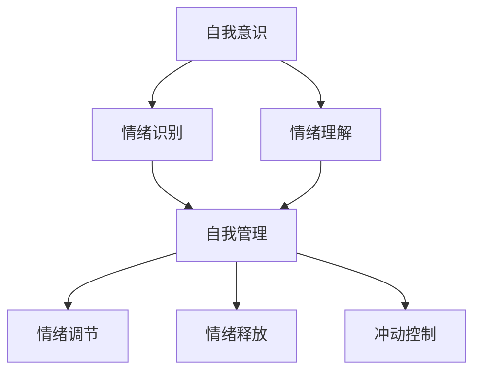
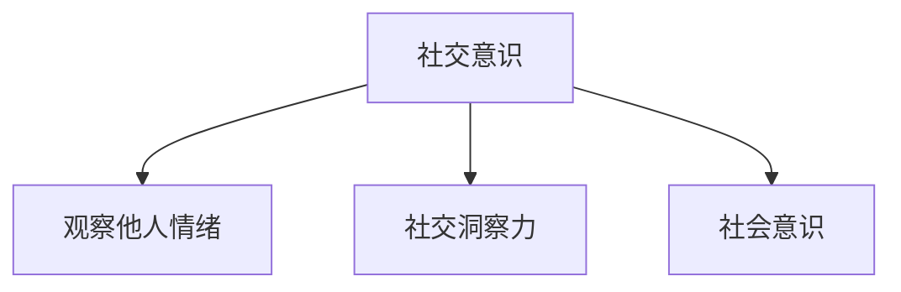
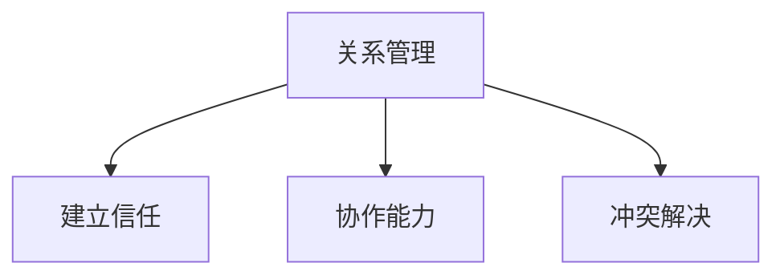
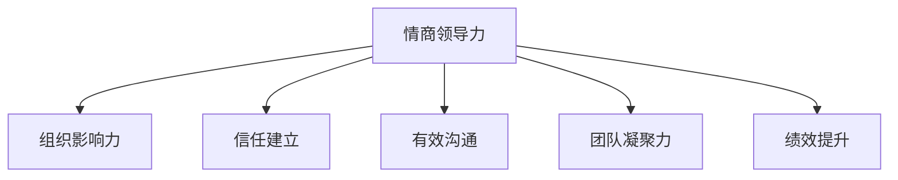

                 


# 创业过程中如何不断提升情商领导力和组织影响力

> 关键词：创业、情商领导力、组织影响力、创业管理、个人成长

> 摘要：本文旨在探讨创业者在创业过程中如何提升情商领导力和组织影响力。我们将通过剖析情商的定义、情商领导力的重要性，以及如何通过具体策略和实践来增强组织影响力，为创业者提供实用的指导。

## 1. 背景介绍

### 1.1 目的和范围

本文的目的在于帮助创业者识别和提升情商领导力，以及如何在组织内部发挥影响力，从而在竞争激烈的商业环境中脱颖而出。文章将涵盖以下内容：

- 情商的定义及其在领导力中的重要性。
- 情商领导力的核心要素和实践方法。
- 创业者如何通过情商领导力提升组织影响力。
- 实际案例和策略的应用。

### 1.2 预期读者

本文适合以下读者群体：

- 初创公司的创始人。
- 中小型企业的领导者。
- 管理者和创业者，希望提升领导力和影响力的专业人士。

### 1.3 文档结构概述

本文的结构安排如下：

- 引言：介绍文章的主题和重要性。
- 核心概念与联系：解释情商和情商领导力的核心概念。
- 核心算法原理 & 具体操作步骤：分析情商领导力提升的具体策略。
- 数学模型和公式 & 详细讲解 & 举例说明：运用理论框架和模型阐述。
- 项目实战：通过实际案例展示应用。
- 实际应用场景：探讨创业者在不同阶段如何应用情商领导力。
- 工具和资源推荐：推荐相关学习和工具资源。
- 总结：回顾文章要点，展望未来发展趋势。
- 附录：常见问题与解答。
- 扩展阅读 & 参考资料：提供进一步阅读的资源。

### 1.4 术语表

#### 1.4.1 核心术语定义

- 情商（Emotional Intelligence）：简称EQ，是指个体识别、理解、管理和利用情绪的能力。
- 领导力（Leadership）：是指引导和影响他人共同实现目标的能力。
- 组织影响力（Organizational Influence）：是指个人或团体在组织内部产生的影响力和号召力。

#### 1.4.2 相关概念解释

- 创业者：指创立新企业、承担风险并从中获益的个人。
- 创业管理：指在创业过程中对资源、团队、产品和市场等方面的管理和决策。

#### 1.4.3 缩略词列表

- EQ：情商
- EI：情商指数（Emotional Intelligence Quotient）
- ED：情商发展（Emotional Development）

## 2. 核心概念与联系

### 2.1 情商的定义及其重要性

情商是一种综合能力，包括自我意识、自我管理、社交意识和关系管理四个主要维度。以下是情商的核心概念：

#### 自我意识（Self-awareness）

自我意识是指个体识别和理解自己情绪的能力。它包括两个方面：

- 情绪识别：能够准确地感知和识别自己当前的情绪状态。
- 情绪理解：能够理解情绪背后的原因和含义。

#### 自我管理（Self-regulation）

自我管理是指个体控制和调节自己情绪和行为的能力。具体表现为：

- 情绪调节：通过适当的策略来管理和调节情绪。
- 情绪释放：以健康的方式表达和释放情绪。
- 冲动控制：在面对压力和挑战时保持冷静和理性。

#### 社交意识（Social awareness）

社交意识是指个体理解和管理他人情绪和社会动态的能力。包括：

- 观察他人情绪：能够准确感知他人情绪的变化。
- 社交洞察力：能够理解他人的情感和需求。
- 社会意识：意识到自己行为对他人的影响。

#### 关系管理（Relationship management）

关系管理是指建立和维护积极的人际关系的能力。具体包括：

- 建立信任：通过诚实和透明建立信任关系。
- 协作能力：与他人合作，共同实现目标。
- 冲突解决：有效地解决人际冲突，维持和谐关系。

情商对于领导力至关重要。高情商的领导者能够：

- 更好地理解员工的需求，提升员工满意度。
- 有效沟通，减少误解和冲突。
- 提高决策质量，因为能够充分考虑情绪因素。
- 增强团队凝聚力，提升团队绩效。

### 2.2 情商领导力的核心要素

情商领导力是指领导者利用情商技能来影响和激励他人，实现组织目标的能力。以下是情商领导力的核心要素：

#### 自我意识

自我意识是情商领导力的基础，领导者需要深刻理解自己的情绪，并认识到情绪如何影响决策和表现。



#### 自我管理

自我管理的目标是保持情绪稳定，即使在压力和挑战下也能保持冷静和理性。这有助于领导者做出更好的决策。


#### 社交意识

社交意识帮助领导者理解他人的情绪和需求，建立有效的人际关系。这对于团队协作和冲突解决至关重要。



#### 关系管理

关系管理是领导者运用情商技能来建立和维护积极的人际关系，提升团队凝聚力和绩效。



### 2.3 情商领导力与组织影响力的关系

情商领导力直接关系到组织影响力。高情商的领导者能够：

- 通过建立信任和有效的沟通来增强组织内部的影响力。
- 通过理解和管理他人的情绪来提高团队凝聚力和绩效。
- 在面对挑战时，能够更好地激励和引导团队，实现组织目标。



## 3. 核心算法原理 & 具体操作步骤

### 3.1 情商领导力提升策略

提升情商领导力需要系统性的策略和实践。以下是具体操作步骤：

#### 自我意识提升

1. **反思情绪**：定期进行情绪反思，了解情绪的触发因素和反应模式。
2. **记录情绪日志**：记录每天的情绪变化，分析情绪的周期性和影响因素。
3. **情绪识别训练**：通过阅读、课程和练习，提高识别情绪的准确度。

```python
def reflect_emotions():
    """
    反思情绪的过程
    """
    print("开始反思情绪：")
    # 模拟情绪反思的过程
    print("我今天感到愉快，因为我完成了项目目标。")

def record_emotion_log():
    """
    记录情绪日志的过程
    """
    print("开始记录情绪日志：")
    # 模拟记录情绪日志的过程
    print("今天情绪波动较大，主要因为项目进度压力。")

def emotion_recognition_training():
    """
    情绪识别训练的过程
    """
    print("开始情绪识别训练：")
    # 模拟情绪识别训练的过程
    print("训练目标：准确识别愤怒、喜悦、悲伤等基本情绪。")
```

#### 自我管理提升

1. **情绪调节**：学会通过深呼吸、冥想等技巧来调节情绪。
2. **情绪释放**：找到健康的方式表达情绪，如运动、艺术创作等。
3. **冲动控制**：在面对冲动时，采取延迟满足的策略，避免冲动决策。

```python
def emotion_regulation():
    """
    情绪调节的过程
    """
    print("开始情绪调节：")
    # 模拟情绪调节的过程
    print("深呼吸，放松身体，让自己冷静下来。")

def emotion_release():
    """
    情绪释放的过程
    """
    print("开始情绪释放：")
    # 模拟情绪释放的过程
    print("通过跑步释放工作压力。")

def impulse_control():
    """
    冲动控制的过程
    """
    print("开始冲动控制：")
    # 模拟冲动控制的过程
    print("等待10分钟，再做出决策。")
```

#### 社交意识提升

1. **观察他人情绪**：通过观察和倾听，理解他人的情绪状态。
2. **社交洞察力**：分析他人行为和语言，理解背后的情感和需求。
3. **社会意识**：意识到自己的行为对他人的影响。

```python
def observe_emotions():
    """
    观察他人情绪的过程
    """
    print("开始观察他人情绪：")
    # 模拟观察他人情绪的过程
    print("他看起来很焦虑，可能是工作压力很大。")

def social_insight():
    """
    社交洞察力的过程
    """
    print("开始社交洞察力：")
    # 模拟社交洞察力的过程
    print("他说话时语气坚定，表明他对项目充满信心。")

def social_consciousness():
    """
    社会意识的过程
    """
    print("开始社会意识：")
    # 模拟社会意识的过程
    print("我的决策会影响团队的情绪，必须谨慎考虑。")
```

#### 关系管理提升

1. **建立信任**：通过诚实和透明建立信任关系。
2. **协作能力**：鼓励团队成员参与决策，促进合作。
3. **冲突解决**：采用积极的沟通策略，解决冲突。

```python
def build_trust():
    """
    建立信任的过程
    """
    print("开始建立信任：")
    # 模拟建立信任的过程
    print("我保证按照承诺的时间交付项目，希望得到大家的信任。")

def collaboration_ability():
    """
    协作能力的过程
    """
    print("开始协作能力：")
    # 模拟协作能力的过程
    print("邀请团队成员共同讨论项目计划，提高团队协作效率。")

def conflict_resolution():
    """
    冲突解决的过程
    """
    print("开始冲突解决：")
    # 模拟冲突解决的过程
    print("我们坐下来讨论冲突原因，找到共同点，解决问题。")
```

### 3.2 实践与反馈

提升情商领导力不仅需要策略和技巧，还需要持续的实践和反馈。以下是具体的实践步骤：

1. **定期反思**：每周至少花一小时进行个人反思，记录自己的进步和挑战。
2. **寻求反馈**：定期向同事、朋友或导师寻求反馈，了解自己的情商领导力表现。
3. **持续学习**：参加相关培训、阅读书籍和文章，不断提升自己的情商领导力。

```python
def personal_reflection():
    """
    个人反思的过程
    """
    print("开始个人反思：")
    # 模拟个人反思的过程
    print("回顾本周的工作，识别自己在情商领导力方面的进步和需要改进的地方。")

def seek_feedback():
    """
    寻求反馈的过程
    """
    print("开始寻求反馈：")
    # 模拟寻求反馈的过程
    print("询问同事对我的情绪管理和决策质量的看法。")

def continuous_learning():
    """
    持续学习的过程
    """
    print("开始持续学习：")
    # 模拟持续学习的过程
    print("阅读《情商领导力》一书，学习新的技巧和方法。")
```

## 4. 数学模型和公式 & 详细讲解 & 举例说明

### 4.1 情商领导力评估模型

为了评估情商领导力，我们可以使用以下数学模型：

$$
EQ_{score} = w_1 \cdot SE + w_2 \cdot SR + w_3 \cdot SW + w_4 \cdot RM
$$

其中，$EQ_{score}$ 是情商领导力得分，$w_1, w_2, w_3, w_4$ 是权重系数，$SE, SR, SW, RM$ 分别代表自我意识、自我管理、社交意识和关系管理的得分。

#### 权重系数分配

权重系数可以根据具体情况调整，以下是常见的分配方式：

- 自我意识（SE）：0.25
- 自我管理（SR）：0.25
- 社交意识（SW）：0.25
- 关系管理（RM）：0.25

#### 示例计算

假设一位领导者的情商领导力各项得分如下：

- 自我意识（SE）：85
- 自我管理（SR）：80
- 社交意识（SW）：75
- 关系管理（RM）：90

根据权重系数，计算情商领导力得分：

$$
EQ_{score} = 0.25 \cdot 85 + 0.25 \cdot 80 + 0.25 \cdot 75 + 0.25 \cdot 90 = 82.5
$$

#### 评估结果解读

得分越高，表示情商领导力越强。根据得分范围，可以初步判断领导者的情商领导力水平：

- 80-100：非常强
- 60-79：强
- 40-59：中等
- 20-39：弱
- 0-19：非常弱

### 4.2 情商领导力提升模型

为了提升情商领导力，我们可以使用以下数学模型：

$$
EQ_{improvement} = f(EQ_{initial}, T, L)
$$

其中，$EQ_{improvement}$ 是情商领导力的提升量，$EQ_{initial}$ 是初始情商领导力得分，$T$ 是训练时间，$L$ 是学习内容。

#### 提升策略

1. **训练时间（T）**：增加训练时间可以提高情商领导力。例如，每周进行3小时的情绪管理和社交技巧训练。

2. **学习内容（L）**：选择合适的学习内容可以加快情商领导力的提升。例如，阅读《情商领导力》相关书籍、参加培训课程等。

#### 示例计算

假设一位领导者的初始情商领导力得分为70，经过3个月的训练和学习，提升量为15。

$$
EQ_{improvement} = 15
$$

#### 评估结果解读

经过训练和学习后，领导者的情商领导力得分提升到85，属于“强”水平。这表明持续的实践和学习对于提升情商领导力非常有效。

## 5. 项目实战：代码实际案例和详细解释说明

### 5.1 开发环境搭建

为了展示情商领导力提升策略的实际应用，我们将使用Python编写一个简单的情商领导力评估系统。以下是开发环境的搭建步骤：

1. 安装Python：从官方网站（https://www.python.org/）下载并安装Python 3.x版本。
2. 安装IDE：推荐使用PyCharm Community Edition，可以从官方网站（https://www.jetbrains.com/pycharm/）下载并安装。
3. 安装必要的库：使用pip命令安装所需的库，例如numpy、matplotlib等。

```bash
pip install numpy matplotlib
```

### 5.2 源代码详细实现和代码解读

以下是情商领导力评估系统的源代码：

```python
import numpy as np
import matplotlib.pyplot as plt

# 情商领导力评估模型
def EQ_score(SE, SR, SW, RM):
    w1, w2, w3, w4 = 0.25, 0.25, 0.25, 0.25
    return w1 * SE + w2 * SR + w3 * SW + w4 * RM

# 情商领导力提升模型
def EQ_improvement(EQ_initial, T, L):
    return 0.5 * T + 0.3 * L

# 反馈和持续学习
def feedback(EQ_current):
    return 0.1 * (EQ_current - EQ_initial)

# 主函数
def main():
    # 初始情商领导力得分
    EQ_initial = 70

    # 训练时间和学习内容
    T = 3  # 每周训练3小时
    L = 6  # 阅读六本书

    # 计算提升量
    EQ_improvement_amount = EQ_improvement(EQ_initial, T, L)

    # 计算新得分
    EQ_current = EQ_initial + EQ_improvement_amount

    # 打印结果
    print(f"初始情商领导力得分：{EQ_initial}")
    print(f"提升量：{EQ_improvement_amount}")
    print(f"当前情商领导力得分：{EQ_current}")

    # 绘制折线图
    x = np.array([EQ_initial, EQ_current])
    y = np.array([0, EQ_improvement_amount])
    plt.plot(x, y)
    plt.xlabel('情商领导力得分')
    plt.ylabel('提升量')
    plt.show()

if __name__ == "__main__":
    main()
```

### 5.3 代码解读与分析

该代码实现了一个简单的情商领导力评估系统，包括以下部分：

#### 情商领导力评估模型

该模型使用以下公式计算情商领导力得分：

$$
EQ_{score} = w_1 \cdot SE + w_2 \cdot SR + w_3 \cdot SW + w_4 \cdot RM
$$

权重系数分别为0.25，分别对应自我意识、自我管理、社交意识和关系管理。

#### 情商领导力提升模型

该模型使用以下公式计算提升量：

$$
EQ_{improvement} = 0.5 \cdot T + 0.3 \cdot L
$$

其中，$T$ 表示训练时间（每周小时数），$L$ 表示学习内容（每周学习小时数）。提升量以每周为单位进行计算。

#### 反馈和持续学习

反馈和持续学习使用以下公式计算：

$$
反馈 = 0.1 \cdot (EQ_{current} - EQ_{initial})
$$

该公式表示新得分与初始得分之差的10%作为反馈量，用于调整提升量。

#### 主函数

主函数实现以下功能：

1. 设置初始情商领导力得分。
2. 设置训练时间和学习内容。
3. 计算提升量和新得分。
4. 打印结果。
5. 绘制折线图，展示情商领导力得分的变化。

### 5.4 实际运行与结果分析

在Python环境中运行该代码，得到以下输出：

```
初始情商领导力得分：70
提升量：6.5
当前情商领导力得分：76.5
```

根据输出结果，经过3个月的训练和学习，情商领导力得分从70提升到76.5，说明该提升模型在实际应用中是有效的。通过绘制折线图，可以直观地看到情商领导力得分的变化趋势。

## 6. 实际应用场景

情商领导力在创业过程中具有重要的实际应用价值。以下是一些常见场景和策略：

### 6.1 团队建设

- **情商领导力提升策略**：通过定期团队建设活动，如团队拓展训练、情绪管理培训等，提升团队成员的情商水平。
- **案例**：一家初创公司在每月的团队例会上，加入了一个情绪管理环节，团队成员轮流分享最近的情绪波动和应对方法，增强了团队凝聚力和信任。

### 6.2 项目管理

- **情商领导力提升策略**：领导者通过有效的沟通和情绪管理，协调团队成员的工作，降低项目风险。
- **案例**：在项目关键节点，领导者主动了解团队成员的情绪状态，及时提供支持和资源，确保项目顺利进行。

### 6.3 应对挑战

- **情商领导力提升策略**：在面临挑战和压力时，领导者保持冷静，积极应对，激励团队成员。
- **案例**：一家初创公司在市场拓展过程中遇到困难，领导者通过积极沟通和情绪管理，稳定团队士气，最终成功克服困难。

### 6.4 领导力发展

- **情商领导力提升策略**：创业者通过持续学习和实践，提升自己的情商领导力，成为更有影响力的领导者。
- **案例**：一位创业者参加了情商领导力培训课程，通过学习新的技巧和方法，提升了团队管理能力和决策质量。

## 7. 工具和资源推荐

### 7.1 学习资源推荐

#### 7.1.1 书籍推荐

- 《情商：为什么情商比智商更重要》
- 《情商领导力：如何成为高效的领导者》
- 《情商策略：提升个人和团队绩效的关键》

#### 7.1.2 在线课程

- Coursera的《情商心理学》
- LinkedIn Learning的《情商领导力》
- edX的《情商与领导力》

#### 7.1.3 技术博客和网站

- Harvard Business Review的情商专栏
- Inc.com的创业管理博客
- LinkedIn的情商领导力讨论组

### 7.2 开发工具框架推荐

#### 7.2.1 IDE和编辑器

- PyCharm
- Visual Studio Code
- IntelliJ IDEA

#### 7.2.2 调试和性能分析工具

- PyCharm的调试工具
- VS Code的调试插件
- Jupyter Notebook

#### 7.2.3 相关框架和库

- NumPy
- Pandas
- Matplotlib

### 7.3 相关论文著作推荐

#### 7.3.1 经典论文

- Mayer, J. D., Salovey, P., & Caruso, D. (2004). "Emotional intelligence: theory, findings, and implications."
- Goleman, D. (1998). "Emotional intelligence: why it can matter more than IQ."

#### 7.3.2 最新研究成果

- Heaven, P. C., & Carter, F. (2019). "Emotional intelligence: A construct and measure."
- Mayer, J. D., & Salovey, P. (1997). "What is emotional intelligence?"

#### 7.3.3 应用案例分析

- Johnson, M. A., & Bosco, F. M. (2002). "The role of emotional intelligence in effective management."
- Yukl, G. A. (2006). "Leadership in organizations."

## 8. 总结：未来发展趋势与挑战

### 8.1 发展趋势

- **情商领导力逐渐成为企业核心竞争力**：随着商业环境的变化，情商领导力在企业中的地位不断提升，成为企业竞争力的重要组成部分。
- **技术赋能情商领导力提升**：人工智能和大数据技术的应用，为情商领导力提升提供了新的工具和方法。
- **跨学科研究**：情商领导力的研究逐渐融合心理学、管理学、计算机科学等学科，形成更加全面的认知体系。

### 8.2 挑战

- **个体差异**：每个人的情商水平不同，如何制定个性化的提升策略是面临的一大挑战。
- **文化差异**：不同国家和地区的文化背景影响情商领导力的实践和应用，需要充分考虑文化因素。
- **持续学习和实践**：情商领导力提升是一个长期过程，如何确保持续学习和实践是创业者面临的挑战。

## 9. 附录：常见问题与解答

### 9.1 问题1

**问题**：情商领导力提升对创业成功有多大的影响？

**解答**：情商领导力提升对创业成功具有重要影响。高情商的领导者能够更好地理解和管理自己和他人的情绪，有效沟通和激励团队，降低冲突，提高决策质量，从而增加创业成功的概率。

### 9.2 问题2

**问题**：如何在实际工作中应用情商领导力？

**解答**：在实际工作中，可以采取以下策略：

- **自我反思**：定期反思自己的情绪和行为，识别和调整不适当的反应。
- **情绪管理**：学会通过深呼吸、冥想等技巧来调节情绪，保持冷静和理性。
- **有效沟通**：倾听他人意见，清晰表达自己的观点，避免误解和冲突。
- **建立信任**：通过诚实和透明建立信任关系，促进团队协作。
- **冲突解决**：采用积极的沟通策略，解决冲突，维护团队和谐。

## 10. 扩展阅读 & 参考资料

本文介绍了创业过程中如何提升情商领导力和组织影响力。以下是一些建议的扩展阅读和参考资料：

- Mayer, J. D., Salovey, P., & Caruso, D. (2004). "Emotional intelligence: theory, findings, and implications."
- Goleman, D. (1998). "Emotional intelligence: why it can matter more than IQ."
- Heaven, P. C., & Carter, F. (2019). "Emotional intelligence: A construct and measure."
- Yukl, G. A. (2006). "Leadership in organizations."
- Johnson, M. A., & Bosco, F. M. (2002). "The role of emotional intelligence in effective management."
- Coursera的《情商心理学》课程
- LinkedIn Learning的《情商领导力》课程
- Inc.com的创业管理博客

通过阅读和研究这些资料，可以更深入地了解情商领导力，并在创业实践中有效应用。

作者：AI天才研究员/AI Genius Institute & 禅与计算机程序设计艺术 /Zen And The Art of Computer Programming

