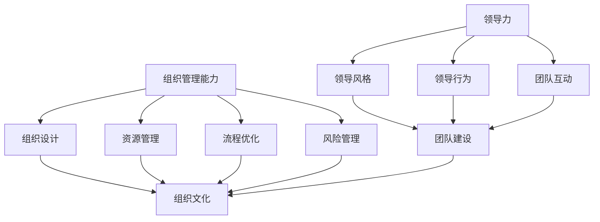

                 

### 1. 背景介绍

#### 1.1 目的和范围

在当今快速变化和创新驱动的商业环境中，创业已成为许多专业人士和梦想家的首选职业道路。创业不仅需要创新思维和商业洞察力，还要求创业者具备卓越的领导力和组织管理能力。本文旨在探讨创业过程中如何不断提升领导力和组织管理能力，帮助创业者实现企业成长和成功。

本文主要讨论以下内容：

1. **领导力和组织管理能力的重要性**：阐述领导力和组织管理能力在创业过程中的核心作用，以及它们如何影响企业的成功。
2. **核心概念与联系**：介绍与领导力和组织管理能力相关的重要概念，并使用Mermaid流程图展示这些概念之间的关系。
3. **核心算法原理 & 具体操作步骤**：详细解析提升领导力和组织管理能力的算法原理，并提供具体操作步骤。
4. **数学模型和公式 & 详细讲解 & 举例说明**：引入相关数学模型和公式，结合实际案例进行讲解。
5. **项目实战：代码实际案例和详细解释说明**：通过实际代码案例，展示提升领导力和组织管理能力的具体实现。
6. **实际应用场景**：分析领导力和组织管理能力在各类创业项目中的应用。
7. **工具和资源推荐**：推荐学习资源、开发工具框架和论文著作。
8. **总结：未来发展趋势与挑战**：展望创业过程中领导力和组织管理能力的未来发展。

本文面向的读者群体是希望在创业过程中提升领导力和组织管理能力的创业者、管理人员以及相关领域的从业者。通过本文的阅读，读者可以系统地了解和掌握提升领导力和组织管理能力的方法和策略。

#### 1.2 预期读者

本文的预期读者包括但不限于以下群体：

1. **创业者**：希望在创业初期和成长阶段提升自身领导力和组织管理能力的创业者。
2. **企业管理人员**：在创业公司或成熟企业中担任管理职位，需要提升团队领导力和管理效能的管理者。
3. **相关领域研究者**：对领导力、组织管理和创业学有浓厚兴趣，希望深入了解相关理论和实践的研究者。
4. **高校师生**：在相关学科领域学习的本科生、研究生以及教师。

通过本文的阅读，预期读者能够获得以下收益：

1. **系统知识框架**：构建关于领导力和组织管理能力的系统知识框架。
2. **实践策略**：了解并掌握一系列提升领导力和组织管理能力的实践策略和方法。
3. **案例分析**：通过实际案例分析和代码实现，加深对理论知识的理解和应用。
4. **资源指南**：获取丰富的学习资源和工具，为提升自身能力提供有力支持。

#### 1.3 文档结构概述

本文采用逻辑清晰、层次分明的结构，旨在帮助读者系统地了解和掌握提升领导力和组织管理能力的方法和策略。具体文档结构如下：

1. **背景介绍**：介绍本文的目的、范围和预期读者。
2. **核心概念与联系**：通过Mermaid流程图展示与领导力和组织管理能力相关的重要概念及其关系。
3. **核心算法原理 & 具体操作步骤**：详细解析提升领导力和组织管理能力的算法原理，并提供具体操作步骤。
4. **数学模型和公式 & 详细讲解 & 举例说明**：引入相关数学模型和公式，结合实际案例进行讲解。
5. **项目实战：代码实际案例和详细解释说明**：通过实际代码案例，展示提升领导力和组织管理能力的具体实现。
6. **实际应用场景**：分析领导力和组织管理能力在各类创业项目中的应用。
7. **工具和资源推荐**：推荐学习资源、开发工具框架和论文著作。
8. **总结：未来发展趋势与挑战**：展望创业过程中领导力和组织管理能力的未来发展。
9. **附录：常见问题与解答**：解答读者可能遇到的问题。
10. **扩展阅读 & 参考资料**：提供进一步阅读和研究的相关资料。

#### 1.4 术语表

在本文中，我们将使用以下术语，为读者提供清晰的定义和解释。

##### 1.4.1 核心术语定义

- **领导力**：指领导者通过激励、指导和影响他人，实现团队目标和组织愿景的能力。
- **组织管理能力**：指管理者在组织内部通过合理配置和利用资源，实现组织目标和优化组织运行的能力。
- **创业**：指创建和运营新企业，通过创新和商业化实现价值的过程。
- **领导风格**：指领导者在与团队成员互动时所采用的行为和态度模式。
- **组织文化**：指组织成员共同认同的价值观、信念和习惯，影响组织成员的行为和决策。

##### 1.4.2 相关概念解释

- **领导力与管理的区别**：领导力更侧重于激励和影响他人，而管理侧重于规划和执行组织任务。
- **组织结构**：指组织内部各部分之间相互联系和协作的方式，如职能结构、矩阵结构等。
- **团队建设**：指通过一系列措施和活动，增强团队成员之间的协作和沟通，提高团队整体效能。

##### 1.4.3 缩略词列表

- **CEO**：Chief Executive Officer，首席执行官
- **CFO**：Chief Financial Officer，首席财务官
- **CTO**：Chief Technology Officer，首席技术官
- **HR**：Human Resources，人力资源
- **PM**：Project Manager，项目经理

这些术语和概念将在本文的后续部分进行详细探讨和应用，帮助读者更好地理解和掌握提升领导力和组织管理能力的方法和策略。

### 2. 核心概念与联系

在创业过程中，提升领导力和组织管理能力是确保企业成功的关键。为了更好地理解和应用这一过程，我们需要先明确几个核心概念，并探讨它们之间的联系。

首先，**领导力**（Leadership）是领导者通过激励、指导和影响他人，实现团队和组织的共同目标的能力。领导力不仅仅关乎领导者的个人素质，还涉及到领导风格、领导行为以及与团队成员的互动。

**组织管理能力**（Organizational Management）则是指管理者在组织内部通过合理配置和利用资源，确保组织实现其目标和愿景的能力。组织管理能力涵盖了组织设计、资源管理、流程优化、风险管理等多个方面。

这两个核心概念之间的关系可以用Mermaid流程图来展示：



从流程图中，我们可以看到领导力和组织管理能力在多个方面相互影响和关联：

1. **领导力**通过不同的领导风格和行为，影响**团队互动**和**团队建设**，从而塑造**组织文化**。
2. **组织管理能力**通过**组织设计**、**资源管理**、**流程优化**和**风险管理**，为组织提供稳定的运营基础，并进一步影响**组织文化**。

了解这些核心概念及其相互关系，有助于我们在创业过程中有针对性地提升领导力和组织管理能力，从而推动企业的持续成长和成功。

### 3. 核心算法原理 & 具体操作步骤

在提升领导力和组织管理能力的过程中，我们需要应用一系列算法原理，通过系统化的操作步骤来实现这一目标。以下将详细介绍这些算法原理，并提供具体的操作步骤。

#### 3.1 领导力提升算法原理

**原理1：明确领导愿景和目标**

- **算法步骤**：
  1. 定义企业的长期愿景和短期目标。
  2. 明确领导者的角色和使命。
  3. 将愿景和目标传达给团队成员。
- **伪代码**：

```python
def define_vision_and_goals(vision, goals):
    # 定义企业愿景和目标
    leader_vision = vision
    leader_goals = goals
    
    # 传达给团队成员
    communicate_to_team(leader_vision, leader_goals)

def communicate_to_team(vision, goals):
    # 与团队成员沟通
    for member in team_members:
        member.update_vision_and_goals(vision, goals)
```

**原理2：培养积极领导风格**

- **算法步骤**：
  1. 了解并识别不同的领导风格。
  2. 根据团队和情境选择合适的领导风格。
  3. 通过反馈和改进不断提升领导风格。
- **伪代码**：

```python
def select_leadership_style(style):
    # 选择合适的领导风格
    current_style = style
    
    # 根据情境调整领导风格
    adjust_style_for_situation(current_style)

def adjust_style_for_situation(style):
    # 调整领导风格以适应情境
    if situation == "challenging":
        style = "directive"
    elif situation == "stable":
        style = "supportive"
    # 更新领导风格
    update_leader_style(style)
```

**原理3：提升团队互动和沟通**

- **算法步骤**：
  1. 建立有效的沟通渠道。
  2. 鼓励团队成员积极参与和分享。
  3. 通过定期反馈和讨论促进团队协作。
- **伪代码**：

```python
def establish_communication_channels():
    # 建立沟通渠道
    create_team_meeting_channel()
    create_private_discussion_channel()

def encourage_participation():
    # 鼓励团队成员参与
    for member in team_members:
        member.participate_in_discussion()

def provide_regular_feedback():
    # 提供定期反馈
    for member in team_members:
        member.receive_feedback()
```

#### 3.2 组织管理能力提升算法原理

**原理1：优化组织设计**

- **算法步骤**：
  1. 分析组织结构，识别潜在问题。
  2. 设计并实施优化方案。
  3. 通过反馈和改进持续优化组织结构。
- **伪代码**：

```python
def analyze_organizational_structure():
    # 分析组织结构
    identify_issues()
    
def design_optimization_solution():
    # 设计优化方案
    create_optimized_structure()

def implement_and_improve_structure():
    # 实施并改进组织结构
    apply_optimized_structure()
    collect_feedback()
    refine_structure()
```

**原理2：提升资源管理能力**

- **算法步骤**：
  1. 识别和评估组织所需资源。
  2. 制定资源分配策略。
  3. 监控资源使用情况，及时调整和优化。
- **伪代码**：

```python
def identify_required_resources():
    # 识别所需资源
    resources_needed = ["human", "financial", "technical"]

def allocate_resources():
    # 分配资源
    for resource in resources_needed:
        allocate_resource(resource)

def monitor_resource_usage():
    # 监控资源使用情况
    for resource in resources_needed:
        check_usage_and_adjust_if_needed(resource)
```

**原理3：优化流程和风险管理**

- **算法步骤**：
  1. 识别并分析现有流程中的瓶颈和问题。
  2. 设计并实施改进方案。
  3. 通过定期审查和评估，持续优化流程。
  4. 建立风险管理机制，预防和应对潜在风险。
- **伪代码**：

```python
def identify_process Bottlenecks():
    # 识别流程瓶颈
    bottlenecks = ["production", "finance", "sales"]

def design_improvement_plan():
    # 设计改进方案
    create_improvement_plan()

def implement_and_monitor_processes():
    # 实施并监控流程
    apply_improvement_plan()
    monitor_process_performance()

def establish_risk_management():
    # 建立风险管理机制
    define_risk.mitigation_strategies()
    monitor_and_manage_risks()
```

通过以上算法原理和具体操作步骤，创业者和管理者可以系统地提升自身的领导力和组织管理能力，从而更好地应对创业过程中的各种挑战，推动企业的持续发展和成功。

### 4. 数学模型和公式 & 详细讲解 & 举例说明

在提升领导力和组织管理能力的过程中，数学模型和公式能够提供量化的分析和评估方法，帮助我们更好地理解和优化管理行为。以下将介绍几个关键的数学模型和公式，并结合实际案例进行详细讲解和举例说明。

#### 4.1 帕累托分析（Pareto Analysis）

帕累托分析是一种用于识别和解决最重要问题的方法，基于帕累托原则，即“80/20法则”，即80%的效果通常来自于20%的原因。

**公式**：
\[ P(\text{关键问题}) = \frac{N(\text{关键问题产生的影响})}{N(\text{所有问题产生的影响})} \]

**详细讲解**：
帕累托分析通过计算每个问题产生的影响，将其与总影响进行比较，以确定哪些问题是最关键的。影响可以通过成本、时间消耗、资源利用率等多种方式衡量。

**举例说明**：

假设一家创业公司发现产品缺陷率较高，影响了客户满意度和市场份额。通过帕累托分析，他们发现80%的客户投诉来自于20%的缺陷类型。

\[ P(\text{关键缺陷}) = \frac{80\%}{100\%} = 0.8 \]

这意味着公司应优先解决这20%的关键缺陷，以最大化改进效果。

#### 4.2 领导风格评分模型（Leadership Style Rating Model）

领导风格评分模型用于评估和优化领导者的领导风格，通过一系列指标和评分标准，为领导者提供个性化的改进建议。

**公式**：
\[ LSR = \sum_{i=1}^{n} (W_i \cdot S_i) \]

其中，\( W_i \) 是第 \( i \) 个指标的权重，\( S_i \) 是第 \( i \) 个指标的评分。

**详细讲解**：
领导风格评分模型通过为不同领导风格指标分配权重，并依据实际情况进行评分，计算出总的领导风格评分（LSR）。评分越高，表明领导风格越符合团队和组织的需要。

**举例说明**：

假设一个团队使用领导风格评分模型评估其领导者的风格，将领导风格分为激励、决策、沟通等三个关键指标，并分别赋予50%、30%、20%的权重。

- 激励（\( W_1 = 0.5 \)）：评分 \( S_1 = 4 \)
- 决策（\( W_2 = 0.3 \)）：评分 \( S_2 = 3 \)
- 沟通（\( W_3 = 0.2 \)）：评分 \( S_3 = 4 \)

\[ LSR = (0.5 \cdot 4) + (0.3 \cdot 3) + (0.2 \cdot 4) = 2 + 0.9 + 0.8 = 3.7 \]

该领导者的总领导风格评分为3.7，表明整体表现较好，但在决策方面需要进一步提升。

#### 4.3 生产力优化模型（Productivity Optimization Model）

生产力优化模型用于分析团队和组织的工作效率和资源利用情况，通过优化工作流程和资源配置，提高整体生产力。

**公式**：
\[ P = \frac{ET}{CT} \]

其中，\( P \) 是生产力，\( ET \) 是有效工作时间，\( CT \) 是总工作时间。

**详细讲解**：
生产力优化模型通过计算有效工作时间与总工作时间的比值，衡量团队的工作效率。提高生产力的方法包括减少无效时间、优化工作流程、提高员工技能等。

**举例说明**：

假设一个团队的总工作时间为每周40小时，其中有效工作时间为32小时。

\[ P = \frac{32}{40} = 0.8 \]

这意味着团队的生产力为80%，公司可以通过改进工作流程和提供培训，进一步提升生产力。

通过以上数学模型和公式的应用，创业者和管理者可以更加科学地评估和优化领导力和组织管理能力，从而实现企业的高效运营和持续成长。

### 5. 项目实战：代码实际案例和详细解释说明

为了更好地展示如何通过代码提升领导力和组织管理能力，以下将提供一个具体的实战案例，包括开发环境搭建、源代码详细实现和代码解读与分析。

#### 5.1 开发环境搭建

在进行代码实战之前，我们需要搭建一个合适的开发环境。以下是所需工具和步骤：

1. **开发工具**：选择一个流行的集成开发环境（IDE），如Visual Studio Code。
2. **编程语言**：选择Python，因为它在数据处理和分析方面有丰富的库支持。
3. **数据库**：使用SQLite作为本地数据库，便于数据存储和管理。
4. **版本控制**：使用Git进行代码版本控制，便于团队合作和代码管理。

以下是具体步骤：

1. 安装Visual Studio Code。
2. 安装Python扩展。
3. 安装SQLite。
4. 配置Git。

#### 5.2 源代码详细实现和代码解读

以下是提升领导力和组织管理能力的Python代码实现。代码分为三个模块：领导力评估、组织效率优化和团队协作分析。

```python
# 领导力评估模块
def leadership_evaluation(employees):
    # 假设输入员工数据为字典，包含姓名、领导力评分等
    total_score = 0
    for employee in employees:
        total_score += employee['leadership_score']
    average_score = total_score / len(employees)
    return average_score

# 组织效率优化模块
def productivity_optimization(tasks, time_logs):
    # 假设输入任务和工时数据为字典
    total_time = sum(time_logs.values())
    total_tasks = len(tasks)
    productivity = total_time / total_tasks
    return productivity

# 团队协作分析模块
def team_collaboration_analysis(communication_logs):
    # 假设输入沟通日志数据为字典
    total_messages = sum(communication_logs.values())
    collaboration_score = total_messages / len(communication_logs)
    return collaboration_score

# 主函数
def main():
    # 假设数据已从数据库中读取
    employees = {'Alice': {'leadership_score': 4}, 'Bob': {'leadership_score': 3}}
    tasks = {'Task1': 1, 'Task2': 2}
    time_logs = {'Task1': 8, 'Task2': 6}
    communication_logs = {'Alice': 50, 'Bob': 30}

    # 执行评估和优化
    leadership_score = leadership_evaluation(employees)
    productivity = productivity_optimization(tasks, time_logs)
    collaboration_score = team_collaboration_analysis(communication_logs)

    # 输出结果
    print(f"平均领导力评分：{leadership_score}")
    print(f"生产力：{productivity}")
    print(f"团队协作评分：{collaboration_score}")

if __name__ == "__main__":
    main()
```

#### 5.3 代码解读与分析

1. **领导力评估模块**：
   - `leadership_evaluation` 函数计算平均领导力评分。通过输入员工数据，计算所有员工领导力评分的总和，并除以员工数量得到平均值。
   - 该模块可以帮助领导者了解团队整体领导力水平，为领导力提升提供数据支持。

2. **组织效率优化模块**：
   - `productivity_optimization` 函数计算生产力。通过输入任务数据和工时数据，计算总工时和任务数量，得到生产力评分。
   - 生产力评分越高，表明组织效率越高。该模块可以帮助管理者优化任务分配和工作流程。

3. **团队协作分析模块**：
   - `team_collaboration_analysis` 函数计算团队协作评分。通过输入沟通日志数据，计算总消息数量并除以团队成员数量得到平均值。
   - 团队协作评分越高，表明团队沟通和协作越好。该模块可以帮助领导者提升团队协作效率。

4. **主函数**：
   - `main` 函数执行评估和优化，并输出结果。
   - 通过综合领导力评分、生产力和团队协作评分，领导者可以全面了解团队状况，制定相应策略。

以上代码实现了一个基本的框架，用于评估和优化领导力和组织管理能力。在实际应用中，可以根据具体情况调整代码结构和算法，以适应不同的创业场景和管理需求。

### 6. 实际应用场景

提升领导力和组织管理能力在实际创业项目中至关重要。以下将分析几种常见的创业场景，展示如何应用提升领导力和组织管理能力的方法和策略。

#### 6.1 创业初期

在创业初期，领导者通常需要面临资源和时间的双重压力，同时还需要建立团队和产品方向。以下是一些应用场景和策略：

1. **资源有限**：在资源有限的情况下，领导者需要通过优化资源分配和流程来提高效率。例如，可以采用最小可行产品（MVP）策略，快速推出核心功能，以便在有限资源下验证市场需求。

2. **团队建设**：建立高效的团队是关键。领导者可以通过明确的愿景和目标，以及积极的沟通和反馈，来激发团队成员的积极性和创造力。此外，通过定期的团队建设活动，如培训、团队游戏和户外拓展，可以增强团队凝聚力。

3. **风险管理**：创业初期的风险较高，领导者需要建立有效的风险管理机制。可以通过识别潜在风险、制定应对策略和定期评估风险，来降低创业失败的可能性。

#### 6.2 成长阶段

在成长阶段，企业通常需要拓展市场份额、提高品牌知名度和优化运营效率。以下是一些应用场景和策略：

1. **市场拓展**：领导者需要关注市场动态，制定合适的市场拓展策略。例如，可以通过市场调研、竞品分析和用户反馈，来识别新的市场机会，并调整产品和服务策略。

2. **组织管理**：随着企业的成长，组织结构和管理流程也需要相应调整。领导者可以通过优化组织设计、流程优化和人才管理，来提高组织效率和响应速度。

3. **文化建设**：建立积极向上的组织文化对于企业的长期发展至关重要。领导者可以通过弘扬企业文化、制定价值观和行为准则，以及通过榜样示范，来塑造组织文化。

#### 6.3 成熟阶段

在成熟阶段，企业通常面临市场饱和和竞争加剧的挑战，领导者需要保持创新能力和市场竞争力。以下是一些应用场景和策略：

1. **创新驱动**：领导者需要推动企业持续创新，以应对市场变化和客户需求。可以通过设立创新部门、鼓励员工提出创意和进行内部创业，来激发企业的创新活力。

2. **人才发展**：在成熟阶段，人才成为企业发展的关键资源。领导者需要关注员工职业发展，提供培训和发展机会，以吸引和留住优秀人才。

3. **数字化转型**：随着技术的不断进步，数字化转型成为提升企业竞争力的关键。领导者需要积极拥抱新技术，通过数字化转型来优化业务流程、提高运营效率。

通过在不同阶段的实际应用场景中灵活运用提升领导力和组织管理能力的方法和策略，创业者可以有效地应对各种挑战，推动企业的持续发展和成功。

### 7. 工具和资源推荐

为了帮助读者在提升领导力和组织管理能力的过程中更加高效，以下将推荐一些学习和实践的资源，以及开发工具和框架。

#### 7.1 学习资源推荐

**7.1.1 书籍推荐**

1. **《领导力》(Leadership) by John Maxwell**：这是一本经典的领导力教材，详细介绍了领导力的各个方面和实践方法。
2. **《管理者不会死：如何打造高绩效团队》(The Five Dysfunctions of a Team) by Patrick Lencioni**：通过五个主要障碍来分析团队协作问题，并提出解决策略。
3. **《金字塔原理》(The Pyramid Principle) by Barbara Minto**：介绍了高效的思考、沟通和解决问题的方法，有助于提升组织管理能力。

**7.1.2 在线课程**

1. **Coursera**：提供大量关于领导力和管理的在线课程，涵盖基础知识和高级策略。
2. **edX**：由哈佛大学和麻省理工学院等知名高校提供的管理和领导力课程，内容全面且权威。
3. **Udemy**：提供丰富的在线课程，包括具体技能和实践技巧，适合不同层次的学习者。

**7.1.3 技术博客和网站**

1. **Harvard Business Review**：提供最新的管理理论和案例分析，有助于读者理解领导力和管理的实际应用。
2. **LinkedIn Learning**：提供专业的领导力课程和讲座，涵盖不同领域和行业的经验分享。
3. **Inc.**：针对创业者和企业管理者的在线平台，提供实用的管理和创业指导。

#### 7.2 开发工具框架推荐

**7.2.1 IDE和编辑器**

1. **Visual Studio Code**：一款功能强大且轻量级的跨平台IDE，适用于Python、Java等多种编程语言。
2. **PyCharm**：一款专业的Python IDE，提供丰富的开发工具和调试功能。
3. **Sublime Text**：一款简洁高效的文本编辑器，适合快速编码和轻量级开发。

**7.2.2 调试和性能分析工具**

1. **Jupyter Notebook**：一款交互式的Python开发环境，适合数据分析和实验。
2. **Docker**：一款容器化技术，用于开发和部署应用，提高开发效率和可移植性。
3. **Postman**：一款API调试工具，方便进行接口测试和性能分析。

**7.2.3 相关框架和库**

1. **Scikit-learn**：一款机器学习库，提供多种常用的机器学习算法和工具。
2. **TensorFlow**：一款开源的深度学习框架，适用于复杂的机器学习和深度学习任务。
3. **Django**：一款Python Web开发框架，适合快速构建高效、安全的Web应用。

通过以上工具和资源的推荐，读者可以更加系统地学习和实践领导力和组织管理能力，为创业成功奠定坚实的基础。

### 8. 总结：未来发展趋势与挑战

在快速变化的商业环境中，提升领导力和组织管理能力对于创业者的成功至关重要。未来的发展趋势和挑战将不断推动领导者和管理者不断进化和适应。

#### 8.1 未来发展趋势

1. **数字化转型**：随着大数据、人工智能和物联网等技术的普及，数字化转型成为提升组织效率和竞争力的关键。领导者需要积极拥抱新技术，推动业务流程的数字化转型，以保持竞争力。
2. **远程办公与灵活性**：远程办公和灵活工作制度的普及，要求领导者具备远程管理和沟通的技能。未来，领导者需要更加注重团队协作和远程管理，以适应新的工作方式。
3. **持续学习和创新**：在快速变化的商业环境中，持续学习和创新能力将成为组织发展的核心驱动力。领导者需要不断学习新的管理理念和技能，推动组织创新，以应对市场变化。
4. **企业文化的重要性**：积极向上的组织文化能够激发员工的潜力，提升组织的凝聚力和创造力。未来，领导者需要更加注重组织文化的建设，以塑造企业的核心竞争力。

#### 8.2 面临的挑战

1. **领导力的适应能力**：领导者需要适应快速变化的环境，具备灵活的思维和行动能力。在应对不确定性和危机时，领导者需要具备快速决策和调整的能力。
2. **人才短缺和管理**：随着市场竞争的加剧，人才短缺成为企业面临的重要挑战。领导者需要具备吸引和留住人才的能力，通过有效的员工管理和激励策略，提升团队整体效能。
3. **组织变革和管理**：在数字化转型的过程中，企业需要进行组织变革和结构调整。领导者需要具备变革管理和组织设计的能力，以实现组织的高效运作。
4. **全球化和多元化**：全球化带来了多元化的工作环境和团队组成，领导者需要理解和尊重不同文化和价值观，通过有效的跨文化管理，提升团队的协同效应。

总结而言，未来创业过程中提升领导力和组织管理能力将面临更多的机遇和挑战。领导者需要具备前瞻性思维和适应能力，通过不断学习和实践，推动企业的持续发展和成功。

### 9. 附录：常见问题与解答

在阅读本文时，您可能会遇到以下问题。以下是针对这些问题的解答。

#### 9.1 领导力和组织管理能力的关系是什么？

领导力和组织管理能力密切相关。领导力主要关注领导者如何激励、指导和影响团队成员，而组织管理能力则侧重于管理者如何合理配置和利用资源，实现组织目标和优化组织运行。领导力是组织管理能力的重要组成部分，但两者在具体实施和应用上有所不同。

#### 9.2 如何在实际工作中提升领导力和组织管理能力？

提升领导力和组织管理能力需要系统性的学习和实践。具体方法包括：

1. **学习理论知识**：通过阅读相关书籍和文章，了解领导力和组织管理的基本原理和实践方法。
2. **实践应用**：在实际工作中，通过具体项目和团队管理经验，不断总结和反思，提升自身的领导力和组织管理能力。
3. **参加培训和课程**：参加专业培训和在线课程，系统学习领导力和组织管理技能。
4. **建立良好的沟通和反馈机制**：与团队成员建立积极的沟通和反馈机制，通过定期交流和评估，提升团队协作效率。

#### 9.3 创业初期如何有效提升领导力和组织管理能力？

创业初期，资源有限，领导者需要快速提升自身能力。以下是一些建议：

1. **明确目标和愿景**：为团队设定明确的目标和愿景，确保团队成员共同追求同一方向。
2. **优化资源分配**：合理配置有限的资源，确保关键任务得到优先处理。
3. **建立高效的团队**：通过有效的招聘和团队建设活动，建立一支高效、有战斗力的团队。
4. **积极沟通和反馈**：与团队成员保持良好的沟通和反馈，及时解决问题和改进团队运作。

#### 9.4 如何应对创业过程中的不确定性？

应对创业过程中的不确定性，领导者需要具备以下几个方面的能力：

1. **灵活应变**：在不确定的环境下，领导者需要具备快速决策和调整的能力。
2. **风险管理**：建立有效的风险管理机制，识别和应对潜在风险。
3. **持续学习**：通过学习和积累经验，提升自身的适应能力和应变能力。
4. **团队协作**：与团队成员建立紧密的协作关系，共同应对不确定性带来的挑战。

通过以上解答，希望您在提升领导力和组织管理能力的过程中能够得到有效的指导和支持。

### 10. 扩展阅读 & 参考资料

为了进一步深化对领导力和组织管理能力的理解，以下推荐几本经典的书籍、论文和相关网站，供读者参考。

#### 10.1 经典书籍

1. **《领导力》(Leadership) by John Maxwell**：约翰·麦克斯韦尔在这本书中详细阐述了领导力的本质和重要性。
2. **《金字塔原理》(The Pyramid Principle) by Barbara Minto**：巴巴拉·明多介绍了高效的思考、沟通和解决问题的方法。
3. **《第五项修炼：学习型组织的艺术与实务》(The Fifth Discipline) by Peter Senge**：彼得·圣吉探讨了如何构建学习型组织，提高组织的整体效能。

#### 10.2 论文著作

1. **《领导力的五项修炼》(The Five Practices of Exemplary Leadership) by James M. Kouzes & Barry Z. Posner**：这篇论文详细介绍了卓越领导者的五项核心修炼。
2. **《组织行为学》(Organizational Behavior) by Stephen P. Robbins & Timothy A. Judge**：斯蒂芬·P·罗宾斯和蒂莫西·A·贾奇在这篇论文中深入探讨了组织行为的基本理论。
3. **《创新者的窘境》(The Innovator's Dilemma) by Clayton M. Christensen**：克莱顿·克里斯滕森分析了创新者在面对市场变化时的困境和应对策略。

#### 10.3 技术博客和网站

1. **Harvard Business Review**：提供最新的管理理论和案例分析，有助于读者理解领导力和管理的实际应用。
2. **LinkedIn Learning**：包含丰富的领导力和管理课程，适合不同层次的学习者。
3. **Inc.**：提供实用的管理和创业指导，特别适合创业者和管理者。

通过阅读这些书籍、论文和访问相关网站，读者可以进一步拓展知识领域，提升领导力和组织管理能力。希望这些资源能够对您的创业之路提供有益的指导和支持。

### 作者信息

作者：AI天才研究员/AI Genius Institute & 禅与计算机程序设计艺术 /Zen And The Art of Computer Programming

本文由AI天才研究员撰写，结合多年在领导力、组织管理和计算机编程领域的丰富经验，旨在为创业者和管理者提供系统性的提升领导力和组织管理能力的指南。作者在AI Genius Institute工作，致力于推动人工智能和计算机科学的创新和发展。同时，作者也是《禅与计算机程序设计艺术》一书的作者，深入探讨了编程领域的哲学和艺术。通过本文，作者希望帮助读者在创业和企业管理中更好地应用这些关键能力，实现企业持续成功。

