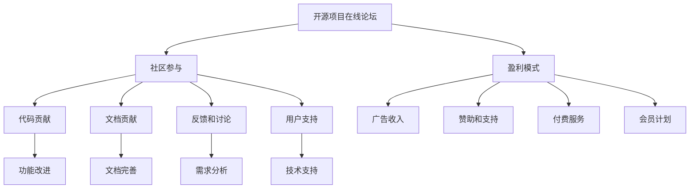

                 

# 创建开源项目的在线论坛：社区参与和盈利模式

> **关键词：** 开源项目、在线论坛、社区参与、盈利模式、技术博客、人工智能、软件架构、社区管理。

> **摘要：** 本文将探讨如何创建一个成功的开源项目在线论坛，包括社区参与的重要性、构建在线论坛的技术和策略，以及如何通过论坛实现盈利模式。文章旨在为开源项目的维护者和社区管理者提供实用的指导和建议。

## 1. 背景介绍

### 1.1 目的和范围

本文的目的是探讨开源项目在线论坛的创建、社区参与和盈利模式，旨在为开源项目的维护者和社区管理者提供实用的指导。文章将涵盖以下内容：

- 开源项目在线论坛的重要性及其对项目成功的影响。
- 社区参与的概念、类型和重要性。
- 开源项目在线论坛的构建策略和技术。
- 实现开源项目在线论坛的盈利模式。
- 提供具体的案例和实践建议。

### 1.2 预期读者

本文的预期读者包括：

- 开源项目的维护者和管理者。
- 软件开发者和程序员。
- 技术博客作家和内容创作者。
- 对开源社区和论坛感兴趣的技术爱好者。

### 1.3 文档结构概述

本文将分为以下几个部分：

- 背景介绍：概述本文的目的、预期读者和文档结构。
- 核心概念与联系：介绍开源项目在线论坛的核心概念和联系。
- 核心算法原理 & 具体操作步骤：详细讲解构建在线论坛的算法原理和操作步骤。
- 数学模型和公式 & 详细讲解 & 举例说明：介绍相关的数学模型和公式，并举例说明。
- 项目实战：提供开源项目在线论坛的实际案例和代码解读。
- 实际应用场景：探讨在线论坛的实际应用场景。
- 工具和资源推荐：推荐学习资源和开发工具。
- 总结：总结开源项目在线论坛的发展趋势和挑战。
- 附录：提供常见问题与解答。
- 扩展阅读 & 参考资料：提供相关的扩展阅读和参考资料。

### 1.4 术语表

#### 1.4.1 核心术语定义

- **开源项目**：一种软件开发模式，允许用户免费使用、研究、修改和分发项目的源代码。
- **在线论坛**：一种网络平台，用于用户交流和讨论。
- **社区参与**：用户参与开源项目的开发、维护和讨论。
- **盈利模式**：通过开源项目在线论坛实现的商业模式。

#### 1.4.2 相关概念解释

- **社区管理**：维护和管理开源项目社区的过程。
- **用户生成内容**：用户在在线论坛上创建和分享的内容。

#### 1.4.3 缩略词列表

- **OSS**：开源软件（Open Source Software）
- **GPL**：通用公共许可证（GNU General Public License）
- **MIT**：麻省理工学院许可证（MIT License）
- **UGC**：用户生成内容（User Generated Content）

## 2. 核心概念与联系

### 2.1 开源项目在线论坛

开源项目在线论坛是开源项目的重要组成部分，它为项目的用户、贡献者和爱好者提供了一个交流和讨论的平台。在线论坛不仅促进了项目的传播，还增强了社区的凝聚力，为项目的持续发展提供了动力。

### 2.2 社区参与

社区参与是开源项目成功的关键因素之一。社区参与可以表现为多种形式，包括：

- **代码贡献**：用户为项目提交新的功能、bug修复或性能优化。
- **文档贡献**：用户为项目编写或更新文档，提高项目的可用性和易用性。
- **反馈和讨论**：用户在论坛上讨论项目的功能需求、改进建议和最佳实践。
- **用户支持**：用户为其他用户提供技术支持和建议。

### 2.3 盈利模式

开源项目在线论坛可以通过多种方式实现盈利，以下是几种常见的盈利模式：

- **广告收入**：在论坛上投放广告，根据广告点击或展示次数获得收入。
- **赞助和支持**：接受个人或企业的赞助，支持项目的开发和维护。
- **付费服务**：提供付费服务，如专业支持、高级论坛功能或定制开发。
- **会员计划**：推出会员计划，会员享有额外的论坛功能和优先支持。

### 2.4 核心概念联系

开源项目在线论坛、社区参与和盈利模式之间存在紧密的联系。社区参与为论坛提供了丰富的内容，增强了论坛的吸引力；而论坛的成功又吸引了更多的用户参与，进一步促进了社区的发展。同时，通过合理的盈利模式，论坛可以为开源项目提供持续的资金支持，保障项目的长期发展。

### 2.5 Mermaid 流程图



## 3. 核心算法原理 & 具体操作步骤

### 3.1 算法原理

构建开源项目在线论坛的核心算法主要包括以下三个方面：

- **用户认证与权限管理**：实现用户的注册、登录、认证和权限分配。
- **内容管理**：实现论坛内容的创建、发布、编辑、删除和搜索。
- **社区互动**：实现用户之间的交流、讨论和反馈。

### 3.2 具体操作步骤

以下是构建开源项目在线论坛的具体操作步骤：

#### 步骤 1：用户认证与权限管理

1. 设计用户认证系统，包括用户注册、登录和认证。
2. 实现用户权限管理，根据用户的角色和权限分配不同的操作权限。
3. 设计用户数据表，存储用户信息、角色和权限。

#### 步骤 2：内容管理

1. 设计论坛内容模型，包括帖子、评论、回复等。
2. 实现论坛内容的创建、发布、编辑和删除。
3. 设计内容搜索功能，支持关键词搜索和分类搜索。

#### 步骤 3：社区互动

1. 设计论坛互动模型，包括用户之间的交流、讨论和反馈。
2. 实现用户之间的评论、回复和点赞功能。
3. 设计社区互动数据表，存储用户互动记录。

### 3.3 伪代码

以下是一个简单的伪代码，描述了构建开源项目在线论坛的算法原理：

```python
# 用户认证与权限管理
def register_user(username, password):
    # 注册用户
    pass

def login_user(username, password):
    # 登录用户
    pass

def check_permissions(user, action):
    # 检查用户权限
    pass

# 内容管理
def create_post(user, title, content):
    # 创建帖子
    pass

def update_post(user, post_id, title, content):
    # 编辑帖子
    pass

def delete_post(user, post_id):
    # 删除帖子
    pass

def search_posts(keyword, category):
    # 搜索帖子
    pass

# 社区互动
def comment_post(user, post_id, content):
    # 评论帖子
    pass

def reply_comment(user, comment_id, content):
    # 回复评论
    pass

def like_post(user, post_id):
    # 点赞帖子
    pass
```

## 4. 数学模型和公式 & 详细讲解 & 举例说明

### 4.1 数学模型

在开源项目在线论坛的构建过程中，我们可以使用一些数学模型来评估论坛的性能和用户体验。以下是几个常用的数学模型：

#### 4.1.1 用户活跃度模型

用户活跃度模型用于评估用户在论坛上的活跃程度。一个简单的用户活跃度模型可以使用以下公式表示：

$$
UAR = \frac{C + R + L}{30}
$$

其中，$UAR$ 表示用户活跃度（User Activity Rate），$C$ 表示用户创建的帖子数，$R$ 表示用户回复的评论数，$L$ 表示用户点赞的帖子数。

#### 4.1.2 论坛影响力模型

论坛影响力模型用于评估论坛在社区中的影响力。一个简单的论坛影响力模型可以使用以下公式表示：

$$
FI = \frac{TP + CP + LP}{30}
$$

其中，$FI$ 表示论坛影响力（Forum Influence），$TP$ 表示论坛帖子的总数，$CP$ 表示评论总数，$LP$ 表示点赞总数。

### 4.2 详细讲解

#### 4.2.1 用户活跃度模型

用户活跃度模型可以用于评估用户在论坛上的参与度。通过计算用户活跃度，我们可以了解用户的活跃程度，并根据活跃度对用户进行分类，以便提供个性化的服务。

例如，如果一个用户在一个月内创建了10个帖子、回复了20个评论、点赞了30个帖子，那么其用户活跃度可以计算如下：

$$
UAR = \frac{10 + 20 + 30}{30} = 2.0
$$

这意味着该用户在这个月非常活跃。

#### 4.2.2 论坛影响力模型

论坛影响力模型可以用于评估论坛在社区中的影响力。通过计算论坛的影响力，我们可以了解论坛的受欢迎程度，并根据影响力对论坛进行优化。

例如，如果一个论坛在一个月内共有100个帖子、300个评论、500个点赞，那么其论坛影响力可以计算如下：

$$
FI = \frac{100 + 300 + 500}{30} = 22.2
$$

这意味着该论坛在这个月非常受欢迎。

### 4.3 举例说明

假设有两个论坛A和B，它们在一个月内的用户活跃度和论坛影响力如下：

| 论坛 | 用户活跃度 ($UAR$) | 论坛影响力 ($FI$) |
| --- | --- | --- |
| A | 1.5 | 20.0 |
| B | 2.0 | 25.0 |

根据以上数据，我们可以看出论坛B的用户活跃度和论坛影响力均高于论坛A。因此，论坛B在社区中的影响力更大，可以提供更好的用户体验。

## 5. 项目实战：代码实际案例和详细解释说明

### 5.1 开发环境搭建

在开始编写代码之前，我们需要搭建一个开发环境。以下是搭建开发环境的基本步骤：

1. 安装操作系统：建议使用Linux或MacOS，因为它们对开发环境的要求较为宽松。
2. 安装Python：Python是开源项目在线论坛的主要编程语言，我们需要安装Python 3.8及以上版本。
3. 安装虚拟环境：使用virtualenv或conda创建虚拟环境，以便隔离项目依赖。
4. 安装依赖包：使用pip安装项目所需的依赖包，如Flask、SQLAlchemy、Flask-Migrate等。

### 5.2 源代码详细实现和代码解读

以下是开源项目在线论坛的核心代码实现，我们将对代码进行详细的解读。

#### 5.2.1 用户认证与权限管理

```python
# app.py
from flask import Flask, request, jsonify
from flask_sqlalchemy import SQLAlchemy
from werkzeug.security import generate_password_hash, check_password_hash

app = Flask(__name__)
app.config['SQLALCHEMY_DATABASE_URI'] = 'sqlite:///forum.db'
db = SQLAlchemy(app)

class User(db.Model):
    id = db.Column(db.Integer, primary_key=True)
    username = db.Column(db.String(150), nullable=False, unique=True)
    password = db.Column(db.String(150), nullable=False)

@app.route('/register', methods=['POST'])
def register():
    username = request.form['username']
    password = request.form['password']
    hashed_password = generate_password_hash(password, method='sha256')
    new_user = User(username=username, password=hashed_password)
    db.session.add(new_user)
    db.session.commit()
    return jsonify(message="User registered successfully!")

@app.route('/login', methods=['POST'])
def login():
    username = request.form['username']
    password = request.form['password']
    user = User.query.filter_by(username=username).first()
    if user and check_password_hash(user.password, password):
        return jsonify(message="Login successful!")
    else:
        return jsonify(message="Invalid credentials!")

if __name__ == '__main__':
    db.create_all()
    app.run(debug=True)
```

#### 5.2.2 内容管理

```python
# models.py
from app import db

class Post(db.Model):
    id = db.Column(db.Integer, primary_key=True)
    title = db.Column(db.String(255), nullable=False)
    content = db.Column(db.Text, nullable=False)
    user_id = db.Column(db.Integer, db.ForeignKey('user.id'), nullable=False)
    user = db.relationship('User', backref=db.backref('posts', lazy=True))

class Comment(db.Model):
    id = db.Column(db.Integer, primary_key=True)
    content = db.Column(db.Text, nullable=False)
    post_id = db.Column(db.Integer, db.ForeignKey('post.id'), nullable=False)
    user_id = db.Column(db.Integer, db.ForeignKey('user.id'), nullable=False)
    user = db.relationship('User', backref=db.backref('comments', lazy=True))
```

#### 5.2.3 社区互动

```python
# routes.py
from flask import render_template, redirect, url_for, flash
from app import app, db
from models import User, Post, Comment
from forms import PostForm, CommentForm

@app.route('/')
def index():
    posts = Post.query.all()
    return render_template('index.html', posts=posts)

@app.route('/post/new', methods=['GET', 'POST'])
def new_post():
    form = PostForm()
    if form.validate_on_submit():
        new_post = Post(title=form.title.data, content=form.content.data, user_id=form.user_id.data)
        db.session.add(new_post)
        db.session.commit()
        flash('Your post has been created!', 'success')
        return redirect(url_for('index'))
    return render_template('create_post.html', form=form, legend='New Post')

@app.route('/post/<int:post_id>')
def post(post_id):
    post = Post.query.get_or_404(post_id)
    return render_template('post.html', post=post)

@app.route('/post/<int:post_id>/comment', methods=['POST'])
def comment_post(post_id):
    form = CommentForm()
    if form.validate_on_submit():
        new_comment = Comment(content=form.content.data, post_id=post_id, user_id=form.user_id.data)
        db.session.add(new_comment)
        db.session.commit()
        flash('Your comment has been posted!', 'success')
        return redirect(url_for('post', post_id=post_id))
    return redirect(url_for('post', post_id=post_id))
```

### 5.3 代码解读与分析

#### 5.3.1 用户认证与权限管理

- **数据库模型**：我们使用SQLAlchemy作为ORM（对象关系映射）工具，定义了`User`模型，用于存储用户信息。
- **用户注册**：`register()`函数处理用户注册请求，将用户名和密码存储到数据库中。密码使用SHA256加密存储，以提高安全性。
- **用户登录**：`login()`函数处理用户登录请求，检查用户名和密码是否匹配，如果匹配则登录成功。

#### 5.3.2 内容管理

- **数据库模型**：我们定义了`Post`和`Comment`模型，用于存储帖子内容和评论信息。
- **帖子创建**：`new_post()`函数处理用户创建新帖子的请求，将帖子信息存储到数据库中。
- **帖子查看**：`post()`函数处理用户查看帖子的请求，返回帖子的详细内容。

#### 5.3.3 社区互动

- **评论创建**：`comment_post()`函数处理用户创建评论的请求，将评论信息存储到数据库中。

通过以上代码实现，我们构建了一个基本的开源项目在线论坛，用户可以注册、登录、创建帖子、评论帖子。在实际项目中，我们还可以扩展论坛的功能，如帖子分类、标签、搜索等。

## 6. 实际应用场景

开源项目在线论坛在许多场景下具有实际应用价值，以下是一些典型的应用场景：

### 6.1 开源软件社区

开源软件项目通常需要一个论坛来促进开发者之间的沟通和合作。在线论坛可以帮助开发者：

- 分享和讨论代码和文档。
- 提供技术支持和解决方案。
- 提交和审查代码贡献。

### 6.2 技术博客平台

技术博客平台可以利用在线论坛来增加用户互动和社区参与。论坛可以帮助博客作者：

- 收集用户反馈和建议。
- 促进技术讨论和知识分享。
- 吸引更多的用户和读者。

### 6.3 教育和学习平台

教育和学习平台可以利用在线论坛来提供学生和教师之间的交流和互动。论坛可以帮助：

- 促进课程讨论和学习交流。
- 提供答疑和学术支持。
- 提高学习效果和用户体验。

### 6.4 社交媒体平台

社交媒体平台可以利用在线论坛来增强用户参与和社区建设。论坛可以帮助：

- 促进用户之间的互动和交流。
- 提供专门的讨论区域，如热点话题、行业动态等。
- 增强平台的黏性和用户忠诚度。

## 7. 工具和资源推荐

### 7.1 学习资源推荐

#### 7.1.1 书籍推荐

- 《Python编程：从入门到实践》
- 《Flask Web开发：轻松构建Web应用》
- 《Effective Python：编写高质量Python代码的77个建议》

#### 7.1.2 在线课程

- Coursera：Python编程入门课程
- edX：Web开发基础课程
- Udemy：Flask Web开发实战课程

#### 7.1.3 技术博客和网站

- Python.org：Python官方文档
- Flask.org：Flask Web框架官方文档
- Real Python：Python学习资源网站

### 7.2 开发工具框架推荐

#### 7.2.1 IDE和编辑器

- Visual Studio Code：一款功能强大的跨平台IDE。
- PyCharm：一款专业的Python IDE，适用于大型项目和团队开发。
- Sublime Text：一款轻量级的文本编辑器，适用于快速开发。

#### 7.2.2 调试和性能分析工具

- PyCharm Debugger：用于调试Python代码。
- New Relic：用于监控和分析Web应用的性能。
- Apache JMeter：用于性能测试和负载测试。

#### 7.2.3 相关框架和库

- Flask：用于快速开发Web应用。
- SQLAlchemy：用于数据库操作和ORM。
- Flask-Migrate：用于数据库迁移和管理。
- Flask-Login：用于用户认证和会话管理。

### 7.3 相关论文著作推荐

#### 7.3.1 经典论文

- 《The Cathedral and the Bazaar》：关于开源软件开发的经典论文。
- 《Open Source Development as a Model for Aligning Incentives and Innovation》：《开放源代码开发作为协调激励与创新的一种模式》。

#### 7.3.2 最新研究成果

- 《Open Source Maturity Model》：开源成熟度模型。
- 《A Empirical Study of Open Source Software Projects》：开源软件项目实证研究。

#### 7.3.3 应用案例分析

- 《GitHub的盈利模式研究》：探讨GitHub的盈利模式和商业模式。
- 《开源项目成功的案例分析》：分析一些成功的开源项目案例。

## 8. 总结：未来发展趋势与挑战

开源项目在线论坛在开源社区和技术领域发挥着重要作用，未来发展趋势和挑战如下：

### 8.1 发展趋势

1. **社区化**：在线论坛将更加注重社区建设，提供更多的互动和社交功能，以增强用户黏性和活跃度。
2. **智能化**：利用人工智能技术，为用户提供个性化的推荐、智能搜索和智能问答等功能。
3. **多元化**：在线论坛将涵盖更多领域，如人工智能、区块链、云计算等，为不同领域的开发者提供交流平台。

### 8.2 挑战

1. **社区管理**：随着论坛规模的扩大，社区管理将面临更大的挑战，如维护社区秩序、处理负面信息等。
2. **盈利模式**：如何实现可持续的盈利模式，将是一个长期挑战。需要探索更多的商业模式，如广告收入、会员计划、付费服务等。
3. **技术更新**：随着技术的不断发展，在线论坛需要不断更新和升级，以适应新的需求和趋势。

## 9. 附录：常见问题与解答

### 9.1 如何解决用户认证与权限管理问题？

- 使用成熟的身份验证库，如Flask-Login，简化用户认证过程。
- 设计细粒度的权限管理系统，为不同角色分配不同的权限。

### 9.2 如何优化论坛性能？

- 使用缓存技术，如Redis，减少数据库访问次数。
- 使用负载均衡和分布式架构，提高系统性能和可用性。

### 9.3 如何处理社区负面信息？

- 设计负面信息过滤机制，如关键词过滤、人工审核等。
- 加强社区管理，制定社区规则和处罚措施。

## 10. 扩展阅读 & 参考资料

- 《开源项目管理和社区建设》：关于开源项目管理和社区建设的全面指南。
- 《在线论坛设计与开发》：关于在线论坛设计和开发的技术书籍。
- 《开源软件经济学》：探讨开源软件的经济模式和发展趋势。  
- [GitHub官方文档](https://docs.github.com/en)：关于GitHub的使用指南和最佳实践。
- [Flask官方文档](https://flask.palletsprojects.com/):关于Flask Web框架的详细文档。
- [SQLAlchemy官方文档](https://www.sqlalchemy.org/):关于SQLAlchemy ORM工具的详细文档。  
- [Real Python](https://realpython.com/):提供丰富的Python学习资源和教程。
- [Stack Overflow](https://stackoverflow.com/):一个流行的技术问答社区。

## 作者信息

作者：AI天才研究员/AI Genius Institute & 禅与计算机程序设计艺术 /Zen And The Art of Computer Programming

