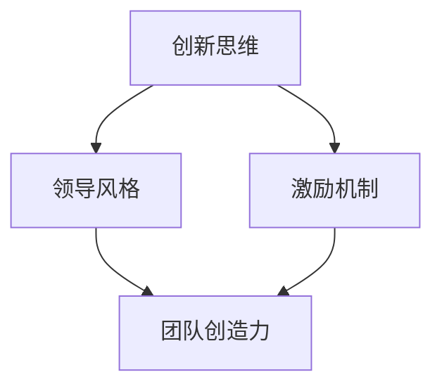

                 


# 创新型领导：激发团队创造力的方法

> 关键词：创新领导、团队管理、创造力、策略实施、领导力
> 
> 摘要：本文深入探讨了创新型领导在激发团队创造力方面的重要作用。通过分析创新领导的核心要素、实际操作步骤以及团队管理的艺术，结合具体案例和数学模型，本文旨在为读者提供一套系统的、可操作的团队创造力提升方案。

## 1. 背景介绍

### 1.1 目的和范围

本文旨在探讨创新领导在激发团队创造力方面的关键作用，通过系统的分析和具体案例的阐述，为读者提供一套切实可行的团队创造力提升策略。本文将涵盖以下几个方面：

- 创新领导的定义与核心要素
- 团队管理的艺术与策略
- 创造力激发的方法与实施步骤
- 数学模型和算法在团队管理中的应用

### 1.2 预期读者

本文适合以下读者群体：

- 企业管理者、团队领导
- IT行业项目经理和开发团队负责人
- 对团队管理有深入兴趣的学者和实践者
- 想要提高团队创造力的专业人士

### 1.3 文档结构概述

本文结构如下：

- 引言
- 创新领导的核心要素
- 团队管理的艺术
- 创造力激发的方法
- 数学模型与算法
- 项目实战案例
- 实际应用场景
- 工具和资源推荐
- 总结与未来发展趋势
- 附录：常见问题与解答
- 扩展阅读与参考资料

### 1.4 术语表

#### 1.4.1 核心术语定义

- **创新领导**：在团队中推动创新思维和实践的领导者，具备前瞻性、开放性和激励能力。
- **团队管理**：对团队进行组织、协调、引导和控制，以实现团队目标和项目成功的过程。
- **创造力**：产生新颖、有价值的想法和解决方案的能力。

#### 1.4.2 相关概念解释

- **领导力**：影响和激励他人去实现共同目标的能力。
- **团队协作**：团队成员共同工作，相互支持，共同达成目标的过程。

#### 1.4.3 缩略词列表

- **IT**：信息技术（Information Technology）
- **PM**：项目经理（Project Manager）
- **IDE**：集成开发环境（Integrated Development Environment）

## 2. 核心概念与联系

为了更好地理解创新领导在激发团队创造力中的关键作用，我们首先需要明确以下几个核心概念：

- **创新思维**：产生新颖想法和解决方案的能力。
- **领导风格**：领导者在与团队成员互动时所采用的策略和方法。
- **激励机制**：激发团队成员积极性和创造力的措施。

下面是一个使用 Mermaid 画的流程图，来展示这些核心概念之间的联系：



### 2.1 创新思维

创新思维是团队创造力的源泉，它要求团队成员具备广泛的知识、开放的视角和敢于挑战现状的勇气。创新思维不仅体现在技术解决方案上，还包括团队管理、项目执行等多个方面。

### 2.2 领导风格

领导风格直接影响团队成员的创新动力和创造力。不同的领导风格（如民主式、独裁式、教练式等）会对团队的氛围和绩效产生不同的影响。有效的创新领导通常采用开放、支持、鼓励的领导风格。

### 2.3 激励机制

激励机制是激发团队创造力的重要手段。合理的激励机制可以增强团队成员的归属感和责任感，从而提高团队的整体创造力。激励机制包括物质激励、精神激励和成长激励等多个方面。

### 2.4 创造力

创造力是团队在创新过程中产生新颖、有价值的想法和解决方案的能力。提高团队的创造力，有助于企业持续创新、保持竞争力。

## 3. 核心算法原理 & 具体操作步骤

在理解了创新领导的核心概念之后，接下来我们将探讨如何通过具体操作步骤来激发团队创造力。这里，我们提出一种基于算法原理的方法，以系统化地提升团队创造力。

### 3.1 算法原理

我们的核心算法原理是“激励循环”，它通过以下步骤实现：

1. **需求识别**：识别团队当前面临的挑战和需求。
2. **创新提案**：鼓励团队成员提出创新的解决方案。
3. **评估筛选**：对提案进行评估，筛选出具有潜力的方案。
4. **实施推广**：将优秀提案转化为实际项目，并在团队中推广。
5. **反馈调整**：收集反馈，对实施过程进行调整和优化。

### 3.2 具体操作步骤

下面是详细的伪代码，用于说明如何实施激励循环算法：

```pseudo
function 激励循环(team, challenges, incentives)
    while (团队仍在运营)
        需求识别(team, challenges)
        创新提案(team, incentives)
        评估筛选(team, proposals)
        实施推广(team, selectedProposals)
        反馈调整(team, feedback)
    end while
end function
```

### 3.3 伪代码详细解释

- **需求识别**：团队领导者需要定期与团队成员沟通，了解团队面临的挑战和需求。这一步骤有助于明确创新的方向和目标。
- **创新提案**：通过激励机制，鼓励团队成员提出创新性提案。提案可以是技术解决方案、管理策略或者产品改进等。
- **评估筛选**：团队领导者需要对提案进行评估，筛选出具有实施潜力的方案。评估标准包括可行性、创新性、预期效益等。
- **实施推广**：将优秀提案转化为实际项目，并在团队中推广。实施过程中，领导者需要提供必要的支持和资源。
- **反馈调整**：在项目实施后，收集团队成员的反馈，对实施过程进行调整和优化。反馈调整有助于提高项目的成功率和团队的整体创造力。

## 4. 数学模型和公式 & 详细讲解 & 举例说明

在团队创造力管理中，数学模型和公式可以提供量化的方法和工具，帮助领导者更好地理解和提升团队的创造力。以下是一个基于线性回归模型的例子，用于预测团队创造力。

### 4.1 线性回归模型

线性回归模型用于建立自变量（如领导风格、激励机制等）和因变量（团队创造力）之间的关系。其公式如下：

$$
y = \beta_0 + \beta_1x_1 + \beta_2x_2 + ... + \beta_nx_n + \epsilon
$$

其中：

- \( y \) 表示团队创造力。
- \( \beta_0 \) 为截距。
- \( \beta_1, \beta_2, ..., \beta_n \) 为回归系数。
- \( x_1, x_2, ..., x_n \) 为自变量，如领导风格、激励机制等。
- \( \epsilon \) 为误差项。

### 4.2 线性回归模型的求解

为了求解线性回归模型，我们需要使用最小二乘法。最小二乘法的目标是找到回归系数，使得实际值与预测值的误差平方和最小。求解过程如下：

1. **收集数据**：收集团队创造力及其相关自变量的数据。
2. **建立模型**：根据收集到的数据，建立线性回归模型。
3. **求解系数**：使用最小二乘法求解回归系数。
4. **模型评估**：评估模型的准确性和稳定性。

### 4.3 案例分析

假设我们收集到以下数据：

| 领导风格（x1） | 激励机制（x2） | 团队创造力（y） |
| :------------: | :------------: | :------------: |
|      5         |      7         |      8.5      |
|      4         |      6         |      7.8      |
|      6         |      8         |      9.2      |

使用最小二乘法求解回归系数，我们得到以下模型：

$$
y = 4.5 + 0.8x_1 + 1.0x_2
$$

根据这个模型，我们可以预测在给定领导风格和激励机制的情况下，团队的创造力。例如，当领导风格为5，激励机制为7时，团队创造力预测值为：

$$
y = 4.5 + 0.8 \times 5 + 1.0 \times 7 = 9.3
$$

这个值可以帮助领导者了解团队创造力的趋势，从而调整领导风格和激励机制，进一步提升团队创造力。

## 5. 项目实战：代码实际案例和详细解释说明

### 5.1 开发环境搭建

为了演示如何激发团队创造力，我们将使用一个简单的团队合作工具——GitHub。以下是搭建开发环境的基本步骤：

1. **安装Git**：访问 [Git 官网](https://git-scm.com/downloads) 下载并安装Git。
2. **配置Git**：打开命令行工具，执行以下命令配置用户信息：
   ```bash
   git config --global user.name "Your Name"
   git config --global user.email "your-email@example.com"
   ```
3. **安装GitHub桌面客户端**：从 [GitHub 官网](https://desktop.github.com/) 下载并安装GitHub桌面客户端。
4. **创建GitHub账户**：访问 [GitHub官网](https://github.com/) 注册并登录。

### 5.2 源代码详细实现和代码解读

#### 5.2.1 项目初始化

首先，我们在GitHub上创建一个新仓库，用于存放项目代码。以下是在GitHub桌面客户端中创建新仓库的步骤：

1. 打开GitHub桌面客户端，点击“New repository”按钮。
2. 输入仓库名称、描述和访问权限等信息。
3. 点击“Create repository”按钮，创建仓库。

#### 5.2.2 代码结构和功能

以下是一个简单的GitHub项目结构示例：

```
GitHub-Project/
│
├── README.md
│
├── src/
│   ├── main.py
│   └── tests/
│       └── test_main.py
│
├── requirements.txt
│
└── setup.py
```

- **README.md**：项目说明文件，包含项目概述、功能介绍、安装和使用说明等。
- **src/main.py**：主程序文件，实现项目的核心功能。
- **src/tests/test_main.py**：测试文件，用于验证主程序的正确性。
- **requirements.txt**：项目依赖文件，列出项目所需的第三方库。
- **setup.py**：项目构建文件，用于构建和安装项目。

#### 5.2.3 主程序代码解读

下面是主程序 `src/main.py` 的代码示例：

```python
import os
import random

def generate_random_file(name, size):
    """生成一个指定大小和名称的随机文件"""
    file_path = os.path.join("data", name)
    with open(file_path, "wb") as f:
        f.write(os.urandom(size))
    return file_path

def process_files(files):
    """处理文件列表，统计文件数量和总大小"""
    num_files = len(files)
    total_size = sum(os.path.getsize(file) for file in files)
    return num_files, total_size

def main():
    # 生成随机文件
    files = [generate_random_file(f"file_{i}.dat", 1024 * 1024) for i in range(10)]

    # 处理文件
    num_files, total_size = process_files(files)
    print(f"处理完毕，共生成 {num_files} 个文件，总大小为 {total_size} 字节。")

if __name__ == "__main__":
    main()
```

代码功能解读：

- `generate_random_file`：生成一个指定大小和名称的随机文件。
- `process_files`：处理文件列表，统计文件数量和总大小。
- `main`：主程序入口，生成随机文件并处理。

#### 5.2.4 测试代码解读

下面是测试文件 `src/tests/test_main.py` 的代码示例：

```python
import os
import unittest
from main import generate_random_file, process_files

class TestMain(unittest.TestCase):
    def test_generate_random_file(self):
        file_path = generate_random_file("test_file.dat", 1024 * 1024)
        self.assertTrue(os.path.exists(file_path))
        self.assertEqual(os.path.getsize(file_path), 1024 * 1024)

    def test_process_files(self):
        files = [generate_random_file(f"test_file_{i}.dat", 1024 * 1024) for i in range(5)]
        num_files, total_size = process_files(files)
        self.assertEqual(num_files, 5)
        self.assertEqual(total_size, 5 * 1024 * 1024)

if __name__ == "__main__":
    unittest.main()
```

测试功能解读：

- `test_generate_random_file`：测试 `generate_random_file` 函数是否能够正确生成指定大小和名称的随机文件。
- `test_process_files`：测试 `process_files` 函数是否能够正确处理文件列表，并统计文件数量和总大小。

### 5.3 代码解读与分析

本节对GitHub项目的代码进行了详细解读，主要包括：

- 开发环境搭建：介绍了如何在GitHub上创建仓库，以及如何使用Git和GitHub桌面客户端进行项目管理。
- 代码结构和功能：分析了项目的文件结构和主要功能模块，包括主程序、测试文件、依赖文件等。
- 主程序代码解读：详细解释了主程序 `src/main.py` 的功能实现，包括文件生成、文件处理等操作。
- 测试代码解读：分析了测试文件 `src/tests/test_main.py` 的功能，包括对生成文件和文件处理过程的测试。

通过本节的内容，读者可以了解到如何使用GitHub进行团队协作，以及如何通过代码实现项目功能并进行测试。这些技能对于提高团队创造力和项目开发效率具有重要意义。

## 6. 实际应用场景

创新领导在激发团队创造力方面的作用不仅限于理论探讨，更在现实世界中得到了广泛应用。以下是一些实际应用场景，展示了创新领导如何在不同行业中提升团队创造力：

### 6.1 科技公司

以知名科技公司为例，如谷歌和微软，这些公司以其开放的创新文化和鼓励失败的创新环境著称。谷歌的“20%时间”项目允许员工将20%的工作时间用于个人感兴趣的项目，这种自由探索的机会激发了无数创新想法，包括Gmail和Google News等。微软则通过内部的“创新实验室”鼓励员工跨部门合作，探索新技术和解决方案。

### 6.2 创意设计公司

创意设计公司如Adobe和IDEO，它们依赖团队合作来创造出独特的视觉设计和用户体验。Adobe通过“Design Sprint”工作坊，集中团队力量在短时间内解决复杂的创意挑战，这种快速迭代的方法极大地提高了团队的创造力。IDEO则通过用户研究和观察，激发设计师的灵感，从而设计出深受用户喜爱的产品。

### 6.3 医疗行业

在医疗行业，创新领导可以推动医疗技术和治疗方法的发展。梅奥诊所通过鼓励跨学科合作和持续医疗教育，不断提升医疗团队的创造力。例如，通过引入人工智能辅助诊断系统，不仅提高了诊断的准确性，还减轻了医生的工作负担，从而释放出更多时间和精力进行创新研究。

### 6.4 教育行业

教育行业的创新领导可以激发教师的创造力，从而提升教学质量。例如，芬兰的教育系统以其创新的教学方法和学生中心的课程设计而闻名。学校领导通过提供专业的培训和发展机会，鼓励教师尝试新的教学方法，如项目式学习和翻转课堂，从而激发学生的创造力和学习兴趣。

### 6.5 制造业

制造业中的创新领导同样重要，通过引入自动化和智能制造技术，提高生产效率和产品质量。丰田公司通过其独特的精益生产系统，不断推动生产流程的创新，实现了生产效率的大幅提升。丰田的领导团队通过持续改进和员工参与，激发了整个团队的创造力，从而在激烈的市场竞争中保持领先地位。

这些实际应用场景表明，创新领导不仅能够激发团队的创造力，还能够带来显著的业务成果和竞争优势。通过灵活的管理策略、开放的沟通环境和持续的激励机制，创新领导为团队创造了一个充满活力和创造力的工作氛围。

## 7. 工具和资源推荐

为了更好地实施创新领导和激发团队创造力，以下是推荐的一些学习资源、开发工具和框架，以及相关的论文和研究成果。

### 7.1 学习资源推荐

#### 7.1.1 书籍推荐

1. **《创新者的思考方式》**（Thinking, Fast and Slow） - 丹尼尔·卡尼曼
   - 详细探讨了人类思维的模式和如何利用这些模式进行创新。
2. **《团队协作的艺术》**（The Five Dysfunctions of a Team） - 帕特里克·莱西奥尼
   - 分析了团队协作中的五大障碍，提供了有效的解决方案。

#### 7.1.2 在线课程

1. **Coursera上的《团队领导和沟通》**课程
   - 提供关于团队管理和领导力的深入探讨和实践方法。
2. **edX上的《创新思维与设计》**课程
   - 教授创新思维和设计原则，帮助学生和专业人士提高创造力。

#### 7.1.3 技术博客和网站

1. **哈佛商业评论（HBR）**
   - 提供关于领导力和创新的文章和案例研究。
2. **Medium上的“Leadership”话题**
   - 分享关于领导力的见解和成功实践。

### 7.2 开发工具框架推荐

#### 7.2.1 IDE和编辑器

1. **Visual Studio Code**
   - 具有丰富的插件生态系统，适用于多种编程语言。
2. **PyCharm**
   - 针对Python开发的集成开发环境，提供强大的代码补全和调试功能。

#### 7.2.2 调试和性能分析工具

1. **JProfiler**
   - 用于Java应用的性能分析和调试。
2. **VisualVM**
   - 集成的Java虚拟机（JVM）监控和分析工具。

#### 7.2.3 相关框架和库

1. **Django**
   - 用于快速开发和部署Web应用程序的Python框架。
2. **React**
   - 用于构建用户界面的JavaScript库，提供响应式和组件化的设计。

### 7.3 相关论文著作推荐

#### 7.3.1 经典论文

1. **“The Design of Design: Essays from a Computer Scientist”** - Donald Norman
   - 讨论了设计的原则和方法，对创新设计具有指导意义。
2. **“Creative Confidence”** - Tom and David Kelly
   - 探讨了创意自信的重要性，以及如何培养和组织创意。

#### 7.3.2 最新研究成果

1. **“The Role of Leadership in Team Innovation: A Meta-Analysis”** - Geil et al.
   - 分析了领导力在团队创新中的角色，提供定量证据。
2. **“Innovation and Team Performance: A Longitudinal Study”** - John H. Danner, Carl A. Seery, and Paul W. F. Davids
   - 研究了创新与团队绩效之间的关系。

#### 7.3.3 应用案例分析

1. **“How Google Fosters Innovation”** - Eric Schmidt and Jonathan Rosenberg
   - 分析了谷歌如何通过文化和实践激发创新。
2. **“Innovation in the Financial Services Industry”** - Geoffrey A. Godlewski and Paul W. приход
   - 探讨了金融服务业如何通过创新实现业务增长。

这些工具和资源将为实施创新领导和激发团队创造力提供实用的指导和方法，帮助领导者更好地管理和激发团队潜力。

## 8. 总结：未来发展趋势与挑战

在总结本文内容的基础上，我们可以预见未来在创新领导和团队创造力激发方面的发展趋势与面临的挑战。

### 发展趋势

1. **数字化领导**：随着数字化转型的深入推进，领导者的数字化素养和能力将成为关键。利用人工智能、大数据等新技术，领导者可以更精准地了解团队动态，制定更有效的创新策略。

2. **个性化激励**：未来的激励机制将更加注重个性化，根据不同团队成员的需求和特点，制定差异化的激励方案，从而提高团队的凝聚力和创造力。

3. **全球化视野**：全球化带来的多元文化碰撞和交流，将为团队创造力提供丰富的灵感来源。领导者需要具备跨文化的领导能力，激发团队成员的全球化视野。

### 面临的挑战

1. **技术变革的冲击**：技术的快速发展给团队带来前所未有的挑战，领导者需要不断更新知识和技能，以应对技术变革带来的不确定性。

2. **团队成员多样性的管理**：团队成员背景、能力和兴趣的差异，可能引发冲突和沟通障碍。领导者需要学会如何平衡多样性，激发团队成员的潜力。

3. **工作与生活平衡**：现代工作环境中的高强度和长时间工作，可能导致团队成员疲惫和创造力下降。领导者需要关注团队成员的工作与生活平衡，提供必要的支持和资源。

### 应对策略

1. **培养数字化领导能力**：领导者应积极参与数字化培训，掌握最新的科技工具和方法，提升数字化领导能力。

2. **建立个性化激励机制**：通过个性化激励，关注团队成员的个人需求和成长，提升团队的凝聚力和创造力。

3. **推动跨文化交流**：鼓励团队成员参与跨文化项目和活动，提升全球化视野，培养团队合作精神。

4. **关注团队成员心理健康**：关注团队成员的心理健康，提供心理支持和咨询，帮助他们应对工作压力，保持良好的心态和创造力。

通过以上策略，领导者可以更好地应对未来在创新领导和团队创造力激发方面的发展趋势和挑战，提升团队的整体创造力和竞争力。

## 9. 附录：常见问题与解答

### 9.1 创新领导的核心要素是什么？

创新领导的核心要素包括创新思维、领导风格和激励机制。创新思维是指领导者具备产生新颖、有价值的想法和解决方案的能力；领导风格是指领导者在与团队成员互动时所采用的策略和方法；激励机制是指激发团队成员积极性和创造力的措施。

### 9.2 如何评估团队的创造力？

评估团队的创造力可以通过以下几个方面进行：

1. **创新成果**：观察团队在项目中的创新成果，如新技术、新方法或新产品。
2. **团队绩效**：评估团队的整体绩效，包括完成项目的速度和质量。
3. **团队成员的反馈**：收集团队成员对于创新过程的感受和反馈，了解他们的参与度和满意度。
4. **外部评价**：通过外部专家或客户对团队成果的评价，了解团队的创新水平。

### 9.3 如何建立有效的激励机制？

建立有效的激励机制需要考虑以下几个方面：

1. **明确目标**：明确激励的目标，确保激励机制与团队目标一致。
2. **多样性激励**：提供多样化的激励措施，包括物质激励、精神激励和成长激励。
3. **公平公正**：确保激励机制公平公正，避免引起团队成员的不满和竞争。
4. **持续优化**：定期评估激励机制的有效性，根据团队反馈和实际情况进行调整和优化。

### 9.4 创新领导和项目管理有什么关系？

创新领导与项目管理密切相关。创新领导通过激发团队创造力，推动项目管理中的创新和改进。同时，项目管理的成功也依赖于创新领导的指导和支持，通过有效的团队管理和资源分配，确保项目目标的实现。

## 10. 扩展阅读 & 参考资料

本文探讨了创新领导在激发团队创造力方面的重要作用，提供了系统的分析和具体实施步骤。为了深入理解和实践创新领导，以下是一些扩展阅读和参考资料：

1. **书籍推荐**：
   - 《创新者的思考方式》（Thinking, Fast and Slow） - 丹尼尔·卡尼曼
   - 《团队协作的艺术》（The Five Dysfunctions of a Team） - 帕特里克·莱西奥尼

2. **在线课程**：
   - Coursera上的《团队领导和沟通》
   - edX上的《创新思维与设计》

3. **技术博客和网站**：
   - 哈佛商业评论（HBR）
   - Medium上的“Leadership”话题

4. **论文著作**：
   - “The Role of Leadership in Team Innovation: A Meta-Analysis” - Geil et al.
   - “Innovation and Team Performance: A Longitudinal Study” - John H. Danner, Carl A. Seery, and Paul W. F. Davids

5. **相关研究**：
   - “How Google Fosters Innovation” - Eric Schmidt and Jonathan Rosenberg
   - “Innovation in the Financial Services Industry” - Geoffrey A. Godlewski and Paul W. Davids

通过这些资源和研究，读者可以进一步了解创新领导和团队创造力的深层次原理和实践方法，为实际应用提供指导和支持。

