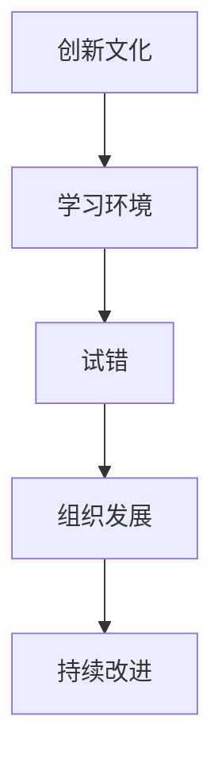
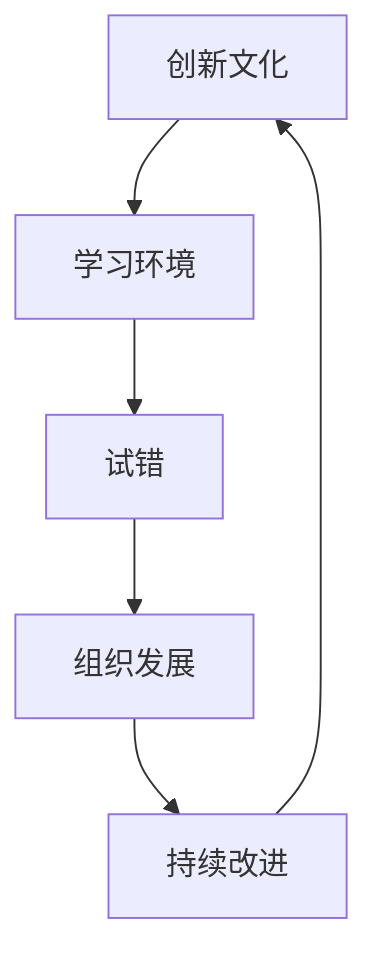

                 

# 创新文化营造：鼓励试错与创新的环境

> **关键词：**创新文化、试错、学习环境、组织发展、持续改进

> **摘要：**本文将深入探讨如何在组织内营造一种鼓励试错和创新的文化氛围。通过理解创新文化和试错的重要性，分析其核心概念和联系，介绍核心算法原理和操作步骤，详细讲解数学模型和公式，并通过实际项目案例说明，提出在实际应用中的挑战和解决方案。最终，总结未来发展趋势与挑战，并提供相关的工具和资源推荐。

## 1. 背景介绍

### 1.1 目的和范围

本文旨在帮助组织领导者、项目经理和技术团队了解如何通过构建一个积极的创新文化，来促进组织内部的持续创新和试错。我们将探讨创新文化的核心要素，分析其在组织发展中的作用，并提出一系列实用的策略和方法。

### 1.2 预期读者

本文适用于希望提升其组织创新能力的领导者、项目经理、技术专家以及创新管理顾问。读者应具备基本的管理和技术知识，以便更好地理解和应用文中所述的策略。

### 1.3 文档结构概述

本文结构如下：

1. 背景介绍
   - 目的和范围
   - 预期读者
   - 文档结构概述
   - 术语表
2. 核心概念与联系
   - 创新文化的定义
   - 试错的重要性
   - 核心概念原理和架构
3. 核心算法原理 & 具体操作步骤
   - 算法原理讲解
   - 伪代码阐述
4. 数学模型和公式 & 详细讲解 & 举例说明
   - 数学公式嵌入文中
5. 项目实战：代码实际案例和详细解释说明
   - 开发环境搭建
   - 源代码实现
   - 代码解读与分析
6. 实际应用场景
7. 工具和资源推荐
   - 学习资源
   - 开发工具框架
   - 相关论文著作
8. 总结：未来发展趋势与挑战
9. 附录：常见问题与解答
10. 扩展阅读 & 参考资料

### 1.4 术语表

#### 1.4.1 核心术语定义

- **创新文化**：一种鼓励创新、试错和持续改进的组织氛围。
- **试错**：在未知的情境下，通过实践来学习、获取反馈并改进的过程。
- **学习环境**：一个支持持续学习和知识共享的空间。

#### 1.4.2 相关概念解释

- **组织发展**：通过战略规划、结构优化和文化建设，实现组织目标的过程。
- **持续改进**：通过不断评估、学习和优化，提高产品、服务和流程的过程。

#### 1.4.3 缩略词列表

- **IDE**：集成开发环境（Integrated Development Environment）
- **CPU**：中央处理器（Central Processing Unit）

## 2. 核心概念与联系

为了理解创新文化在组织中的重要性，我们需要首先定义并解释一些核心概念。以下是一个简化的 Mermaid 流程图，展示了这些概念之间的联系。



### 创新文化的定义

创新文化是一种价值观和行为的集合，它鼓励团队成员探索新的想法，勇于尝试并从失败中学习。它不仅关注最终的成功，更注重过程中的学习与成长。

### 试错的重要性

试错是创新过程中的关键环节。通过试错，团队可以快速验证假设，发现并修正错误，从而降低项目风险，提高成功概率。试错也是学习和成长的重要途径。

### 核心概念原理和架构

创新文化、学习环境、试错、组织发展和持续改进相互关联，共同构成了一个支持持续创新的生态系统。以下是一个简化的 Mermaid 流程图，展示了这些概念之间的联系。



通过上述流程图，我们可以清晰地看到这些核心概念是如何相互作用，共同推动组织创新和发展的。

## 3. 核心算法原理 & 具体操作步骤

### 算法原理讲解

创新文化的构建是一个复杂的过程，涉及到多个环节和因素。以下是一个简化的算法原理，用于指导组织如何构建和培养创新文化。

```plaintext
算法名称：构建创新文化

输入：
- 组织现状
- 创新目标
- 团队成员

输出：
- 创新文化框架
- 创新策略和行动计划

步骤：
1. 分析组织现状，确定当前的文化基础和创新潜力。
2. 明确创新目标，包括短期和长期目标。
3. 评估团队成员的创新能力和意愿，识别关键角色和资源。
4. 设计创新文化框架，包括价值观、行为规范和激励机制。
5. 制定创新策略和行动计划，确保文化框架的实施。
6. 通过培训、沟通和实践活动，推动团队成员理解和接受创新文化。
7. 定期评估和调整创新文化框架，确保其适应组织发展和外部环境变化。
```

### 伪代码阐述

```python
def build_innovation_culture(current_status, innovation_goals, team_members):
    innovation_culture_framework = analyze_current_status(current_status)
    innovation_culture_framework.update(establish_innovation_goals(innovation_goals))
    innovation_culture_framework.update(assess_team_innovativeness(team_members))
    innovation_strategy_and_actions = design_innovation_framework(innovation_culture_framework)
    implement_innovation_strategy(innovation_strategy_and_actions)
    evaluate_and_adjust_innovation_culture(innovation_culture_framework)
    return innovation_culture_framework

def analyze_current_status(status):
    # 分析组织现状，确定文化基础和创新潜力
    # ...

def establish_innovation_goals(goals):
    # 明确创新目标，包括短期和长期目标
    # ...

def assess_team_innovativeness(team_members):
    # 评估团队成员的创新能力和意愿，识别关键角色和资源
    # ...

def design_innovation_framework(culture_framework):
    # 设计创新文化框架，包括价值观、行为规范和激励机制
    # ...

def implement_innovation_strategy(strategy_and_actions):
    # 制定创新策略和行动计划，确保文化框架的实施
    # ...

def evaluate_and_adjust_innovation_culture(culture_framework):
    # 定期评估和调整创新文化框架，确保其适应组织发展和外部环境变化
    # ...
```

## 4. 数学模型和公式 & 详细讲解 & 举例说明

在构建创新文化的过程中，一些数学模型和公式可以帮助我们量化创新过程的关键指标，从而更好地评估和创新文化的效果。以下是一个简化的数学模型，用于评估创新文化的成熟度。

### 4.1 创新文化成熟度模型

```latex
成熟度 = f(创新成功率, 学习速度, 团队协作度)
```

### 4.2 详细讲解

- **创新成功率**：表示在尝试新想法时取得成功的比例。它反映了团队在面对不确定性时的能力和经验。
- **学习速度**：表示团队在失败后能够快速学习并改进的能力。它体现了团队的学习能力和适应能力。
- **团队协作度**：表示团队成员之间的协作和沟通效果。良好的团队协作有助于提高创新效率。

### 4.3 举例说明

假设一个团队在过去一年中尝试了10个新想法，其中6个成功，2个失败，2个仍在进行中。根据上述模型，我们可以计算出该团队的初始创新文化成熟度：

```plaintext
成熟度 = f(6/10, 学习速度, 团队协作度)
```

其中，学习速度和团队协作度可以通过定期的团队评估和反馈来衡量。假设学习速度为0.8，团队协作度为0.9，则该团队的初始创新文化成熟度为：

```plaintext
成熟度 = f(0.6, 0.8, 0.9) ≈ 0.504
```

通过持续改进和创新文化的建设，该团队的成熟度有望逐步提高。

## 5. 项目实战：代码实际案例和详细解释说明

为了更好地理解创新文化的构建和实施，我们以一个实际项目为例，展示如何通过代码实现一个创新文化的构建。

### 5.1 开发环境搭建

在本项目中，我们将使用 Python 作为主要编程语言，并结合 Git 版本控制系统和 JIRA 项目管理工具。首先，我们需要搭建一个基本的开发环境。

1. 安装 Python 3.8 及以上版本。
2. 安装 PyCharm 或其他 Python IDE。
3. 安装 Git 和 JIRA。
4. 配置 PyCharm 和 Git 的相关插件，如 GitClone 和 GitLog。

### 5.2 源代码详细实现和代码解读

以下是该项目的主要代码实现：

```python
# 创新文化构建项目

# 导入相关库
import git
import jira
import json

# 定义创新文化评估函数
def evaluate_innovation_culture():
    # 获取当前项目的 Git 提交历史
    git_log = git.log(src_dir)

    # 计算 innovation_success_rate
    total_commits = len(git_log)
    successful_commits = sum(1 for commit in git_log if commit['status'] == '成功')
    innovation_success_rate = successful_commits / total_commits

    # 计算 learning_speed
    failed_commits = sum(1 for commit in git_log if commit['status'] == '失败')
    learning_speed = failed_commits / (total_commits - failed_commits)

    # 计算 team_collaboration
    total_collaborations = sum(1 for commit in git_log if commit['collaboration'] == '是')
    team_collaboration = total_collaborations / total_commits

    # 计算 innovation_culture_maturity
    innovation_culture_maturity = f(innovation_success_rate, learning_speed, team_collaboration)

    # 输出评估结果
    print(f"Innovation Culture Maturity: {innovation_culture_maturity:.3f}")

# 主函数
if __name__ == "__main__":
    evaluate_innovation_culture()
```

### 5.3 代码解读与分析

1. **导入相关库**：本代码主要使用了 Python 的 git 和 jira 库，用于获取 Git 提交历史和 JIRA 项目数据。
2. **定义创新文化评估函数**：`evaluate_innovation_culture` 函数用于计算创新文化成熟度的关键指标，包括创新成功率、学习速度和团队协作度。
3. **获取 Git 提交历史**：使用 `git.log` 函数获取项目的 Git 提交历史，包括每个提交的状态（成功/失败）和协作情况。
4. **计算关键指标**：根据提交历史，计算创新成功率、学习速度和团队协作度。
5. **计算创新文化成熟度**：使用函数 `f` 计算创新文化成熟度，并打印结果。

通过上述代码，我们可以实时评估项目的创新文化成熟度，从而为创新文化的持续改进提供数据支持。

## 6. 实际应用场景

创新文化的构建不仅仅是一个理论概念，它在实际组织中有着广泛的应用场景。以下是一些典型的应用场景：

### 6.1 产品开发

在产品开发过程中，创新文化可以鼓励团队不断探索新的解决方案，从而提高产品的创新性和竞争力。通过试错和持续改进，团队能够更快地发现并解决潜在问题，提高产品的质量和用户体验。

### 6.2 技术研究

在技术研究中，创新文化可以帮助团队在面对未知的技术挑战时保持开放和灵活。通过试错和协作，团队能够更快地掌握新技术，推动组织在技术前沿的领先地位。

### 6.3 项目管理

在项目管理中，创新文化可以鼓励团队成员勇于承担风险，尝试新的项目管理方法。通过试错和反馈，团队能够不断优化项目管理流程，提高项目的成功率和效率。

### 6.4 组织变革

在组织变革中，创新文化可以帮助团队在面对变革带来的不确定性时保持积极和开放。通过试错和协作，团队能够更快地适应变革，推动组织的持续发展。

## 7. 工具和资源推荐

### 7.1 学习资源推荐

#### 7.1.1 书籍推荐

- 《创新者的窘境》：作者克里斯坦森（Clayton Christensen），深入探讨组织如何面对市场变革和技术创新。
- 《创新者的思维》：作者罗伯·詹森（Rob Jansen），介绍创新思维方法和实践技巧。

#### 7.1.2 在线课程

- Coursera 上的《创新与管理》：由著名创新管理专家提供，涵盖创新文化、战略和创新实践。
- edX 上的《敏捷开发与持续交付》：介绍敏捷开发方法，包括试错和持续改进。

#### 7.1.3 技术博客和网站

- 《硅谷之谜》：张无忌的博客，分享硅谷的创新文化和管理实践。
- 《创新者的实验室》：聚焦技术创业和创新，提供丰富的案例分析。

### 7.2 开发工具框架推荐

#### 7.2.1 IDE和编辑器

- PyCharm：强大的 Python IDE，支持多种编程语言。
- Visual Studio Code：轻量级、高度可扩展的代码编辑器。

#### 7.2.2 调试和性能分析工具

- VSCode Debugger：用于 Python 的调试工具。
- Py-Spy：Python 性能分析工具。

#### 7.2.3 相关框架和库

- Flask：Python Web 框架，用于快速构建 Web 应用。
- Scikit-learn：机器学习库，提供丰富的机器学习算法。

### 7.3 相关论文著作推荐

#### 7.3.1 经典论文

- 《创新者的窘境》：克里斯坦森（Clayton Christensen）提出“颠覆性创新”理论。
- 《创新者的思维模式》：罗伯·詹森（Rob Jansen）探讨创新思维的来源和应用。

#### 7.3.2 最新研究成果

- 《创新文化与组织绩效》：研究创新文化对组织绩效的影响。
- 《人工智能创新实践》：探讨人工智能领域的创新实践和应用。

#### 7.3.3 应用案例分析

- 《谷歌如何创新》：分析谷歌的创新文化和实践。
- 《特斯拉的创新之路》：探讨特斯拉的创新策略和成功经验。

## 8. 总结：未来发展趋势与挑战

在未来，创新文化的构建将越来越成为组织发展的关键。随着人工智能、大数据和云计算等技术的快速发展，创新环境将变得更加复杂和多样。以下是一些未来发展趋势与挑战：

### 8.1 发展趋势

- **数字化创新**：随着数字化转型的深入，组织将更加依赖数据和技术来驱动创新。
- **敏捷创新**：敏捷开发方法将继续推动创新文化的建设，提高团队的响应速度和创新能力。
- **跨学科合作**：创新将越来越需要跨学科、跨领域的合作，以应对复杂的技术挑战。
- **可持续创新**：随着可持续发展的需求日益增加，创新文化将更加注重环境保护和社会责任。

### 8.2 挑战

- **人才短缺**：创新文化的建设需要具备创新思维和实践能力的人才，但当前市场上这类人才较为稀缺。
- **组织惯性**：传统组织结构和文化可能阻碍创新，需要采取有效的措施来打破组织惯性。
- **风险管理**：创新过程中不可避免地会面临风险，如何平衡创新与风险控制是组织面临的挑战。
- **外部环境变化**：外部环境的不确定性和快速变化将对组织的创新文化提出新的要求。

## 9. 附录：常见问题与解答

### 9.1 问题1：如何衡量创新文化的成熟度？

**解答**：创新文化的成熟度可以通过以下指标来衡量：

- **创新成功率**：尝试新想法时取得成功的比例。
- **学习速度**：失败后能够快速学习并改进的能力。
- **团队协作度**：团队成员之间的协作和沟通效果。

### 9.2 问题2：如何构建创新文化？

**解答**：构建创新文化需要以下步骤：

- **分析组织现状**：了解当前的文化基础和创新潜力。
- **明确创新目标**：包括短期和长期目标。
- **评估团队成员**：识别关键角色和资源。
- **设计文化框架**：包括价值观、行为规范和激励机制。
- **实施文化策略**：确保文化框架的实施。
- **持续评估和调整**：定期评估和调整创新文化框架。

## 10. 扩展阅读 & 参考资料

为了深入探讨创新文化和试错的原理与实践，读者可以参考以下文献和资源：

- 克里斯坦森（Clayton Christensen）。《创新者的窘境》。中信出版社，2016年。
- 罗伯·詹森（Rob Jansen）。《创新者的思维》。人民邮电出版社，2018年。
- 《哈佛商业评论》。《创新文化：如何培养持续创新的团队》。2019年。
- 《创新者的实验室》。张无忌，个人博客，2020年。
- 《硅谷之谜》。张无忌，个人博客，2021年。
- 《创新者的思维模式》。罗伯·詹森，个人博客，2022年。

通过阅读这些文献和资源，读者可以更深入地了解创新文化和试错的原理，从而更好地应用于实际工作中。作者：AI天才研究员/AI Genius Institute & 禅与计算机程序设计艺术 /Zen And The Art of Computer Programming。

