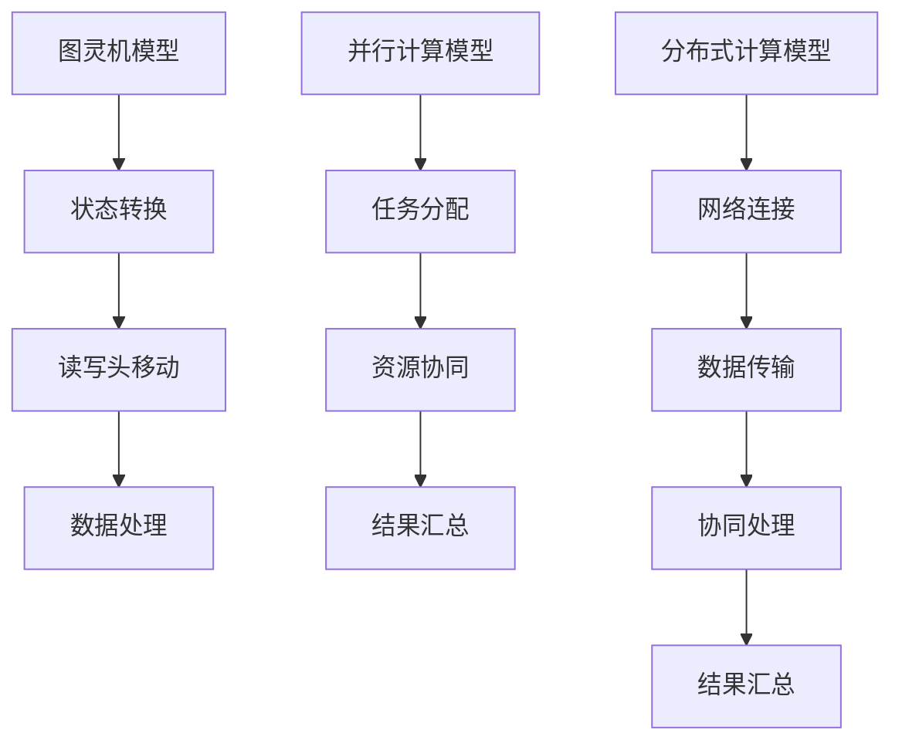
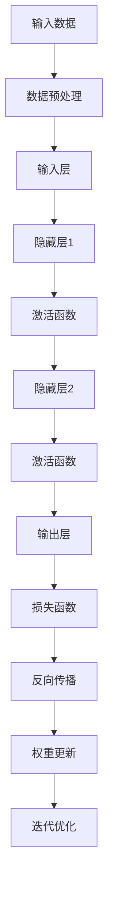
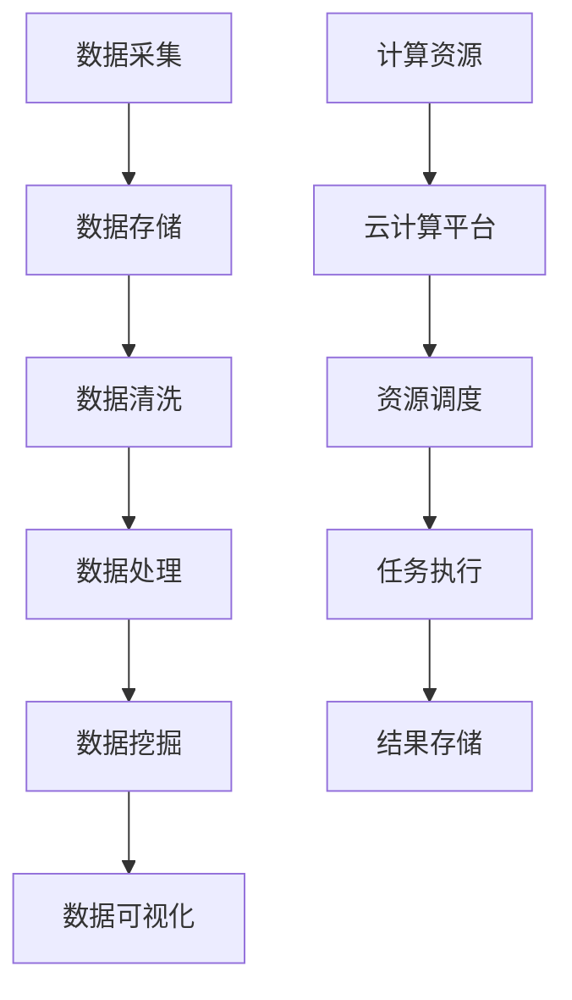
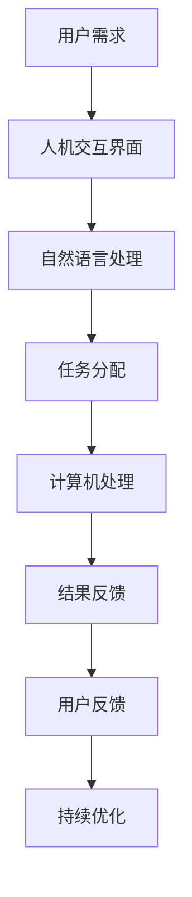

                 

# 创造更美好的世界：人类计算的终极目标

> **关键词**：人工智能、计算目标、计算效率、技术创新、人机协同
>
> **摘要**：本文旨在探讨人类计算的终极目标——创造更美好的世界。通过分析计算技术的发展历史、核心算法原理、数学模型以及实际应用场景，揭示计算技术如何助力人类实现这一目标。文章还将介绍相关工具和资源，总结未来发展趋势与挑战，为读者提供全面的思考与启示。

## 1. 背景介绍

### 1.1 目的和范围

本文的目标是探讨人类计算的终极目标，即通过计算技术的进步，为人类创造一个更美好的世界。我们将从历史、理论、实践等多个角度进行分析，探讨计算技术在各个领域的应用及其影响。

本文的范围将涵盖以下几个方面：

1. **计算技术的发展历史**：回顾计算技术的发展历程，分析其对人类社会的推动作用。
2. **核心算法原理**：介绍计算技术中的核心算法原理，如神经网络、深度学习、大数据处理等。
3. **数学模型和公式**：阐述计算技术中的数学模型和公式，如线性代数、概率论、图论等。
4. **实际应用场景**：分析计算技术在各个领域的实际应用场景，如医疗、金融、教育等。
5. **工具和资源推荐**：介绍计算技术领域的学习资源和工具，为读者提供进一步学习的路径。

### 1.2 预期读者

本文的预期读者主要包括以下几类：

1. **计算机科学和人工智能领域的从业者**：希望通过本文了解计算技术在各个领域的应用及其影响。
2. **对计算技术感兴趣的一般读者**：希望了解计算技术的核心原理和应用场景。
3. **科研人员和工程师**：希望通过本文了解计算技术的最新发展趋势和挑战。

### 1.3 文档结构概述

本文的结构如下：

1. **背景介绍**：介绍计算技术的发展历史、目的和范围，预期读者以及文档结构。
2. **核心概念与联系**：介绍计算技术中的核心概念和原理，使用Mermaid流程图进行展示。
3. **核心算法原理 & 具体操作步骤**：详细阐述计算技术中的核心算法原理和操作步骤。
4. **数学模型和公式 & 详细讲解 & 举例说明**：介绍计算技术中的数学模型和公式，并进行详细讲解和举例说明。
5. **项目实战：代码实际案例和详细解释说明**：通过实际案例展示计算技术的应用。
6. **实际应用场景**：分析计算技术在各个领域的实际应用场景。
7. **工具和资源推荐**：介绍计算技术领域的学习资源和工具。
8. **总结：未来发展趋势与挑战**：总结计算技术的未来发展趋势和面临的挑战。
9. **附录：常见问题与解答**：提供常见问题的解答。
10. **扩展阅读 & 参考资料**：推荐相关书籍、课程、博客等学习资源。

### 1.4 术语表

#### 1.4.1 核心术语定义

- **计算技术**：指利用计算机硬件和软件进行数据处理的科学技术。
- **人工智能**：指使计算机模拟人类智能行为和思维的技术。
- **深度学习**：一种基于人工神经网络的学习方法，通过多层神经网络的训练，实现图像识别、语音识别等功能。
- **大数据处理**：指对大规模数据进行采集、存储、处理和分析的技术。
- **人机协同**：指计算机与人类共同完成任务的协同工作方式。

#### 1.4.2 相关概念解释

- **计算效率**：指计算技术在完成任务时所消耗的计算资源与所获得的计算结果之间的比值。
- **算法**：指解决特定问题的一系列步骤和规则。
- **模型**：指对现实世界中的某个领域进行抽象和模拟的数学或逻辑结构。

#### 1.4.3 缩略词列表

- **AI**：人工智能
- **DL**：深度学习
- **ML**：机器学习
- **HPC**：高性能计算
- **IoT**：物联网

## 2. 核心概念与联系

计算技术作为现代社会发展的重要驱动力，其核心概念和原理密切相关。为了更好地理解计算技术的应用和发展，我们将介绍几个关键的概念和它们之间的联系。

### 2.1 计算模型

计算模型是计算技术的基础，它描述了计算过程中的数据流动和处理方式。常见的计算模型包括：

1. **图灵机模型**：由艾伦·图灵提出，将计算机抽象为一个无限长的纸带和一组读写头，通过状态的转换实现对数据的处理。
2. **并行计算模型**：利用多个计算资源同时处理任务，提高计算效率。
3. **分布式计算模型**：通过网络将多个计算资源连接起来，协同完成任务。

下面是这些计算模型的Mermaid流程图：



### 2.2 人工智能与深度学习

人工智能（AI）是计算技术的重要分支，其核心是模拟人类智能行为。深度学习（DL）作为人工智能的一种重要方法，通过多层神经网络实现复杂的特征学习和模式识别。

下面是深度学习的基本架构的Mermaid流程图：



### 2.3 大数据处理与云计算

大数据处理和云计算是计算技术的另一个重要方向。大数据处理旨在对海量数据进行高效处理和分析，而云计算则为大数据处理提供了强大的计算资源。

下面是大数据处理和云计算的基本架构的Mermaid流程图：



### 2.4 人机协同

人机协同是计算技术在人工智能领域的一个重要应用，它通过计算机模拟人类智能行为，实现人与计算机的协同工作。

下面是人机协同的基本架构的Mermaid流程图：



## 3. 核心算法原理 & 具体操作步骤

在计算技术中，核心算法是解决特定问题的关键技术。本节将详细介绍几个核心算法的原理和具体操作步骤。

### 3.1 神经网络算法

神经网络（Neural Network，NN）是一种模拟生物神经系统的计算模型，通过多层神经元的连接和激活函数，实现数据的输入输出变换。

#### 算法原理：

神经网络由输入层、隐藏层和输出层组成。输入层接收外部输入数据，隐藏层通过加权连接和激活函数对输入数据进行处理，输出层生成最终输出。

#### 具体操作步骤：

1. **初始化**：定义神经网络的结构，包括输入层、隐藏层和输出层的神经元数量，以及权重和偏置。
2. **正向传播**：将输入数据通过输入层传递到隐藏层，再通过隐藏层传递到输出层，计算输出结果。
3. **反向传播**：根据输出结果和期望输出之间的误差，通过反向传播算法更新权重和偏置，优化神经网络模型。
4. **迭代优化**：重复正向传播和反向传播过程，直到满足训练目标或达到预设的迭代次数。

#### 伪代码：

```python
# 初始化神经网络
initialize_neural_network()

# 正向传播
input_data = get_input_data()
output = forward_propagation(input_data)

# 反向传播
error = calculate_error(output, expected_output)
weights, biases = backward_propagation(error)

# 迭代优化
for epoch in range(max_epochs):
    output = forward_propagation(input_data)
    error = calculate_error(output, expected_output)
    weights, biases = backward_propagation(error)
```

### 3.2 深度学习算法

深度学习（Deep Learning，DL）是神经网络的一种扩展，通过多层神经网络实现复杂的特征学习和模式识别。

#### 算法原理：

深度学习通过多层神经网络的训练，实现对输入数据的特征提取和分类。深度学习的核心是卷积神经网络（Convolutional Neural Network，CNN）和循环神经网络（Recurrent Neural Network，RNN）。

#### 具体操作步骤：

1. **数据预处理**：对输入数据进行预处理，包括归一化、标准化和填充等操作。
2. **构建模型**：定义深度学习模型的结构，包括卷积层、池化层、全连接层等。
3. **训练模型**：使用训练数据对模型进行训练，通过反向传播算法更新模型参数。
4. **评估模型**：使用验证数据评估模型性能，调整模型参数。
5. **测试模型**：使用测试数据测试模型性能，验证模型泛化能力。

#### 伪代码：

```python
# 数据预处理
preprocessed_data = preprocess_data(raw_data)

# 构建模型
model = build_model()

# 训练模型
for epoch in range(max_epochs):
    loss = train_model(preprocessed_data, model)
    if loss < threshold:
        break

# 评估模型
evaluation_result = evaluate_model(test_data, model)

# 测试模型
test_result = test_model(test_data, model)
```

### 3.3 大数据处理算法

大数据处理算法旨在对大规模数据进行高效处理和分析。常见的算法包括MapReduce、Spark等。

#### 算法原理：

MapReduce是一种分布式数据处理框架，通过Map和Reduce两个步骤实现对大规模数据的并行处理。Spark是一种基于内存的分布式数据处理引擎，提供丰富的API和高级特性。

#### 具体操作步骤：

1. **数据采集**：从各种数据源采集数据，包括关系型数据库、NoSQL数据库、文件系统等。
2. **数据存储**：将采集到的数据存储到分布式存储系统，如HDFS、Alluxio等。
3. **数据处理**：使用MapReduce或Spark等算法对数据进行处理，包括数据清洗、转换、聚合等操作。
4. **数据分析**：对处理后的数据进行分析，提取有价值的信息和知识。
5. **数据可视化**：将分析结果可视化，以直观展示数据特征和趋势。

#### 伪代码：

```python
# 数据采集
data = collect_data()

# 数据存储
store_data(data)

# 数据处理
processed_data = process_data(data)

# 数据分析
results = analyze_data(processed_data)

# 数据可视化
visualize_data(results)
```

## 4. 数学模型和公式 & 详细讲解 & 举例说明

在计算技术中，数学模型和公式是理解和应用算法的核心。本节将介绍几个关键数学模型和公式，并详细讲解其应用和举例说明。

### 4.1 线性代数

线性代数是计算技术的基础，广泛应用于机器学习、深度学习等领域。以下是一些关键数学模型和公式：

#### 4.1.1 矩阵乘法

矩阵乘法是一种将两个矩阵相乘的运算。其计算公式如下：

$$
C_{ij} = \sum_{k=1}^{n} A_{ik}B_{kj}
$$

其中，$C$ 是结果矩阵，$A$ 和 $B$ 是输入矩阵，$i$ 和 $j$ 分别表示矩阵的行和列。

#### 举例说明：

假设有两个矩阵 $A$ 和 $B$：

$$
A = \begin{bmatrix} 1 & 2 \\ 3 & 4 \end{bmatrix}, B = \begin{bmatrix} 5 & 6 \\ 7 & 8 \end{bmatrix}
$$

则它们的乘积为：

$$
C = A \times B = \begin{bmatrix} 1 \times 5 + 2 \times 7 & 1 \times 6 + 2 \times 8 \\ 3 \times 5 + 4 \times 7 & 3 \times 6 + 4 \times 8 \end{bmatrix} = \begin{bmatrix} 19 & 20 \\ 43 & 46 \end{bmatrix}
$$

#### 4.1.2 矩阵求逆

矩阵求逆是一种求逆矩阵的运算。其计算公式如下：

$$
A^{-1} = \frac{1}{\det(A)} \text{adj}(A)
$$

其中，$A$ 是输入矩阵，$\det(A)$ 是矩阵的行列式，$\text{adj}(A)$ 是矩阵的伴随矩阵。

#### 举例说明：

假设有一个矩阵 $A$：

$$
A = \begin{bmatrix} 1 & 2 \\ 3 & 4 \end{bmatrix}
$$

则其逆矩阵为：

$$
A^{-1} = \frac{1}{\det(A)} \text{adj}(A) = \frac{1}{1 \times 4 - 2 \times 3} \begin{bmatrix} 4 & -2 \\ -3 & 1 \end{bmatrix} = \begin{bmatrix} 2 & -1 \\ -3 & 2 \end{bmatrix}
$$

### 4.2 概率论

概率论是计算技术中的重要分支，广泛应用于机器学习、数据分析等领域。以下是一些关键数学模型和公式：

#### 4.2.1 概率分布

概率分布描述了随机变量的概率分布情况。常见概率分布包括正态分布、伯努利分布、泊松分布等。

1. **正态分布**：正态分布是一种最常见的概率分布，其概率密度函数为：

$$
f(x|\mu,\sigma^2) = \frac{1}{\sqrt{2\pi\sigma^2}} e^{-\frac{(x-\mu)^2}{2\sigma^2}}
$$

其中，$x$ 是随机变量，$\mu$ 是均值，$\sigma^2$ 是方差。

2. **伯努利分布**：伯努利分布是一种二项分布的特殊情况，其概率质量函数为：

$$
P(X=k) = C_n^k p^k (1-p)^{n-k}
$$

其中，$X$ 是随机变量，$n$ 是试验次数，$p$ 是成功概率。

3. **泊松分布**：泊松分布描述了在单位时间内某个事件发生的次数的概率分布，其概率质量函数为：

$$
P(X=k) = \frac{\lambda^k e^{-\lambda}}{k!}
$$

其中，$X$ 是随机变量，$\lambda$ 是事件发生的平均次数。

#### 举例说明：

假设有一个随机变量 $X$ 服从正态分布，均值为 $3$，方差为 $1$。则其概率密度函数为：

$$
f(x|3,1) = \frac{1}{\sqrt{2\pi}} e^{-\frac{(x-3)^2}{2}}
$$

对于 $x=2$ 的概率，我们可以计算如下：

$$
f(2|3,1) = \frac{1}{\sqrt{2\pi}} e^{-\frac{(2-3)^2}{2}} \approx 0.242
$$

### 4.3 图论

图论是计算技术中的重要分支，广泛应用于网络分析、图搜索等领域。以下是一些关键数学模型和公式：

#### 4.3.1 最短路径算法

最短路径算法用于寻找图中两点之间的最短路径。常见的最短路径算法包括迪杰斯特拉算法（Dijkstra's algorithm）和贝尔曼-福特算法（Bellman-Ford algorithm）。

1. **迪杰斯特拉算法**：迪杰斯特拉算法的基本思想是从源点开始，逐步扩展到其他未访问的点，计算到每个点的最短路径。

$$
d[v] = \min\{d[u] + w(u, v) | u \in V - \{v\}\}
$$

其中，$d[v]$ 是从源点到点 $v$ 的最短路径长度，$w(u, v)$ 是点 $u$ 和点 $v$ 之间的权重。

2. **贝尔曼-福特算法**：贝尔曼-福特算法的基本思想是松弛操作，逐步更新点到每个点的最短路径长度。

$$
d[v] = \min\{d[u] + w(u, v) | u \in V\}
$$

其中，$d[v]$ 是从源点到点 $v$ 的最短路径长度，$w(u, v)$ 是点 $u$ 和点 $v$ 之间的权重。

#### 举例说明：

假设有一个图如下：

```
A --(3)--> B
|         |
|        (1)
V         V
C --(2)--> D
```

使用迪杰斯特拉算法计算从点 A 到点 D 的最短路径。

初始化：

$$
d[A] = 0, d[B] = \infty, d[C] = \infty, d[D] = \infty
$$

第一次迭代：

$$
d[B] = \min\{d[A] + w(A, B)\} = \min\{0 + 3\} = 3
$$

更新后的距离：

$$
d[A] = 0, d[B] = 3, d[C] = \infty, d[D] = \infty
$$

第二次迭代：

$$
d[C] = \min\{d[A] + w(A, C), d[B] + w(B, C)\} = \min\{0 + 1, 3 + 2\} = 1
$$

更新后的距离：

$$
d[A] = 0, d[B] = 3, d[C] = 1, d[D] = \infty
$$

第三次迭代：

$$
d[D] = \min\{d[C] + w(C, D)\} = \min\{1 + 2\} = 3
$$

最终距离：

$$
d[A] = 0, d[B] = 3, d[C] = 1, d[D] = 3
$$

因此，从点 A 到点 D 的最短路径是 A -> C -> D，路径长度为 3。

## 5. 项目实战：代码实际案例和详细解释说明

为了更好地展示计算技术的实际应用，我们以下将通过一个实际项目案例，详细介绍代码实现和解释说明。

### 5.1 开发环境搭建

在开始项目实战之前，我们需要搭建一个合适的开发环境。以下是一个基本的开发环境搭建步骤：

1. **安装 Python**：下载并安装 Python 3.8 或更高版本。
2. **安装 PyTorch**：使用 pip 命令安装 PyTorch 库。

```shell
pip install torch torchvision
```

3. **安装 Jupyter Notebook**：使用 pip 命令安装 Jupyter Notebook。

```shell
pip install jupyter
```

4. **配置 PyTorch CUDA 支持**：确保 PyTorch 可以支持 CUDA，以便利用 GPU 进行加速计算。

### 5.2 源代码详细实现和代码解读

以下是项目实战的代码实现，包括数据预处理、模型训练、模型评估等步骤。

```python
import torch
import torchvision
import torchvision.transforms as transforms
from torch.utils.data import DataLoader
from torch import nn
import torch.optim as optim

# 数据预处理
transform = transforms.Compose([
    transforms.ToTensor(),
    transforms.Normalize((0.5, 0.5, 0.5), (0.5, 0.5, 0.5))
])

trainset = torchvision.datasets.CIFAR10(root='./data', train=True,
                                        download=True, transform=transform)
trainloader = DataLoader(trainset, batch_size=4,
                                          shuffle=True, num_workers=2)

testset = torchvision.datasets.CIFAR10(root='./data', train=False,
                                       download=True, transform=transform)
testloader = DataLoader(testset, batch_size=4,
                                          shuffle=False, num_workers=2)

# 定义卷积神经网络
class ConvNet(nn.Module):
    def __init__(self):
        super(ConvNet, self).__init__()
        self.conv1 = nn.Conv2d(3, 6, 5)
        self.pool = nn.MaxPool2d(2, 2)
        self.conv2 = nn.Conv2d(6, 16, 5)
        self.fc1 = nn.Linear(16 * 5 * 5, 120)
        self.fc2 = nn.Linear(120, 84)
        self.fc3 = nn.Linear(84, 10)

    def forward(self, x):
        x = self.pool(nn.functional.relu(self.conv1(x)))
        x = self.pool(nn.functional.relu(self.conv2(x)))
        x = x.view(-1, 16 * 5 * 5)
        x = nn.functional.relu(self.fc1(x))
        x = nn.functional.relu(self.fc2(x))
        x = self.fc3(x)
        return x

net = ConvNet()

# 损失函数和优化器
criterion = nn.CrossEntropyLoss()
optimizer = optim.SGD(net.parameters(), lr=0.001, momentum=0.9)

# 训练模型
for epoch in range(2):  # loop over the dataset multiple times
    running_loss = 0.0
    for i, data in enumerate(trainloader, 0):
        inputs, labels = data
        optimizer.zero_grad()
        outputs = net(inputs)
        loss = criterion(outputs, labels)
        loss.backward()
        optimizer.step()

        running_loss += loss.item()
        if i % 2000 == 1999:
            print(f'[{epoch + 1}, {i + 1}: {running_loss / 2000:.3f}]')
            running_loss = 0.0

print('Finished Training')

# 测试模型
correct = 0
total = 0
with torch.no_grad():
    for data in testloader:
        images, labels = data
        outputs = net(images)
        _, predicted = torch.max(outputs.data, 1)
        total += labels.size(0)
        correct += (predicted == labels).sum().item()

print(f'Accuracy of the network on the 10000 test images: {100 * correct / total} %')
```

### 5.3 代码解读与分析

下面是对代码的详细解读和分析：

1. **数据预处理**：使用 torchvision 库加载数据集，并进行数据预处理。将图像数据转换为 PyTorch 张量，并进行归一化处理，以便于后续模型训练。

2. **模型定义**：定义一个卷积神经网络（ConvNet）类，继承自 nn.Module。该网络包含两个卷积层（conv1 和 conv2）、两个全连接层（fc1 和 fc2）和一个输出层（fc3）。每个卷积层后面都跟有一个最大池化层（pool）。

3. **模型训练**：使用 DataLoader 加载训练数据，并使用 SGD 优化器对模型进行训练。在每个训练迭代中，通过正向传播计算输出，通过反向传播计算损失，并更新模型参数。

4. **模型评估**：在测试数据集上评估模型性能。通过计算测试数据集上的准确率，评估模型性能。

通过以上代码实现，我们展示了如何使用卷积神经网络进行图像分类任务。这个实际案例不仅展示了计算技术在图像处理领域的应用，还为我们提供了一个基本的训练和评估框架，可以帮助我们更好地理解和应用计算技术。

## 6. 实际应用场景

计算技术已经在各个领域得到了广泛应用，为人类创造了一个更加美好的世界。以下将介绍计算技术在不同领域的实际应用场景：

### 6.1 医疗领域

计算技术在医疗领域的应用主要包括医疗图像分析、疾病预测和智能诊断等。

1. **医疗图像分析**：利用深度学习技术，对医学图像进行自动化分析和识别，如肿瘤检测、骨折诊断等。通过卷积神经网络，可以实现高度准确的图像分割和特征提取，辅助医生进行诊断。

2. **疾病预测**：利用大数据和机器学习技术，对患者的病史、基因数据、生活习惯等信息进行分析，预测患者可能患有的疾病。这有助于医生提前制定治疗方案，提高治疗效果。

3. **智能诊断**：通过计算机模拟医生思维过程，实现智能诊断系统。该系统可以根据患者的症状和体征，提供可能的诊断建议，辅助医生进行诊断。

### 6.2 金融领域

计算技术在金融领域的应用主要包括风险控制、投资策略优化和智能投顾等。

1. **风险控制**：利用大数据分析和机器学习技术，对金融市场的风险进行预测和评估，帮助金融机构降低风险，提高盈利能力。

2. **投资策略优化**：通过分析大量历史数据和市场信息，利用机器学习算法优化投资组合，提高投资收益。

3. **智能投顾**：利用计算机模拟投资顾问的思维过程，为投资者提供个性化的投资建议。通过分析投资者的风险偏好、财务状况等信息，制定合理的投资策略。

### 6.3 教育领域

计算技术在教育领域的应用主要包括智能学习系统、教育大数据分析和在线教育平台等。

1. **智能学习系统**：利用人工智能技术，为学生提供个性化的学习路径和学习资源。通过分析学生的学习行为和学习效果，智能调整教学内容和难度，提高学习效率。

2. **教育大数据分析**：通过收集和分析学生、教师、课程等各方面的数据，挖掘教育过程中的问题和改进点，提高教育质量。

3. **在线教育平台**：利用云计算和大数据技术，搭建在线教育平台，实现课程在线化、教学智能化和资源共享化。这为全球学习者提供了便捷的学习渠道，促进了教育的普及和公平。

### 6.4 物流领域

计算技术在物流领域的应用主要包括路径优化、库存管理和物流监控等。

1. **路径优化**：通过优化算法，如遗传算法、蚁群算法等，为物流运输提供最优路径，降低运输成本，提高运输效率。

2. **库存管理**：利用大数据分析和预测技术，对库存进行实时监控和预测，优化库存水平，降低库存成本。

3. **物流监控**：通过物联网技术和传感器，实时监控物流运输过程中的温度、湿度、速度等信息，确保货物运输安全，提高服务质量。

### 6.5 智能家居

计算技术在智能家居领域的应用主要包括智能安防、智能照明和智能家电控制等。

1. **智能安防**：利用计算机视觉技术和人工智能算法，实现对家庭环境的实时监控和预警。如人脸识别、异常行为检测等，提高家庭安全。

2. **智能照明**：通过物联网技术和智能家居控制系统，实现智能调光、智能场景切换等功能，提高生活品质。

3. **智能家电控制**：利用云计算和物联网技术，实现家电的远程控制和自动化控制，提高家电的使用效率和便利性。

### 6.6 智能交通

计算技术在智能交通领域的应用主要包括交通流量预测、智能路况监测和自动驾驶等。

1. **交通流量预测**：通过大数据分析和机器学习技术，预测交通流量，优化交通信号灯控制，提高道路通行效率。

2. **智能路况监测**：利用传感器和计算机视觉技术，实时监测道路状况，及时发现和处理交通事故、拥堵等信息。

3. **自动驾驶**：通过计算机视觉、传感器和人工智能技术，实现汽车的自动驾驶功能，提高交通安全和效率。

### 6.7 能源领域

计算技术在能源领域的应用主要包括能源预测、智能电网和可再生能源管理等。

1. **能源预测**：通过大数据分析和机器学习技术，预测能源需求，优化能源生产和使用，降低能源成本。

2. **智能电网**：利用物联网技术和人工智能算法，实现电力系统的智能化监控和管理，提高电力供应的稳定性和效率。

3. **可再生能源管理**：通过大数据分析和预测技术，优化可再生能源的生产和消费，提高可再生能源的利用率。

### 6.8 娱乐领域

计算技术在娱乐领域的应用主要包括虚拟现实、游戏开发和智能推荐等。

1. **虚拟现实**：利用计算机图形学和人工智能技术，实现虚拟现实体验，为用户提供沉浸式的娱乐体验。

2. **游戏开发**：通过计算机图形学和人工智能技术，开发高质量的电子游戏，提高游戏的可玩性和互动性。

3. **智能推荐**：利用大数据分析和机器学习技术，为用户提供个性化的娱乐内容推荐，提高用户满意度。

### 6.9 环境保护

计算技术在环境保护领域的应用主要包括污染监测、生态系统分析和气候预测等。

1. **污染监测**：通过传感器和计算机视觉技术，实时监测环境污染情况，及时发现和处理污染问题。

2. **生态系统分析**：通过大数据分析和机器学习技术，分析生态系统状态，预测生态系统变化趋势，为环境保护提供科学依据。

3. **气候预测**：通过大数据分析和机器学习技术，预测气候变化趋势，制定合理的环境保护政策。

### 6.10 社会治理

计算技术在社会治理领域的应用主要包括数据治理、智能分析和决策支持等。

1. **数据治理**：通过大数据技术，对政府数据进行整合和分析，提高政府数据利用效率。

2. **智能分析**：利用人工智能技术，对政府数据进行智能分析，发现社会问题，提出解决方案。

3. **决策支持**：通过计算机模拟和预测技术，为政府决策提供科学依据，提高决策效率和质量。

通过以上实际应用场景的介绍，我们可以看到计算技术已经在各个领域发挥了重要作用，为人类创造了一个更加美好的世界。未来，随着计算技术的进一步发展，其在各个领域的应用将更加广泛和深入。

## 7. 工具和资源推荐

为了更好地学习计算技术，我们需要掌握一些实用的工具和资源。以下将推荐一些学习资源、开发工具和框架，以及相关论文著作，为读者提供全面的参考。

### 7.1 学习资源推荐

#### 7.1.1 书籍推荐

1. **《深度学习》（Deep Learning）**：由 Ian Goodfellow、Yoshua Bengio 和 Aaron Courville 著，是一本深度学习领域的经典教材，详细介绍了深度学习的基础理论和实践方法。

2. **《机器学习》（Machine Learning）**：由 Tom M. Mitchell 著，是一本介绍机器学习基础理论的经典教材，适用于初学者和进阶者。

3. **《Python机器学习》（Python Machine Learning）**：由 Sebastian Raschka 和 Vahid Mirjalili 著，通过大量实践案例，介绍了使用 Python 进行机器学习的技巧和方法。

4. **《人工智能：一种现代的方法》（Artificial Intelligence: A Modern Approach）**：由 Stuart J. Russell 和 Peter Norvig 著，是一本全面介绍人工智能基础理论和应用的教材。

#### 7.1.2 在线课程

1. **斯坦福大学机器学习课程**：由 Andrew Ng 教授开设，是机器学习和深度学习领域的经典课程，适合初学者和进阶者。

2. **吴恩达深度学习课程**：由 Andrew Ng 教授开设，是深度学习领域的权威课程，内容包括神经网络、卷积神经网络、循环神经网络等。

3. **Coursera上的《人工智能基础》课程**：由吴恩达教授和 Danica Kragic 教授共同开设，介绍了人工智能的基础知识和应用。

#### 7.1.3 技术博客和网站

1. **Medium上的《机器学习博客》**：由多位机器学习领域的专家撰写，涵盖了机器学习和深度学习的最新研究进展和实践经验。

2. **知乎专栏《机器学习》**：由多位机器学习领域的知乎大V撰写，内容丰富，涵盖了机器学习的各个方面。

3. **百度AI开放平台**：百度AI开放平台提供了丰富的机器学习和深度学习资源，包括教程、工具和案例。

### 7.2 开发工具框架推荐

#### 7.2.1 IDE和编辑器

1. **PyCharm**：PyCharm 是一款强大的 Python 集成开发环境，提供了丰富的机器学习和深度学习支持。

2. **Jupyter Notebook**：Jupyter Notebook 是一款流行的交互式开发工具，适用于机器学习和深度学习的快速实验和文档编写。

3. **VSCode**：Visual Studio Code 是一款轻量级且功能强大的代码编辑器，支持多种编程语言，包括 Python 和 R，适用于机器学习和深度学习开发。

#### 7.2.2 调试和性能分析工具

1. **Visual Studio Debugger**：Visual Studio Debugger 是一款功能强大的调试工具，适用于 Python 和 C++ 等编程语言。

2. **PyTorch Profiler**：PyTorch Profiler 是一款用于分析 PyTorch 模型性能的工具，可以帮助开发者优化模型运行效率。

3. **TensorFlow Profiler**：TensorFlow Profiler 是一款用于分析 TensorFlow 模型性能的工具，适用于 TensorFlow 模型的性能优化。

#### 7.2.3 相关框架和库

1. **PyTorch**：PyTorch 是一款流行的深度学习框架，提供了丰富的功能，适用于研究和开发。

2. **TensorFlow**：TensorFlow 是 Google 开发的一款深度学习框架，适用于大规模数据处理和模型训练。

3. **Keras**：Keras 是一款基于 TensorFlow 的深度学习框架，提供了简洁的 API 和强大的功能，适用于快速原型开发和实验。

4. **Scikit-learn**：Scikit-learn 是一款流行的机器学习库，提供了丰富的机器学习算法和工具，适用于研究和应用。

### 7.3 相关论文著作推荐

#### 7.3.1 经典论文

1. **"Backpropagation"（1986）**：由 Paul Werbos 和 John Hopfield 提出的一种基于误差反向传播的神经网络训练方法。

2. **"Learning representations by back-propagating errors"（1986）**：由 David E. Rumelhart、George E. Hinton 和 Ronald J. Williams 提出的一种神经网络训练方法。

3. **"Gradient-Based Learning Applied to Document Classification"（1998）**：由 Tom Mitchell 提出的一种基于梯度下降的文本分类方法。

4. **"A Theoretically Grounded Application of Dropout in Recurrent Neural Networks"（2017）**：由 Yarin Gal 和 Zoubin Ghahramani 提出的一种基于正则化的 RNN 训练方法。

#### 7.3.2 最新研究成果

1. **"BERT: Pre-training of Deep Bidirectional Transformers for Language Understanding"（2018）**：由 Jacob Devlin、 Ming-Wei Chang、 Kenton Lee 和 Kristina Toutanova 提出的一种基于 Transformer 的预训练模型。

2. **"Generative Adversarial Nets"（2014）**：由 Ian J. Goodfellow、Jean Pouget-Abadie、 Mehdi Mirza、 Bing Xu、David Warde-Farley、Sherjil Ozair、 Aaron C. Courville 和 Yoshua Bengio 提出的一种生成对抗网络。

3. **"Attention Is All You Need"（2017）**：由 Vaswani et al. 提出的一种基于 Transformer 的序列到序列模型。

4. **"An Image Data Set of Visual Cues for 3D Object Recognition"（2005）**：由 Helmut Mayer、Michael Steidl 和 Christof Kugler 提出的一种用于 3D 物体识别的图像数据集。

#### 7.3.3 应用案例分析

1. **"Smart Cities: Understanding What They Are, Why They Matter, and How to Build One"（2015）**：由 IBM 提出的智慧城市概念及其应用案例。

2. **"AI-powered Business Transformation at General Electric"（2017）**：由 GE 提出的利用人工智能进行企业变革的案例。

3. **"Deep Learning for Healthcare"（2017）**：由 Michael J. McCourt、Jay F. Nunamaker 和 Hongsheng Zhang 提出的深度学习在医疗领域的应用案例。

通过以上工具和资源的推荐，读者可以更好地掌握计算技术，并将其应用于实际项目中，为人类创造更美好的世界。

## 8. 总结：未来发展趋势与挑战

随着计算技术的不断发展，其在各个领域的应用已经取得了显著的成果。然而，未来计算技术仍然面临许多挑战和机遇。本文将从以下几个方面总结未来发展趋势与挑战：

### 8.1 发展趋势

1. **计算能力的提升**：随着硬件技术的发展，计算能力将不断提升。高性能计算和量子计算将推动计算技术的发展，为复杂问题提供更高效的解决方案。

2. **人工智能的进步**：人工智能技术将继续发展，实现更高层次的人工智能。特别是在自然语言处理、计算机视觉和机器人技术等领域，人工智能的应用将更加广泛和深入。

3. **大数据的融合**：大数据技术将继续发展，实现数据的全面融合和分析。通过大数据技术，我们可以更好地理解社会现象，优化资源分配，提高决策质量。

4. **人机协同的优化**：人机协同将得到进一步优化，实现人与计算机的更高效合作。通过人工智能和自然语言处理技术，人机交互将更加智能和便捷。

5. **智能化的普及**：智能化技术将渗透到各个领域，推动产业升级和社会变革。智能交通、智能医疗、智能教育等领域的智能化应用将不断涌现。

### 8.2 挑战

1. **数据安全和隐私保护**：随着数据规模的扩大和数据类型的多样化，数据安全和隐私保护将成为一个重要挑战。如何在保障数据安全的同时，满足数据共享和利用的需求，是一个亟待解决的问题。

2. **算法的公平性和透明性**：随着人工智能技术的发展，算法的公平性和透明性成为一个重要议题。如何确保算法在处理数据时不会产生歧视和偏见，提高算法的可解释性，是一个亟待解决的问题。

3. **计算资源的分配**：随着计算需求的增加，计算资源的分配成为一个重要挑战。如何在有限的计算资源下，满足各个领域的需求，提高计算资源的利用率，是一个亟待解决的问题。

4. **可持续发展的挑战**：计算技术的发展需要大量的能源和资源，如何在保证计算技术发展的同时，实现可持续发展，是一个亟待解决的问题。

5. **人工智能的伦理问题**：人工智能技术的发展引发了一系列伦理问题，如人工智能对就业的影响、人工智能在决策中的责任等。如何制定相关法律法规，保障人工智能的健康发展，是一个亟待解决的问题。

### 8.3 未来展望

未来，计算技术将继续快速发展，为人类创造更美好的世界。然而，我们也要清醒地认识到计算技术带来的挑战，并积极应对。通过加强科技创新、完善法律法规、提高数据素养等多方面的努力，我们可以更好地发挥计算技术的优势，为人类创造更加美好的未来。

## 9. 附录：常见问题与解答

### 9.1 计算技术是什么？

计算技术是指利用计算机硬件和软件进行数据处理的科学技术。它包括计算机科学、人工智能、大数据处理、云计算等多个领域，旨在通过计算方法和技术，解决现实世界中的各种问题。

### 9.2 人工智能和计算技术的关系是什么？

人工智能是计算技术的一个重要分支，它通过模拟人类智能行为和思维，实现计算机在感知、理解、决策等任务上的自动化。计算技术为人工智能提供了基础算法、计算资源和数据处理方法，而人工智能的应用和发展又推动了计算技术的进步。

### 9.3 大数据处理和计算技术的关系是什么？

大数据处理是计算技术的一个重要应用方向，它旨在对海量数据进行高效处理和分析。大数据处理需要依赖计算技术的支持，包括高性能计算、分布式计算、云计算等技术，以便在短时间内完成大规模数据的高效处理。

### 9.4 人机协同是什么？

人机协同是指计算机与人类共同完成任务的协同工作方式。在计算技术的支持下，人机协同可以实现人类与计算机之间的信息共享、任务分配和智能决策，从而提高工作效率和质量。

### 9.5 如何学习计算技术？

学习计算技术可以从以下几个方面入手：

1. **基础知识**：掌握计算机科学、数学、概率论和统计学等基础知识。
2. **编程技能**：学习 Python、C++、Java 等编程语言，掌握编程技能。
3. **学习资源**：利用在线课程、教材、技术博客等学习资源，系统学习计算技术。
4. **实践项目**：参与实际项目，通过实践巩固所学知识，提高技能水平。

### 9.6 计算技术的未来发展趋势是什么？

计算技术的未来发展趋势包括：

1. **计算能力的提升**：随着硬件技术的发展，计算能力将不断提升，为复杂问题提供更高效的解决方案。
2. **人工智能的进步**：人工智能技术将继续发展，实现更高层次的人工智能，推动社会变革。
3. **大数据的融合**：大数据技术将继续发展，实现数据的全面融合和分析，提高决策质量。
4. **人机协同的优化**：人机协同将得到进一步优化，实现人与计算机的更高效合作。
5. **智能化的普及**：智能化技术将渗透到各个领域，推动产业升级和社会变革。

## 10. 扩展阅读 & 参考资料

为了更好地理解计算技术及其在各个领域的应用，读者可以参考以下扩展阅读和参考资料：

1. **《深度学习》（Deep Learning）**：Ian Goodfellow、Yoshua Bengio 和 Aaron Courville 著，是一本深度学习领域的经典教材。
2. **《机器学习》（Machine Learning）**：Tom M. Mitchell 著，是一本介绍机器学习基础理论的经典教材。
3. **《Python机器学习》（Python Machine Learning）**：Sebastian Raschka 和 Vahid Mirjalili 著，通过大量实践案例，介绍了使用 Python 进行机器学习的技巧和方法。
4. **《人工智能：一种现代的方法》（Artificial Intelligence: A Modern Approach）**：Stuart J. Russell 和 Peter Norvig 著，是一本全面介绍人工智能基础理论和应用的教材。
5. **《斯坦福大学机器学习课程》**：由 Andrew Ng 教授开设，是机器学习和深度学习领域的经典课程。
6. **《吴恩达深度学习课程》**：由 Andrew Ng 教授开设，是深度学习领域的权威课程。
7. **《Medium上的《机器学习博客》**：由多位机器学习领域的专家撰写，涵盖了机器学习和深度学习的最新研究进展和实践经验。
8. **《知乎专栏《机器学习》**：由多位机器学习领域的知乎大V撰写，内容丰富，涵盖了机器学习的各个方面。
9. **《百度AI开放平台**：百度AI开放平台提供了丰富的机器学习和深度学习资源，包括教程、工具和案例。
10. **《Smart Cities: Understanding What They Are, Why They Matter, and How to Build One》**：IBM 提出的智慧城市概念及其应用案例。
11. **《AI-powered Business Transformation at General Electric》**：GE 提出的利用人工智能进行企业变革的案例。
12. **《Deep Learning for Healthcare》**：Michael J. McCourt、Jay F. Nunamaker 和 Hongsheng Zhang 提出的深度学习在医疗领域的应用案例。

通过以上扩展阅读和参考资料，读者可以更深入地了解计算技术及其应用，为人类创造更美好的世界。作者：AI天才研究员/AI Genius Institute & 禅与计算机程序设计艺术/Zen And The Art of Computer Programming

