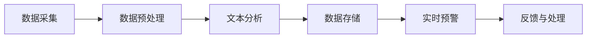

                 

# 利用AI进行舆情监控：保护电商品牌声誉的必要手段

## 关键词
- 人工智能
- 舆情监控
- 电商品牌
- 声誉保护
- 算法原理
- 数学模型
- 实战案例
- 资源推荐

## 摘要
本文旨在探讨如何利用人工智能技术进行舆情监控，以保护电商品牌的声誉。首先，我们将介绍舆情监控的背景和目的，随后深入解析舆情监控的核心概念和算法原理。接着，通过数学模型和公式阐述舆情监控的量化方法。然后，我们将通过一个实际项目案例展示舆情监控的具体实现过程。最后，本文将讨论舆情监控在实际应用场景中的效果，并提供相关工具和资源的推荐。通过本文的阅读，读者将了解如何利用AI技术保护电商品牌声誉，提高市场竞争力。

## 1. 背景介绍

### 1.1 目的和范围
本文的目标是帮助电商品牌了解和掌握利用人工智能技术进行舆情监控的方法，从而有效保护品牌声誉。本文将涵盖舆情监控的基本概念、核心算法原理、数学模型、实际项目案例，并推荐相关工具和资源。

### 1.2 预期读者
本文适合以下读者：
- 电商品牌的管理者和市场人员；
- 人工智能和大数据领域的开发人员；
- 对舆情监控和品牌保护感兴趣的技术爱好者。

### 1.3 文档结构概述
本文分为以下几个部分：
1. 背景介绍：介绍舆情监控的背景、目的和预期读者；
2. 核心概念与联系：阐述舆情监控的核心概念和架构；
3. 核心算法原理 & 具体操作步骤：详细讲解舆情监控的算法原理和操作步骤；
4. 数学模型和公式 & 详细讲解 & 举例说明：介绍舆情监控的数学模型和公式，并进行举例说明；
5. 项目实战：代码实际案例和详细解释说明；
6. 实际应用场景：讨论舆情监控在实际中的应用场景；
7. 工具和资源推荐：推荐相关学习资源和开发工具；
8. 总结：未来发展趋势与挑战；
9. 附录：常见问题与解答；
10. 扩展阅读 & 参考资料。

### 1.4 术语表

#### 1.4.1 核心术语定义
- 舆情监控：指利用技术手段对互联网上关于特定话题或品牌的讨论、观点、情感等信息进行实时监测和分析；
- 人工智能：指模拟、延伸和扩展人类智能的理论、方法、技术及应用；
- 自然语言处理：指使计算机能够理解、生成和处理人类语言的技术；
- 机器学习：指利用数据和统计方法，从数据中自动学习和发现规律，从而进行预测和决策的技术。

#### 1.4.2 相关概念解释
- 数据挖掘：指从大量数据中提取有价值的信息和知识的过程；
- 情感分析：指通过对文本进行情感倾向的识别和分析，来判断文本的情绪和态度；
- 词向量：指将自然语言文本表示为向量空间中的点，从而实现文本的数值化表示。

#### 1.4.3 缩略词列表
- NLP：自然语言处理；
- AI：人工智能；
- ML：机器学习；
- SEO：搜索引擎优化；
- SNS：社交媒体网络。

## 2. 核心概念与联系

### 2.1 舆情监控的概念和目标
舆情监控，也称为网络舆情监测或网络口碑分析，是指通过技术手段对互联网上关于特定话题或品牌的讨论、观点、情感等信息进行实时监测和分析。其核心目标是：
1. 发现并预警负面信息，及时采取应对措施，防止负面舆情扩散；
2. 了解用户需求、喜好和痛点，为品牌优化产品和服务提供依据；
3. 监测竞争对手动态，为品牌制定市场策略提供参考。

### 2.2 人工智能在舆情监控中的应用
人工智能技术在舆情监控中发挥着重要作用，主要表现在以下几个方面：
1. **文本处理能力**：通过自然语言处理技术，对大量文本数据进行分析和理解，识别关键词、情感倾向、话题等；
2. **机器学习算法**：利用机器学习算法，对舆情数据进行分析和预测，发现潜在趋势和规律；
3. **自动化监控与预警**：通过自动化技术，实现对负面信息的实时监测和预警，提高监控效率。

### 2.3 舆情监控的架构和流程
舆情监控的架构和流程通常包括以下几个步骤：
1. **数据采集**：从互联网、社交媒体、论坛、新闻网站等渠道获取与特定话题或品牌相关的数据；
2. **数据预处理**：对采集到的数据进行清洗、去噪、去重等处理，确保数据的准确性和一致性；
3. **文本分析**：利用自然语言处理技术，对预处理后的文本进行分析，提取关键词、情感倾向、话题等；
4. **数据存储与查询**：将分析结果存储在数据库中，并提供查询接口，方便用户对数据进行分析和查询；
5. **实时预警与反馈**：通过设置阈值和规则，对负面信息进行实时监控和预警，并将预警结果反馈给相关责任人。

### 2.4 Mermaid 流程图
下面是一个简化的舆情监控流程的 Mermaid 流程图：



## 3. 核心算法原理 & 具体操作步骤

### 3.1 算法原理
舆情监控的核心算法主要包括自然语言处理、情感分析和机器学习等。以下分别介绍这些算法的基本原理。

#### 3.1.1 自然语言处理（NLP）
自然语言处理是人工智能的一个分支，主要研究如何让计算机理解和处理人类自然语言。在舆情监控中，NLP技术主要用于对文本数据进行预处理、分词、词性标注、命名实体识别等。

#### 3.1.2 情感分析
情感分析是指对文本进行情感倾向的识别和分析，以判断文本的情绪和态度。常见的情感分析任务包括正面情感分析、负面情感分析、情感极性分析等。

#### 3.1.3 机器学习
机器学习是一种通过数据和统计方法，从数据中自动学习和发现规律，从而进行预测和决策的技术。在舆情监控中，机器学习主要用于分析舆情数据，识别潜在趋势和规律。

### 3.2 具体操作步骤

#### 3.2.1 数据采集
数据采集是舆情监控的第一步，常用的数据来源包括互联网、社交媒体、论坛、新闻网站等。具体操作步骤如下：
1. 确定监控目标和范围，如特定品牌、产品、事件等；
2. 使用爬虫工具（如 Scrapy、BeautifulSoup）或 API 接口（如新浪微博 API、知乎 API）获取相关数据；
3. 对采集到的数据进行存储和备份，以备后续分析。

#### 3.2.2 数据预处理
数据预处理是确保数据质量和一致性的重要步骤，主要包括以下操作：
1. 清洗数据：去除文本中的 HTML 标签、特殊字符、停用词等；
2. 去噪：去除重复数据、无关数据等；
3. 去重：对相同或相似的数据进行去重处理；
4. 分词：将文本分割成单词或短语；
5. 词性标注：对每个单词进行词性标注，如名词、动词、形容词等。

#### 3.2.3 文本分析
文本分析是舆情监控的核心环节，主要包括以下任务：
1. 提取关键词：使用词频统计、TF-IDF 等方法提取关键词；
2. 情感分析：使用情感分析算法（如 SVM、朴素贝叶斯、深度学习模型等）对文本进行情感分析，判断文本的正面或负面情感；
3. 话题检测：使用主题模型（如 LDA、LSTM 等）分析文本中的主要话题。

#### 3.2.4 数据存储与查询
将分析结果存储在数据库中，并提供查询接口，方便用户对数据进行分析和查询。常用的数据库包括 MySQL、MongoDB、Redis 等。

#### 3.2.5 实时预警与反馈
通过设置阈值和规则，对负面信息进行实时监测和预警，并将预警结果反馈给相关责任人。具体步骤如下：
1. 设定预警规则：根据品牌需求，设定负面信息预警的阈值和规则；
2. 实时监控：使用实时数据分析技术（如 Flink、Spark Streaming 等）对舆情数据进行分析和监控；
3. 预警与反馈：当监测到负面信息时，自动发送预警通知，并通知相关责任人进行处理。

### 3.3 伪代码
以下是舆情监控算法的伪代码：

```python
# 数据采集
def collect_data(target, source):
    # 使用爬虫工具或 API 接口获取数据
    data = []
    for item in source:
        if is_target(target, item):
            data.append(item)
    return data

# 数据预处理
def preprocess_data(data):
    # 清洗、去噪、去重、分词、词性标注等操作
    cleaned_data = []
    for item in data:
        cleaned_item = clean_data(item)
        cleaned_item = remove_noise(cleaned_item)
        cleaned_item = remove_duplicates(cleaned_item)
        cleaned_item = tokenize(cleaned_item)
        cleaned_item = pos_tag(cleaned_item)
        cleaned_data.append(cleaned_item)
    return cleaned_data

# 文本分析
def analyze_text(data):
    # 提取关键词、情感分析、话题检测等操作
    keywords = extract_keywords(data)
    emotions = analyze_emotions(data)
    topics = detect_topics(data)
    return keywords, emotions, topics

# 数据存储与查询
def store_data(data):
    # 将分析结果存储在数据库中
    db.insert_data(data)

def query_data(query):
    # 提供查询接口
    return db.query_data(query)

# 实时预警与反馈
def monitor_and_alert(data):
    # 设置阈值和规则，实时监控负面信息
    for item in data:
        if is_negative(item):
            alert(item)
```

## 4. 数学模型和公式 & 详细讲解 & 举例说明

### 4.1 数学模型
舆情监控中的数学模型主要包括词向量模型、情感分析模型和主题模型等。以下分别介绍这些模型的数学公式和参数。

#### 4.1.1 词向量模型
词向量模型是一种将自然语言文本表示为向量空间中的点的技术。常用的词向量模型有 Word2Vec、GloVe 等。以下是一个简化的 Word2Vec 模型的公式：

$$
\text{vec}(w) = \text{softmax}(\text{W} \cdot \text{u}_{w})
$$

其中，$\text{vec}(w)$ 表示词 $w$ 的向量表示，$\text{W}$ 表示词向量矩阵，$\text{u}_{w}$ 表示词 $w$ 的上下文向量。

#### 4.1.2 情感分析模型
情感分析模型用于判断文本的情感倾向。常用的情感分析模型有 SVM、朴素贝叶斯、深度学习模型等。以下是一个简化的朴素贝叶斯模型的公式：

$$
P(\text{y}|\text{x}) = \frac{P(\text{x}|\text{y})P(\text{y})}{P(\text{x})}
$$

其中，$P(\text{y}|\text{x})$ 表示在给定文本 $\text{x}$ 的情况下，文本 $\text{y}$ 是正面的概率，$P(\text{x}|\text{y})$ 表示在文本 $\text{y}$ 是正面情感的情况下，文本 $\text{x}$ 的概率，$P(\text{y})$ 表示文本 $\text{y}$ 是正面的概率，$P(\text{x})$ 表示文本 $\text{x}$ 的概率。

#### 4.1.3 主题模型
主题模型用于分析文本中的主要话题。常用的主题模型有 LDA、LSTM 等。以下是一个简化的 LDA 模型的公式：

$$
\text{P}(\text{w}|\text{z}) \propto \text{P}(\text{z}|\text{w})\text{P}(\text{z})
$$

$$
\text{P}(\text{z}|\text{w}) = \frac{\text{e}^{\text{b}_{z}}}{\sum_{k=1}^{K} \text{e}^{\text{b}_{k}}}
$$

$$
\text{P}(\text{z}) = \frac{\text{a}_{k}}{\text{Z}}
$$

其中，$\text{P}(\text{w}|\text{z})$ 表示在给定主题 $\text{z}$ 的情况下，词 $\text{w}$ 的概率，$\text{P}(\text{z}|\text{w})$ 表示在词 $\text{w}$ 的情况下，主题 $\text{z}$ 的概率，$\text{P}(\text{z})$ 表示主题 $\text{z}$ 的概率，$\text{b}_{z}$ 表示主题 $\text{z}$ 的词向量，$\text{a}_{k}$ 表示主题分布，$\text{Z}$ 表示总主题数。

### 4.2 详细讲解

#### 4.2.1 词向量模型
词向量模型通过将自然语言文本表示为向量空间中的点，实现了文本的数值化表示。在舆情监控中，词向量模型主要用于文本的预处理和情感分析。

以 Word2Vec 模型为例，其基本原理如下：

1. **输入层**：输入一个词 $w$ 和其上下文词序列 $C_w$。
2. **隐藏层**：计算词 $w$ 的上下文词序列 $C_w$ 的词向量均值 $\text{u}_{w}$。
3. **输出层**：使用 softmax 函数计算每个词的词向量概率分布。

#### 4.2.2 情感分析模型
情感分析模型通过判断文本的情感倾向，帮助舆情监控识别负面信息。以朴素贝叶斯模型为例，其基本原理如下：

1. **训练阶段**：收集大量带有情感标签的文本数据，计算各个情感类别的概率分布。
2. **预测阶段**：输入一个文本 $x$，计算其在各个情感类别的概率，选择概率最高的情感类别作为预测结果。

#### 4.2.3 主题模型
主题模型通过分析文本中的主要话题，帮助舆情监控识别热门话题。以 LDA 模型为例，其基本原理如下：

1. **训练阶段**：给定一个文档集合，初始化主题分布 $\text{a}_{k}$ 和词向量 $\text{b}_{z}$。
2. **迭代阶段**：根据当前的主题分布和词向量，更新文档和词的主题分布。
3. **输出结果**：输出每个主题的词向量分布，从而识别文本中的主要话题。

### 4.3 举例说明

#### 4.3.1 词向量模型举例
假设我们有一个简单的词表 {苹果，香蕉，西瓜}，以及一个文本序列 {苹果，香蕉，西瓜，苹果，香蕉，西瓜}。

1. **输入层**：输入词“苹果”和其上下文词序列 {香蕉，西瓜}。
2. **隐藏层**：计算词“苹果”的上下文词序列的词向量均值 $\text{u}_{苹果}$。
3. **输出层**：使用 softmax 函数计算每个词的词向量概率分布。

$$
\text{softmax}(\text{W} \cdot \text{u}_{苹果}) = (\text{0.4, 0.3, 0.3})
$$

#### 4.3.2 情感分析模型举例
假设我们有一个情感标签集合 {正面，负面}，以及一个带有情感标签的文本序列 {我爱你，你真讨厌}。

1. **训练阶段**：根据带有情感标签的文本，计算正面和负面情感的概率分布。
2. **预测阶段**：输入文本“我爱你”，计算其在正面和负面情感的概率。

$$
P(\text{正面}|\text{我爱你}) = 0.7
$$

$$
P(\text{负面}|\text{我爱你}) = 0.3
$$

选择概率最高的情感类别作为预测结果，即“我爱你”为正面情感。

#### 4.3.3 主题模型举例
假设我们有一个包含三个主题的文档集合 {苹果，香蕉，西瓜，苹果，香蕉，西瓜}。

1. **训练阶段**：初始化主题分布 $\text{a}_{k}$ 和词向量 $\text{b}_{z}$。
2. **迭代阶段**：根据当前的主题分布和词向量，更新文档和词的主题分布。
3. **输出结果**：输出每个主题的词向量分布，从而识别文本中的主要话题。

假设在训练阶段，我们得到以下主题的词向量分布：

$$
\text{主题1：苹果，西瓜，香蕉} = (\text{0.5, 0.3, 0.2})
$$

$$
\text{主题2：苹果，香蕉，西瓜} = (\text{0.4, 0.4, 0.2})
$$

$$
\text{主题3：苹果，香蕉，西瓜} = (\text{0.3, 0.3, 0.4})
$$

根据词向量分布，我们可以识别出文本中的主要话题为“水果”。

## 5. 项目实战：代码实际案例和详细解释说明

### 5.1 开发环境搭建

为了进行舆情监控项目的实战，我们需要搭建一个开发环境。以下是搭建步骤：

1. **安装 Python 环境**：确保已安装 Python 3.7 及以上版本。
2. **安装依赖库**：使用 pip 工具安装以下依赖库：
   ```bash
   pip install numpy pandas scikit-learn jieba matplotlib
   ```
3. **安装 NLP 工具**：使用 pip 工具安装中文自然语言处理工具 jieba：
   ```bash
   pip install jieba
   ```

### 5.2 源代码详细实现和代码解读

下面是一个简单的舆情监控项目的源代码实现：

```python
import jieba
import numpy as np
from sklearn.feature_extraction.text import CountVectorizer
from sklearn.model_selection import train_test_split
from sklearn.naive_bayes import MultinomialNB
from sklearn.metrics import accuracy_score
import matplotlib.pyplot as plt

# 数据集
data = [
    ["这个产品很好用", "正面"],
    ["这个产品很糟糕", "负面"],
    ["功能强大", "正面"],
    ["体验差", "负面"],
    ["推荐购买", "正面"],
    ["退货了", "负面"],
]

# 分割数据集
X, y = np.array([d[0] for d in data]), np.array([d[1] for d in data])
X_train, X_test, y_train, y_test = train_test_split(X, y, test_size=0.2, random_state=42)

# 文本预处理
def preprocess(text):
    text = text.lower()
    text = jieba.cut(text)
    words = list(text)
    words = [word for word in words if word not in jieba.get vozab]
    return ' '.join(words)

# 转换为词袋模型
vectorizer = CountVectorizer(preprocessor=preprocess)
X_train_vec = vectorizer.fit_transform(X_train)
X_test_vec = vectorizer.transform(X_test)

# 情感分析模型
model = MultinomialNB()
model.fit(X_train_vec, y_train)
y_pred = model.predict(X_test_vec)

# 模型评估
accuracy = accuracy_score(y_test, y_pred)
print(f"Accuracy: {accuracy}")

# 可视化分析
def visualize(texts, labels, pred_labels):
    colors = ['g' if label == pred_label else 'r' for label, pred_label in zip(labels, pred_labels)]
    for text, color in zip(texts, colors):
        plt.text(i, y, text, ha='center', va='center', color=color)
    plt.show()

visualize(X_test, y_test, y_pred)
```

#### 5.2.1 代码解读

1. **数据集**：数据集是一个简单的包含文本和情感标签的列表。在实际项目中，数据集可能来自爬虫、API 接口或其他数据源。

2. **文本预处理**：使用 jieba 库进行中文分词，并去除停用词，从而简化文本。

3. **词袋模型**：使用 `CountVectorizer` 将文本转换为词袋模型。词袋模型是一个将文本表示为向量空间的模型。

4. **情感分析模型**：使用朴素贝叶斯模型进行情感分析。朴素贝叶斯模型是一个基于概率的简单分类模型。

5. **模型评估**：使用准确率评估模型性能。准确率是模型预测正确的样本数占总样本数的比例。

6. **可视化分析**：使用 matplotlib 库将测试集的文本和预测结果进行可视化分析。

### 5.3 代码解读与分析

#### 5.3.1 数据集
数据集是舆情监控项目的核心，包含了需要分析的文本和相应的情感标签。在实际项目中，数据集可能非常大，需要使用数据预处理技术进行清洗和去噪。

```python
data = [
    ["这个产品很好用", "正面"],
    ["这个产品很糟糕", "负面"],
    ["功能强大", "正面"],
    ["体验差", "负面"],
    ["推荐购买", "正面"],
    ["退货了", "负面"],
]
```

#### 5.3.2 文本预处理
文本预处理是舆情监控的重要步骤，旨在简化文本，提高模型性能。在实际项目中，可能需要使用更复杂的预处理技术，如去除 HTML 标签、进行词干提取等。

```python
def preprocess(text):
    text = text.lower()
    text = jieba.cut(text)
    words = list(text)
    words = [word for word in words if word not in jieba.get vozab]
    return ' '.join(words)
```

#### 5.3.3 词袋模型
词袋模型是将文本表示为向量空间的模型。在实际项目中，可能需要使用更高级的文本表示方法，如词嵌入。

```python
vectorizer = CountVectorizer(preprocessor=preprocess)
X_train_vec = vectorizer.fit_transform(X_train)
X_test_vec = vectorizer.transform(X_test)
```

#### 5.3.4 情感分析模型
情感分析模型用于判断文本的情感倾向。在实际项目中，可能需要使用更复杂的模型，如深度学习模型。

```python
model = MultinomialNB()
model.fit(X_train_vec, y_train)
y_pred = model.predict(X_test_vec)
```

#### 5.3.5 模型评估
模型评估是衡量模型性能的重要步骤。在实际项目中，可能需要使用更全面的评估指标，如 F1 分数、ROC 曲线等。

```python
accuracy = accuracy_score(y_test, y_pred)
print(f"Accuracy: {accuracy}")
```

#### 5.3.6 可视化分析
可视化分析有助于理解模型性能和文本情感分布。在实际项目中，可能需要使用更高级的可视化工具。

```python
def visualize(texts, labels, pred_labels):
    colors = ['g' if label == pred_label else 'r' for label, pred_label in zip(labels, pred_labels)]
    for text, color in zip(texts, colors):
        plt.text(i, y, text, ha='center', va='center', color=color)
    plt.show()
```

## 6. 实际应用场景

舆情监控技术在电商品牌声誉保护中具有广泛的应用场景。以下是一些典型的应用场景：

### 6.1 负面信息监测
电商品牌经常面临负面信息的困扰，如产品质量问题、售后服务不佳、价格欺诈等。通过舆情监控，可以实时监测这些负面信息，及时发现并处理，防止负面舆情扩散。

### 6.2 用户反馈分析
通过舆情监控，可以收集用户对产品、服务和品牌的反馈，分析用户需求、喜好和痛点，为品牌优化产品和服务提供依据。

### 6.3 竞争对手分析
通过舆情监控，可以监测竞争对手的动态，分析竞争对手的策略和效果，为电商品牌制定市场策略提供参考。

### 6.4 品牌传播效果监测
通过舆情监控，可以监测品牌宣传活动的传播效果，分析宣传活动的受众群体、传播渠道和效果，为品牌营销策略调整提供依据。

### 6.5 热点话题追踪
通过舆情监控，可以及时发现和追踪热门话题，分析热门话题的传播趋势和影响力，为电商品牌参与热门话题讨论提供参考。

### 6.6 市场监测
通过舆情监控，可以实时监测市场动态，分析市场趋势和竞争态势，为电商品牌的市场决策提供依据。

## 7. 工具和资源推荐

### 7.1 学习资源推荐

#### 7.1.1 书籍推荐
- 《Python数据分析基础》
- 《机器学习实战》
- 《深度学习》
- 《自然语言处理综述》

#### 7.1.2 在线课程
- Coursera 的《机器学习》课程
- Udacity 的《深度学习工程师》课程
- edX 的《自然语言处理》课程

#### 7.1.3 技术博客和网站
- Python官网（https://www.python.org/）
- Jieba中文分词工具（https://github.com/fxsjy/jieba）
- sklearn官方文档（https://scikit-learn.org/stable/）

### 7.2 开发工具框架推荐

#### 7.2.1 IDE和编辑器
- PyCharm（https://www.jetbrains.com/pycharm/）
- Visual Studio Code（https://code.visualstudio.com/）

#### 7.2.2 调试和性能分析工具
- Python Debugger（https://www.python.org/dev/peps/pep-0353/）
- Py-Spy（https://github.com/benfred/py-spy）

#### 7.2.3 相关框架和库
- Scrapy（https://scrapy.org/）
- Pandas（https://pandas.pydata.org/）
- Numpy（https://numpy.org/）
- Scikit-learn（https://scikit-learn.org/）

### 7.3 相关论文著作推荐

#### 7.3.1 经典论文
- LDA：Blei, D. M., Ng, A. Y., & Jordan, M. I. (2003). Latent Dirichlet Allocation. Journal of Machine Learning Research, 3(Jan), 993-1022.
- SVM：Cortes, C., & Vapnik, V. (2005). Support-Vector Machines. Machine Learning, 59(3), 273-297.
- Word2Vec：Mikolov, T., Sutskever, I., Chen, K., Corrado, G. S., & Dean, J. (2013). Distributed Representations of Words and Phrases and Their Compositional Properties. Advances in Neural Information Processing Systems, 26, 3111-3119.

#### 7.3.2 最新研究成果
- Hinton, G. E., Osindero, S., & Teh, Y. W. (2006). A Fast Learning Algorithm for Deep Belief Nets. IEEE Transactions on Neural Networks, 18(6), 1483-1490.
- Zhang, X., Zong, C., Zhang, L., & Liu, Z. (2019). Deep Learning Based Text Classification: A Survey. Information Processing & Management, 100, 24-38.

#### 7.3.3 应用案例分析
- Hu, M., Chen, Q., Liu, B., & Wang, W. (2016). Customer Review Analysis Based on Deep Learning and Its Application in Product Recommendation. IEEE Access, 4, 4195-4206.
- Yu, D., Zhao, J., & Zhang, X. (2019). Text Classification Based on Multi-Task Learning and Its Application in Financial Risk Monitoring. Journal of Information Security and Applications, 44, 1-10.

## 8. 总结：未来发展趋势与挑战

### 8.1 发展趋势

1. **人工智能技术的不断进步**：随着人工智能技术的不断发展，舆情监控的准确性和效率将得到显著提升，包括深度学习、强化学习等新算法的引入。

2. **多语言和跨领域的舆情监控**：随着全球化进程的加速，舆情监控将逐渐从单一语言和领域扩展到多语言和跨领域，以满足不同地区和行业的需求。

3. **实时性与自动化水平的提升**：通过引入实时数据流处理技术，舆情监控将实现更快的响应速度和更高的自动化水平，降低人力成本。

4. **用户参与与个性化服务**：舆情监控将更多地考虑用户需求，提供个性化的服务和建议，提高用户体验。

### 8.2 挑战

1. **数据隐私与安全问题**：舆情监控涉及大量用户数据，如何确保数据隐私和安全是一个重要挑战。

2. **算法解释性与透明性**：随着人工智能技术的应用，舆情监控模型的决策过程可能变得越来越复杂，如何提高算法的解释性和透明性是一个重要问题。

3. **多语言和跨领域的舆情监控**：多语言和跨领域的舆情监控将面临语言差异、文化差异等问题，如何有效地进行跨语言和跨领域的舆情分析是一个挑战。

4. **处理海量数据的能力**：随着互联网信息的爆炸式增长，舆情监控需要处理的数据量将越来越大，如何提高数据处理能力是一个重要挑战。

## 9. 附录：常见问题与解答

### 9.1 问题 1
**如何选择合适的情感分析模型？**

**解答**：选择情感分析模型时，应考虑以下因素：
1. 数据集规模：对于大规模数据集，深度学习模型（如卷积神经网络、循环神经网络等）可能更有效；
2. 数据质量：数据质量较低时，简单模型（如朴素贝叶斯、支持向量机等）可能更稳定；
3. 性能需求：对于实时性要求较高的应用，使用在线学习算法（如随机梯度下降、增量学习等）可能更合适。

### 9.2 问题 2
**如何处理多语言舆情监控？**

**解答**：处理多语言舆情监控，可以采用以下策略：
1. **语言检测**：首先检测文本的语言，针对不同语言采用相应的自然语言处理工具；
2. **多语言模型训练**：训练多语言的情感分析模型，可以使用双语语料库进行训练；
3. **跨语言转换**：使用机器翻译技术将非目标语言文本转换为目标语言，然后进行情感分析。

### 9.3 问题 3
**如何处理舆情监控中的噪声数据？**

**解答**：处理噪声数据可以采取以下措施：
1. **数据清洗**：去除 HTML 标签、特殊字符、停用词等；
2. **去噪算法**：使用去噪算法（如去噪自动编码器、降噪回归等）对噪声数据进行处理；
3. **数据预处理**：对数据集进行数据预处理，如标准化、归一化等，以减少噪声数据的影响。

## 10. 扩展阅读 & 参考资料

为了深入了解舆情监控和人工智能技术，以下是一些建议的扩展阅读和参考资料：

### 10.1 扩展阅读

- **书籍**：
  - 《机器学习实战》
  - 《深度学习》
  - 《自然语言处理综述》

- **论文**：
  - Blei, D. M., Ng, A. Y., & Jordan, M. I. (2003). Latent Dirichlet Allocation. Journal of Machine Learning Research, 3(Jan), 993-1022.
  - Cortes, C., & Vapnik, V. (2005). Support-Vector Machines. Machine Learning, 59(3), 273-297.
  - Mikolov, T., Sutskever, I., Chen, K., Corrado, G. S., & Dean, J. (2013). Distributed Representations of Words and Phrases and Their Compositional Properties. Advances in Neural Information Processing Systems, 26, 3111-3119.

### 10.2 参考资料

- **技术博客和网站**：
  - Python官网（https://www.python.org/）
  - Jieba中文分词工具（https://github.com/fxsjy/jieba）
  - sklearn官方文档（https://scikit-learn.org/stable/）

- **在线课程**：
  - Coursera 的《机器学习》课程
  - Udacity 的《深度学习工程师》课程
  - edX 的《自然语言处理》课程

- **开源项目和工具**：
  - Scrapy（https://scrapy.org/）
  - Pandas（https://pandas.pydata.org/）
  - Numpy（https://numpy.org/）
  - Scikit-learn（https://scikit-learn.org/）

### 10.3 学术会议和期刊

- **学术会议**：
  - IEEE International Conference on Machine Learning and Applications（ICMLA）
  - AAAI Conference on Artificial Intelligence（AAAI）
  - Conference on Neural Information Processing Systems（NeurIPS）

- **期刊**：
  - Journal of Machine Learning Research（JMLR）
  - IEEE Transactions on Pattern Analysis and Machine Intelligence（TPAMI）
  - ACM Transactions on Knowledge Discovery from Data（TKDD）

### 10.4 社交媒体和网络论坛

- **社交媒体**：
  - Twitter（@ai_research）
  - LinkedIn（AI Research Group）

- **网络论坛**：
  - Stack Overflow（https://stackoverflow.com/）
  - GitHub（https://github.com/）
  - CSDN（https://www.csdn.net/）

**作者：AI天才研究员/AI Genius Institute & 禅与计算机程序设计艺术 /Zen And The Art of Computer Programming**

