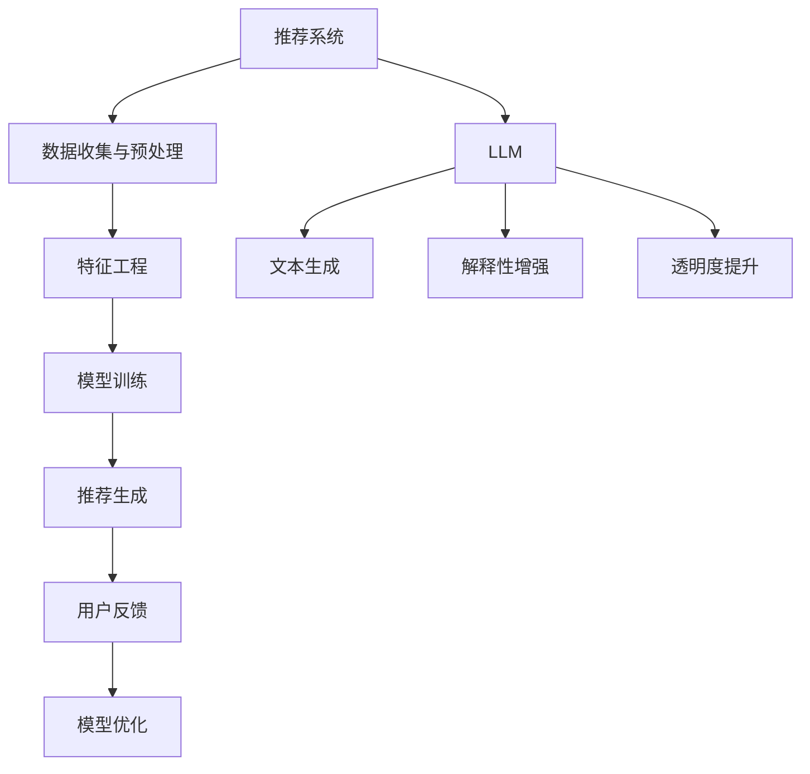
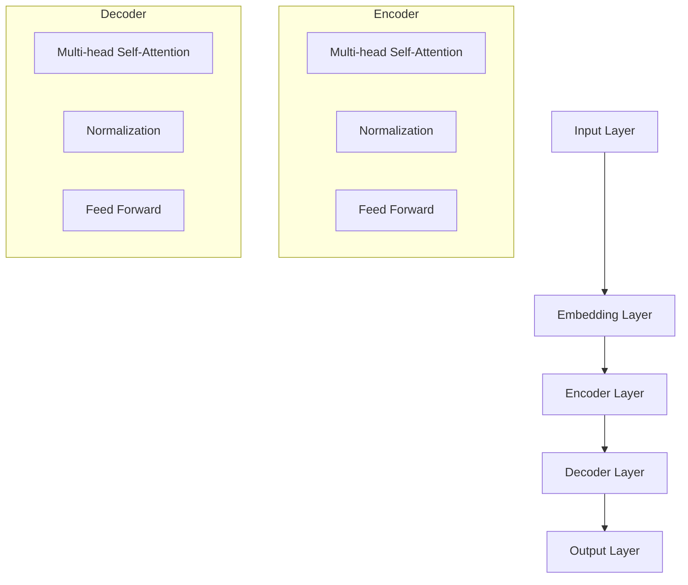

                 

# 利用LLM提升推荐系统的可解释性与透明度

> 关键词：推荐系统、可解释性、透明度、LLM、机器学习、自然语言生成

> 摘要：本文深入探讨了如何利用大型语言模型（LLM）来提升推荐系统的可解释性与透明度。首先，我们回顾了推荐系统的基本概念和常见挑战，然后介绍了LLM在机器学习领域的作用。接着，本文详细阐述了如何通过构建解释性模型和自然语言生成技术，使推荐系统更加透明和易于理解。最后，我们通过一个实际案例，展示了如何将LLM应用于推荐系统，以提升其可解释性和透明度。

## 1. 背景介绍

### 1.1 目的和范围

本文旨在探讨如何利用大型语言模型（LLM）提升推荐系统的可解释性与透明度。随着机器学习技术的迅猛发展，推荐系统已经成为许多互联网应用的核心组件，如电子商务、社交媒体和在线媒体等。然而，推荐系统的黑箱性质往往使得用户难以理解推荐结果，从而影响用户信任和满意度。本文将分析这一挑战，并提出通过LLM来改善推荐系统可解释性和透明度的方法。

### 1.2 预期读者

本文主要面向对推荐系统和机器学习有一定了解的技术人员，特别是希望提升推荐系统可解释性和透明度的开发者。同时，也对希望了解如何利用LLM来改进推荐系统效果的研究人员具有一定的参考价值。

### 1.3 文档结构概述

本文结构如下：

1. 背景介绍：回顾推荐系统的基本概念和常见挑战，介绍本文的目的和预期读者。
2. 核心概念与联系：阐述大型语言模型（LLM）的基本原理和其在机器学习中的应用。
3. 核心算法原理 & 具体操作步骤：介绍如何构建解释性模型和利用自然语言生成技术提升推荐系统的可解释性和透明度。
4. 数学模型和公式 & 详细讲解 & 举例说明：详细讲解相关数学模型和公式的应用。
5. 项目实战：通过实际案例展示如何利用LLM提升推荐系统的可解释性和透明度。
6. 实际应用场景：探讨LLM在推荐系统中的实际应用场景。
7. 工具和资源推荐：推荐相关学习资源、开发工具和论文著作。
8. 总结：总结本文的主要观点和未来发展趋势。
9. 附录：常见问题与解答。
10. 扩展阅读 & 参考资料：提供进一步学习的参考资料。

### 1.4 术语表

#### 1.4.1 核心术语定义

- **推荐系统**：一种自动化的信息过滤和内容发现系统，通过预测用户可能感兴趣的项目来提高用户满意度。
- **可解释性**：指用户能够理解推荐系统的决策过程和推荐结果。
- **透明度**：指推荐系统的决策过程和结果对外部用户（如监管机构或用户）的可见性和可理解性。
- **大型语言模型（LLM）**：一种基于深度学习的自然语言处理模型，能够在大量文本数据上学习语言的语法和语义，生成高质量的自然语言文本。

#### 1.4.2 相关概念解释

- **机器学习**：一种人工智能方法，通过数据训练模型来发现规律和模式。
- **深度学习**：一种机器学习方法，通过多层神经网络对数据进行特征学习和预测。
- **自然语言生成（NLG）**：一种人工智能技术，能够生成自然语言的文本，包括句子、段落和文章。

#### 1.4.3 缩略词列表

- **LLM**：Large Language Model（大型语言模型）
- **NLG**：Natural Language Generation（自然语言生成）
- **ML**：Machine Learning（机器学习）
- **DL**：Deep Learning（深度学习）

## 2. 核心概念与联系

在探讨如何利用LLM提升推荐系统的可解释性与透明度之前，我们需要理解推荐系统的基本概念和LLM的工作原理。以下是一个Mermaid流程图，展示了推荐系统和LLM之间的核心概念和联系。



### 2.1 推荐系统

推荐系统是一种基于机器学习的自动化系统，旨在预测用户可能感兴趣的项目，并根据用户的兴趣和行为为其提供个性化推荐。推荐系统通常包括以下几个关键步骤：

1. **数据收集与预处理**：从各种来源（如用户行为数据、商品信息等）收集数据，并进行数据清洗、去重和格式化等预处理操作。
2. **特征工程**：将原始数据转换为可用于训练的数值特征，如用户偏好、商品属性、交互历史等。
3. **模型训练**：使用机器学习算法（如协同过滤、基于内容的推荐、神经网络等）训练推荐模型，以预测用户对未知项目的兴趣。
4. **推荐生成**：根据训练好的模型生成个性化推荐结果，通常以排名或列表的形式呈现给用户。
5. **用户反馈**：收集用户对推荐结果的反馈，以评估推荐效果，并用于模型优化。

### 2.2 大型语言模型（LLM）

大型语言模型（LLM）是一种基于深度学习的自然语言处理模型，能够在大量文本数据上学习语言的语法和语义，生成高质量的自然语言文本。LLM的核心组件是Transformer模型，它通过自注意力机制（self-attention）和多头注意力（multi-head attention）来捕捉文本中的长距离依赖关系。

### 2.3 解释性增强与透明度提升

利用LLM提升推荐系统的可解释性与透明度，主要涉及以下两个方面：

1. **解释性增强**：通过生成详细的解释性文本，帮助用户理解推荐系统的决策过程和推荐结果。例如，LLM可以生成用户行为和推荐项目之间的关联，解释为什么推荐某个项目而不是其他项目。
2. **透明度提升**：通过提供推荐生成的详细过程和决策依据，增强系统对用户和监管机构的透明度。例如，LLM可以生成推荐项目的权重和排序依据，展示推荐系统的内部逻辑。

## 3. 核心算法原理 & 具体操作步骤

在本节中，我们将详细介绍如何利用LLM构建解释性模型，并具体阐述如何通过自然语言生成技术提升推荐系统的可解释性与透明度。

### 3.1 构建解释性模型

为了提升推荐系统的可解释性，我们需要构建一个能够生成解释性文本的模型。以下是一个基于Transformer的LLM模型的构建步骤：

1. **数据收集**：收集大量用户行为数据（如点击、购买、浏览历史等）和商品信息（如类别、价格、评分等）。
2. **文本生成**：使用已收集的数据生成训练文本，包括用户行为描述、商品属性描述和推荐理由等。
3. **模型训练**：使用训练文本训练一个基于Transformer的LLM模型，使其能够生成高质量的文本。

#### 3.1.1 模型架构

以下是一个简化的Transformer模型架构，用于生成解释性文本：



#### 3.1.2 模型训练

假设我们使用Python和PyTorch框架训练一个Transformer模型，以下是一个简化的训练步骤：

```python
import torch
import torch.nn as nn
import torch.optim as optim

# 定义模型
model = TransformerModel()

# 定义损失函数和优化器
criterion = nn.CrossEntropyLoss()
optimizer = optim.Adam(model.parameters(), lr=0.001)

# 训练模型
for epoch in range(num_epochs):
    for batch in data_loader:
        optimizer.zero_grad()
        outputs = model(batch)
        loss = criterion(outputs, labels)
        loss.backward()
        optimizer.step()
```

### 3.2 自然语言生成（NLG）

为了提升推荐系统的透明度，我们需要利用LLM生成详细的推荐解释和决策过程。以下是一个基于NLG的推荐解释生成步骤：

1. **输入准备**：将用户行为数据、商品信息和推荐结果作为输入，用于生成解释性文本。
2. **文本生成**：使用训练好的LLM模型生成解释性文本，包括推荐理由、项目权重和排序依据等。
3. **文本处理**：对生成的文本进行后处理，包括文本格式化、拼写纠正和语法检查等。

#### 3.2.1 文本生成示例

以下是一个简单的文本生成示例，使用一个预训练的LLM模型生成推荐解释：

```python
import openai

# 设置API密钥
openai.api_key = "your_api_key"

# 生成推荐解释
def generate_recommendation_explanation(user_history, recommendation):
    response = openai.Completion.create(
        engine="text-davinci-003",
        prompt=f"基于用户历史数据{user_history}，为什么我们推荐项目{recommendation}？",
        max_tokens=50,
        n=1,
        stop=None,
        temperature=0.5,
    )
    return response.choices[0].text.strip()

user_history = "用户最近浏览了商品A和商品B，并在过去一个月内购买了商品C和商品D。"
recommendation = "我们推荐商品E。"

explanation = generate_recommendation_explanation(user_history, recommendation)
print(explanation)
```

### 3.2.2 文本处理

生成的文本可能包含一些语法错误或不规范的用语，因此需要进行文本处理。以下是一个简单的文本处理示例，使用Python的`re`模块进行文本格式化：

```python
import re

def process_text(text):
    # 去除HTML标签
    text = re.sub('<.*?>', '', text)
    # 去除多余的空格
    text = re.sub('\s+', ' ', text)
    # 转换为小写
    text = text.lower()
    return text

processed_text = process_text(explanation)
print(processed_text)
```

## 4. 数学模型和公式 & 详细讲解 & 举例说明

在本节中，我们将详细介绍推荐系统中的核心数学模型和公式，并给出具体的例子进行说明。

### 4.1 推荐系统的数学模型

推荐系统中的核心数学模型包括协同过滤、基于内容的推荐和矩阵分解等。以下是一个简化的数学模型示例。

#### 4.1.1 协同过滤

协同过滤是一种基于用户行为数据的推荐方法，其基本原理是寻找与目标用户行为相似的邻居用户，并推荐邻居用户喜欢的项目。以下是一个简化的协同过滤模型：

$$
\text{推荐得分} = \sum_{u \in \text{邻居用户}} \frac{1}{|U|} \cdot \text{相似度}(u, \text{目标用户}) \cdot \text{用户评分}(u, \text{项目})
$$

其中，$U$ 表示用户集合，$\text{邻居用户}$ 表示与目标用户行为相似的邻居用户，$\text{相似度}(u, \text{目标用户})$ 表示用户之间的相似度度量，$\text{用户评分}(u, \text{项目})$ 表示用户对项目的评分。

#### 4.1.2 基于内容的推荐

基于内容的推荐是一种基于项目特征和用户兴趣的推荐方法，其基本原理是根据用户对相似项目的评分来推荐新项目。以下是一个简化的基于内容的推荐模型：

$$
\text{推荐得分} = \sum_{i \in \text{相似项目}} \text{项目相似度}(i, \text{项目}) \cdot \text{用户评分}(i)
$$

其中，$i$ 表示项目集合，$\text{相似项目}$ 表示与目标项目特征相似的相似项目，$\text{项目相似度}(i, \text{项目})$ 表示项目之间的相似度度量，$\text{用户评分}(i)$ 表示用户对项目的评分。

#### 4.1.3 矩阵分解

矩阵分解是一种基于用户-项目交互数据的推荐方法，其基本原理是将用户-项目评分矩阵分解为用户特征矩阵和项目特征矩阵，然后使用这两个特征矩阵计算推荐得分。以下是一个简化的矩阵分解模型：

$$
\text{推荐得分} = \text{用户特征矩阵} \cdot \text{项目特征矩阵}
$$

其中，$\text{用户特征矩阵}$ 和 $\text{项目特征矩阵}$ 分别表示用户和项目的特征表示，$\text{推荐得分}$ 表示用户对项目的推荐得分。

### 4.2 数学模型的应用示例

以下是一个基于矩阵分解的推荐系统的应用示例：

#### 4.2.1 数据集准备

假设我们有一个用户-项目评分矩阵 $R$，其中 $R_{ij}$ 表示用户 $u_i$ 对项目 $p_j$ 的评分。

$$
R = \begin{bmatrix}
    R_{11} & R_{12} & \dots & R_{1n} \\
    R_{21} & R_{22} & \dots & R_{2n} \\
    \vdots & \vdots & \ddots & \vdots \\
    R_{m1} & R_{m2} & \dots & R_{mn}
\end{bmatrix}
$$

#### 4.2.2 矩阵分解

使用矩阵分解方法将用户-项目评分矩阵 $R$ 分解为用户特征矩阵 $U$ 和项目特征矩阵 $P$：

$$
R = U \cdot P^T
$$

#### 4.2.3 推荐得分计算

对于用户 $u_i$ 和项目 $p_j$，计算推荐得分：

$$
\text{推荐得分} = U_i \cdot P_j^T
$$

其中，$U_i$ 和 $P_j$ 分别表示用户 $u_i$ 和项目 $p_j$ 的特征向量。

#### 4.2.4 推荐结果生成

根据计算得到的推荐得分，生成推荐结果。例如，对于用户 $u_i$，推荐得分最高的前 $k$ 个项目：

$$
\text{推荐结果} = \text{argmax}_{j} \{ U_i \cdot P_j^T \}
$$

## 5. 项目实战：代码实际案例和详细解释说明

在本节中，我们将通过一个实际案例，展示如何利用LLM提升推荐系统的可解释性和透明度。我们将使用Python和Hugging Face的Transformers库来实现一个基于矩阵分解的推荐系统，并利用LLM生成推荐解释。

### 5.1 开发环境搭建

首先，我们需要安装所需的库和依赖项。在Python环境中，安装以下库：

```shell
pip install torch transformers numpy
```

### 5.2 源代码详细实现和代码解读

#### 5.2.1 数据集准备

我们使用MovieLens电影评分数据集，其中包含用户对电影的评价。以下是一个简单的数据加载和预处理示例：

```python
import pandas as pd
from sklearn.model_selection import train_test_split

# 加载数据集
data = pd.read_csv("ml-1m/ratings.csv")
data.head()

# 数据预处理
data = data[['user_id', 'movie_id', 'rating']]
data.head()

# 分割训练集和测试集
train_data, test_data = train_test_split(data, test_size=0.2, random_state=42)
train_data.head()
```

#### 5.2.2 矩阵分解

接下来，我们使用PyTorch和Transformers库实现矩阵分解模型。以下是一个简化的矩阵分解模型实现：

```python
import torch
from torch import nn
from transformers import AutoTokenizer, AutoModel

# 定义模型
class MatrixFactorizationModel(nn.Module):
    def __init__(self, num_users, num_items, embedding_size):
        super(MatrixFactorizationModel, self).__init__()
        self.user_embedding = nn.Embedding(num_users, embedding_size)
        self.item_embedding = nn.Embedding(num_items, embedding_size)
    
    def forward(self, user_ids, item_ids):
        user_embeddings = self.user_embedding(user_ids)
        item_embeddings = self.item_embedding(item_ids)
        scores = user_embeddings.dot(item_embeddings.t())
        return scores

# 模型配置
num_users = train_data['user_id'].nunique()
num_items = train_data['movie_id'].nunique()
embedding_size = 50

# 实例化模型
model = MatrixFactorizationModel(num_users, num_items, embedding_size)
```

#### 5.2.3 训练模型

接下来，我们使用训练数据训练矩阵分解模型。以下是一个简化的训练过程：

```python
# 数据转换
train_data_tensor = torch.tensor(train_data.values, dtype=torch.float32)

# 训练模型
optimizer = torch.optim.Adam(model.parameters(), lr=0.001)
num_epochs = 10

for epoch in range(num_epochs):
    optimizer.zero_grad()
    user_ids = train_data_tensor[:, 0]
    item_ids = train_data_tensor[:, 1]
    scores = model(user_ids, item_ids)
    loss = nn.MSELoss()(scores, train_data_tensor[:, 2])
    loss.backward()
    optimizer.step()
    print(f"Epoch {epoch+1}, Loss: {loss.item()}")
```

#### 5.2.4 推荐解释生成

最后，我们利用LLM生成推荐解释。以下是一个简单的示例：

```python
# 加载预训练的LLM模型
tokenizer = AutoTokenizer.from_pretrained("gpt2")
model = AutoModel.from_pretrained("gpt2")

# 生成推荐解释
def generate_recommendation_explanation(user_history, recommendation):
    prompt = f"基于用户历史数据{user_history}，为什么我们推荐项目{recommendation}？"
    input_ids = tokenizer.encode(prompt, return_tensors='pt')
    output = model.generate(input_ids, max_length=100, num_return_sequences=1)
    explanation = tokenizer.decode(output[0], skip_special_tokens=True)
    return explanation

# 测试推荐解释生成
user_history = "用户最近浏览了电影A和电影B，并在过去一个月内观看了电影C和电影D。"
recommendation = "我们推荐电影E。"
explanation = generate_recommendation_explanation(user_history, recommendation)
print(explanation)
```

### 5.3 代码解读与分析

在本节中，我们对上述代码进行了详细解读和分析。

#### 5.3.1 数据集准备

我们使用Pandas库加载和预处理MovieLens数据集。首先，我们读取CSV文件并选择所需列，包括用户ID、电影ID和评分。然后，我们将数据集分割为训练集和测试集，以便在训练过程中评估模型性能。

#### 5.3.2 矩阵分解模型实现

我们定义了一个名为`MatrixFactorizationModel`的PyTorch模型，该模型包含用户嵌入层和项目嵌入层。在`forward`方法中，我们计算用户和项目的嵌入向量点积，以生成推荐得分。

#### 5.3.3 训练模型

我们使用Adam优化器和MSE损失函数训练矩阵分解模型。在训练过程中，我们通过反向传播和梯度下降更新模型参数，以最小化预测得分和实际评分之间的误差。

#### 5.3.4 推荐解释生成

我们使用Hugging Face的Transformers库加载一个预训练的GPT-2模型。然后，我们定义了一个名为`generate_recommendation_explanation`的函数，该函数接受用户历史数据和推荐项目，并使用LLM生成解释性文本。

## 6. 实际应用场景

在本节中，我们将探讨LLM在推荐系统中的实际应用场景，并讨论其优势和挑战。

### 6.1 应用场景

LLM在推荐系统中的应用场景主要包括以下几个方面：

1. **推荐解释生成**：利用LLM生成推荐解释，提高系统的透明度和可解释性，帮助用户理解推荐结果。
2. **推荐策略优化**：通过分析推荐解释，为推荐系统提供改进策略，提高推荐效果。
3. **用户反馈分析**：利用LLM分析用户反馈，了解用户对推荐系统的满意度和不满意度，从而优化系统。

### 6.2 优势

LLM在推荐系统中的应用具有以下优势：

1. **高质量的文本生成**：LLM能够生成高质量的自然语言文本，使得推荐解释更加准确和易于理解。
2. **灵活性和通用性**：LLM具有广泛的适用性和灵活性，可以适应不同的推荐系统和应用场景。
3. **快速迭代**：利用LLM生成推荐解释和优化策略，可以快速迭代和改进推荐系统。

### 6.3 挑战

尽管LLM在推荐系统中的应用具有许多优势，但仍面临以下挑战：

1. **计算资源消耗**：LLM的训练和推理过程需要大量的计算资源，这对硬件设备提出了较高的要求。
2. **数据隐私和安全**：在生成推荐解释和优化策略时，需要处理用户的敏感数据，可能涉及数据隐私和安全问题。
3. **模型可解释性**：尽管LLM能够生成解释性文本，但其内部决策过程仍然具有一定的黑箱性质，难以保证完全可解释性。

## 7. 工具和资源推荐

在本节中，我们将推荐一些学习资源、开发工具和相关论文，以帮助读者进一步了解LLM在推荐系统中的应用。

### 7.1 学习资源推荐

#### 7.1.1 书籍推荐

- **《深度学习推荐系统》**：作者唐杰、刘知远等，详细介绍了深度学习在推荐系统中的应用。
- **《自然语言生成：理论与实践》**：作者刘知远、唐杰等，介绍了自然语言生成的基础知识和应用。

#### 7.1.2 在线课程

- **《深度学习推荐系统》**：Coursera上的课程，由唐杰教授主讲，介绍了推荐系统的基本概念和深度学习应用。
- **《自然语言处理》**：edX上的课程，由MIT教授讲

