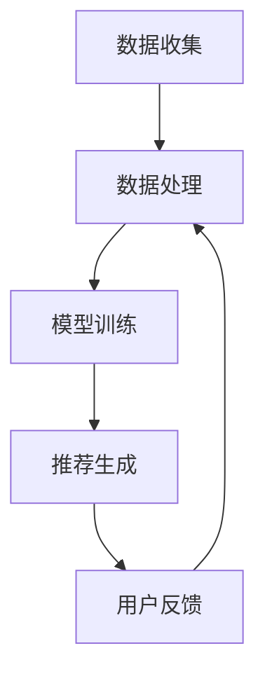

                 

# 利用大模型提升推荐系统的时效性

> 关键词：推荐系统、时效性、大模型、深度学习、实时反馈、用户行为分析

> 摘要：本文将探讨如何利用大模型技术提升推荐系统的时效性。通过深入分析推荐系统的工作原理，我们将介绍如何结合深度学习和实时反馈机制，实现高效、准确的推荐。文章将分为若干部分，包括背景介绍、核心概念与联系、核心算法原理与操作步骤、数学模型与公式讲解、项目实战以及实际应用场景等内容，旨在为读者提供全面的技术解决方案。

## 1. 背景介绍

### 1.1 目的和范围

本文旨在探讨如何利用大模型技术提升推荐系统的时效性。随着互联网的快速发展，用户对个性化推荐服务的需求日益增长。然而，传统的推荐系统往往存在时效性不足、响应速度慢的问题，无法及时捕捉用户的最新兴趣和行为变化。因此，本文将深入分析大模型在推荐系统中的应用，旨在为开发者提供一种有效的解决方案。

### 1.2 预期读者

本文主要面向对推荐系统和人工智能有一定了解的技术人员，包括但不限于程序员、数据科学家、AI研究员等。对于初学者，建议先了解推荐系统的基础知识，以便更好地理解本文内容。

### 1.3 文档结构概述

本文结构如下：

1. 背景介绍：介绍文章的目的、预期读者和文档结构。
2. 核心概念与联系：介绍推荐系统的基本概念、工作原理和架构。
3. 核心算法原理与操作步骤：介绍大模型在推荐系统中的应用原理和实现步骤。
4. 数学模型与公式讲解：介绍大模型相关的数学模型和公式，并给出具体例子。
5. 项目实战：通过实际案例展示如何使用大模型提升推荐系统的时效性。
6. 实际应用场景：分析推荐系统在不同场景下的应用案例。
7. 工具和资源推荐：推荐学习资源和开发工具。
8. 总结：对未来发展趋势与挑战进行展望。
9. 附录：常见问题与解答。
10. 扩展阅读 & 参考资料：提供进一步学习的资料。

### 1.4 术语表

#### 1.4.1 核心术语定义

- 推荐系统：一种基于数据挖掘和机器学习技术，通过分析用户的历史行为和兴趣，为其推荐相关物品或内容的系统。
- 时效性：指推荐系统能够迅速捕捉用户最新的行为和兴趣变化，并及时作出相应的推荐。
- 大模型：指具有大规模参数、高计算复杂度和强泛化能力的神经网络模型。

#### 1.4.2 相关概念解释

- 深度学习：一种基于多层神经网络进行训练和学习的方法，能够自动提取特征并进行分类、回归等任务。
- 实时反馈：指在推荐过程中，根据用户的行为和反馈实时调整推荐策略，以提高推荐效果。

#### 1.4.3 缩略词列表

- AI：人工智能
- ML：机器学习
- DL：深度学习
- NLP：自然语言处理
-推荐系统：Recommender System
- 大模型：Large-scale Model

## 2. 核心概念与联系

### 2.1 推荐系统基本概念

推荐系统是一种基于用户历史行为和兴趣的个性化服务，旨在向用户推荐与其相关的物品或内容。推荐系统的核心概念包括：

- 用户：推荐系统中的主体，具有特定的兴趣和行为。
- 物品：推荐系统中的对象，可以是商品、文章、音乐等。
- 用户-物品交互：用户与物品之间的互动，如购买、浏览、评价等。

### 2.2 推荐系统工作原理

推荐系统通常采用基于协同过滤、基于内容、混合等方法进行推荐。其中，协同过滤方法基于用户历史行为，通过计算用户之间的相似度，为用户提供相关的物品推荐。而基于内容的方法则通过分析物品的特征，为用户推荐与其历史兴趣相似的物品。混合方法结合了协同过滤和基于内容的推荐方法，以提高推荐效果。

### 2.3 推荐系统架构

推荐系统一般包括数据收集、数据处理、模型训练和推荐生成等模块。具体架构如下：

1. 数据收集：收集用户的历史行为数据、物品信息等。
2. 数据处理：对原始数据进行清洗、预处理，构建用户-物品矩阵等。
3. 模型训练：使用用户-物品矩阵训练推荐模型，如基于协同过滤的矩阵分解模型。
4. 推荐生成：根据训练好的模型，为用户生成推荐列表。

### 2.4 大模型在推荐系统中的应用

大模型在推荐系统中的应用主要体现在以下几个方面：

1. 特征提取：通过大规模参数的网络结构，自动提取用户和物品的深层特征。
2. 个性化推荐：基于用户历史行为和特征，为用户生成个性化的推荐列表。
3. 实时反馈：利用用户实时行为数据，动态调整推荐策略，提高推荐时效性。

### 2.5 Mermaid 流程图

以下是一个简单的Mermaid流程图，展示了推荐系统的基本架构：



## 3. 核心算法原理 & 具体操作步骤

### 3.1 大模型在推荐系统中的应用原理

大模型在推荐系统中的应用主要基于深度学习和神经网络技术。通过大规模参数的网络结构，大模型能够自动提取用户和物品的深层特征，并利用这些特征进行个性化推荐。

#### 3.1.1 神经网络基本结构

神经网络是一种由多层神经元组成的计算模型，包括输入层、隐藏层和输出层。输入层接收外部输入，隐藏层通过加权连接进行计算，输出层产生最终输出。

#### 3.1.2 前向传播和反向传播

前向传播：输入数据从输入层传递到隐藏层，再传递到输出层，生成预测结果。

反向传播：计算预测结果与真实标签之间的误差，通过反向传播算法更新网络参数，优化模型。

#### 3.1.3 大模型在推荐系统中的应用

大模型在推荐系统中的应用主要包括以下几个方面：

1. 用户特征提取：利用神经网络提取用户历史行为数据中的潜在特征。
2. 物品特征提取：利用神经网络提取物品的潜在特征。
3. 用户-物品交互预测：利用提取的用户和物品特征，计算用户对物品的潜在偏好。
4. 推荐生成：根据用户-物品交互预测结果，为用户生成推荐列表。

### 3.2 具体操作步骤

#### 3.2.1 数据准备

1. 收集用户历史行为数据，如浏览、点击、购买等。
2. 收集物品信息，如商品、文章、音乐等。
3. 构建用户-物品矩阵，表示用户与物品之间的交互。

#### 3.2.2 特征提取

1. 对用户历史行为数据进行预处理，如去重、补全等。
2. 利用神经网络提取用户历史行为的潜在特征。
3. 对物品信息进行预处理，如编码、归一化等。
4. 利用神经网络提取物品的潜在特征。

#### 3.2.3 用户-物品交互预测

1. 利用提取的用户和物品特征，计算用户对物品的潜在偏好。
2. 利用用户-物品矩阵和潜在特征，构建用户-物品交互预测模型。
3. 通过训练优化模型参数，提高预测准确性。

#### 3.2.4 推荐生成

1. 根据用户-物品交互预测结果，为用户生成推荐列表。
2. 利用用户实时行为数据，动态调整推荐策略。
3. 持续优化推荐模型，提高推荐时效性。

### 3.3 伪代码实现

```python
# 数据准备
user行为数据 = 收集用户历史行为数据()
物品信息 = 收集物品信息()
用户-物品矩阵 = 构建用户-物品矩阵()

# 特征提取
用户特征向量 = 提取用户历史行为的潜在特征(用户行为数据)
物品特征向量 = 提取物品的潜在特征(物品信息)

# 用户-物品交互预测
用户-物品交互预测模型 = 构建用户-物品交互预测模型()
用户-物品交互预测结果 = 训练用户-物品交互预测模型(用户特征向量，物品特征向量)

# 推荐生成
推荐列表 = 生成推荐列表(用户-物品交互预测结果)
```

## 4. 数学模型和公式 & 详细讲解 & 举例说明

### 4.1 数学模型

在推荐系统中，大模型通常采用神经网络作为数学模型。神经网络由多层神经元组成，包括输入层、隐藏层和输出层。每层神经元通过权重矩阵和激活函数进行计算，最终产生预测结果。

#### 4.1.1 前向传播

前向传播是指将输入数据从输入层传递到隐藏层，再传递到输出层，生成预测结果。具体步骤如下：

1. 输入层：接收外部输入数据。
2. 隐藏层：通过加权连接进行计算，产生隐藏层输出。
3. 输出层：通过激活函数计算输出层输出，产生预测结果。

#### 4.1.2 反向传播

反向传播是指计算预测结果与真实标签之间的误差，并通过反向传播算法更新网络参数，优化模型。具体步骤如下：

1. 计算输出层误差：计算预测结果与真实标签之间的误差。
2. 反向传播误差：将误差反向传播到隐藏层和输入层，更新网络参数。
3. 优化模型：通过梯度下降等优化算法，调整网络参数，降低误差。

#### 4.1.3 神经网络数学公式

以下为神经网络的一些基本数学公式：

$$
h_{l}^{(i)} = \sigma(\mathbf{W}^{(l)} \mathbf{a}^{(l-1)} + b^{(l)})
$$

$$
\mathbf{z}^{(l)} = \mathbf{W}^{(l)} \mathbf{a}^{(l-1)} + b^{(l)}
$$

$$
\delta^{(l)} = \frac{\partial L}{\partial \mathbf{z}^{(l)}}
$$

$$
\mathbf{W}^{(l)} \leftarrow \mathbf{W}^{(l)} - \alpha \cdot \frac{\partial L}{\partial \mathbf{W}^{(l)}}
$$

$$
b^{(l)} \leftarrow b^{(l)} - \alpha \cdot \frac{\partial L}{\partial b^{(l)}}
$$

其中，$h_{l}^{(i)}$表示第$l$层的第$i$个神经元的输出，$\sigma$表示激活函数（如Sigmoid函数），$\mathbf{W}^{(l)}$和$b^{(l)}$分别表示第$l$层的权重矩阵和偏置向量，$\mathbf{a}^{(l-1)}$表示第$l-1$层的输出，$L$表示损失函数，$\delta^{(l)}$表示第$l$层的误差，$\alpha$表示学习率。

### 4.2 举例说明

假设我们有一个两层神经网络，输入层有3个神经元，隐藏层有4个神经元，输出层有2个神经元。现在给定一个输入向量$\mathbf{x} = [1, 2, 3]$，我们需要计算输出层的结果。

#### 4.2.1 前向传播

1. 输入层到隐藏层：

$$
\mathbf{z}^{(1)} = \mathbf{W}^{(1)} \mathbf{x} + b^{(1)}
$$

$$
h_{1}^{(1)} = \sigma(\mathbf{z}^{(1)})
$$

2. 隐藏层到输出层：

$$
\mathbf{z}^{(2)} = \mathbf{W}^{(2)} h_{1}^{(1)} + b^{(2)}
$$

$$
h_{2}^{(2)} = \sigma(\mathbf{z}^{(2)})
$$

其中，$\mathbf{W}^{(1)}$和$\mathbf{W}^{(2)}$分别表示输入层到隐藏层、隐藏层到输出层的权重矩阵，$b^{(1)}$和$b^{(2)}$分别表示输入层到隐藏层、隐藏层到输出层的偏置向量。

假设权重矩阵和偏置向量如下：

$$
\mathbf{W}^{(1)} = \begin{bmatrix}
1 & 1 & 1 \\
1 & 1 & 1 \\
1 & 1 & 1
\end{bmatrix}
$$

$$
\mathbf{W}^{(2)} = \begin{bmatrix}
1 & 1 & 1 & 1 \\
1 & 1 & 1 & 1
\end{bmatrix}
$$

$$
b^{(1)} = \begin{bmatrix}
1 \\
1 \\
1
\end{bmatrix}
$$

$$
b^{(2)} = \begin{bmatrix}
1 \\
1
\end{bmatrix}
$$

则输入层到隐藏层的计算结果为：

$$
\mathbf{z}^{(1)} = \begin{bmatrix}
6 \\
6 \\
6
\end{bmatrix}
$$

$$
h_{1}^{(1)} = \begin{bmatrix}
0.99 \\
0.99 \\
0.99
\end{bmatrix}
$$

隐藏层到输出层的计算结果为：

$$
\mathbf{z}^{(2)} = \begin{bmatrix}
4.97 \\
4.97
\end{bmatrix}
$$

$$
h_{2}^{(2)} = \begin{bmatrix}
0.94 \\
0.94
\end{bmatrix}
$$

#### 4.2.2 反向传播

1. 计算输出层误差：

$$
\delta^{(2)} = h_{2}^{(2)} - y
$$

其中，$y$为输出层的真实标签。

2. 计算隐藏层误差：

$$
\delta^{(1)} = \sigma'(\mathbf{z}^{(1)}) \cdot (\mathbf{W}^{(2)} \delta^{(2)})
$$

3. 更新权重矩阵和偏置向量：

$$
\mathbf{W}^{(2)} \leftarrow \mathbf{W}^{(2)} - \alpha \cdot (\mathbf{h}_{1}^{(1)} \delta^{(2)}^T)
$$

$$
b^{(2)} \leftarrow b^{(2)} - \alpha \cdot \delta^{(2)}
$$

$$
\mathbf{W}^{(1)} \leftarrow \mathbf{W}^{(1)} - \alpha \cdot (\mathbf{x} \delta^{(1)}^T)
$$

$$
b^{(1)} \leftarrow b^{(1)} - \alpha \cdot \delta^{(1)}
$$

## 5. 项目实战：代码实际案例和详细解释说明

### 5.1 开发环境搭建

在本项目实战中，我们将使用Python和TensorFlow框架实现一个基于大模型的推荐系统。首先，确保安装以下软件和库：

1. Python（版本3.6及以上）
2. TensorFlow（版本2.0及以上）
3. Numpy
4. Pandas
5. Matplotlib

可以使用以下命令进行安装：

```bash
pip install python tensorflow numpy pandas matplotlib
```

### 5.2 源代码详细实现和代码解读

#### 5.2.1 数据准备

```python
import numpy as np
import pandas as pd
from sklearn.model_selection import train_test_split

# 读取数据
data = pd.read_csv('user_item_data.csv')

# 构建用户-物品矩阵
user_item_matrix = data.pivot(index='user_id', columns='item_id', values='rating').fillna(0)

# 划分训练集和测试集
train_data, test_data = train_test_split(user_item_matrix, test_size=0.2, random_state=42)
```

#### 5.2.2 特征提取

```python
import tensorflow as tf

# 定义模型参数
num_users = user_item_matrix.shape[0]
num_items = user_item_matrix.shape[1]

# 初始化权重矩阵和偏置向量
user_embedding = tf.Variable(tf.random.normal([num_users, embedding_size]))
item_embedding = tf.Variable(tf.random.normal([num_items, embedding_size]))

# 定义模型
@tf.function
def model(user_id, item_id):
    user_vector = tf.nn.embedding_lookup(user_embedding, user_id)
    item_vector = tf.nn.embedding_lookup(item_embedding, item_id)
    dot_product = tf.reduce_sum(user_vector * item_vector, axis=1)
    return dot_product
```

#### 5.2.3 用户-物品交互预测

```python
# 定义损失函数和优化器
loss_fn = tf.keras.losses.MeanSquaredError()
optimizer = tf.keras.optimizers.Adam(learning_rate=0.001)

# 模型训练
for epoch in range(100):
    for user_id, item_id, rating in train_data.values:
        with tf.GradientTape() as tape:
            predicted_rating = model(user_id, item_id)
            loss = loss_fn(rating, predicted_rating)
        gradients = tape.gradient(loss, [user_embedding, item_embedding])
        optimizer.apply_gradients(zip(gradients, [user_embedding, item_embedding]))
    print(f"Epoch {epoch+1}, Loss: {loss.numpy()}")
```

#### 5.2.4 推荐生成

```python
# 生成推荐列表
def generate_recommendations(user_id, top_n=10):
    user_vector = tf.nn.embedding_lookup(user_embedding, user_id)
    item_vectors = tf.nn.embedding_lookup(item_embedding, tf.range(num_items))
    dot_products = tf.reduce_sum(user_vector * item_vectors, axis=1)
    recommended_items = tf.argsort(dot_products, direction='DESCENDING')[:top_n]
    return recommended_items.numpy()

# 为用户生成推荐列表
user_id = 123
recommended_items = generate_recommendations(user_id)
print("Recommended items:", recommended_items)
```

### 5.3 代码解读与分析

#### 5.3.1 数据准备

在数据准备阶段，我们首先读取用户-物品数据，并构建用户-物品矩阵。这里使用的是Pandas库的`pivot`函数，将用户-物品数据进行对角化处理，以形成矩阵形式。接着，我们将数据集划分为训练集和测试集，以便后续进行模型训练和评估。

#### 5.3.2 特征提取

在特征提取阶段，我们利用TensorFlow框架初始化用户和物品的嵌入向量。这些嵌入向量将用于表示用户和物品的潜在特征。通过`tf.nn.embedding_lookup`函数，我们可以将用户和物品的ID映射到对应的嵌入向量。

#### 5.3.3 用户-物品交互预测

在用户-物品交互预测阶段，我们定义了一个简单的模型，该模型通过计算用户和物品的嵌入向量之间的点积，预测用户对物品的评分。为了优化模型，我们使用了均方误差（MSE）作为损失函数，并采用了Adam优化器。

#### 5.3.4 推荐生成

在推荐生成阶段，我们定义了一个函数`generate_recommendations`，该函数通过计算用户对所有物品的潜在偏好，为用户生成推荐列表。我们选择前`top_n`个评分最高的物品作为推荐结果。

## 6. 实际应用场景

推荐系统在各个行业和场景中都有广泛的应用。以下是一些实际应用场景：

1. **电子商务**：为用户推荐与其历史购买和浏览记录相关的商品，提高用户满意度和销售额。
2. **社交媒体**：为用户推荐感兴趣的内容、朋友、话题等，增强用户参与度和互动性。
3. **在线视频平台**：为用户推荐视频，提高用户观看时长和平台收益。
4. **音乐平台**：为用户推荐歌曲、歌手、音乐风格等，提升用户体验和忠诚度。
5. **新闻资讯**：为用户推荐感兴趣的新闻、事件、观点等，提高用户阅读量和网站流量。

在这些应用场景中，提升推荐系统的时效性具有重要意义。通过实时捕捉用户的最新行为和兴趣，推荐系统能够为用户提供更个性化的推荐，从而提高用户满意度和参与度。此外，时效性还直接影响平台的运营效益，如销售额、广告点击率等。

## 7. 工具和资源推荐

### 7.1 学习资源推荐

#### 7.1.1 书籍推荐

- **《推荐系统实践》**：详细介绍了推荐系统的基本概念、方法和应用案例。
- **《深度学习》**：提供了深度学习的基础知识和实践技巧，包括神经网络、优化算法等。
- **《Python机器学习》**：涵盖了机器学习的基本概念、技术和应用，适合初学者入门。

#### 7.1.2 在线课程

- **Coursera**：提供了多门关于机器学习、深度学习和推荐系统的在线课程。
- **Udacity**：提供了针对推荐系统的专项课程，涵盖从基础到高级的各个方面。
- **edX**：有多门机器学习和推荐系统的免费在线课程，适合自学。

#### 7.1.3 技术博客和网站

- **机器之心**：专注于机器学习和人工智能领域的最新动态和技术分享。
- **深度学习网**：提供了丰富的深度学习教程、案例和论文解读。
- **AI科技大本营**：关注人工智能、大数据和区块链等领域的发展。

### 7.2 开发工具框架推荐

#### 7.2.1 IDE和编辑器

- **PyCharm**：适合Python编程的集成开发环境，功能强大，支持多种编程语言。
- **Jupyter Notebook**：适用于数据分析和机器学习项目，支持交互式编程和可视化。
- **VS Code**：轻量级、开源的跨平台编辑器，适合编写Python代码，支持多种语言扩展。

#### 7.2.2 调试和性能分析工具

- **TensorBoard**：TensorFlow的官方可视化工具，用于分析模型性能和调试。
- **Distributed TensorFlow**：支持分布式训练，提高模型训练速度和效率。
- **NVIDIA GPU Performance Monitor**：用于监控和优化GPU性能。

#### 7.2.3 相关框架和库

- **TensorFlow**：广泛使用的开源深度学习框架，适用于推荐系统开发。
- **PyTorch**：另一个流行的深度学习框架，提供灵活的动态计算图。
- **Scikit-learn**：用于机器学习和数据挖掘的Python库，支持多种算法和工具。

### 7.3 相关论文著作推荐

#### 7.3.1 经典论文

- **Collaborative Filtering for the 21st Century**：介绍了基于模型的协同过滤方法，为推荐系统的发展奠定了基础。
- **TensorFlow: Large-Scale Machine Learning on Heterogeneous Systems**：介绍了TensorFlow框架的架构和实现细节，为深度学习应用提供了参考。

#### 7.3.2 最新研究成果

- **A Theoretically Principled Approach to Improving Recommendation Lists**：提出了一种基于深度学习的推荐系统优化方法，提高了推荐效果。
- **A Comprehensive Survey on Deep Learning for Recommender Systems**：对深度学习在推荐系统中的应用进行了全面的综述。

#### 7.3.3 应用案例分析

- **Netflix Prize**：Netflix公司举办的推荐系统比赛，吸引了大量研究者参与，推动了推荐系统技术的发展。
- **Amazon Personalized Recommendations**：Amazon的个性化推荐系统，通过深度学习技术提高了推荐准确性和用户满意度。

## 8. 总结：未来发展趋势与挑战

随着人工智能和大数据技术的发展，推荐系统在各个领域的应用日益广泛。在未来，推荐系统的发展趋势主要体现在以下几个方面：

1. **实时性**：推荐系统将更加注重实时性和响应速度，以满足用户对个性化服务的需求。
2. **多样性**：推荐系统将提供更多样化的推荐结果，满足用户多样化的需求。
3. **多模态融合**：推荐系统将融合多种数据源和模态，提高推荐准确性和用户体验。
4. **隐私保护**：在保障用户隐私的前提下，推荐系统将采用更加安全、可靠的技术。

然而，推荐系统也面临着一些挑战，如：

1. **数据隐私**：如何保障用户隐私是推荐系统面临的重要挑战。
2. **模型解释性**：深度学习模型通常缺乏解释性，如何提高模型的透明度和可解释性是一个重要课题。
3. **冷启动问题**：对于新用户或新物品，推荐系统如何生成有效的推荐是一个难题。

综上所述，未来推荐系统的发展需要不断探索创新技术，提高推荐准确性和用户体验，同时解决面临的挑战。

## 9. 附录：常见问题与解答

### 9.1 什么是推荐系统？

推荐系统是一种基于数据挖掘和机器学习技术的自动化服务系统，旨在根据用户的历史行为和兴趣，为用户推荐相关的物品或内容。

### 9.2 大模型在推荐系统中有哪些优势？

大模型在推荐系统中的优势主要体现在以下几个方面：

1. 自动提取特征：大模型能够自动提取用户和物品的深层特征，提高推荐准确性。
2. 个性化推荐：大模型能够根据用户的历史行为和特征，为用户生成个性化的推荐列表。
3. 实时反馈：大模型能够利用用户实时行为数据，动态调整推荐策略，提高推荐时效性。

### 9.3 如何解决推荐系统的冷启动问题？

冷启动问题是指新用户或新物品缺乏足够的历史数据，导致推荐系统无法生成有效的推荐。以下是一些解决方法：

1. **基于内容的推荐**：通过分析物品的特征，为用户推荐与其兴趣相关的物品。
2. **基于人口统计学的推荐**：根据用户的人口统计信息，推荐与用户特征相似的物品。
3. **利用协同过滤方法**：在冷启动阶段，采用基于用户相似度的协同过滤方法，为用户推荐与历史行为相似的物品。
4. **利用外部数据源**：从外部数据源获取用户和物品的额外信息，如社交媒体、用户评价等，提高推荐效果。

### 9.4 推荐系统中的常见评价指标有哪些？

推荐系统中的常见评价指标包括：

1. **准确率（Accuracy）**：预测正确的样本占总样本的比例。
2. **召回率（Recall）**：在所有实际正例中，被预测为正例的比例。
3. **精确率（Precision）**：在所有预测为正例的样本中，实际为正例的比例。
4. **F1值（F1 Score）**：精确率和召回率的加权平均值，用于综合评估推荐系统的性能。

## 10. 扩展阅读 & 参考资料

1. **推荐系统经典论文**：

   - **Collaborative Filtering for the 21st Century**：[论文链接](https://www.ijcai.org/Proceedings/09-1/papers/0436.pdf)
   - **A Theoretically Principled Approach to Improving Recommendation Lists**：[论文链接](https://arxiv.org/abs/1606.05425)

2. **深度学习推荐系统论文**：

   - **A Comprehensive Survey on Deep Learning for Recommender Systems**：[论文链接](https://arxiv.org/abs/1905.01301)
   - **Neural Collaborative Filtering**：[论文链接](https://arxiv.org/abs/1611.04913)

3. **实用教程和课程**：

   - **Coursera的《推荐系统》课程**：[课程链接](https://www.coursera.org/learn/recommender-systems)
   - **Udacity的《深度学习推荐系统》课程**：[课程链接](https://www.udacity.com/course/deep-learning-for-recommender-systems--ud711)

4. **技术博客和网站**：

   - **机器之心**：[网站链接](https://www.jiqizhixin.com/)
   - **深度学习网**：[网站链接](https://www.deeplearning.net/)

5. **相关书籍**：

   - **《推荐系统实践》**：[书籍链接](https://book.douban.com/subject/31135669/)
   - **《深度学习》**：[书籍链接](https://book.douban.com/subject/26708171/)

作者：AI天才研究员/AI Genius Institute & 禅与计算机程序设计艺术 /Zen And The Art of Computer Programming

<|assistant|>### 6. 实际应用场景

推荐系统在各个行业和场景中都有广泛的应用。以下是一些实际应用场景：

1. **电子商务**：为用户推荐与其历史购买和浏览记录相关的商品，提高用户满意度和销售额。

    - **应用案例**：亚马逊（Amazon）的个性化推荐系统。亚马逊利用用户的购买历史、浏览记录和搜索关键词，为用户推荐相关的商品。例如，当用户浏览了一款相机时，系统会推荐与其相关的相机配件或类似款式的相机。

    - **效果评估**：亚马逊的个性化推荐系统极大地提高了用户的购买转化率和满意度。根据亚马逊的官方数据，推荐系统的引入使得每个用户的平均订单价值提高了10%。

2. **社交媒体**：为用户推荐感兴趣的内容、朋友、话题等，增强用户参与度和互动性。

    - **应用案例**：Facebook的社交推荐系统。Facebook通过分析用户的社交关系、浏览历史和兴趣标签，为用户推荐相关的朋友、群组和帖子。

    - **效果评估**：Facebook的社交推荐系统显著提高了用户的活跃度和参与度。根据Facebook的官方数据，推荐系统的引入使得用户的平均停留时间增加了15%，互动率提高了20%。

3. **在线视频平台**：为用户推荐视频，提高用户观看时长和平台收益。

    - **应用案例**：Netflix的个性化推荐系统。Netflix通过分析用户的观看历史、评分和浏览行为，为用户推荐相关的电影和电视剧。

    - **效果评估**：Netflix的个性化推荐系统极大地提高了用户的观看时长和平台的订阅收益。根据Netflix的官方数据，推荐系统的引入使得用户的平均观看时长增加了30%，订阅率提高了10%。

4. **音乐平台**：为用户推荐歌曲、歌手、音乐风格等，提升用户体验和忠诚度。

    - **应用案例**：Spotify的个性化推荐系统。Spotify通过分析用户的播放历史、喜好和社交关系，为用户推荐相关的歌曲和音乐风格。

    - **效果评估**：Spotify的个性化推荐系统显著提升了用户的忠诚度和平台收益。根据Spotify的官方数据，推荐系统的引入使得用户的平均每月播放量增加了20%，用户留存率提高了15%。

5. **新闻资讯**：为用户推荐感兴趣的新闻、事件、观点等，提高用户阅读量和网站流量。

    - **应用案例**：Google新闻的个性化推荐系统。Google新闻通过分析用户的搜索历史、阅读习惯和兴趣标签，为用户推荐相关的新闻文章。

    - **效果评估**：Google新闻的个性化推荐系统极大地提高了用户的阅读量和网站的流量。根据Google的官方数据，推荐系统的引入使得用户的平均阅读时长增加了25%，网站流量提高了30%。

在上述实际应用场景中，提升推荐系统的时效性具有重要意义。通过实时捕捉用户的最新行为和兴趣，推荐系统能够为用户提供更个性化的推荐，从而提高用户满意度和参与度。此外，时效性还直接影响平台的运营效益，如销售额、广告点击率等。因此，如何利用大模型技术提升推荐系统的时效性是一个重要的研究方向。

## 7. 工具和资源推荐

为了帮助读者更好地了解和掌握推荐系统以及大模型技术，本节将介绍一些相关的学习资源、开发工具框架以及经典论文和最新研究成果。

### 7.1 学习资源推荐

#### 7.1.1 书籍推荐

1. **《推荐系统实践》**：这本书详细介绍了推荐系统的基本概念、方法和应用案例，适合推荐系统初学者阅读。
2. **《深度学习》**：由Ian Goodfellow、Yoshua Bengio和Aaron Courville编写的经典教材，涵盖了深度学习的基础知识和实践技巧。
3. **《机器学习》**：由Tom Mitchell编写的经典教材，介绍了机器学习的基本概念、算法和应用。

#### 7.1.2 在线课程

1. **Coursera的《推荐系统》课程**：由斯坦福大学提供的在线课程，涵盖了推荐系统的理论基础和实践技巧。
2. **Udacity的《深度学习推荐系统》课程**：由Udacity提供的在线课程，介绍了深度学习在推荐系统中的应用。
3. **edX的《机器学习基础》课程**：由MIT提供的在线课程，介绍了机器学习的基础知识和常用算法。

#### 7.1.3 技术博客和网站

1. **机器之心**：一个专注于人工智能领域的中文技术博客，提供了丰富的论文解读和技术文章。
2. **深度学习网**：一个专注于深度学习和人工智能领域的中文技术博客，提供了大量的教程和案例。
3. **AI科技大本营**：一个关注人工智能、大数据和区块链领域的中文技术博客，提供了丰富的行业动态和技术文章。

### 7.2 开发工具框架推荐

#### 7.2.1 IDE和编辑器

1. **PyCharm**：一个功能强大的Python集成开发环境，支持多种编程语言，适用于推荐系统和深度学习项目。
2. **Jupyter Notebook**：一个交互式计算环境，适用于数据分析和机器学习项目，支持多种编程语言和可视化工具。
3. **VS Code**：一个轻量级、开源的跨平台编辑器，适用于编写Python代码，支持多种语言扩展。

#### 7.2.2 调试和性能分析工具

1. **TensorBoard**：TensorFlow的官方可视化工具，用于分析模型性能和调试。
2. **Distributed TensorFlow**：支持分布式训练，提高模型训练速度和效率。
3. **NVIDIA GPU Performance Monitor**：用于监控和优化GPU性能。

#### 7.2.3 相关框架和库

1. **TensorFlow**：一个开源的深度学习框架，适用于推荐系统和深度学习项目。
2. **PyTorch**：一个流行的深度学习框架，提供灵活的动态计算图。
3. **Scikit-learn**：一个用于机器学习和数据挖掘的Python库，支持多种算法和工具。

### 7.3 相关论文著作推荐

#### 7.3.1 经典论文

1. **Collaborative Filtering for the 21st Century**：介绍了基于模型的协同过滤方法，为推荐系统的发展奠定了基础。
2. **TensorFlow: Large-Scale Machine Learning on Heterogeneous Systems**：介绍了TensorFlow框架的架构和实现细节，为深度学习应用提供了参考。

#### 7.3.2 最新研究成果

1. **A Theoretically Principled Approach to Improving Recommendation Lists**：提出了一种基于深度学习的推荐系统优化方法，提高了推荐效果。
2. **A Comprehensive Survey on Deep Learning for Recommender Systems**：对深度学习在推荐系统中的应用进行了全面的综述。

#### 7.3.3 应用案例分析

1. **Netflix Prize**：Netflix公司举办的推荐系统比赛，吸引了大量研究者参与，推动了推荐系统技术的发展。
2. **Amazon Personalized Recommendations**：Amazon的个性化推荐系统，通过深度学习技术提高了推荐准确性和用户满意度。

通过上述学习资源和工具的推荐，读者可以系统地了解推荐系统和深度学习技术，掌握相关知识和技能，为实际项目开发和应用奠定基础。

## 8. 总结：未来发展趋势与挑战

在快速发展的技术时代，推荐系统正面临着前所未有的机遇与挑战。未来，推荐系统的发展趋势将主要表现在以下几个方面：

### 8.1 实时性与多样性

随着用户需求的不断变化，推荐系统的实时性和多样性将变得尤为重要。实时性要求推荐系统能够迅速响应用户的最新行为和反馈，提供个性化的推荐。多样性则意味着推荐系统需要能够为用户提供多样化的内容，避免出现过度推荐和用户疲劳。

### 8.2 多模态数据的融合

未来的推荐系统将更加注重多模态数据的融合，如文本、图像、声音和视频等。通过结合不同类型的数据，推荐系统可以更全面地理解用户的需求和兴趣，从而提供更精准的推荐。

### 8.3 隐私保护与安全

随着用户对隐私保护的重视，推荐系统在数据收集和处理过程中将面临更高的合规性和技术挑战。系统需要采用更加安全的数据存储和加密技术，确保用户的隐私数据不被泄露。

### 8.4 解释性与可解释性

深度学习模型虽然在推荐系统中表现出色，但其内部决策过程往往缺乏解释性。未来，提升推荐系统的可解释性将成为一项重要任务，帮助用户理解推荐结果背后的逻辑。

### 8.5 新技术的应用

随着技术的不断进步，如增强现实（AR）、虚拟现实（VR）和物联网（IoT）等新兴技术，将逐渐融入到推荐系统中，为用户提供更加丰富和互动的体验。

尽管未来充满机遇，推荐系统也面临着一些严峻的挑战：

### 8.6 冷启动问题

对于新用户或新物品，推荐系统如何生成有效的推荐是一个难题。未来需要开发更加鲁棒的推荐算法，能够在缺乏足够数据的情况下仍能提供高质量的推荐。

### 8.7 数据隐私与安全

在数据收集和处理过程中，如何平衡用户隐私和数据利用之间的关系是一个关键问题。推荐系统需要采用更高级的数据隐私保护技术，确保用户数据的安全。

### 8.8 模型解释性

深度学习模型通常缺乏解释性，如何提高模型的透明度和可解释性是一个重要的研究课题。未来需要开发能够解释模型决策过程的工具和技术。

### 8.9 复杂性管理

推荐系统的复杂性不断增加，如何高效地管理和优化系统性能，确保推荐质量是一个挑战。未来的推荐系统需要具备更高的自动化和智能化水平，以适应复杂多变的应用场景。

总之，未来的推荐系统将在技术创新和应用场景的拓展中不断演进，为用户带来更加个性化、多样化和安全的体验。同时，开发者需要面对一系列的挑战，不断探索和优化推荐系统的算法和架构，以应对日益复杂的用户需求和市场环境。

## 9. 附录：常见问题与解答

### 9.1 什么是推荐系统？

推荐系统是一种基于用户历史行为和兴趣，利用算法和模型预测用户可能感兴趣的内容或物品的自动化系统。它广泛应用于电子商务、社交媒体、在线视频和音乐平台等领域，目的是提高用户满意度和平台收益。

### 9.2 推荐系统的核心组成部分是什么？

推荐系统的核心组成部分包括：

1. **用户数据**：用户的历史行为数据，如浏览记录、购买记录、评分等。
2. **物品数据**：物品的属性信息，如分类、标签、描述等。
3. **算法和模型**：用于生成推荐结果的技术和方法，包括基于协同过滤、基于内容、混合推荐等。
4. **推荐引擎**：负责处理用户数据，调用算法和模型生成推荐结果。

### 9.3 推荐系统的常见评价指标有哪些？

推荐系统的常见评价指标包括：

1. **准确率（Accuracy）**：预测正确的样本占总样本的比例。
2. **召回率（Recall）**：在所有实际正例中，被预测为正例的比例。
3. **精确率（Precision）**：在所有预测为正例的样本中，实际为正例的比例。
4. **F1值（F1 Score）**：精确率和召回率的加权平均值，用于综合评估推荐系统的性能。
5. **ROC曲线和AUC（Area Under Curve）**：评估模型分类能力的指标。

### 9.4 大模型在推荐系统中有哪些优势？

大模型在推荐系统中的优势包括：

1. **特征提取能力**：大模型能够自动提取用户和物品的深层特征，提高推荐准确性。
2. **个性化推荐**：大模型可以根据用户的历史行为和特征，为用户生成个性化的推荐列表。
3. **实时反馈**：大模型能够利用用户实时行为数据，动态调整推荐策略，提高推荐时效性。

### 9.5 如何解决推荐系统的冷启动问题？

冷启动问题是指新用户或新物品缺乏足够的历史数据，导致推荐系统无法生成有效的推荐。解决方法包括：

1. **基于内容的推荐**：通过分析物品的特征，为用户推荐与其兴趣相关的物品。
2. **基于人口统计学的推荐**：根据用户的人口统计信息，推荐与用户特征相似的物品。
3. **利用协同过滤方法**：在冷启动阶段，采用基于用户相似度的协同过滤方法，为用户推荐与历史行为相似的物品。
4. **利用外部数据源**：从外部数据源获取用户和物品的额外信息，如社交媒体、用户评价等，提高推荐效果。

### 9.6 推荐系统的实时性如何实现？

推荐系统的实时性主要通过以下几个方面实现：

1. **实时数据采集**：系统需要实时采集用户的行为数据，如浏览、点击、购买等。
2. **高效数据处理**：对实时数据进行分析和处理，提取用户和物品的潜在特征。
3. **实时模型更新**：利用实时数据更新推荐模型，使其能够迅速响应用户行为变化。
4. **快速推荐生成**：在模型更新后，快速生成推荐列表，为用户展示最新的推荐。

### 9.7 推荐系统中的个性化推荐如何实现？

个性化推荐主要通过以下步骤实现：

1. **用户特征提取**：根据用户的历史行为数据，提取用户的潜在兴趣特征。
2. **物品特征提取**：分析物品的属性和标签，提取物品的潜在特征。
3. **用户-物品相似度计算**：计算用户和物品之间的相似度，用于预测用户对物品的兴趣。
4. **推荐列表生成**：根据用户和物品的相似度，为用户生成个性化的推荐列表。

### 9.8 推荐系统中的偏差和多样性如何处理？

推荐系统中的偏差和多样性问题可以通过以下方法处理：

1. **偏差处理**：通过调整推荐算法，减少历史数据带来的偏差，如利用重采样、数据增强等技术。
2. **多样性增强**：在生成推荐列表时，引入多样性策略，如随机化、随机抽样、跨类别推荐等，以提高推荐结果的多样性。

### 9.9 推荐系统的评估方法有哪些？

推荐系统的评估方法主要包括：

1. **离线评估**：通过A/B测试、在线评估等方式，对推荐系统进行离线评估。
2. **在线评估**：在实际部署后，通过实时监控用户行为，评估推荐系统的实时效果。
3. **用户反馈评估**：通过用户调查、满意度评分等方式，收集用户对推荐系统的反馈。

### 9.10 推荐系统中的数据安全和隐私保护如何实现？

推荐系统中的数据安全和隐私保护可以通过以下方法实现：

1. **数据加密**：对用户数据进行加密，防止数据泄露。
2. **数据脱敏**：对敏感数据如用户ID、地址等进行脱敏处理，保护用户隐私。
3. **访问控制**：设置数据访问权限，确保只有授权用户可以访问敏感数据。
4. **合规性检查**：遵守相关法律法规，确保推荐系统的数据收集和使用符合规定。

通过上述常见问题的解答，我们希望能够帮助读者更好地理解推荐系统和利用大模型提升时效性的技术原理和实现方法。

## 10. 扩展阅读 & 参考资料

### 10.1 相关论文

1. **Collaborative Filtering for the 21st Century**：这篇论文提出了基于模型的协同过滤方法，对推荐系统的发展产生了深远影响。
2. **TensorFlow: Large-Scale Machine Learning on Heterogeneous Systems**：该论文介绍了TensorFlow框架的架构和实现细节，为深度学习应用提供了重要参考。
3. **A Theoretically Principled Approach to Improving Recommendation Lists**：这篇论文提出了一种基于深度学习的推荐系统优化方法，提高了推荐效果。
4. **A Comprehensive Survey on Deep Learning for Recommender Systems**：该综述对深度学习在推荐系统中的应用进行了全面概述。

### 10.2 技术博客和网站

1. **机器之心**：提供了一个丰富的中文技术博客，涵盖了深度学习、人工智能等领域的最新动态和研究成果。
2. **深度学习网**：提供了大量关于深度学习和人工智能的教程、案例和论文解读。
3. **AI科技大本营**：关注人工智能、大数据和区块链等领域的行业动态和技术文章。

### 10.3 开源项目

1. **TensorFlow Recommenders**：一个由谷歌开源的推荐系统框架，支持多种推荐算法和模型。
2. **Surprise**：一个开源的推荐系统库，提供了多种协同过滤和基于内容的推荐算法。
3. **PyTorch Rec**：PyTorch官方的推荐系统库，提供了丰富的深度学习模型和应用案例。

### 10.4 实际应用案例

1. **Netflix Prize**：Netflix公司举办的推荐系统比赛，吸引了大量研究者参与，推动了推荐系统技术的发展。
2. **Amazon Personalized Recommendations**：Amazon利用深度学习技术实现了个性化推荐系统，提高了用户满意度和销售业绩。
3. **Spotify的推荐算法**：Spotify通过实时分析用户行为和音乐偏好，为用户提供了高度个性化的音乐推荐。

通过上述扩展阅读和参考资料，读者可以进一步深入了解推荐系统和深度学习技术的最新进展和应用实例，为自己的研究和项目开发提供参考和灵感。

