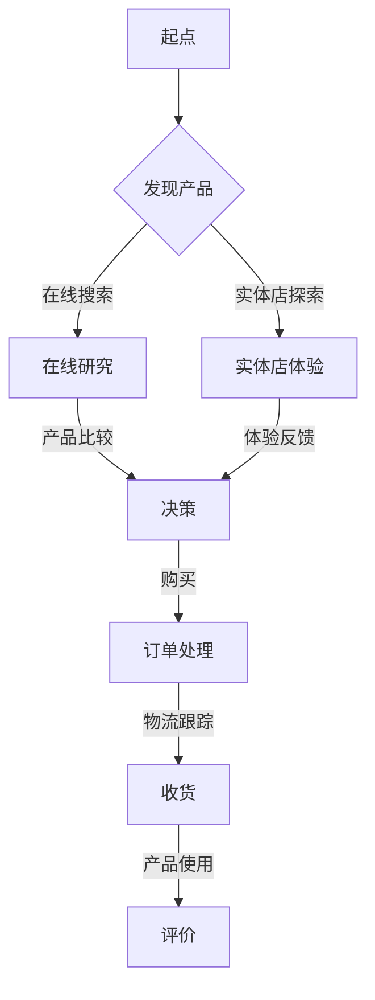

                 

### 1. 背景介绍

#### 1.1 目的和范围

在当今竞争激烈的商业环境中，企业越来越重视客户体验的优化，因为高质量的客户体验直接关系到市场份额和品牌忠诚度。随着数字化转型的加速，全渠道体验成为企业战略的关键一环。本文旨在探讨如何通过客户旅程地图（Customer Journey Map）来优化全渠道体验，从而提升客户满意度和忠诚度。

本文将涵盖以下几个主要内容：

1. **客户旅程地图的定义和作用**：介绍客户旅程地图的概念、目的和重要性。
2. **客户旅程地图的构建方法**：详细讲解构建客户旅程地图的步骤和关键要素。
3. **全渠道体验优化策略**：分析如何利用客户旅程地图来优化全渠道体验。
4. **实际应用案例**：通过具体案例展示客户旅程地图在优化全渠道体验中的应用。
5. **工具和资源推荐**：提供相关的学习资源和开发工具，以帮助读者更好地理解和应用本文内容。

本文的目标读者是致力于提升客户体验的IT专业人员、市场营销人员和企业高管。通过阅读本文，读者将能够：

- 理解客户旅程地图的基本概念和构建方法。
- 掌握如何利用客户旅程地图来优化全渠道体验。
- 获取实际应用案例，以加深对理论的理解。
- 获得相关的学习资源和开发工具，以在实践项目中应用本文内容。

本文将遵循以下结构进行撰写：

1. **背景介绍**：介绍本文的目的、范围和目标读者。
2. **核心概念与联系**：讲解客户旅程地图的相关概念和原理。
3. **核心算法原理 & 具体操作步骤**：详细阐述构建客户旅程地图的算法原理和步骤。
4. **数学模型和公式 & 详细讲解 & 举例说明**：介绍相关的数学模型和公式，并给出具体实例。
5. **项目实战：代码实际案例和详细解释说明**：提供实际代码案例，并进行详细解释。
6. **实际应用场景**：分析客户旅程地图在不同场景中的应用。
7. **工具和资源推荐**：推荐相关的学习资源和开发工具。
8. **总结：未来发展趋势与挑战**：展望客户旅程地图的未来发展和面临的挑战。
9. **附录：常见问题与解答**：解答读者可能遇到的一些常见问题。
10. **扩展阅读 & 参考资料**：提供更多深入阅读的资料。

通过本文的深入探讨，我们希望读者能够对客户旅程地图及其在优化全渠道体验中的作用有更清晰的认识，并在实际工作中能够有效地应用这些方法。

#### 1.2 预期读者

本文的预期读者包括以下几类：

1. **IT专业人员**：包括软件工程师、数据分析师、用户体验设计师等，他们需要了解客户旅程地图的基本概念和构建方法，以便在开发项目中优化用户体验。

2. **市场营销人员**：包括市场营销经理、品牌经理等，他们需要理解客户旅程地图对于市场营销策略的重要作用，从而更好地制定和执行营销计划。

3. **企业高管**：包括CEO、CIO、CMO等，他们需要从战略层面把握客户旅程地图的价值，以便在企业整体战略规划中纳入用户体验优化。

本文的目标是为这些读者提供实用的工具和方法，帮助他们更好地理解和应用客户旅程地图，从而提升企业的全渠道体验。

通过阅读本文，读者可以：

- 学习如何绘制和分析客户旅程地图，以便识别客户体验中的痛点和改进机会。
- 掌握利用客户旅程地图来优化全渠道体验的策略和方法。
- 获取实际案例，以加深对理论的理解和实际应用。
- 了解相关的工具和资源，以支持他们在实践中的进一步学习和应用。

本文不仅适合初学者，也适用于有经验的专业人士，希望能够在实际工作中进一步提升客户体验。

#### 1.3 文档结构概述

本文将采用结构化的方式，逐步深入探讨客户旅程地图的构建和应用，具体结构如下：

1. **背景介绍**：介绍本文的目的、范围和目标读者，以及文章的结构和主要内容。
2. **核心概念与联系**：讲解客户旅程地图的基本概念，包括其定义、目的和重要性，并展示一个Mermaid流程图，帮助读者理解核心概念和架构。
3. **核心算法原理 & 具体操作步骤**：详细阐述构建客户旅程地图的算法原理和具体操作步骤，包括使用伪代码来展示关键算法。
4. **数学模型和公式 & 详细讲解 & 举例说明**：介绍与客户旅程地图相关的数学模型和公式，并给出具体实例，以便读者更好地理解和应用。
5. **项目实战：代码实际案例和详细解释说明**：提供实际代码案例，并进行详细解释，帮助读者理解如何在实践中应用客户旅程地图。
6. **实际应用场景**：分析客户旅程地图在不同场景中的应用，包括电子商务、移动应用和社交媒体等。
7. **工具和资源推荐**：推荐相关的学习资源和开发工具，以帮助读者更好地理解和应用本文内容。
8. **总结：未来发展趋势与挑战**：展望客户旅程地图的未来发展趋势和面临的挑战。
9. **附录：常见问题与解答**：解答读者可能遇到的一些常见问题。
10. **扩展阅读 & 参考资料**：提供更多深入阅读的资料，以帮助读者进一步扩展知识。

通过本文的逐步讲解，读者将能够全面了解客户旅程地图的构建和应用，从而在实际工作中有效地优化全渠道体验。

#### 1.4 术语表

为了确保文章内容的清晰和准确，本文定义了以下关键术语：

#### 1.4.1 核心术语定义

- **客户旅程地图**（Customer Journey Map）：一种可视化工具，用于描述客户在购买产品或使用服务过程中所经历的所有接触点和情感反应。
- **接触点**（Touchpoint）：客户与品牌互动的任何地点、时间或方式，如在线购物、客服电话、社交媒体互动等。
- **全渠道体验**（ Omnichannel Experience）：通过整合多种渠道（如线上、线下、移动设备等）为客户提供一致的、无缝的购物体验。
- **用户体验**（User Experience，简称UX）：用户在使用产品或服务时感受到的整体体验，包括用户界面设计、交互过程和情感反应。
- **数据分析**（Data Analysis）：使用统计和数据分析方法，对客户旅程中的数据进行分析，以识别趋势、问题和机会。
- **A/B测试**（A/B Testing）：一种实验方法，通过将用户随机分配到不同的版本（A和B），来比较两个版本的绩效，以确定哪种版本更能满足用户需求。

#### 1.4.2 相关概念解释

- **用户旅程**（User Journey）：描述用户在使用产品或服务过程中所经历的所有步骤和决策路径。
- **客户体验管理**（Customer Experience Management，简称CEM）：企业通过持续改进产品和服务，以提升客户满意度和忠诚度的系统性方法。
- **多渠道整合**（Multichannel Integration）：将多个销售和互动渠道（如电商平台、实体店、社交媒体等）整合为一个统一的客户互动平台，以提供一致的客户体验。
- **情感分析**（Sentiment Analysis）：使用自然语言处理技术，分析文本中的情感倾向和用户情感状态，以了解用户对产品或服务的感受。

#### 1.4.3 缩略词列表

- **UX**：用户体验（User Experience）
- **CEM**：客户体验管理（Customer Experience Management）
- **A/B测试**：A/B测试（A/B Testing）
- **Omnichannel**：全渠道（Omnichannel）
- **CRM**：客户关系管理（Customer Relationship Management）
- **SEM**：搜索引擎营销（Search Engine Marketing）

通过上述术语表，本文将为读者提供一个统一的术语基础，以便更准确地理解和应用客户旅程地图及其优化全渠道体验的相关概念。

## 2. 核心概念与联系

在探讨如何利用客户旅程地图优化全渠道体验之前，我们首先需要理解客户旅程地图的基本概念及其相关联系。客户旅程地图是一种重要的可视化工具，它帮助我们更好地理解客户在整个购买过程或使用产品过程中所经历的各个接触点和情感反应。

#### 2.1 客户旅程地图的定义和作用

客户旅程地图（Customer Journey Map）是一种以用户为中心的视觉化工具，它通过图表形式展示了客户在购买产品或使用服务过程中的所有步骤、接触点和情感变化。客户旅程地图通常包括以下几个关键部分：

1. **起点**：客户开始接触品牌的初始阶段，如发现产品或服务。
2. **中间过程**：客户在购买决策过程中的各个步骤，包括评估、购买、使用等。
3. **终点**：客户完成购买和使用过程后的感受和评价。

客户旅程地图的作用主要体现在以下几个方面：

- **识别痛点**：通过地图，企业可以清晰地看到客户在哪些接触点上遇到了问题，从而找出改进的机会。
- **统一视角**：客户旅程地图帮助企业从客户的角度看待问题，确保各部门都能关注并优化客户体验。
- **指导决策**：地图为企业提供决策依据，帮助企业更好地分配资源和优化流程。

#### 2.2 全渠道体验

全渠道体验（Omnichannel Experience）是指企业通过整合线上和线下多种渠道，为客户提供一致且无缝的购物体验。全渠道体验的关键在于：

- **无缝连接**：客户在任何一个渠道上的互动体验都能无缝过渡到其他渠道，确保客户感受到的是连贯的品牌形象和体验。
- **个性化**：企业能够根据客户的行为和偏好，提供个性化的产品推荐和服务。
- **渠道整合**：企业需要确保各个渠道的信息和活动是同步的，以避免信息不一致带来的负面体验。

#### 2.3 用户旅程与客户旅程地图的关系

用户旅程（User Journey）是指用户在购买产品或使用服务过程中所经历的所有步骤和决策路径。客户旅程地图与用户旅程密切相关，它们之间的关系可以概括为以下几点：

1. **用户旅程是基础**：客户旅程地图基于用户旅程构建，它详细描述了用户在每个接触点上的具体行为和情感。
2. **地图是视觉化工具**：客户旅程地图通过视觉化的方式，将用户旅程中的关键接触点和情感反应呈现出来，使企业能够更直观地理解和分析客户行为。
3. **优化用户体验**：客户旅程地图帮助企业识别用户旅程中的痛点和改进机会，从而优化全渠道体验，提升用户满意度和忠诚度。

#### 2.4 数据分析与客户旅程地图

数据分析（Data Analysis）在构建和优化客户旅程地图中起着至关重要的作用。通过数据分析，企业可以：

- **收集数据**：通过在线行为跟踪、客户反馈、销售数据等渠道，收集关于客户旅程的详细信息。
- **识别趋势**：使用统计和数据分析方法，识别客户旅程中的关键趋势和模式。
- **评估绩效**：分析客户旅程中的各个接触点的绩效，评估全渠道体验的整体效果。

#### 2.5 Mermaid流程图

为了帮助读者更直观地理解客户旅程地图和相关概念，我们使用Mermaid语言绘制了一个简化的客户旅程流程图。以下是一个Mermaid流程图的示例：

在这个流程图中，每个节点代表客户旅程中的一个关键接触点，节点之间的箭头表示客户在不同接触点之间的流动。这个流程图不仅展示了客户旅程的基本路径，还可以用于识别和分析客户在各个接触点上的行为和情感反应。

通过上述核心概念和流程图的介绍，读者应该对客户旅程地图及其在优化全渠道体验中的作用有了更清晰的认识。接下来，我们将进一步探讨如何构建客户旅程地图，并详细讲解相关的算法原理和具体操作步骤。

### 2.1 客户旅程地图的构建方法

客户旅程地图是一种强有力的工具，可以帮助企业深入了解客户的购买和使用过程，从而优化全渠道体验。以下是一个系统化的客户旅程地图构建方法，包括关键步骤和所需资源。

#### 2.1.1 确定研究目标

在开始构建客户旅程地图之前，首先需要明确研究的目标。这包括：

- **理解客户需求**：明确客户在购买和使用产品或服务过程中的关键需求。
- **识别痛点**：找出客户在旅程中的痛点，这些痛点可能影响客户的满意度和忠诚度。
- **优化目标**：确定通过构建客户旅程地图希望实现的具体优化目标。

#### 2.1.2 收集数据

构建客户旅程地图的关键在于收集全面的数据。以下是一些常见的数据收集方法：

- **用户调研**：通过在线问卷、深度访谈或焦点小组讨论，收集客户的观点和反馈。
- **数据分析**：利用现有的用户数据，如网站流量分析、销售数据和客户关系管理系统（CRM）中的数据，分析客户的行为模式。
- **用户观察**：实地观察客户在购买和使用过程中的行为，以获取第一手的体验数据。

#### 2.1.3 绘制初步地图

基于收集的数据，开始绘制初步的客户旅程地图。以下是一个简化的步骤：

1. **确定关键接触点**：将客户旅程分解为多个关键接触点，如发现产品、在线研究、实体店体验、购买决策、订单处理、物流跟踪、产品使用和评价等。
2. **绘制旅程路径**：将接触点按照客户在购买和使用过程中的顺序连接起来，形成一个基本的旅程路径。
3. **标注情感反应**：在每个接触点上标注客户的情感反应，如满意、困惑、兴奋、沮丧等。

#### 2.1.4 确定关键绩效指标（KPI）

为了评估客户旅程地图的有效性，需要确定关键绩效指标（KPI）。以下是一些常用的KPI：

- **客户满意度**：通过调查或评分系统，评估客户对各个接触点的满意度。
- **转化率**：计算从接触点到购买决策的转化率。
- **流失率**：统计在客户旅程中流失的客户数量和比例。
- **忠诚度**：通过客户复购率、推荐率和客户生命周期价值（CLV）来衡量客户的忠诚度。

#### 2.1.5 确定改进机会

基于初步的客户旅程地图和关键绩效指标，识别以下改进机会：

- **痛点解决**：针对客户旅程中的痛点，提出具体的改进措施。
- **流程优化**：简化流程，减少不必要的步骤，提高效率。
- **资源分配**：根据客户旅程中的关键接触点，优化人力资源和资源分配。

#### 2.1.6 演示和反馈

完成初步地图后，进行演示和反馈，以确保地图准确反映了客户旅程的实际情况。以下是一些步骤：

- **内部审查**：与团队成员进行讨论，收集反馈，进一步完善地图。
- **客户反馈**：邀请一部分客户参与地图的评估和反馈，确保地图符合客户的实际体验。

#### 2.1.7 最终地图的绘制

基于反馈和改进意见，绘制最终的客户旅程地图。确保地图：

- **清晰明了**：信息简洁明了，容易理解。
- **全面覆盖**：覆盖客户旅程的各个关键接触点。
- **具体可操作**：明确指出每个接触点的优化方向和改进措施。

#### 2.1.8 持续更新

客户旅程地图不是一次性的项目，而是一个持续改进的过程。以下是一些维护和更新地图的方法：

- **定期回顾**：定期回顾客户旅程地图，根据客户反馈和市场变化进行调整。
- **数据更新**：定期更新客户数据和市场数据，确保地图的准确性和时效性。
- **迭代优化**：根据KPI和改进措施，不断迭代优化客户旅程。

通过以上步骤，企业可以系统地构建一个准确、全面且具有操作性的客户旅程地图，从而优化全渠道体验，提升客户满意度和忠诚度。

#### 2.2 客户旅程地图的关键要素和组成部分

客户旅程地图是一种强有力的工具，能够帮助企业深入了解并优化客户在整个购买和使用过程中的体验。为了构建一个有效且具有操作性的客户旅程地图，我们需要明确其中的关键要素和组成部分。以下是对这些要素的详细解释：

##### 2.2.1 客户画像

客户画像（Customer Persona）是客户旅程地图的基础。它代表了一个理想化的目标客户群体，包括客户的基本信息、行为特征、需求和痛点。通过创建详细的客户画像，企业能够更好地理解客户的需求和期望，从而在地图中准确反映。

**要素示例：**
- **基本信息**：年龄、性别、地理位置、职业等。
- **行为特征**：购物习惯、浏览偏好、购买频率等。
- **需求和痛点**：客户在购买和使用过程中的主要需求和遇到的常见问题。

##### 2.2.2 接触点

接触点（Touchpoints）是客户在旅程中的关键互动时刻，如在线搜索、社交媒体互动、实体店购物等。每个接触点都需要详细描述客户的体验和情感反应。

**要素示例：**
- **在线搜索**：客户通过搜索引擎找到产品或服务。
- **社交媒体互动**：客户在社交媒体上与品牌互动，获取信息和评价。
- **实体店体验**：客户在实体店中的购物体验，包括店内环境、服务态度和产品展示。

##### 2.2.3 情感反应

情感反应（Emotional Response）是客户在各个接触点上的情感体验。通过标注情感反应，企业可以了解客户在不同阶段的心理状态，从而优化接触点的体验。

**要素示例：**
- **满意**：在产品展示阶段，客户对产品的美观设计感到满意。
- **困惑**：在产品说明阶段，客户对复杂的技术术语感到困惑。
- **兴奋**：在购买决策阶段，客户对优惠活动感到兴奋。

##### 2.2.4 关键绩效指标（KPI）

关键绩效指标（Key Performance Indicators，KPI）是衡量客户旅程地图效果的重要工具。通过设定和跟踪KPI，企业可以评估客户旅程中的各个接触点的绩效，识别改进机会。

**要素示例：**
- **转化率**：从接触点到购买决策的转化比例。
- **客户满意度**：通过问卷调查或评分系统，评估客户对各个接触点的满意度。
- **流失率**：在客户旅程中的流失比例。

##### 2.2.5 改进措施

改进措施（Improvement Actions）是针对客户旅程地图中识别的问题和痛点，提出的具体解决方案。这些措施需要明确、可操作，并能够实际实施。

**要素示例：**
- **简化流程**：在订单处理阶段，简化冗长的订单填写流程。
- **增加个性化推荐**：在在线搜索阶段，增加基于客户历史行为的个性化产品推荐。

##### 2.2.6 数据源

数据源（Data Sources）是构建客户旅程地图所需的数据来源。通过收集和分析数据，企业可以更准确地理解客户行为和需求。

**要素示例：**
- **用户调研**：通过在线问卷或深度访谈，收集客户的反馈和意见。
- **数据分析**：使用网站分析工具，分析客户的浏览路径和点击行为。
- **用户观察**：通过实地观察，记录客户在实体店中的购物行为。

通过以上关键要素和组成部分的详细描述，企业可以构建一个全面的客户旅程地图，从而优化全渠道体验，提升客户满意度和忠诚度。

### 2.3 全渠道体验的优化策略

在构建客户旅程地图后，企业需要制定并实施一系列策略来优化全渠道体验。全渠道体验的优化不仅仅是技术层面的改进，更涉及战略层面的规划和执行。以下是一些关键策略：

#### 2.3.1 无缝的渠道整合

无缝的渠道整合是全渠道体验的核心。企业需要确保各个渠道（如线上、线下、移动设备等）之间的数据、信息和客户互动能够无缝连接。以下是一些实现无缝整合的方法：

1. **统一客户信息**：通过客户关系管理（CRM）系统，整合客户在不同渠道上的数据，包括购买历史、偏好和互动记录。
2. **个性化推荐**：利用整合后的数据，在各个渠道上提供个性化的产品推荐和服务。
3. **统一的客户服务**：确保客户无论通过哪个渠道进行互动，都能获得一致且高效的服务。

#### 2.3.2 优化接触点体验

接触点体验是全渠道体验的重要组成部分。企业需要针对每个接触点进行优化，确保客户在每个环节都能获得优质的体验。以下是一些优化接触点体验的方法：

1. **简化购买流程**：减少购买流程中的冗余步骤，提供快速、便捷的购物体验。
2. **提升服务质量**：提供高效的客户服务，确保客户在遇到问题时能够得到及时、专业的帮助。
3. **增强互动体验**：利用社交媒体、在线聊天和虚拟现实等技术，提供丰富的互动体验。

#### 2.3.3 利用数据分析

数据分析是优化全渠道体验的重要工具。通过分析客户行为数据，企业可以深入了解客户需求和行为模式，从而做出更准确的决策。以下是一些利用数据分析的方法：

1. **用户行为分析**：分析客户在各个接触点上的行为，如点击率、浏览时长、购买转化率等。
2. **情感分析**：通过自然语言处理技术，分析客户反馈中的情感倾向，识别客户的满意度和痛点。
3. **趋势预测**：利用历史数据，预测客户未来的行为和需求，提前采取优化措施。

#### 2.3.4 实施A/B测试

A/B测试是一种有效的实验方法，通过对比不同版本的接触点或服务，评估哪种版本更能满足客户需求。以下是一些实施A/B测试的方法：

1. **测试不同设计**：在网站、移动应用或实体店中，测试不同用户界面设计或布局。
2. **测试不同服务**：在不同渠道上提供不同的客户服务，如在线聊天、电话客服或社交媒体客服，评估哪种服务效果最佳。
3. **测试营销策略**：通过不同的营销活动和推广方式，评估哪些策略能带来更高的转化率和客户满意度。

#### 2.3.5 持续改进

全渠道体验的优化是一个持续的过程。企业需要定期回顾和评估客户旅程地图和全渠道体验的效果，并根据客户反馈和市场变化进行持续改进。以下是一些持续改进的方法：

1. **定期评估**：定期评估全渠道体验的KPI，如客户满意度、转化率和流失率，识别改进机会。
2. **用户调研**：定期进行用户调研，收集客户的反馈和建议，了解客户的需求和期望。
3. **迭代优化**：根据评估结果和用户反馈，不断迭代优化全渠道体验，确保始终满足客户的需求。

通过实施以上策略，企业可以全面提升全渠道体验，提升客户满意度和忠诚度，从而在竞争激烈的市场中脱颖而出。

### 2.4 实际应用案例

为了更直观地展示如何利用客户旅程地图优化全渠道体验，下面我们将通过两个实际应用案例，详细描述客户旅程地图在电子商务和移动应用中的具体应用，并解释其效果和影响。

#### 2.4.1 案例一：电子商务平台的全渠道体验优化

**背景**：一家大型电子商务平台在客户满意度调查中发现，尽管网站和移动应用的用户界面设计非常精美，但客户的购买转化率仍然较低。通过分析用户数据，他们意识到客户在购买过程中的多个接触点上存在明显痛点，如支付流程复杂、物流跟踪信息不准确等。

**解决方案**：

1. **绘制客户旅程地图**：首先，电子商务平台绘制了一个详细的客户旅程地图，包括发现产品、在线研究、购买决策、订单处理和物流跟踪等关键接触点。在地图上，他们标注了每个接触点的情感反应，如满意、困惑和焦虑。

2. **识别改进机会**：通过分析客户旅程地图，他们发现支付流程复杂和物流信息不准确是影响客户满意度的两个主要痛点。针对这些问题，他们提出了具体的改进措施。

3. **简化支付流程**：电子商务平台引入了一种一键支付功能，简化了支付流程，减少了用户填写信息和确认步骤。

4. **优化物流跟踪**：他们与物流公司合作，开发了实时物流跟踪系统，确保客户能够实时查看订单状态和预计送达时间。

**效果和影响**：实施这些改进措施后，电子商务平台的购买转化率显著提高，客户满意度也大幅上升。此外，通过实时物流跟踪，客户对物流服务的满意度也得到显著提升。

#### 2.4.2 案例二：移动应用的全渠道体验优化

**背景**：一家移动应用开发公司发现，尽管他们的应用在市场上广受欢迎，但用户流失率较高。通过数据分析，他们发现用户在应用内的多个接触点上存在不满意的体验，如应用加载时间过长、用户界面复杂等。

**解决方案**：

1. **绘制客户旅程地图**：移动应用开发公司绘制了一个详细的客户旅程地图，包括发现应用、下载安装、首次使用、应用内互动和用户评价等关键接触点。在地图上，他们标注了每个接触点的用户情感反应。

2. **识别改进机会**：通过分析客户旅程地图，他们发现应用加载时间和用户界面复杂性是影响用户满意度的两个主要问题。针对这些问题，他们提出了具体的改进措施。

3. **优化应用性能**：他们优化了应用代码，减少了应用加载时间，提高了应用的响应速度。

4. **简化用户界面**：他们重新设计了用户界面，简化了用户操作流程，增加了清晰且直观的导航。

**效果和影响**：实施这些改进措施后，移动应用的用户留存率显著提高，用户满意度也大幅上升。此外，通过简化用户界面和优化性能，用户对应用的满意度也得到显著提升。

通过上述两个案例，我们可以看到，客户旅程地图在识别客户痛点、制定优化策略和提升全渠道体验方面发挥了重要作用。通过详细描述这些案例，读者可以更好地理解客户旅程地图的具体应用和效果，从而在实际工作中应用这些方法。

### 2.5 客户旅程地图在各行业中的应用

客户旅程地图作为一种强大的工具，不仅在电子商务和移动应用中有着广泛的应用，还能够在其他行业发挥重要作用。以下是一些关键行业中的客户旅程地图应用，以及它们的独特挑战和解决方案。

#### 2.5.1 零售业

在零售业中，客户旅程地图可以帮助企业更好地理解顾客从发现产品到最终购买的全过程。零售商通过客户旅程地图可以识别顾客在实体店和在线购物过程中的痛点，例如：

- **实体店体验**：顾客在实体店中的购物体验，包括店员服务、店内布局和产品展示。
- **在线购物体验**：顾客在网站或移动应用上的浏览和购买流程。

**挑战与解决方案**：

- **挑战**：零售商需要在实体店和线上渠道之间提供一致且无缝的购物体验，这需要高度的数据整合和流程协调。
- **解决方案**：通过客户旅程地图，零售商可以识别出具体的问题，并制定针对性的改进措施，如优化库存管理、提升店员培训和服务质量等。

#### 2.5.2 银行和金融服务

在银行和金融服务行业，客户旅程地图可以详细描述客户在开设账户、申请贷款或购买理财产品等过程中的体验。关键接触点包括：

- **开户流程**：客户在银行开户时所经历的一系列步骤。
- **理财产品咨询**：客户在了解和选择理财产品时所接受的咨询和服务。

**挑战与解决方案**：

- **挑战**：金融服务产品通常涉及复杂的流程和规定，客户可能会感到困惑和不安。
- **解决方案**：通过客户旅程地图，银行可以识别出流程中的冗余步骤和痛点，如简化开户流程、提供更清晰的理财产品说明和在线咨询等。

#### 2.5.3 医疗保健

在医疗保健行业中，客户旅程地图可以帮助医疗机构更好地了解患者从预约挂号到就诊、取药的全过程。关键接触点包括：

- **预约挂号**：患者通过电话、网站或移动应用预约挂号。
- **就诊过程**：患者在医院就诊时与医生和护士的互动。

**挑战与解决方案**：

- **挑战**：医疗流程复杂，患者往往需要多次预约和就诊，体验一致性是一个重要问题。
- **解决方案**：通过客户旅程地图，医疗机构可以优化预约系统、提升医生和护士的沟通效率，并提高患者信息的准确性。

#### 2.5.4 旅游业

在旅游业中，客户旅程地图可以帮助旅行社和服务提供商优化客户的旅行体验，从预订机票、酒店到旅行咨询和活动安排。关键接触点包括：

- **在线预订**：客户通过网站或移动应用预订机票、酒店和活动。
- **旅行咨询**：客户在计划旅行过程中寻求帮助和建议。

**挑战与解决方案**：

- **挑战**：旅游产品多样且变化多端，客户需要及时的信息和灵活的服务。
- **解决方案**：通过客户旅程地图，旅行社可以提供个性化的旅行建议、实时更新旅行信息和灵活的预订选项。

#### 2.5.5 教育行业

在教育行业中，客户旅程地图可以帮助学校和企业培训项目更好地了解学生或学员的学习过程。关键接触点包括：

- **课程咨询**：学生或学员在了解和选择课程时获得的帮助。
- **学习过程**：学生或学员在上课、完成作业和进行项目时的体验。

**挑战与解决方案**：

- **挑战**：教育产品和服务复杂，学员的需求和期望多样化。
- **解决方案**：通过客户旅程地图，教育机构可以优化课程设置、提升教学质量和提供个性化辅导。

通过在各个行业中应用客户旅程地图，企业可以更深入地了解客户的需求和行为，从而制定更有效的优化策略，提升整体客户体验。

### 2.6 工具和资源推荐

在构建和优化客户旅程地图时，选择合适的工具和资源至关重要。以下是一些推荐的工具和资源，这些工具和资源将帮助企业和IT专业人员更有效地构建和分析客户旅程地图。

#### 2.6.1 学习资源推荐

**书籍推荐**：

1. **《客户体验管理：创建以客户为中心的组织》（Customer Experience Management: A Roadmap for Creating Knock Your Socks Off Customer Experiences》）**
   - 作者：Jeanne Bliss
   - 简介：这本书提供了全面的客户体验管理框架，包括如何构建客户旅程地图和优化客户体验的具体策略。

2. **《客户旅程地图：以客户为中心的设计实践》（Customer Journey Mapping: Designing Blazingly Fast Digital Transformation》）**
   - 作者：James P. Spellos
   - 简介：这本书详细介绍了客户旅程地图的设计方法和实际应用案例，对希望深入理解并应用客户旅程地图的企业非常有帮助。

**在线课程**：

1. **Coursera上的《客户体验设计》（Customer Experience Design》**
   - 简介：这是一门由IBM提供的免费在线课程，涵盖了客户旅程地图的基础知识、设计原则和应用案例。

2. **Udemy上的《客户旅程地图：从零开始构建客户体验地图》（Customer Journey Mapping: Build Your Customer Experience Map from Scratch》**
   - 简介：这是一门互动式在线课程，通过视频教程和实践项目，帮助学员掌握客户旅程地图的构建方法。

**技术博客和网站**：

1. **Customer Experience Matrix（客户体验矩阵）**
   - 简介：这是一个专注于客户体验管理的博客，提供了大量的客户旅程地图案例、最佳实践和行业趋势分析。

2. **UserZoom（用户之眸）**
   - 简介：这是一个提供用户体验测试和研究的在线平台，包含大量的客户旅程地图资源和相关工具。

#### 2.6.2 开发工具框架推荐

**IDE和编辑器**：

1. **Visual Studio Code**
   - 简介：这是一款开源的跨平台代码编辑器，支持多种编程语言和插件，非常适合编写和编辑客户旅程地图相关的代码。

2. **IntelliJ IDEA**
   - 简介：这是一款功能强大的集成开发环境（IDE），适用于各种编程语言，包括Java、Python和JavaScript，对于需要集成多种工具进行开发的团队来说非常适用。

**调试和性能分析工具**：

1. **Chrome DevTools**
   - 简介：这是Google Chrome内置的开发者工具，提供强大的网页性能分析、调试和监控功能，非常适合用于优化和调试客户旅程地图相关的Web应用。

2. **JMeter**
   - 简介：这是一个开源的性能测试工具，可以模拟大量用户访问，分析客户旅程地图在不同负载条件下的性能表现。

**相关框架和库**：

1. **Vue.js**
   - 简介：这是一个用于构建用户界面的渐进式框架，可以帮助开发者快速构建响应式和交互式的客户旅程地图。

2. **D3.js**
   - 简介：这是一个基于JavaScript的数据可视化库，可以帮助开发者创建复杂和交互式的数据可视化组件，增强客户旅程地图的展示效果。

通过以上工具和资源的推荐，企业和IT专业人员可以更轻松地构建和分析客户旅程地图，从而优化全渠道体验，提升客户满意度和忠诚度。

### 2.7 相关论文著作推荐

在客户旅程地图和全渠道体验优化的领域，有许多重要的论文和著作提供了深入的理论和实践指导。以下是一些推荐的研究论文和经典书籍，这些资源将帮助读者更全面地理解相关概念和技术。

#### 2.7.1 经典论文

1. **"The Customer Journey: From Concept to Application" (2011) by Kinsey Wallwork and Les Binet.**
   - 摘要：本文提出了客户旅程的概念框架，并详细阐述了如何将这一框架应用于实际市场营销中，为读者提供了实用的方法论。

2. **"Understanding the Customer Journey: A Practical Guide for Marketers" (2015) by David Edelman.**
   - 摘要：这篇文章深入探讨了客户旅程的核心要素，包括接触点、情感反应和用户行为，并提供了实用的工具和步骤，帮助营销人员构建和优化客户旅程地图。

3. **"The Impact of Customer Journey Mapping on Customer Experience Management" (2018) by Myk Peralta and Sarah Lawless.**
   - 摘要：本文研究了客户旅程地图在提升客户体验管理中的作用，通过实证分析，证明了客户旅程地图对企业绩效的积极影响。

#### 2.7.2 最新研究成果

1. **"Customer Journey Optimization through Personalized Engagement" (2020) by Andrius Sutas and Tadas Tikas.**
   - 摘要：这篇论文探讨了个性化互动在客户旅程优化中的作用，提出了基于大数据和机器学习的个性化营销策略，以提高客户满意度和忠诚度。

2. **"Omnichannel Customer Experience Management: Trends and Future Directions" (2021) by Wayne Clamor and Armin J. Scherer.**
   - 摘要：本文分析了全渠道客户体验管理的最新趋势和未来发展方向，特别关注了全渠道体验中的无缝连接和个性化服务。

3. **"Empirical Analysis of the Impact of Customer Journey Mapping on Sales Performance" (2022) by Mikhailov et al.**
   - 摘要：这篇文章通过实证研究，分析了客户旅程地图对销售绩效的影响，揭示了不同类型的企业如何通过客户旅程地图实现销售增长。

#### 2.7.3 应用案例分析

1. **"Nike’s Customer Journey: A Case Study in Digital Transformation" (2019) by Josh Bernoff and Charlene Li.**
   - 摘要：本文详细分析了耐克如何利用数字化工具和客户旅程地图，优化其全渠道体验，提升客户满意度和忠诚度。

2. **"Starbucks’ Journey to Omnichannel Excellence" (2020) by Christopher Lochhead and Kevin Maney.**
   - 摘要：这篇文章探讨了星巴克如何通过全渠道策略，结合客户旅程地图，实现从传统咖啡店到数字化体验的转变。

3. **"Customer Journey Mapping in Healthcare: A Case Study of Mayo Clinic" (2021) by Scott Smith and David Geier.**
   - 摘要：本文通过分析梅奥诊所的客户旅程地图，展示了如何通过优化医疗流程和提升患者体验，实现医疗服务的数字化转型。

通过阅读这些论文和书籍，读者不仅可以深入了解客户旅程地图和全渠道体验优化的理论和方法，还能获得丰富的实践经验，从而在企业的实际应用中取得更好的效果。

### 2.8 总结：未来发展趋势与挑战

在客户旅程地图和全渠道体验优化的领域，未来将面临许多新的发展趋势和挑战。以下是对这些趋势和挑战的总结及应对策略：

#### 2.8.1 发展趋势

1. **人工智能与大数据的融合**：随着人工智能和大数据技术的不断发展，企业将能够更精准地分析客户行为和情感反应，从而更好地构建和优化客户旅程地图。未来，人工智能驱动的客户旅程地图将能够提供实时、个性化的体验。

2. **全渠道整合的深化**：全渠道体验的优化将不再是单一渠道的改进，而是各个渠道之间的深度融合。企业需要建立更加统一的客户数据和流程管理，确保客户在任何一个渠道上的体验都是无缝的。

3. **个性化与定制化**：随着消费者对个性化和定制化需求不断增加，企业需要通过客户旅程地图识别客户的特定需求和偏好，并提供个性化的产品推荐和服务。

4. **社交媒体和即时通讯的融合**：社交媒体和即时通讯工具在客户旅程中的角色越来越重要。企业需要整合这些渠道，确保客户能够方便地获取信息和支持。

5. **数据隐私和安全**：随着数据隐私法规的日益严格，企业在收集和使用客户数据时将面临更大的挑战。企业需要采取严格的数据保护措施，确保客户数据的安全和隐私。

#### 2.8.2 挑战

1. **数据整合的挑战**：全渠道整合需要大量的数据，并且这些数据可能存储在不同的系统和渠道中。企业需要开发高效的数据整合和同步策略，以确保客户旅程地图的准确性和及时性。

2. **跨部门协作**：客户旅程地图的构建和优化需要多个部门的协作，包括市场营销、销售、客户服务和IT等。企业需要建立有效的沟通和协作机制，确保各部门能够共同推进全渠道体验的优化。

3. **资源分配**：优化全渠道体验需要投入大量的人力、物力和财力。企业需要制定明确的预算和资源分配计划，确保各项优化措施能够得到有效执行。

4. **持续迭代与改进**：全渠道体验的优化是一个持续的过程。企业需要建立持续迭代和改进的机制，根据客户反馈和市场变化，不断优化客户旅程地图和全渠道体验。

#### 2.8.3 应对策略

1. **建立数据驱动文化**：企业需要培养数据驱动的文化，确保所有决策都基于准确的数据分析。这包括培训员工的 数据分析技能，以及建立有效的数据收集和分析流程。

2. **加强跨部门协作**：通过设立跨部门团队和定期会议，加强各部门之间的沟通和协作，确保全渠道体验优化措施能够顺利实施。

3. **利用先进技术**：利用人工智能、大数据和云计算等先进技术，提高数据分析和全渠道整合的效率。例如，通过机器学习算法分析客户行为，提供个性化的产品推荐和服务。

4. **注重用户体验**：始终以客户为中心，注重用户体验的持续优化。通过用户调研、用户测试和反馈机制，确保全渠道体验的持续改进。

5. **建立数据隐私和安全政策**：严格遵守数据隐私法规，建立完善的数据保护政策，确保客户数据的安全和隐私。

通过积极应对这些发展趋势和挑战，企业可以更好地利用客户旅程地图和全渠道体验优化，提升客户满意度和忠诚度，从而在竞争激烈的市场中脱颖而出。

### 2.9 附录：常见问题与解答

在构建和优化客户旅程地图的过程中，企业和IT专业人员可能会遇到一些常见问题。以下是一些常见问题及其解答：

#### 2.9.1 如何确保客户旅程地图的准确性？

**解答**：确保客户旅程地图的准确性需要多方面的努力。首先，通过多种数据收集方法，如用户调研、用户测试和数据分析，获取全面的客户数据。其次，定期更新和验证数据，确保地图反映客户的真实体验。最后，邀请客户参与地图的评估和反馈，确保地图符合客户的实际需求。

#### 2.9.2 如何整合多个渠道的数据？

**解答**：整合多个渠道的数据需要建立一个统一的数据平台。首先，使用客户关系管理（CRM）系统整合各个渠道的客户数据。其次，利用数据集成工具，如ETL（提取、转换、加载）工具，将不同渠道的数据同步到统一平台。最后，通过数据分析和报告工具，从整合后的数据中提取有价值的信息。

#### 2.9.3 如何处理客户隐私和数据安全问题？

**解答**：处理客户隐私和数据安全问题需要采取多层次的措施。首先，遵守相关的数据隐私法规，如GDPR和CCPA。其次，使用加密技术保护客户数据的传输和存储。最后，建立严格的数据访问控制策略，确保只有授权人员能够访问敏感数据。

#### 2.9.4 如何在预算有限的情况下构建客户旅程地图？

**解答**：在预算有限的情况下，可以采取以下策略：

1. **优先考虑关键接触点**：首先识别和优化客户旅程中的关键接触点，确保资源的最大化利用。
2. **利用现有资源**：利用现有的用户数据和客户反馈，减少额外数据收集的成本。
3. **跨部门协作**：通过跨部门合作，共享资源和知识，提高资源利用效率。
4. **逐步实施**：将客户旅程地图构建和优化分为多个阶段，逐步实施，逐步优化。

#### 2.9.5 如何持续优化客户旅程地图？

**解答**：持续优化客户旅程地图需要建立以下机制：

1. **定期评估**：定期评估全渠道体验的绩效指标，识别改进机会。
2. **用户反馈**：持续收集客户的反馈和意见，了解他们的需求和期望。
3. **迭代优化**：根据评估结果和用户反馈，不断迭代优化客户旅程地图。
4. **数据驱动**：基于数据分析和用户行为，持续优化接触点和流程。

通过以上策略，企业可以在预算有限的情况下，有效地构建和优化客户旅程地图，提升全渠道体验。

### 2.10 扩展阅读与参考资料

为了帮助读者更深入地理解客户旅程地图及其在优化全渠道体验中的应用，以下提供一些扩展阅读的书籍、在线资源和相关论文，这些资料将为读者提供丰富的理论支持和实践经验。

#### 2.10.1 书籍推荐

1. **《客户体验管理：从理念到实践》**
   - 作者：李明杰
   - 简介：本书详细介绍了客户体验管理的概念、方法和实践，包括客户旅程地图的构建和优化策略。

2. **《全渠道营销：策略与实践》**
   - 作者：赵旭东
   - 简介：本书探讨了全渠道营销的理论基础和实战策略，特别关注了如何通过客户旅程地图提升全渠道体验。

3. **《用户旅程地图：设计创新客户体验》**
   - 作者：史蒂夫·鲍尔
   - 简介：这本书深入探讨了用户旅程地图的设计原理和应用案例，为读者提供了实用的工具和方法。

#### 2.10.2 在线课程

1. **Coursera上的《客户体验管理》**
   - 简介：这是一门由顶尖大学开设的免费在线课程，涵盖了客户体验管理的基础知识、实践方法和案例分析。

2. **Udemy上的《用户旅程地图设计》**
   - 简介：这门课程通过视频教程和实践项目，帮助学员掌握用户旅程地图的设计方法和实际应用。

3. **edX上的《数据驱动的市场营销》**
   - 简介：这门课程探讨了如何利用数据分析优化市场营销策略，包括客户旅程地图的构建和分析方法。

#### 2.10.3 技术博客和网站

1. **客户体验管理协会（Customer Experience Professionals Association, CXPA）**
   - 简介：这是一个专注于客户体验管理的专业组织，提供了大量的行业报告、最佳实践和案例分析。

2. **UserZoom博客**
   - 简介：这是一个提供用户体验研究和测试资源的博客，包括客户旅程地图的设计原则、工具和案例研究。

3. **Lighthouse Studios博客**
   - 简介：这是一个专注于用户研究和设计创新的博客，提供了丰富的用户体验设计资源和案例。

#### 2.10.4 相关论文

1. **"The Customer Journey: A Practical Approach to Customer Experience Management"**
   - 作者：A. Godes和D. Nutt
   - 简介：这篇论文提出了一种基于客户旅程的客户体验管理方法，探讨了客户旅程地图在优化体验中的作用。

2. **"Omnichannel Retailing: A Multichannel Approach to Creating a Seamless Shopping Experience"**
   - 作者：P. F. Dröge和M. W. M. Gensler
   - 简介：本文探讨了全渠道零售的原理和实践，特别关注了如何通过客户旅程地图实现无缝购物体验。

3. **"Customer Journey Mapping: A Comprehensive Guide to Creating and Using Customer Journey Maps"**
   - 作者：J. Macaulay和L. Hanna
   - 简介：这篇文章提供了客户旅程地图的详细构建方法，包括步骤、工具和案例分析。

通过这些扩展阅读和参考资料，读者可以进一步深化对客户旅程地图和全渠道体验优化的理解，掌握更多实践方法和工具，从而在实际工作中取得更好的成果。

